# Général

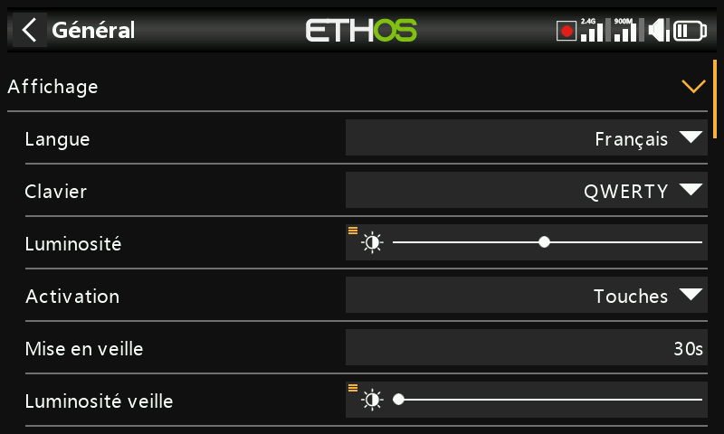

Couvre les attributs d'affichage, l'audio, le vario, le retour haptique et la barre d'outils supérieure.

## Attributs d'affichage

- **Language** — la langue des menus de l'écran (English, 中文, Česky, Deutsch,
  Español, Français, עברית, Italiano, Nederlands, Norsk, Português
  Brasileiro, Polish, Português, et d'autres).
- **Keyboard** — disposition du clavier virtuel : QWERTY, QWERTZ ou AZERTY.
- **Brightness** — un curseur pour la luminosité du rétroéclairage ; un appui
  long sur `ENT` permet de la piloter depuis une source (par exemple un
  curseur, comme dans l'exemple ci-dessous), ou de la forcer au
  minimum/maximum.

  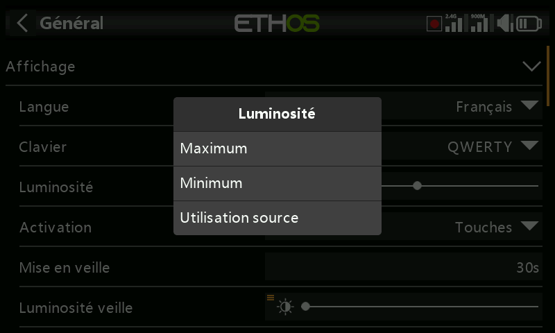
  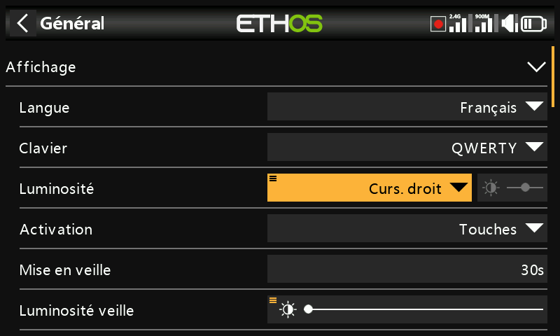

  !!! note
      Si **Brightness** est égal à **Sleep mode brightness**, l'écran tactile
      reste actif même en « veille ».

- **Wake up** — les éléments qui réveillent le rétroéclairage depuis la veille
  (plusieurs peuvent être activés) : **Always on** (jamais de veille),
  **Sticks**, **Switches**, **Gyro** (inclinaison de la radio). Les touches
  la réveillent toujours, quels que soient ces réglages.
- **Sleep** — durée d'inactivité avant l'extinction du rétroéclairage (grisé
  si Wake up est réglé sur Always on).
- **Sleep mode brightness** — luminosité du rétroéclairage pendant la veille.
- **Dark mode** — thème d'affichage clair ou sombre.
- **Highlight Color** — la couleur d'accentuation de l'interface (par défaut
  `#F8B038`).

## Réglages audio {: #audio-settings }

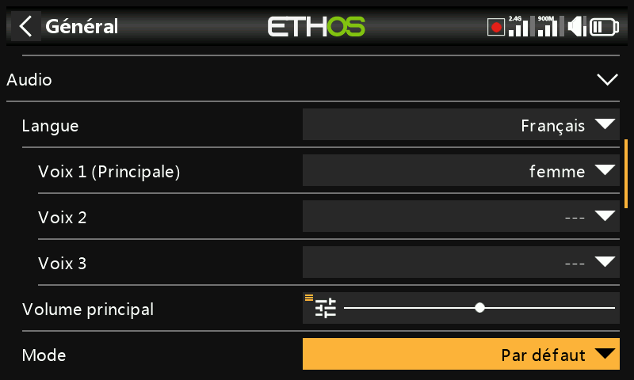

- **Audio language** — langue des annonces vocales.
- **Choix des voix** — Ethos prend en charge plusieurs packs vocaux
  simultanés :

  - **Voice 1 (main)** — utilisée pour toutes les annonces système intégrées.
    Pour l'anglais, le choix par défaut se fait entre les packs américain
    (`us`) et britannique (`gb`), lus depuis `audio/en/us/system` et
    `audio/en/gb/system`. Les fichiers sonores de l'utilisateur pour la
    [fonction spéciale Play Audio](../model-setup/special-functions.md) se
    placent respectivement dans `audio/en/us/` ou `audio/en/gb/`.
  - **Voice 2 / Voice 3** — packs supplémentaires, par exemple une voix TTS
    personnalisée. Chacun nécessite la même structure de dossiers que Voice 1
    — par exemple une voix nommée « Susan » nécessite `audio/en/Susan/` pour
    les sons de l'utilisateur et `audio/en/Susan/system` pour ses sons système
    (chaque voix a besoin d'un dossier `/system`, puisque c'est là que
    **Play Value** et les annonces de chronomètre vont chercher leurs sons ;
    une liste `.csv` des fichiers sonores système standard est fournie avec
    chaque version audio). Une fois installée, une voix peut être affectée par
    chronomètre et par fonction Play Audio — ou même définie comme Voice 1
    pour remplacer purement et simplement les annonces système.
  - **Voice « default »** — installée automatiquement comme solution de repli
    sûre (et utilisée pour éviter les problèmes de conversion depuis les
    installations 1.4.x) : si Voice 1 n'est pas déjà définie lors d'une
    installation ou d'une mise à jour, elle est réglée sur `default`, avec
    lecture depuis `audio/en/default/system`. Les fichiers sonores
    personnalisés fréquemment demandés pour Play Audio se trouvent dans
    `audio/en/default/`.

- **Main volume** — un curseur pour le volume audio général (appui long sur
  `ENT` pour le piloter depuis un potentiomètre) ; des bips sont émis pendant
  le réglage afin de juger le niveau à l'oreille.
- **Audio mode** :
  - **Silent** — aucun son (déclenche tout de même l'[alerte de mode
    silencieux](alerts.md) au démarrage, si elle est activée).
  - **Alarms only** — seules les alarmes sont audibles.
  - **Default** — sons normaux.
  - **Often** — ajoute des bips d'erreur lorsqu'une valeur est poussée au-delà
    de son minimum/maximum.
  - **Always** — ajoute des bips pour la navigation ordinaire dans les menus,
    en plus de Often.
  - **Bluetooth** (X20S/HD/Pro/R/RS uniquement) — relaie l'audio vers un
    appareil Bluetooth appairé (casque, etc.). Choisissez **Search Devices**,
    mettez l'appareil cible en mode d'appairage, puis sélectionnez-le dès
    qu'il est trouvé :

    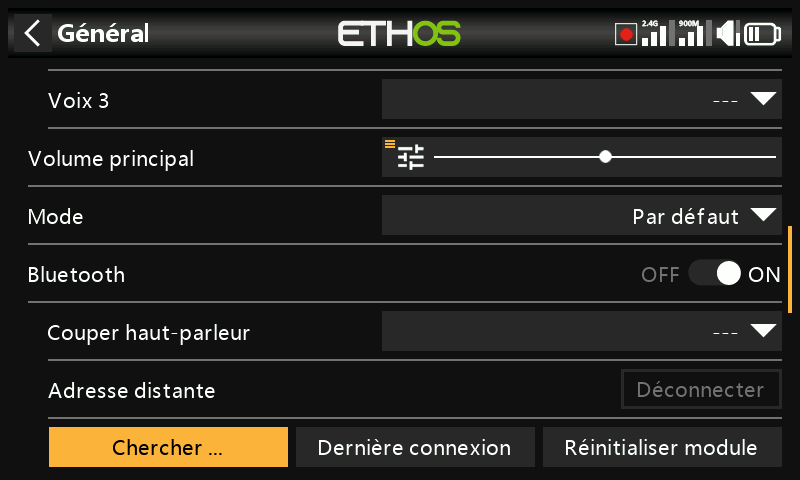
    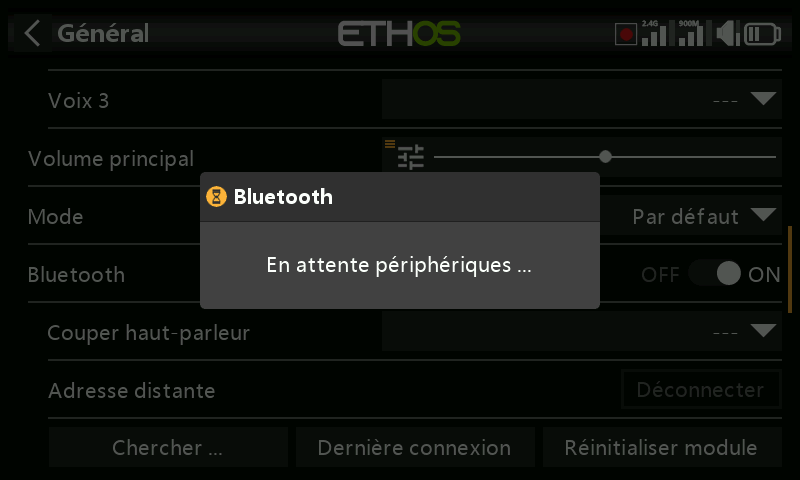
    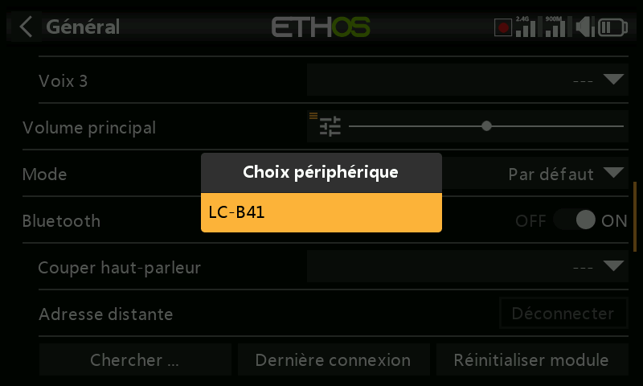
    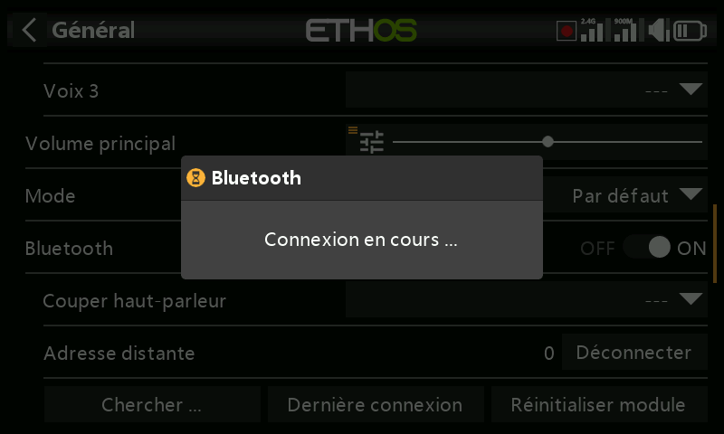
    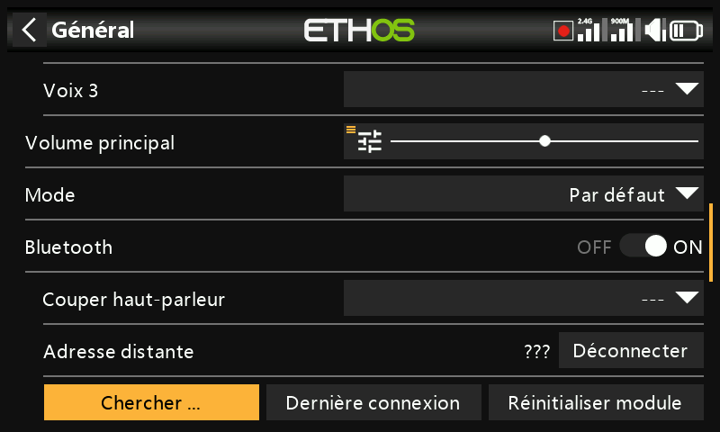

    **Speaker mute** contrôle alors le haut-parleur intégré — toujours actif,
    uniquement lorsque la télémétrie est active, ou piloté par une source (par
    exemple un interrupteur). La radio mémorise l'appareil appairé ; pour un
    fonctionnement normal, allumez la radio avant l'appareil Bluetooth, et
    laissez quelques secondes après la connexion pour que la coupure du
    haut-parleur se réactive.

## Vario

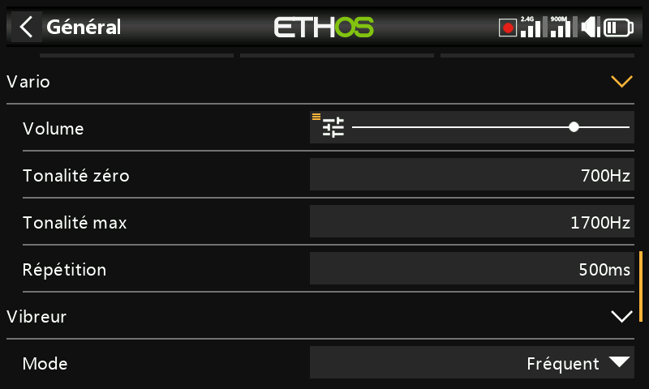

- **Volume** — volume relatif de la tonalité du vario.
- **Pitch zero** — hauteur de la tonalité à taux de montée nul.
- **Pitch max** — hauteur de la tonalité au taux de montée maximal.
- **Repeat** — délai entre les bips à la hauteur zéro.

Voir également le capteur VSpeed dans
[Télémétrie](../model-setup/telemetry.md) et la [fonction spéciale Play
Vario](../model-setup/special-functions.md) pour d'autres comportements du
vario.

## Haptique

- **Strength** — un curseur pour l'intensité des vibrations.
- **Mode** — le même ensemble d'options que Audio mode ci-dessus.

## Emplacement de stockage (X18 et X20 Pro/R/RS) {: #storage-location-x18-and-x20-prorrs }

Ces radios possèdent une mémoire eMMC interne de 8 Go. Par défaut, Ethos
l'utilise, ce qui rend la SD card facultative — mais vous pouvez sélectionner
l'eMMC, une SD card, ou une combinaison des deux. Si vous déplacez le système
et les modèles vers une SD card, copiez les dossiers/fichiers concernés (y
compris l'audio et les images) **avant** de changer l'emplacement de stockage.

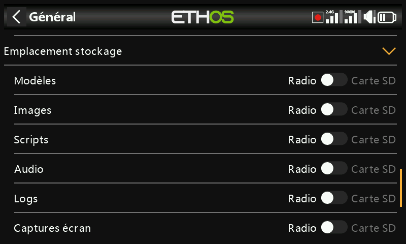

## Barre d'outils supérieure

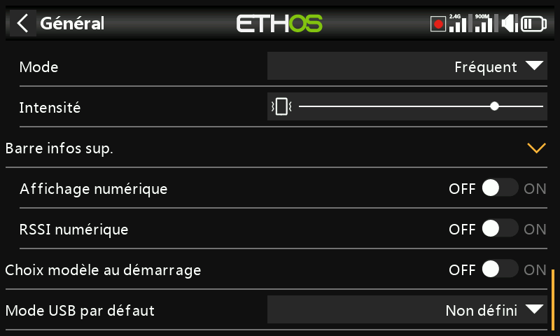

- **Digital voltage** — affiche la tension de la batterie de la radio sous
  forme de valeur numérique plutôt que de barre dans la barre d'outils
  supérieure.
- **Digital RSSI** — idem, pour le RSSI 2,4 GHz et 900 MHz.
- **Select model at power on** — affiche l'écran de choix du modèle au
  démarrage, avant l'apparition des alertes de la liste de vérification du
  modèle précédent, ce qui permet de changer de modèle sans avoir à les
  acquitter d'abord. Le dernier modèle utilisé est mis en évidence par défaut.

  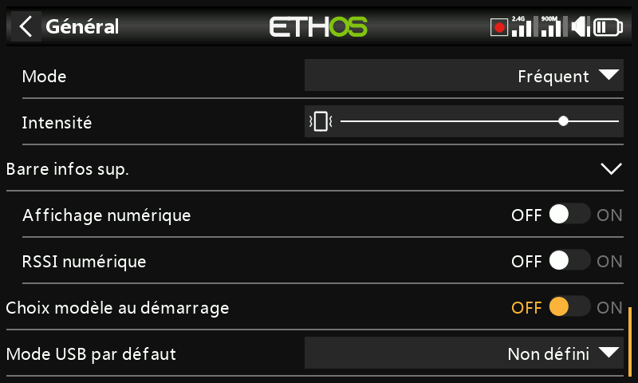

## Présélection du mode USB

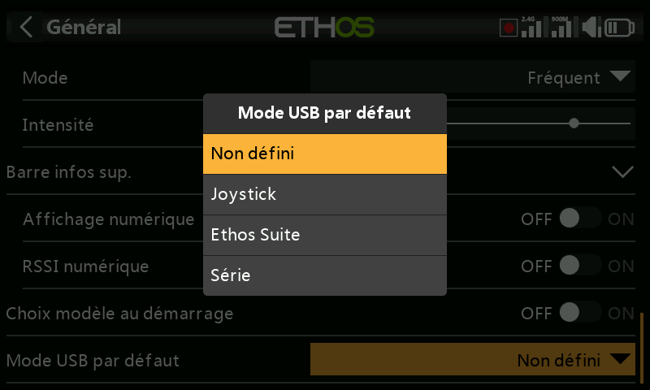

Ce qui se produit automatiquement lorsque la radio est connectée à un PC via
USB :

- **Not set** — demande de choisir au moment de la connexion.
- **Joystick** — passe immédiatement en mode joystick pour un simulateur RC.
- **Ethos Suite** — passe immédiatement en mode Ethos pour [Ethos
  Suite](../ethos-suite/index.md).
- **Serial** — passe immédiatement en mode Serial, en acheminant les traces de
  débogage Lua via USB-Serial à 115200 bps (un pilote de port COM virtuel
  Windows peut être nécessaire).
