---
translated_from: 827e532e2b0324591f0fdbb61a39e61180642b24
---

# Matériel

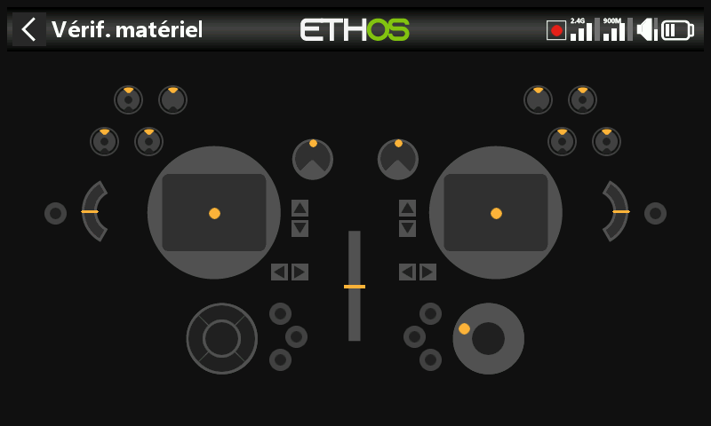

Test et calibration des commandes physiques de la radio, définition des types
d'inters et raccourcis des touches d'accueil.

## Vérification matériel {: #hardware-check }

Sollicite chaque entrée physique afin de vérifier que chacune est
correctement détectée.

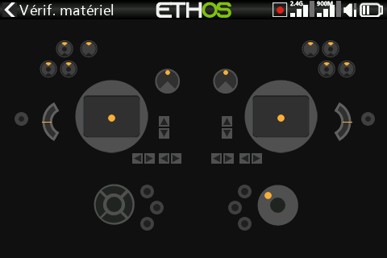

- **X20 Pro/R/RS** — vérifie en plus les deux boutons-poussoirs à
  verrouillage **K** et **L** situés sur les épaulements arrière, ainsi que
  les trims supplémentaires **T5**/**T6**.
- **X18** — vérifie également les trims supplémentaires **T5**/**T6**.

## Calibration analogique {: #analogs-calibration }

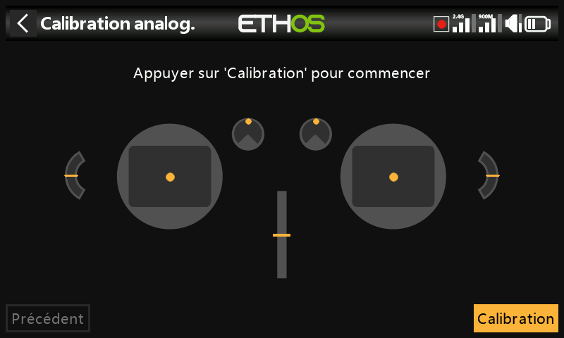

Permet de définir précisément les centres et les limites de position de
chaque manche, potentiomètre et curseur. Elle est automatiquement exécutée à
la première mise en service de la radio ; elle doit être répétée après le
remplacement d'un manche, d'un potentiomètre ou d'un curseur.

## Calibration gyros

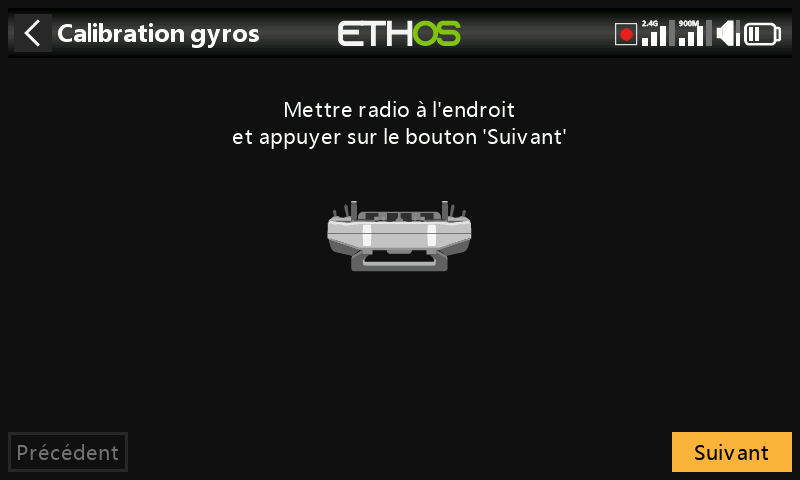

Calibre le capteur gyroscopique intégré de manière à ce que les entrées
basées sur l'inclinaison réagissent correctement à l'inclinaison de la
radio — la position de « niveau » devient l'angle auquel vous tenez
normalement la radio. Elle est également exécutée automatiquement à la
première mise en service.

## Filtre analogique

Le filtre convertisseur analogique-numérique pour les manches peut être
activé/désactivé avec ce réglage ; la valeur par défaut est ON, ce qui réduit
les tremblements autour du neutre (centre de la course du manche). Il s'agit
d'un paramètre **global** ; une option spécifique **au modèle** est également
disponible sous Filtre analogique dans
[Éditer modèle](../model-setup/model-edit.md).

## Configuration Pots / Curseurs {: #potssliders-settings }

Permet de renommer les potentiomètres et les curseurs. Les radios
**X20 Pro/R/RS** peuvent en outre accueillir deux potentiomètres
supplémentaires, **Ext1** et **Ext2**, généralement utilisés lors de
l'installation de manches à 3 axes.

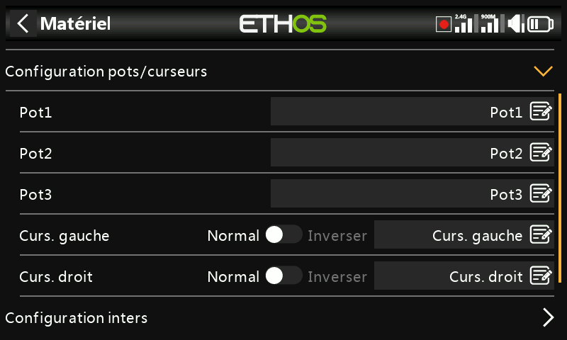
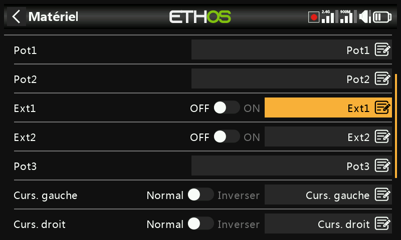

## Configuration Inters {: #switches-settings }

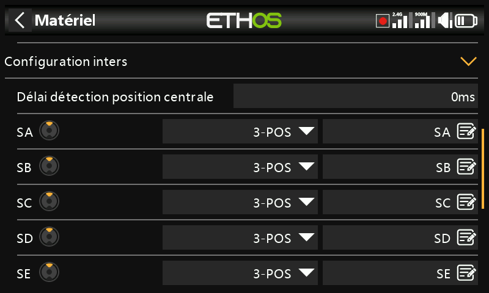

- **Délai détection position centrale** — garantit que la position centrale
  des inters à trois positions n'est pas détectée lorsque l'inter est basculé
  de la position haut à la position basse en un seul mouvement, et vice
  versa ; elle ne doit être détectée que lorsque l'inter s'arrête
  effectivement en position médiane. La valeur par défaut est 0 ms, afin de
  s'adapter aux récepteurs stabilisés FrSky lors de la détection de
  l'auto-vérification sur CH12.
- **Type d'inter** — chaque inter SA à SJ peut être défini comme **Aucun**,
  **Poussoir (momentané)**, **2 positions** ou **3 positions**, ce qui permet
  d'intervertir les fonctionnalités entre inters physiques (par exemple
  attribuer à l'inter momentané SH le rôle normalement tenu par l'inter
  2 positions SF) — dans la limite de ce que le câblage de la radio permet
  réellement (un rôle 3 positions ne peut généralement pas être attribué à un
  matériel qui n'est pas câblé pour cela).

  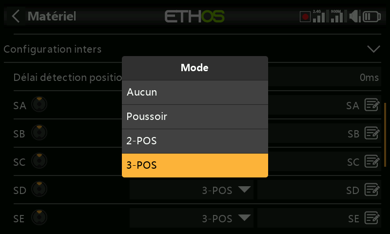
  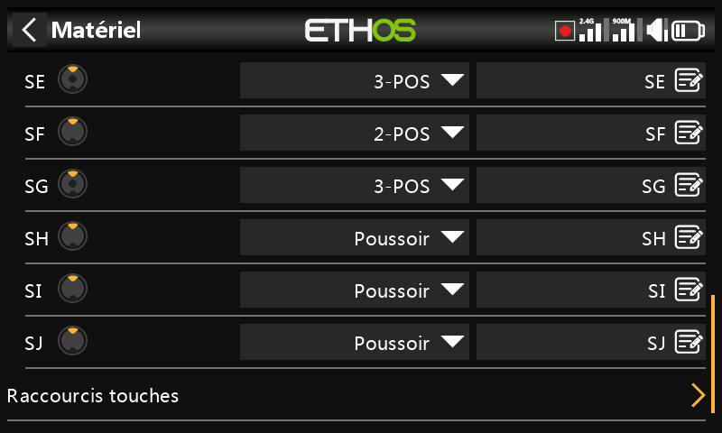

- **Renommage** — les inters peuvent également être renommés des noms par
  défaut SA à SJ en noms personnalisés ; notez que ces noms seront globaux
  pour tous les modèles.
- **X20 Pro** — dispose en plus des boutons-poussoirs **K**/**L** à
  l'arrière, ainsi que des positions d'inter **M**/**N** si elles sont
  câblées (généralement utilisées pour les interrupteurs d'extrémité de
  manche).

## Raccourcis touches

Permet de réattribuer la destination des touches d'accueil `SYS`, `MDL` et
`DISP` (`TELE` sur les anciens modèles).

- **`DISP`** — les options d'appui court et d'appui long peuvent toutes deux
  être réaffectées à n'importe quelle page du menu Modèle, page du menu
  Système, à la page de configuration des écrans, à un écran principal ou à
  l'enregistrement des données de vol. Par souci de cohérence avec la
  série X10, l'appui long sur `DISP` est conventionnellement réglé sur la
  configuration des écrans.
- **`SYS`/`MDL`** — seules les options d'appui long peuvent être réaffectées
  (vers le même ensemble de destinations), car une pression courte appelle
  toujours respectivement la section Système ou Modèle.

## Options matérielles spécifiques à chaque radio {: #radio-specific-hardware-options }

- **Activation des manches haptiques** (X20 Pro, X20R) — les X20 Pro AW et
  X20RS sont livrées avec des manches MC20R équipés de moteurs de vibration
  haptique ; si des manches MC20R ont été installés en rétrofit sur une
  X20 Pro ou une X20R, activez-les ici (voir
  [Fonctions spéciales](../model-setup/special-functions.md) pour la
  configuration des motifs haptiques eux-mêmes).

  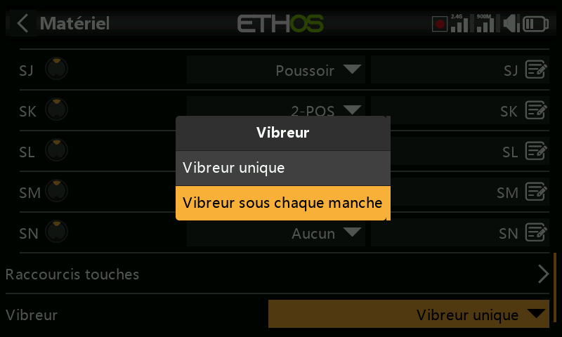
  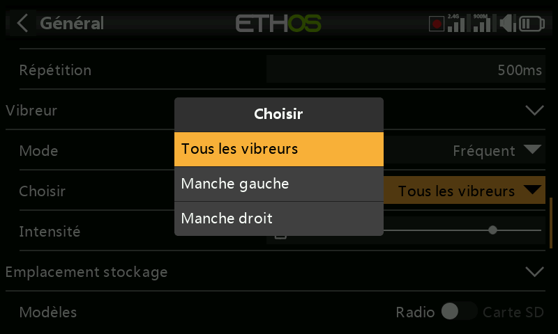

- **Option de l'encodeur** (X20 Pro AW, X20R/RS) — ces radios disposent d'un
  encodeur rotatif plus sensible ; activez les **demi-pas** pour en atténuer
  la sensibilité.

  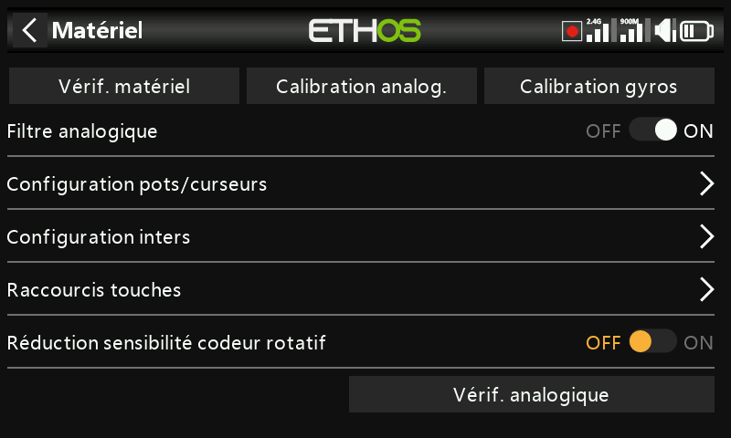

## Inspection des valeurs ADC {: #adc-value-inspector }

Cette page affiche les valeurs brutes de conversion analogique-numérique
lues par le processeur pour chaque entrée analogique :

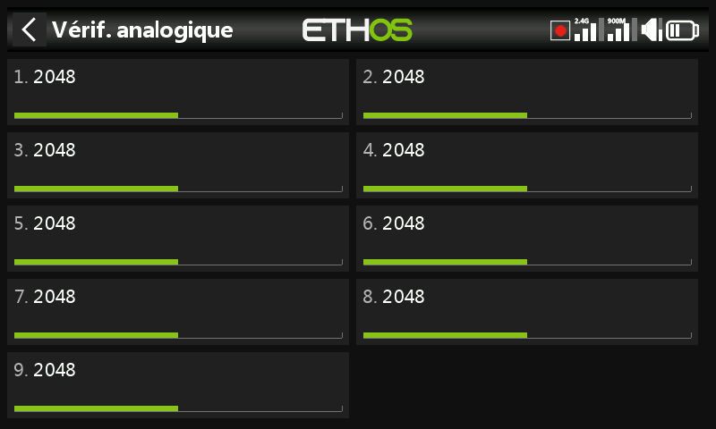
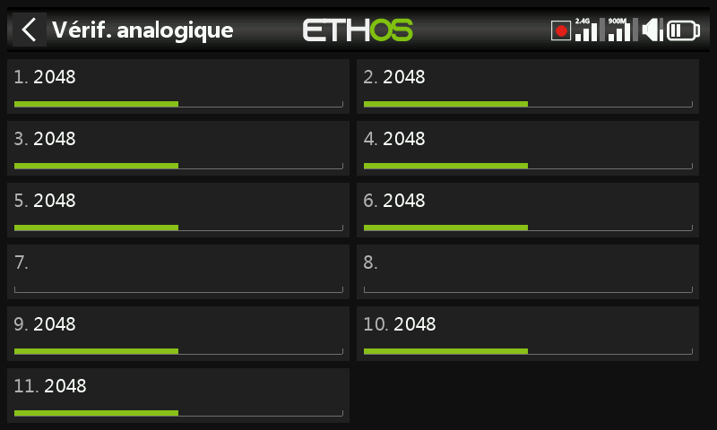

**X20S** : 1 manche gauche horizontal, 2 manche gauche vertical, 3 manche
droit vertical, 4 manche droit horizontal, 5 Potentiomètre 1,
6 Potentiomètre 2, 7 curseur central, 8 curseur gauche, 9 curseur droit.

**X20 Pro** : identique à ce qui précède, mais avec deux voies
supplémentaires de potentiomètres externes (7 Ext1, 8 Ext2 — par ex. montés
sur manche) insérées avant les curseurs, qui deviennent 9 curseur central,
10 curseur gauche, 11 curseur droit.
