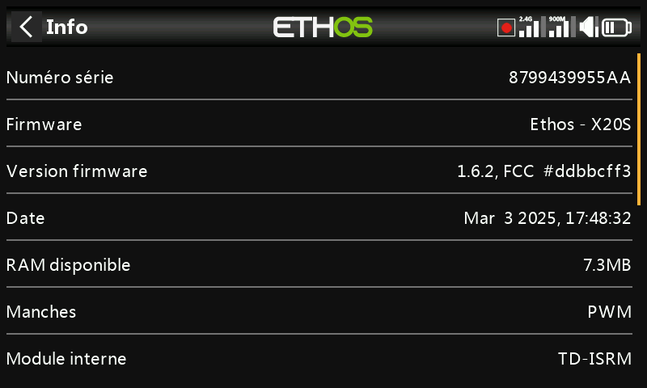
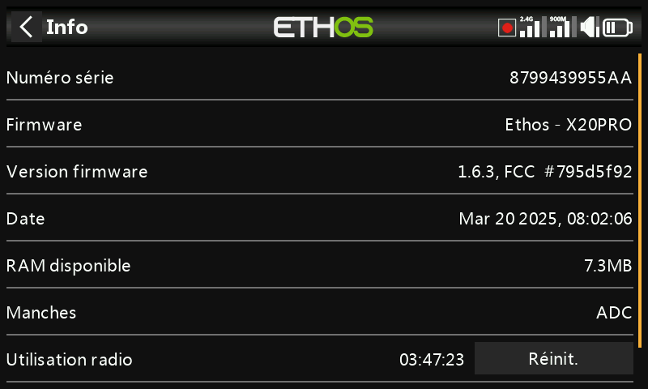
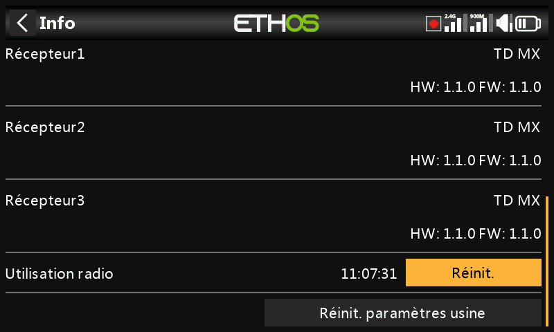
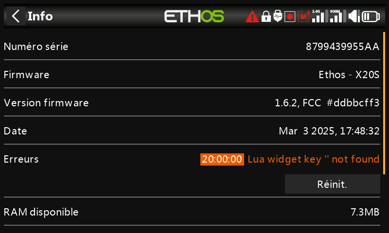
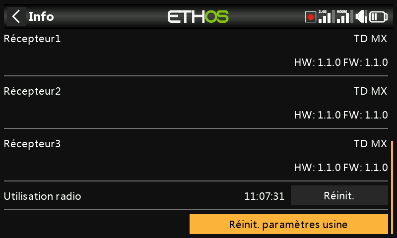
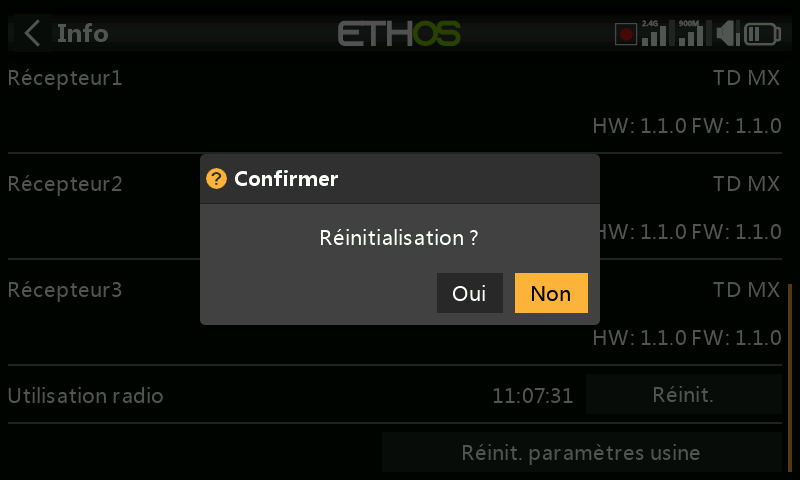

# Informations

Détails du firmware du système, type de manches, informations sur les modules RF interne/externe, informations sur le récepteur appairé, temps d'utilisation de la radio, journaux d'erreurs et réinitialisation d'usine.

## Informations sur la radio

- **Numéro de série** — le numéro de série de la radio.
- **Firmware** — version d'Ethos et type de radio (par ex. X20).
- **Version du firmware** — variante de compilation, par ex. FCC, LBT ou Flex.
- **Date** — date/heure de compilation du firmware.
- **RAM disponible** — mémoire RAM système libre, utile pour repérer un
  script Lua défaillant ; également disponible comme [source](../getting-started/user-interface-and-navigation.md#choosing-a-source)
  système afin de pouvoir être affichée dans un widget.
- **Manches** — version des capteurs Hall des manches installés (ou « ADC »
  pour des manches analogiques).
- **Module interne** — versions matérielle et logicielle du module RF
  interne.
- **Récepteur** — les détails du récepteur actuellement appairé, affichés
  après le module interne. Si un récepteur redondant partage le même
  emplacement que le récepteur principal, les deux s'affichent en
  alternance (par ex. un Archer SR10 Pro affiché avec son R9MM-OTA
  redondant sous « Receiver1 »).
- **Module externe** — détails matériels/logiciels d'un module RF externe
  FrSky installé utilisant le protocole ACCESS. Les modules Multi-protocol
  ne sont pas affichés ici.

## Temps d'utilisation de la radio

Comptabilise le temps total d'utilisation de l'émetteur ; **Reset** le remet à zéro.

## Erreurs

Un triangle rouge dans la barre supérieure de la vue principale signifie
qu'Ethos a enregistré une erreur, détaillée ici. Les causes possibles
sont :

- **Erreurs de script Lua** — un problème dans un script Lua en cours
  d'exécution.
- **Erreur de sauvegarde RAM** — un modèle trop volumineux pour la RAM de
  sauvegarde du modèle. Ethos a fait passer celle-ci de 4 Ko à 32 Ko, ce
  qui rend cette erreur désormais improbable, mais si elle survient, elle
  est significative : le modèle se charge plus lentement depuis la SD card
  au lieu de la RAM de sauvegarde si le [mode
  secours](../getting-started/emergency-mode.md) est déclenché.
- **Utilisation d'une compilation nightly du firmware** — un rappel que les
  compilations nightly ne sont pas destinées au vol.

**Reset** efface les erreurs enregistrées — pratique en pleine session de
débogage Lua.

## Réinitialisation d'usine

Rétablit les réglages d'usine de la radio entièrement depuis l'appareil —
aucune connexion à un PC n'est nécessaire.

!!! danger
    La confirmation efface **tous** les modèles, journaux, captures
    d'écran, documents, scripts, images bitmap et réglages de la radio. Une
    barre de progression suit l'effacement, après quoi tous les lecteurs
    sont démontés et la radio redémarre.

La page Informations des X20 Pro/R/RS affiche les informations
équivalentes pour cette famille de radios.
