# Exemple de base pour avion à voilure fixe

Un déroulé complet pour un avion moteur + 2 ailerons + 2 volets +
profondeur + dérive, avec un servo pour chaque surface, réalisé de bout en
bout avec l'assistant. Commencez par suivre la
[Configuration initiale de la radio](initial-radio-setup.md).

## Étape 1. Confirmer les paramètres du système

Pour cet exemple, nous utilisons l'ordre des voies **AETR** par défaut.

## Étape 2. Identifier les servos/voies requis

La fonction [Mixages](../model-setup/mixes.md) constitue le cœur de la
radio — jusqu'à 100 voies de mixage, les voies numérotées les plus basses
étant normalement attribuées aux servos (car les numéros de voies
correspondent directement aux voies du récepteur ; le module RF interne du
X20 dispose de jusqu'à 24 voies de sortie). Les voies de mixage
supérieures restent disponibles comme voies virtuelles, ou comme voies
réelles supplémentaires à l'aide de plusieurs modules RF et du SBUS. Notre
cellule :

| Fonction | Voies |
|---|---|
| Moteur | 1 |
| Ailerons | 2 |
| Volets | 2 |
| Profondeur | 1 |
| Dérive | 1 |

(Le train rentrant sera ajouté plus tard, à l'[Étape 10](#step-10-add-a-mix-for-retracts).)

## Étape 3. Créer un nouveau modèle

Depuis [Sélection du modèle](../model-setup/model-select.md), choisissez la
catégorie souhaitée, appuyez sur l'icône **+** et lancez l'assistant
**Avion**. Pour cet exemple, choisissez l'option **Récepteur non
stabilisé**.

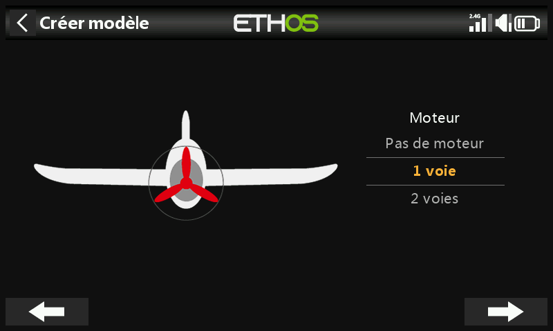

Acceptez la valeur par défaut de 1 voie pour le moteur, puis les 2 voies
d'ailerons par défaut et sélectionnez 2 voies pour les volets.

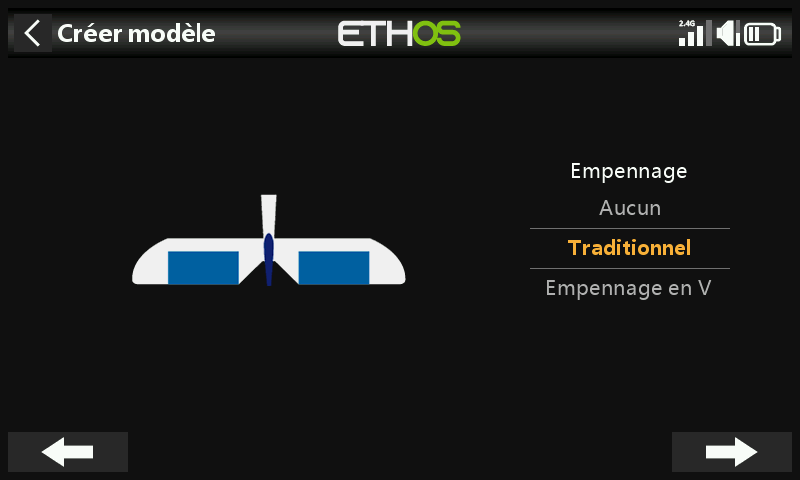

Acceptez l'**empennage traditionnel** par défaut, avec 1 voie de
profondeur et 1 voie de dérive.

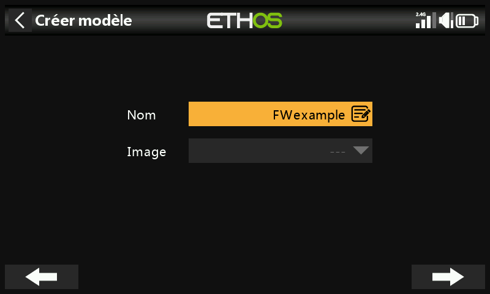
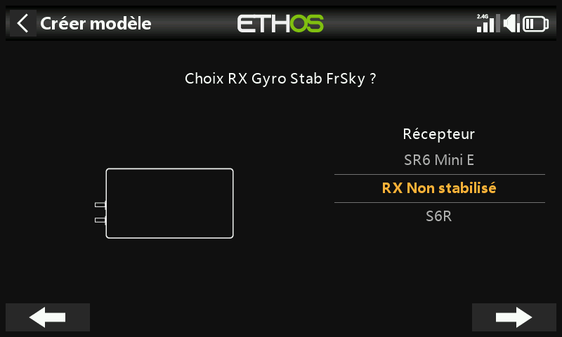

Nommez le modèle (par exemple « FWexample » — les noms peuvent comporter
jusqu'à 15 caractères) et suivez l'assistant jusqu'à la fin : le modèle est
créé dans la catégorie Avion et devient le modèle actif.

## Étape 4. Examiner et configurer les mixages

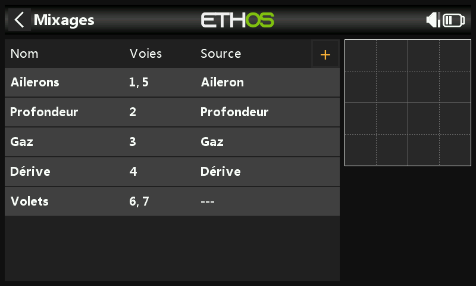

L'assistant a déjà créé les ailerons (voies 1 et 5), suivis des mixages
Profondeur, Gaz, Dérive et Volets (pour les volets, le `---` indique
qu'aucune source de commande ne leur a encore été attribuée).

### Ailerons {: #ailerons }

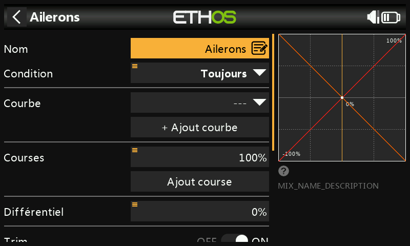
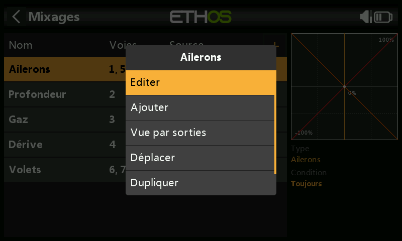

**Débattement** — c'est une bonne idée de configurer les débattements avant
de faire voler un modèle que vous n'avez jamais piloté : des débattements
modestes (par exemple 30 %) conviennent au vol sportif, 100 % au vol 3D.
Ajoutez un débattement de 60 % pour l'interrupteur SB en position médiane,
et de 30 % pour SB en position basse — la valeur par défaut (SB en haut)
reste à 100 % :

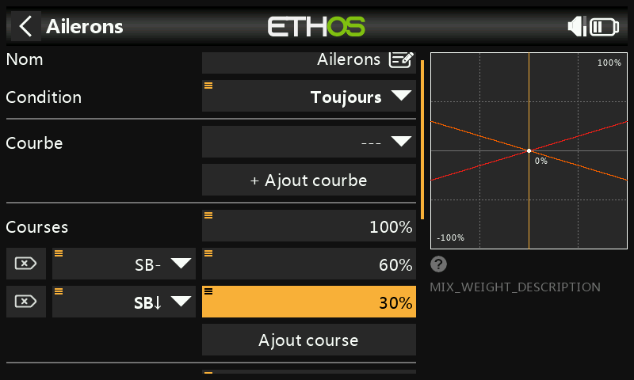

**Expo** — une réponse linéaire peut sembler trop nerveuse au centre du
manche ; ajoutez des taux d'Expo (par exemple 60 %/40 %/20 % sur les mêmes
positions de l'interrupteur SB) pour aplatir la réponse au voisinage du
neutre sans réduire le débattement maximal :

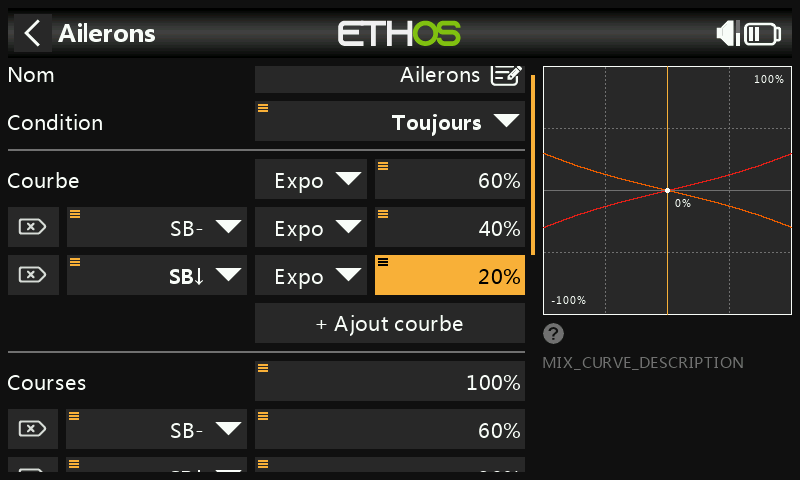

**Différentiel** — si les ailerons se déplacent de la même manière vers le
haut et vers le bas, l'aileron qui descend cause plus de traînée que celui
qui monte, ce qui entraîne un lacet du modèle dans la direction opposée au
virage (« lacet adverse »). Une valeur positive de différentiel (50 % est
le réglage courant) réduit le débattement vers le bas par rapport à celui
vers le haut pour compenser ce phénomène :

Pour optimiser le différentiel en vol, appuyez longuement sur `ENT` sur la
valeur, sélectionnez **Utiliser une source** et choisissez Pot1 :

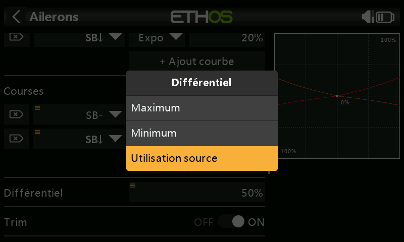
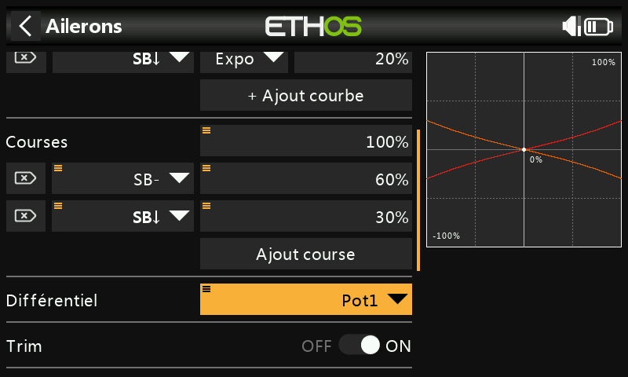

Lorsque la valeur trouvée en vol vous satisfait, appuyez de nouveau
longuement et sélectionnez **Convertir en valeur** pour en faire votre
réglage permanent :

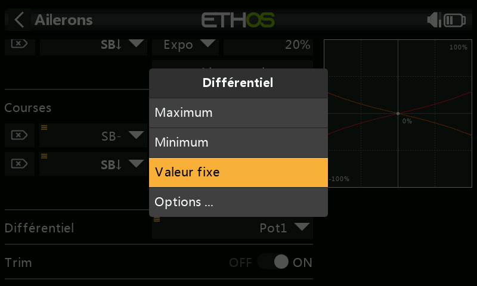

**Trim** — permet de déconnecter ce mixage du trim qui lui est associé sans
désactiver le trim lui-même, afin qu'il puisse être utilisé ailleurs :

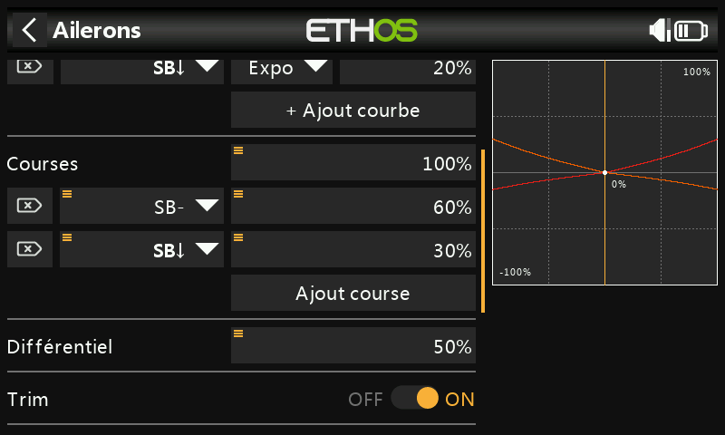

### Profondeur et dérive

De la même manière, triple débattement + Expo, ici sur l'interrupteur SC :

### Gaz

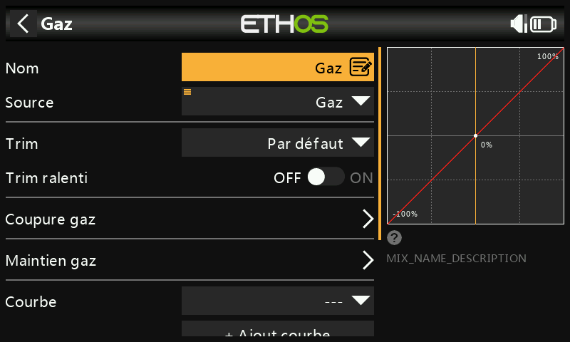

Pour les gaz, laissez l'entrée sur le manche des gaz — ni débattements ni
Expo ne sont nécessaires — mais un interrupteur de sécurité est
indispensable ; un moteur thermique ou électrique de modèle qui démarre de
manière inattendue peut causer des blessures graves.

**Trim en position basse** (moteurs thermiques/essence) — permet de régler
le régime de ralenti indépendamment de la position plein gaz :

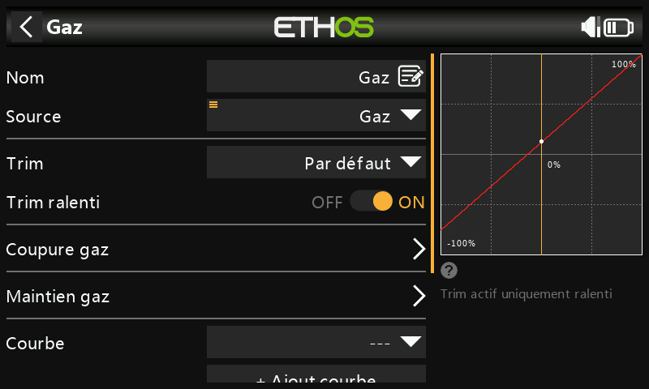

Lorsqu'il est activé, la voie des gaz se place à −75 % lorsque le manche
est en position de ralenti ; le levier de trim des gaz permet alors
d'ajuster le ralenti entre −100 % et −50 %.

**Coupure gaz** — un mécanisme de verrouillage de sécurité. Avec
l'interrupteur SA en position basse comme condition active (affichée en
gras lorsqu'elle est active), la sortie des gaz est maintenue à −100 % dès
que le manche descend en dessous de −85 % :

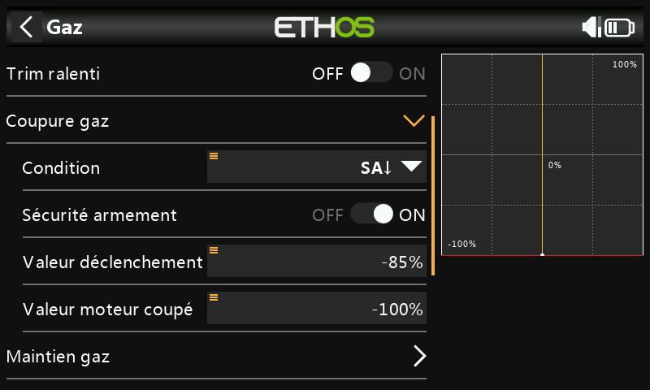

Si l'option **Sticky** est activée à la place, les gaz sont coupés à
l'**instant** où SA passe en position basse, quelle que soit la position du
manche :

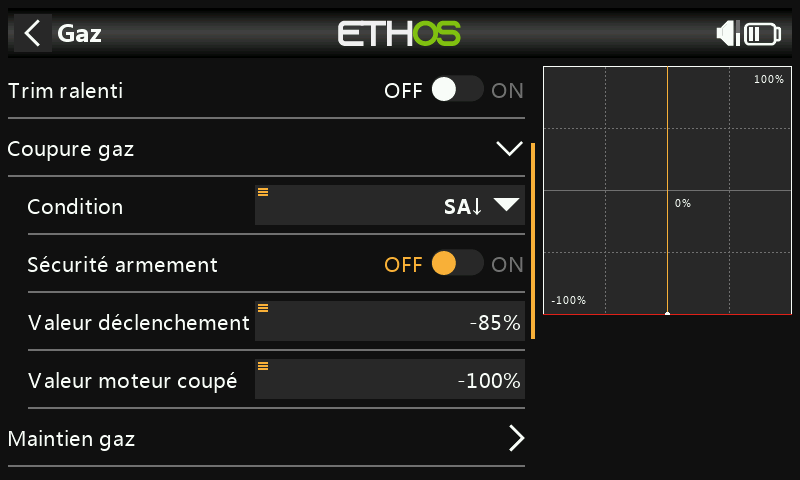

Dans les deux cas, une fois la condition active supprimée, le manche des
gaz doit être ramené en dessous de −85 % avant de pouvoir être augmenté de
nouveau — ce qui évite que le moteur ne passe brusquement à une position de
gaz élevée au moment où l'interrupteur de coupure est relâché.

**Maintien de l'accélérateur** — une coupure d'urgence depuis *n'importe
quelle* position du manche : la sortie est instantanément réduite à −100 %
(ou à la valeur configurée) dès que sa condition est remplie :

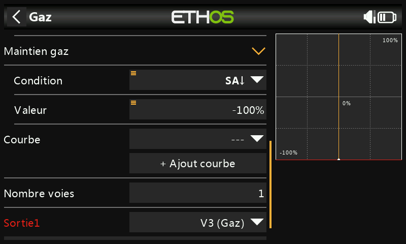

### Volets

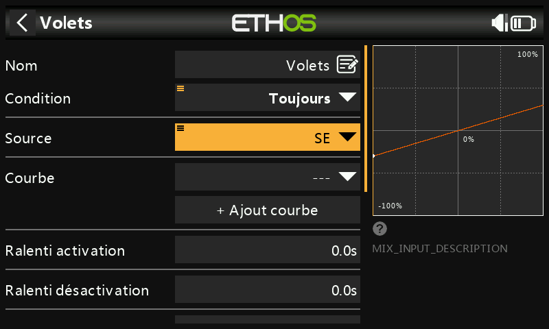

Affectez les volets à l'interrupteur SE et portez le débattement des deux
voies de sortie à 100 % :

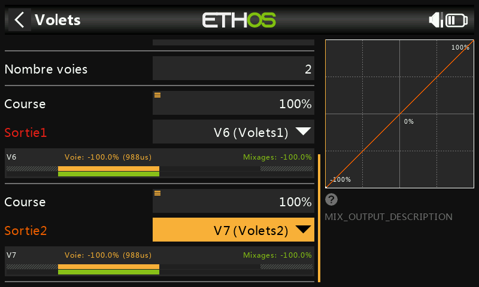

## Étape 5. Appairer le récepteur

Utilisez la fonction [Système RF](../model-setup/rf-system.md) pour
enregistrer (si votre récepteur est ACCESS) et appairer votre récepteur.
Avant de passer aux Sorties, il serait sage de déconnecter les tringleries
de servo ou de réduire temporairement le débattement des servos, afin de ne
rien forcer pendant le réglage des limites Min/Max.

## Étape 6. Configurer les sorties

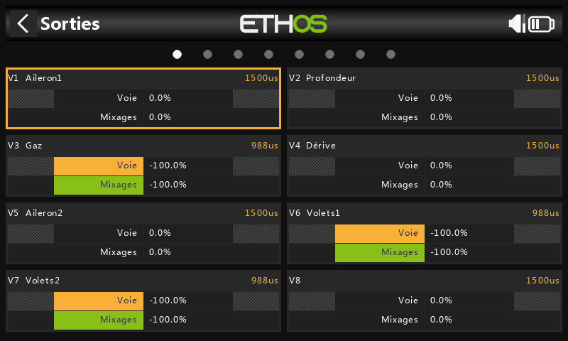

La section [Sorties](../model-setup/outputs.md) adapte la logique du
mixeur aux caractéristiques mécaniques réelles du modèle.

**Aileron 1** — commencez par centrer le servo à l'aide du réglage
**Centre PWM**, après avoir optimisé les tringleries, puis réglez
**Min**/**Max**. Affecter temporairement un potentiomètre à Min (puis à
Max, de la même manière que pour le différentiel ci-dessus) permet
d'affiner ce réglage plus rapidement :

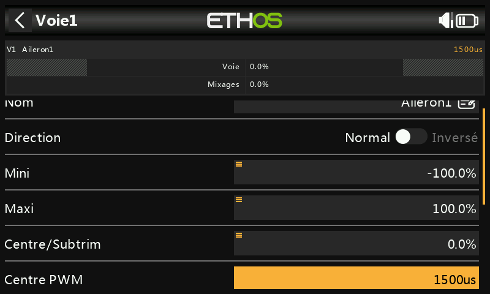

**Volets** — les volets nécessitent normalement une grande déflexion vers
le bas pour un freinage efficace ; pour l'obtenir, on sacrifie une partie
de la déflexion vers le haut lors de la réalisation des tringleries, de
sorte que le volet se trouve en position semi-abaissée lorsque le servo est
au neutre, puis on utilise Min/Max pour définir les positions réelles
rentrée et pleine sortie. Une courbe à 5 points est couramment utilisée
pour corriger tout défaut de concordance entre volets et ailerons qui en
résulterait. Terminez avec **[Équilibrage des
voies](../model-setup/outputs.md#balance-channels)** pour synchroniser les
ailerons et les volets gauche/droite.

## Étape 7. Introduction aux modes de vol

Les [Modes de vol](../model-setup/flight-modes.md) sont un excellent moyen
de configurer un modèle pour différentes tâches — un peu comme changer de
vitesse. Sur les 20 disponibles, cet exemple en utilise trois :
**Default**, **Flaps Half** (interrupteur SE en position médiane) et
**Flaps Full** (SE en haut). Le premier mode de vol dont la condition
active est vraie est le mode actif ; le mode **Default** n'a aucune
condition et prend le relais dès qu'aucun autre ne s'applique — c'est
pourquoi il n'a pas d'option de sélection d'interrupteur. Un fondu
d'entrée/sortie de 1 seconde adoucit la transition lors du déploiement des
volets.

## Étape 8. Configurer les trims

Deux façons de gérer un trim de profondeur qui varie selon la position des
volets :

**Trims indépendants par mode de vol** — l'option la plus simple : le trim
de profondeur devient totalement indépendant pour chaque mode de vol et
bascule automatiquement entre les réglages lorsque vous actionnez SE. Comme
chaque mode se trime à partir de zéro, le [Trim
instantané](../model-setup/trims.md#instant-trim) est utile — trimez
d'abord pour le vol normal, puis atterrissez et utilisez ce réglage comme
point de départ pour les modes avec volets.

**Trim de base avec offset** — on trime une seule fois en Default, la
compensation de profondeur de chaque mode volets venant se superposer sous
forme d'offset :

1. Réglez le **Pas** de trim sur Medium (pour un trimage initial plus
   rapide ; réduisez-le ensuite pour l'ajustement fin), le **Mode** sur
   Custom, puis ajoutez un nouveau comportement.
2. **Condition active** : `FM1(Flaps Half)`, mode **Offset + Default** — le
   trim du mode Flaps Half devient le trim de base plus l'offset réglé
   pendant que ce mode est actif :

   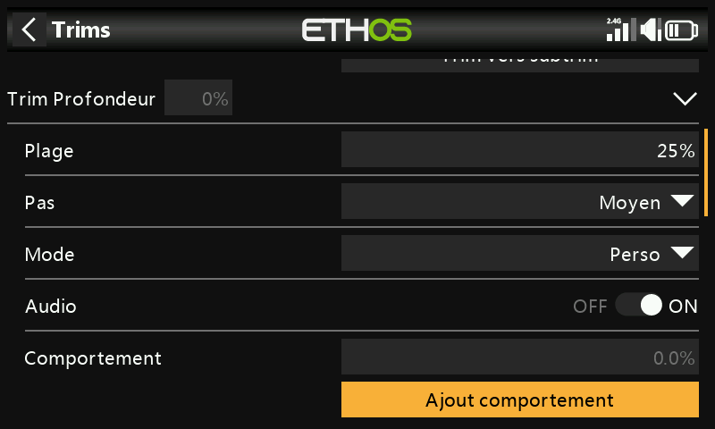
   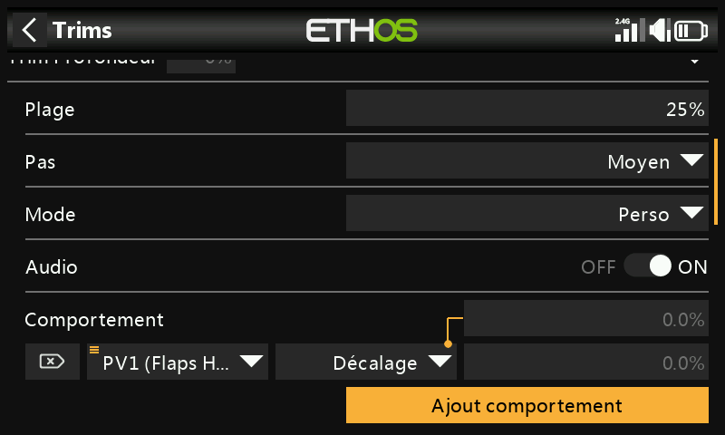

3. Répétez l'opération pour `FM2(Flaps Full)` :

   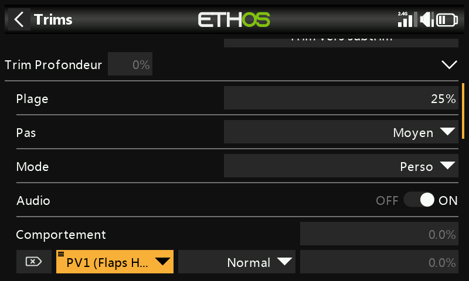
   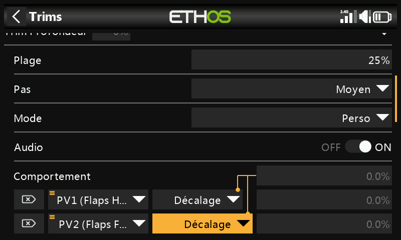

Chaque mode avec volets peut désormais être trimé indépendamment, mais une
modification ultérieure du trim de base Default (par exemple pour corriger
une dérive thermique des servos) décale automatiquement les trims des deux
modes volets de la même valeur.

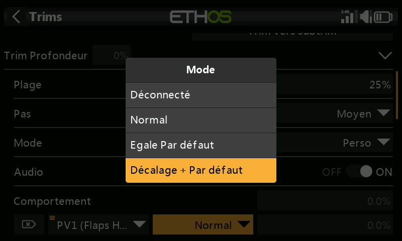

## Étape 9. Configurer un chrono de batterie de vol

Dans [Chronos](../model-setup/timers.md), modifiez le Chrono 1 : mode
**Down**, valeur de départ de 5 minutes ; il s'exécute chaque fois que
**Gaz actif** est vrai (à condition qu'il ne soit pas maintenu en
réinitialisation). Vous pouvez éventuellement attribuer une source de
synchronisation proportionnelle (par exemple le manche des gaz) : à plein
gaz, le chrono compte en temps réel, et ralentit à mesure que les gaz sont
réduits.

## Étape 10. Ajouter un mixage pour le train rentrant {: #step-10-add-a-mix-for-retracts }

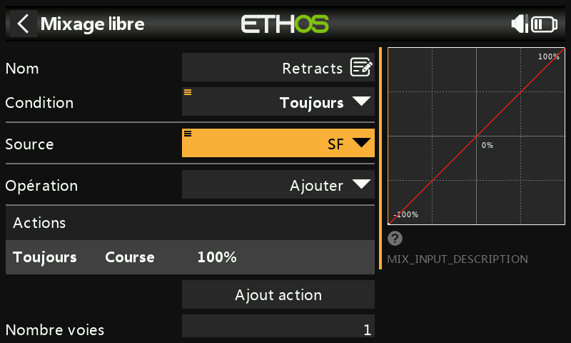

Appuyez sur un mixage, **Ajouter un mixage** → **Mixage libre**, nommez-le
« Retracts », réglez la condition sur Always et la source sur
l'interrupteur SF. L'action de mixage par défaut Débattement = 100 % est
correcte — cela alloue par exemple la voie 8 au train rentrant :

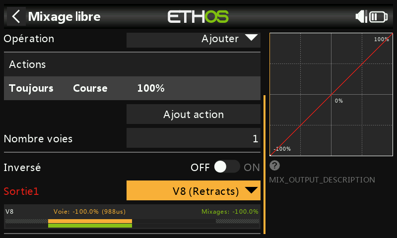
