---
translated_from: 827e532e2b0324591f0fdbb61a39e61180642b24
---

# Exemple d'hélicoptère flybarless basique

Configuration de base d'un hélicoptère flybarless (FBL), en prenant comme
exemple un contrôleur FBL tel que le Spirit. Contrairement à un aéronef à
voilure fixe, un hélicoptère est intrinsèquement instable — le contrôleur
FBL utilise des gyroscopes (vitesse de rotation autour d'un axe) et des
accéléromètres (mouvement/orientation) pour calculer les corrections de
lacet, de tangage et de roulis au moyen d'une boucle de contrôle PID
(Proportional Integral Derivative) réglée de manière à équilibrer
stabilité, réactivité et dépassement en fonction des caractéristiques
physiques et électriques propres à l'hélicoptère.

Ce tutoriel ne couvre que l'aspect **programmation radio** de la
configuration — reportez-vous à la documentation de votre unité FBL pour le
reste, et abordez-le avec une bonne connaissance générale de la technologie
et de l'exploitation des hélicoptères.

!!! danger
    Avant de commencer, pour éviter les blessures, retirez les pales du
    rotor afin de pouvoir travailler en toute sécurité.

## Étape 1. Confirmer les paramètres du système

Ordre des voies **AETR**, réglage **[Quatre premières voies
fixes](../system-setup/controls.md#first-four-channels-fixed)** sur
**OFF** — les unités Spirit FBL s'attendent à ce que les voies SBUS soient
précisément dans cet ordre (bien qu'elles utilisent l'ordre TAER dans leur
propre configuration). Utilisez la fonction [Système
RF](../model-setup/rf-system.md) pour enregistrer (si votre récepteur est
ACCESS) et lier votre récepteur.

## Étape 2. Identifier les servos/voies requis

| Fonction | Voie |
|---|---|
| Roulis (aileron) | — |
| Tangage (profondeur) | — |
| Gaz | — |
| Lacet (dérive) | — |
| Gain gyroscopique | 5 |
| Pas collectif | 6 |
| Banque de réglages | 7 |
| Rescue (sauvetage) | 8 |

## Étape 3. Créer un nouveau modèle

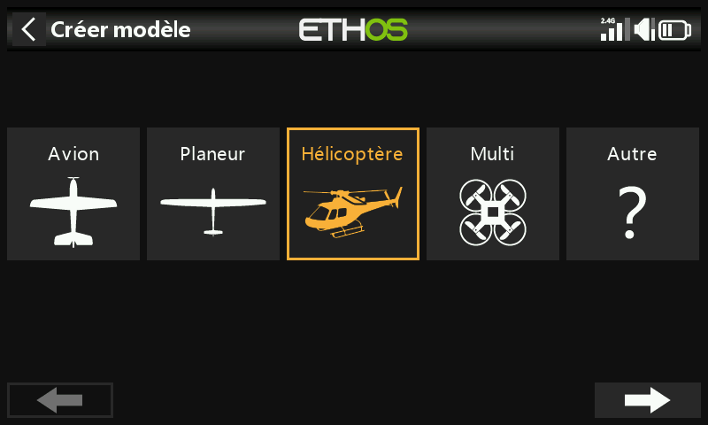

Depuis [Sélection du modèle](../model-setup/model-select.md),
créez/sélectionnez une catégorie Heli, lancez l'assistant et sélectionnez
**Flybarless** :

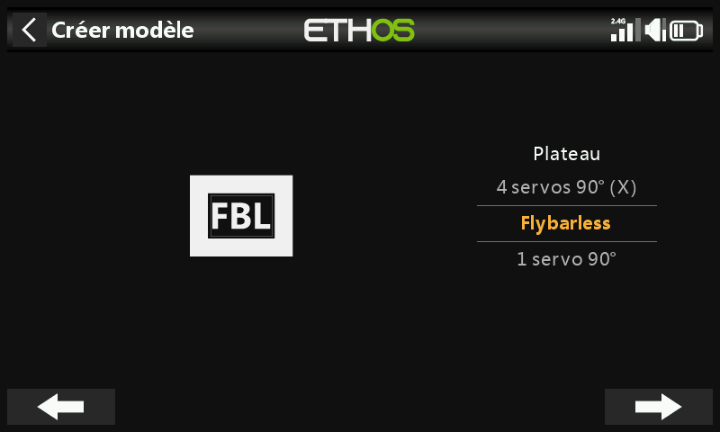
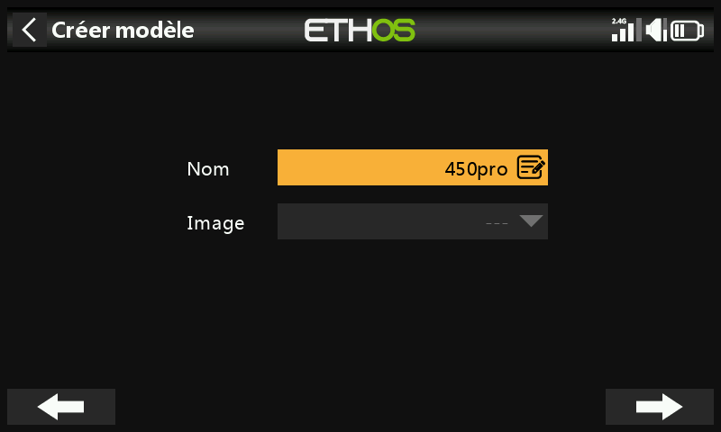

Définissez un nom et une image de modèle.

## Étape 4. Examiner et configurer les mixages

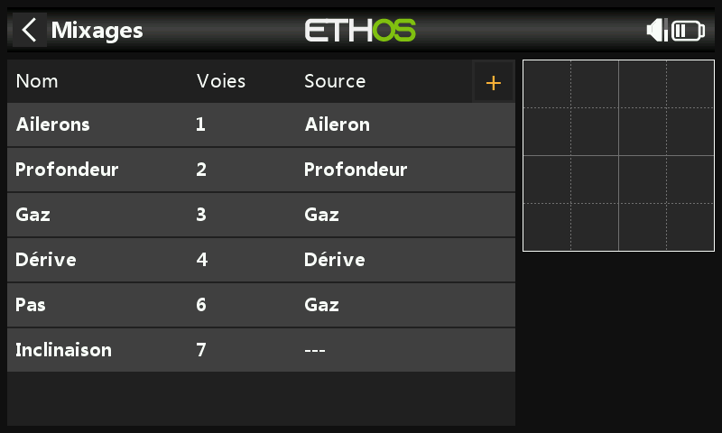

L'assistant a créé les ailerons, la profondeur, les gaz et la dérive dans
la séquence AETR, le pas sur la voie 6 et la banque FBL sur la voie 7 :

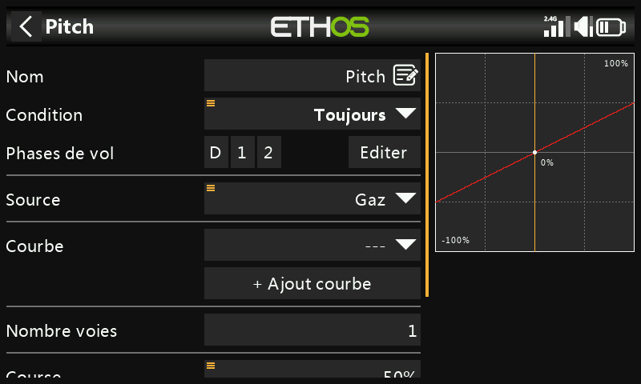

Confirmez que la voie 6 correspond bien au pas collectif. Deux voies
supplémentaires doivent être ajoutées manuellement à l'aide des [mixages
libres](../model-setup/mixes.md#mix-libraries) : **Gain gyroscopique**
(voie 5) et **Rescue/Stabi** (voie 8).

**Aileron / Profondeur / Dérive** — rien n'a besoin d'être ajouté ; les
débattements et l'expo sont gérés par l'unité FBL, de sorte que la radio ne
fait que transmettre des entrées de commande linéaires « propres ».

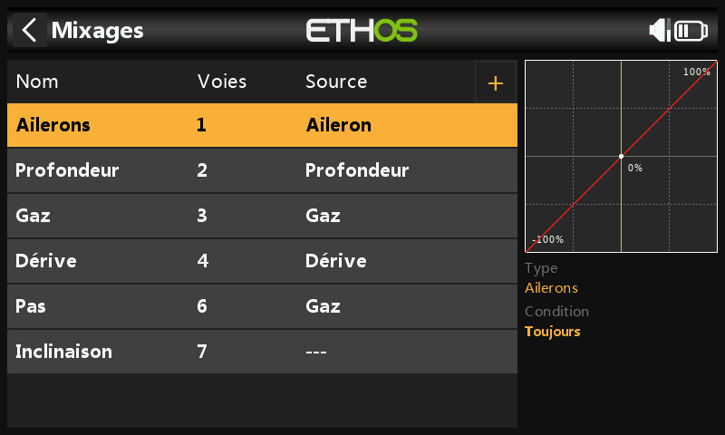

**Pas collectif** — une simple courbe linéaire en ligne droite ; il vous
suffit de confirmer la voie de sortie (normalement 6). Comme ci-dessus, les
débattements et l'expo sont pris en charge par l'unité FBL, pas ici.

**Banque FBL** — les trois banques de réglages du Spirit (styles de vol
différents, gains de capteur pour les régimes bas ou élevés, ou
Débutant/Acro/3D — ou simplement des préréglages de réglage) affectées à un
interrupteur à 3 positions, par exemple SE :

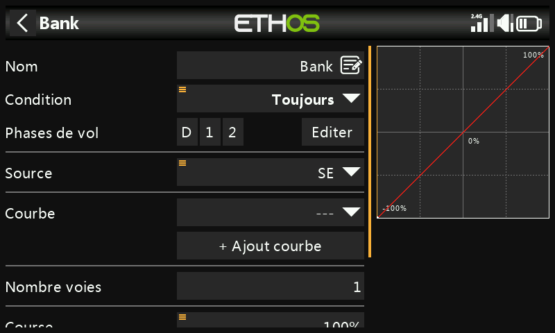

**Gain gyroscopique** — à ajouter comme mixage libre après la dernière
voie. Le gain est généralement une valeur fixe : réglez la **Source** sur
Valeur spéciale 0, puis affichez la valeur de gain requise à l'aide du
**décalage** (à affiner en vol par la suite), et affectez la voie de sortie
à 5 :

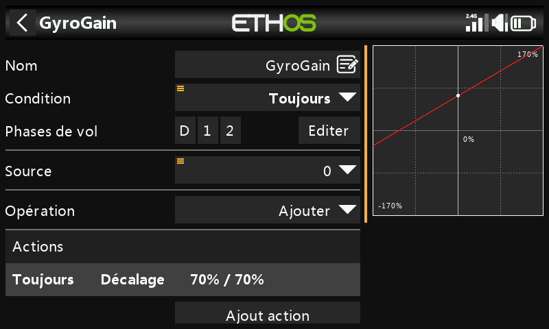

### Configurer les modes de vol

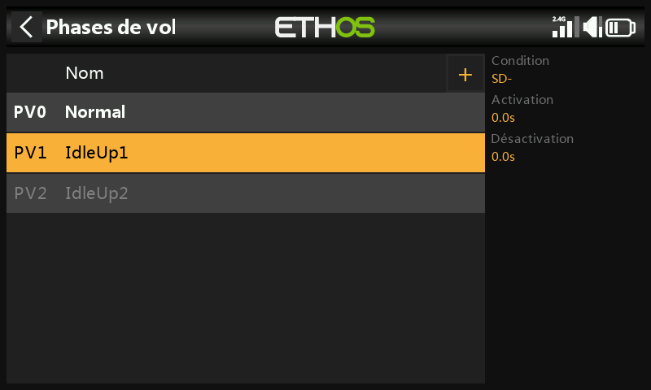

Trois [modes de vol](../model-setup/flight-modes.md) : renommez le mode par
défaut en **Normal**, et ajoutez **Idle Up 1**/**Idle Up 2** sur l'inter SD.

### Configurer le mixage des gaz

Trois courbes de gaz, une par mode de vol, chacune étant une [courbe
personnalisée](../model-setup/curves.md) :

- **Normal** — mise en rotation et décollage : la courbe commence à −100 %
  (moteur éteint), puis augmente en douceur. Une courbe à 7 points avec
  **Smooth** activé fonctionne bien ; les valeurs exactes doivent être
  déterminées en vol.

  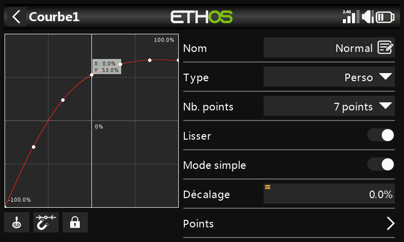

- **Idle Up 1** — utilisé pour la plupart des vols : une courbe en ligne
  droite signifie un réglage de gaz constant pour maintenir les rotors en
  rotation à un régime régulier, le mouvement de l'hélicoptère étant
  contrôlé par les commandes de pas collectif, d'aileron (roulis) et de
  profondeur (tangage). Il ne doit pas y avoir de grand saut entre Normal
  et Idle Up 1, afin que la transition se fasse en douceur. (La plupart des
  unités FBL offrent également une fonction **Governor** (régulation), qui
  garantit que la vitesse du rotor est maintenue constante même pendant les
  manœuvres de vol agressives — reportez-vous au manuel de l'unité FBL.)

  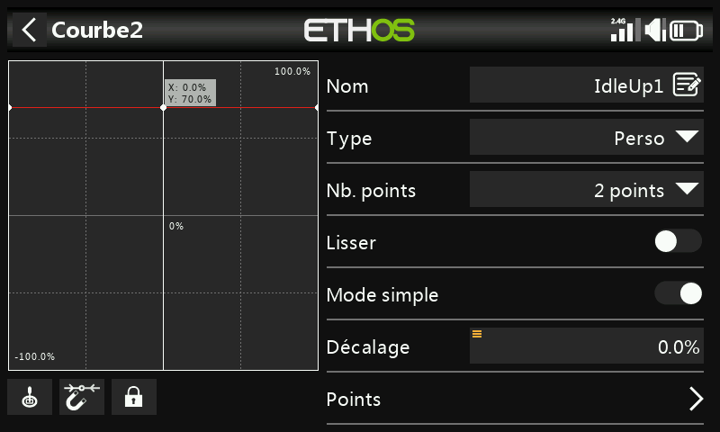

- **Idle Up 2** — utilisé pour les vols plus agressifs (voltige, 3D) ; là
  encore, les valeurs finales sont à déterminer en vol.

  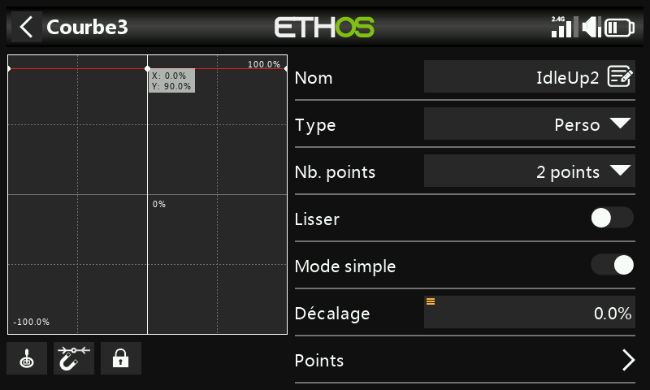

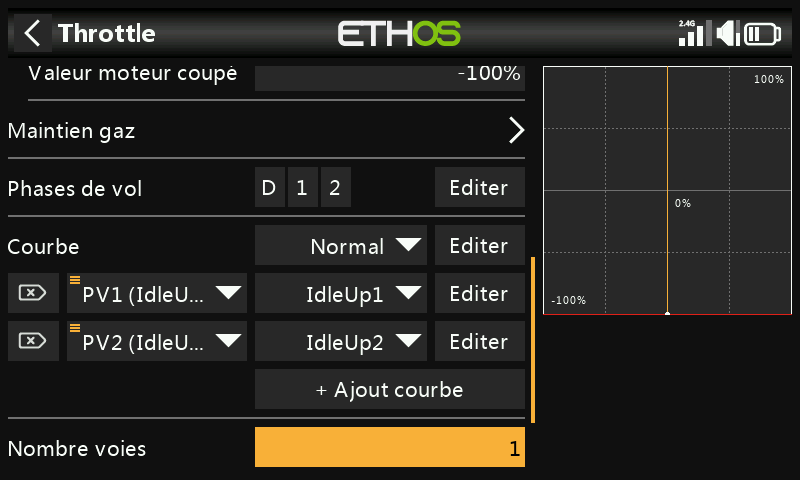

**Coupure gaz** — affectez par exemple l'interrupteur SG en position haute
avec l'option **Sticky** (sécurité armement) sur ON : les gaz sont coupés
dès que vous basculez SG vers le haut et, en raison du réglage Sticky, les
gaz ne peuvent être réarmés qu'après avoir ramené le manche des gaz en
position basse (arrêt).

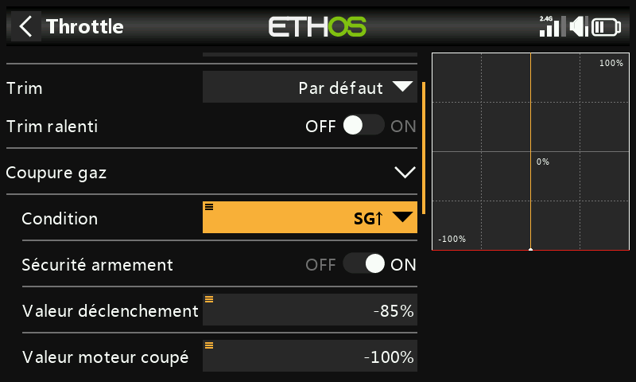

**Rescue/Stabi** — de la même manière, ce mixage peut être affecté à
l'interrupteur SA, sur la voie 8.

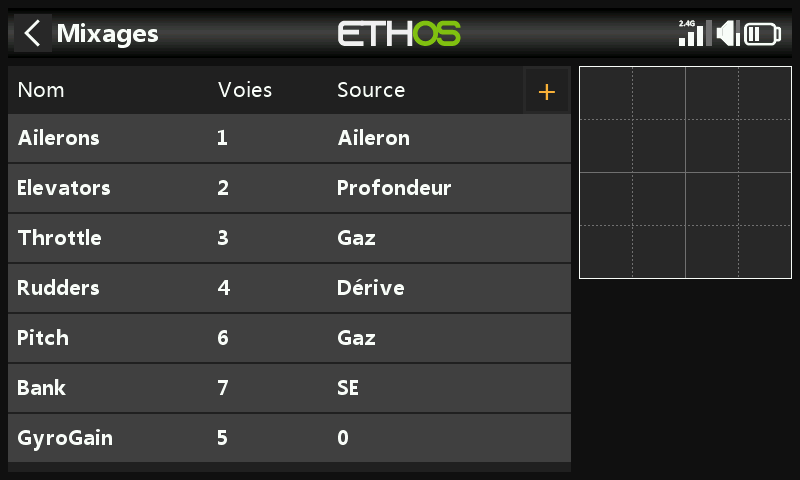

## Étape 5. Configuration FBL

1. **Installez l'outil de configuration FBL** — par exemple le logiciel
   Spirit Settings, sur votre PC.
2. **Connectez votre récepteur à l'unité FBL** conformément à son schéma de
   câblage — généralement la sortie « SBUS Out » du récepteur vers le port
   « RUD » de l'unité FBL (notez que certains modèles Spirit nécessitent un
   adaptateur SBUS), ou bien via F.Port1/FBUS.
3. **Connectez l'unité FBL à votre PC** — à l'aide du câble fourni ou via
   Bluetooth, conformément à son manuel.

   !!! danger
       Ne connectez pas encore de servos !

4. **Mettez à jour le micrologiciel FBL** si nécessaire, depuis l'onglet
   Mise à jour de l'outil.
5. **Configuration générale** (onglet Général du logiciel Spirit Settings) :
   - Type de récepteur : **Futaba SBUS** ou **FrSky F.Port** (selon le cas),
     puis redémarrez le système.
   - Mappage des voies (avec l'ordre AETR de l'assistant) :

     | Fonction | Voie |
     |---|---|
     | Gaz | 1 |
     | Aileron | 2 |
     | Profondeur | 3 |
     | Dérive | 4 |
     | Gyro | 5 |
     | Pas | 6 |
     | Banque | 7 |
     | Rescue/Stabi | 8 |

     (Cet ordre des voies découle de la façon dont l'unité Spirit
     interprète la position des voies dans le flux de données SBUS.)

6. **Limites des voies** (onglet Diagnostic) — pour le bon fonctionnement
   de l'unité FBL, les limites des voies radio doivent être calibrées et
   les centres vérifiés :

   - À la radio, assurez-vous d'abord que tous les subtrims et trims sont
     remis à zéro.
   - Réglez le manche de pas collectif en position centrale pour obtenir
     une sortie de exactement 1500 µs dans la page
     [Sorties](../model-setup/outputs.md).
   - Mettez l'unité FBL sous tension et vérifiez que les voies aileron,
     profondeur, pas et dérive sont toutes centrées à 0 % dans l'onglet
     Diagnostic (l'unité FBL détecte automatiquement la position neutre
     lors de chaque initialisation).
   - Déplacez chaque commande jusqu'à ses limites et ajustez les valeurs
     **Min**/**Max** correspondantes dans Sorties afin d'obtenir une
     lecture d'exactement +100 %/−100 % dans l'onglet Diagnostic, en
     vérifiant également que le sens du mouvement des barres correspond à
     celui des manches.

   !!! warning
       N'utilisez jamais les fonctions de subtrim ou de trim de votre
       émetteur pour ces voies — l'unité Spirit FBL les considérerait comme
       une commande d'entrée et non comme un calibrage.

7. Ajustez la valeur de **décalage** du mixage Gain gyroscopique pour vous
   assurer que le verrouillage de cap (Heading Lock) est atteint.

Après ces réglages, tout est configuré en ce qui concerne l'émetteur — vous
pouvez maintenant continuer avec le reste de la configuration conformément
au manuel de l'unité FBL.
