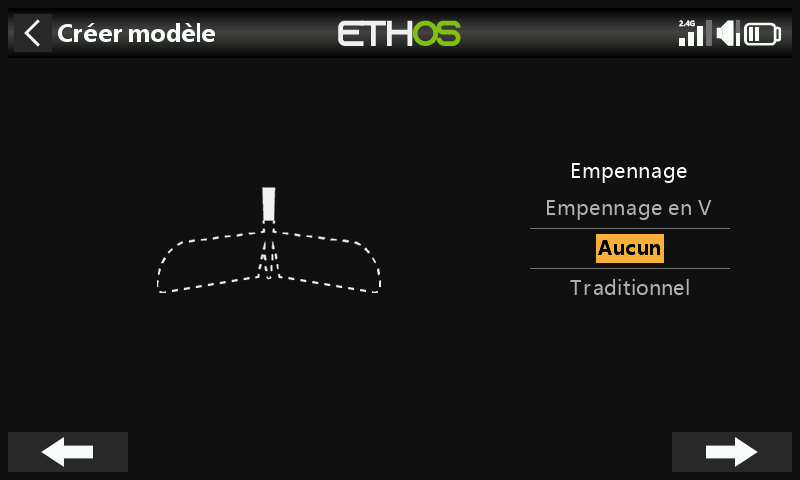
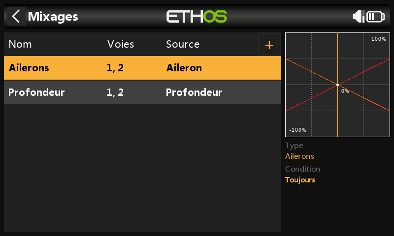
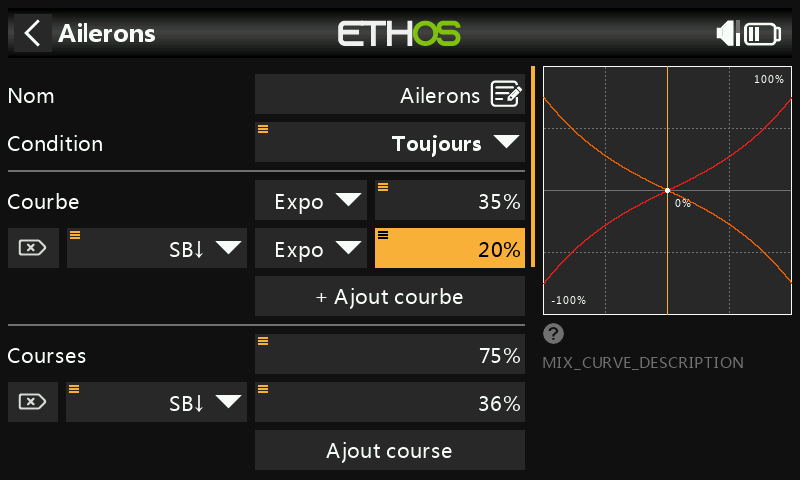
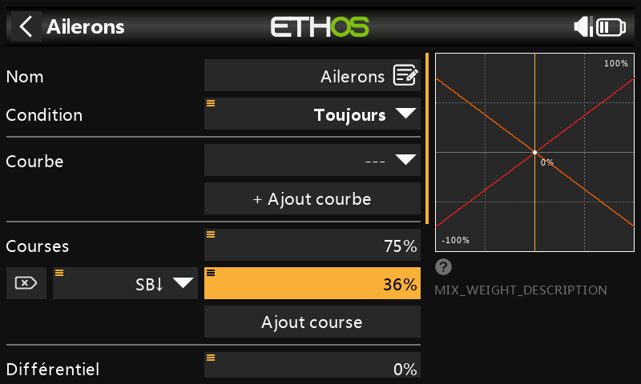
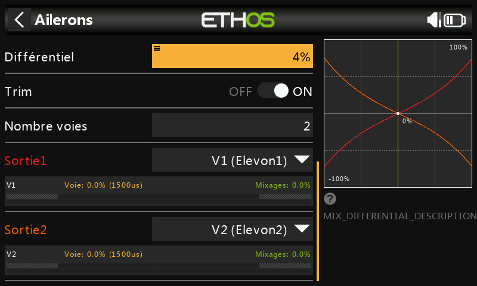
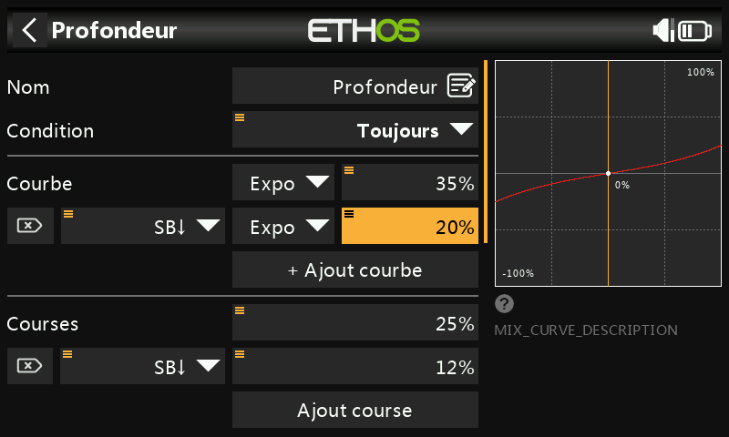
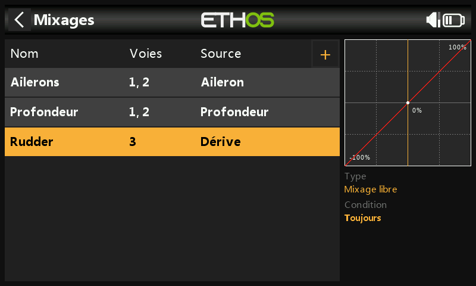

---
translated_from: 827e532e2b0324591f0fdbb61a39e61180642b24
---

# Exemple d'aile volante basique (Elevon)

Une aile volante à 2 servos pour les elevons, en prenant comme exemple
concret les débattements, l'Expo et les ratios de mixage recommandés par
Dreamflight pour la Weasel. Commencez par suivre l'exemple de
[configuration radio initiale](initial-radio-setup.md).

## Étape 1. Confirmer les paramètres du système {: #step-1-confirm-system-settings }

Ordre des voies **AETR** par défaut, avec le réglage **[Quatre premières
voies fixes](../system-setup/controls.md#first-four-channels-fixed)**
désactivé (**OFF**). Utilisez la fonction [Système
RF](../model-setup/rf-system.md) pour enregistrer (si votre récepteur est
ACCESS) et lier votre récepteur avant de continuer.

## Étape 2. Identifier les servos/voies requis

Dans le cas d'une aile volante à elevons, les
[mixages](../model-setup/mixes.md) sont utilisés pour combiner les
commandes d'ailerons et de profondeur afin d'agir sur les deux surfaces
physiques — soit seulement 2 voies au total, chacune combinant les deux
entrées.

## Étape 3. Créer un nouveau modèle

Depuis [Sélection du modèle](../model-setup/model-select.md), lancez
l'assistant **Avion** et choisissez l'option **Récepteur non stabilisé**.

Sélectionnez **Pas de moteur**, acceptez les 2 voies par défaut pour les
ailerons, puis sélectionnez **Pas de volets**.

Sélectionnez **Aucun** pour la queue — c'est ce qui amène Ethos à créer
automatiquement le mixage elevons (commandes d'ailerons + profondeur,
toutes deux sur les mêmes deux voies). Nommez le modèle (par exemple
« Weasel »), sélectionnez une image bitmap, puis suivez l'assistant
jusqu'à la fin — il devient le modèle actif dans le groupe Avion.

## Étape 4. Examiner et configurer les mixages

L'assistant a créé un mixage Ailerons sur les voies 1 et 2, suivi d'un
mixage Profondeur *également* sur les voies 1 et 2 — les deux commandes
d'entrée agissent donc sur les deux voies d'elevons, ce qui constitue
tout le principe du mixage elevons.

### Ailerons

**Poids/Débattements** — si l'on se réfère au manuel de la Weasel, les
débattements recommandés pour les ailerons sont environ 3 fois supérieurs
à ceux de la profondeur, et les deux doivent totaliser 100 % : **75 %**
pour les ailerons et **25 %** pour la profondeur. Les taux bas
représentent environ 50 % des taux élevés : nous utiliserons donc **36 %**
pour les ailerons en petit débattement et **12 %** pour la profondeur en
petit débattement.

**Expo** — les valeurs d'Expo recommandées par la Weasel sont de 35 % pour
les grands débattements et de 20 % pour les petits, actives sur la
position basse de l'interrupteur SB, ce qui aplatit la réponse autour du
centre du manche.

**Différentiel** — assez faible sur cette cellule, environ **4 %** :

(Voir l'[exemple d'avion basique](basic-fixed-wing.md#ailerons) pour
comprendre l'utilité du différentiel — le même raisonnement sur le lacet
adverse s'applique ici.)

### Profondeur

De la même manière que pour les ailerons : des débattements de **25 %** et
**12 %** (grands/petits), avec les mêmes valeurs d'Expo que pour les
ailerons.

### Dérive

La Weasel n'a pas de dérive — les ailes volantes n'en ont généralement pas
besoin. D'autres modèles à elevons peuvent nécessiter une dérive, auquel
cas il faut utiliser un [mixage
libre](../model-setup/mixes.md#mix-libraries) pour l'ajouter sur la
voie 3.

## Étape 5. Lier le récepteur

Comme à l'[étape 1](#step-1-confirm-system-settings) — enregistrez et
liez votre récepteur avant de continuer. Pour éviter d'endommager vos
servos par inadvertance, il serait sage de déconnecter les tringleries de
servo ou de réduire la course jusqu'à ce que les limites Min/Max soient
réglées.

## Étape 6. Revoir les mixages

Les voies de sortie 1 et 2 peuvent être renommées **Elevon1** et
**Elevon2**. Avec les ailerons à fond à droite, la voie 1 (droite,
montante) est à 75 %, tandis que la voie 2 (gauche, descendante) est à
72 % — cet écart de 3 % *est* l'effet du différentiel. Ajoutez par-dessus
la profondeur à piquer à fond et la voie 1 passe à 75 + 25 = 100 %, la
voie 2 à 72−25 = 47 %.

## Étape 7. Configurer les courses maximales des servos

Commencez par ajuster le neutre de chaque servo à l'aide du réglage **PWM
center**. Les courses maximales recommandées par la Weasel sont de 25 mm
(ailerons) + 10 mm (profondeur) = 35 mm cumulés — appliquez les commandes
d'ailerons et de profondeur à fond en addition *et* à fond en opposition,
et vérifiez que les limites mécaniques ou celles des servos ne sont pas
dépassées avant de régler les débattements définitifs.

- **Min/Max** — limites « strictes », jamais outrepassées ; les réduire
  diminue le débattement au lieu d'induire un écrêtage. Les limites par
  défaut sont de ±100 %, mais elles peuvent être portées à ±150 % si
  nécessaire.
- **Courbe** — souvent un moyen plus rapide et plus flexible que de
  jongler directement avec Min/Max/Subtrim, avec en plus l'avantage d'un
  beau graphique en direct. Utilisez une courbe à 3 points pour la plupart
  des sorties ; une courbe à 5 points sur le second elevon permet de
  synchroniser facilement la course en 5 points avec celle du premier.
  Lors de l'utilisation d'une courbe, il est recommandé de laisser Min,
  Max et Subtrim à leurs valeurs de passage (−100/100/0, ou −150/150/0 si
  vous utilisez des limites étendues) et de laisser la courbe assurer la
  mise en forme.
