# Display

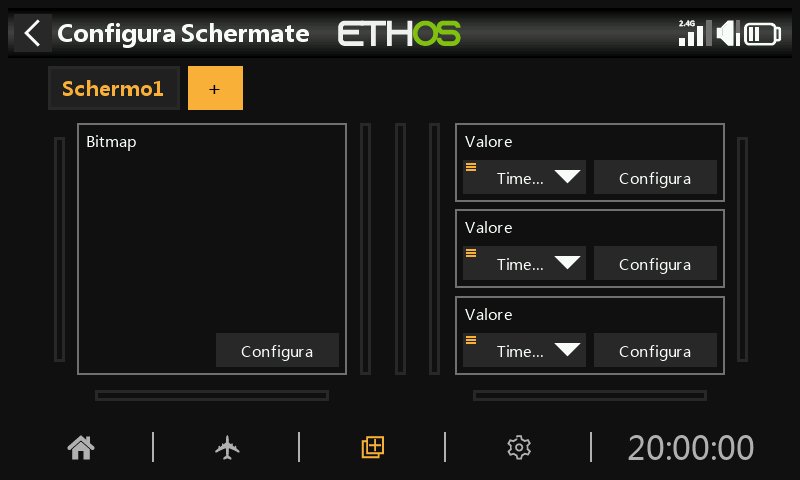

La schermata principale è costituita da una o più **schermate di visualizzazione**, ciascuna composta da **widget** che l'utente posiziona e configura a piacere. Premendo `DISP` si apre l'editor della schermata corrente.

Ci possono essere fino a **otto** schermate definite dall'utente, ognuna basata su uno dei **tredici** layout disponibili (con un massimo di **nove** celle per la visualizzazione dei widget). I widget possono visualizzare i valori della telemetria, ma anche informazioni di altre diciassette categorie diverse — stato del modello e della radio, timer, canali e altro ancora. Una volta configurate le schermate, è possibile accedervi con un gesto di sfioramento o con i comandi di navigazione `PAGE` Su/Giù; la barra superiore e quella inferiore rimangono visualizzate su tutte le schermate, tranne quella a schermo intero.

## Aggiungere un widget

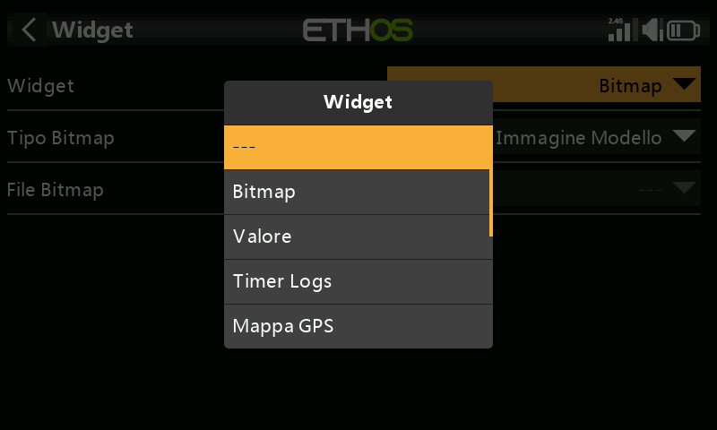

Ogni schermata è una griglia; toccando una cella vuota si apre la finestra di selezione dei widget. I widget spaziano da semplici indicazioni testuali e numeriche fino a strumenti analogici, grafici e registri di telemetria completi. Una volta posizionato, toccando nuovamente un widget si apre lo stesso menu di opzioni usato per ridimensionarlo, spostarlo o rimuoverlo:

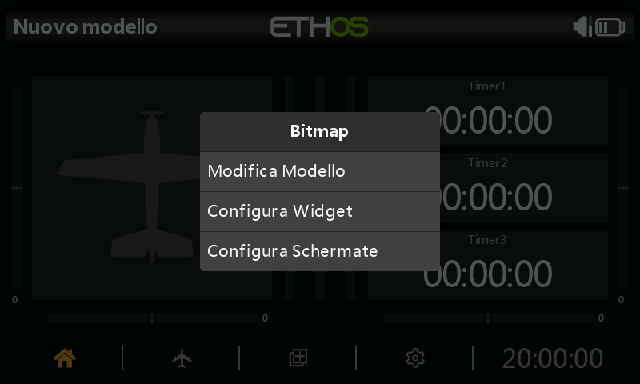

Selezionando le impostazioni proprie di un widget si apre un modulo di configurazione specifico per quel widget. Il campo **sorgente** — cioè il valore visualizzato dal widget — utilizza lo stesso [selettore di sorgente](../getting-started/user-interface-and-navigation.md#choosing-a-source) presente ovunque in Ethos:

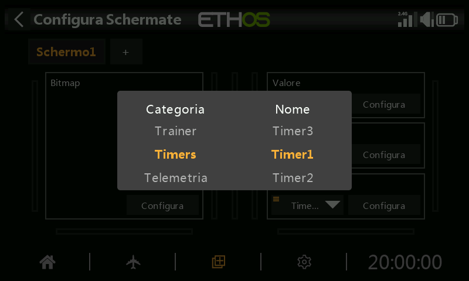

## Tipi di widget {: #widget-types }

**Valore** — visualizza semplicemente il valore della sorgente selezionata, sotto forma di testo:

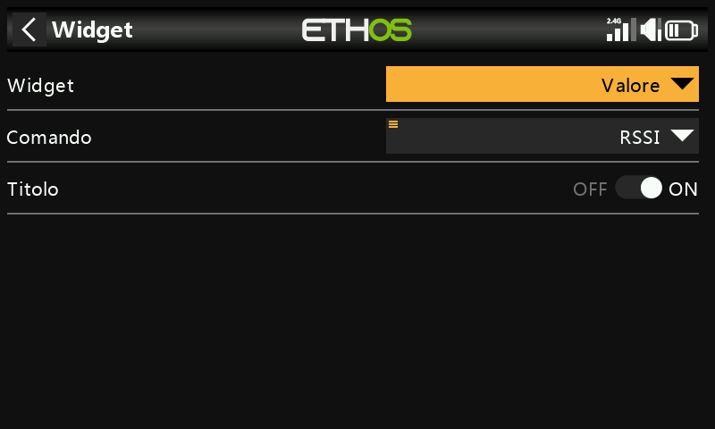

La maggior parte delle sorgenti permette anche di visualizzare il valore **minimo** o **massimo** in tempo reale: dopo la selezione, una pressione prolungata sulla sorgente permette di scegliere Min o Max — utile, ad esempio, per conoscere il valore peggiore di RSSI durante un volo:

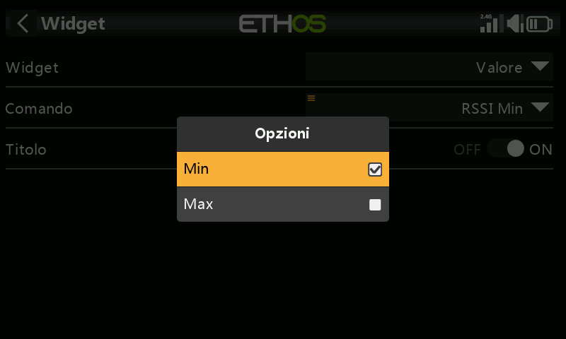

Una volta posizionato, viene visualizzato come una semplice indicazione sulla schermata:

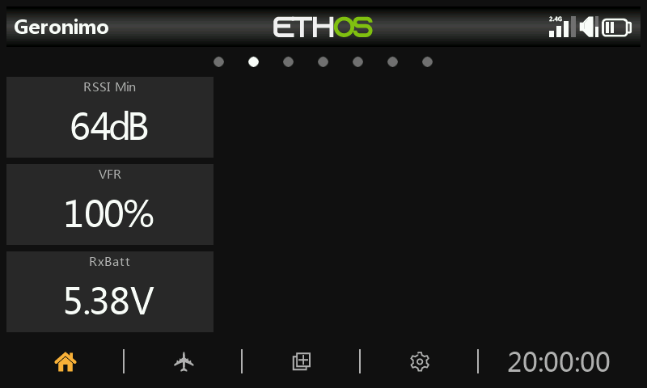

**Bitmap** — serve a visualizzare una bitmap selezionata (ad esempio l'immagine del modello), oppure una serie di immagini che si alternano in base al valore di una sorgente (ad esempio un'icona della batteria che cambia con la tensione):

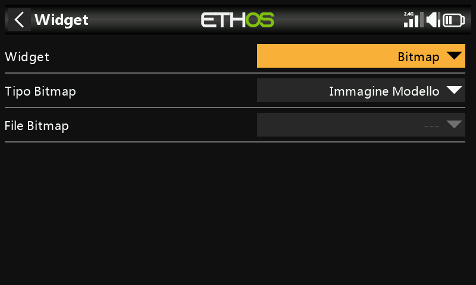
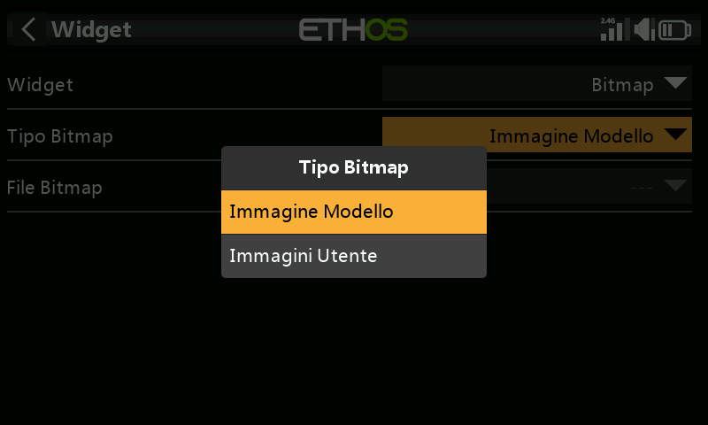

**LiPo** — un indicatore di batteria dedicato che visualizza le informazioni sulla tensione delle LiPo provenienti da sensori come FLVSS: mostra la tensione totale del pacco e il numero di celle, oltre alle tensioni delle singole celle. Se la tensione più bassa della cella è inferiore alla soglia di **Voltaggio basso**, le tensioni vengono visualizzate in rosso — nell'esempio seguente la soglia è stata impostata a 3,3 V e il valore della cella più bassa è visualizzato in rosso:

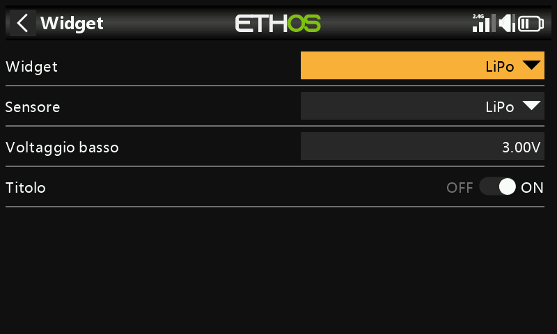
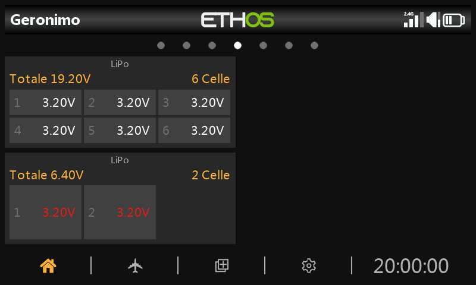

**Canali** — permette di visualizzare fino a 8 canali di uscita in formato grafico a barre, con barre orizzontali o verticali:

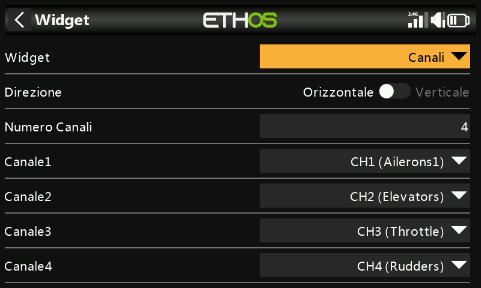
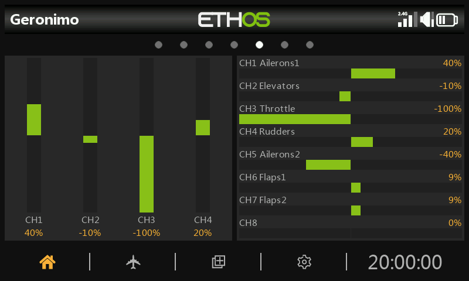

**Grafico a linee** — permette di tracciare il grafico della sorgente selezionata nel tempo; nota che il widget ripristina i suoi dati in caso di "Flight Reset":

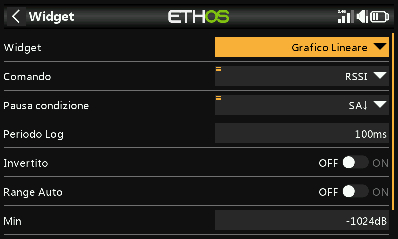
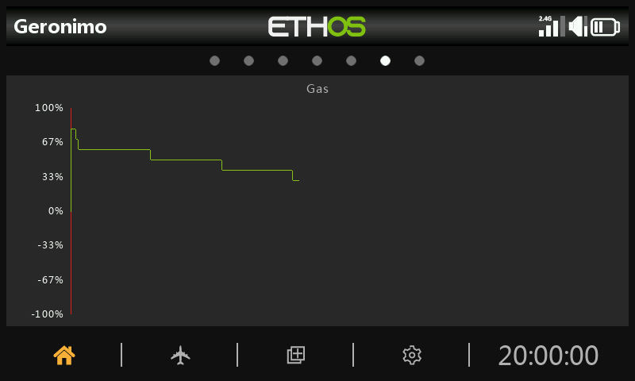

- **Fonte** — seleziona la sorgente da analizzare.
- **Condizione di pausa** — seleziona la sorgente da utilizzare come controllo di pausa (se non disponi di un comando libero, puoi anche mettere in pausa e riprendere il grafico toccando il widget mentre è in esecuzione).
- **Periodo di log** — intervallo di registrazione; utilizzando un periodo di 500 ms il grafico coprirà circa 6 minuti prima di iniziare a scorrere fuori dalla pagina, mentre 1 s coprirà circa 12 minuti.
- **Invertito** — il grafico di log può essere invertito verticalmente.
- **Gamma automatica** — se attivata, l'asse verticale verrà scalato in base all'ingresso; se disattivata, l'asse verticale verrà scalato in base alle impostazioni **Min** e **Max** (ad esempio un intervallo fisso da −100% a +100%).

Toccando il grafico a linee mentre è in esecuzione si apre una finestra di dialogo che permette di mettere in **Pausa** o riprendere la registrazione, eseguire il **Reset** (azzerare il grafico e ricominciare), accedere a **Configura Widget** oppure passare a **Configura Schermate**:

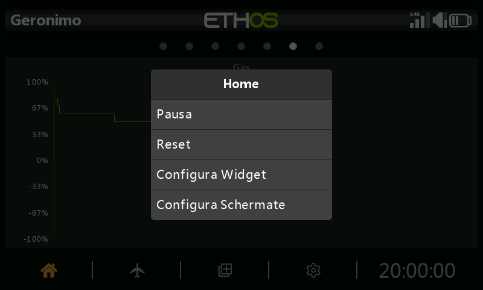

**Testo** — visualizza il contenuto di un file di testo; è supportato il formato Markdown (il file deve essere collocato in `documents/user/` — vedi [File Manager](../system-setup/file-manager.md#top-level-folders)):

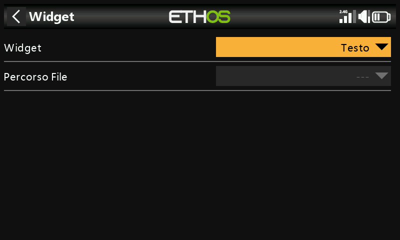
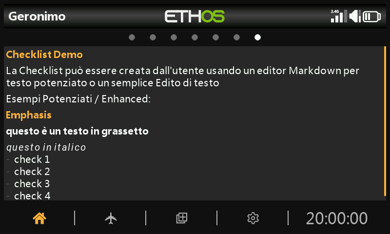

**Registri del timer** — un registro scorrevole dei valori passati del timer selezionato, scritti ogni volta che il timer viene resettato (utile per tenere traccia dell'utilizzo dei pacchi di volo durante una sessione); **Inverti** mette la voce più recente in cima al registro:

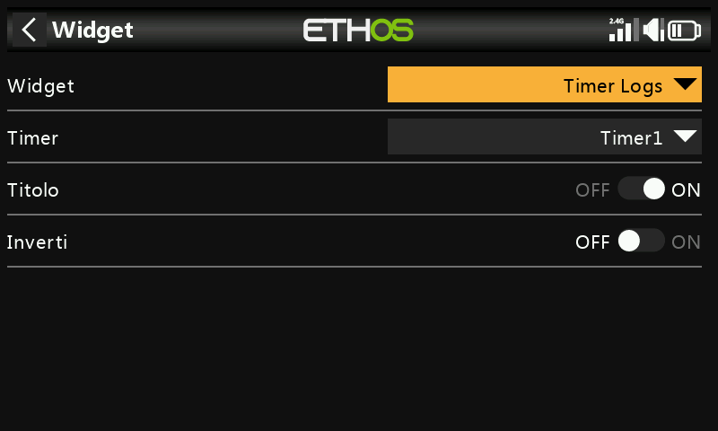
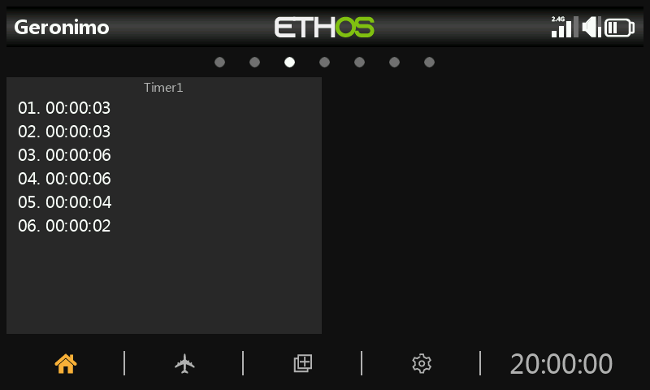

Premi a lungo su una voce (o sul widget) per "svuotare i registri", modificare o resettare il timer associato, oppure configurare il widget o le schermate:

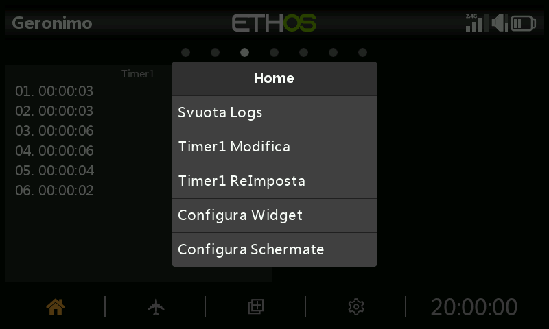

**Mappa GPS** — traccia in tempo reale la posizione GPS come percorso, per i modelli dotati di sensore GPS (per maggiori dettagli su questo widget consulta la discussione *FrSky - ETHOS Lua Script Programming* su rcgroups, in particolare il post #8854):

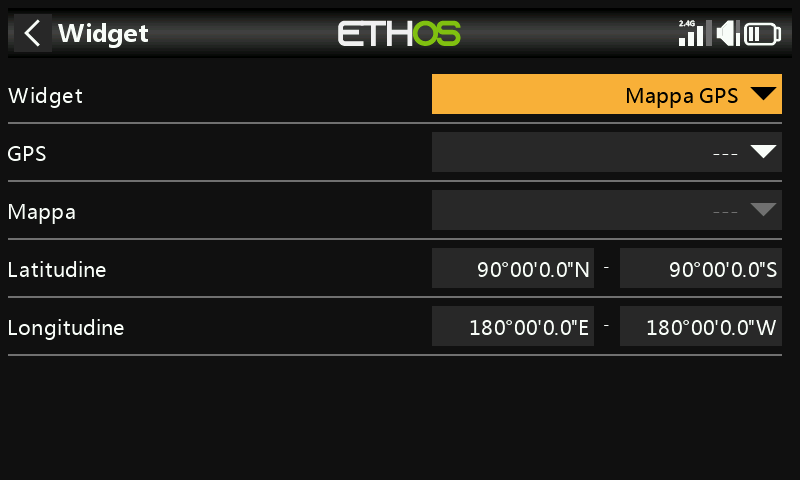

## Opzioni a livello di schermata

Oltre ai singoli widget, ogni schermata dispone di impostazioni proprie — dimensione della griglia del layout, sfondo e quali schermate sono incluse nel ciclo di `PAGE`:

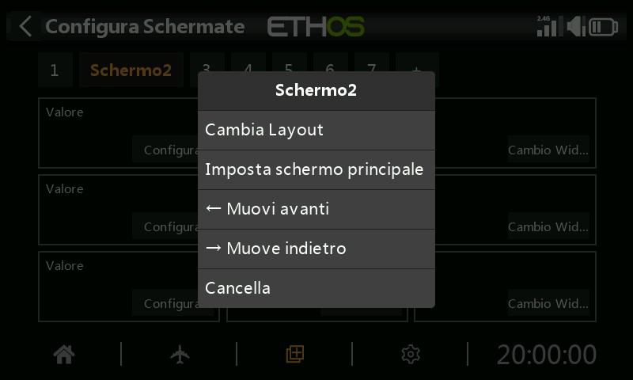

Una schermata principale completamente configurata combina più widget in un unico layout leggibile a colpo d'occhio:

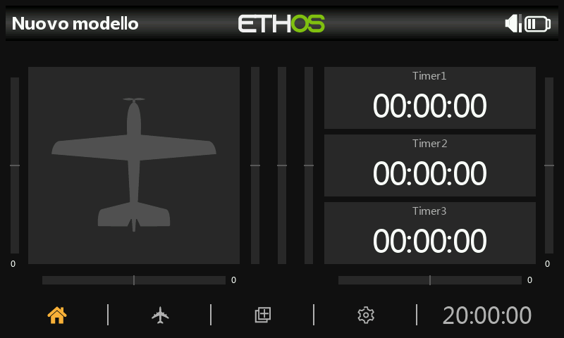

Consulta [Display aggiuntivi](additional-displays.md) per aggiungere altre schermate oltre a quella predefinita, e [Widget personalizzati](custom-widgets.md) per i widget realizzati con script Lua oltre a quelli integrati.
