# Funzionamento

## Sezione Dispositivi

FrSky Suite supporta tre tipi di dispositivi FrSky, ovvero le radio Ethos, le radio ECOS e i controllori di volo Aegis. Per ulteriori dettagli, consultare le rispettive sezioni riportate di seguito.

Ethos

FrSky Suite si apre per impostazione predefinita nella sezione dedicata ai dispositivi Ethos, con la schermata mostrata sopra se all'avvio non è stata rilevata alcuna radio Ethos.

È possibile collegare la radio in modalità bootloader oppure, una volta accesa, in modalità “FrSky Suite”. Per ulteriori informazioni, consultare la sezione “Modalità di connessione USB al PC”.

Una volta rilevata una radio Ethos, i relativi dettagli vengono elencati come mostrato nell'esempio sopra riportato. Il messaggio di stato “Connessione radio non rilevata” è stato sostituito da “Connesso a X20 Pro” per indicare che è collegato un X20 Pro.

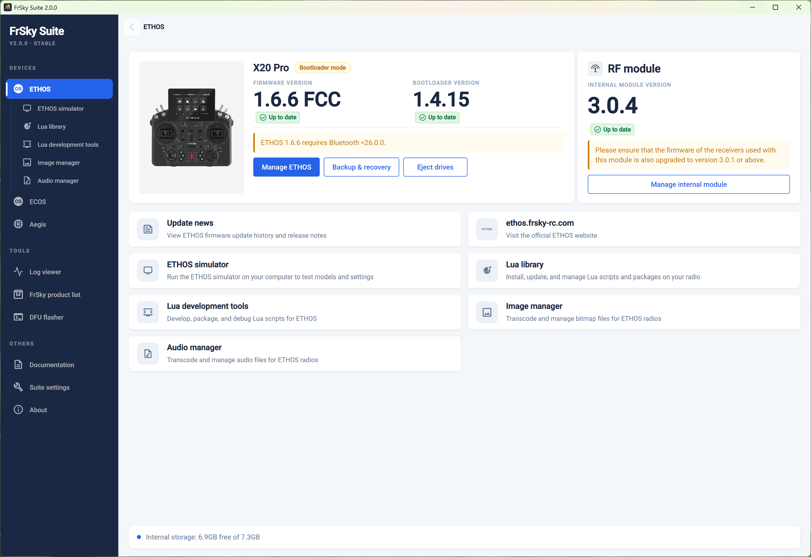

Informazioni radio

Connessa

Vengono elencate le versioni attuali del firmware e del bootloader, contrassegnate con l'etichetta rossa "Non aggiornato" o quella verde "Aggiornato".

Sotto compare un messaggio che conferma la compatibilità tra il firmware e il bootloader. Se, ad esempio, hai aggiornato solo il firmware, potresti ricevere un messaggio che indica che il firmware richiede una versione più recente del bootloader.

Lo stato del modulo RF viene visualizzato accanto al pannello “Informazioni radio”; si prega di fare riferimento alla sezione dedicata al modulo RF riportata di seguito.

Backup e ripristino

Prima di eseguire gli aggiornamenti, è consigliabile selezionare l'opzione "Backup e ripristino" per effettuare il backup dello stato attuale della radio.

Gestire ETHOS

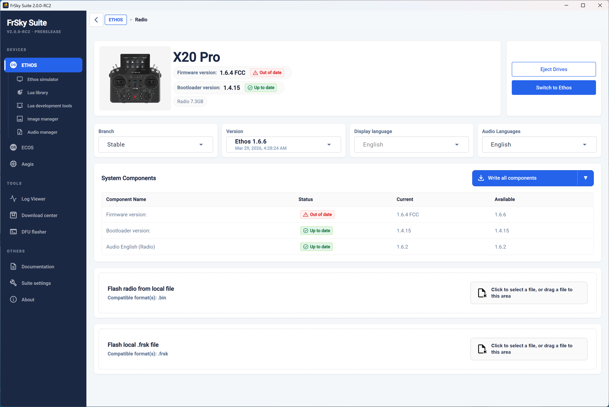

Clicca sul pulsante “Gestisci Ethos” per aprire la pagina di aggiornamento.

L'esempio sopra riportato mostra che un X20 Pro è collegato in modalità Bootloader. Se lo si desidera, è possibile fare clic sul pulsante "Passa a Ethos" per cambiare modalità, ad esempio per eseguire il flashing di un ricevitore o di un modulo. In genere non è necessario preoccuparsi della modalità in cui ci si trova, poiché Suite passa automaticamente da una modalità all'altra quando necessario.

Vengono visualizzate le versioni del firmware, del bootloader e dei file audio (sia sulla scheda SD che nella memoria interna della radio). La versione del firmware risulta non aggiornata. Le versioni del bootloader e dei file audio sono aggiornate.

Si prega di notare che i file di sistema presenti nella memoria Flash vengono ora aggiornati insieme al firmware, pertanto non è più necessario gestirli separatamente.

##### Esecuzione degli aggiornamenti

##### Opzioni di aggiornamento prima del rilascio

Se desideri effettuare l'aggiornamento alle versioni di firmware in anteprima, devi modificare l'impostazione del server in "Impostazioni Suite" da "FrSky Server" a "GitHub". Ti invitiamo a consultare la sezione "Posizione del server" riportata di seguito.

##### Selezione delle opzioni di aggiornamento

Se la radio non è aggiornata, è necessario:

1. Seleziona la versione desiderata, scegliendo innanzitutto il ramo desiderato, ad esempio “Stabile” o “Versione di prova”, quindi selezionando la versione desiderata e le lingue di visualizzazione e audio.
2. A questo punto è possibile "Scrivere tutti i componenti" cliccando sul pulsante "Scrivi tutti i componenti".
3. In alternativa, cliccando sul pulsante con la freccia verso il basso situato sulla destra si aprirà un elenco a tendina che mostra le opzioni alternative per scrivere i componenti obsoleti, oppure per scrivere solo il firmware e i file di sistema (necessari per l'esecuzione del firmware), oppure il bootloader, oppure i file audio singolarmente.	

##### Esecuzione degli aggiornamenti

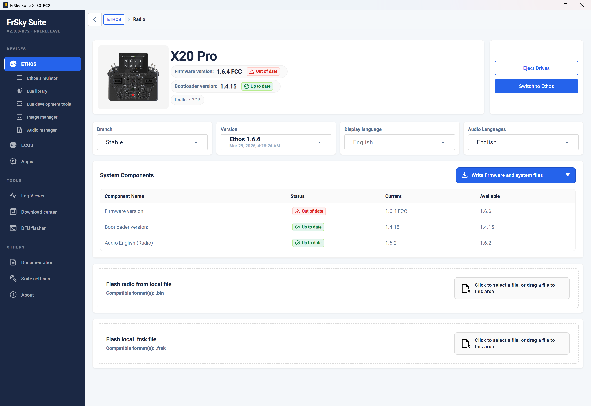

Una volta selezionato l'ambito desiderato dell'aggiornamento, fare clic sull'opzione selezionata per procedere. Nell'esempio sopra riportato abbiamo selezionato l'opzione "Scrivi firmware e file di sistema".

Dopo aver cliccato sull'opzione "Scrivi firmware e file di sistema", ti verrà richiesto di accedere prima alla pagina di backup ed eseguire un backup completo prima di procedere. Si prega di fare riferimento alla sezione "Backup e ripristino".

Questo è particolarmente importante perché, dopo l'aggiornamento, i file dei modelli verranno aggiornati alla nuova versione non appena li caricherete. Si tratta di un processo irreversibile, quindi, una volta aggiornati, i modelli non potranno più essere caricati se decidete di ripristinare una versione precedente del firmware della vostra radio. Dopo aver ripristinato una versione precedente del firmware, dovrete recuperare i modelli e gli altri dati dai vostri backup.

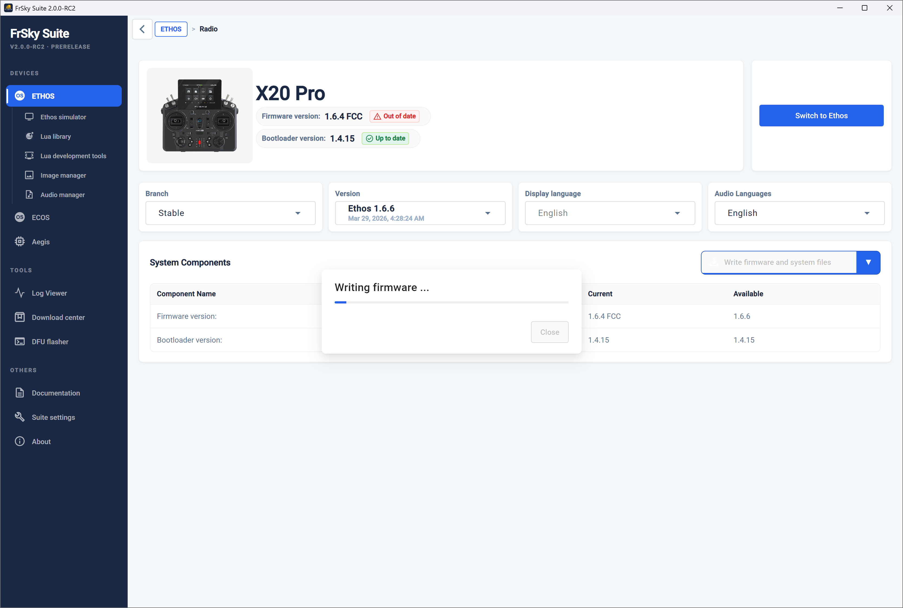

Dopo aver eseguito il backup, torna alla pagina “Gestisci Ethos” e clicca sull’opzione “Scrivi firmware e file di sistema”, quindi seleziona l’opzione “Continua l’aggiornamento”.

Se il modulo RF interno non è alla versione 3.0.1 o successiva, sarà necessario aggiornarlo prima di poter procedere con l'installazione della versione 1.6.0 o successive. Fare clic su "Gestisci modulo interno" nella pagina iniziale per aggiornare il modulo RF interno, quindi tornare a questa pagina per continuare.

Verrà visualizzata una barra di avanzamento sia nella pagina che sulla radio.

Al termine dell'operazione, verrà visualizzato il messaggio "Aggiornamento completato con successo". La versione del firmware risulta ora aggiornata.

Allo stesso modo, è possibile ricorrere alle opzioni alternative che consentono di scrivere singolarmente i componenti obsoleti, il bootloader o i file audio.

È sempre consigliabile espellere manualmente le unità utilizzando il pulsante “Espelli unità” prima di scollegare il cavo USB.

##### Riproduzione radio da file locale

##### File .frsk locale Flash

##### Espelli le unità

Fare clic sul pulsante “Espelli unità” per scollegare la radio.

Modulo RF

Il gestore del modulo RF serve ad aggiornare il firmware del modulo RF.

Gestisci il modulo interno

Selezionare la versione desiderata (di norma quella più recente). I dettagli relativi al firmware della versione selezionata vengono visualizzati nel pannello a destra.

Fare clic su "Flash" per scrivere il firmware nel modulo RF interno.

Al termine dell'operazione viene visualizzata la finestra di dialogo "FRSK flashato con successo".

Backup e ripristino

Utilizzando la funzione “Backup e ripristino” è possibile salvare su disco un backup dei modelli e delle impostazioni presenti sulla radio, oppure ripristinare sulla radio un backup salvato in precedenza. I modelli non sono retrocompatibili, pertanto, in caso di downgrade a una versione precedente del firmware, i file dei modelli precedenti devono essere ripristinati dal PC.

Attenzione!

Il ripristino NON ripristina il firmware! Dopo aver ripristinato i modelli e le impostazioni, dovrai comunque utilizzare Suite per riscrivere il firmware utilizzando la versione corrispondente al tuo backup. Fai riferimento alla sezione “Aggiornamento del firmware” riportata sopra.

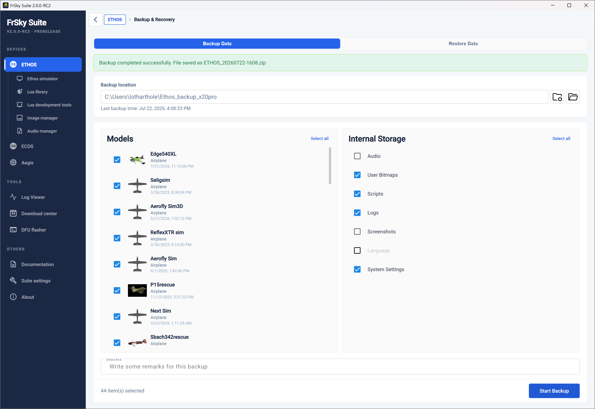

Percorso di backup

Fare clic sull'icona della cartella per individuare e selezionare la posizione di backup desiderata. Il percorso di backup verrà salvato per ciascun tipo di radio.

La data e l'ora dell'ultimo backup vengono visualizzate sotto la posizione.

Inizia Backup

Selezionare i modelli e le aree di “memoria interna” di cui si desidera eseguire il backup, quindi aggiungere eventuali note pertinenti.

Fai clic su “Avvia backup” per eseguire un backup dei file di modello selezionati e delle aree di archiviazione presenti sulla radio. Durante la creazione del backup verrà registrata la versione corrente di Ethos.

Ripristina Dati

Fare clic su "Ripristina dati" per ripristinare sulla radio i file dei modelli di cui è stato effettuato in precedenza un backup. Questa operazione potrebbe essere necessaria quando si esegue il downgrade del firmware della radio a una versione precedente.

##### Cronologia Backup

La cronologia dei backup elenca tutti i backup rilevati nella posizione di backup selezionata. Selezionarne uno per visualizzarne i dati.

Il pannello di destra mostrerà i dettagli quali la data del backup, la versione di Ethos indicata nella voce “creato il”, la radio di backup, la dimensione del backup e la nota salvata relativa al backups.

Verranno elencati anche i componenti di cui è stato eseguito il backup.

##### Ripristino

I componenti selezionati nella sezione "Avanzate" verranno ripristinati sulla radio. Si noti che i file esistenti con lo stesso nome verranno sovrascritti durante il processo di ripristino.

Fai clic su "Avvia ripristino" per ripristinare i file di backup selezionati sulla radio.

Informazioni aggiornamento

Fai clic su "Informazioni Aggiornamenti" per visualizzare la cronologia degli aggiornamenti del firmware di Ethos e le note di rilascio.

Attiva l’opzione “Pre-release” nella parte superiore della pagina per includere le versioni pre-release nella cronologia degli aggiornamenti del firmware di Ethos e nelle note di rilascio.

ethos.frsky-rc.com

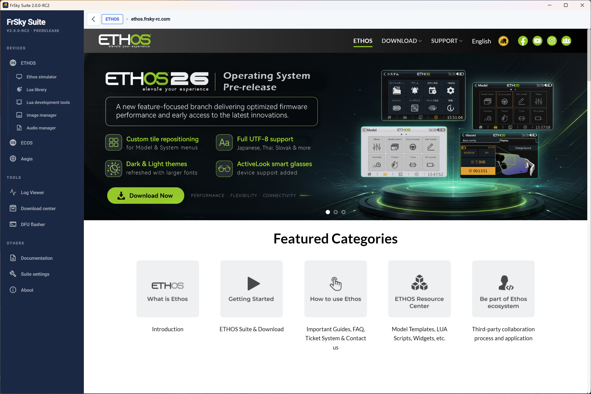

Clicca sul pulsante “ethos.frsky-rc.com” per visitare il sito ufficiale di Ethos.

Il sito web comprende le seguenti categorie:

- Un'introduzione a Ethos, 
        - una sezione "Guida introduttiva" che include informazioni sul processo di aggiornamento di Ethos e i link per il download di FrSky Suite ecc.
        - una sezione “Come utilizzare Ethos” che include guide importanti, domande frequenti e un sistema di ticket per l’assistenza
        - l’“Ethos Resource Centre”, che comprende modelli, script LUA, widget, ecc.
        - il processo di collaborazione con terze parti e i dettagli relativi alle candidature

Simulatore Ethos

Il simulatore Ethos consente di esplorare le funzionalità della radio e di testare le funzionalità o i miglioramenti previsti per il modello senza dover utilizzare la radio vera e propria. Consente inoltre di provare le nuove versioni prima di aggiornare la radio.

Per iniziare, selezionare il tipo di radio da simulare, la versione di Ethos desiderata e il protocollo RF. Quindi fare clic su “Avvia simulatore”.

Si prega di notare che le versioni Nightly in anteprima saranno disponibili solo se nella scheda “Impostazioni della suite” è stata selezionata l’opzione “GitHub” come posizione del server.

Configurazione semplice

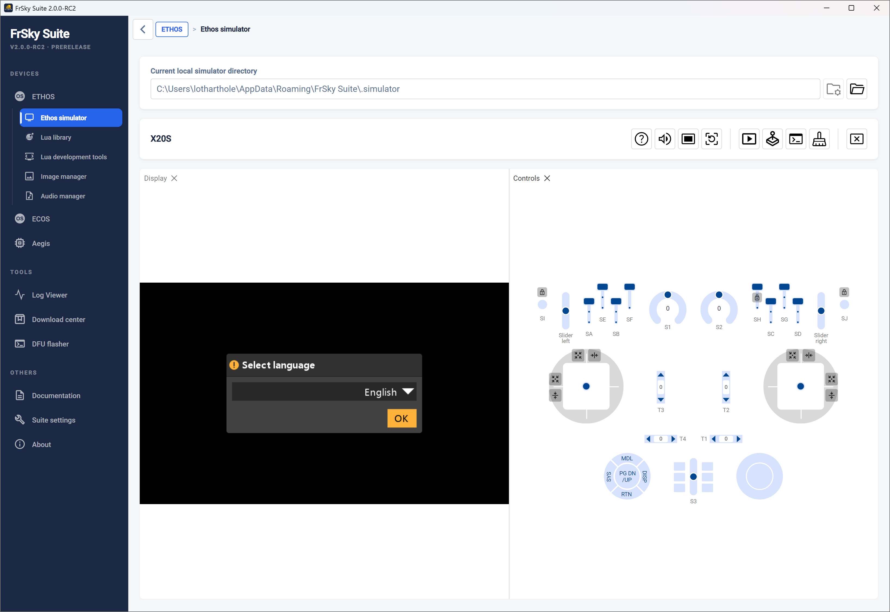

Se non vengono rilevati dati radio validi, viene avviata una sequenza di inizializzazione.

Per una rapida panoramica, basta utilizzare la procedura guidata per la creazione di un nuovo modello che si avvia dopo aver fatto clic su OK. Ciò ti consentirà di esplorare il simulatore con il minimo sforzo o di valutare Ethos prima di acquistare una radio FrSky.

Nell'esempio sopra riportato, la procedura guidata per la creazione di un nuovo modello è stata completata e il modello è stato denominato "TestModel".

Il pannello “Display” sulla sinistra riproduce il display LCD della radio, mentre il pannello “Controlli” riproduce i comandi fisici della radio selezionata.

Nella parte superiore della finestra viene visualizzata la “Directory corrente del simulatore locale”.

Configurazione consigliata

È consigliabile riprodurre la configurazione della propria radio nel simulatore. In questo modo si otterranno le stesse funzionalità disponibili sulla radio reale, il che consentirà di testare facilmente i miglioramenti apportati ai modelli senza influire sull’ambiente di volo o di modellismo, finché tutto non funzionerà come previsto.

In alternativa, è possibile creare e testare un modello completamente nuovo, magari basandolo su uno dei propri modelli predefiniti oppure creando un clone di un modello esistente e modificandolo. Questi approcci massimizzano il riutilizzo senza dover programmare un modello da zero. Una volta completato, il file del modello .bin può essere copiato dalla cartella /models nel percorso del simulatore alla cartella /models della radio, a condizione che il simulatore non sia in esecuzione con una versione del firmware Ethos più recente.

I passaggi consigliati per la configurazione sono i seguenti:

1. Esegui un backup della tua radio utilizzando la funzione "Backup e ripristino" di Suite.

2. Per un modello semplice, è consigliabile completare inizialmente la procedura guidata per la creazione di un nuovo modello. In questo modo sarà più facile individuare e sostituire questa configurazione con il backup della radio. Si prega di fare riferimento alla sezione “Configurazione semplice” riportata sopra.

3. Individuare il percorso del file del simulatore cliccando sull'icona della guida . La finestra di dialogo di aiuto a comparsa illustra la struttura dei percorsi dei file del simulatore (vedi sopra).

Nella parte superiore della finestra viene visualizzata anche la “Directory corrente del simulatore locale”.

4. Utilizzando Esplora risorse, individuare e accedere alla cartella della radio prescelta nella struttura dei percorsi dei file del simulatore. Una struttura di esempio è riportata sopra.

5. Importante: chiudere FrSky Suite prima di proseguire.

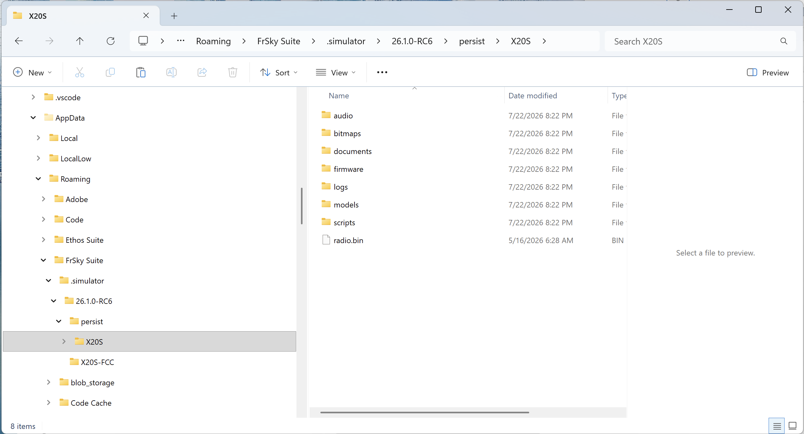

All'interno della cartella della radio selezionata, sostituisci il contenuto attuale (ovvero la cartella "models" e il file "radio.bin") con il backup della tua radio. (Se lasci la cartella "models" al suo posto, il suo contenuto verrà unito a quello del backup della tua radio.) Sopra è riportata una struttura di esempio, che dovrebbe sembrarti molto familiare poiché è identica a quella presente sulla tua radio.

6. Riavvia FrSky Suite e il simulatore.

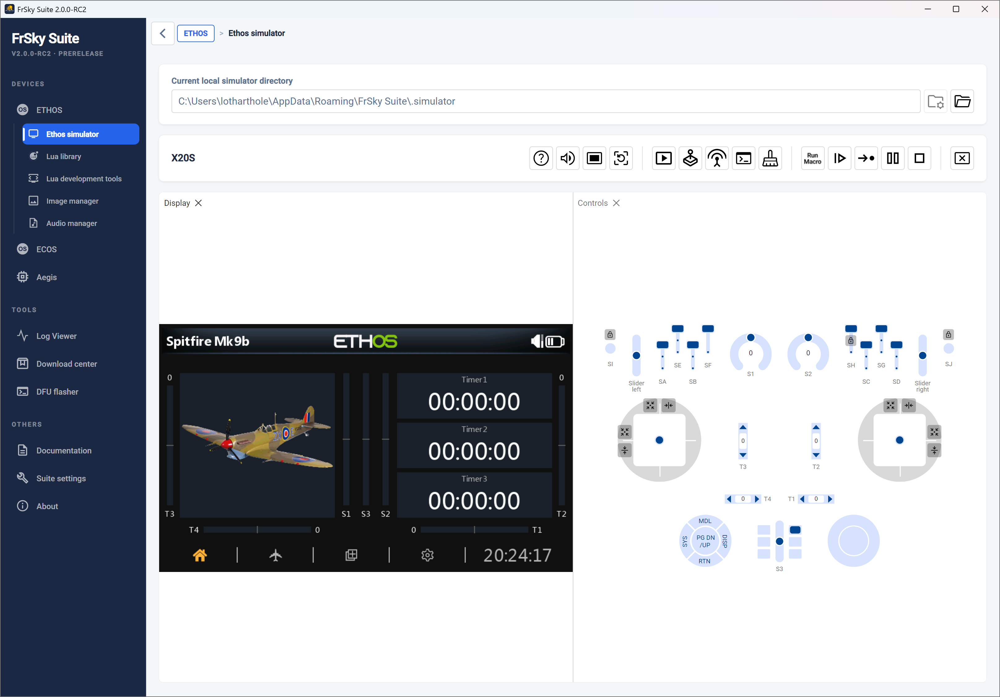

Dovrebbe partire dal modello che era selezionato sulla tua radio al momento della creazione del backup. In questo esempio, il modello selezionato era uno Spitfire.

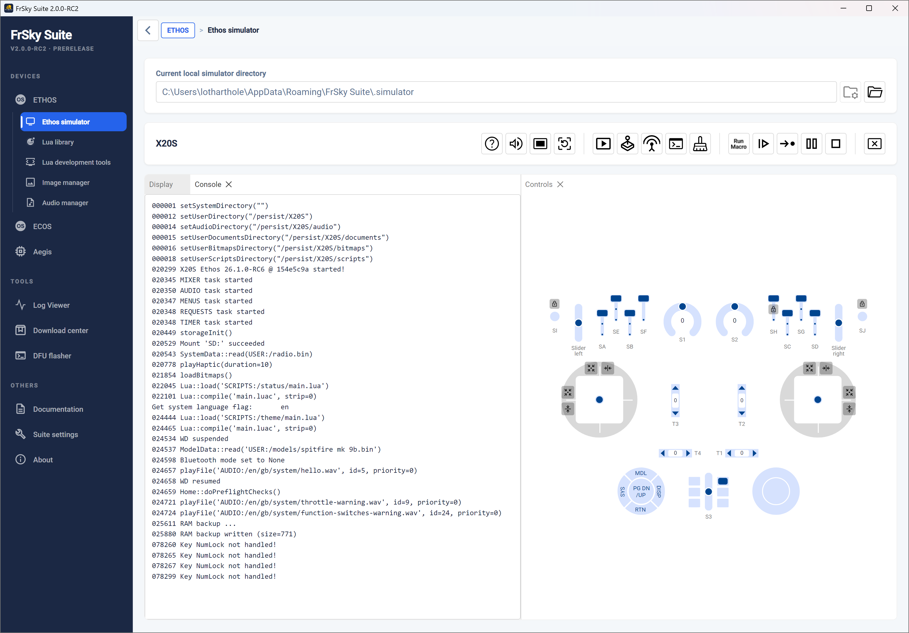

7. Aprire il pannello della console cliccando sull'icona "Apri pannello della console" . Si aprirà accanto al pannello di visualizzazione.

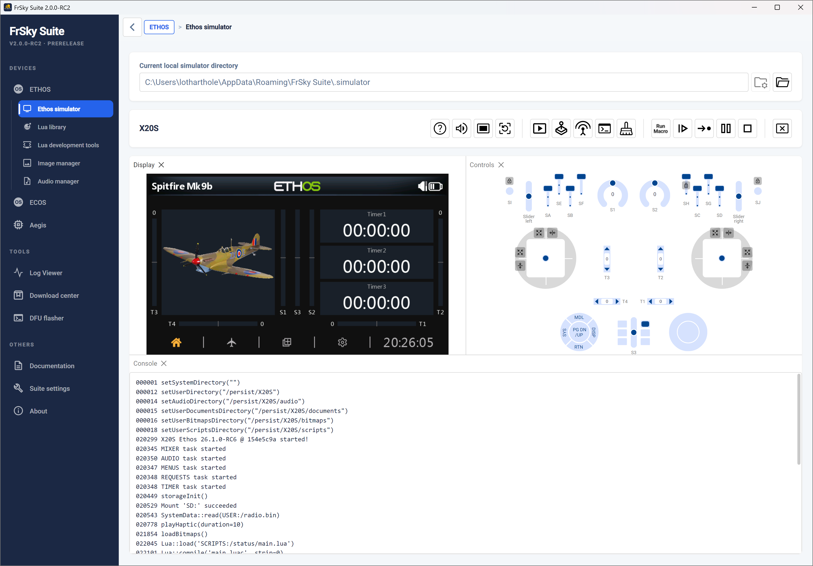

8. Trascinare la scheda del pannello “Console” verso il basso, in direzione della parte inferiore della finestra della Suite, fino a quando non compare una sottile barra ombreggiata che attraversa entrambi i pannelli proprio nella parte inferiore. Il pannello “Console” dovrebbe ora occupare la metà inferiore del simulatore, facilitando la lettura delle righe più lunghe nel log, pur mantenendo visibili i pannelli “Display” e “Controlli”. La console è utile per verificare la sequenza di avvio del simulatore e per monitorare gli eventi e i messaggi di errore.

Barra delle attività del simulatore

La barra delle attività del simulatore presenta i seguenti comandi:

General

	Aiuto

	Attivazione/disattivazione del silenziamento dell'altoparlante

	Ricarica il simulatore

Panel controls

	Pannello di visualizzazione aperto (riproduce il display LCD della radio)

	Apri il pannello di controllo (simula i comandi della radio)

	Apri il pannello Console che visualizza un log testuale dell'esecuzione del simulatore

	Cancella l'output della console

Macro Controls

	Esegui macro - Richiede il percorso delle macro, quindi elenca tutte quelle trovate e propone di eseguirne una o più

	Avvierà l'esecuzione della macro caricata

	Eseguerà una riga alla volta della macro

	Metterà in pausa la macro

	Interrompi l'esecuzione della macro

Exit

	Chiudi il simulatore

Pannello di controllo

Il pannello “Controlli” riproduce i comandi hardware della radio selezionata.

Gimbal

Gli stick possono essere azionati trascinandoli con il mouse. Durante il debug è utile limitare o restringere il movimento degli stick.

	Centra automaticamente lo stick su uno o entrambi gli assi.

	Limiterà il movimento dello stick esclusivamente in senso verticale.

	Limiterà il movimento dello stick esclusivamente in orizzontale.

Momentary switches and buttons

	Blocca gli interruttori e i pulsanti momentanei in modo che possano passare da acceso a spento e viceversa, ma rimangano nello stato selezionato (acceso o spento) per il debug.

Libreria Lua

La libreria Lua contiene link per il download e opzioni di installazione per vari strumenti e script Lua.

Può anche installare script Lua dalla radio a partire da un file zip locale.

Una volta installati alcuni script sulla radio, lo strumento della libreria Lua mostrerà gli script installati nel riquadro di sinistra e la libreria remota in quello di destra.

Strumenti di sviluppo Lua

Questa sezione consente di consultare la documentazione di Ethos Lua, accedere agli script dimostrativi di Lua, preparare un pacchetto Lua e utilizzare un terminale per il debug.

Lua Docs

Fornisce un link alla guida di riferimento di Ethos Lua.

Per ulteriori informazioni, script creati dagli utenti e widget, si prega di consultare anche il thread "FrSky - ETHOS Lua Script Programming" su rcgroups.

Script di dimostrazione di Lua

Questo pulsante apre la pagina web della comunità Ethos-Feedback su GitHub, dove è possibile trovare i link ad alcuni script dimostrativi in Lua che forniscono esempi di codice.

Pacchetto Ethos per Lua (manifesto ZIP)

Questo pulsante apre la pagina web che spiega come preparare un pacchetto ZIP contenente uno script Lua per ETHOS che possa essere correttamente riconosciuto e installato dal programma di installazione della libreria Lua.

Debug

La funzione di debug mette a disposizione una finestra di log di debug per visualizzare le tracce di debug Lua inviate alla porta USB-Seriale mentre la radio è in modalità seriale.

1. Per prima cosa, collega il trasmettitore a Suite come di consueto.

2. Passa alla modalità Ethos. Ora puoi modificare il tuo codice Lua direttamente sulla radio, utilizzando Esplora file di Windows o il Finder di macOS e il tuo editor di codice preferito.

3. Aprire la scheda "Strumenti di sviluppo Lua".

4. Fare clic su “START DEBUG”: in questo modo il trasmettitore passerà alla “modalità debug”, ovvero alla modalità seriale.

5. Il trasmettitore si riavvia e reinizializza gli script Lua. Tutti i messaggi di output degli script Lua attivi nel modello vengono inviati alla finestra del terminale integrato di Suite tramite la modalità seriale.

6. Se viene rilevato un problema o un errore, si utilizza lo strumento di sviluppo per tornare alla modalità Ethos cliccando su “STOP DEBUG”.

7. Lo script Lua può essere modificato nuovamente

8. L'errore illustrato nell'esempio sopra riportato è stato risolto ed è possibile verificare il corretto funzionamento del sistema.

Gestione immagini

Il gestore delle immagini convertirà le tue immagini nel seguente formato:

Dimensioni:    Come specificato dall'utente, mantenendo però le proporzioni.

Formato:    BMP a 32 bit

Spazio colore:    RGB

Canale alfa:    L'alfa verrà aggiunto solo se necessario, se l'opzione è selezionata.

Si noti che le immagini a schermo intero per l'X20 hanno una risoluzione di 800x480 pixel, mentre quelle per l'X18 sono di 480x320.

Per le regole di denominazione dei file, consultare la sezione “Bitmap” nel File Manager.

Elenco da transcodificare

Crea l'elenco delle immagini da transcodificare nel pannello di sinistra.

Il pulsante "Cancella tutto" cancellerà l'elenco.

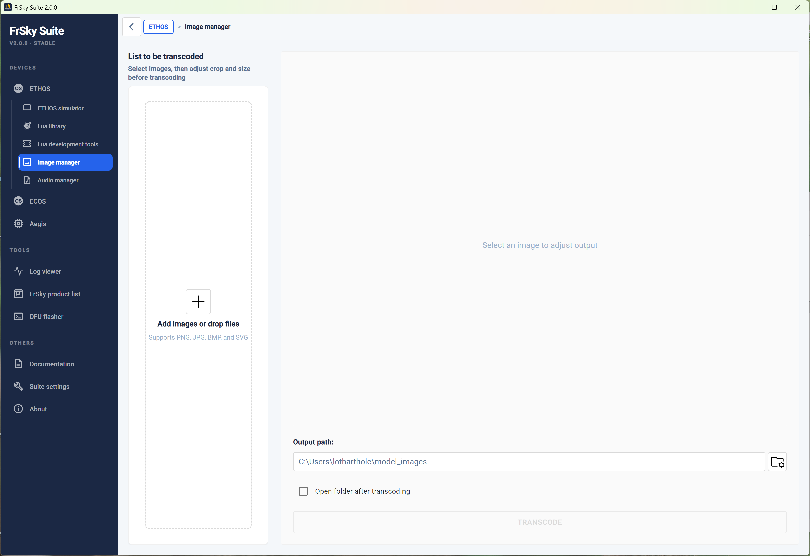

List to be transcoded

Create the list of images to be transcoded in the left panel.

The ‘Clear all’ button will clear the list.

Impostazioni di risoluzione

Inserisci o seleziona le dimensioni desiderate per l'immagine. In genere Ethos ridimensiona automaticamente l'immagine

Mantieni le proporzioni

Il formato dell'immagine potrebbe essere bloccato.

Trasparenza

Aggiungerà un canale alfa per la trasparenza solo se non è già presente.

Percorso di uscita

Inserisci o seleziona la cartella di destinazione desiderata.

Impostazioni di risoluzione

Inserisci o seleziona le dimensioni desiderate per l'immagine.

Converti

Il gestore delle immagini convertirà le immagini nella dimensione desiderata e le salverà nel percorso di output selezionato.

Opzioni

Sono disponibili le seguenti opzioni:

• aprire la directory (cartella) dopo la transcodifica, e

• aggiungere un canale alfa per la trasparenza. Si noti che il canale alfa verrà aggiunto solo se non è già presente.

Gestione audio

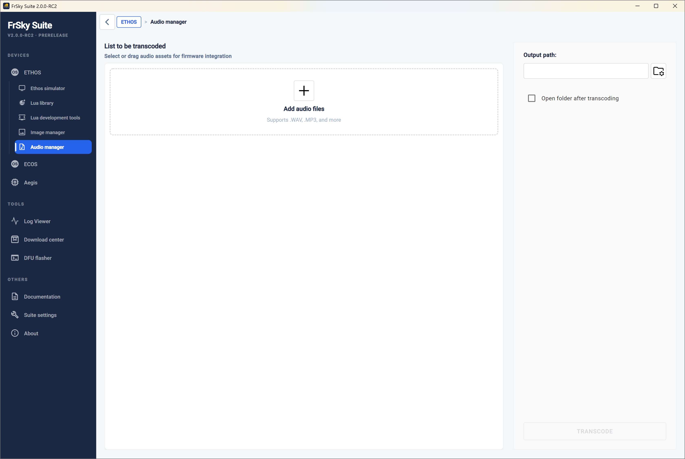

Il gestore audio convertirà i tuoi file audio nel seguente formato:

Formato:    PCM lineare

Frequenza di campionamento:    32 kHz

Canali:    1 (mono)

Bit per campione:    16 bit, low endian (pcm\_s16le)

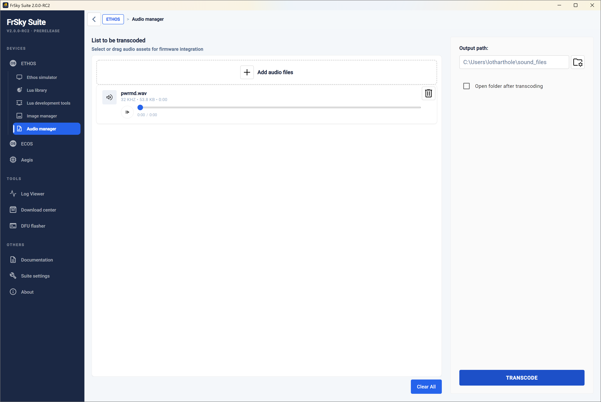

Elenco da transcodificare

Crea l'elenco dei file audio da transcodificare nel pannello di sinistra.

Il pulsante "Cancella tutto" cancellerà l'elenco.

Percorso di uscita

Inserisci o seleziona la cartella di destinazione desiderata.

Converti

Il gestore audio transcodificherà i file audio nella dimensione desiderata e salverà le immagini nel percorso di output selezionato.

Opzioni

Infine, è disponibile un'opzione che consente di aprire la directory (cartella) al termine della conversione.

ECOS

ECOS è un sistema operativo completamente nuovo e semplificato, sviluppato da FrSky e presentato insieme al trasmettitore FrSky EX14. Si tratta di una versione semplificata ed entry-level derivata dal sistema operativo ETHOS con touchscreen a colori, realizzata appositamente per radio con schermo in bianco e nero a prezzo accessibile, destinate ai neofiti e ai programmi didattici.

Scarica il manuale d'uso della radio dalla sezione "Download" del sito frsky-rc.com per informazioni sul sistema ECOS.

Com port

Collega la radio ECOS al PC tramite un cavo USB. Seleziona la porta COM a cui è collegata. (Potrebbe essere necessario controllare in Gestione dispositivi.)

Seleziona il firmware

Utilizzando il “Pagina Prodotti FrSky” qui sotto, scarica l’aggiornamento del firmware desiderato per la tua radio ECOS. Decomprimi il file scaricato e individua la versione richiesta, EU, FCC o SRRC. Seleziona o trascina il file nell’area prevista sulla pagina.

Flash

Dopo aver selezionato la porta COM e il file del firmware come indicato sopra, fare clic su “Flash” per scrivere il file sulla radio.

Aegis

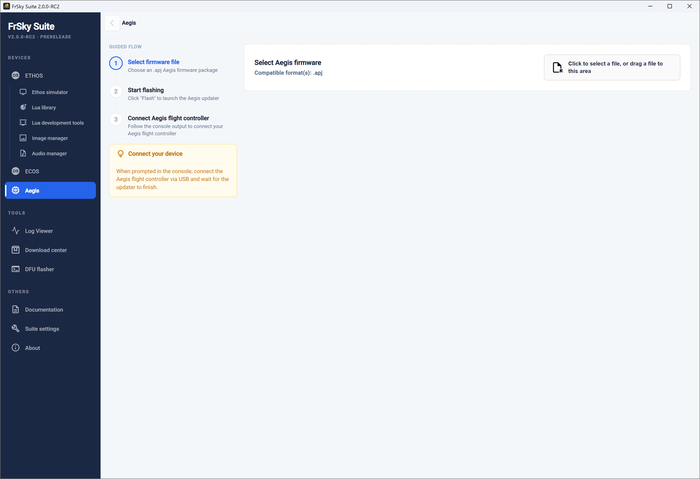

Aegis è un nuovo controller di volo prodotto da FrSky.

Segui la procedura indicata nella pagina Aegis per aggiornare il tuo FC.

## Strumenti

Visualizzatore di log

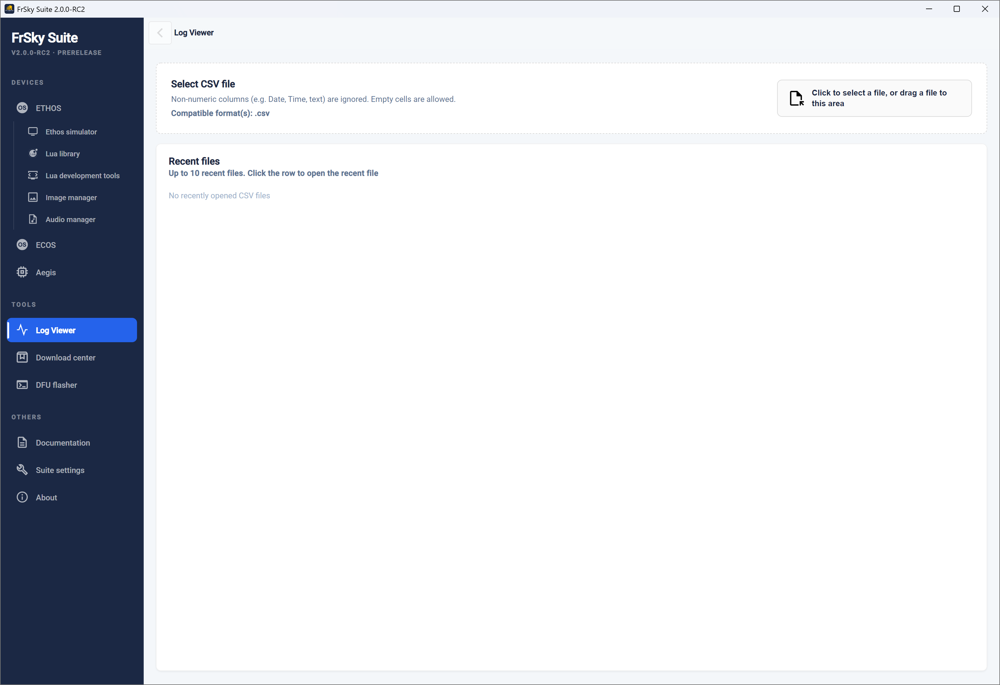

Il visualizzatore di log serve a visualizzare i file di log generati da Ethos quando è abilitata la funzione speciale “Scrivi log”.

Seleziona il file CSV

Seleziona il file di log in formato CSV che desideri visualizzare.

Verrà caricato e visualizzato l'intero log.

Canali

A sinistra, seleziona i canali che desideri visualizzare.

Display

È possibile utilizzare questi comandi per concentrarsi sull'area di interesse: Scorrere per ingrandire l'asse x (tempo) Scorrere tenendo premuto Ctrl per ingrandire l'asse y (o attivare/disattivare l'opzione "Inverti zoom con la rotellina") Fare clic e trascinare per spostare la visualizzazione del grafico Posizionare il cursore per visualizzare tutti i valori istantanei in quel momento (fare doppio clic per bloccare)

Aggiorna i dati

Clicca su “Aggiorna dati” per ricaricare il file. In questo modo verrà anche cancellato il cursore, se lo hai bloccato.

Pagina Prodotti FrSky

Il Pagina Prodotti FrSky può essere utilizzato per scaricare qualsiasi firmware dal sito di download di FrSky e per utilizzare la radio come proxy per aggiornare qualsiasi modulo, sensore, servocomando o ricevitore direttamente da FrSky Suite.

Nell'elenco dei prodotti, sfoglia per selezionare il dispositivo su cui eseguire il flashing. Nell'esempio sopra riportato, è stato selezionato un ricevitore TW SR8. Il Pagina Prodotti FrSky elencherà quindi le "risorse" disponibili.

Cliccando sul pulsante "Download" si aprirà una finestra di selezione in cui sarà possibile scegliere la cartella di destinazione e scaricare il file.

Il file è stato scaricato correttamente.

DFU Flasher

Fai clic sulla scheda “DFU Flasher”.

Collega la radio, spenta, al PC tramite un cavo USB. Dovrebbe comparire un messaggio verde che indica “Dispositivo DFU collegato”.

Fai clic sul pulsante “Seleziona file binario” per individuare il file del bootloader scaricato e selezionarlo. FrSky Suite analizzerà il file selezionato e fornirà informazioni sulla sua versione e sulla sua idoneità.

Fai clic sul pulsante "Avvia il flashing" per eseguire il flashing del bootloader selezionato. Al termine dell'operazione verrà segnalato il completamento con esito positivo.

In caso di errore rosso “Nessun dispositivo DFU”, sarà necessario installare il driver DFU corretto. È possibile utilizzare i pulsanti “Aggiorna stato driver DFU” e “Installa driver DFU” per installare un driver DFU.

Sulla maggior parte dei PC con Windows 10 o versioni successive, i sistemi Tandem si connettono utilizzando il driver USB DFU predefinito di Windows e sono pronti per l'aggiornamento del bootloader. Tuttavia, gli aggiornamenti di Windows spesso sostituiscono i driver con driver generici che potrebbero non funzionare con la radio.

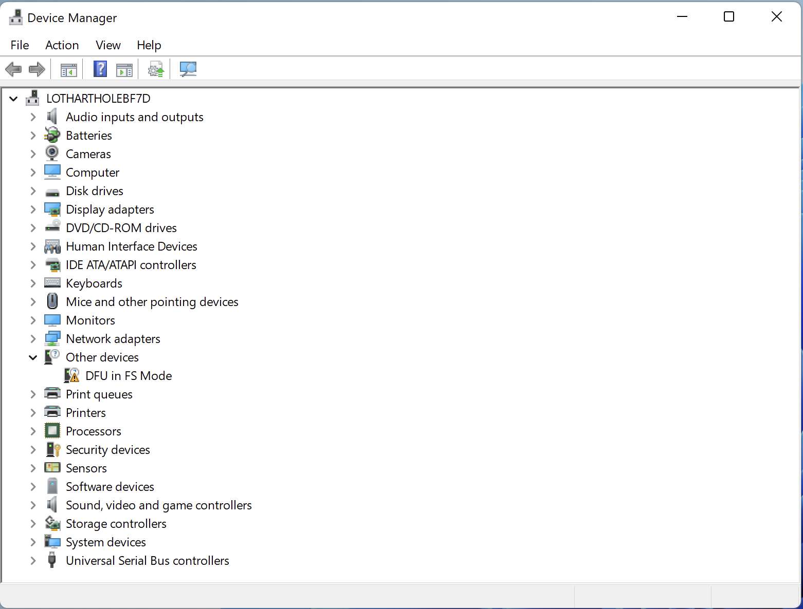

Controlla in Gestione dispositivi se il tuo dispositivo DFU (ovvero la tua radio) viene riconosciuto e funziona correttamente. Se FrSky Suite non è riuscita a installare un driver DFU, un’altra opzione potrebbe essere quella di verificare se è possibile utilizzare Impulse Driver Fixer per correggere il driver. È possibile scaricarlo da [https://impulserc.com/pages/downloads](https://impulserc.com/pages/downloads). Per ulteriori informazioni, consulta anche questo post sull’aggiornamento di Ethos Suite.

Nota per gli utenti di Horus X10: Windows 10 non installa di default il driver USB STM32bootloader necessario per i sistemi Horus. Sarà necessario installarlo utilizzando un programma come Impulse Driver Fixer o Zadig.

Strumento di riparazione

Lo strumento di riparazione è destinato alle radio X18/S, TW Lite, XE, X20 Pro/R/RS. Se la radio non riesce a leggere dalla memoria NAND o non è possibile salvare le impostazioni, questo strumento riformatterà la memoria interna.

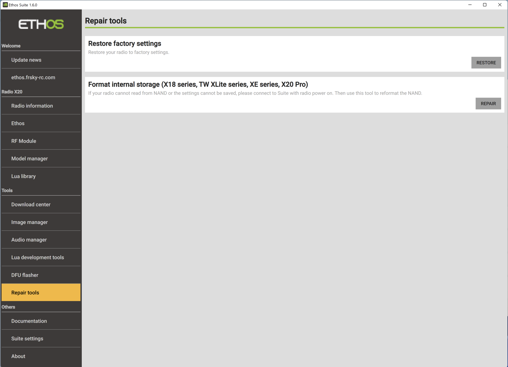

## Sezione “Altro”

Documentazione

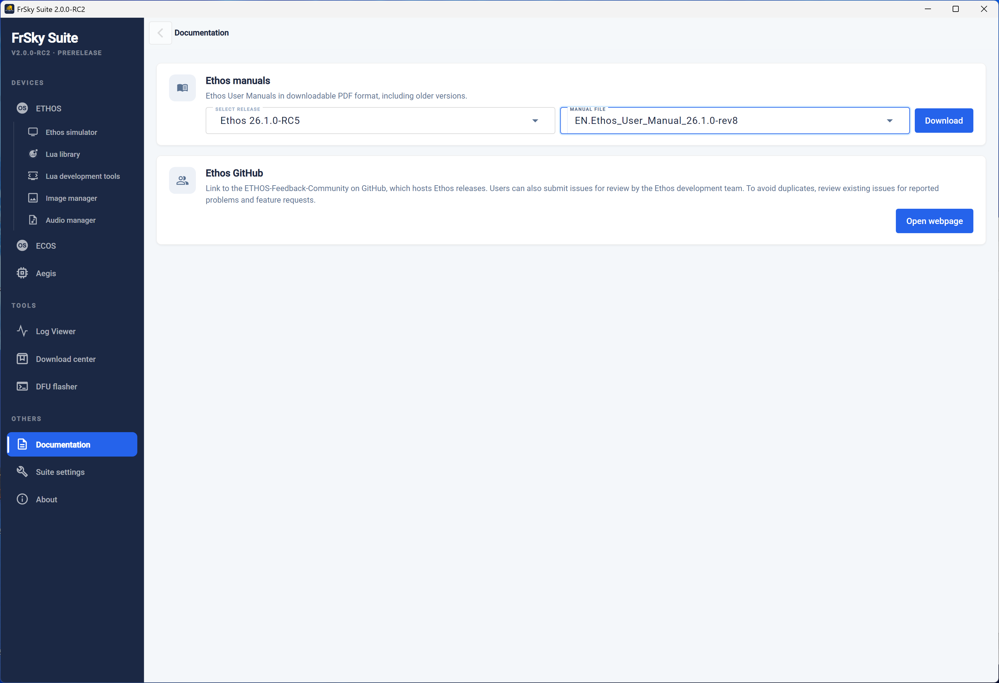

La sezione dedicata alla documentazione contiene collegamenti ai manuali di Ethos e alla community Ethos-Feedback su GitHub.

Manuali Ethos

Il manuale Ethos attualmente in vigore può essere scaricato qui.

Ethos Github

Il pulsante aprirà la pagina web della comunità Ethos-Feedback su GitHub, dove potrai accedere alle versioni di Ethos o segnalare un problema se ritieni di aver individuato un bug. Tuttavia, per evitare duplicazioni, ti preghiamo di effettuare una ricerca tra i problemi già segnalati prima di pubblicare il tuo.

Impostazioni della suite

Lingua

È possibile selezionare la lingua della Suite tra ceco, tedesco, inglese, spagnolo, francese, ebraico, italiano, olandese, norvegese, portoghese, sloveno e cinese.

Ubicazione del server

La posizione del server può essere GitHub oppure il server FrSky. Per la versione 1.6.0 di Suite, il server è stato reimpostato su quello di FrSky (solo questa volta). Eventuali modifiche verranno salvate al termine della modifica.

Versione Suite

Versione

Viene visualizzata la versione corrente della Suite.

Aggiornamento Suite

Se la versione è aggiornata, verrà visualizzata la dicitura “Aggiornato”; in caso contrario, fare clic sul pulsante per verificare la disponibilità di aggiornamenti per la Suite.

Altre impostazioni

Proxy

Le impostazioni del proxy possono essere aggiornate qui.

Debug options

Informazioni su

Visualizza le informazioni relative alla versione e al copyright.
