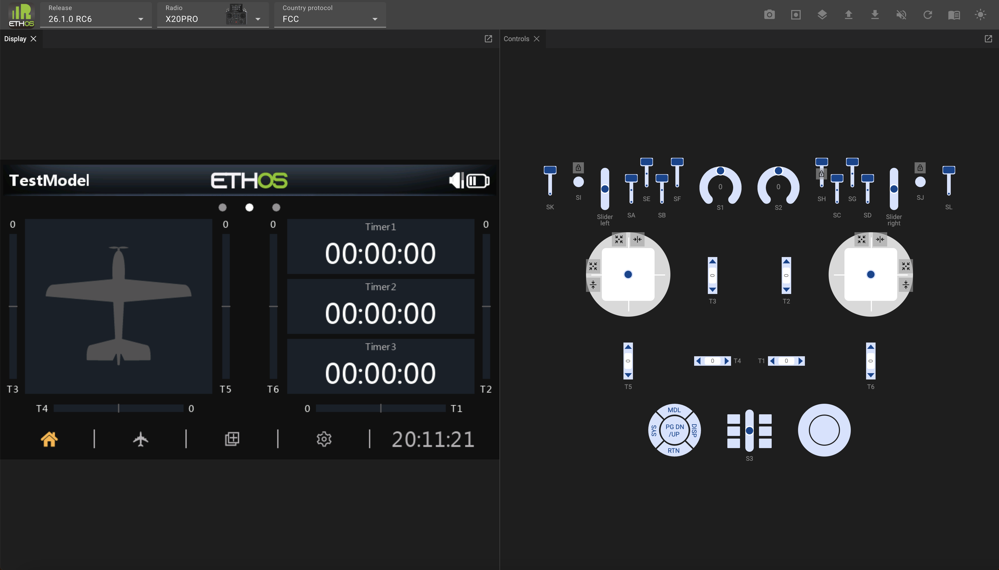
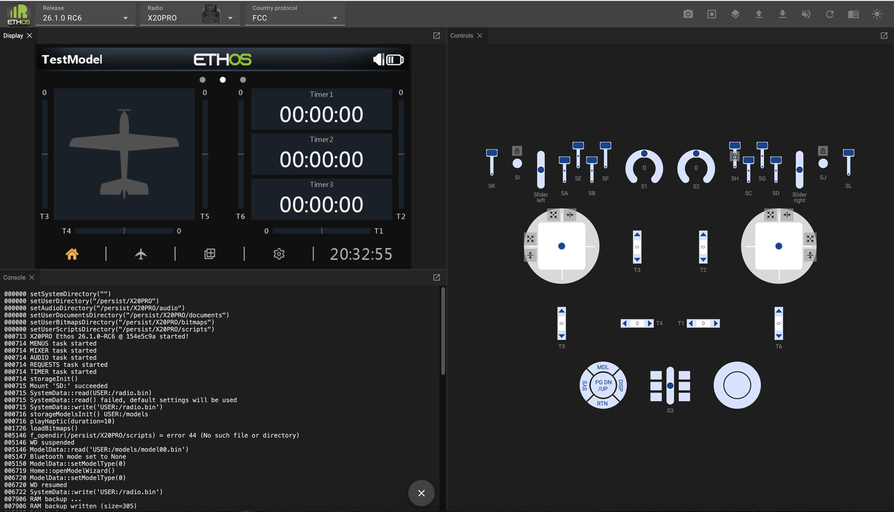
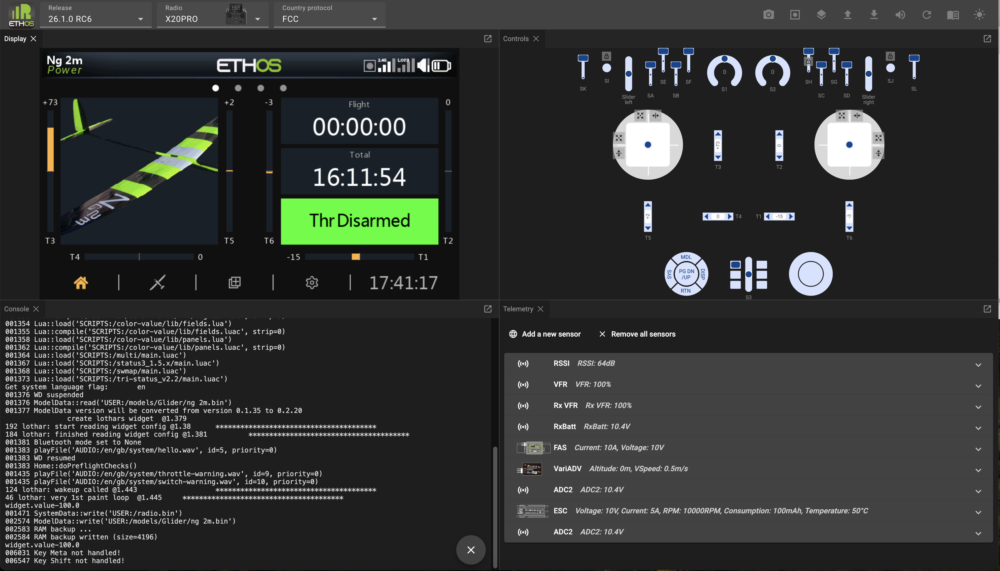
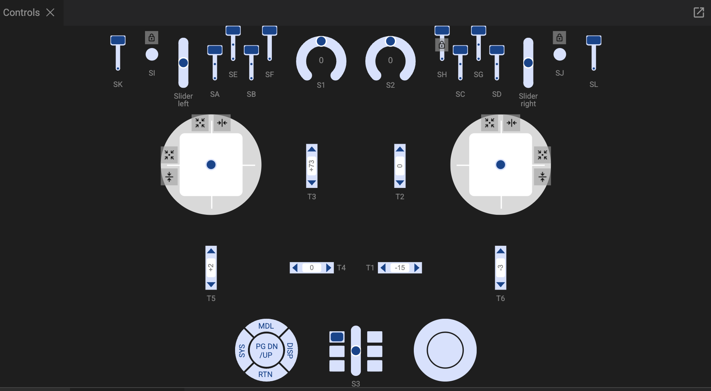

# Simulatore web di Ethos

Il simulatore web Ethos è realizzato in WebAssembly (abbreviato Wasm), una soluzione portatile che ne consente la distribuzione sul web. Ciò significa che funziona all'interno di un browser e non richiede l'installazione su un PC. Il browser consigliato è Chrome..

Il simulatore web Ethos consente di esplorare le funzionalità della radio e di testare le funzionalità o i miglioramenti previsti per il modello senza dover ricorrere alla radio vera e propria. Consente inoltre di provare con estrema facilità le nuove versioni prima di aggiornare la radio.

Il simulatore web è disponibile all'indirizzo [https://ethos-simulator.frsky-rc.com/](https://ethos-simulator.frsky-rc.com/)

Le opzioni predefinite sono la versione 26.1.0-RC6 (al momento della stesura di questo documento), la scheda radio X20 Pro e il protocollo FCC. Per iniziare, selezionare la lingua di visualizzazione.

Al primo avvio, non verranno rilevati dati di modello validi, pertanto verrà avviata la procedura guidata per la creazione di un nuovo modello.

Completa la procedura guidata per configurare un modello di test di base.

Se la versione e il tipo di radio predefiniti non corrispondono a quelli desiderati, selezionare la versione di Ethos desiderata, il tipo di radio da simulare e il protocollo RF.

Fai clic sull'icona "Pannelli"  nella barra dei menu in alto, quindi selezionare la Console.

La console apparirà accanto al pannello di visualizzazione.

Fai clic sulla barra del titolo della Console e trascinala verso il basso. Sposta il mouse finché la Console non occupa il quadrante in basso a sinistra.

La console è utile per verificare la sequenza di avvio del simulatore e per monitorare gli eventi e i messaggi di errore.

Fai nuovamente clic sull'icona "Pannelli" e ripeti l'operazione con il pannello "Telemetria", spostandolo nel quadrante in basso a destra.

Nel pannello "Telemetria", clicca più volte su "Aggiungi un nuovo sensore" e aggiungi i sensori a cui desideri avere accesso nelle tue simulazioni.

Per salvare i sensori in vista delle sessioni future, clicca sul  e seleziona “Salva impostazioni di telemetria”. Le impostazioni di telemetria verranno salvate in un file denominato “telemetry.json” nella cartella dei download. Spostalo in una posizione comoda. Nelle successive sessioni del simulatore, clicca sull'icona "Carica" e seleziona "Carica un file di telemetria JSON", quindi individua il file "telemetry.json" che hai salvato.

Ora sei pronto per avviare la simulazione. Il browser memorizzerà la disposizione del pannello, quindi non dovrai continuare a riorganizzarlo.

### Configurazione consigliata

È consigliabile riprodurre la configurazione della propria radio nel simulatore. In questo modo avrai a disposizione le stesse funzionalità della tua radio, il che ti consentirà di testare facilmente i miglioramenti apportati ai tuoi modelli senza influire sul tuo ambiente di volo o di modellismo, finché tutto non funzionerà come previsto.

I passaggi consigliati per la configurazione sono i seguenti:

1. Esegui un backup della tua radio utilizzando la funzione "Backup e ripristino" di Suite.

2. Nel menu "Carica" seleziona "Carica un backup radio" e individua il file di backup salvato. (Fai riferimento ai menu riportati di seguito.)

3. Dovrebbe partire dal modello che era selezionato sulla tua radio al momento della creazione del backup. In questo esempio, il modello selezionato era un aliante Ng2.

Grazie all'ambiente radio a te familiare, ora puoi creare e testare un modello completamente nuovo, magari basandoti su uno dei tuoi modelli predefiniti oppure creando un clone di un modello esistente e modificandolo. Questi approcci consentono di massimizzare il riutilizzo senza dover programmare un modello da zero. Una volta completata l'operazione, utilizza l'opzione "Scarica un file di modello" per scaricare il file di modello .bin nella cartella dei download. Quindi copialo sulla tua radio.

### Barra delle attività del simulatore

La barra delle attività del simulatore presenta i seguenti comandi:

	Screenshot (nella cartella "Download")

	Avvia registrazione (registra una macro – argomento che esula dall'ambito di questa panoramica)

	Pannelli (elenca i pannelli che non sono stati ancora aperti)

	Carica… (vedi il menu qui sotto)

	Scarica... (vedi il menu qui sotto)

	Audio On/Off

	Riavvia il simulatore

	Documentazione (contiene un link al manuale più recente)

	Modalità chiara/scura

Upload menu

	Carica un file di modello (.bin)

	Carica un backup radio (.bin)

	Carica un pacchetto audio (.zip)

	Carica un plugin Lua (.zip)

	Carica un file CSV contenente le traduzioni (.csv)

	Carica un file di telemetria JSON (.json)

	Avvia una macro (.zip)

Download menu

	Salva il file del modello corrente (.bin)

	Modifica il modello corrente

	Modifica il file del modello corrente (JSON)

	Salva tutti gli screenshot (seleziona la cartella di destinazione, salva come .png)

	Salva un backup della Radio (.zip)

	Salva le impostazioni di telemetria (.json)

Pannello di controllo

Il pannello “Controlli” riproduce i comandi hardware della radio selezionata.

Gimbals

Gli stick possono essere azionati trascinandoli con il mouse. Durante il debug è utile limitare o restringere il movimento degli stick.

	Centra automaticamente lo stick su uno o entrambi gli assi.

	Limiterà il movimento dello stick esclusivamente in senso verticale.

	Limiterà il movimento dello stick esclusivamente in orizzontale.

Interruttori e pulsanti momentanei

	Blocca gli interruttori e i pulsanti momentanei in modo che rimangano nello stato selezionato (acceso o spento) durante il debug.
