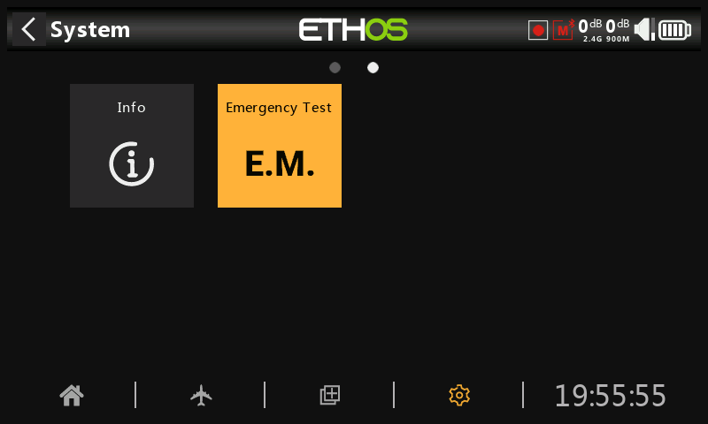
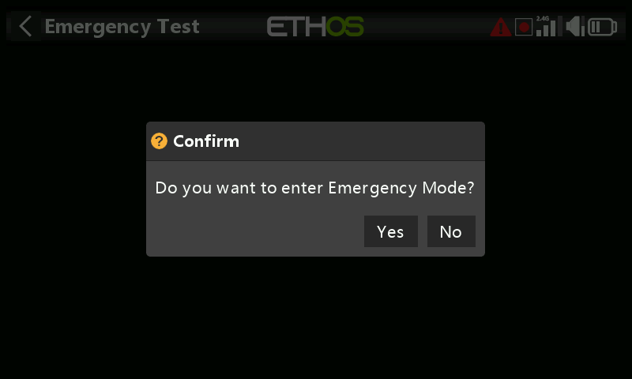

# Modalità di emergenza

La modalità di emergenza è la risposta della radio a un evento inaspettato come un reset del watchdog. Il watchdog è un timer che viene continuamente riavviato da diverse parti di Ethos. Se un guasto di qualsiasi tipo impedisce il riavvio del timer del watchdog, questo va in tilt e causa un reset hardware della radio. In questa modalità di emergenza la radio si riavvia in modo estremamente rapido, senza i normali controlli di avvio, in modo che tu possa riprendere il controllo del tuo modello il prima possibile. In modalità di emergenza non è possibile accedere alla scheda SD o eMMC.

La modalità di emergenza fornisce solo le funzioni essenziali per il controllo del modello, ma nessuna delle funzioni di alto livello. Lo schermo diventerà vuoto e visualizzerà la scritta "MODALITÀ EMERGENZA", accompagnata da un segnale acustico di 300 ms che si ripete continuamente ogni 3 secondi. Gli avvisi vocali, l'esecuzione di script, la registrazione ecc. cesseranno di funzionare. Se si verifica la modalità di emergenza, devi ovviamente atterrare il più rapidamente possibile.

La causa più comune della modalità di emergenza è il guasto della scheda SD.

## Test della modalità di emergenza

In alcuni casi, può essere utile per gli utenti testare la modalità di emergenza.

È possibile aggiungere uno strumento di sistema per testare la modalità di emergenza. Tocca l'icona Test di emergenza per avviare il test.

Una finestra di dialogo chiederà la conferma per procedere.

La radio entrerà in modalità di emergenza.
