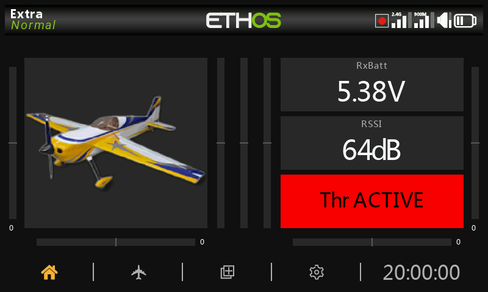

# Viste principali

## Schermata Home

La schermata Home è ciò che si vede quando nessun menu è aperto: una serie di
fino a **otto** schermate di visualizzazione configurabili dall'utente (vedere
[Display](../displays/index.md)), tra le quali si scorre con il tasto `PAGE`
o con uno swipe sul touch screen. Un modello appena creato parte con una sola
schermata che mostra un'immagine del modello, tre widget timer e gli indicatori
di trim/potenziometri; da lì tutti gli elementi sono configurabili dall'utente.

Le schermate normalmente condividono la barra superiore e quella inferiore
descritte di seguito, ma una schermata può anche essere impostata a schermo
intero, nascondendo entrambe.

## La barra superiore

La barra superiore mostra il nome del modello sulla sinistra (più la fase di
volo attiva, se ne è configurata una) e una serie di icone di stato sulla
destra:

- Registrazione dati attiva
- Stato trainer (master o slave, a seconda dei casi)
- RSSI — collegamento 2.4GHz
- RSSI — collegamento 900MHz (se è installato un modulo dual-band/long-range)
- Volume altoparlante
- Stato della batteria della radio

Toccando l'icona dell'altoparlante o della batteria si accede direttamente al
relativo pannello di impostazioni [Generale](../system-setup/general.md) (audio)
o [Batteria](../system-setup/battery.md).

### Avviso di errore

Un triangolo rosso compare nella barra superiore ogni volta che Ethos rileva un
errore: le cause più comuni sono un errore di uno script Lua, un errore di backup
della RAM oppure l'utilizzo di una versione firmware nightly/instabile. Il
dettaglio dell'avviso si trova sempre in **System → Info**, nella stessa pagina
del tempo di funzionamento della radio e dei
[log degli errori](../system-setup/information.md).

## La barra inferiore

Lungo il bordo inferiore sono presenti quattro schede corrispondenti alle sezioni
principali — **Home**, **Configurazione del modello**, **Configura schermate**,
**Configurazione di sistema** — con l'orologio di sistema sulla destra (toccandolo
si accede direttamente a [Data e ora](../system-setup/date-and-time.md)).

## L'area dei widget

La parte centrale di ogni schermata è occupata dai **widget**: immagine del
modello, timer, letture di telemetria, barre di trim/potenziometri e altro
ancora, tutti posizionati e configurati dall'utente. Vedere
[Display](../displays/index.md) per sapere come aggiungere, spostare e
configurare i widget, e [Display aggiuntivi](../displays/additional-displays.md)
per aggiungere altre schermate oltre a quella singola predefinita.
