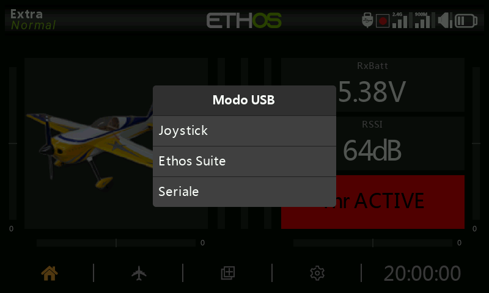

# Modalità di connessione USB al PC

## Modalità Radio Spenta

- collegare la radio spenta a un PC tramite un cavo USB è la modalità DFU per il flashing del bootloader.

## Modalità Bootloader

- La radio viene messa in modalità bootloader accendendo la radio e tenendo premuto il tasto enter. Sullo schermo verrà visualizzato il messaggio di stato "Bootloader".

- La radio può quindi essere collegata a un PC tramite un cavo dati USB. Il messaggio di stato cambierà in "USB Plugged" e il PC dovrebbe visualizzare due unità esterne collegate. La prima è la memoria flash della radio, mentre la seconda è il contenuto della scheda SD o eMMC.

- Questa modalità è utilizzata per leggere e scrivere file sulla scheda SD o eMMC e/o sulla memoria flash della radio.

- Questa modalità può essere utilizzata anche per collegarsi a FrSky Suite per aggiornare la radio. Fai riferimento alla [Modalità Bootloader ](#Bootloader_Mode)nella sezione FrSky Suite.

## Modalità Radio Accesa

- Se la radio è collegata a un PC tramite un cavo dati USB mentre è accesa, viene visualizzata la seguente finestra di dialogo:

- In modalità joystick la radio può essere configurata per controllare i simulatori RC.

- In modalità FrSky Suite la radio entrerà in "modalità Ethos" per comunicare con FrSky Suite. Fai riferimento alla [Modalità Ethos ](#Ethos_Mode)nella sezione FrSky Suite.

- In modalità Seriale le tracce di debug Lua vengono inviate a USB-Seriale, se presente. La scheda Strumenti di sviluppo Lua di FrSky Suite ha una finestra di terminale integrata per visualizzare le tracce. Il baud rate è di 115200bps. Un driver per la porta COM virtuale di Windows può essere trovato [qui](https://www.st.com/en/development-tools/stsw-stm32102.html).
