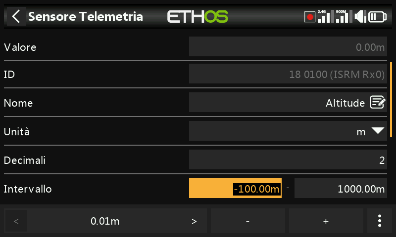

# Interfaccia utente e navigazione

La radio è dotata di un touch screen che rende l'interfaccia utente piuttosto intuitiva. Toccando le schede Model Setup (icona dell'aereo), [Configure Screens ](../displays/index.md)(icona delle schermate multiple) e System Setup (icona dell'ingranaggio) si accede direttamente alle funzioni descritte in queste sezioni del manuale. È possibile accedervi anche utilizzando rispettivamente i tasti \[MDL\], \[DISP\] e \[SYS\].

In alternativa si può usare il selettore rotante per spostare l'evidenziazione sul riquadro o sul parametro desiderato e poi premere Invio per selezionarlo.

Una pressione prolungata sul tasto \[RTN\] ti farà tornare alla schermata principale da qualsiasi sottomenu.

Toccando l'ora del sistema a destra della barra inferiore, si accede alla sezione Data e ora, che ti permette di impostare l'ora e la data.

Toccando le icone dell'altoparlante o della batteria nella barra superiore, si apriranno i pannelli di controllo di Suono e Vibrazione e Batteria.

## Menu di reset

Premendo a lungo il tasto \[ENT\] dalla schermata principale si accede al menu di reset:

### Reset - Azzeramento del volo

Il reset del volo azzera la telemetria, i timer e gli interruttori di funzione. Nota che i controlli pre-volo verranno effettuati dopo un "volo di reset".

### Reset - Azzeramento della telemetria

Si reimposterà la telemetria e si cancelleranno eventuali avvisi contrassegnati da un punto rosso relativi alla “perdita del sensore” o a un “conflitto tra sensori”. Si prega di fare riferimento alla sezione [Avvisi di perdita o conflitto dei sensori](../model-setup/telemetry.md).

### Reset - Azzeramento dei timer

Azzera i timer.

## Blocca il touchscreen

Il touchscreen LCD può essere bloccato per evitare operazioni involontarie premendo contemporaneamente \[ENTER\] e \[PAGE\] per 1 secondo dalla schermata principale. È disponibile anche come funzione speciale.

## Controlli per effetuare modifiche

### Aggiunta di elementi Funzionali

È possibile creare un nuovo elemento funzionale, come un timer, un interruttore logico, una funzione speciale, una curva o una variabile, toccando il simbolo “+” accanto alle intestazioni delle colonne nel menu principale corrispondente.

Sulle radio senza touchscreen, utilizzare l'encoder rotativo per scorrere fino al pulsante “+” e quindi premere ENT.

### Tastiera virtuale

Ethos offre una tastiera virtuale per modificare i campi di testo.

Basta toccare un qualsiasi campo di testo (o cliccare su \[ENT\]) per visualizzare la tastiera.

Tocca il tasto Backspace (sopra il tasto Invio) per tornare indietro e cancellare i caratteri a sinistra del cursore. Premi il tasto \[PAGE\] per cancellare i caratteri a destra del cursore. Una volta arrivato alla fine a destra, il tasto \[PAGE\] inizierà a cancellare i caratteri rimanenti a sinistra del cursore.

Tocca il campo di testo per spostare il cursore in quella posizione. In alternativa, premere il tasto \[SYS\] per spostare il cursore a sinistra o il tasto \[DISP\] per spostarlo a destra.

Tocca il tasto '?123' o 'abc' per passare dalla tastiera alfa a quella numerica. La tastiera numerica contiene anche i caratteri speciali. C'è anche il blocco delle maiuscole per inserire le lettere maiuscole.

Radio senza touchscreen

Sulle radio senza touchscreen, usare la rotella di selezione fino al bottone + e premere il bottone \[ENT\] su qualsiasi campo di testo per accedere alla modalità di modifica.

Ruotare l'encoder rotativo per scorrere i caratteri alfabetici maiuscoli e minuscoli e i numeri, seguiti dai caratteri speciali. Premere \[ENT\] per inserire il carattere. Il tasto \[MDL\] cambierà la maiuscola/minuscola del carattere immediatamente a destra del cursore. Tutti i caratteri successivi rimarranno nella nuova maiuscola/minuscola fino a quando non verrà modificata nuovamente.

Premere il tasto \[PAGE\] per cancellare i caratteri a destra del cursore.

Premere il tasto \[SYS\] per spostare il cursore a sinistra o il tasto \[DISP\] per spostarlo a destra.

### Controlli del valore numerico

Quando si tocca un valore numerico, nella parte inferiore dello schermo appare una finestra di dialogo con i controlli del valore numerico:

- a) Tasti '<' e '>' per modificare la dimensione del passo tra il minimo (come appropriato) e 	salire di decina in decina, ad esempio 0,01%, 0,1%, 1,0% o 10,0%.  

- b) I tasti "-" e "+" aumentano o diminuiscono il valore in base alla dimensione del passo 	selezionato. Anche l'encoder rotativo può essere utilizzato per regolare il valore.  

- c)	un pulsante "Altro" sulla destra per ulteriori opzioni, vedi sotto.

Il pulsante "Altro" sulla destra apre un'altra finestra di dialogo per ulteriori opzioni:

- 		d) il valore predefinito
- 		e) impostato al minimo
- 		f) impostato al massimo
- 		g)sostituisci i controlli con un cursore per la regolazione, vedi sotto

Il cursore permette di regolare rapidamente il valore. È possibile utilizzare anche l'encoder rotativo.

Per tornare ai tasti di regolazione del numero, seleziona "Disattiva cursore".

Un altro esempio è il valore della portata telemetrica, che può essere modificato in modo simile.

### Funzione Opzioni

Ethos dispone di una funzione "Opzioni" molto potente. Quasi ovunque sia previsto un valore o una sorgente, una pressione prolungata del tasto Invio farà apparire una finestra di dialogo delle opzioni

I campi con questa funzione possono essere identificati dall'icona del menu (simbolo dell'hamburger) nell'angolo in alto a sinistra del campo.

Per le regolazioni relative alla radio, quali volume principale, disattivazione altoparlanti, volume Vario, luminosità del display e luminosità in modalità sleep, non è possibile selezionare una sorgente che dipenda dal modello (come un interruttore logico, un interruttore di funzione o la modalità di volo).

Opzioni di valore

La finestra di dialogo delle opzioni del valore mostra quale parametro si sta configurando. In questo esempio puoi scegliere se impostare il escursione/le velocità al massimo, 0, minimo, oppure se utilizzare una sorgente. L'utilizzo di una sorgente come un Potenziometro consente di regolare il escursione/le velocità in volo.

Se premi a lungo Invio su un campo valore che è già stato modificato per utilizzare una sorgente, si apre una finestra di dialogo che ti permette di convertire il valore attuale della sorgente in un valore fisso

Cliccando su "Opzioni" si apriranno le opzioni per la sorgente, vedi sotto.

Opzioni della sorgente

Inverti

L'opzione Inverti permette di negare o invertire una sorgente come la posizione di un interruttore. Ad esempio, invece di essere attivo quando l'interruttore SA è alzato, sarà attivo quando l'interruttore SA NON è alzato, cioè in posizione intermedia o abbassata.

Edge

Puoi selezionare l'opzione "Edge" se hai bisogno di un'azione unica quando la sorgente passa da Falso a Vero o da Vero a Falso. Si agisce solo sulla transizione, non sullo stato Vero o Falso.

Tieni presente che l'opzione "Edge" è disponibile sugli interruttori ma dipende dal contesto. E’ anche disponibile nella condizione di interruttore logico [Sticky-appicicoso](../model-setup/logical-switches.md).

Opzione sorgente per gli interruttori

- Negativo

L'opzione negativa permette di invertire l'azione dell'interruttore.

- Metà Escursione

L'opzione "Metà Escursione" è disponibile quando si utilizza un interruttore 2-POS o un interruttore logico come sorgente. L'intervallo diventa \[0-100%\] invece di \[-100%-100%\].

Opzione sorgente input throttle/gas

- Se è abilitata l'opzione “Positivo”, solo la metà positiva del controllo di ingresso viene inviata al mix.
- Se è abilitata l'opzione “Negativo”, solo la metà negativa del controllo di ingresso viene inviata al mix.

Le due opzioni sopra indicate sono comunemente utilizzate nei modelli di superficie in cui il trigger aziona sia l'acceleratore (metà positiva) che il freno (metà negativa).

- Abilitare “Inverti” per invertire il controllo di ingresso.
- Abilitando “Ignora input istruttore” si impedisce alla radio dello studente di influenzare il mix. Per ulteriori dettagli, consultare la sezione “Ignora input istruttore”.

Opzione sorgente per i trim

- Negativo

L'opzione negativa consente di invertire l'azione del trim, utile nei mix Azioni.

- Piena Escursione

Per impostazione predefinita, i trim hanno un intervallo di +/- 25%. Quando vengono utilizzati come sorgente, i trim possono essere modificati in un intervallo completo di +/- 100% (premi a lungo Invio sul trim).

Ignora l'input del Trainer

Negli interruttori logici le sorgenti possono essere impostate in modo da ignorare le sorgenti provenienti dall'ingresso del trainer. Un'applicazione tipica è quella in cui un interruttore logico è configurato per rilevare il movimento degli stick dell'istruttore master (ad esempio lo stick dell'elevatore) per consentire un intervento immediato se le cose vanno male. Questa opzione è necessaria per evitare che gli ingressi degli stick degli studenti attivino l'interruttore logico.

Opzioni Var

Negativo

Abilitando Negativo il valore del Var diventerà negativo in questo caso.

Ignora l'intervallo

Alcuni parametri hanno intervalli asimmetrici, come i parametri Min/Max delle Uscite, che hanno intervalli rispettivamente di (-150% a 0%) e (0% a +150%). Quando si utilizzano i VAR come fonte per regolare i parametri Min/Max, a meno che il Var non abbia un intervallo identico, sarà necessario impostare l'intervallo del Var come ignorato per evitare valori inaspettati dovuti alla conversione dell'intervallo.

Opzioni del sensore

Su una sorgente telemetrica, la finestra di dialogo delle opzioni consente di utilizzare il suo valore massimo o minimo

Alcuni sensori hanno opzioni aggiuntive specifiche per quel sensore.
