# Interfaccia utente e navigazione

Ethos può essere utilizzato interamente con l'**encoder rotativo** di destra
(ruotalo per spostare l'evidenziazione, premilo per `ENT`) e con il tasto `RTN`
per uscire da un menu: il touchscreen, dove presente, è una scorciatoia per le
stesse azioni, non un modo di lavorare separato. I tasti `MDL`, `DISP` e `SYS`
portano direttamente a Configurazione del modello, Configurazione delle
schermate e Configurazione del sistema rispettivamente (le stesse tre schede
della barra inferiore); una pressione prolungata su `RTN` ti farà tornare alla
schermata principale da qualsiasi sottomenu.

## Menu di reset

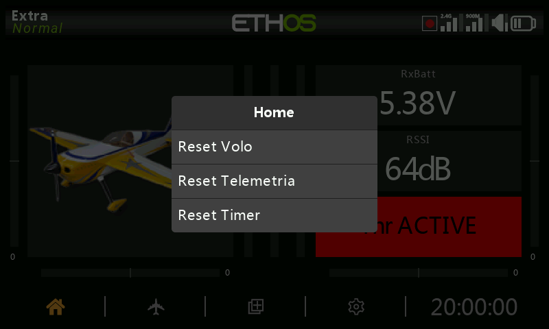

Premendo a lungo il tasto `ENT` dalla schermata principale si accede al menu di
reset:

- **Azzeramento del volo** — azzera la telemetria, i timer e gli interruttori
  di funzione, e riesegue la [checklist](../model-setup/checklist.md) pre-volo.
- **Azzeramento della telemetria** — azzera solo la telemetria.
- **Azzeramento dei timer** — azzera solo i timer.
- **Blocca il touchscreen** — si ottiene anche premendo contemporaneamente
  `ENT` e `PAGE` per 1 secondo dalla schermata principale, oppure come trigger
  di una [funzione speciale](../model-setup/special-functions.md).

## Controlli per effettuare modifiche

**Aggiungi elementi funzionali** — è possibile creare un nuovo elemento
funzionale, come un timer, un interruttore logico, una funzione speciale, una
curva o una variabile, toccando il simbolo **+** accanto alle intestazioni
delle colonne nel menu corrispondente. Sulle radio senza touchscreen,
evidenzia un elemento esistente, premi `ENT` e seleziona **Aggiungi** dalla
finestra di dialogo che si apre: naturalmente questa opzione funziona anche
sulle radio con touchscreen.

### Tastiera virtuale

Basta toccare un qualsiasi campo di testo (o premere `ENT` su di esso) per
visualizzare la tastiera. Il tasto Backspace cancella i caratteri a sinistra
del cursore; `PAGE` cancella i caratteri a destra del cursore e, una volta
arrivato alla fine a destra, prosegue cancellando i caratteri rimanenti a
sinistra. Tocca il campo di testo per spostare il cursore in quella posizione;
in alternativa, premi il tasto `SYS` per spostare il cursore a sinistra o il
tasto `DISP` per spostarlo a destra. Il tasto **?123**/**abc** permette di
passare dalla tastiera alfabetica a quella numerica, che contiene anche i
caratteri speciali:

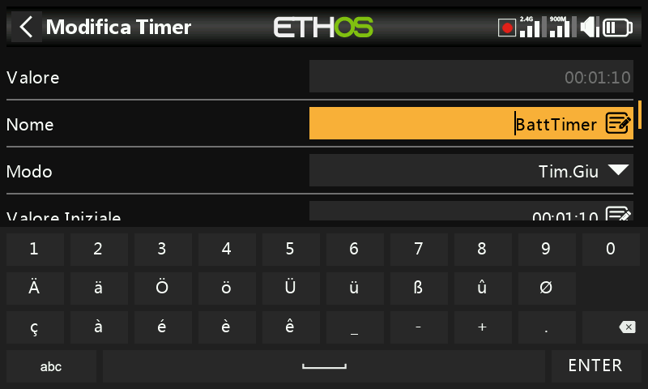

Sulle **radio senza touchscreen**, premendo `ENT` su un campo di testo si
accede direttamente alla modalità di modifica: ruota l'encoder rotativo per
scorrere i caratteri minuscoli, maiuscoli e i numeri, seguiti dai caratteri
speciali, e premi `ENT` per inserire ciascun carattere. Il tasto `MDL` cambierà
la maiuscola/minuscola del carattere immediatamente a destra del cursore (e
tutti i caratteri successivi rimarranno nella nuova maiuscola/minuscola fino a
quando non verrà modificata nuovamente). Il tasto `PAGE` cancella i caratteri a
destra del cursore; `SYS`/`DISP` spostano il cursore a sinistra/destra.

## Controlli del valore numerico

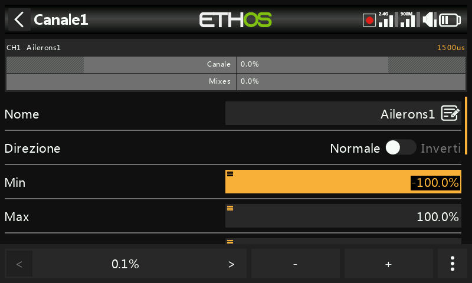

Quando si tocca un valore numerico, nella parte inferiore dello schermo appare
una finestra di dialogo con i controlli del valore numerico: i tasti
**`<`**/**`>`** modificano la dimensione del passo (salendo di decina in
decina, ad esempio 0,01/0,1/1,0/10,0), i tasti **`-`**/**`+`** (o l'encoder
rotativo) aumentano o diminuiscono il valore in base al passo selezionato, e il
pulsante **Altro** apre ulteriori opzioni:

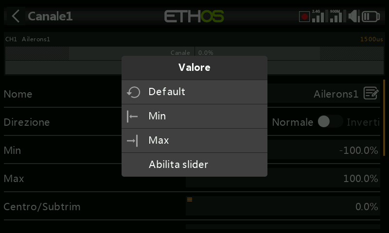

- Ripristina il valore predefinito del campo
- Imposta al minimo / imposta al massimo
- Sostituisce i tasti di regolazione con un **cursore** (slider)

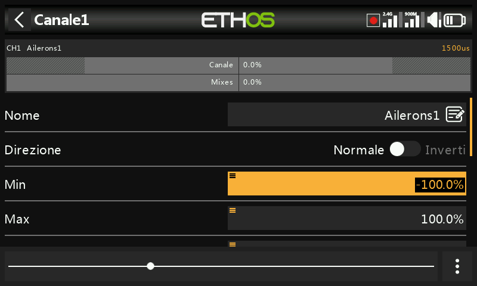

Il cursore (regolabile anche con l'encoder rotativo) permette di regolare
rapidamente il valore; per tornare ai tasti di regolazione del numero seleziona
**Disabilita slider**. Anche il valore della portata telemetrica può essere
modificato in modo simile:

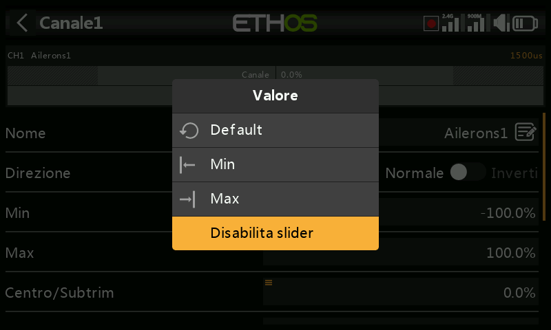

## La funzione Opzioni {: #the-options-feature }

Quasi ovunque sia previsto un valore o una [sorgente](#choosing-a-source), una
pressione prolungata del tasto `ENT` farà apparire una finestra di dialogo
delle **Opzioni**: i campi con questa funzione possono essere identificati
dall'icona del menu (simbolo dell'hamburger) nell'angolo in alto a sinistra del
campo.

### Opzioni di valore

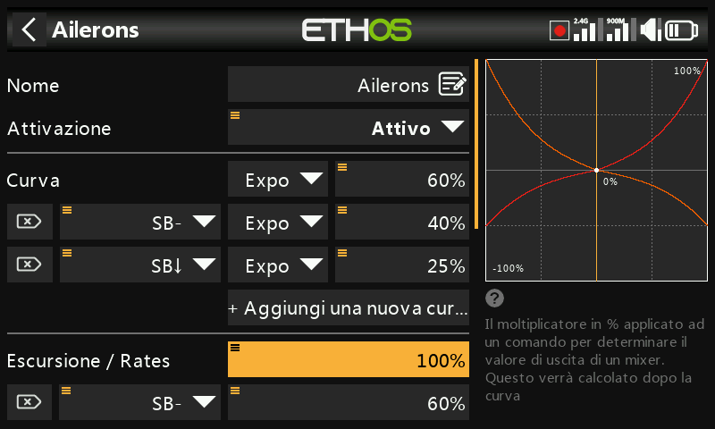

La finestra di dialogo delle opzioni del valore mostra quale parametro si sta
configurando e permette di scegliere se impostarlo al massimo o al minimo,
oppure se pilotarlo con una **sorgente** (ad esempio un potenziometro, per
regolare il valore in volo). Se premi a lungo `ENT` su un campo valore che è
già stato modificato per utilizzare una sorgente, si apre una finestra di
dialogo che ti permette di convertire il valore attuale della sorgente in un
valore fisso:

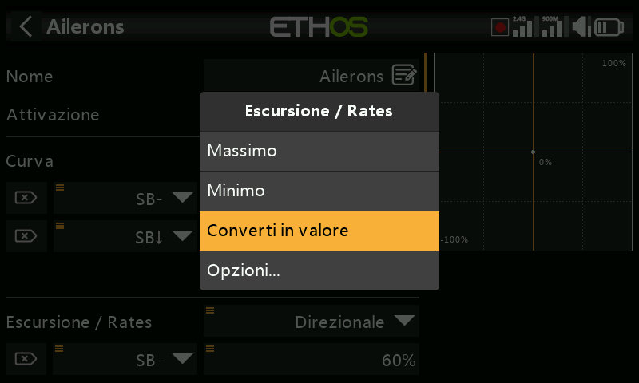

### Scelta di una sorgente {: #choosing-a-source }

Selezionando **Usa come sorgente** si apre un selettore a due colonne: prima
una **categoria** (analogici, interruttori, interruttori logici, trim, canali,
un asse del giroscopio, un canale trainer, un timer, un sensore di telemetria o
alcuni valori speciali), poi il membro specifico:

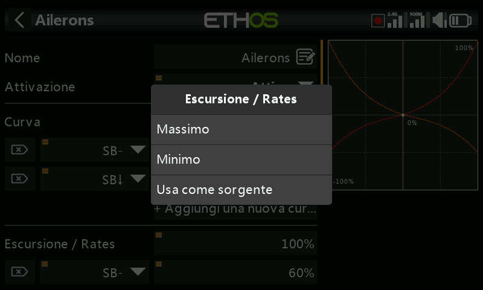

Una volta impostata la sorgente, la stessa pressione prolungata apre le opzioni
specifiche per il tipo di sorgente:

**Qualsiasi sorgente** —

- **Invertire** — permette di negare o invertire la sorgente (ad esempio è
  attiva quando un interruttore *non* è alzato, invece di quando lo è).
- **Edge** — agisce una sola volta sulla transizione (da Falso a Vero o da Vero
  a Falso), invece di restare attiva per tutta la durata dello stato; viene
  indicata con il prefisso `†` sulla sorgente. È disponibile sugli interruttori
  in generale e, in particolare, nella condizione di attivazione
  dell'[interruttore logico Sticky](../model-setup/logical-switches.md).

**Sorgenti stick** — opzioni di tipo calibrazione/subtrim:

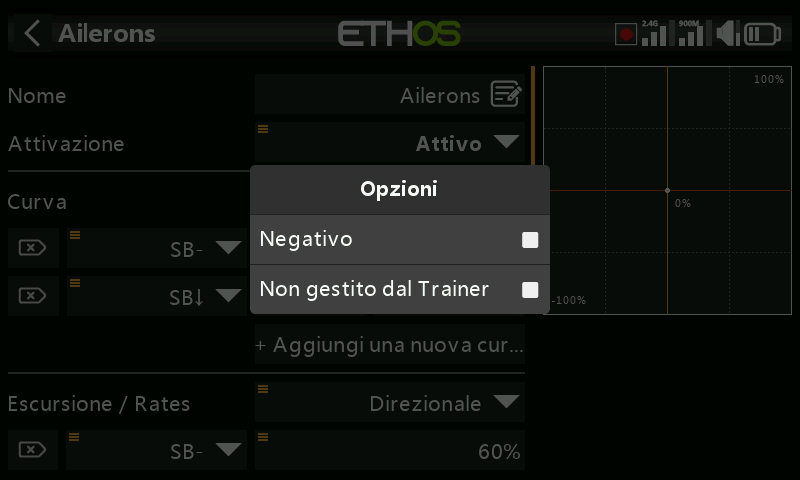

**Sorgenti interruttore** —

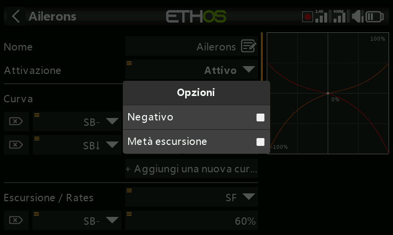
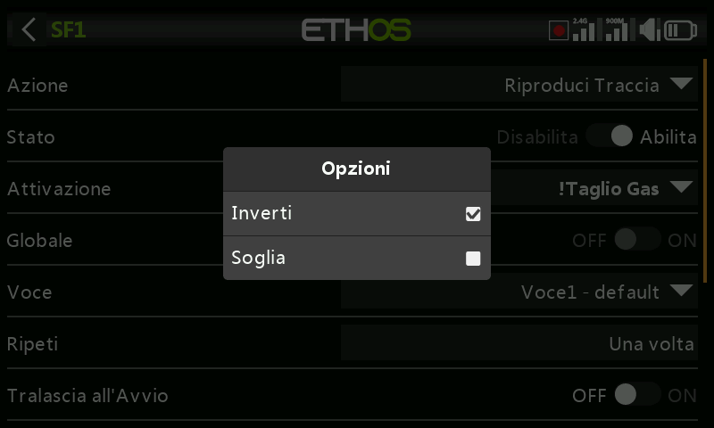

- **Negativo** — permette di invertire l'azione dell'interruttore.
- **Metà escursione** — con un interruttore 2-POS o un interruttore logico come
  sorgente, l'intervallo di uscita diventa [0-100%] invece di [-100%-100%].

**Sorgenti trim** —

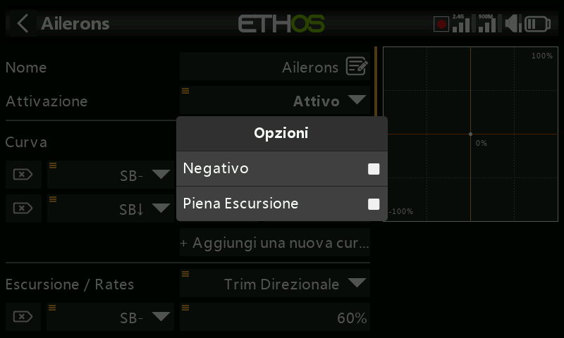

- **Negativo** — consente di invertire l'azione del trim, utile nei mix Azioni.
- **Piena escursione** — per impostazione predefinita i trim hanno un
  intervallo di +/- 25%; quando vengono utilizzati come sorgente possono essere
  portati a un intervallo completo di +/- 100%.
- **Ignora l'input del Trainer** — su un [interruttore
  logico](../model-setup/logical-switches.md) le sorgenti possono essere
  impostate in modo da ignorare le sorgenti provenienti dall'ingresso del
  trainer. Un'applicazione tipica è quella in cui l'interruttore logico è
  configurato per rilevare il movimento degli stick dell'istruttore *master*
  (ad esempio per consentire un intervento immediato se l'allievo sbaglia),
  evitando che anche gli ingressi degli stick dell'allievo attivino
  l'interruttore.

**Sorgenti variabile** —

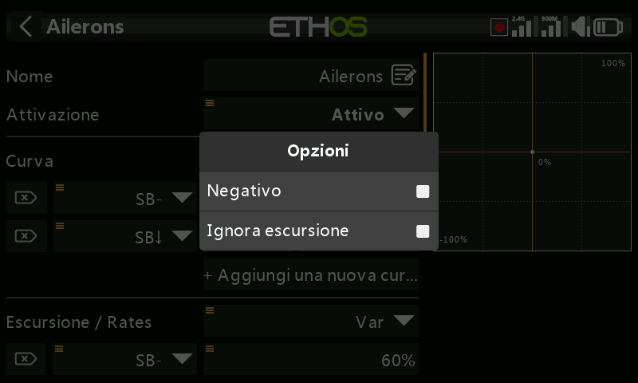

- **Negativo** — il valore del Var diventerà negativo in questo caso.
- **Ignora l'intervallo** — alcuni campi hanno intervalli asimmetrici, come i
  parametri Min/Max delle Uscite, che hanno intervalli rispettivamente di
  (-150% a 0%) e (0% a +150%). A meno che la
  [variabile](../model-setup/variables.md) utilizzata come sorgente di quel
  campo non abbia un intervallo identico, occorre attivare questa opzione per
  saltare la conversione automatica dell'intervallo eseguita da Ethos ed
  evitare valori inaspettati.

**Sorgenti sensore di telemetria** — su una sorgente telemetrica la finestra di
dialogo delle opzioni consente di utilizzare il suo valore massimo o minimo
invece della lettura istantanea (alcuni sensori hanno opzioni aggiuntive
specifiche per quel sensore):

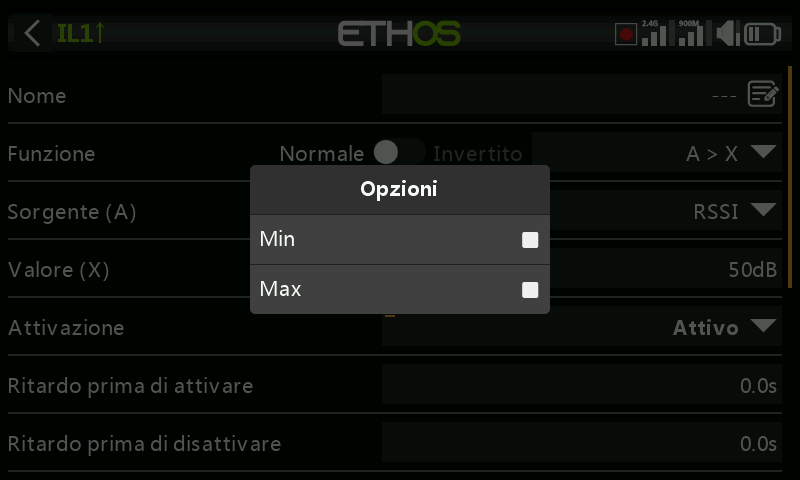
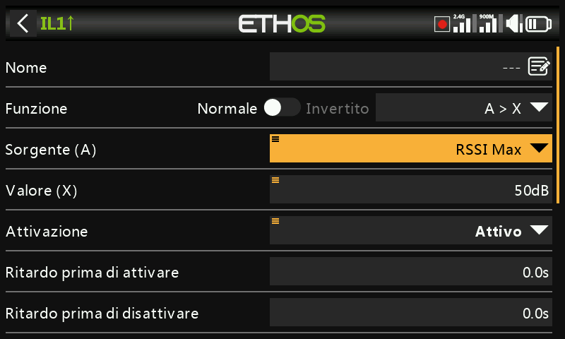
