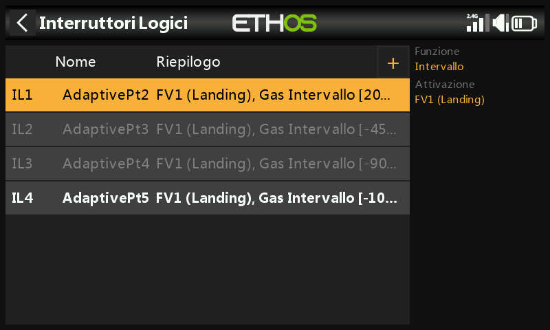
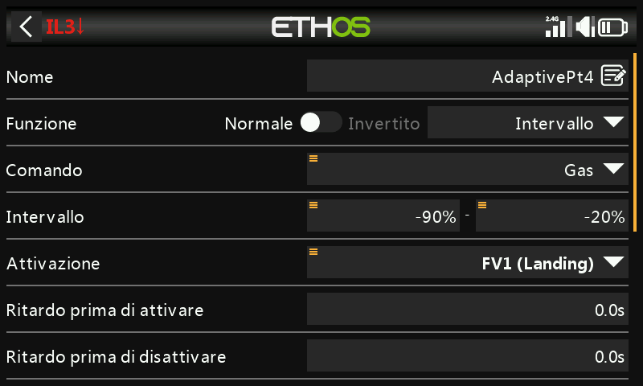
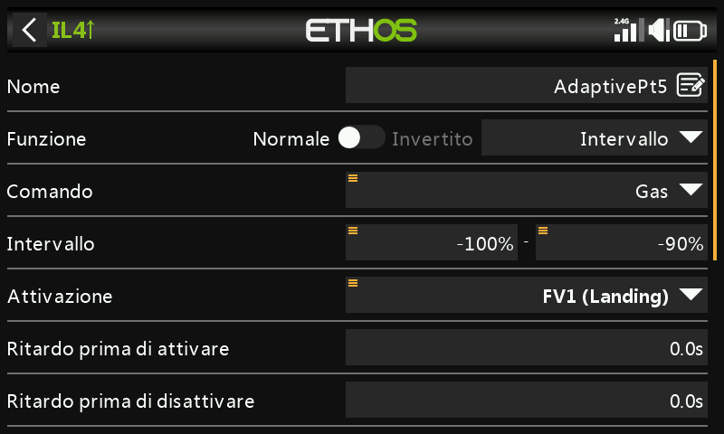
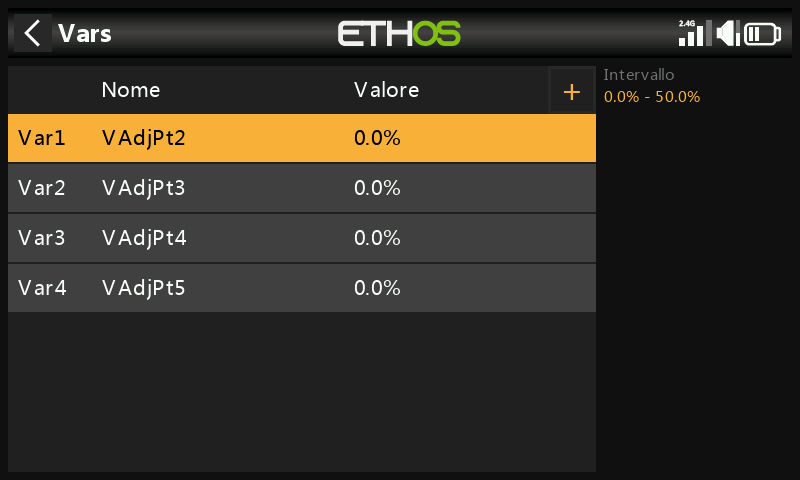
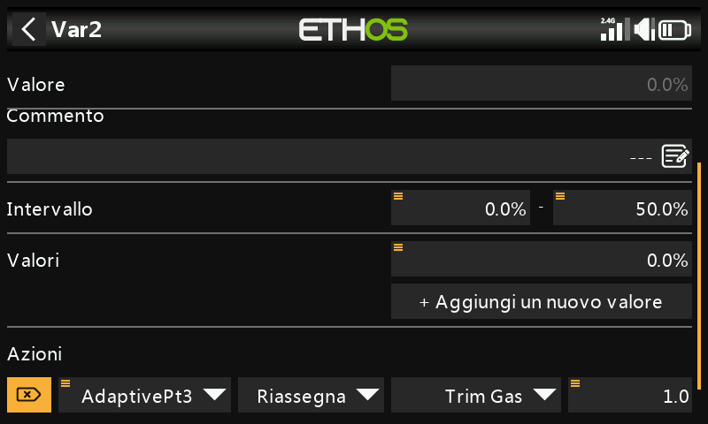
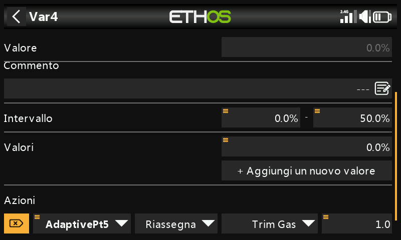
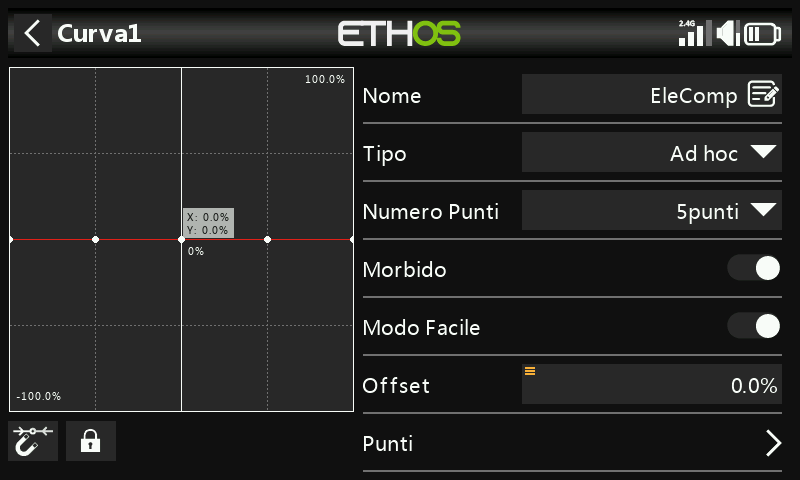
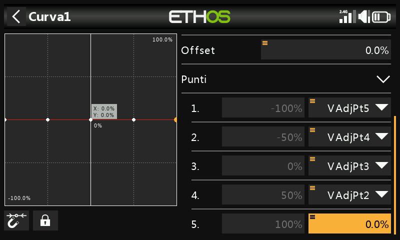

# Curva di compensazione regolabile in volo

## Perché

L'estrazione dei flap modifica la curvatura alare — i modelli ad ala alta
tendono a "cabrare" (ballooning), quelli ad ala bassa tendono ad
affondare — e richiede quindi una correzione di elevatore non lineare
rispetto alla deflessione dei flap, cioè una curva anziché un semplice
offset fisso. Questa guida utilizza le [Var](../model-setup/variables.md)
per rendere regolabili **in volo** i punti di una curva di compensazione,
tramite un trim del Gas - Throttle riassegnato, condizionato dal punto
della curva a cui lo stick dei flap si trova più vicino in quel momento —
sviluppando il passaggio relativo alla compensazione di elevatore della
[Guida pratica: Mixer Butterfly](butterfly-mixer.md).

## 1. Scegliere il tipo di curva

Una [curva personalizzata](../model-setup/curves.md) a 5 punti è
sufficiente per una compensazione morbida senza complessità eccessiva. Il
punto 5 (all'estrema destra, stick dei flap tutto in alto / nessun flap)
è sempre fissato a zero — senza flap estratti non serve alcuna
compensazione. Gli altri 4 punti vengono resi regolabili tramite le Var.
Poiché lo stick dei flap si troverà spesso tra due punti definiti, in
quella zona di sovrapposizione entrambi i punti ai suoi lati devono poter
essere regolati insieme.

## 2. Calcolare gli intervalli sovrapposti

Intervalli punto per punto (adattati, con permesso, dal "Crow-aware
adaptive elevator trim" di Mike Shellim per OpenTX su rc-soar.com —
leggermente estesi affinché l'intervallo del Pt2 arrivi fino a +100%, per
la ragione spiegata nel [Passo 6](#6-apply-the-curve)):

| Intervallo stick flap | Punto/i attivo/i |
|---|---|
| Da +100% a +45% | Solo Pt2 |
| Da +45% a +20% | Pt2 e Pt3 |
| Da +20% a −20% | Solo Pt3 |
| Da −20% a −45% | Pt3 e Pt4 |
| Da −45% a −90% | Solo Pt4 |
| Da −90% a −100% | Solo Pt5 |

## 3. Configurare gli interruttori logici

Quattro [interruttori logici](../model-setup/logical-switches.md),
ciascuno con funzione **Range** sullo stick dei flap (Gas - Throttle),
attivi mentre lo stick si trova nella zona di quel punto:

- `AdaptivePt2` — intervallo da 20% a 100% (esteso fino a 100%
  appositamente affinché il Pt2 possa essere regolato anche senza flap
  estratti — vedi il Passo 6).

  

- `AdaptivePt3` — intervallo da −45% a 45%.

  

- `AdaptivePt4` — intervallo da −90% a −20%.

  

- `AdaptivePt5` — intervallo da −100% a −90%.

  

## 4. Definire le Var di regolazione

Quattro [Var](../model-setup/variables.md), da `VAdjPt2` a `VAdjPt5`,
ciascuna con intervallo 0–50% (da ampliare se necessario) e un'azione
**trim del Gas - Throttle riassegnato** — passo di 1,0%, con Attivazione
data dal corrispondente interruttore logico:

Poiché è attivo un solo interruttore logico alla volta (al massimo due,
nelle zone di sovrapposizione), lo stesso trim fisico regola in modo
sicuro Var diverse a seconda della posizione dei flap.

## 5. Definire la curva di compensazione

Una nuova curva personalizzata a 5 punti (ad esempio "EleComp") con
**Morbido** attivo. Premi a lungo il tasto `ENT` sui punti da 1 a 4 e
seleziona **Usa una sorgente** per assegnare rispettivamente da
`VAdjPt5` a `VAdjPt2` (il punto 5 resta fisso a 0, come da Passo 1).

## 6. Applicare la curva {: #6-apply-the-curve }

Utilizza questa curva esattamente nel punto in cui la [Guida pratica:
Mixer
Butterfly](butterfly-mixer.md#7-add-the-elevator-compensation-curve-and-mix)
assegna la sua curva EleComp al mix di compensazione dell'elevatore.

Ove possibile, parti da dati reali (indicazioni del produttore, post
della community) sulla corsa di elevatore necessaria per una data
deflessione dei flap; in alternativa, qualche millimetro di compensazione
a flap tutti estratti è un ragionevole punto di partenza.

!!! tip "Approccio alla messa a punto"
    Inizia con piccole estrazioni di flap e piccole regolazioni di trim.
    `AdaptivePt2` può essere regolato **senza alcun flap estratto** —
    estrai un po' di flap, richiudilo e inserisci un po' di compensazione
    alla volta, invece di lottare con un modello che cabra o affonda
    mentre cerchi di trimmare sotto pressione. Riapplica un po' di flap
    per verificare e regola nuovamente se necessario. Una volta che il
    Pt2 risulta corretto, passa al punto successivo attorno alla metà
    corsa dello stick — se il Pt2 ha richiesto una variazione di trim
    consistente, conviene atterrare e impostare i punti rimanenti
    ciascuno leggermente più grande del precedente, anziché procedere a
    caso.
