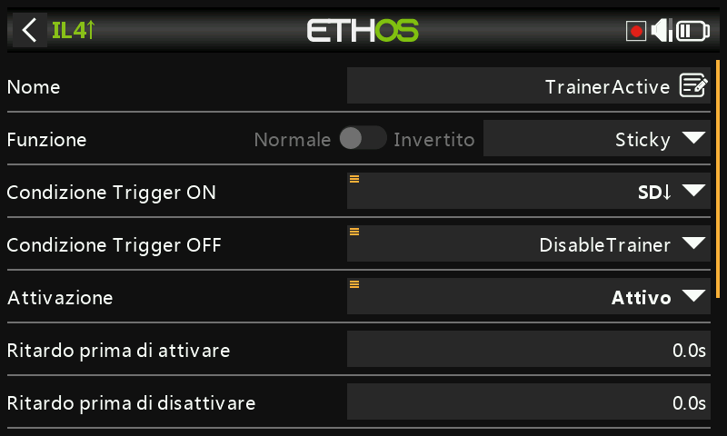
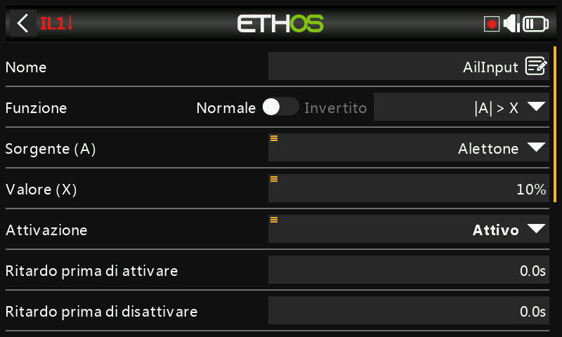
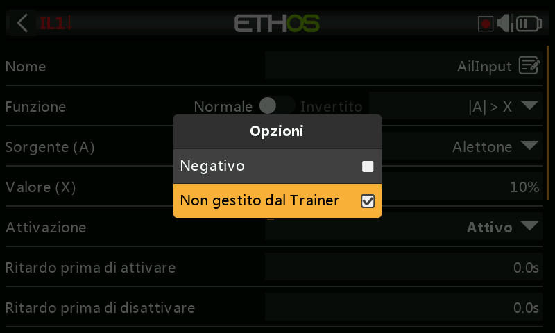
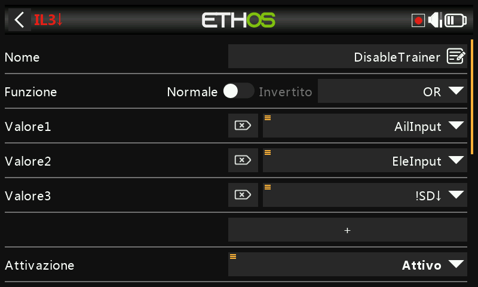

# Ripresa istantanea del controllo per la funzione Trainer

Un utile miglioramento della funzione [Trainer](../model-setup/trainer.md):
invece di affidarsi al solo interruttore, l'istruttore può riprendere il
controllo istantaneamente muovendo semplicemente lo stick degli alettoni o
dell'elevatore — senza dover cercare prima l'interruttore trainer se qualcosa
va storto.

L'interruttore trainer avvia comunque la sessione; a pilotare la funzione
trainer vera e propria è un [interruttore logico
Sticky](../model-setup/logical-switches.md#sticky), che viene annullato dal
ritorno a off dell'interruttore **oppure** dal rilevamento del movimento
degli stick dell'istruttore.

## 1. Interruttore logico di rilevamento alettoni

Un interruttore logico che utilizza **|A| > X** sullo stick degli alettoni,
vero quando questo si sposta di oltre il 10% dal centro in una delle due
direzioni. Premi a lungo sulla sorgente degli alettoni e seleziona **Non
gestito dal Trainer**, in modo che il movimento degli alettoni
dell'*allievo* (proveniente dal collegamento trainer) non lo attivi a sua
volta:

## 2. Interruttore logico di rilevamento elevatore

Lo stesso schema, applicato allo stick dell'elevatore.

## 3. Interruttore logico di annullamento

Un interruttore logico **OR**, vero quando è vero l'interruttore di
rilevamento alettoni oppure quello di rilevamento elevatore, **oppure**
quando l'interruttore trainer (ad esempio SD) non è in basso — in altre
parole, sia "l'istruttore ha mosso uno stick" sia "l'interruttore trainer è
stato disattivato" terminano la sessione.

## 4. Interruttore logico Sticky di abilitazione trainer

Un interruttore logico **Sticky**: **Trigger ON** è l'interruttore trainer
(SD in basso), **Trigger OFF** è l'interruttore di annullamento del Passo 3.
Utilizza questo interruttore Sticky — chiamiamolo `TrainerActive` — come
condizione di attivazione della funzione Trainer, al posto dell'interruttore
fisico.

## 5. Segnalazione audio

Aggiungi alcune [funzioni speciali "Riproduci audio"](../model-setup/special-functions.md)
che annuncino quando `TrainerActive` diventa vero e quando si azzera, in modo
che entrambi i piloti ricevano un chiaro segnale acustico dell'esatto momento
in cui il controllo passa di mano.
