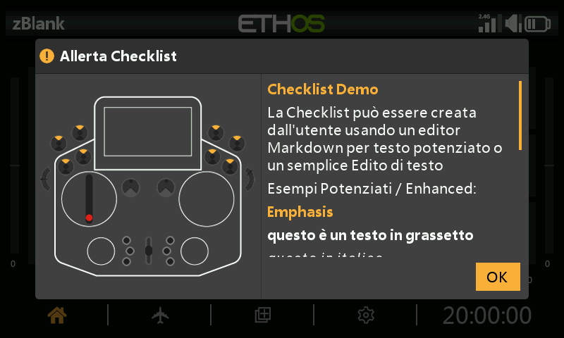

# Checklist con testo definito dall'utente



La funzione [Checklist](../model-setup/checklist.md) può visualizzare
all'avvio un testo personalizzato — testo semplice o formattato in Markdown —
automaticamente, ogni volta che quel modello viene caricato.

## 1. Creare il testo della checklist

**Testo semplice** — scrivetelo con un qualsiasi editor di testo (Notepad++,
o anche MS Word salvando in formato testo semplice) e salvatelo come
`<model name>.txt`.

**Testo avanzato (Markdown)** — Ethos supporta la formattazione Markdown, ad
esempio `##` per un titolo, `**bold**` per il testo in grassetto. Utilizzate un
qualsiasi editor di testo (inserendo manualmente la sintassi Markdown) oppure un
editor Markdown dedicato (Nextpad, MarkText, ecc.) e salvate come
`<model name>.md`.

```markdown
## Emphasis
**this is bold text**
*this is italic text*
```

## 2. Copiarlo sulla radio

Copiate il file nella stessa cartella `models/` in cui si trova il file `.bin`
del modello (vedere [Gestione file](../system-setup/file-manager.md#top-level-folders)),
quindi espellete in modo sicuro le unità della radio prima di scollegarla.

## 3. Verificarlo

Caricate il modello — il testo della checklist compare ora automaticamente come
parte dei controlli di avvio, con possibilità di scorrimento se supera la
lunghezza di una schermata.
