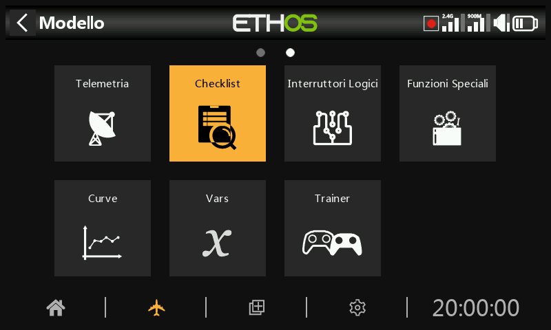

# Lista di controllo

La funzione Checklist prevede una serie di controlli pre-volo. Si tratta di un gruppo di funzioni di sicurezza che entrano in vigore quando si accende la radio e/o si carica un modello dall'elenco dei modelli.

I controlli predefiniti includono: la radio è in modalità silenziosa, il failsafe non è impostato, gli interruttori e i potenziometri sono controllati, la batteria della radio è scarica, la batteria dell'RTC è scarica, ecc. Il controllo degli interruttori mostra la direzione in cui deve essere spostato l'interruttore; fai riferimento ai punti rossi nell'esempio di schermata di avviso qui sopra.

Si noti che, contrariamente all'avviso precedente, il tasto OK o RTN salta i controlli pre-volo.

Ulteriori controlli possono essere impostati di seguito.

## Controllo del Gas - Throttle

Per attivare il controllo del Gas - Throttle, seleziona l'operatore da utilizzare. Le opzioni sono '<' minore di, '~' circa uguale o '>' maggiore di. Il controllo pre-volo ti avviserà se lo stick del Gas - Throttle non rientra nel valore impostato nel parametro valore.

## Controllo Failsafe

Se abilitato, ti avvisa se il Failsafe non è stato impostato per il modello corrente. Si consiglia vivamente di lasciarlo abilitato!

## Controllo degli interruttori

Per ogni interruttore, puoi definire se la radio richiede che gli interruttori siano nelle posizioni predefinite desiderate. Se agli interruttori sono stati assegnati dei nomi definiti dall'utente in Sistema / Hardware / 'Impostazioni interruttori', i nomi verranno visualizzati.

L'opzione "Carica tutte le posizioni degli interruttori" può essere utilizzata per leggere le posizioni desiderate dalle posizioni attuali degli interruttori, ad eccezione di quelle contrassegnate con "Nessun controllo".

Le opzioni di controllo sono mostrate qui sopra.

## Controllo degli interruttori di funzione

Per ogni interruttore di funzione, puoi definire se la radio richiede che gli interruttori siano nelle posizioni predefinite desiderate. Le opzioni sono mostrate sopra.

L'opzione "Carica tutte le posizioni degli interruttori di funzione" può essere utilizzata per leggere le posizioni desiderate dalle posizioni attuali degli interruttori di funzione, ad eccezione di quelle contrassegnate con "Nessun controllo".

## Controllo dei Potenziometro e dei cursori

Definisce se la radio richiede che i potenziometri e i cursori siano in posizioni predefinite all'avvio. Per ogni potenziometro è possibile inserire i valori desiderati.

L'opzione "Carica tutte le posizioni dei Potenziometro" può essere utilizzata per leggere le posizioni desiderate dalle posizioni attuali dei Potenziometro, ad eccezione di quelle contrassegnate con "Nessun controllo". È necessario controllare attentamente che gli operatori selezionati automaticamente siano quelli desiderati (ad esempio, '~' contro '<' o '>').

In alternativa, le funzioni di controllo possono essere impostate singolarmente (ad esempio, '~' o '<' o '>').

## Testo definito dall'utente

La funzione Checklist può anche visualizzare un testo definito dall'utente. Il testo può essere un testo normale o un testo avanzato.

Una volta installato il file di testo per un determinato modello e caricato il modello stesso, la radio visualizzerà la Checklist come parte della routine di avvio. Consulta la sezione [Come impostare una lista di controllo con testo definito dall'utente ](../tutorials/basic-flybarless-heli.md)nella sezione Come fare.
