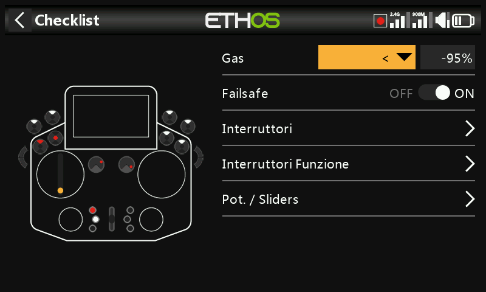
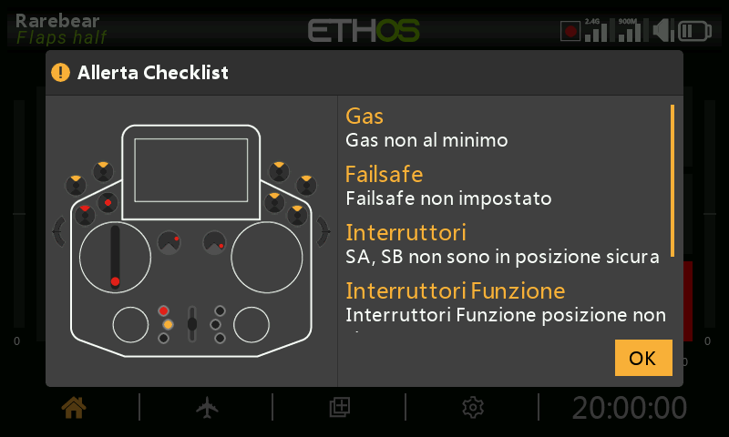
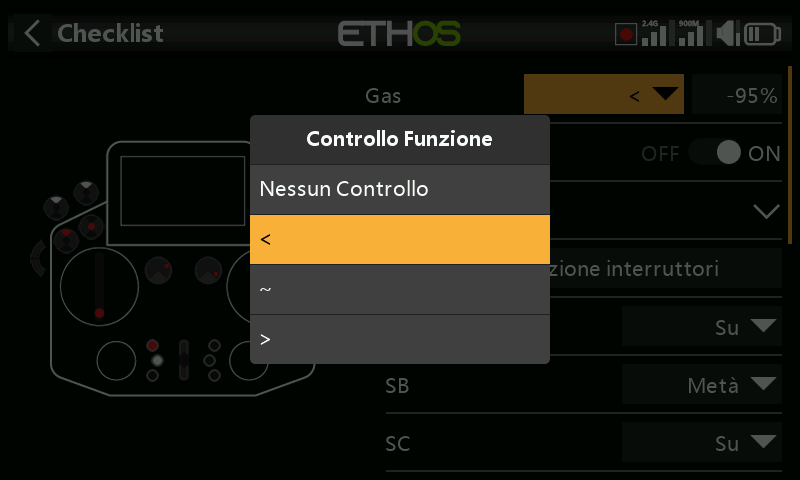
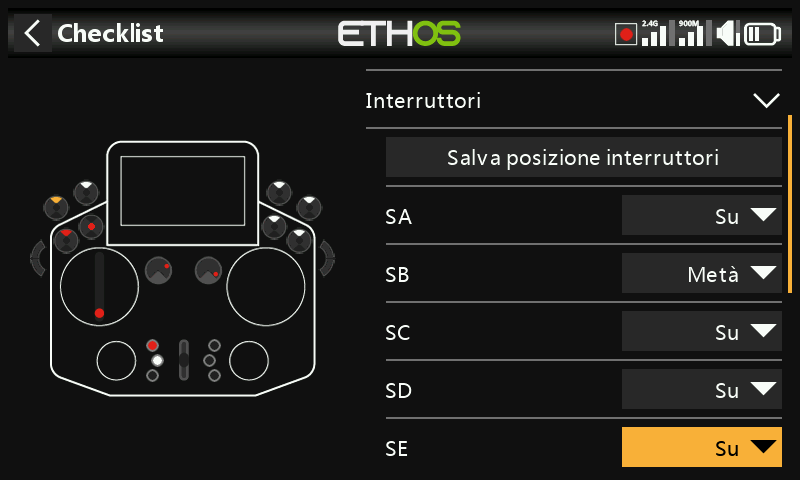
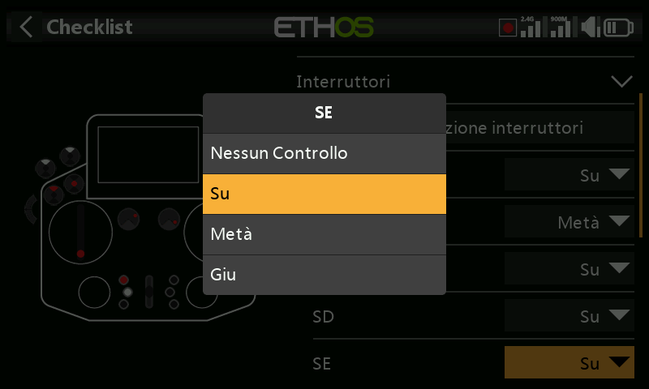
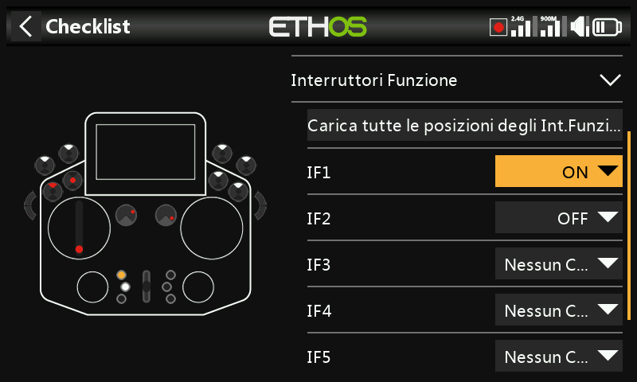
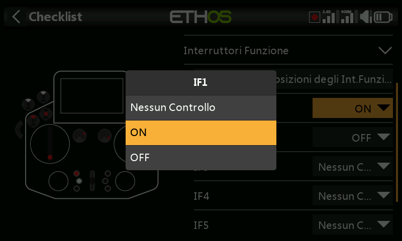
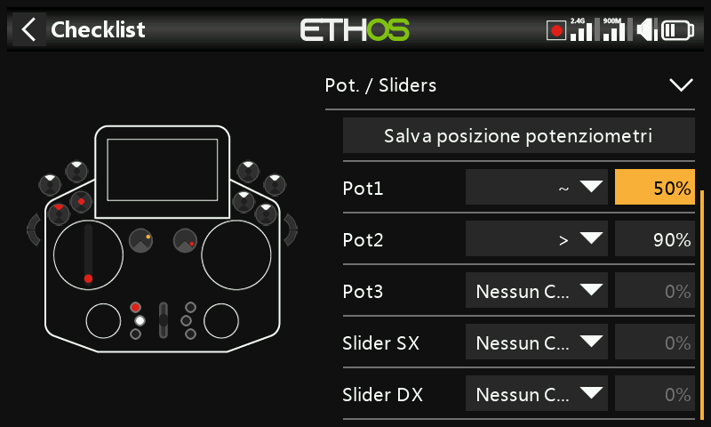
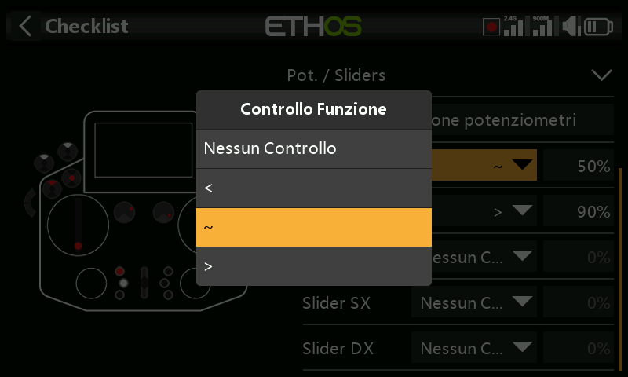

# Checklist

Una serie di controlli di sicurezza pre-volo che vengono eseguiti all'accensione della radio e/o al caricamento di un modello. I controlli integrati comprendono modalità silenziosa, failsafe non impostato, posizione di interruttori/potenziometri, batteria della radio e batteria RTC — il controllo degli interruttori indica in quale direzione deve essere spostato ciascun interruttore, segnalandolo con punti rossi nella schermata di avviso:

!!! note
    Sia `OK` sia `RTN` saltano completamente i controlli pre-volo, indipendentemente da quanto suggerito dall'avviso a schermo.

## Controllo del gas

Attiva il controllo e scegli un operatore — `<` (minore di), `~` (approssimativamente uguale) o `>` (maggiore di) — rispetto a un valore; viene emesso un avviso se lo stick del gas si trova al di fuori di quanto consentito dal confronto.

## Controllo del failsafe

Avvisa se il [failsafe](rf-system.md#failsafe) non è stato impostato per il modello corrente.

!!! tip
    Si raccomanda vivamente di lasciare attivo questo controllo.

## Controllo degli interruttori

Per ciascun interruttore è possibile richiedere una posizione specifica all'avvio (gli interruttori con nomi personalizzati definiti in [Configurazione di sistema → Hardware](../system-setup/hardware.md#switches-settings) vengono mostrati con tali nomi). **Carica tutte le posizioni degli interruttori** acquisisce le posizioni fisiche *attuali* come posizioni desiderate per ogni interruttore non contrassegnato come **Nessun controllo**.

## Controllo degli interruttori funzione

Stesso principio, applicato ai sei [interruttori funzione](model-edit.md#function-switches). **Carica tutte le posizioni degli interruttori funzione** funziona allo stesso modo di quanto descritto sopra.

## Controllo di potenziometri / slider

Richiede posizioni specifiche di potenziometri/slider all'avvio, individualmente per ciascun comando (`~`/`<`/`>`, come per il controllo del gas). **Carica tutte le posizioni dei potenziometri** acquisisce automaticamente le posizioni attuali — verifica poi con attenzione gli operatori selezionati automaticamente, poiché `~` rispetto a `<`/`>` potrebbe non corrispondere a quanto effettivamente desiderato.

## Testo definito dall'utente

Visualizza un file di testo semplice o formattato come parte della checklist di avvio, una volta installato per il modello. Per la procedura completa vedi [Guida pratica: checklist con testo definito dall'utente](../how-to/user-defined-checklist.md).
