# Curve

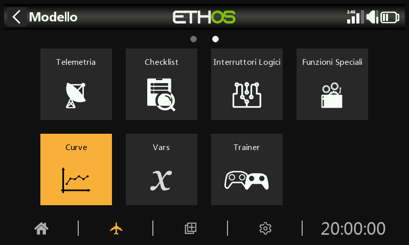

Le curve possono essere utilizzate per modificare la risposta dei controlli nei Mix o nelle Uscite. Mentre la curva Expo standard è disponibile direttamente in queste sezioni, questa sezione è utilizzata per definire le curve personalizzate che potrebbero essere necessarie. La funzione "Aggiungi curva" può essere raggiunta anche direttamente dalle schermate di modifica dei Mix e delle Uscite.

Sono disponibili 50 curve.

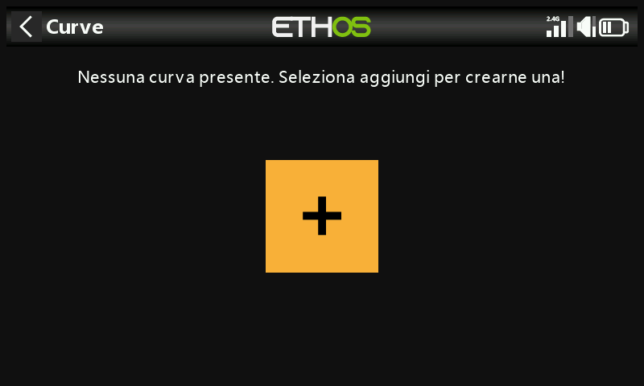

Non ci sono curve predefinite (ad eccezione di Expo che è integrata). Tocca il pulsante "+" per aggiungere una nuova curva.

Toccando un elenco di curve si apre una finestra di dialogo che ti permette di modificare, spostare, copiare, clonare o eliminare la curva evidenziata. Puoi anche aggiungere un'altra curva.

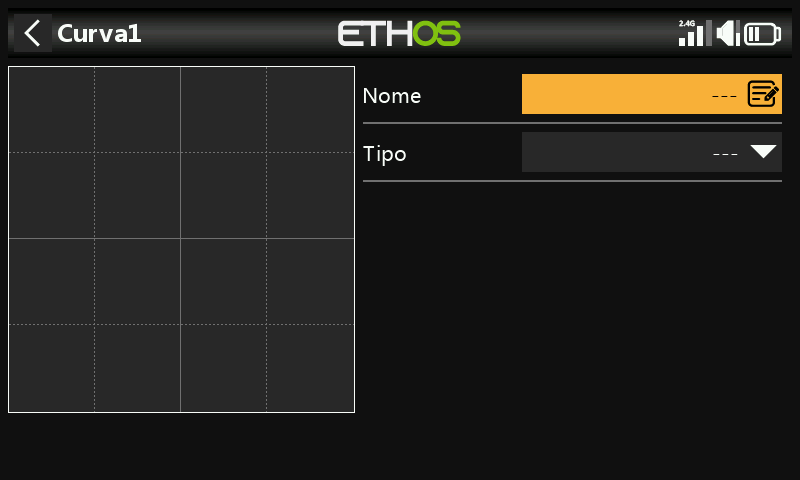

La schermata iniziale ti permette di dare un nome alla tua curva e di selezionare il tipo di curva.

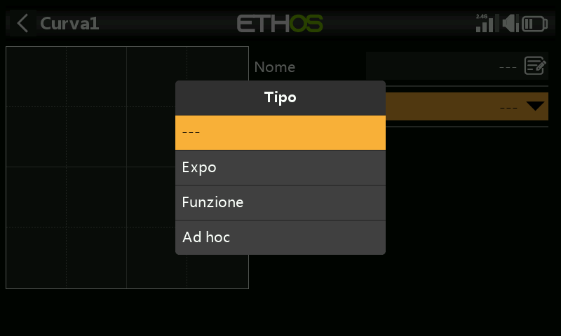

I tipi di curva disponibili sono:

## Expo

La curva esponenziale predefinita ha un valore pari a 40.

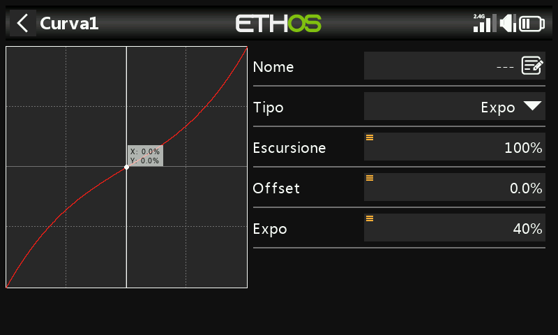

Un valore positivo ammorbidisce la risposta intorno allo 0, mentre un valore negativo la rende più acuta. Ammorbidire la risposta intorno allo stick medio aiuta a non controllare eccessivamente il modello, soprattutto per i principianti.

## Funzione

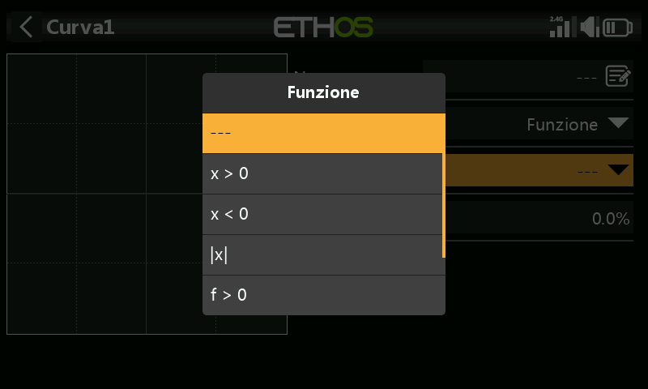

Sono disponibili le seguenti curve di funzioni matematiche:

x > 0

Se il valore della sorgente è positivo, l'uscita della curva segue la sorgente.

Se il valore della sorgente è negativo, l'uscita della curva è pari a 0.

Offset

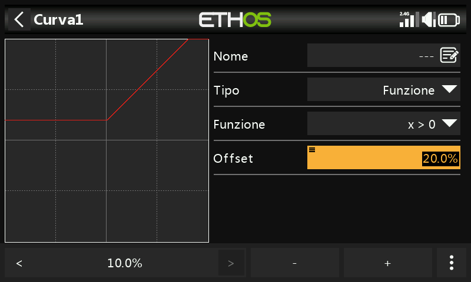

Nota che tutte le curve possono avere un offset positivo o negativo che sposterà la curva verso l'alto o verso il basso sull'asse Y. Gli offset delle curve e il valore Y hanno una precisione di un decimale.

x < 0

Se il valore della sorgente è negativo, l'uscita della curva segue la sorgente.

Se il valore della sorgente è positivo, l'uscita della curva è pari a 0.

|x|

L'uscita della curva segue la sorgente, ma è sempre positiva (chiamata anche "valore assoluto").

f > 0

Se il valore della sorgente è negativo, l'uscita della curva è pari a 0.

Se il valore della sorgente è positivo, l'uscita della curva è del 100%.

f < 0

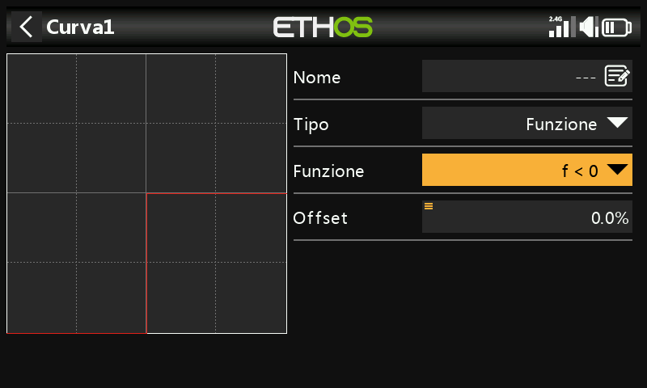

Se il valore della sorgente è negativo, l'uscita della curva è -100%.

Se il valore della sorgente è positivo, l'uscita della curva è pari a 0.

|f|

Se il valore della sorgente è negativo, l'uscita della curva è -100%.

Se il valore della sorgente è positivo, l'uscita della curva è +100%.

## Ad Hoc - Personalizzato

Conteggio dei punti

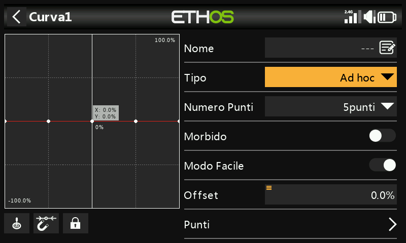

La curva personalizzata predefinita ha 5 punti. Puoi avere fino a 21 punti sulla tua curva.

- Pulsanti del menu

 Possono essere utilizzate le sorgenti configurate nei mix della curva o, opzionalmente, qualsiasi altro ingresso analogico comodo. Se selezioni l'opzione "Ingresso analogico automatico", il primo stick, cursore o potenziometro che sposti sarà usato come sorgente per X.

Si prega di notare che questo pulsante di input appare solo se la curva è collegata a un mix.

Quando è selezionato, il punto della curva più vicino sull'asse X verrà automaticamente selezionato per la regolazione con l'encoder rotativo.

L'ingresso deve essere regolato per allineare il valore X con un punto della curva prima di effettuare la regolazione.

 Toccando questa icona o premendo il tasto ENTER mentre sei in modalità di modifica del grafico, la modalità di blocco viene attivata o disattivata. Quando è attivata, tutti gli ingressi sono bloccati in modo da poter rilasciare l'input dello stick, consentendoti di osservare le superfici di controllo mentre regoli la curva.

Per facilitare l'impostazione, il cursore sarà attivo e mostrerà il valore dell'ingresso che sta guidando la curva.

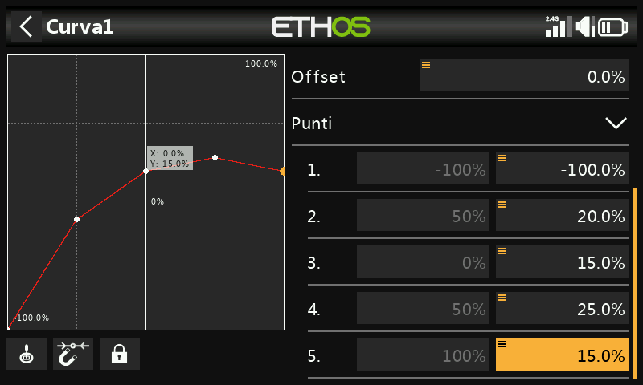

Gli offset delle curve e il valore Y hanno una precisione di un decimale.

Liscio

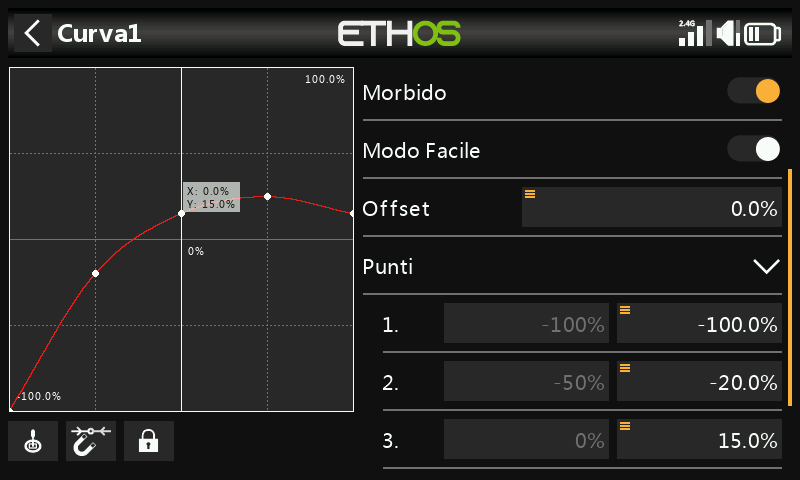

Se abilitato, viene creata una curva morbida attraverso tutti i punti.

Modalità facile = On

La modalità Easy ha valori fissi equidistanti sull'asse X e permette di programmare solo le coordinate Y della curva.

Modalità facile = Off

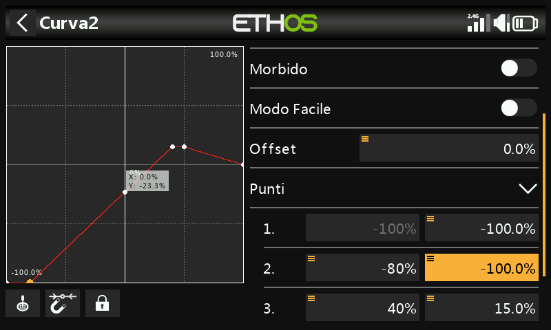

Punti

Con la modalità "Facile" disattivata, è possibile configurare sia le coordinate X che Y (vedi esempio sopra).  Nota che le coordinate X -100% e +100% per i punti finali della curva non possono essere modificate, perché la curva deve coprire l'intero intervallo del segnale.

## Variazione ***dell'offset*** della curva di funzione in volo

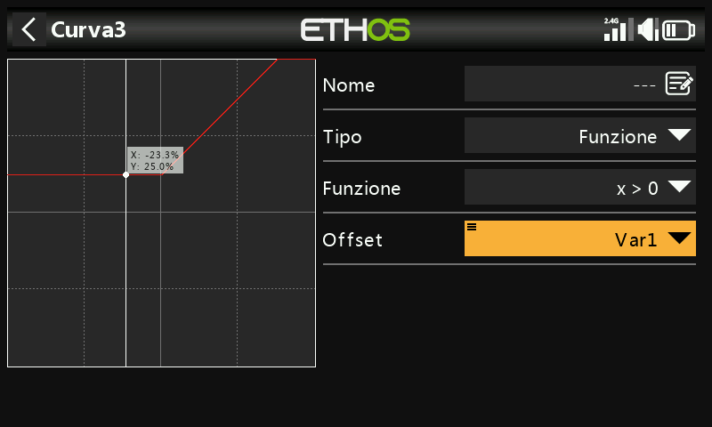

L'esempio precedente mostra il parametro Offset di una curva di tipo "Function" guidata da una Var, che potrebbe essere regolata in volo da un Trim riassegnato.

## Variazione del punto di curva in volo

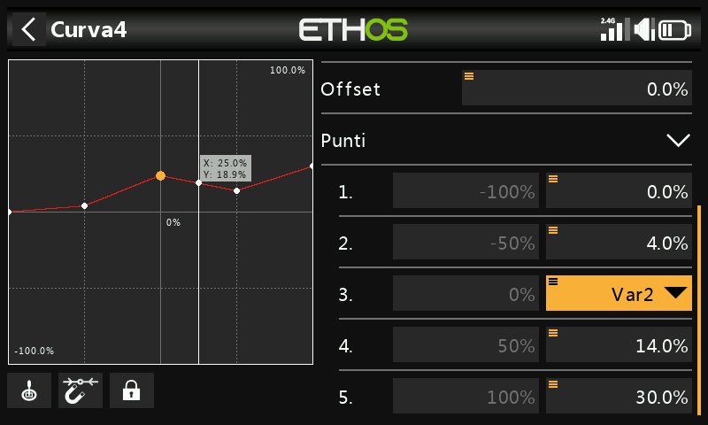

In questo esempio il punto centrale della curva è guidato da una Var, che potrebbe essere regolata in volo da un Trim riassegnato. Per maggiori dettagli, consulta la sezione [VAR](variables.md).
