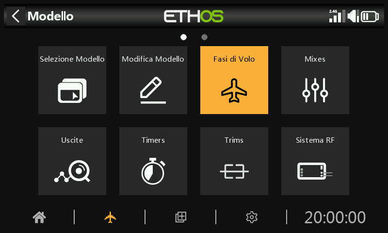
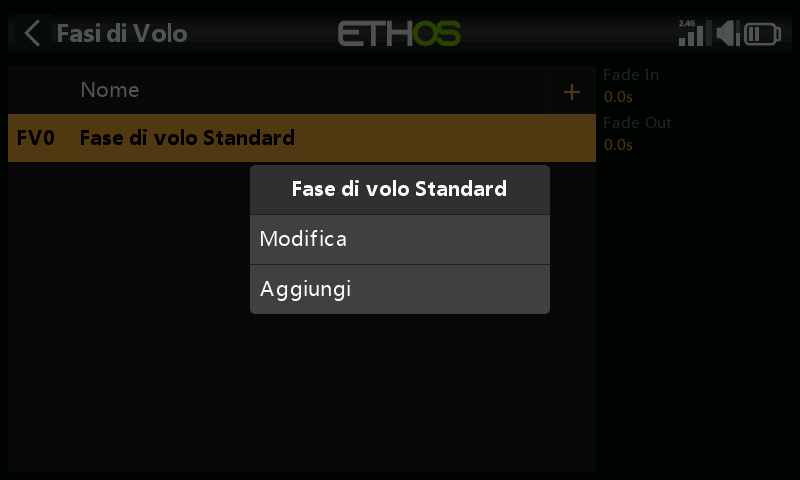
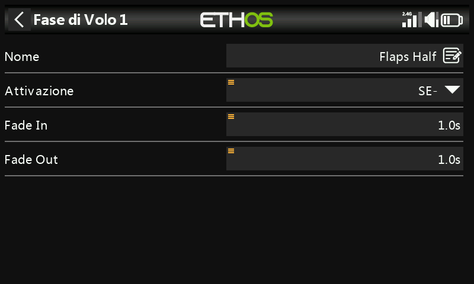
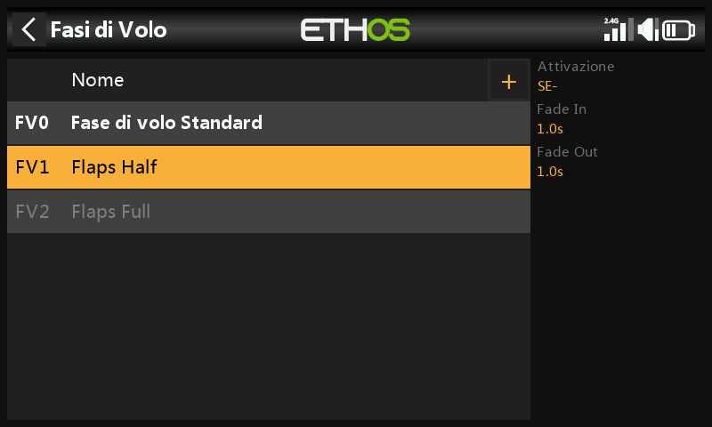
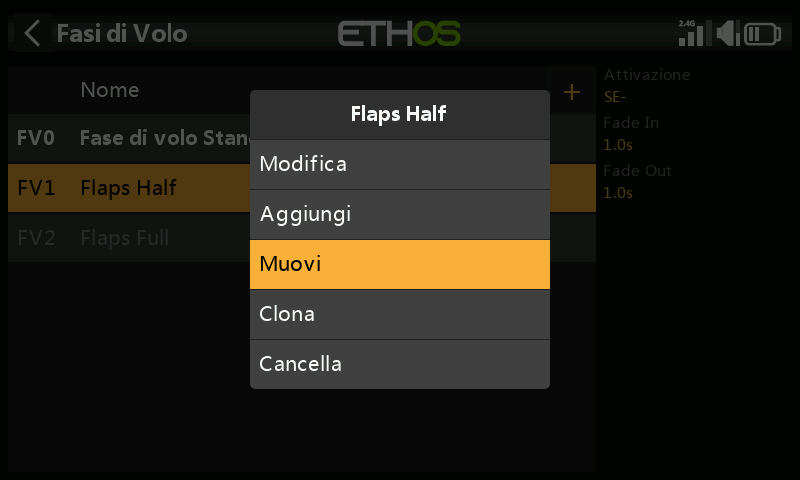
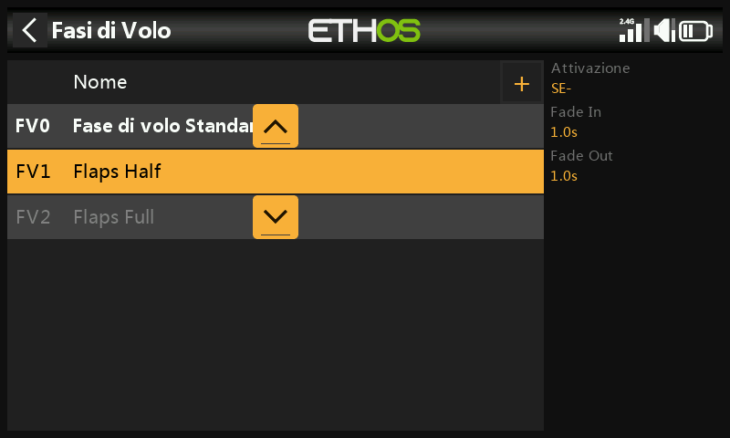

# Fasi di volo

Le Fasi di volo offrono un'incredibile flessibilità alla configurazione di un modello, perché permettono di impostare i modelli per compiti specifici o comportamenti di volo selezionabili tramite interruttore. Ad esempio, gli alianti possono essere impostati per avere modalità selezionabili come decollo, Crociera, Velocità e Termica. Gli aerei a motore possono avere Fasi di volo per il volo di precisione normale, il decollo e l'atterraggio con i flap aperti a metà o al massimo. Gli elicotteri hanno modalità come Normal per la messa a punto e il decollo/atterraggio, Idle Up 1 per il volo acrobatico e Idle Up 2 forse per il 3D.

Le Fasi di volo eliminano gran parte dell'onere di commutazione e regolazione del pilota.

La grande forza delle Fasi di volo è che supportano trim indipendenti e possono essere utilizzate anche per attivare Vars e Mix. Insieme, queste caratteristiche consentono una grande flessibilità. Consulta l'[Introduzione alle Fasi di volo ](../tutorials/initial-radio-setup.md)nella sezione Tutorial per vedere esempi di applicazione di queste funzioni.

La Fase di volo predefinita rimane inattiva fino alla sua configurazione. Tocca il pulsante “+” per definire una nuova Fase di volo. È possibile definire fino a 20 Fasi di volo.

## Nome

Permette di dare un nome alla fase di volo.

## Condizione attiva

Quando si aggiunge una fase di volo, la condizione attiva predefinita è inattiva, cioè "---". Le Fasi di volo possono essere controllate da posizioni di interruttori o pulsanti, da interruttori di funzione, da interruttori logici, da un evento di sistema come il taglio o il mantenimento del Gas - Throttle o da posizioni di trim.

Nota che la fase di volo predefinita non ha un parametro "Condizione attiva", perché è la fase di volo che è sempre attiva quando nessun'altra fase di volo è attiva. La prima fase di volo che ha l'interruttore acceso è quella attiva. Si noti che solo una fase di volo è attiva alla volta.

La fase di volo attiva è indicata in grassetto.

## Dissolvenza in entrata e in uscita

I tempi assegnati per una transizione fluida tra le Fasi di volo. L'esempio mostra un secondo assegnato a ciascuna modalità. Tieni presente che la dissolvenza in entrata e in uscita della fase di volo funziona solo se il mix dipende dalla Fase di volo.

Una volta programmate, le Fasi di volo selezionate vengono visualizzate nei mix. È possibile programmare fino a 100 Fasi di volo. Come la maggior parte delle funzioni di ETHOS, l'utente può programmare nomi di Fasi di volo con testo descrittivo come Crociera, Velocità, Termica o Normale, Decollo, Atterraggio.

Quando si aggiunge una nuova fase di volo a un modello, tutti i mix che utilizzano le Fasi di volo devono essere controllati per verificarne il corretto funzionamento, perché la nuova fase di volo sarà attiva di default in tutti i mix che utilizzano le Fasi di volo. Questo è un problema, ad esempio, quando si utilizza un mix Lock per bloccare un canale specifico in una specifica FM.

## Gestione della Fase di volo

Tocca una fase di volo per visualizzare un menu che ti consente di modificare, spostare, clonare o eliminare le Fasi di volo. È possibile aggiungere nuove Fasi di volo toccando il pulsante “+” nell'intestazione.

Una fase di volo clonata erediterà le impostazioni della fase di volo del genitore nei mix, quindi i mix si comporteranno allo stesso modo e saranno attivi (o meno) quando la fase di volo clonata è attiva. Il nuovo clone deve essere aggiunto come ultima FM in modo che non possa interferire con nessuna FM esistente.

Puoi utilizzare l'opzione "Sposta" per cambiare la priorità di una fase di volo. La priorità delle Fasi di volo è in ordine crescente e la prima che ha l'interruttore acceso è quella attiva.
