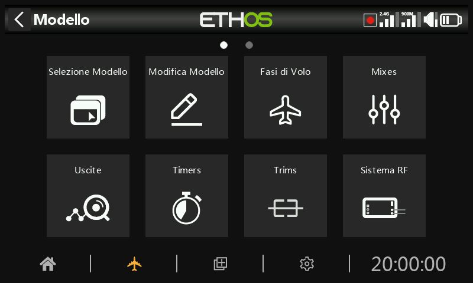

# Panoramica

All'interno di System Setup, tocca un riquadro per configurare la sezione selezionata oppure usa il selettore rotante per spostare l'evidenziazione sul riquadro desiderato, quindi premi Invio. Puoi scorrere il dito verso sinistra per accedere alla seconda pagina di funzioni oppure utilizzare il selettore rotante per spostare l'evidenziazione sulla seconda pagina. In alternativa, puoi usare il tasto Pagina per passare da una pagina all'altra.

## Seleziona il modello

L'opzione "Seleziona modello" serve per creare, selezionare, aggiungere, clonare o eliminare modelli. Serve anche per creare e gestire cartelle di categorie di modelli specifiche per l'utente.

## Modifica il modello

L'opzione "Modifica modello" serve per modificare i parametri di base del modello come impostati dalla procedura guidata e serve soprattutto per modificare il nome o l'immagine del modello. Serve anche per configurare gli interruttori di funzione, che sono specifici per il modello.

## Fasi di volo

Le Fasi di volo consentono di impostare i modelli per compiti specifici o comportamenti di volo selezionabili tramite interruttore. Ad esempio, gli alianti possono essere impostati per avere Fasi di volo come decollo, Crociera, Velocità e Termica. Gli aerei a motore possono avere Fasi di volo normali, decollo e atterraggio. Gli elicotteri hanno modalità come Normal per la messa in moto e il decollo/atterraggio, Idle Up 1 per il volo acrobatico e Idle Up 2 per il volo 3D.

## Mixer

La sezione Mixes è il luogo in cui vengono configurate le funzioni di controllo del modello. Consente di combinare una qualsiasi delle numerose sorgenti di ingresso come desiderato e di mapparle su uno qualsiasi dei canali di uscita.

Questa sezione permette anche di condizionare la sorgente definendo escursioni/rate e offset, aggiungendo curve (ad esempio Expo). Il mix può essere sottoposto a un interruttore e/o a Fasi di volo e può essere aggiunta una funzione di rallentamento.

## Uscite

La sezione Uscite è l'interfaccia tra la "logica" di configurazione e il mondo reale con servi, collegamenti e superfici di controllo, nonché attuatori e trasduttori. Nelle Mix abbiamo impostato le azioni che vogliamo far compiere ai nostri diversi controlli. Questa sezione permette di adattare queste uscite logiche pure alle caratteristiche meccaniche del modello. È qui che configuriamo le escursioni minime e massime, l'inversione del servo o del canale e regoliamo il punto centrale del servo o del canale utilizzando la regolazione del centro PPM, oppure aggiungiamo un offset utilizzando il subtrim. Possiamo anche definire una curva per correggere eventuali problemi di risposta nel mondo reale. Ad esempio, una curva può essere utilizzata per garantire che i flap di destra e di sinistra seguano con precisione.

## Timer

La sezione Timer serve a configurare gli otto timer disponibili.

## Trim

La sezione Trims ti permette di configurare l'intervallo di trim e la dimensione del passo di trim, oppure di configurare un comportamento di trim personalizzato per ciascuno dei 4 stick di controllo. È inoltre possibile configurare i trim incrociati e il trim istantaneo. Alcuni modelli hanno due interruttori di trim aggiuntivi T5 e T6, molto utili per le regolazioni in volo. È possibile configurare altri trim in base alle esigenze.

## Sistema RF

Questa sezione serve a configurare l'"ID di registrazione del proprietario" e i moduli RF interni e/o esterni. Qui si effettua anche il binding del ricevitore e si configurano le opzioni del ricevitore.

L'"ID di registrazione del proprietario" è un ID di 8 caratteri che contiene un codice univoco casuale, che può essere modificato se lo si desidera. Questo ID diventa l'"ID di registrazione" quando si registra un ricevitore. Inserisci lo stesso codice nel campo "ID di registrazione del proprietario" degli altri trasmettitori con cui vuoi utilizzare la funzione Smart Share. Questa operazione deve essere eseguita prima di creare il modello su cui si vuole utilizzare la funzione.

## Telemetria

La telemetria è utilizzata per trasmettere informazioni dal modello al pilota RC. Queste informazioni possono essere molto ampie e comprendono RSSI (potenza del segnale del ricevitore) e VFR (frequenza dei fotogrammi validi), varie tensioni e correnti e qualsiasi altra uscita del sensore come la posizione GPS, l'altitudine, ecc.

Nota che le schermate di telemetria sono impostate come viste principali nella sezione [Configura schermate](../displays/index.md).

## Lista di controllo

La sezione Checklist viene utilizzata per definire gli avvisi di avvio per aspetti quali la posizione iniziale del Gas - Throttle, la configurazione del failsafe, le posizioni di potenziometri e cursori e le posizioni iniziali degli interruttori.

## Interruttori logici

Gli interruttori logici sono interruttori virtuali programmati dall'utente. Non si tratta di interruttori fisici che si possono girare da una posizione all'altra, ma possono essere utilizzati come trigger del programma allo stesso modo di qualsiasi interruttore fisico. Vengono attivati e disattivati valutando le condizioni della programmazione. Possono utilizzare una serie di ingressi come interruttori fisici, altri interruttori logici e altre fonti come i valori di telemetria, i valori dei mixer dei canali, i valori dei timer o le Vars. Possono anche utilizzare i valori restituiti da uno script del modello LUA.

## Funzioni speciali

Qui si possono utilizzare gli interruttori per attivare funzioni speciali come la modalità trainer, la riproduzione della colonna sonora, l'uscita vocale delle variabili, la registrazione dei dati, ecc. Le funzioni speciali sono utilizzate per configurare funzioni specifiche del modello.

## Curve

Le curve personalizzate possono essere utilizzate nella formattazione degli ingressi, nei mix o nelle uscite. Le curve disponibili sono 50 e possono essere di diversi tipi (da 2 a 21 punti, con coordinate x fisse o definibili dall'utente).

Nei mix, un'applicazione tipica è l'utilizzo di una curva Expo per ammorbidire la risposta a metà stick. Una curva può essere utilizzata anche per ammorbidire una Mix di compensazione tra flap ed elevatore, in modo che l'aereo non si "gonfi" quando vengono applicati i flap.

Nelle uscite è possibile utilizzare una curva di bilanciamento per garantire un tracciamento preciso dei flap destro e sinistro.

## Vars

Le variabili (Vars) possono essere utilizzate per nominare e memorizzare i parametri di impostazione di un modello in modo da potervi fare riferimento in altri punti della programmazione radio, compresi i mix. Le Vars possono essere considerate come dei contenitori di informazioni.

## Trainer

La sezione Trainer serve per impostare la radio come Master o Slave in una configurazione trainer. Il collegamento del trainer può avvenire tramite Bluetooth o cavo.

## Lua

Questa pagina serve a gestire le fonti e i task Lua per ogni modello.
