# Interruttori logici

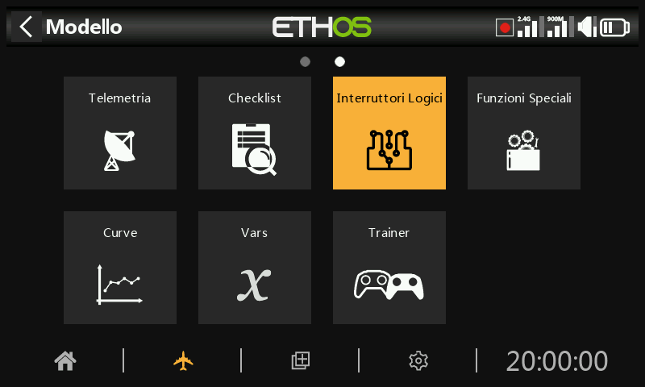

Gli interruttori logici sono interruttori virtuali programmati dall'utente. Non si tratta di interruttori fisici che si possono girare da una posizione all'altra, ma possono essere utilizzati come trigger del programma allo stesso modo di qualsiasi interruttore fisico. Vengono attivati e disattivati (in termini logici diventano Vero o Falso) valutando le condizioni di ingresso rispetto alla programmazione dell'interruttore logico. Possono utilizzare una serie di ingressi come comandi e interruttori fisici, altri interruttori logici e altre fonti come valori di telemetria, valori di mix, valori di timer, canali di giroscopi e trainer. Possono anche utilizzare i valori restituiti da un modello di script LUA (da supportare).

Sono supportati fino a 100 interruttori logici.

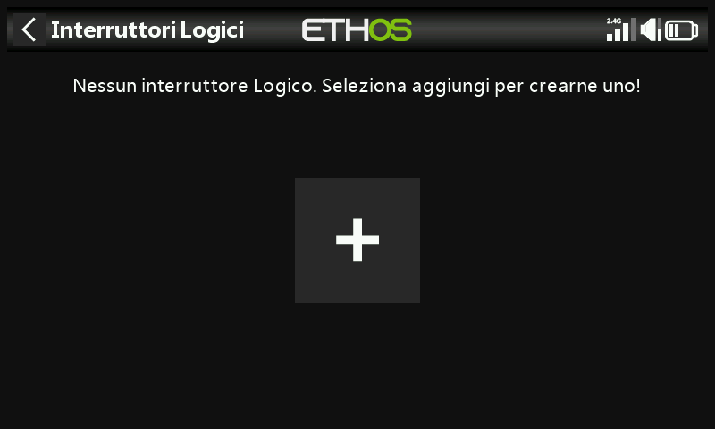

Non ci sono interruttori logici predefiniti. Tocca il pulsante "+" per aggiungere un interruttore logico.

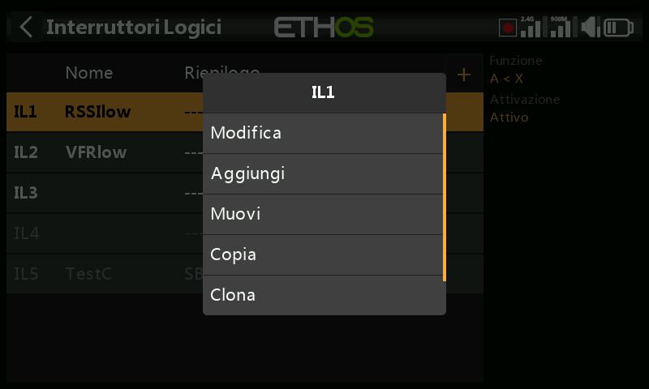

Una volta definiti gli interruttori logici, toccandone uno si aprirà il menu a comparsa di cui sopra, che ti permetterà di modificare, aggiungere, spostare, copiare/incollare, clonare o eliminare quell'interruttore.

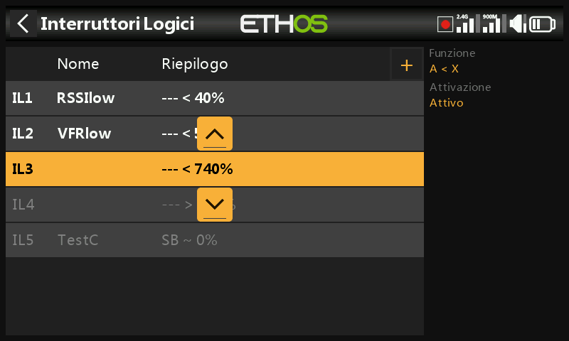

Selezionando "Muovi" appariranno dei tasti freccia che permetteranno di spostare l'interruttore logico verso l'alto o verso il basso.

## Aggiunta di interruttori logici

Nota che l'etichetta dell'interruttore logico nell'intestazione del menu è verde quando lo stato dell'interruttore logico è Vero, o rossa quando è Falso.

Nome

Permette di dare un nome all'interruttore logico.

Funzione

Le funzioni disponibili sono elencate di seguito. Tieni presente che tutte le funzioni possono avere uscite normali o invertite. Consulta anche la sezione dedicata ai parametri condivisi e le sezioni relative alla telemetria e al confronto delle sorgenti che seguono le descrizioni delle funzioni.

A ~ X

La condizione è Vera se il valore della sorgente selezionata 'A' è approssimativamente uguale (entro il 10% circa) a 'X', un valore definito dall'utente.

Nella maggior parte dei casi, è meglio utilizzare la funzione approssimativamente uguale piuttosto che la funzione "esattamente" uguale.

A = X

La condizione è Vera se il valore della sorgente selezionata 'A' è 'esattamente' uguale a 'X', un valore definito dall'utente.

È necessario prestare attenzione quando si utilizza la funzione "esattamente" uguale. Ad esempio, quando si verifica se una tensione è uguale a un'impostazione di 8,4V, la lettura telemetrica effettiva può saltare da 8,5V a 8,35V, quindi la condizione non è mai soddisfatta e l'interruttore logico non si accende.

A > X

La condizione è Vera se il valore della sorgente selezionata 'A' è maggiore di 'X', un valore definito dall'utente.

A < X

La condizione è Vera se il valore della sorgente selezionata 'A' è inferiore a 'X', un valore definito dall'utente.

|A| > X

La condizione è Vera se il valore assoluto della sorgente selezionata 'A' è maggiore di 'X', un valore definito dall'utente. (Assoluto significa che non si tiene conto del fatto che 'A' sia positivo o negativo e si utilizza solo il valore).

<A| < X

La condizione è Vera se il valore assoluto della sorgente selezionata 'A' è inferiore a 'X', un valore definito dall'utente. (Assoluto significa che non si tiene conto del fatto che 'A' sia positivo o negativo e si utilizza solo il valore).

∆ > X

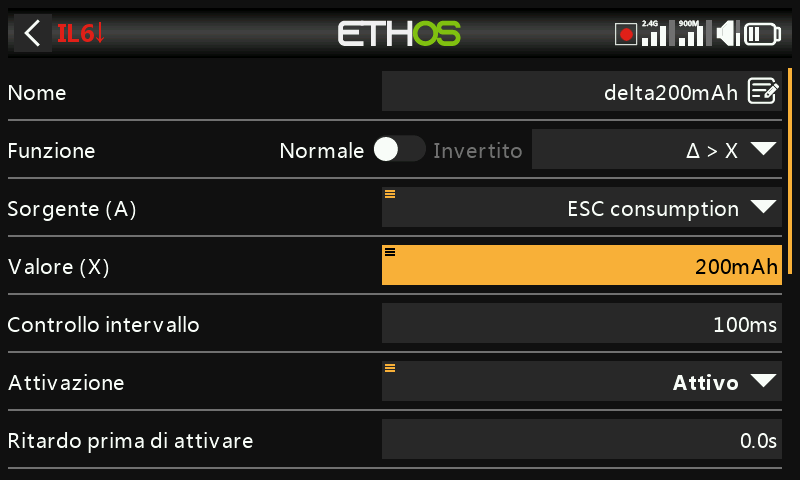

La condizione è Vera se la variazione del valore "d" (cioè delta) della sorgente selezionata "A" è maggiore o uguale al valore definito dall'utente "X", entro l'"Intervallo di controllo". Se l'"Intervallo di controllo" è impostato su "---", l'intervallo di controllo diventa infinito.

Consulta [questo esempio ](../tutorials/basic-flybarless-heli.md)per un utilizzo della funzione Delta.

|∆| > X

La condizione è Vera se il valore assoluto della variazione '|d|' nella sorgente selezionata 'A' è maggiore o uguale al valore definito dall'utente 'X' (Assoluto significa che non tiene conto del fatto che 'A' sia positivo o negativo).

RANGE Gamma (intervallo)

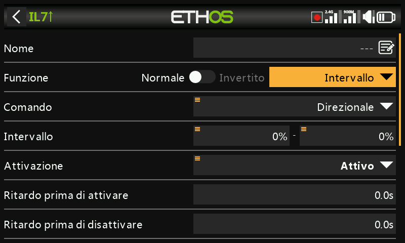

La condizione è Vera se il valore della sorgente selezionata "A" rientra nell'intervallo specificato

AND

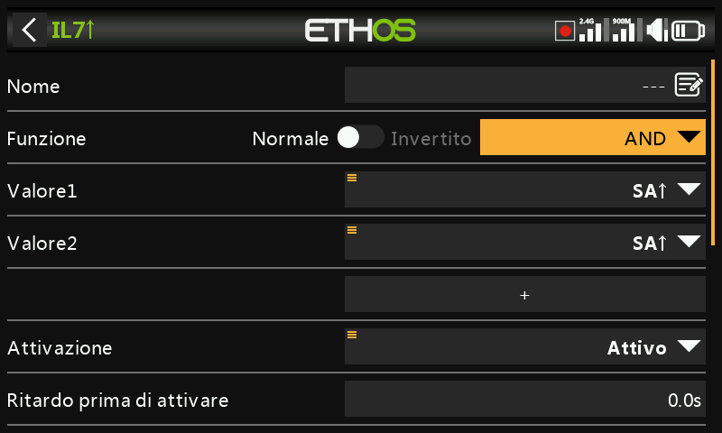

La funzione AND può avere più valori. La condizione è vera se **tutte le** fonti selezionate in Valore 1, Valore 2 ... Valore(n) sono vere (cioè ON).

OR

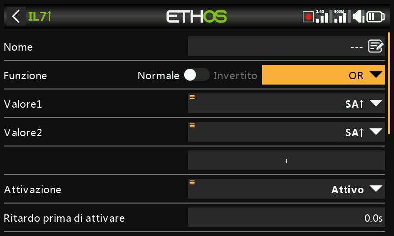

La condizione è Vera se **almeno una o più** delle fonti selezionate in Valore 1, Valore 2 ... Valore(n) sono vere (cioè ON).

XOR (OR esclusivo)

La condizione è Vera se **solo una** delle fonti selezionate in Valore 1, Valore 2 ... Valore(n) è vera (cioè ON).

Generatore di timer

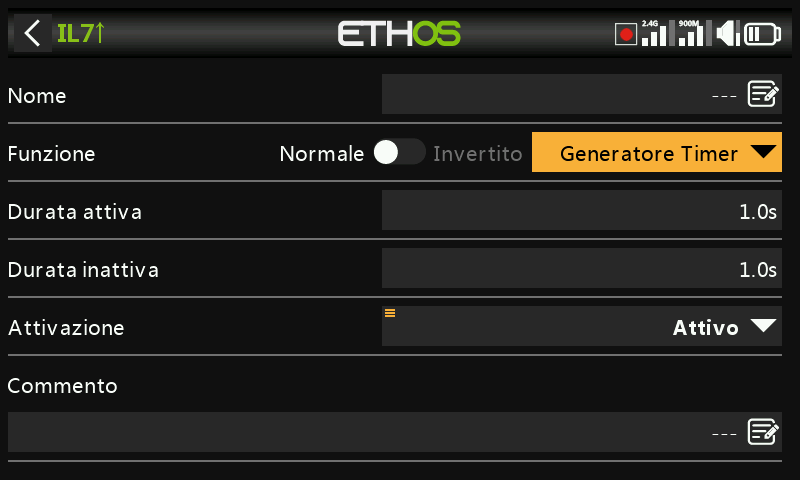

L'interruttore logico si accende e si spegne continuamente. Si accende per il tempo "Durata attiva" e si spegne per il tempo "Durata inattiva".

Sticky / appicicoso

O con l’opzione EDGE/SOGLIA:

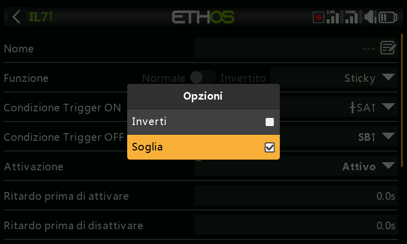

Per l’opzione Edge-Soglia, premere a lungo \[Enter\] sulla condizione di  Trigger ON o Trigger OFF quindi selezionare Edge-soglia.

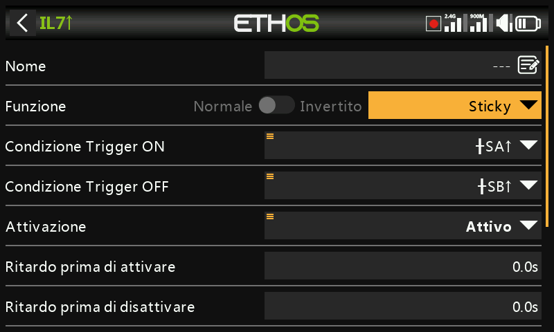

L'interruttore logico Sticky ha una funzione di blocco, nota anche come flip-flop Set/Reset. Il suo funzionamento è simile a quello di un flip-flop JK e quindi ha sempre stati inequivocabili in uscita.

Si blocca su ON (cioè diventa True) quando vengono soddisfatte le condizioni di attivazione ON e mantiene il suo valore fino a quando non viene forzato su False quando vengono soddisfatte le condizioni di disattivazione OFF. Questo può essere controllato dal parametro opzionale “Condizione attiva”. Ciò significa che se la condizione attiva è True, l'uscita Sticky segue la condizione di blocco della funzione Sticky, soggetta a ritardi. Tuttavia, se la condizione attiva è False, anche l'uscita dell'interruttore logico viene mantenuta su False.

**Nota:** la funzione dell'interruttore logico Sticky è stata migliorata nella versione Ethos 1.6.2 con l'aggiunta dell'opzione Edge sugli ingressi trigger, che consente un'enorme flessibilità nella sua configurazione. È necessario eseguire test accurati per garantire il corretto funzionamento.

**C**ondizione di attivazione

Se la condizione di attivazione è ad esempio SA↑ (nessun ritardo), l'uscita Sticky 	passerà da False a True non appena SA diventa alta.

Se la condizione di attivazione è SA↑ (ritardo=1s), l'uscita Sticky passerà da False a 	True 1 secondo dopo che SA è diventato alto, a condizione che SA rimanga alto 	durante questo ritardo.

Se la condizione di attivazione è <bordo>SA↑ (ritardo=1s), l'uscita Sticky passerà 	da True a False 1 secondo dopo che SA è diventato alto, anche se SA non rimane 	alto durante questo ritardo.

Condizione di disattivazione

Se la condizione di disattivazione è ad esempio SB↑ (nessun ritardo), l'uscita Sticky 	passerà da True a False non appena SB diventa alto.

Se la condizione di Trigger OFF è SB↑ (ritardo=1s), l'uscita Sticky passerà da True a 	False 1 secondo dopo che SB è diventato alto, a condizione che SB rimanga alto 	durante questo ritardo.

Se il Trigger OFF è <edge>SB↑ (ritardo=1s), lo Sticky passerà da True a False 1 	secondo dopo che SB è diventato alto, anche se SB non rimane alto durante questo 	ritardo.

Condizione attiva

Si noti che la funzione Sticky continua a funzionare, anche se il suo output è 	controllato dall'ingresso “Condizione attiva”. Non appena la condizione attiva 	diventa di nuovo True, la condizione di blocco di Sticky viene commutata all'output, 	soggetta a eventuali ritardi.

Ritardo prima di attivo/inattivo

I ritardi di attivazione/disattivazione del trigger descritti sopra vengono applicati 	DOPO la condizione attiva. Ciò significa che se la condizione attiva cambia, i periodi 	di ritardo verranno applicati prima che la condizione di Sticky venga nuovamente 	commutata sull'uscita.

Funzione di commutazione

Commutando contemporaneamente entrambi gli ingressi delle condizioni di trigger 	da False a True, l'uscita di Sticky cambierà stato una volta.

Nota: fare riferimento anche alla sezione “Parametri comuni” di seguito.

Edge

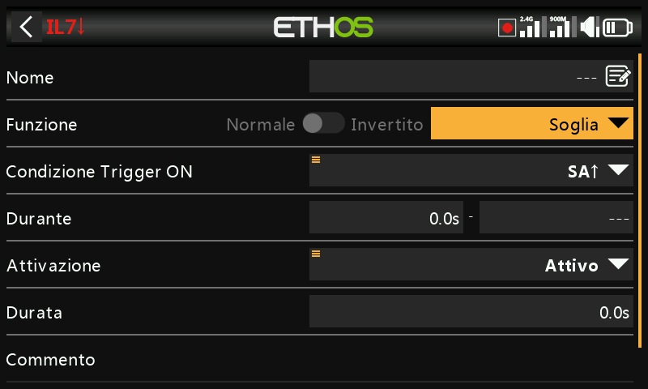

Edge è un interruttore momentaneo che diventa Vero per il periodo specificato in "Durata" quando le condizioni di attivazione del Edge sono soddisfatte.

- Opzione Edge ascendente

During è diviso in due parti \[t1:t2\]. Con t1 di During = 0,0s e t2= 'Fronte di salita', l'interruttore logico diventa Vero (per il periodo specificato in 'Durata') nell'istante in cui la 'condizione di attivazione' passa da Falso a Vero.

During è diviso in due parti \[t1:t2\]. Se t1 di During è un valore positivo (ad esempio 5,0s) e t2= 'Edge crescente', l'interruttore logico diventa Vero  (per il periodo specificato in 'Durata') 5 secondi dopo che la 'condizione di attivazione' passa da Falso a Vero. Qualsiasi altro "picco" durante il periodo t1 viene ignorato.

- Opzione Edge di caduta

During è diviso in due parti \[t1:t2\]. Con During t1=0.0s e t2= '---' (fronte di caduta), l'interruttore logico diventa Vero (per il periodo specificato in 'Durata') nell'istante in cui la 'condizione di attivazione' passa da Vero a Falso.

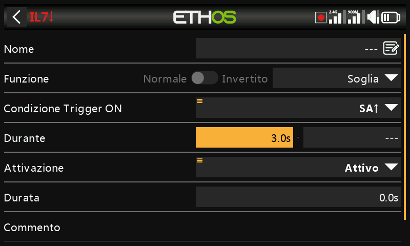

During è diviso in due parti \[t1:t2\]. Se t1 di During è un valore positivo (ad esempio 3,0s) e t2= '---' (Edge di caduta), l'interruttore logico diventa Vero (per il periodo specificato in 'Durata') quando la 'condizione di attivazione' passa da Vero a Falso, dopo essere stata Vera per almeno 3 secondi.

- Opzione impulso

Il tempo è diviso in due parti \[t1:t2\]; se si inseriscono valori sia per t1 che per t2, è necessario un impulso per attivare l'interruttore logico.

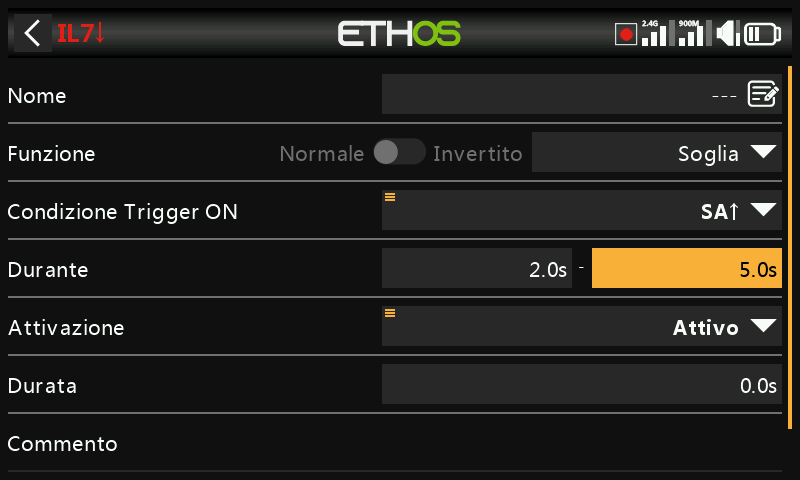

Nell'esempio precedente, l'interruttore logico diventerà Vero per il periodo di "Durata" se la "Condizione di attivazione" passa da Falso a Vero, e poi passa da Vero a Falso dopo almeno 2 secondi ma non oltre 5 secondi.

## Parametri condivisi

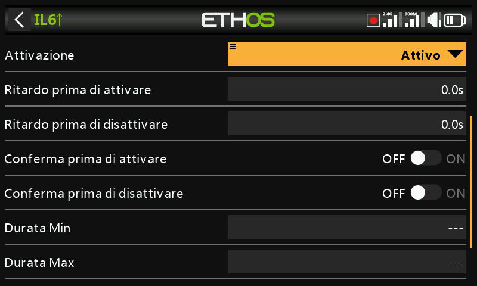

Gli interruttori logici hanno tutti una serie di parametri condivisi:

Condizione attiva

Gli interruttori logici possono essere regolati dal parametro opzionale "Condizione attiva". Ciò significa che se la condizione attiva è Vera, l'uscita dell'interruttore logico segue la condizione della funzione. Tuttavia, se la condizione attiva è Falsa, anche l'uscita dell'interruttore logico viene mantenuta Falsa.

La "Condizione attiva" può essere selezionata tra le seguenti:

- Sempre acceso
- Posizioni degli interruttori
- Interruttori di funzione
- Interruttori logici
- Posizioni di assetto
- Telemetria
- Fase di volo
- Eventi di sistema 
  - Mantenimento del Gas - Throttle
  - Taglio del Gas - Throttle
  - Gas - Throttle attivo
  - Telemetria attiva
  - RSSI basso
  - Trainer attivo
  - Reset - Azzeramento del volo

Nota che la funzione Appiccicosa continua a funzionare anche se la sua uscita è regolata dall'interruttore "Condizione attiva". Non appena la condizione attiva diventa di nuovo Vera, la condizione della funzione passa all'uscita dell'interruttore logico.

Ritardo prima dell'attivazione

Questo valore determina il tempo per cui le condizioni dell'interruttore logico devono essere vere prima che l'uscita dell'interruttore logico diventi vera (non è rilevante per il generatore di timer e il Edge). I ritardi possono arrivare fino a 60.0s.

Fai riferimento a [questo esempio in ](../tutorials/basic-flybarless-heli.md)cui la tensione del Neuron ESC scende sotto i 4,2V per almeno x secondi.

Ritardo prima dell'inattività

Allo stesso modo, questo valore determina il tempo per cui le condizioni dell'interruttore logico devono essere false prima che l'uscita dell'interruttore logico diventi falsa (non rilevante per il generatore di timer e il Edge). I ritardi possono arrivare fino a 60.0s.

Conferma prima dell'attivazione

Quando un interruttore logico rileva un cambiamento di stato in attivo, questa opzione richiede la conferma dell'utente prima che lo stato cambi.

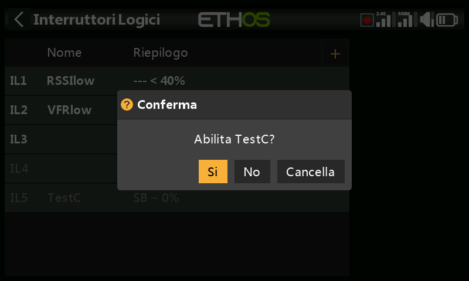

Alcuni esempi di utilizzo della funzione:

1. Per le macchine a terra dove puoi usarlo prima di iniziare qualcosa di pericoloso.

2. Per quanto riguarda l'interruttore NFC, che consente di spegnere il modello dal trasmettitore, potrebbe essere utilizzato per avere una conferma prima dello spegnimento.

Conferma prima dell'inattività

Quando un interruttore logico rileva un cambiamento di stato in attivo, questa opzione richiede la conferma dell'utente prima che lo stato cambi.

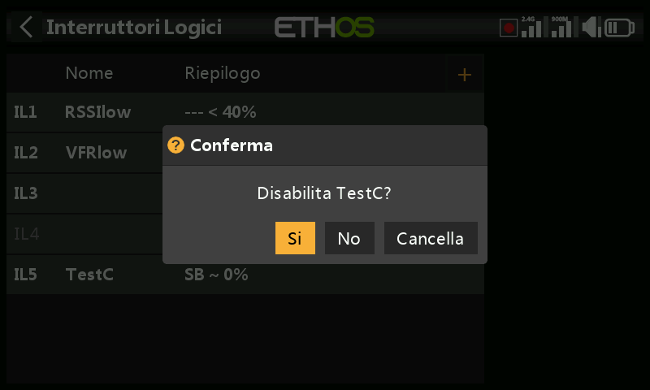

Durata minima

Una volta che l'interruttore logico diventa Vero, rimarrà Vero per almeno la durata minima specificata. Se la durata è quella predefinita "---", l'interruttore logico diventerà Vero solo per un ciclo di elaborazione del mix, che è troppo breve per essere visto, quindi la linea LSW non sarà in grassetto. La durata può arrivare fino a 60.0s.

Durata massima

Se viene impostata una durata massima, una volta che l'interruttore logico diventa Vero, rimarrà Vero solo per la durata massima specificata. La durata può arrivare fino a 60.0s.

Commento

Un commento può essere aggiunto come spiegazione del suo utilizzo o della sua funzione, per facilitare la comprensione. Il commento viene visualizzato quando un interruttore logico viene aggiunto a un widget di valori.

## Interruttori logici - da utilizzare con la telemetria

Se la fonte di un interruttore logico è un sensore di telemetria, se il sensore è attivo l'interruttore logico sarà attivo.

Oltre alle normali categorie di condizioni attive, gli interruttori logici e le funzioni speciali hanno una condizione "Telemetria attiva" (sotto "Evento di sistema") che è attiva quando viene ricevuta la telemetria.

Attenzione Warning!

Quando in un mix viene utilizzato un interruttore logico che utilizza la telemetria, è necessario aggiungere un'azione di mix aggiuntiva che utilizza lo stesso interruttore logico invertito (cioè quando è inattivo) per garantire che il mix abbia valori validi anche in caso di perdita della telemetria. Ricordate che quando un mix è inattivo, l'uscita del canale sarà neutra = 0% = 1500us o metà acceleratore se si trova su un canale dell'acceleratore!

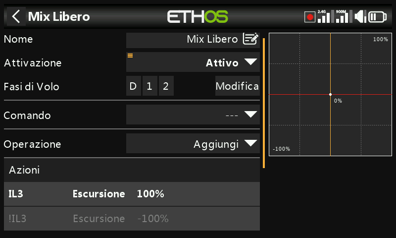

L'esempio sopra mostra l'aggiunta dell'interruttore logico VFRlow, nonché il suo inverso !VFRlow per garantire che il mix abbia sempre valori validi.

In alternativa, è possibile utilizzare un'azione Offset:

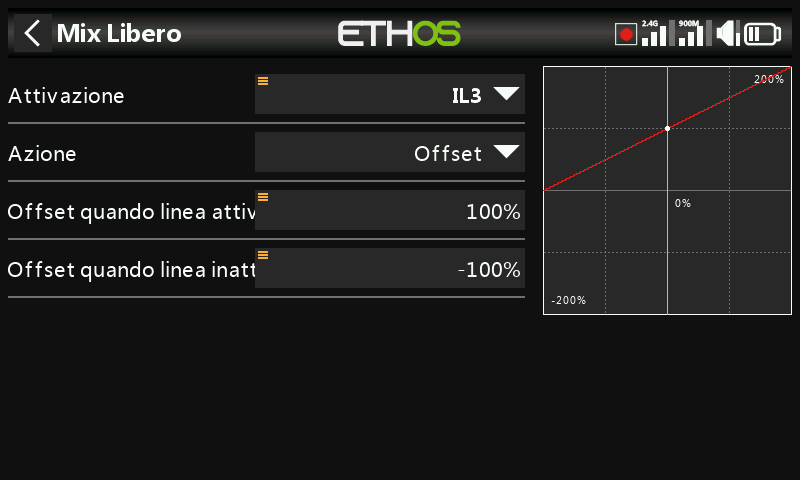

Le azioni di offset hanno due valori predefiniti: uno per quando l'azione di offset è attiva e uno per quando l'azione di offset è inattiva. Questo copre tutti i casi.

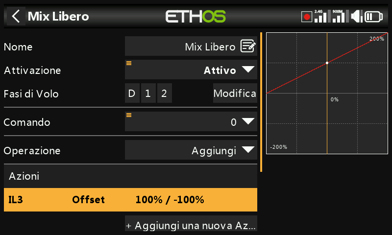

Quanto sopra mostra la riga di riepilogo del mix con l'offset che ha sempre un valore valido. L'origine è stata impostata sul valore speciale 0, quindi l'offset verrà aggiunto allo 0% e l'uscita del mix sarà +100% quando VFRlow è attivo, o -100% quando VFRlow è inattivo.

## Confronto tra le fonti

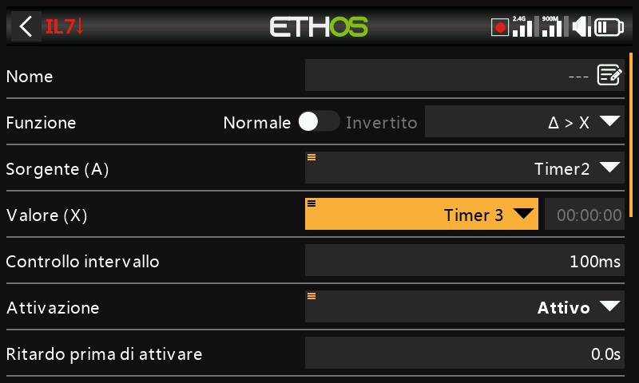

Normalmente la sorgente (A) viene confrontata con un Valore fisso (X). Tuttavia, è possibile confrontare due sorgenti dello stesso formato (cioè con le stesse unità di misura). Ad esempio, si possono confrontare due timer, due tensioni o due sorgenti RPM.

## Opzione per ignorare l'input istruttore

Nei commutatori logici le sorgenti possono avere l'opzione "Ignora ingresso trainer" impostata per ignorare qualsiasi sorgente proveniente dall'ingresso del trainer slave.

Un'applicazione tipica è quella in cui un interruttore logico è configurato per rilevare il movimento degli stick dell'istruttore master (ad esempio gli stick degli alettoni e dell'elevatore) per consentire un intervento immediato se le cose vanno male. Questa opzione è necessaria per evitare che gli ingressi degli stick del trainer slave (cioè dell'allievo) facciano scattare l'interruttore logico.

L'interruttore logico viene utilizzato in genere insieme a un interruttore di addestramento per disabilitare/abilitare la "condizione attiva" nella funzione di addestramento master.

Si prega di far riferimento alla sezione appendice 11. Come configurare la ripresa istantandea dell’istruttore per un esempio pratico.
