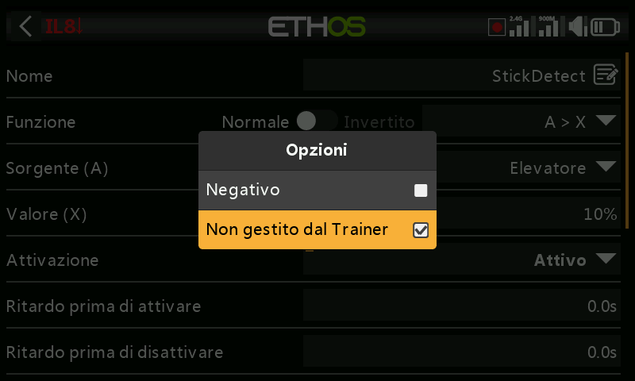

# Interruttori logici

Gli interruttori logici sono interruttori *virtuali* programmati dall'utente:
non sono comandi fisici, ma possono essere impiegati ovunque sia utilizzabile
un interruttore fisico, come innesco di una funzione. Ciascuno valuta la
condizione configurata rispetto ai propri ingressi (altri interruttori, valori
di telemetria, valori dei mix, valori dei timer, canali gyro/trainer e altro
ancora) per assumere lo stato Vero o Falso. Ne sono supportati fino a 100;
per impostazione predefinita non ne esiste nessuno. Se ne aggiunge uno con
**+**; l'etichetta di menu di un interruttore definito appare verde quando è
Vero, rossa quando è Falso. Toccando un interruttore esistente si accede a
**Edit**/**Move**/**Copy-paste**/**Clone**/**Delete**.

## Funzione

Ogni funzione supporta un'uscita normale o invertita.

- **A ~ X** — vero quando la sorgente `A` è *approssimativamente* uguale
  (entro circa il 10%) a un valore fisso `X`. In genere preferibile
  all'uguaglianza esatta —

  

  — poiché, con `A = X`, una lettura di telemetria che oscilla, per esempio,
  tra 8,5 V e 8,35 V attorno a un obiettivo di 8,4 V potrebbe semplicemente
  non assumere mai esattamente il valore 8,4 V, e quindi l'interruttore non
  scatterebbe mai.
- **A = X** — vero solo quando `A` è esattamente uguale a `X`.
- **A > X** / **A < X** — vero quando `A` è maggiore/minore di `X`.
- **|A| > X** / **|A| < X** — come sopra, ma confrontando il valore assoluto
  di `A` (segno ignorato).
- **Δ > X** — vero quando la variazione di `A` (delta) nell'arco del
  **Check interval** raggiunge almeno `X`. Un intervallo pari a `---`
  indica una finestra temporale infinita.

  
  

- **|Δ| > X** — come sopra, utilizzando il valore assoluto della variazione.
- **Range** — vero quando `A` rientra in un intervallo specificato.

  

- **AND** — vero solo se tutte le sorgenti elencate (Value 1…N) sono vere.

  

- **OR** — vero se almeno una delle sorgenti elencate è vera.

  

- **XOR** (OR esclusivo) — vero se è vera *esattamente una* delle sorgenti
  elencate.

  

- **Timer generator** — commuta liberamente e in modo continuo tra acceso e
  spento: attivo per **Duration active**, inattivo per **Duration inactive**.

  

- **Sticky** — un latch (flip-flop SR); vedere [più avanti](#sticky).
- **Edge** — un impulso momentaneo; vedere [più avanti](#edge).

### Sticky

Si aggancia allo stato **Vero** non appena viene soddisfatta la condizione
**Trigger ON** e vi rimane finché non viene soddisfatta la condizione
**Trigger OFF** — il tutto subordinato, facoltativamente, alla
**Active condition** (finché questa è Falsa, l'uscita è mantenuta Falsa in
ogni caso; il latch interno di Sticky continua a essere valutato in
background e viene nuovamente riportato in uscita non appena la Active
condition torna Vera, nel rispetto dei ritardi impostati).

Dalla versione Ethos 1.6.2, entrambi i trigger accettano un modificatore
**Edge** (pressione prolungata di `ENT` sulla condizione di trigger, quindi
selezione di Edge — indicato dal prefisso `†`) per un controllo molto più
fine:

- **Trigger ON `SA` (nessun ritardo)** — si aggancia a Vero nell'istante in
  cui SA passa a livello alto.
- **Trigger ON `SA` (ritardo = 1 s)** — si aggancia a Vero 1 s dopo che SA è
  passato a livello alto, *a condizione* che SA sia ancora alto al termine di
  quel secondo.
- **Trigger ON `†SA` (ritardo = 1 s)** — si aggancia da Vero a Falso 1 s dopo
  che SA è passato a livello alto, **indipendentemente** dal fatto che SA sia
  ancora alto in quel momento (il fronte si è già verificato; il ritardo si
  limita a temporizzare l'esito).

Trigger OFF si comporta allo stesso modo, in senso inverso. I ritardi vengono
applicati **dopo** la Active condition: una variazione della Active condition
fa quindi ripartire il conteggio del ritardo prima che il valore agganciato
raggiunga nuovamente l'uscita. Il passaggio simultaneo di entrambi i trigger
da Falso a Vero **inverte** una volta l'uscita dello Sticky. Vedere anche
[Parametri comuni](#shared-parameters) più avanti.

### Edge

Un impulso momentaneo: Vero per la **Duration** impostata, una volta
soddisfatta la relativa condizione di trigger. **During** è una coppia
`[t1:t2]` che ne determina esattamente il momento:

- **Fronte di salita, During = 0.0s** — scatta nell'istante in cui Trigger ON
  passa da Falso a Vero.

  
  

- **Fronte di salita, During ≥ 0.0s (ad es. 5.0s)** — scatta 5 s dopo che
  Trigger ON è diventato Vero, ignorando eventuali "picchi" più brevi
  all'interno di quella finestra di 5 s.

  
  

- **Fronte di discesa, During = 0.0s** — scatta nell'istante in cui Trigger ON
  passa da Vero a Falso.
- **Fronte di discesa, During ≥ 0.0s (ad es. 3.0s)** — scatta alla transizione
  da Vero a Falso, ma solo se lo stato era rimasto Vero per almeno 3 s.
- **Impulso (t1 e t2 entrambi impostati)** — scatta solo se Trigger ON compie
  la sequenza Falso→Vero→Falso all'interno di quella finestra (ad es. tra 2 s
  e 5 s dopo).

## Parametri comuni {: #shared-parameters }

- **Active condition** — condiziona l'uscita dell'interruttore nello stesso
  modo descritto sopra per Sticky. Opzioni: Always on, posizioni di
  interruttore/interruttore funzione/interruttore logico/trim, Telemetry,
  Flight modes oppure un evento di sistema (Throttle hold, Throttle cut,
  Throttle active, Telemetry active, RSSI low, Trainer active, Flight reset).
- **Delay before active** / **Delay before inactive** — per quanto tempo la
  condizione deve rimanere Vera (o Falsa) prima che l'uscita la segua, fino a
  60 s. Non pertinente per Timer generator o Edge. (Vedere
  [Guida pratica: avviso di capacità della batteria](../how-to/battery-capacity-warning.md)
  per un ritardo utilizzato per filtrare una caduta di tensione.)
- **Confirmation before active** / **inactive** — richiede una conferma
  dell'utente prima che lo stato cambi effettivamente (con un'opzione di
  annullamento, per i casi in cui l'interruttore scatta troppo spesso per
  risultare utile) — comodo per subordinare un'azione rischiosa, ad esempio
  per confermare lo spegnimento a distanza di un veicolo terrestre.

  
  

- **Min Duration** — una volta diventato Vero, rimane tale almeno per questo
  tempo. Lasciando `---`, l'uscita può risultare Vera per un solo ciclo del
  mixer: un tempo troppo breve anche solo per vedere la riga diventare in
  grassetto nell'interfaccia.
- **Max Duration** — una volta diventato Vero, torna automaticamente Falso
  dopo questo tempo, se ancora attivo. Entrambe le durate arrivano fino a 60 s.
- **Comment** — testo libero, mostrato ovunque questo interruttore venga
  aggiunto a un widget di valore, per documentarne lo scopo.

## Utilizzo con la telemetria

Un evento di sistema **Telemetry active** (o un interruttore la cui sorgente è
un sensore di telemetria, attivo solo mentre tale sensore trasmette dati)
copre le condizioni del tipo "la telemetria è attualmente ricevuta".

!!! warning
    Un [mix](mixes.md) condizionato da un interruttore logico basato sulla
    telemetria necessita di una **seconda** azione di mix che utilizzi lo
    stesso interruttore **invertito**, in modo che il mix disponga comunque
    di un valore valido in caso di perdita della telemetria: si ricordi che
    un mix inattivo produce in uscita il valore neutro (0% / 1500 µs, ovvero
    **metà gas** su un canale del gas). In alternativa, si può usare
    un'azione **Offset**, che dispone già di valori attivo/inattivo distinti
    — ad esempio la sorgente **0** (il valore speciale) con l'offset regolato
    in modo che il mix valga +100% mentre `LS3` è attivo e −100% mentre è
    inattivo copre entrambi i casi con un'unica azione.

## Confronto tra sorgenti

Normalmente una sorgente viene confrontata con un valore fisso, ma è possibile
confrontare direttamente due sorgenti dello *stesso* tipo — ad esempio due
timer, due tensioni o due sensori di RPM.

## Ignorare l'ingresso trainer dallo slave

Le [opzioni](../getting-started/user-interface-and-navigation.md#choosing-a-source)
di una sorgente consentono di escludere l'ingresso trainer proveniente da una
radio allievo (slave) collegata — soluzione tipicamente impiegata su un
interruttore logico che sorveglia il movimento degli stick del **master**
(ad esempio per intervenire immediatamente in caso di problemi), evitando che
anche i comandi dell'allievo lo facciano scattare. Spesso viene abbinata a un
interruttore trainer che condiziona la Active condition del master stesso.
