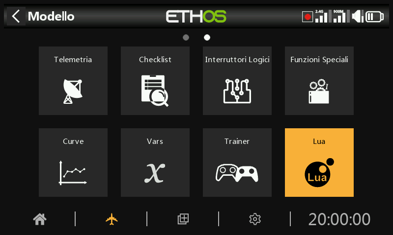
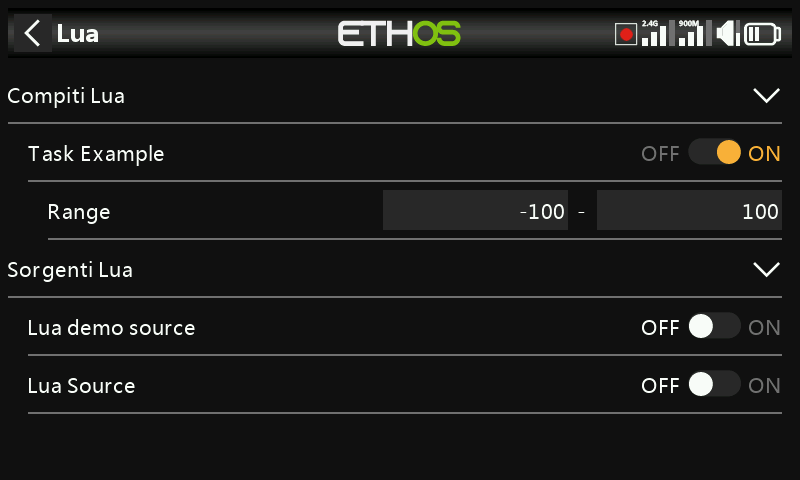

# Lua

Il menu Lua appare solo se l'utente ha installato uno script sorgente o di attività Lua nella cartella *scripts (*/ sulla scheda SD o eMMC.

Utilizzando gli script Lua è possibile creare sorgenti personalizzate, come ad esempio sensori personalizzati, o creare attività che eseguono azioni personalizzate, come ad esempio la registrazione dei dati in un file al termine del volo.

Una volta installati, i sorgenti o le attività Lua sono disponibili globalmente per ogni modello. Questo menu può quindi essere utilizzato per attivare e configurare selettivamente i rispettivi script sorgente e attività per il modello attivo.

Ci sono alcuni esempi di script sorgente e attività Lua nella pagina web ETHOS-Feedback-Community, vedi /lua/examples/task e /lua/examples/source.

## Compiti Lua

Per ogni attività:

Abilitazione dell'attività

Vengono elencati tutti i compiti disponibili. Ogni attività può essere abilitata per il modello attivo.

Configurazione dell'attività

Se un'attività è abilitata, viene mostrato il modulo di configurazione Lua associato per consentire all'attività di essere configurata per il modello attivo. L'attività avrà una funzione di lettura e una di scrittura per consentire all'utente di salvare tutti i parametri di configurazione.

Nell'esempio precedente, l'attività ha un intervallo configurabile che può essere personalizzato per ogni modello che utilizza l'attività.

## ***Sorgenti*** Lua

Per ogni fonte:

Abilitazione ***fonte***

Vengono elencate tutte le fonti Lua disponibili. Ogni sorgente può essere abilitata per il modello attivo.

Configurazione della ***fonte***

Se una sorgente è abilitata, viene mostrato il modulo di configurazione Lua associato per consentire alla sorgente di essere configurata per il modello attivo (come Range nell'esempio della schermata dell’attività sopra). La sorgente avrà una funzione di lettura e una di scrittura per consentire all'utente di salvare tutti i parametri di configurazione.

## Funzioni di script Lua

Le funzioni Lua applicabili sono:

system.registerSource()

system.registerTask()

Per maggiori dettagli, consulta la [Guida di riferimento Ethos Lua](https://www.frsky-rc.com/wp-content/uploads/Downloads/EthosSuite/LuaDoc/index.html).

## Installazione

I sorgenti e i task Lua sono installati nella cartella "scripts" sulla scheda SD o eMMC. Consulta la sezione [scripts ](../system-setup/file-manager.md)in Sistema / File manager.
