# Mixer

La funzione Mix costituisce il cuore della radio. È qui che vengono configurate le funzioni di controllo del modello. La sezione Mixes permette di Mixre o combinare a piacimento una qualsiasi delle numerose sorgenti di ingresso e di mapparla su uno qualsiasi dei canali di uscita.

## Panoramica del diagramma di flusso di alto livello

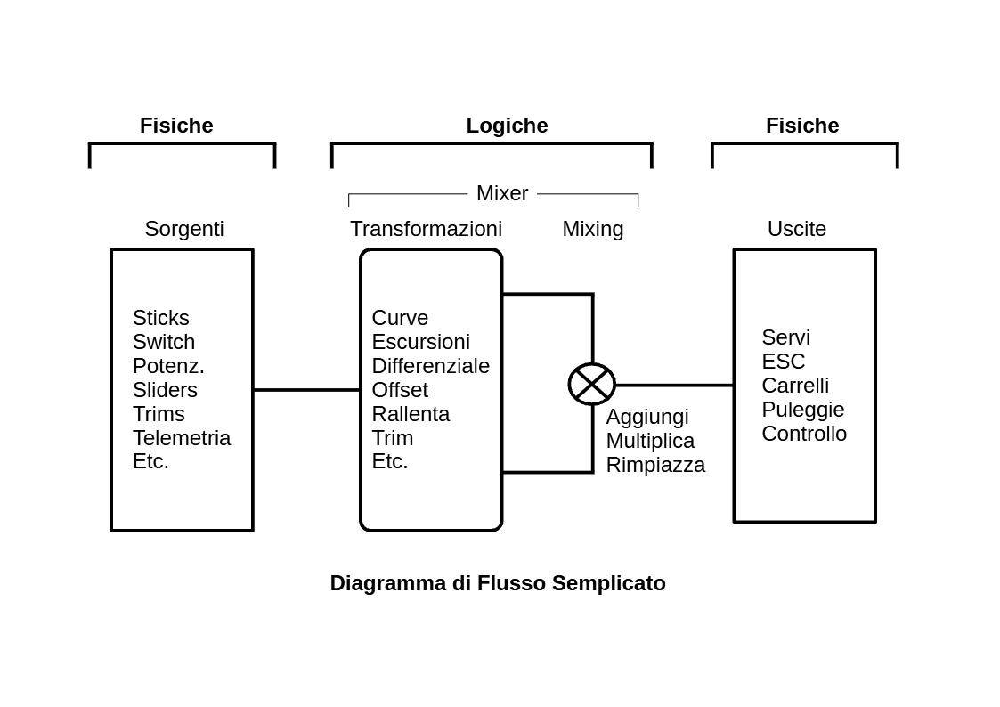

Il diagramma di flusso parte dai controlli hardware, passa attraverso la logica di programmazione nei Mix e finisce per essere adattato alle caratteristiche meccaniche del modello nella sezione Output. Questo approccio passa da un modello fisico, a un modello logico e poi di nuovo a un modello fisico.

Nella sezione Mix impostiamo l'azione dei diversi controlli. Possiamo trasformare gli ingressi utilizzando escursioni, offset, curve, differenziali o lenti, per poi Mixarli o combinarli come richiesto.

La sezione Output permette di adattare queste uscite logiche pure alle caratteristiche meccaniche del modello. È l'interfaccia tra la "logica" del setup e il mondo reale con servi, collegamenti e superfici di controllo, nonché motori e trasduttori.

Ethos ha a disposizione 100 canali di mix per la programmazione del tuo modello. Normalmente i canali con il numero più basso vengono assegnati ai servi, perché i numeri dei canali corrispondono direttamente ai canali del ricevitore. Il modulo RF (radiofrequenza) interno ha a disposizione fino a 24 canali di uscita.

I canali di mix superiori possono essere utilizzati come "canali virtuali" nella programmazione più avanzata, oppure come canali reali utilizzando più moduli RF (interno + esterno) e SBus. L'ordine dei canali è una questione di preferenze personali o di convenzioni, oppure può essere dettato dal ricevitore. Nel nostro esempio utilizzeremo il canale AETR (Aileron, Elevator, Throttle, Rudder).

La sorgente o l'ingresso di un mix può essere scelto tra gli ingressi analogici come gli stick, i potenziometri e i cursori; gli interruttori a levetta o i pulsanti; qualsiasi interruttore logico definito; gli interruttori di trim; qualsiasi canale definito; un asse del giroscopio; un canale trainer; un timer; un sensore di telemetria; un valore di sistema come la tensione della radio principale o la tensione della batteria dell'RTC; oppure un valore "speciale" come "minimo", "massimo" o 0.

Questa sezione permette anche di condizionare la sorgente definendo escursioni/rate e offset e aggiungendo curve (ad esempio Expo). Il mix può essere soggetto a un interruttore e/o a fase di volo e può essere aggiunta una funzione di ritardo. (Nota: i ritardi sono implementati negli interruttori logici perché sono legati agli interruttori).

L'editor di mix include informazioni di aiuto contestuali che cambiano dinamicamente quando si toccano le opzioni di mix. La prima riga mostra il tipo di mix utilizzato, ad esempio "Alettoni", "Elevatori" o "Mix libero" ecc.

È possibile definire fino a 120 Mixer. È possibile aggiungere una nuova Mix toccando il simbolo "+" accanto alle intestazioni delle colonne nella schermata principale delle Mixer.

Se il tuo modello è stato creato utilizzando una delle procedure guidate di creazione del modello nella funzione "Selezione del modello" del menu Sistema, le Mixer di base saranno visualizzate quando toccherai "Mixer". Viene visualizzato un grafico per la Mix evidenziata e sotto la fase di volo corrente e la condizione attiva vengono scritte in grassetto se sono attive.

Inoltre, è possibile aggiungere i mix predefiniti più comuni e i mix liberi configurabili dall'utente. Nella schermata principale dei mix (vedi sopra) è possibile aggiungere nuovi mix toccando il simbolo "+" accanto alle intestazioni delle colonne. C'è un mix per ogni controllo e un display grafico per quel mix.

Per modificare un mix, tocca il mix e tocca di nuovo per visualizzare il menu a comparsa, quindi seleziona Modifica. Altre opzioni sono: aggiungere un nuovo mix, passare alla vista di raggruppamento "[Visualizza per canale](mixes.md)" (descritta in una sezione più in basso), spostare il mix in alto o in basso, clonare un mix o eliminare un mix.

Tieni presente che i mix inattivi sono visualizzati in grigio per facilitare il debug.

La radio chiede conferma prima di cancellare un mix, in caso di selezione involontaria.

## Mixer di alettoni, elevatore e timone

Utilizzeremo gli Alettoni come esempio, ma le Mixer di Elevatore e Timone sono molto simili.

Nome

Il nome degli alettoni è stato inserito come nome predefinito, ma può essere modificato.

Condizione attiva

La condizione attiva predefinita è "Sempre acceso", appropriata per gli alettoni. Può essere resa condizionale scegliendo tra posizioni di interruttori o pulsanti, interruttori di funzione, fase di volo, interruttori logici, un evento di sistema come il taglio o il mantenimento del throttle o le posizioni di trim.

Fasi di volo

Se sono state definite delle Fasi di volo nella sezione "Fasi di volo", questo parametro diventa disponibile. Il mix può quindi essere condizionato a una o più fase di volo. Clicca su "Modifica" e seleziona le caselle relative alle fase di volo in cui questo mix deve essere attivo.

Curva

L'opzione curva standard è Expo, che per impostazione predefinita ha un valore pari a 0, il che significa che la risposta è lineare (cioè non c'è curva). Un valore positivo ammorbidisce la risposta intorno allo 0, mentre un valore negativo la rende più netta. L'esempio precedente mostra un Expo del 30%.

Si può anche selezionare una qualsiasi curva definita in precedenza. L'uscita del mix sarà quindi modificata da questa curva. In alternativa, è possibile aggiungere una nuova curva.

Puoi specificare fino a 6 curve, ciascuna con una condizione. Se più di una condizione è vera, prevale la curva più alta nell'elenco. Nota che la curva viene applicata prima del escursione.

escursione / rates

È possibile definire più escursioni o rates, soggetti alla posizione di un interruttore, a un interruttore di funzione, a un interruttore logico, alla posizione del trim o alla fase di volo. Per ogni escursione/rate viene aggiunta una riga. Il escursione/rate predefinito (cioè la prima riga del escursione/rate) è attivo quando nessuno degli altri rates è attivo. A sinistra dei rates definiti c'è una piccola croce all'interno di una freccia che può essere utilizzata per eliminare una riga di escursione/rate. Nell'esempio precedente sono state impostate tre rates sullo switch SB.

Differenziale

Il differenziale prevede una corsa maggiore in una direzione. Ad esempio, per gli alettoni si utilizza una corsa maggiore verso l'alto rispetto a quella verso il basso per ridurre l'imbardata e migliorare le caratteristiche di virata/maneggevolezza. Un valore positivo comporta una minore corsa degli alettoni verso il basso, come si può vedere nel grafico qui sopra. (Predefinito = 0. Intervallo da -100 a +100)

In questo esempio, premendo a lungo il tasto Invio si apre la finestra di dialogo per selezionare una sorgente invece del valore fisso predefinito; in questo caso è stato selezionato "Slider destro". Il grafico a destra mostra che il cursore è al 50%, quindi questo sarà il escursione per i rates degli alettoni, ma regolabile in volo.

Il differenziale sull'elevatore può essere utilizzato per gli aerei che desiderano un elevatore più basso che alto, in genere in situazioni di gara.

Nota che il parametro Differenziale è presente solo se hai più di un canale di uscita.

Il mix Timoni avrà il parametro Differenziale solo se il modello è configurato per la coda a V.

Trim

Offre la possibilità di scollegare il trim associato a un mix senza disabilitarlo, in modo da poterlo utilizzare altrove.

Numero di canali

Il conteggio dei canali definisce il numero di canali di uscita assegnati. In questo esempio sono stati configurati due alettoni nella creazione guidata del modello.

Uscita Sinistra, Uscita Destra

La procedura guidata per la creazione del modello ha assegnato l'uscita sinistra al canale CH1 (alettone sinistro), poiché l'ordine predefinito dei canali nel menu Sistema – Comandi era impostato su AETR (ovvero alettone, elevatore, acceleratore, timone) e l'opzione «Primi quattro canali fissi» era attiva. La procedura guidata ha quindi assegnato l'Output Right al CH5 (Aileron Right).

L'impostazione predefinita può essere modificata se necessario, ma occorre prestare attenzione per valutare eventuali altri impatti derivanti da una modifica in questo punto. Se l'opzione “First four channels fixed” è disattivata, la procedura guidata raggruppa i canali simili, ovvero AAETR invece di AETRA.

Nota che \[ENT\_long\] sul canale di uscita selezionato ti porterà direttamente a quella pagina nelle Uscite.

Nota anche che il grafico è colorato in base alle uscite. Nell'esempio precedente l'Output1 è rosso e corrisponde alla curva rossa del grafico, mentre l'Output2 è arancione e corrisponde alla curva arancione del grafico.

## Mix Gas/Throttle

Il mix Throttle contiene parametri per la gestione del taglio e del mantenimento del Gas - Throttle. Il taglio del Gas - Throttle è dotato di un interblocco di sicurezza dell'ingresso del Gas - Throttle, mentre il mantenimento del Gas - Throttle ha una semplice funzione on/off.

Ingresso

Qui è possibile selezionare la fonte per il mix del throttle. Il valore predefinito è lo stick del throttle, ma può essere modificato in analogico, interruttore, trim, canale, asse del giroscopio, canale del trainer, timer o valore speciale.

Premi a lungo \[ENT\] negli Input per attivare le opzioni di throttle/gas:

Opzioni di Input

Le due opzioni sopra indicate sono comunemente utilizzate nei modelli di superficie in cui il trigger aziona sia l'acceleratore (metà positiva) che il freno (metà negativa).

Fai riferimento alla sezione opzioni sotto [Opzioni sorgente](../getting-started/user-interface-and-navigation.md).

Trim

Permette di modificare il comportamento del trim del Gas - Throttle rispetto a quello predefinito.

Può essere modificato per consentire all'uscita del throttle di essere trimmata dagli interruttori dei trim del timone, dell'elevatore, del throttle e dell'alettone. L'X20 Pro/R/RS e l'X18 permettono anche di assegnare i trim T5 o T6.

Trim in posizione bassa

Nei motori a scoppio e a gas, il "trim in posizione bassa" viene utilizzato per regolare il regime del minimo. Il regime del minimo può variare a seconda delle condizioni atmosferiche e così via, quindi è importante avere un modo per regolare il regime del minimo senza influenzare la posizione di accelerazione completa.

Se la funzione "trim in posizione bassa" è attivata, il canale del Gas - Throttle passa a una posizione di minimo di -75% quando lo stick del Gas - Throttle è in posizione bassa (fai riferimento alla barra dei canali visualizzata in basso nella schermata precedente). La leva del trim del Gas - Throttle può essere utilizzata per regolare il minimo tra -100% e -50%. Il Throttle Cut può essere configurato per spegnere il motore con un interruttore.

Taglio del Gas – Throttle Cut

Il taglio del Gas - Throttle è dotato di un interblocco di sicurezza dell'ingresso del Gas - Throttle che assicura che il motore o il Gas - Throttle si avviino solo a partire da una posizione bassa del Gas - Throttle.

Se combinato con il "trim in posizione bassa" (vedi sopra), può essere utilizzato per gestire le impostazioni del Gas - Throttle e del minimo su modelli con motore a incandescenza o a gas.

Condizione attiva

La condizione attiva può essere scelta tra posizioni di interruttori o pulsanti, interruttori di funzione, fase di volo, interruttori logici o posizioni di trim.

Sticky / appicicoso

Quando Sticky è in posizione ON, l'uscita del canale del Gas - Throttle verrà commutata sul valore di uscita al minimo (default -100%) non appena il taglio del Gas - Throttle diventa attivo.

Quando Sticky è in posizione OFF, una volta che il taglio del Gas - Throttle diventa attivo, l'uscita del canale del Gas - Throttle verrà commutata al "valore di uscita al minimo" (predefinito -100%) solo quando lo stick del Gas - Throttle scende al di sotto del valore di attivazione (predefinito -85%).

Valore di attivazione

Il valore di attivazione determina il valore al di sotto del quale l'ingresso del Gas - Throttle attiva l'interblocco di sicurezza del Gas - Throttle.

Valore di uscita inattivo

Per sicurezza, una volta che il taglio del Gas - Throttle diventa inattivo, l'uscita del canale del Gas - Throttle lascerà il "valore di uscita al minimo" solo se l'ingresso del Gas - Throttle è stato inferiore al valore di attivazione. In questo modo si garantisce che il motore si avvii solo a partire da un valore basso dell'ingresso del Gas – Throttle.

Si noti che Ethos si avvia in modo sicuro all'accensione, anche se la condizione “Throttle cut” non è attiva e l'input dell'acceleratore non è al minimo. È necessario spostare l'input dell'acceleratore al di sotto del valore di attivazione prima che il canale dell'acceleratore si armi e consentire al motore di avviarsi da un valore di input dell'acceleratore basso.

Mantenimento del Gas – Throttle Hold

Il mantenimento del Gas - Throttle fornisce una semplice funzione di mantenimento del Gas - Throttle senza l'interblocco di sicurezza dell'ingresso del Gas - Throttle di cui sopra.

Per motivi di sicurezza, con i motori elettrici si consiglia vivamente di utilizzare l'opzione “Throttle cut” con il relativo interblocco di sicurezza invece dell'opzione “Throttle hold”.

Condizione attiva

La condizione attiva può essere scelta tra posizioni di interruttori o pulsanti, interruttori di funzione, fase di volo, interruttori logici o posizioni di trim.

Valore

Una volta attivata la funzione di mantenimento del Gas - Throttle, il valore impostato verrà emesso sul canale del Gas - Throttle. Nei modelli alimentati elettricamente, il valore di mantenimento del Gas - Throttle è normalmente (-100%).

Il valore di mantenimento del Gas - Throttle può anche provenire da una fonte.

Fasi di volo

Se sono state definite delle Fasi di volo nella sezione "Fasi di volo", questo parametro diventa disponibile. Il mix può quindi essere condizionato a una o più Fasi di volo.  Clicca su "Modifica" e seleziona le caselle relative alle Fasi di volo in cui questo mix deve essere attivo.

Curva

È possibile definire una curva per modificare l'uscita del canale del Gas - Throttle. Si può anche selezionare una curva precedentemente definita. Un'applicazione tipica consiste nel definire una curva di banda morta in modo che l'uscita rimanga a -100 finché non si sposta leggermente la leva dell'acceleratore. In questo modo si risolvono eventuali problemi di calibrazione degli sticks.

Conteggio dei canali

Il conteggio dei canali definisce il numero di canali di uscita assegnati, di default 1 per il Throttle.

## Opzione di visualizzazione per canale (raggruppamento dei mix)

Con i mix complessi può essere difficile vedere l'effetto di altri mix su un determinato canale. L'opzione "Visualizza per canale" è particolarmente utile per il debug dei tuoi mix, perché tutti i mix che influenzano il canale selezionato vengono raggruppati.

In questo esempio prenderemo in considerazione il canale Elevators. Dalla "Tabella dei mix" qui sopra possiamo vedere che l'Elevator è sul canale 2 e che ci sono altri mix con il canale 2 come uscita.

Per vedere l'effetto di tutti i mix sul canale Elevator, tocca il mix Elevators e seleziona "Visualizza per canale" dalla finestra di dialogo a comparsa.

L'esempio riportato sopra mostra che ci sono due mix che influiscono su questo canale: il mix Elevators stesso (controllato dallo stick Elevator) e un mix Butterfly che aggiunge la compensazione dell'Elevator quando i flap sono aperti. Osservando la linea di riepilogo CH2 Elevators (evidenziata), possiamo vedere che l'uscita del canale degli elevatori è al 12%. I sub mix mostrano che attualmente lo stick dell'elevatore è a -3%, ma il mix Butterfly aggiunge +15% al canale. L'azionamento del comando dei Flap causerà la modifica di questo mix di compensazione.

Con questo layout "Vista per canale" è possibile vedere facilmente il contributo dei vari mix che influiscono su un canale, perché il valore di ogni mix è mostrato sia in formato grafico che numerico.

Gestione della visualizzazione "Vista per canale

a) Passare da un canale all'altro in "Visualizza per canale".

Toccando la linea di riepilogo (evidenziata in alto), i mix secondari del canale verranno eliminati.

Come si può vedere qui sopra, i mix secondari per CH2 Elevators sono stati eliminati. Ora puoi scorrere verso l'alto o verso il basso e selezionare un altro canale da espandere per mostrare i mix che contribuiscono a quel canale.

b) ***Tornare alla "Vista tabella".***

Cliccando invece su un mix secondario, ad esempio la riga evidenziata sopra, si aprirà una finestra di dialogo a comparsa che permetterà di modificare il mix, di passare alla visualizzazione Tabella o di eliminare il mix.

Selezionando Visualizzazione tabella, tornerai alla visualizzazione normale dei mix in formato tabella. In alternativa puoi modificare il mix evidenziato o eliminarlo.

Siamo tornati ai mix di Table View.

## Libreria Mixer

Libreria aerei

L'elenco delle combinazioni predefinite disponibili nella libreria dell'aeroplano è riportato sopra.  
Si prega di notare che alcune combinazioni appaiono solo se nel modello sono presenti i canali richiesti. Ad esempio, le combinazioni con i flap come target vengono popolate solo se sono definite configurazioni valide dei flap.

Aggiungi Mix

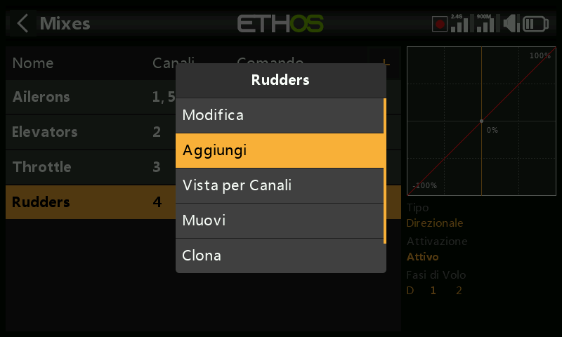

Nella schermata principale dei mix (vedi sopra) è possibile aggiungere nuovi mix toccando il simbolo “+” accanto alle intestazioni delle colonne.

Seleziona un mix dall'elenco dei mix predefiniti disponibili nella libreria dei mix (vedi la schermata della libreria in alto). In questo esempio viene utilizzato il Free Mix.

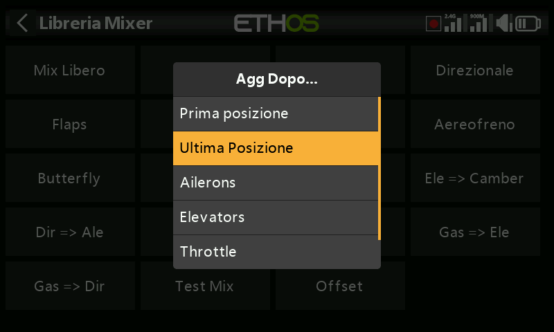

Successivamente è necessario scegliere la posizione del nuovo mix, in questo esempio aggiunto dopo "Ultima posizione".

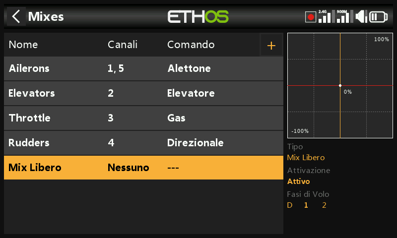

Normalmente il nuovo mix libero si apre per la modifica, ma siamo tornati alla vista dei mix per mostrare che il mix libero è stato aggiunto.

Tocca "Mix libero" per aprire il sottomenu di modifica.

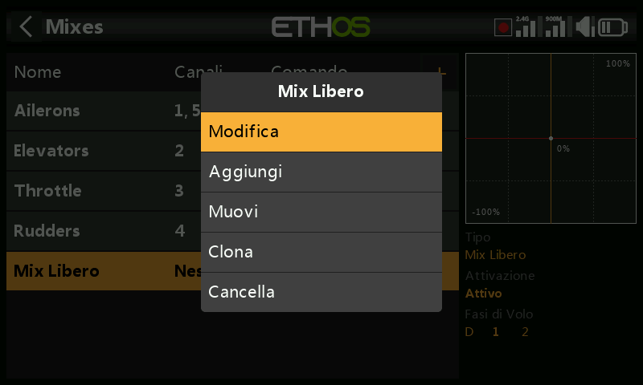

Seleziona Modifica per aprire una nuova schermata che mostra i parametri dettagliati del "Free mix".

Mix Libero

I mix liberi sono i mix generici che fanno tutto. Le Mixer predefinite sono per certi versi più potenti, ma anche più limitate alla loro applicazione specifica. Non tutte le opzioni sono necessariamente disponibili nei mix liberi, ma con essi si può fare qualsiasi cosa, solo che potrebbe essere necessario più di un mix libero per duplicare un singolo mix speciale.

Il grafico a destra mostra l'uscita del mix e l'effetto delle modifiche apportate alle impostazioni.

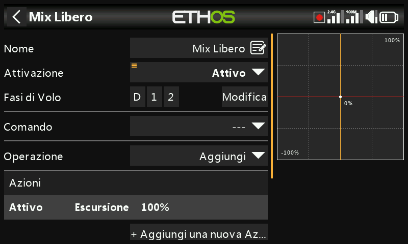

- Nome

È possibile inserire un nome descrittivo per il Free Mix.

- Condizione attiva

La condizione attiva predefinita è "Sempre attivo". Può essere condizionata scegliendo tra posizioni di interruttori o pulsanti, interruttori di funzione, Fasi di volo, interruttori logici, un evento di sistema come il taglio o il mantenimento del Gas - Throttle o le posizioni dei trim.

- Fasi di volo

Se sono state definite delle Fasi di volo nella sezione "Fasi di volo", questo parametro diventa disponibile. Il mix può quindi essere condizionato a una o più Fasi di volo. Clicca su "Modifica" e seleziona le caselle relative alle Fasi di volo in cui questo mix deve essere attivo.

- Fonte

L'input per la miscelazione libera può essere qualsiasi sorgente o anche un valore fisso.

##### Categorie di Fonti (sorgenti)

La sorgente o l'input di questo mix può essere scelto tra le seguenti categorie:

Si prega di notare che le categorie sono ora identificate da uno speciale prefisso iconografico per distinguerle dagli elementi denominati dall'utente negli elenchi di selezione. Una volta selezionato un membro in una categoria, l'icona della categoria verrà anteposta al nome del membro. Si prega di fare riferimento all'esempio Alettone riportato di seguito.

a) ingressi analogici come gli stick, i potenziometri e gli slider

b) gli interruttori o i pulsanti a levetta

b2) Interuttori funzione

c) qualsiasi interruttore logico definito

d) gli interruttori dei trim

e) qualsiasi canale definito

f) una Var (variabile)

g) un asse giroscopico

h) un canale di addestramento

i) un timer

j) un sensore di telemetria

k) un valore di sistema (ad esempio, tensione della radio principale, tensione della batteria RTC, orologio (cioè tempo reale), RAM disponibile, tempo di utilizzo radio)

l) un valore "speciale", cioè minimo, massimo o 0

##### Possibilità di aggiungere una Var mentre si è in Seleziona Sorgente

E’ possibile creare una nuova VAR mentre si è in seleziona categorie(sorgenti).

##### Sorgente come valore fisso

Premendo a lungo il tasto Invio sul parametro Sorgente si aprirà la finestra di dialogo delle opzioni, che consente di convertire l'ingresso mix libero in un valore fisso.

(Sebbene sia semplice, valuta la possibilità di utilizzare invece una variabile con un valore fisso. L'uso delle variabili ti consente di inserire tutti i valori di regolazione principali in un unico menu con nomi significativi. Per ulteriori dettagli, consulta la sezione Variabili (VAR)).

Il valore fisso può essere adesso modificato.

Premendo a lungo sul valore fisso è possibile selezionare Massimo, 0, Minimo o tornare all'utilizzo di una sorgente.

Siamo tornati all'opzione di selezione della fonte.

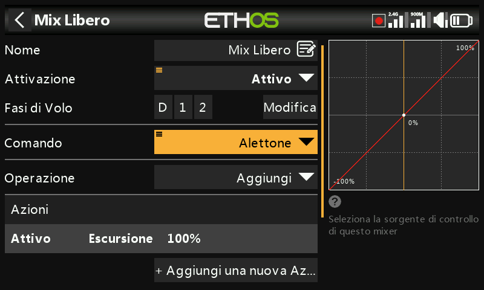

In questo esempio è stato scelto come sorgente lo stick dell'alettone. Nota che l’icona della categoria analogico è stata associata ad “alettone”

- Funzionamento

Il tipo di operazione definisce il modo in cui il mix corrente interagisce con gli altri dello stesso canale. Esistono tre tipi di funzione:

L'uscita di questo mix verrà aggiunta a qualsiasi altro mix sullo stesso canale di uscita. Tieni presente che i mix di aggiunta possono essere in qualsiasi ordine (A+B+C = C+B+A).

L'uscita di questo mix verrà moltiplicata con il risultato di altri mix superiori sullo stesso canale di uscita.

L'uscita di questo mix sostituirà il risultato di qualsiasi altro mix sullo stesso canale di uscita.

Un canale "bloccato" non potrà mai essere modificato da nessun altro mix mentre il mix bloccato è attivo. (Questa è una buona alternativa alla funzione Override di OpenTX).

La combinazione di queste operazioni permette di creare operazioni matematiche complesse.

- Azioni

Il free mix è estremamente flessibile: è possibile definire fino a 50 azioni di mix.

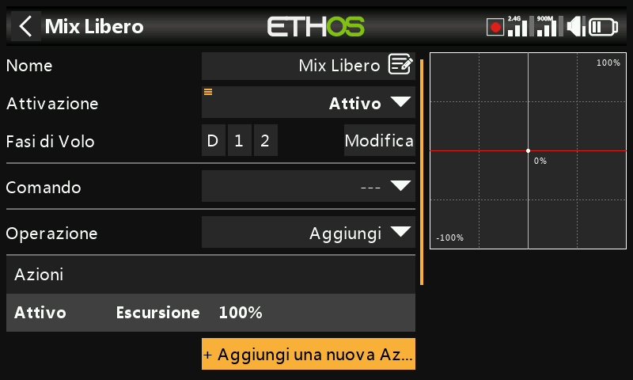

Tocca "+ Aggiungi una nuova azione" per aggiungere un'azione mix gratuita.

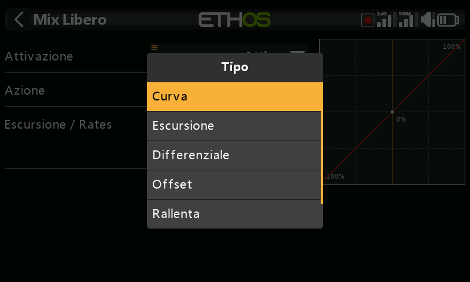

Le azioni disponibili sono:

- Curva
- escursione
- Differenziale 
- Offset
- Lento

Le azioni possono essere combinate per creare, ad esempio, rates multipli con diverse curve di expo, diverse quantità di differenziale e così via.

L'ordine consigliato per le azioni è Lento, Curva, escursione e poi Offset. Questo ordine deve essere rispettato a meno che non ci sia una ragione specifica per utilizzare un ordine diverso.

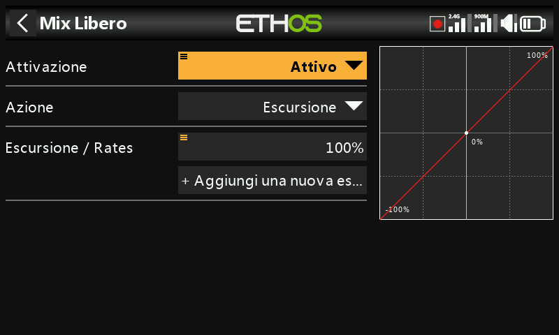

Ogni azione di mix libero può avere una propria "condizione attiva".

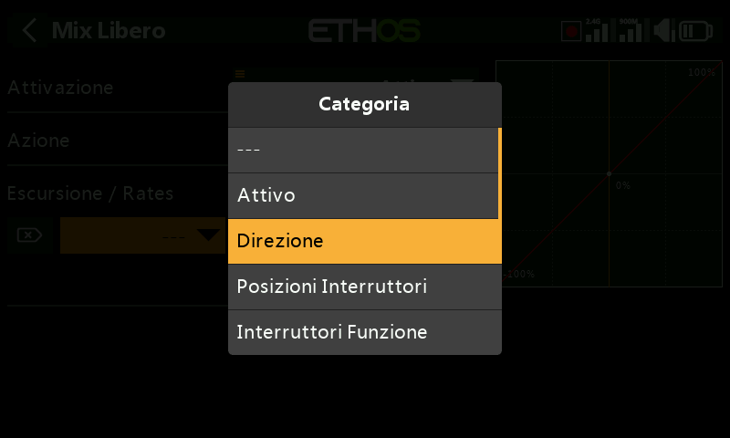

La condizione attiva predefinita è "Sempre acceso". Può essere condizionata scegliendo tra posizioni di interruttori o pulsanti, interruttori di funzione, Fasi di volo, interruttori logici, un evento di sistema come il taglio o il mantenimento del Gas - Throttle o le posizioni dei trim.

Inoltre, nelle condizioni attive per le azioni di Mix libera, è disponibile il vincolo "Direzione".

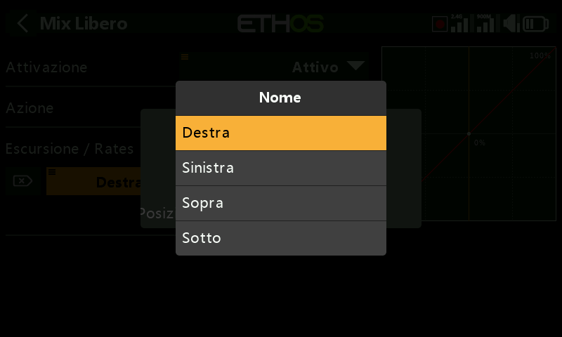

I vincoli di direzione disponibili sono Alto, Basso, Destra e Sinistra.

-

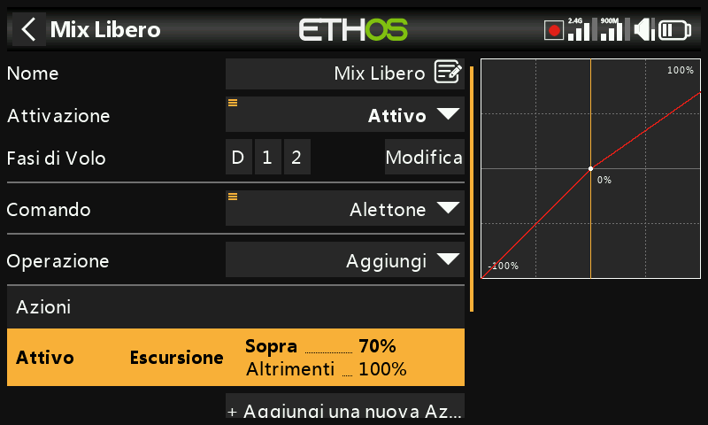

Per i diverse escursioni in alto e in basso (per imitare i precedenti "escursione in alto" e "escursione in basso") le condizioni possono essere impostate su "In alto" e sul valore predefinito "Altrimenti". Vedi anche l'azione escursione qui sotto.

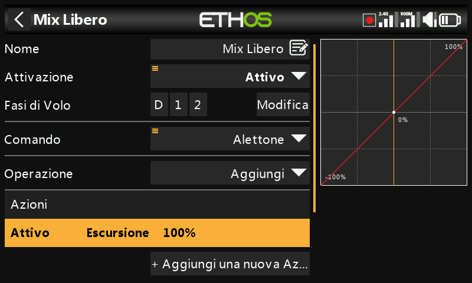

Per impostazione predefinita, il mix libero inizia con un'azione "escursione" del 100% che è "Sempre attiva". Nota: a titolo di esempio, la sorgente è stata impostata su "Alettoni".

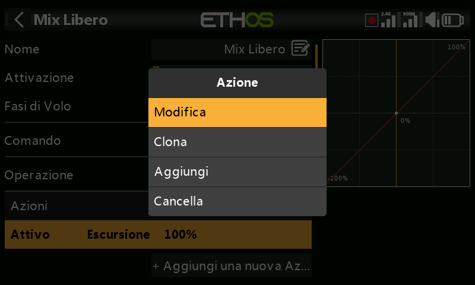

**Importante**: per configurare il escursione del mix libero, tocca la riga del escursione predefinito e seleziona Modifica per apportare modifiche o aggiunte. Selezionando "+Aggiungi una nuova azione" si aggiungerà invece una seconda azione escursione.

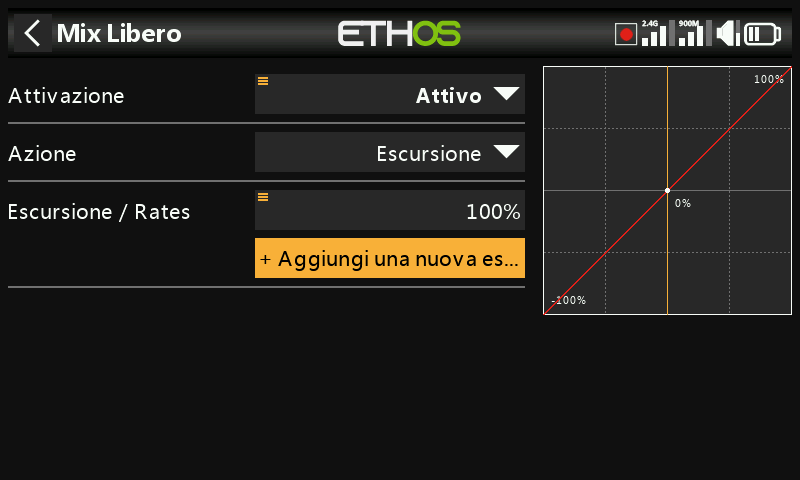

Tocca "Aggiungi un nuovo escursione" per aggiungere altre escursioni. Ad esempio, per creare rates multiple, basta aggiungere altre azioni "escursione" condizionate, ad esempio, da un interruttore a 3 posizioni.

L'esempio sopra riportato mostra che è stato selezionato lo switch SA- per rendere condizionale la nuova escursione

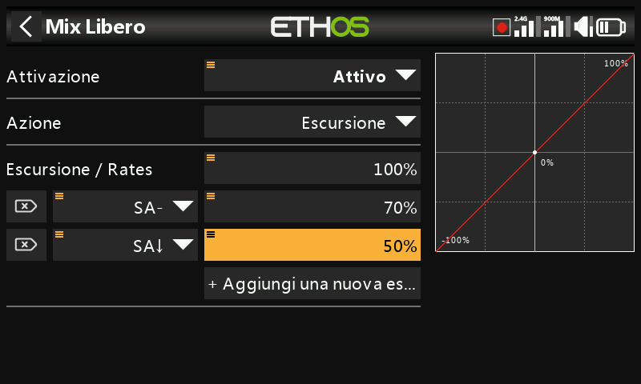

Nell'esempio precedente sono stati aggiunti due escursioni (o rates) supplementari utilizzando l'interruttore SA.

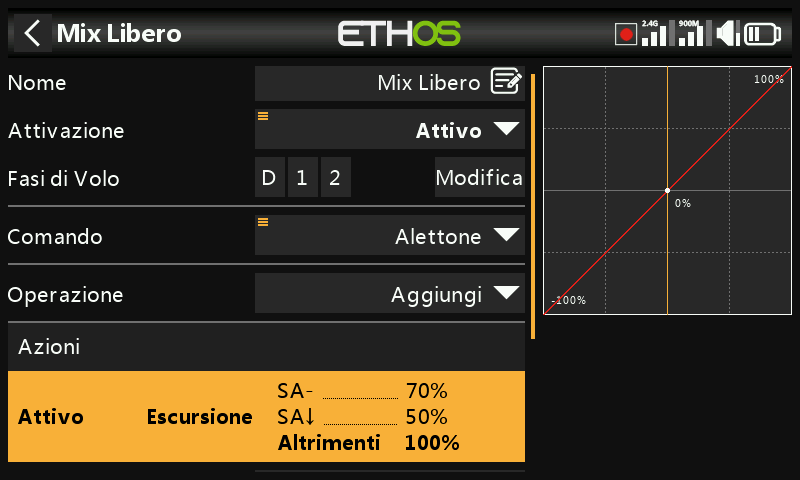

Quando l'interruttore non è in posizione centrale o abbassata, il escursione sarà del 100%.

Per aggiungere le curve al mix, seleziona "Curve" dal menu a discesa delle azioni.

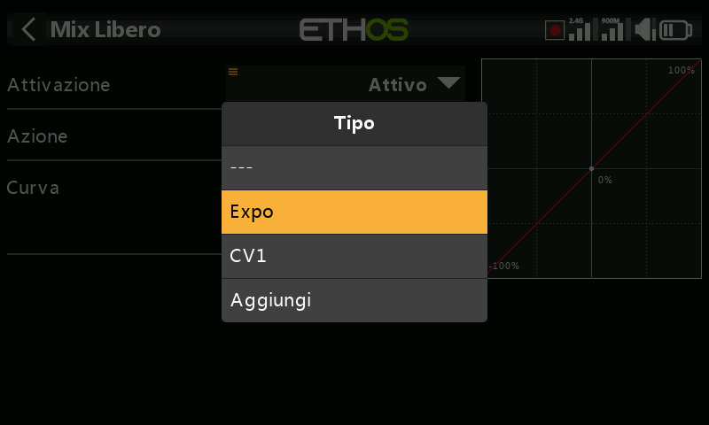

L'opzione curva standard è Expo, che per impostazione predefinita ha un valore pari a 0, il che significa che la risposta è lineare (cioè non c'è curva). Un valore positivo ammorbidisce la risposta intorno allo 0, mentre un valore negativo la rende più netta.

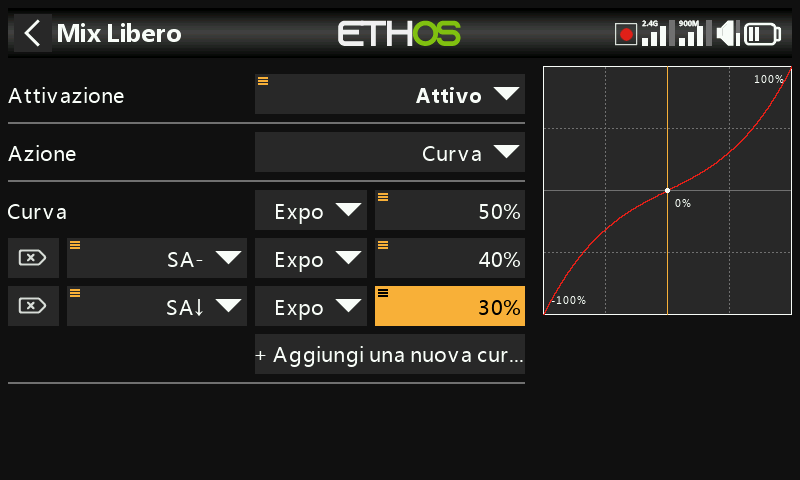

In questo esempio sono stati definiti 3 rates di esposizione per accompagnare i rates di escursione definiti in precedenza.

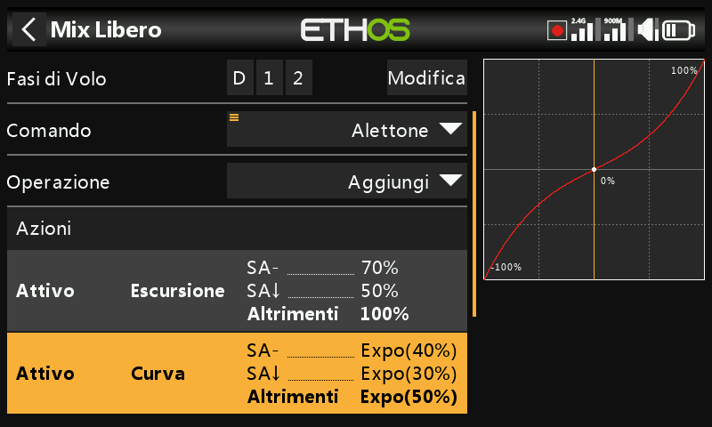

Con l'interruttore SA in posizione centrale, il escursione/rate di escursione è del 70% mentre l'esponenziale è del 40%. Con l'interruttore SA in posizione bassa, il escursione/rate di escursione è del 50% mentre l'expo è del 30%. Con l'interruttore SA in posizione predefinita (su), il escursione/rate di escursione predefinito è del 100% mentre la curva expo predefinita è del 50%.

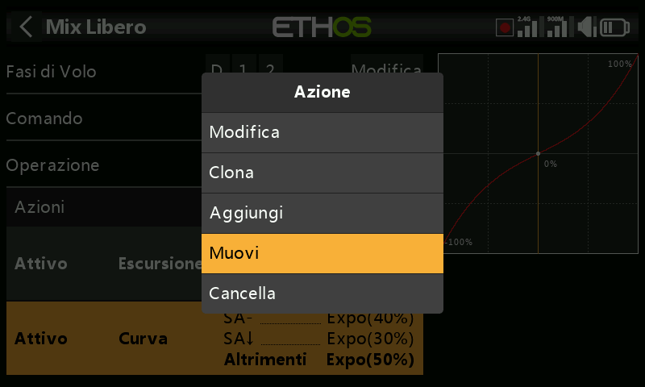

L'ordine delle azioni consigliato è Rallenta, Curva, Escursione, Differenziale, Offset e infine Trim, quindi sposteremo l'azione Curve prima di escursione. Tocca \[ENT\] sull'azione Curve evidenziata, quindi seleziona l'opzione Muovi.

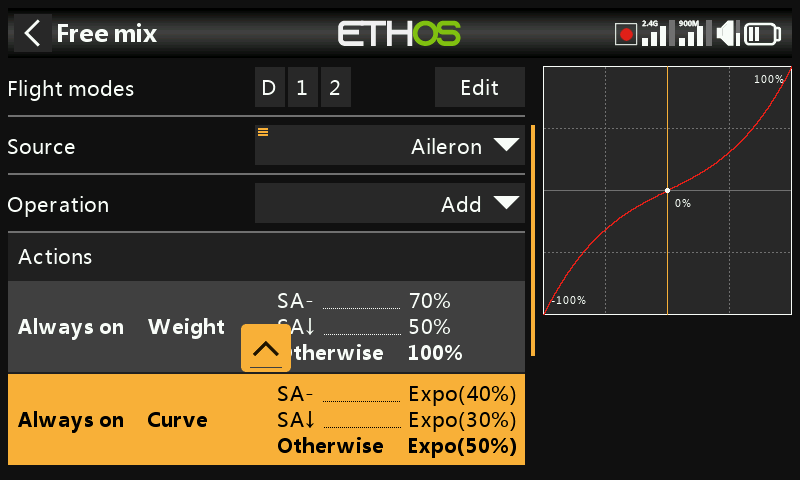

Tocca la freccia verso l'alto evidenziata o utilizza l'encoder rotativo per spostare l'azione della curva al di sopra del escursione.

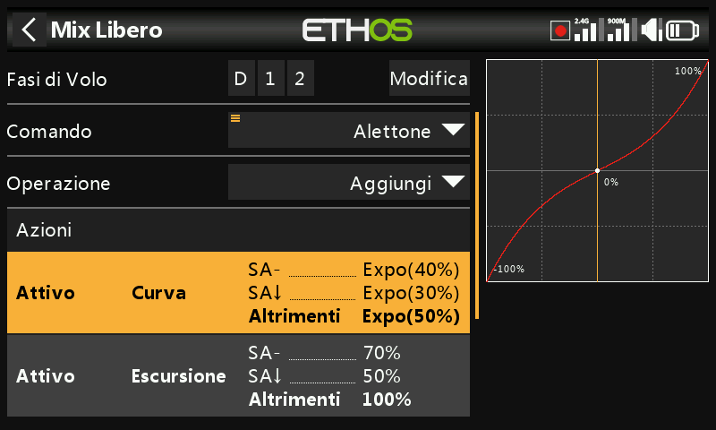

L’azione curva è ora nella prima posizione.

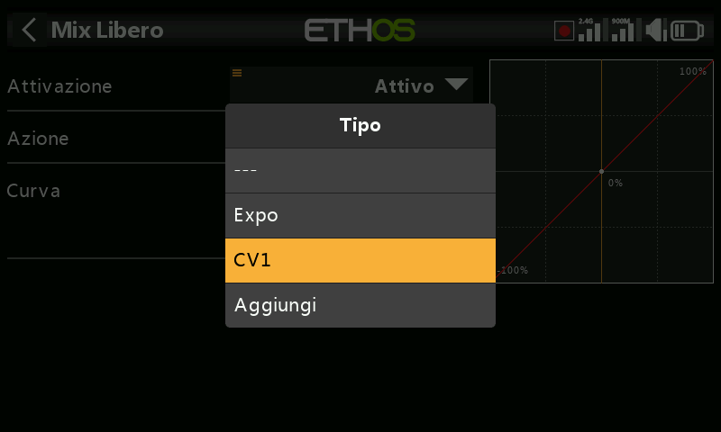

È inoltre possibile selezionare qualsiasi curva definita in precedenza (ad esempio CV1 nell'esempio precedente). L'uscita del mix sarà quindi modificata da questa curva.

Con il Free Mix e alcuni altri mix, puoi specificare fino a 6 curve, ciascuna con una condizione. Se più di una condizione è vera, prevale la curva più in alto nell'elenco.

Nota che le Curve vengono applicate prima del escursione.

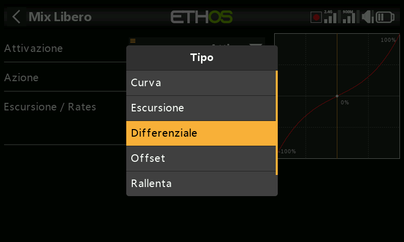

Per aggiungere il differenziale al mix, seleziona "Differenziale" dal menu a discesa delle azioni.

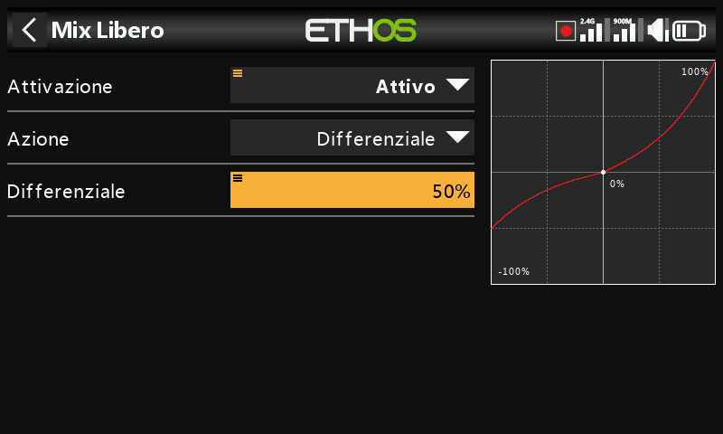

Se il valore è positivo, l'uscita del mix avrà una minore corsa verso il basso. (Predefinito = 0. Intervallo da -100 a +100). Con un valore del 50% la corsa verso il basso è la metà della corsa verso l'alto, come si può vedere nell'esempio precedente.

Per maggiori dettagli, consulta la descrizione del mix Alettoni.

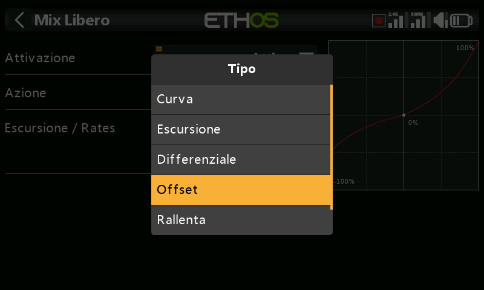

Per aggiungere un offset al mix, seleziona "Offset" dal menu a discesa delle azioni.

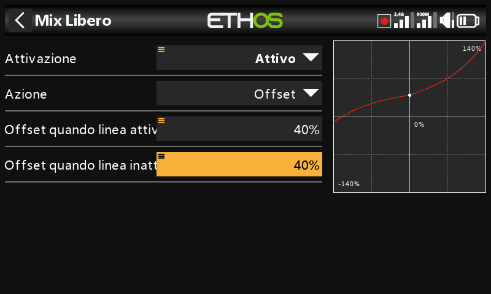

Un offset sposterà l'uscita del mix verso l'alto o verso il basso del valore di offset inserito qui. Sono ammessi valori negativi.

Si possono definire due valori di offset, uno per quando la Mix libera è attiva e un altro per quando la Mix libera è inattiva.

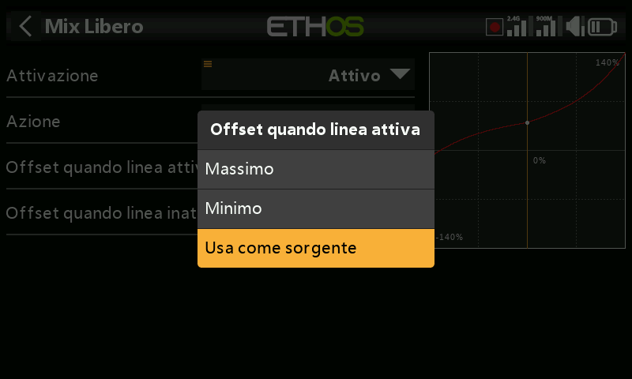

Un trim può essere assegnato a un mix libero utilizzando il trimmer come sorgente (premendo a lungo sul campo del valore) per il parametro Offset.

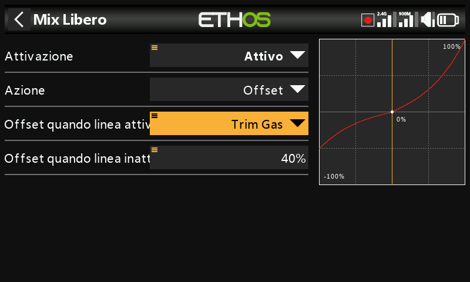

Nell'esempio precedente, il trim del Gas - Throttle è stato selezionato come fonte per regolare l'offset.

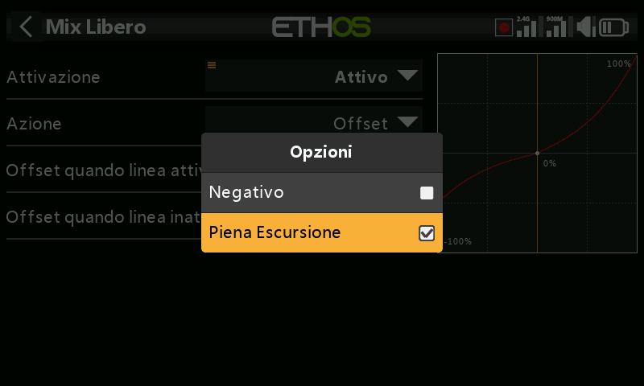

Per impostazione predefinita, i trim hanno un intervallo di +/- 25%. Quando vengono utilizzati come sorgente, i trim possono essere modificati in un intervallo completo di +/- 100% (premi a lungo Invio sul trim).

La direzione dell'assetto può essere cambiata selezionando "Inverti".

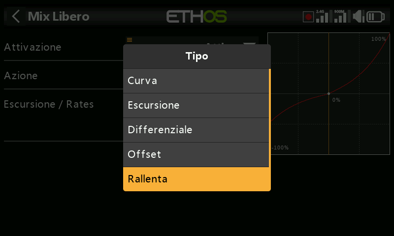

Per aggiungere un rallentamento all'uscita del free mix, seleziona "Slow" dal menu a discesa delle azioni.

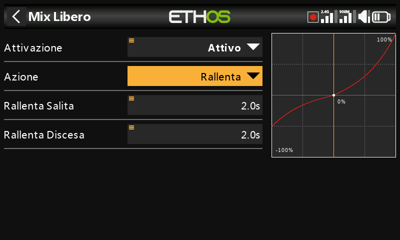

Slow (ad esempio) è comunemente usato per rallentare l'apertura dei flap, perché aumenti improvvisi della portanza possono causare problemi di controllo.

Se si imposta Slow come prima azione, i valori slow corrispondono al tempo in secondi che l'uscita impiegherà per passare da 0 a +100% (o cambiare del 100%).

Ad esempio:

Azione 1 - Slow up/down=2s/2s

Azione 2 – Peso=50%

Se l'input cambia da -100% a +100%,

l'output impiegherà (2+2)=4s per passare da -50% a +50%.

Se invece l'azione Slow segue l'azione Weight, la transizione lenta sarà proporzionalmente più breve.

Ad esempio:

Azione 1 - Peso=50%

Azione 2 - Rallenta/Accelera=2s/2s

Se l'input cambia da -100% a +100%,

l'output impiegherà solo (2+2)\*50% ‎=2s per passare da -50% a +50%.

Si possono definire valori diversi per le direzioni verso l'alto e verso il basso.

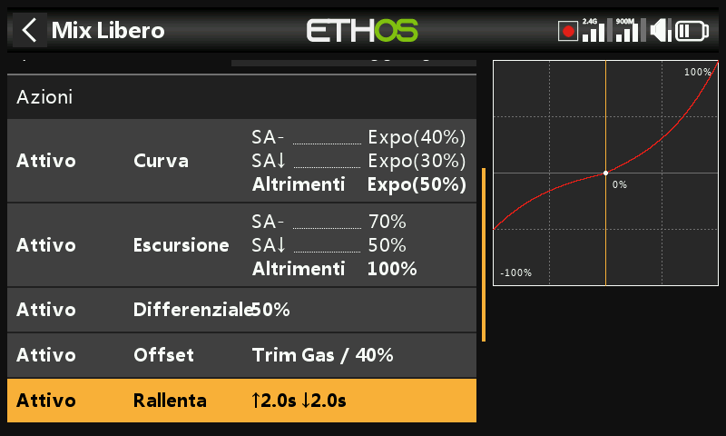

Un riepilogo delle azioni di mix è riportato qui sopra.

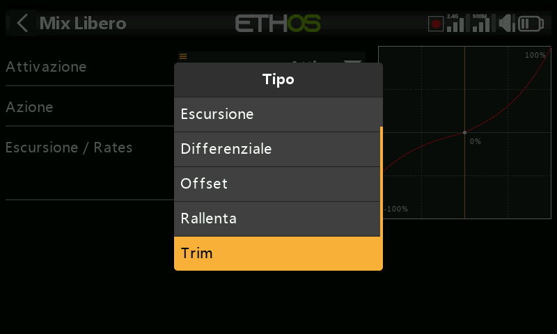

Per aggiungere un assetto al mix, seleziona "Assetto" dal menu a discesa delle azioni. Questa operazione è più semplice rispetto all'aggiunta di un assetto con l'azione Offset.

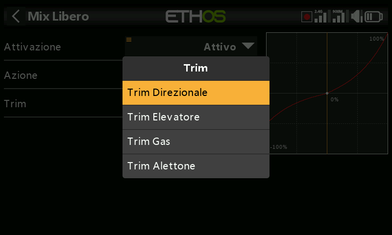

Seleziona l'interruttore di assetto da utilizzare.

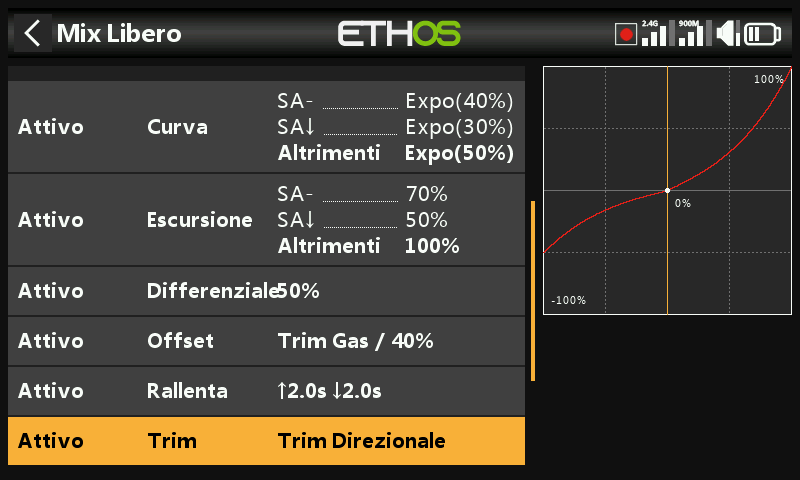

Un riepilogo di tutte le azioni di mix è riportato qui sopra.

##### Riorganizzazione delle azioni di mixo libero

Come discusso in precedenza, l'ordine consigliato delle azioni è Slow, Curve, Weight, Differential, Offset e infine Trim. Questo ordine dovrebbe essere rispettato a meno che non vi sia un motivo specifico per utilizzare un ordine diverso. Ad esempio, potresti voler rimuovere un offset da un input.

Poiché Peso è l'azione predefinita quando si crea un mix libero, qualsiasi azione aggiuntiva creata avrà un ordine inferiore, a meno che non si elimini prima l'azione Peso. Tuttavia, è più semplice modificare l'ordine delle azioni di mix utilizzando l'opzione “Sposta” nel sottomenu di modifica.

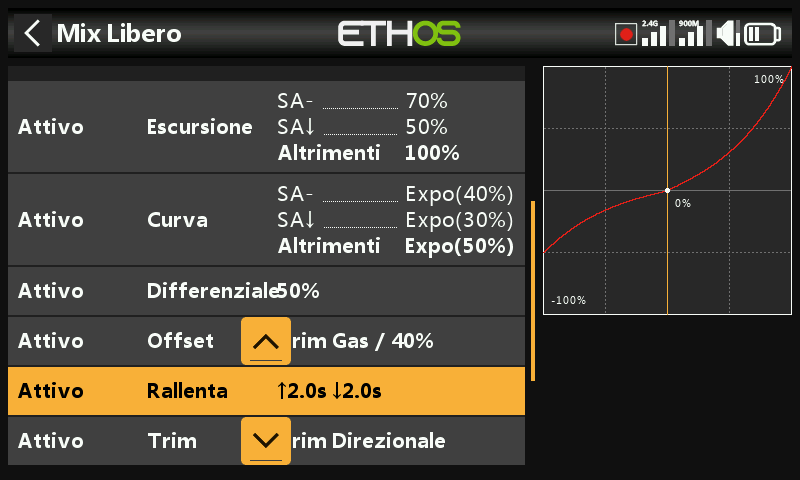

Tocca l'azione da spostare, ad esempio l'azione “Slow” nell'esempio sopra riportato, quindi seleziona l'opzione “Sposta” nel sottomenu di modifica. Appariranno delle frecce di spostamento che consentono di spostare l'azione verso l'alto o verso il basso nell'ordine.

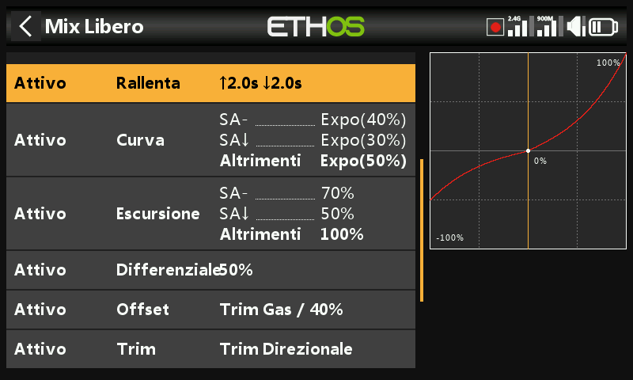

Questo riepilogo mostra che le azioni Slow e Curve sono state spostate in alto nell'ordine delle azioni.  Si noti che Trim deve sempre essere l'ultima.

- Numero di canali

Il conteggio dei canali definisce il numero di canali di uscita assegnati.

- Invertire

L'uscita di questo mix può essere invertita o invertita attivando questa opzione. Tieni presente che l'inversione del servo deve essere effettuata nella sezione Uscite. Questa opzione serve per ottenere la giusta logica di miscelazione.

- Uscita

Qualsiasi canale può essere selezionato per ricevere l'uscita di questo mix. Se il conteggio dei canali di cui sopra è maggiore di uno, è necessario configurare un canale per ogni uscita.

Libreria di mix continua...

Alettone, Elevatore, Timone

Fai riferimento alla  dettagliata [delle Mixer di alettoni, elevatori e timoni ](#Aileron_Elevator_Rudder_mixes)riportata sopra.

Flap

Il mix Flaps mixa un ingresso a uno o più canali con escursioni individuali. Offre anche le opzioni Slow Up e Slow Down.

Gas - Throttle

Il mix Throttle è per il controllo del motore e comprende le opzioni Throttle Cut e Throttle Hold. Consulta la discussione dettagliata [sul mix di accelerazione ](#Throttle_Mix)riportata sopra.

Da alettone a flap

Questa Mix è comunemente utilizzata sugli alianti in modo che i flap si muovano insieme agli alettoni per aumentare la risposta degli alettoni del modello.

Dall'alettone al timone

Questa Mix è comunemente utilizzata per ridurre il sideslipping nelle virate. Tuttavia, questa Mix è adatta solo a una particolare velocità e orientamento dell'aria. È meglio imparare a correggere il sideslipping con il controllo manuale del timone.

Aereofreno

La Mix Airbrake è simile alla Mix Butterfly, ma è controllata da una condizione attiva on-off.

Butterfly

La frenata a Butterfly o a crow viene utilizzata per controllare la velocità di discesa di un aereo. Gli alettoni sono impostati per salire di poco, mentre i flap scendono di molto. Questa combinazione crea una forte resistenza aerodinamica ed è molto efficace per frenare e quindi ideale per controllare l'approccio all'atterraggio. L'input è normalmente impostato su un cursore (o sullo stick del Gas - Throttle in un aliante).

La compensazione è necessaria anche sull'elevatore per evitare che l'aliante si sollevi quando si applica la folla.

Tieni presente che il mix ha un offset incorporato in modo che l'uscita del mix sia pari a zero nella posizione neutra dei flap, cioè quando lo stick del Gas - Throttle (o la fonte alternativa) è in posizione bassa, e al massimo nella posizione di apertura completa dei flap, cioè nella posizione alta dello stick del Gas - Throttle (o della fonte alternativa). Questo offset viene disattivato quando si aggiunge una curva utente per dare a quest'ultima il pieno controllo.

Camber

La Mix Camber viene solitamente utilizzata per applicare un po' di camber alle superfici alari per aumentare la portanza.

Flap a Elevatore

La Mix Flap/Elevatore è utile per la compensazione di flap/camber/crow, quando è necessaria una curva di compensazione personalizzata.

Elevatore a Camber

Conosciuta anche come Snap Flap, questa Mix aggiunge camber all'ala quando si applica l'elevatore. Questo permette all'ala di generare portanza in modo più efficiente quando l'aereo riceve i comandi di beccheggio.

Dal timone all'alettone

Questa Mix viene utilizzata per contrastare l'imbardata indotta dal timone nel volo a coltello.

Dal timone all'elevatore

Questa Mix può aiutare a migliorare il volo a coltello in caso di problemi di accoppiamento.

Snap Roll

Lo snap roll è una manovra di autorotazione in condizioni di stallo. Durante uno snap, un'ala viene stallata mentre l'altra viene accelerata intorno all'asse di rollio. Questo crea un'accelerazione improvvisa del rollio che non si può ottenere semplicemente dando un input all'alettone. Per ottenere questa condizione in un modello, è necessario dare diversi input, tra cui l'elevatore, il timone e l'alettone. Ad esempio, puoi eseguire uno snap interno a sinistra programmando il mix in modo da applicare simultaneamente l'elevatore, il timone sinistro e l'alettone sinistro per 1 o 2 secondi. Recupera la manovra neutralizzando gli stick e aggiungendo immediatamente il timone destro per correggere la perdita di rotta.

Gas - Throttle all'elevatore

Questo mix permette di compensare l'elevatore per gli aerei che cambiano passo al variare della manetta.

Tieni presente che il mix ha un offset incorporato in modo che l'uscita del mix sia pari a zero quando lo stick del Gas - Throttle è in posizione bassa e al massimo quando lo stick del Gas - Throttle è in posizione alta. Questo offset viene disattivato quando si aggiunge una curva utente per dare a quest'ultima il pieno controllo.

Gas - Throttle al timone

Questa Mix aiuterà l'aereo a volare dritto quando è a pieno regime; in genere è necessaria quando si vola in verticale.

Tieni presente che il mix ha un offset incorporato in modo che l'uscita del mix sia pari a zero quando lo stick del Gas - Throttle è in posizione bassa e al massimo quando lo stick del Gas - Throttle è in posizione alta. Questo offset viene disattivato quando si aggiunge una curva utente per dare a quest'ultima il pieno controllo.

Mix di Test

Questa Mix è ideale per testare i servi. Include un'impostazione di gamma, oltre a Slow Up e Slow Down.

Per motivi di sicurezza, il mix di test esclude i canali dell'acceleratore/gas

Offset

La Mix Offset viene utilizzata per aggiungere un valore fisso alla Mix quando è necessario un offset. Un'applicazione comune è quella dei flap, dove la squadretta del servo viene spostata in una direzione per massimizzare la corsa dei flap verso il basso. In questo modo i flap si trovano in una posizione di mezza discesa al centro del servo. La Mix Offset può quindi essere utilizzata per portare i flap nella posizione "neutra in superficie" quando l'uscita della Mix flap è pari a zero.

Sequencer

Il mix sequencer consente di sequenziare più canali in avanti e indietro utilizzando basi temporali e curve programmabili. È molto utile per programmare elementi quali le sequenze del carrello di atterraggio e dello sportello del carrello. Il sequencer è stato progettato con i comandi necessari per rendere la sequenza facile da programmare, consentendo al contempo una flessibilità totale limitata solo dalla vostra immaginazione.

Prima di iniziare la programmazione, è opportuno pianificare il funzionamento desiderato del sequencer.

Nome

Un nome descrittivo può essere assegnato per il mix Sequencer.

Condizione Attiva

La condizione attiva predefinita è “Sempre attivo”. È possibile renderla condizionale scegliendo tra posizioni di interruttori o pulsanti, interruttori di funzione, Fasi di volo, interruttori logici, eventi di sistema quali taglio o mantenimento della potenza o posizioni di trim.

Fasi di Volo

Se nella sezione “Fasi di volo” sono state definite delle Fasi di volo, questo parametro diventa disponibile. Il mix può quindi essere reso condizionale a una o più Fasi di volo. Fare clic su “Modifica” e selezionare le caselle relative alle Fasi di volo in cui questo mix deve essere attivo.

Modo Loop

Con la modalità loop attivata, il sequencer funzionerà in avanti e indietro in modo continuo in un loop. Con la modalità loop disattivata, la condizione di avanzamento o arretramento deve essere soddisfatta prima che la sequenza pertinente abbia inizio.

Un buon esempio di applicazione della modalità loop è una sequenza di test del servomotore.

Condizione “Avanti” Forward

La condizione "Avanti" - forward avvia il sequenziatore nella direzione forward. Eseguirà quindi fino al completamento per la durata forward indicata di seguito, a meno che il parametro presto - Early non sia impostato su On.

##### “Presto” - Early

L'opzione Early consente di terminare anticipatamente la sequenza di esecuzione in avanti se viene asserita la condizione di inversione.

Condizione “Indietro” - Backward

La condizione backward avvia il sequencer nella direzione inversa. Il sequencer verrà quindi eseguito fino al completamento per la durata inversa indicata di seguito, a meno che il parametro Early non sia impostato su On.

##### Presto - Early

L'opzione Early consente di terminare anticipatamente la sequenza di esecuzione all'indietro se viene asserita la condizione in avanti..

Condizion Pausa

Il sequenziatore può essere messo in pausa attivando la condizione di pausa. Rimarrà in modalità pausa fino a quando la condizione di pausa non tornerà falsa.

Durata Avanti - Forward

Qui è possibile configurare la base temporale per la sequenza in avanti.

Durata Indietro - Backward

Qui è possibile configurare la base temporale per la sequenza inversa. Può essere diversa dalla durata in avanti.

Uscita1

Any channel can be selected to receive the output from the sequencer.

Menu Uscita1

Tocca sui 3 punti per aprire il menu delle opzioni curva.

##### Opzioni Curva

##### Modifica Curva

La curva ha 5 punti come default, ma puoò essere estesa fino a 21 punti. Entrambe le coordinate X e Y sono configurabili.

##### Aggiungere una curva “indietro”- retroattiva

Come default la stessa curva è usata per entrambe le direzioni, ma è aggiungibile una curva retroattiva “indietro”.

Non appena viene aggiunta una curva “indietro”, il menu opzioni permetterà di configurare entrambe le curve.

##### Configura la curva Attiva “Avanti”

La curva attiva avanti può essere configurata. Quando ci sono due curve una freccia indica quale si stà modificando.

L’esempio mostra un applicazione tipica come sequenza test servocomandi.

##### Configura una curva retro attiva “indietro”

La curva retroattiva “indietro” può essere configurata. Quando presenti due curve una freccia indicherà quella che si sta modificando.

Se la curva “indietro viene creata dopo aver configurato la curva “avanti”, la curva avanti verrà replicat sulla curva “indietro e sarà comunque possibile modificarla.

##### Uso di una sola curv

Nel caso si cambiasse idea, la curva “indietro” potrà essere rimossa selezionando “usa solo una curva”.

##### Rimuovi Uscita

L’uscita può essere anche essa rimossa.

Aggiungere una nuova uscita

Uscite addizionali possono essere aggiunte, ognuna delle quaili avrà una sua curva (o piu curve).

Ciò consente, ad esempio, che un'uscita controlli i portelli del carrello, mentre un'altra controlla il carrello retrattile. Utilizzando le curve di ciascuna uscita, è possibile configurare una sequenza che preveda prima l'apertura graduale dei portelli del carrello, seguita dall'apertura del carrello retrattile e infine dalla chiusura dei portelli, con una tempistica tale da consentire il tempo necessario per ciascuna fase. Le curve possono essere configurate con una pendenza per controllare la velocità di variazione dell'uscita o per passare istantaneamente da una fase all'altra se, ad esempio, il controller retrattile controlla la propria velocità di funzionamento.

Si prega di fare riferimento alla sezione ‘Come configurare un sequencer per portelli e carrelli’ per un esempio.

Sommario operazioni Sequencer

Una volta soddisfatta la condizione di avanzamento, ogni uscita del mix del sequenziatore 	segue la sua curva di avanzamento (o singola) da sinistra a destra per tutta la durata 	dell'avanzamento. Allo stesso modo, una volta soddisfatta la condizione di arretramento, 	ogni uscita del mix del sequenziatore segue la sua curva di arretramento (o singola) da 	destra a sinistra per tutta la durata dell'arretramento..

Il parametro Early consente al sequencer di cambiare direzione in anticipo, mentre la 	condizione Pause consente di mettere in pausa la sequenza.

In modalità loop l'operazione è continua.

Tutto quanto sopra è ovviamente soggetto alle condizioni attive configurate e alle modalità 	di volo.

Libreria alianti

L'elenco delle combinazioni predefinite disponibili nella libreria del velivolo è riportato sopra.

Si prega di notare che alcune combinazioni appaiono solo se nel modello sono presenti i canali richiesti. Ad esempio, le combinazioni con i flap come obiettivo vengono popolate solo se sono definite configurazioni valide dei flap. Le combinazioni relative ai flap appariranno nella libreria delle combinazioni se i flap sono definiti in Modifica modello.

Mix Libero

Fai riferimento alla descrizione del [mix gratuito ](mixes.md)nella sezione Biblioteca di aerei.

Alettone, Elevatore, Timone

Fai riferimento alla descrizione dettagliata delle Mixer di [alettoni, elevatori e timoni ](#Aileron_Elevator_Rudder_mixes)riportata sopra.

Flap

Il mix Flaps mixa un ingresso a uno o più canali con escursioni individuali. Offre anche le opzioni Slow Up e Slow Down.

Gas - Throttle

Il mix Throttle è per il controllo del motore e comprende le opzioni Throttle Cut e Throttle Hold. Consulta la discussione dettagliata [sul mix di accelerazione ](#Throttle_Mix)riportata sopra.

Da alettone a flap

Questa Mix è comunemente utilizzata sugli alianti in modo che i flap si muovano insieme agli alettoni per aumentare la risposta degli alettoni del modello.

Dall'alettone al timone

Questa Mix è comunemente utilizzata per ridurre il sideslipping nelle virate. Tuttavia, questa Mix è adatta solo a una particolare velocità e orientamento dell'aria. È meglio imparare a correggere il sideslipping con il controllo manuale del timone.

Aereofreno

La Mix Airbrake è simile alla Mix Butterfly, ma è controllata da una condizione attiva on-off.

Butterfly

La frenata a Butterfly o a crow viene utilizzata per controllare la velocità di discesa di un aereo. Gli alettoni sono impostati per salire di poco, mentre i flap scendono di molto. Questa combinazione crea una forte resistenza aerodinamica ed è molto efficace per frenare e quindi ideale per controllare l'approccio all'atterraggio. L'input è normalmente impostato su un cursore (o sullo stick del Gas - Throttle in un aliante).

La compensazione è necessaria anche sull'elevatore per evitare che l'aliante si sollevi quando si applica la folla.

Tieni presente che il mix ha un offset incorporato in modo che l'uscita del mix sia pari a zero nella posizione neutra dei flap, cioè quando lo stick del Gas - Throttle (o la fonte alternativa) è in posizione bassa, e al massimo nella posizione di apertura completa dei flap, cioè nella posizione alta dello stick del Gas - Throttle (o della fonte alternativa). Questo offset viene disattivato quando si aggiunge una curva utente per dare a quest'ultima il pieno controllo.

Camber

Il Camber viene solitamente utilizzato per applicare un po' di camber alle superfici alari per aumentare la portanza.

Flap a elevatore

La Mix Flap/Elevatore è utile per la compensazione di flap/camber/crow, quando è necessaria una curva di compensazione personalizzata.

Elevatore a Camber

Conosciuta anche come Snap Flap, questa Mix aggiunge camber all'ala quando si applica l'elevatore. Questo permette all'ala di generare portanza in modo più efficiente quando l'aereo riceve i comandi di beccheggio.

Dal timone all'alettone

Questa Mix può essere utilizzata per contrastare l'imbardata indotta dal timone.

Dal timone all'elevatore

Questa Mix può essere utile in caso di problemi di accoppiamento. Può essere utilizzata anche per aggiungere una funzione differenziale V-Tail.

Gas - Throttle all'elevatore

Questo mix consente di compensare l'elevatore per gli aerei che cambiano passo al variare della manetta.

Gas - Throttle al timone

Questa Mix aiuterà l'aereo a volare dritto quando è a pieno regime; in genere è necessaria quando si vola in verticale.

Mix di Test

Questa Mix è ideale per testare i servi. Include un'impostazione di gamma, oltre a Slow Up e Slow Down.

Offset

La Mix Offset viene utilizzata per aggiungere un valore fisso alla Mix quando è necessario un offset. Un'applicazione comune è quella dei flap, dove la squadretta del servo viene spostata in una direzione per massimizzare la corsa dei flap verso il basso. In questo modo i flap si trovano in una posizione di mezza discesa al centro del servo. La Mix Offset può quindi essere utilizzata per portare i flap nella posizione "neutra in superficie" quando l'uscita della Mix flap è pari a zero.

Libreria Elicotteri

Mix Libero

Fai riferimento alla descrizione del [mix gratuito ](mixes.md)nella sezione Biblioteca di aerei.

Alettone, Elevatore, Timone

Fai riferimento alla descrizione dettagliata delle Mixer di [alettoni, elevatori e timoni ](#Aileron_Elevator_Rudder_mixes)riportata sopra.

Piatto ciclico

Il mix Pitch mixa il controllo del passo (Throttle Stick di default) al canale del passo, che normalmente è il canale 6. Controlla il collettivo. Controlla il collettivo.

Banco Memoria

Nei tipici sistemi FBL per elicotteri, la modalità banco consente ai piloti di passare da un'impostazione salvata all'altra durante il volo. Assegnando l'input di mix a un interruttore a tre posizioni, è possibile scorrere queste banche (in genere Banca 0, 1 e 2) in volo per modificare rapidamente i parametri di volo o attivare le funzioni di soccorso secondo necessità.

Gas - Throttle

Il mix Throttle è per il controllo del motore e comprende le opzioni Throttle Cut e Throttle Hold. Consulta la discussione dettagliata [sul mix di accelerazione ](#Throttle_Mix)riportata sopra.

Gyro

Questo mix viene utilizzato per fornire le impostazioni di guadagno al controller FBL, che possono ad esempio dipendere dalla Fasi di volo. Il canale del giroscopio è spesso il canale 5.

Passo del timone

Serve per Mixre il passo al canale del timone.

Mix di Test

Questa Mix è ideale per testare i servi. Include un'impostazione di gamma, oltre a Slow Up e Slow Down.

Offset

Il mix Offset si usa per aggiungere un valore fisso al mix quando è necessario un offset.

Libreria Multirotori

Mix Libero

Fai riferimento alla descrizione del [mix gratuito ](mixes.md)nella sezione Biblioteca di aerei.

Rollio, beccheggio, imbardata

Queste Mixer sono simili alle Mixer di alettoni, elevatori e timoni. Fai riferimento alla descrizione dei [mix Alettoni, Elevatore e Timone ](#Aileron_Elevator_Rudder_mixes)riportata sopra.

Banco memoria

Nei tipici sistemi Flight controller per multirotore, la modalità banco consente ai piloti di passare da un'impostazione salvata all'altra durante il volo. Assegnando l'input di mix a un interruttore a tre posizioni, è possibile scorrere queste banche (in genere Banca 0, 1 e 2) in volo per modificare rapidamente i parametri di volo o attivare le funzioni di soccorso secondo necessità.

Gas - Throttle

La Mix Throttle è per il controllo del motore e comprende le opzioni Throttle Cut e Throttle Hold. Consulta la discussione dettagliata [sulla Mix Throttle ](#Throttle_Mix)riportata sopra.

Mix di Test

Questa Mix è ideale per testare i servi. Include un'impostazione di gamma, oltre a Slow Up e Slow Down.

Offset

Il mix Offset si usa per aggiungere un valore fisso al mix quando è necessario un offset.
