# Mix

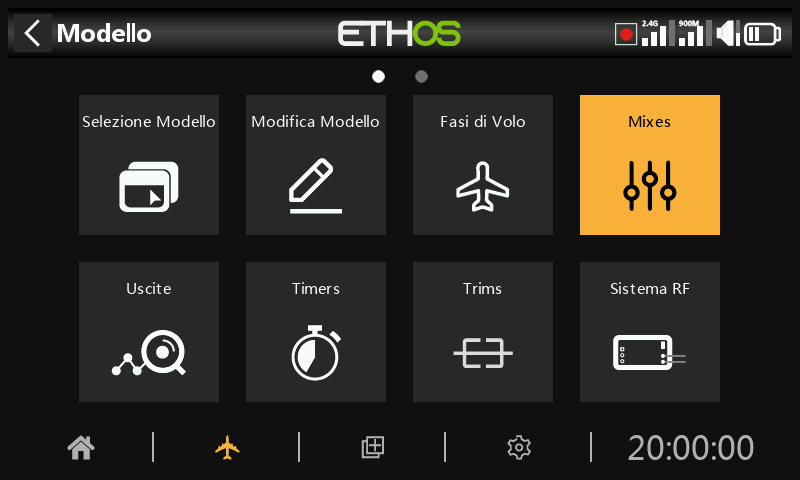

I mix sono il cuore della programmazione dei modelli in Ethos: è qui che gli
ingressi (stick, interruttori, sensori, qualsiasi cosa raggiungibile da una
[sorgente](../getting-started/user-interface-and-navigation.md#choosing-a-source))
vengono instradati, modellati e combinati sui canali di uscita. Si possono
definire fino a 120 mix per ogni modello.

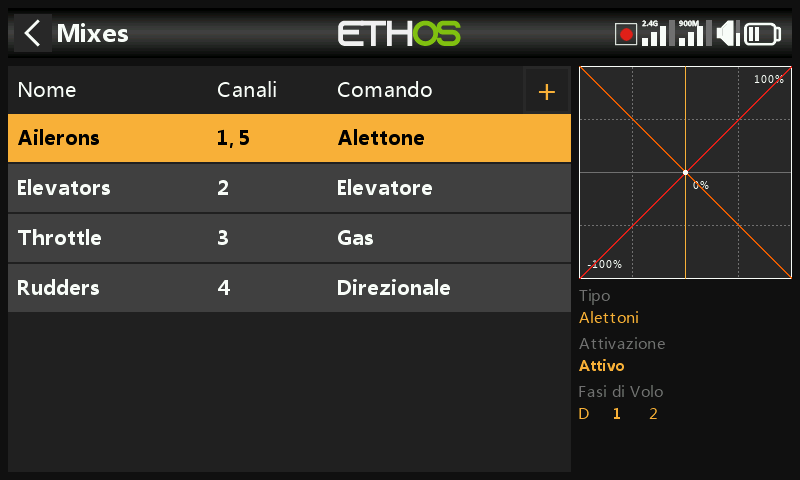

Se un modello è stato creato con la procedura guidata **Selezione modello**, i
suoi mix di base (alettoni, profondità, gas, timone e tutto ciò che la cellula
richiede) sono già presenti qui. Selezionando un mix e premendo `ENT` si apre un
menu contestuale che consente di modificarlo, aggiungere un nuovo mix, passare
alla [vista per canale](#per-channel-view), riordinarlo, duplicarlo o
eliminarlo. I mix inattivi sono visualizzati in grigio e l'eliminazione richiede
sempre una conferma preventiva.

## Anatomia di un mix {: #anatomy-of-a-mix }

Ogni mix condivide lo stesso insieme di campi, indipendentemente dalla categoria
di provenienza. Il mix **alettoni** ne è un esempio rappresentativo: i mix di
profondità e timone hanno una struttura identica.

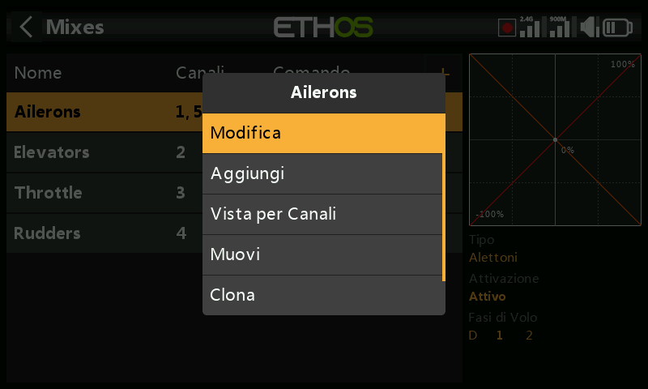

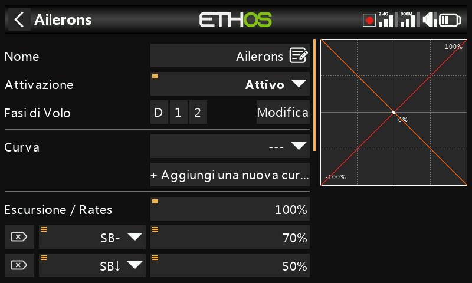

**Nome** — per impostazione predefinita corrisponde al tipo di mix, ed è
modificabile.

**Condizione** — per impostazione predefinita è *Sempre*. Può essere limitata a
una posizione di interruttore, a un interruttore funzione, a un interruttore
logico, a una fase di volo, a un evento di sistema (taglio/blocco gas) o a una
posizione di trim; in tal caso il mix si applica solo finché la condizione è
vera.

**Fasi di volo** — se sono definite delle fasi di volo, il mix può inoltre
essere limitato a una o più di esse.

**Curva** — è disponibile per impostazione predefinita una curva **Expo** (0 =
lineare; valori positivi ammorbidiscono la risposta attorno al centro, valori
negativi la rendono più incisiva):

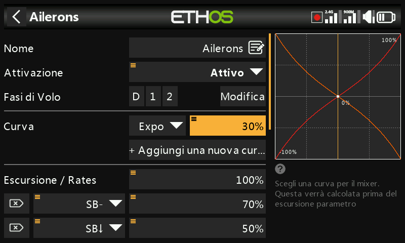

In alternativa è possibile selezionare qualsiasi curva definita in precedenza in
[Curve](curves.md). Su un singolo mix si possono sovrapporre fino a 6 curve,
ciascuna con la propria condizione: se più condizioni risultano vere
contemporaneamente, prevale la curva più in alto nell'elenco. Le curve vengono
applicate **prima** dei rate.

**Rate** — una o più righe di peso, ciascuna eventualmente subordinata a un
interruttore, un interruttore funzione, un interruttore logico, una posizione di
trim o una fase di volo. La prima riga è quella predefinita, attiva ogni volta
che non è soddisfatta la condizione di nessun'altra riga:

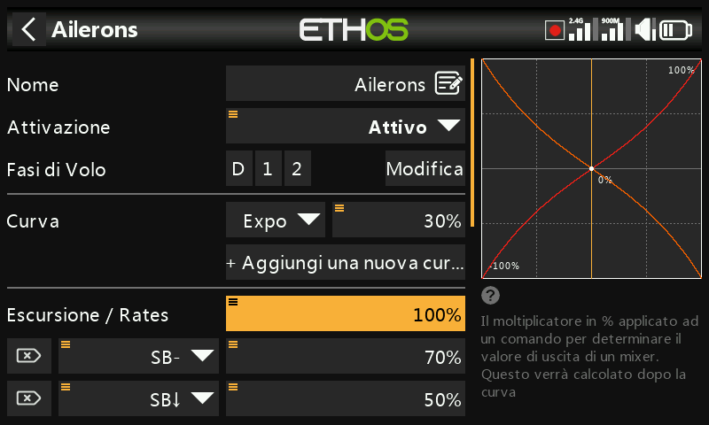

Anziché una percentuale fissa, un rate può essere pilotato da una
[sorgente](../getting-started/user-interface-and-navigation.md#choosing-a-source),
ad esempio un potenziometro, per regolare il rate in volo:

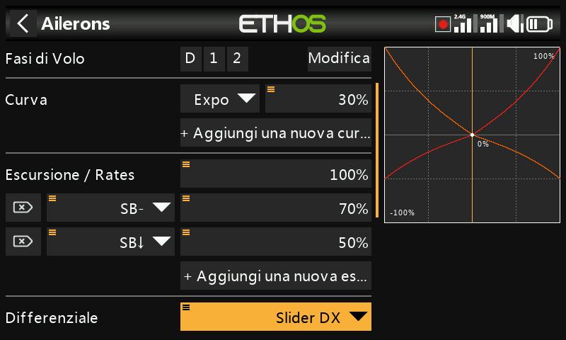

**Differenziale** (da -100 a 100, predefinito 0) — assegna più corsa in una
direzione rispetto all'altra. Per gli alettoni è il classico accorgimento di
maggiore escursione verso l'alto rispetto a quella verso il basso, per ridurre
l'imbardata inversa. Viene visualizzato solo quando il mix comanda più di un
canale di uscita; nello specifico, il differenziale ha senso solo con una
configurazione di uscita di tipo coda a V o doppio alettone.

**Numero di canali / uscite** — quanti canali di uscita comanda questo mix e a
quali uscite fisiche sono associati:

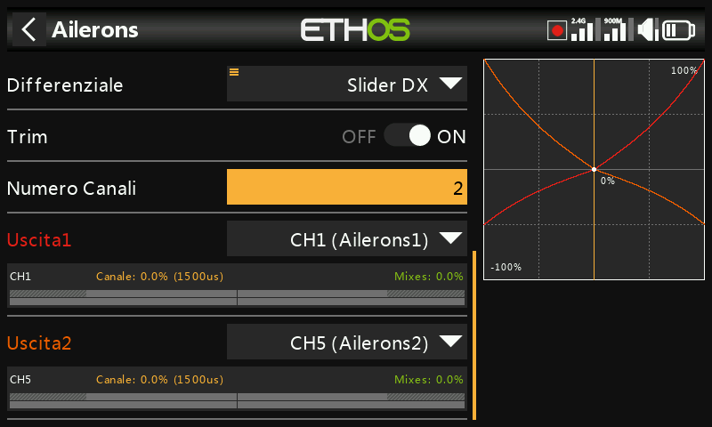

Una pressione prolungata di `ENT` su un canale di uscita in un altro punto
dell'interfaccia (ad esempio in [Uscite](outputs.md)) riporta direttamente a
questa pagina.

## Il mix del gas

Il mix del gas è un mix analogo a quelli di alettoni/profondità/timone, con in
più opzioni di sicurezza specifiche per il motore.

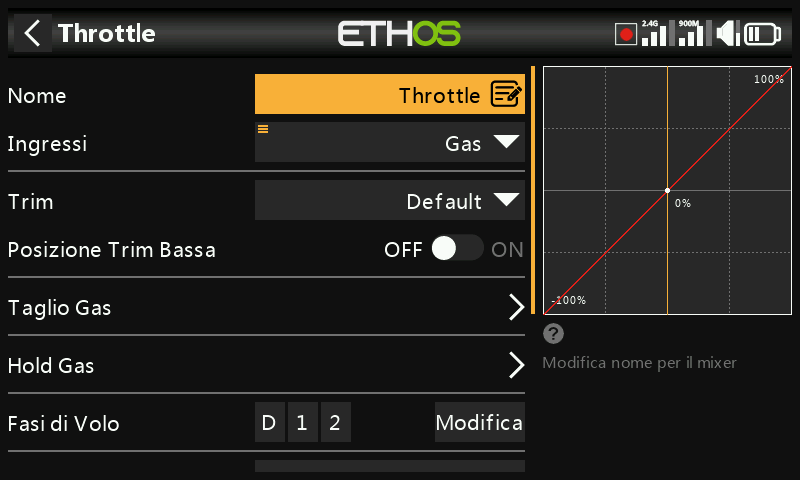

**Ingresso** — la sorgente del gas, normalmente lo stick del gas, ma
sostituibile con un potenziometro, uno slider, un interruttore, un trim, un
canale, un asse del giroscopio, un canale trainer, un timer o qualsiasi altra
sorgente.

**Trim del minimo** — per i motori a combustione, consente a un trim dedicato di
regolare il regime di minimo senza alterare la posizione di massimo. Con il trim
del minimo abilitato, il canale del gas si posiziona a -75% con lo stick al
minimo, e il trim del gas regola poi il minimo tra -100% e -50%:

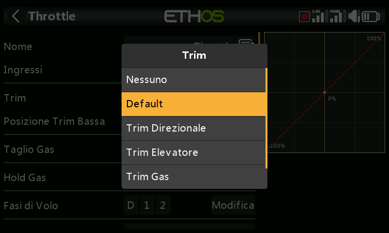

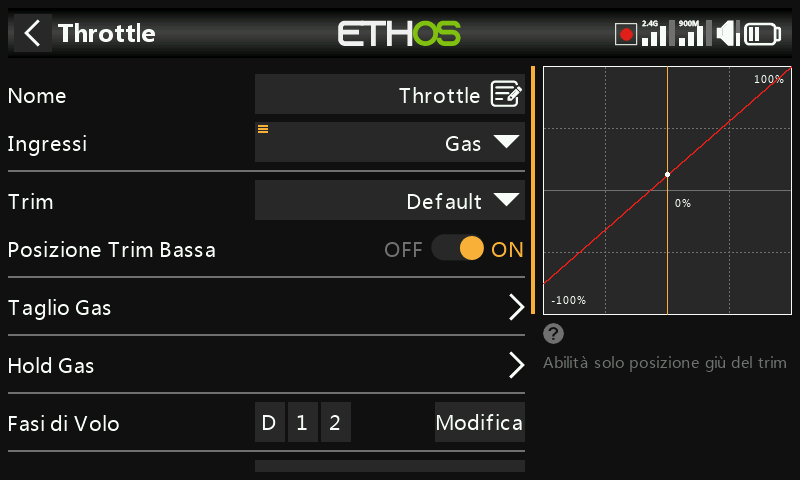

**Taglio gas** — un vero e proprio interblocco di sicurezza: il canale diventa
attivo solo dopo che lo stick del gas è passato per il minimo, in modo che
l'azionamento accidentale di un interruttore non possa avviare il motore da una
posizione di gas elevato:

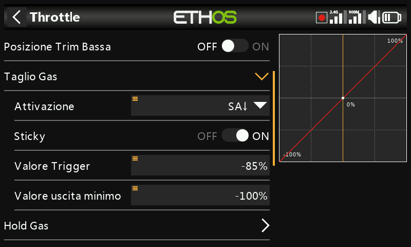

**Blocco gas** — mantiene il canale a un valore fisso indipendentemente dalla
posizione dello stick, senza l'interblocco di sicurezza offerto dal taglio gas:

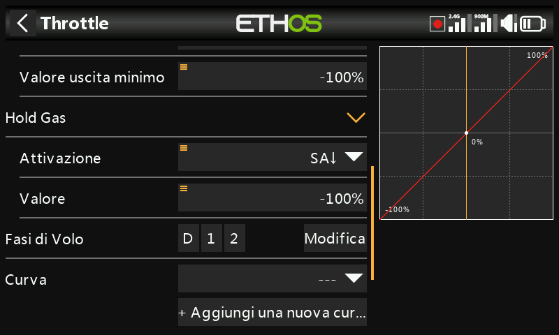

Anche il gas dispone del proprio numero di canali di uscita, esattamente come
qualsiasi altro mix:

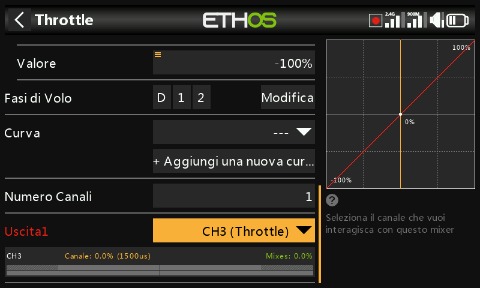

!!! note "Interblocco del gas"
    Ethos richiede che l'ingresso del mix del gas passi per -100% prima di
    consentire l'armamento, indipendentemente dalle impostazioni di taglio/blocco
    gas: un modello creato con la procedura guidata di selezione modello ne tiene
    già conto, ma anche i mix del gas costruiti manualmente dovrebbero farlo.

## Librerie di mix {: #mix-libraries }

La libreria di mix predefiniti della finestra **Aggiungi mix** è adattata alla
categoria di modello scelta al momento della creazione: aeroplano, aliante,
elicottero e multirotore presentano ciascuno un insieme diverso:

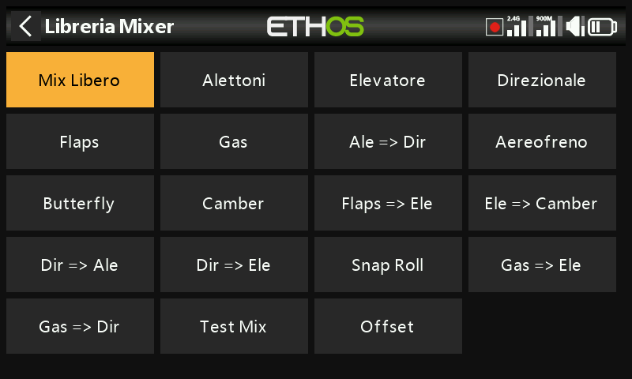

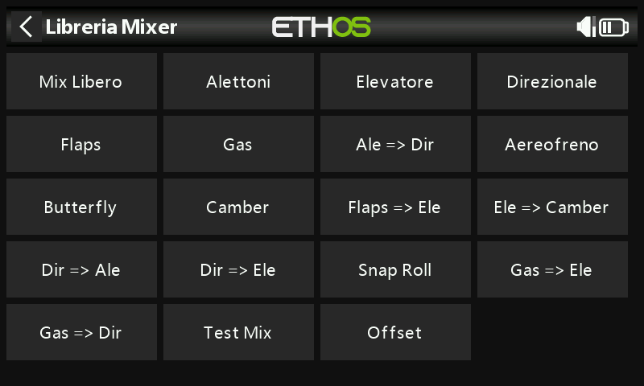

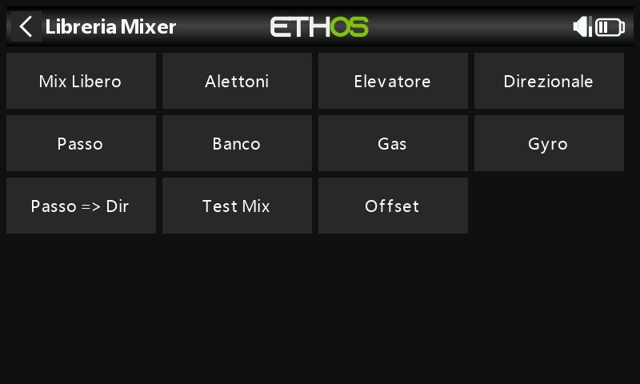

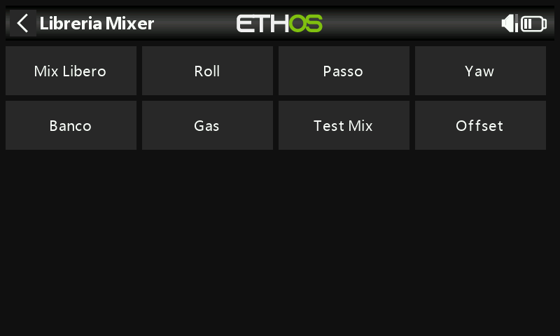

Ogni libreria include inoltre il **Mix libero**: un tipo di mix generico senza
ingresso/uscita preimpostati, più flessibile delle voci specializzate ma che
richiede una configurazione più laboriosa per ottenere lo stesso risultato.

## Vista per canale {: #per-channel-view }

Quando sulla stessa uscita si accumulano numerosi mix, può risultare difficile
coglierne l'effetto complessivo dalla tabella lineare precedente. Selezionando
un mix e scegliendo **Visualizza per canale**, tutti i mix che agiscono su una
stessa uscita vengono invece raggruppati insieme:

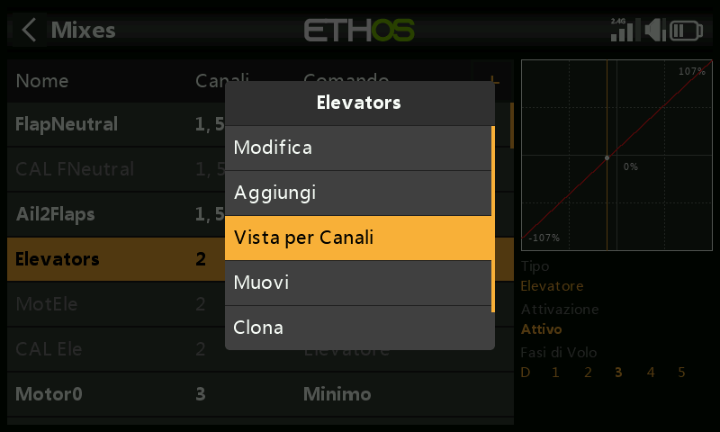

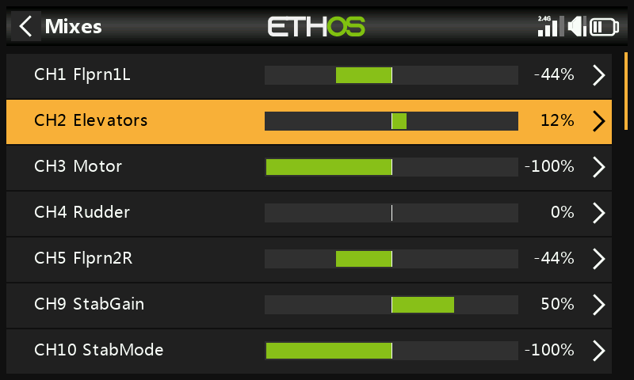

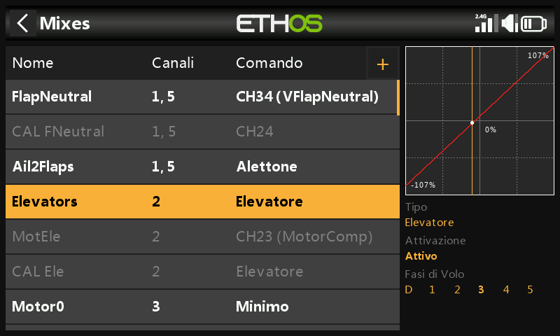

Espandendo la riga di riepilogo di un canale si visualizzano tutti i mix che vi
contribuiscono, ciascuno con la propria uscita numerica e grafica in tempo
reale: utile per verificare con esattezza quanto un mix secondario (ad esempio
la compensazione flap-profondità) stia aggiungendo all'ingresso primario dello
stick:

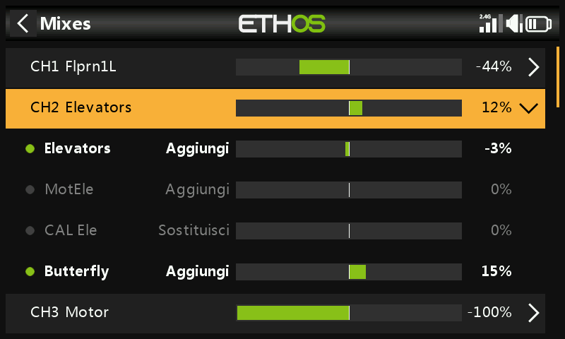

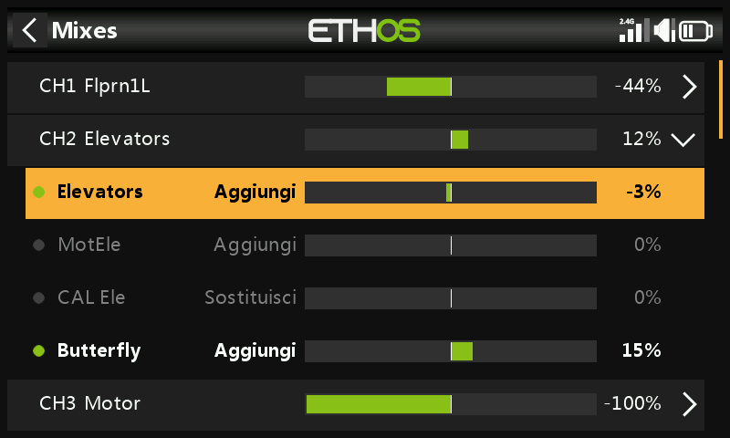

Selezionando un sotto-mix anziché la riga di riepilogo si apre lo stesso menu
contestuale della tabella lineare (modifica, ritorno alla vista tabellare,
eliminazione):

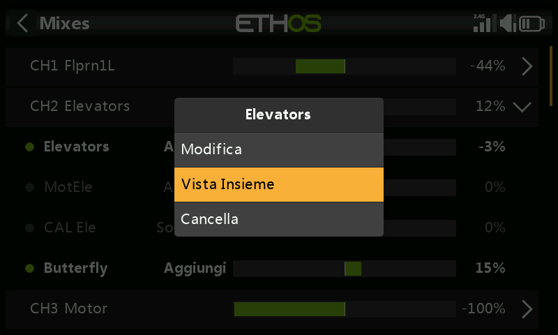

