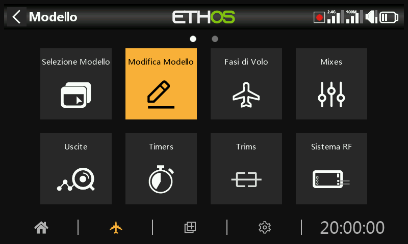
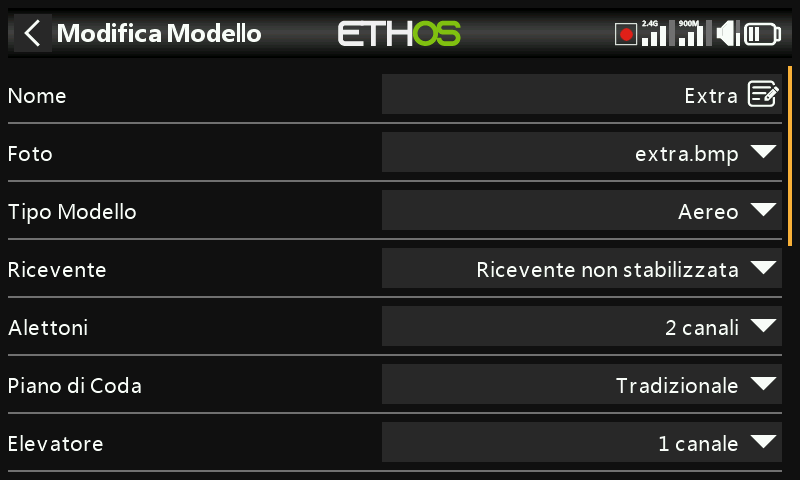
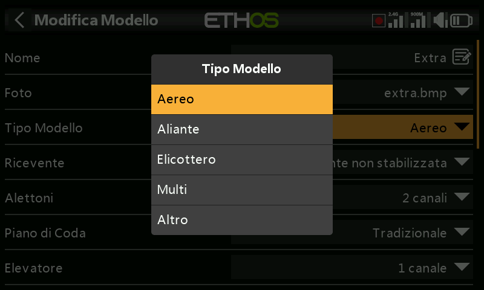
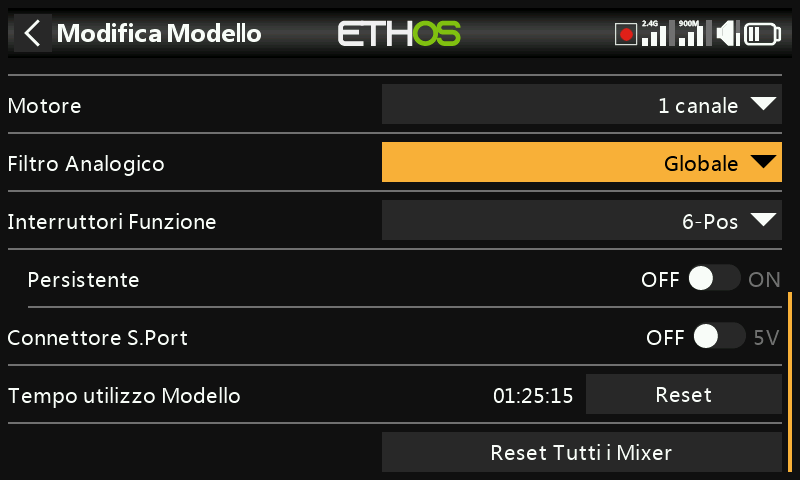
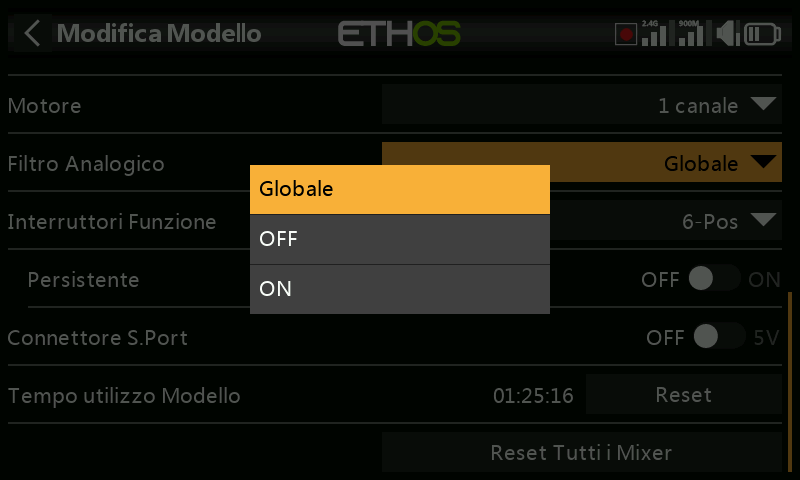
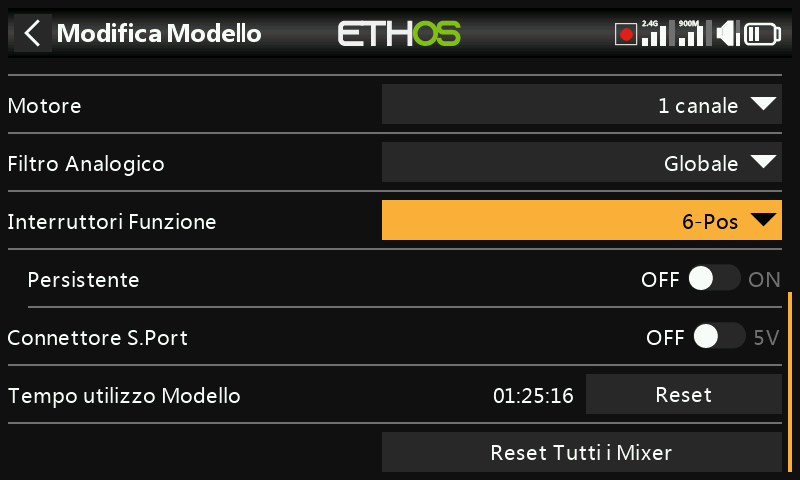
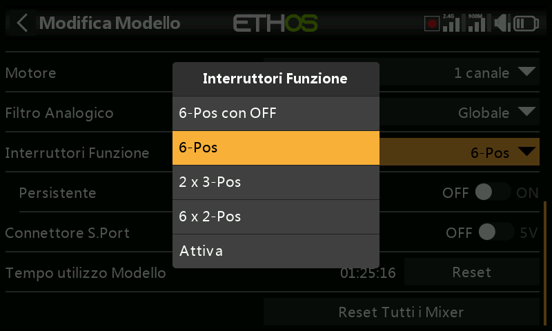

# Modifica il modello

L'opzione "Modifica modello" serve per modificare i parametri di base del modello come impostato dalla procedura guidata.

## Nome, immagine

Il modello può essere rinominato, l'immagine assegnata o modificata. Quando si cerca un'immagine, viene mostrata una miniatura di anteprima per facilitare l'individuazione dell'immagine corretta.

Le immagini bitmap dei modelli devono trovarsi nella cartella «bitmaps/models» sulla scheda SD o sull'eMMC.

## Tipo di modello

Cambiando il tipo di modello, tutti i mix verranno resettati

## Assegnazione dei canali

Cambiando il tipo di coda o il piatto oscillante dell'elicottero, tutti i mix verranno resettati. Sugli altri canali, il numero di canali output assegnati può essere modificato o disassegnato.

## Banda morta Acceleratore

Consente la configurazione di una banda morta dell'acceleratore per acceleratori con base zero con marcia avanti e retromarcia per evitare movimenti involontari del motore quando la leva è in posizione neutra.

## Filtro analogico

Esiste un'impostazione globale del filtro del convertitore analogico-digitale nella pagina Hardware alla voce [Filtro analogico](../system-setup/hardware.md), che può migliorare il jitter (disturbo) intorno al centro dello stick. Questa impostazione specifica del modello può essere utilizzata per sovrascrivere l'impostazione globale.

## Interruttori di funzione

I sei interruttori di funzione sono disponibili ovunque si trovino i parametri "Condizione attiva". Tieni presente che non possono essere utilizzati come sorgente come i normali interruttori.

Configurazione

Possono essere configurati come segue:

6-Pos con OFF

Premendo un qualsiasi interruttore di funzione, quell'interruttore si attiverà. Tuttavia, premendo una seconda volta un interruttore già acceso, questo si spegnerà, lasciando tutti e sei gli interruttori di funzione spenti.

6-POS

Premendo un qualsiasi interruttore di funzione, quell'interruttore rimarrà attivo fino a quando non verrà premuto un altro interruttore di funzione per attivare l'interruttore appena premuto.

2 x 3-Pos

Suddivide i 6 interruttori di funzione in due gruppi di 3. Ogni gruppo può avere un interruttore attivo.

6 x 2-Pos

Suddivide i 6 interruttori di funzione in 6 interruttori a scatto. Ogni interruttore può essere ON o OFF.

Momentaneo

Suddivide i 6 interruttori funzionali in 6 interruttori momentanei. Ogni interruttore è attivo quando è premuto.

Persistente

Se abilitato, l'interruttore di funzione si troverà nello stesso stato quando la radio verrà accesa o il modello verrà ricaricato.

## Connettore Sport (5V) Alimentazione

Il pin “+” (centrale) del connettore S.Port può essere configurato come segue:  
a) Il pin “+” (centrale) del connettore S.Port può essere lasciato disattivato. Utilizzare l'opzione “---”.  
b) Il pin “+” (centrale) sul connettore S.Port può essere configurato come “Sempre attivo” per fornire +5 V a un dispositivo periferico.   
c) Il pin “+” (centrale) sul connettore S.Port può essere controllato da un interruttore o da un'altra fonte per fornire +5 V a un dispositivo periferico.   
È necessario prestare attenzione a non sovraccaricare l'uscita.

## Tempo di utilizzo del modello

Il timer di esecuzione del modello tiene traccia del tempo totale di esecuzione del modello.

Premi il bottone di reset per resettare il timer

## Azzera tutti i mix

Eseguendo "Azzera tutti i mix" si azzerano tutti i mix.
