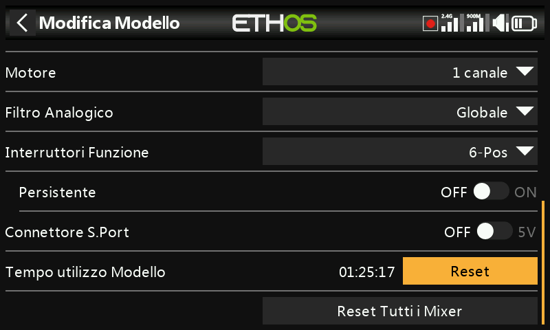
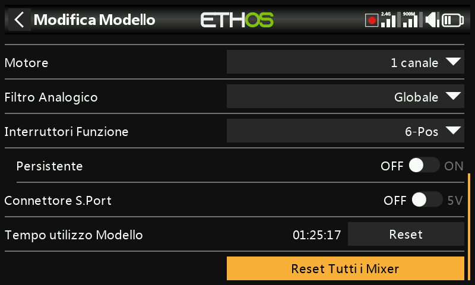

# Modifica modello

Permette di modificare i parametri a livello di modello impostati inizialmente
dalla procedura guidata — principalmente l'identità, ma anche alcune
sovrascritture per singolo modello e alcune utilità.

## Nome, Immagine

Consente di rinominare il modello o di cambiarne l'immagine; sfogliando le
immagini viene mostrata un'anteprima in miniatura.

## Tipo di modello

!!! warning
    La modifica del tipo di modello azzera **tutti** i mix.

## Assegnazione dei canali

Anche la modifica del tipo di coda o (su un elicottero) del tipo di piatto
ciclico azzera tutti i mix. Per gli altri canali è possibile modificare il
numero di canali assegnati oppure annullarne l'assegnazione.

## Filtro analogici

In [Configurazione di sistema → Hardware](../system-setup/hardware.md) è
presente un filtro analogico-digitale globale che consente di ridurre il jitter
attorno al centro degli stick; questa impostazione per singolo modello lo
sovrascrive solo per il modello corrente.

## Interruttori funzione {: #function-switches }

I sei interruttori funzione sono disponibili ovunque compaia un parametro
**Condizione di attivazione** ma, a differenza degli interruttori ordinari, non
possono essere usati come sorgente generica. Possono essere configurati in uno
dei seguenti modi:

- **6 posizioni con OFF** — premendo un interruttore funzione questo si attiva
  in modo permanente; premendo nuovamente lo *stesso* interruttore tutti e sei
  vengono disattivati.
- **6 posizioni** — premendo un interruttore funzione questo resta attivo finché
  non viene premuto un interruttore *diverso*, che ne prende il posto.
- **2 × 3 posizioni** — divide i sei interruttori in due gruppi di tre, con un
  interruttore attivo per gruppo.
- **6 × 2 posizioni** — sei interruttori on/off indipendenti con ritenuta.
- **Momentaneo** — sei interruttori indipendenti, ciascuno attivo solo mentre
  viene mantenuto premuto.
- **Persistente** — se abilitato, un interruttore funzione mantiene il proprio
  stato dopo lo spegnimento o il ricaricamento del modello, anziché azzerarsi.

## Connettore SPort

Il pin 5V del connettore S.Port della trasmittente può essere attivato o
disattivato per singolo modello — utile, ad esempio, per alimentare un
ricevitore esterno in una configurazione da istruttore/allievo.

## Tempo di utilizzo del modello

Registra il tempo totale di volo/utilizzo di questo modello.

## Azzera tutti i mix

Riporta tutti i mix del modello al loro stato predefinito.
