# Selezione modello

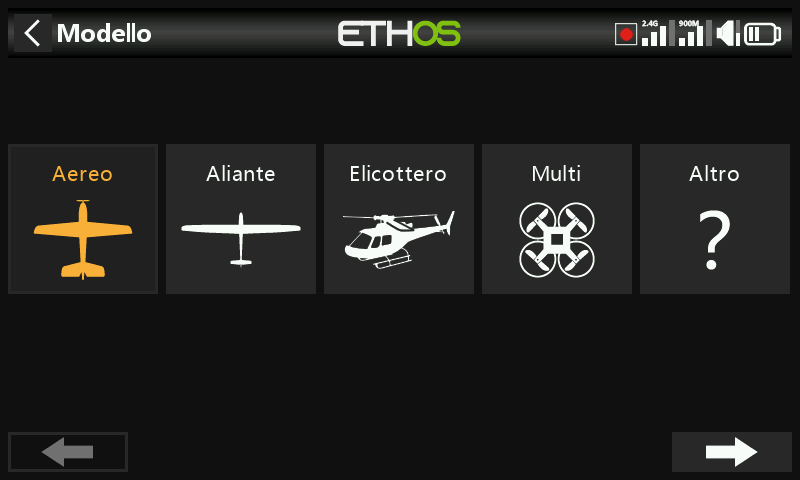

Permette di creare, selezionare, clonare ed eliminare i modelli e di gestire
le cartelle di categoria definite dall'utente in cui sono organizzati.

## Gestione delle cartelle dei modelli

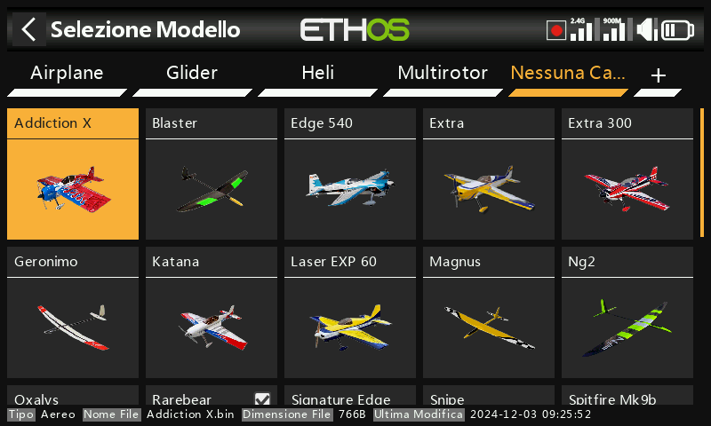

Ethos permette di raggruppare i modelli in cartelle personalizzate — tipicamente
voci come Aeroplano, Aliante, Elicottero, Quad, Warbird, Barca, Auto, Template
o Archivio. Finché non ne viene creata nessuna, i modelli risiedono in una
cartella automatica **Uncategorized** (creata con l'aggiornamento a Ethos 1.1.0
alpha 17+, oppure quando un file di modello viene copiato in `\Models` da
un'altra posizione); Ethos la elimina di nuovo non appena è vuota.

Per creare una cartella, tocca **+** accanto a "Uncategorized" (oppure premi a
lungo `PAGE` su/giù), assegnale un nome (fino a 15 caratteri) e conferma. Le
cartelle sono ordinate alfabeticamente, con **Uncategorized** sempre in ultima
posizione, e corrispondono direttamente alle sottocartelle di `\Models` sulla
SD card/eMMC. Toccando il nome di una cartella si apre la funzione di
rinomina/eliminazione — eliminando una cartella, gli eventuali modelli
contenuti vengono riportati in Uncategorized.

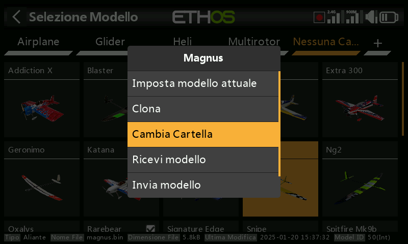

Per spostare un modello, tocca la sua icona, scegli **Change folder**, quindi
tocca la destinazione:

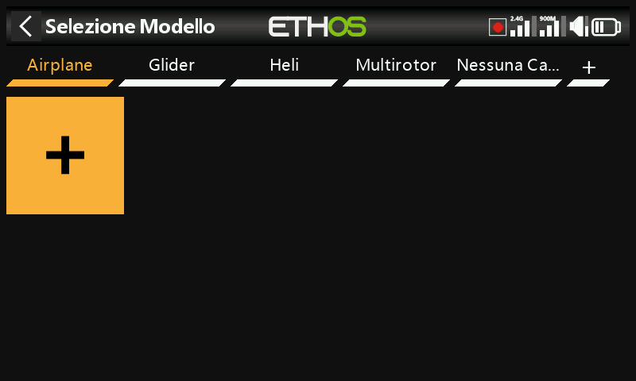

## Aggiunta di un nuovo modello

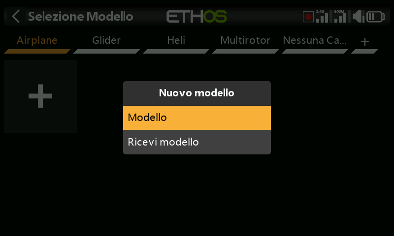

Seleziona la categoria in cui creare il modello, tocca **+**, quindi **Create
model** per avviare la procedura guidata (se la categoria non esiste ancora,
creala prima). Sono disponibili procedure guidate per **Airplane**, **Glider**,
**Helicopter**, **Multirotor** e **Other**; ciascuna guida attraverso la
configurazione di base per quel tipo di modello, inclusi i mix preimpostati
opzionali per i ricevitori stabilizzati FrSky (guadagno, modalità di
stabilizzazione). I nomi dei modelli possono avere fino a 15 caratteri.

### Ricevitori stabilizzati e ordine dei canali

I ricevitori stabilizzati FrSky richiedono specificamente l'ordine dei canali
**AETR** — lascia [Sticks → Ordine dei canali](../system-setup/controls.md) sul
valore predefinito AETR con **First four channels fixed** attivo, in modo che
l'uscita della procedura guidata corrisponda a quanto il ricevitore si aspetta.

La procedura guidata assegna i canali da destra a sinistra. Per 2 alettoni +
1 elevatore + 1 timone + 1 motore si ottiene:

| Can. | Funzione |
|---|---|
| 1 | Alettone 1 (alettone destro) |
| 2 | Elevatore |
| 3 | Gas - Throttle |
| 4 | Timone |
| 5 | Alettone 2 (alettone sinistro) |

Con questa assegnazione, il differenziale degli alettoni è **positivo** nel caso
normale (escursione verso l'alto maggiore di quella verso il basso). I manuali
dei ricevitori FrSky documentano attualmente la convenzione *opposta* (da
sinistra a destra, quindi Can.1 = alettone sinistro, Can.5 = alettone destro) —
in tal caso il differenziale dovrebbe essere **negativo** per ottenere lo stesso
effetto fisico.

!!! tip
    Si consiglia di utilizzare in modo coerente la convenzione Ethos — in
    entrambi i casi tutte le funzioni di stabilizzazione continuano a
    funzionare correttamente, poiché la direzione della compensazione viene
    impostata durante la configurazione della stabilizzazione. Se occorre
    davvero adeguarsi alla convenzione del manuale del ricevitore, la via più
    semplice consiste nel costruire il modello normalmente con la procedura
    guidata e utilizzare poi **Swap channels** in [Uscite](outputs.md) per
    scambiare i due canali degli alettoni — in questo modo il segno del
    differenziale nel mix degli alettoni rimane positivo.

### Passaggi della procedura guidata

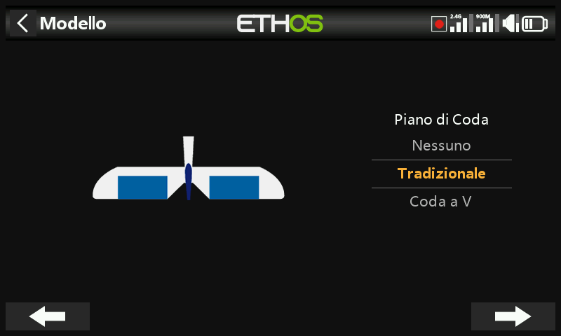
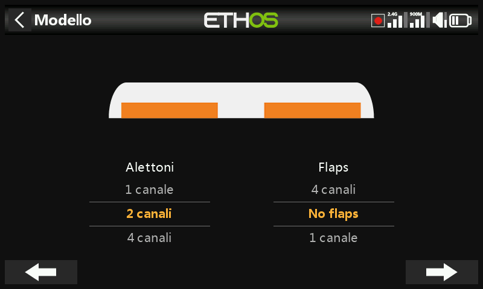
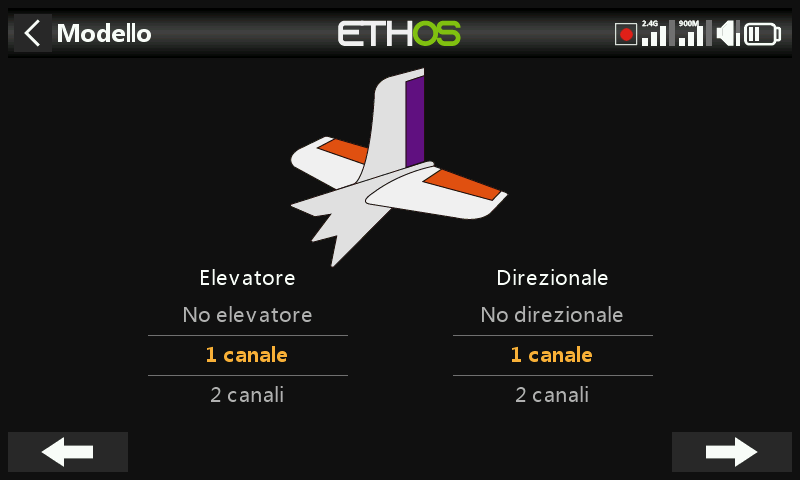
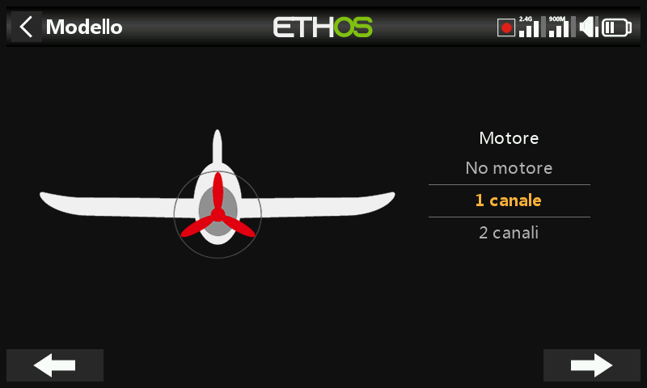
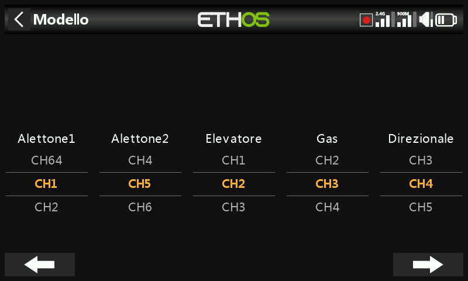
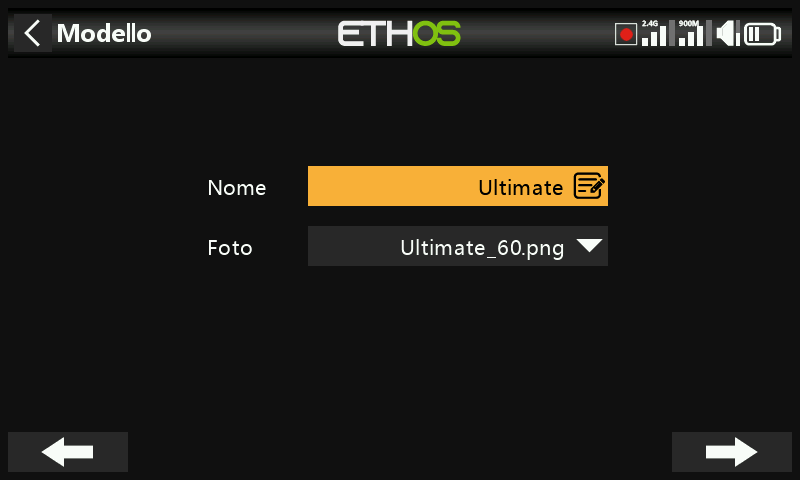
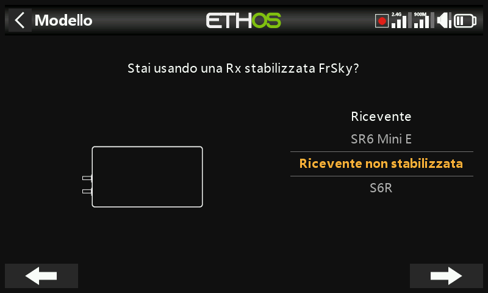

Per un **Airplane**, dopo il tipo di coda e il numero delle superfici, la
procedura guidata richiede il numero di canali per il motore e poi il numero di
canali per alettoni/flap.

La **configurazione della coda** offre la scelta fra coda tradizionale a croce,
coda a V oppure nessuna coda (delta/tuttala):

- **Delta/tuttala** — creando un modello Airplane con 2 alettoni e nessuna
  superficie di coda viene generato automaticamente il mix degli elevoni, con
  pesi predefiniti del 50%, in modo che i comandi simultanei a fondo corsa di
  alettoni ed elevatore diano comunque un totale del 100%.
- **Delta con il mix eseguito da un ricevitore stabilizzato** — seleziona invece
  1 alettone e 1 elevatore; il mix degli elevoni avviene nel ricevitore, secondo
  il relativo manuale.
- **Delta con superfici dedicate di alettoni ed elevatore** — lascia procedere la
  procedura guidata come se il modello avesse una coda; verranno configurati i
  canali necessari per alettoni ed elevatore (con o senza timone) e non verrà
  creato alcun mix degli elevoni.

Il passaggio di **riassegnazione dei canali** permette di modificare la mappatura
predefinita della procedura guidata, tenendo presente che i ricevitori
stabilizzati richiedono i canali in un ordine specifico (consulta le istruzioni
del ricevitore). L'ultimo passaggio imposta il nome del modello e associa
un'immagine.

Il modello completato viene inserito nella cartella di categoria attiva al
momento dell'avvio della procedura guidata, ordinato alfabeticamente al suo
interno. Vedi [Esempio base per ala fissa](../tutorials/basic-fixed-wing.md) per
una procedura completa passo-passo.

## Ricezione di un modello da un'altra radio Ethos

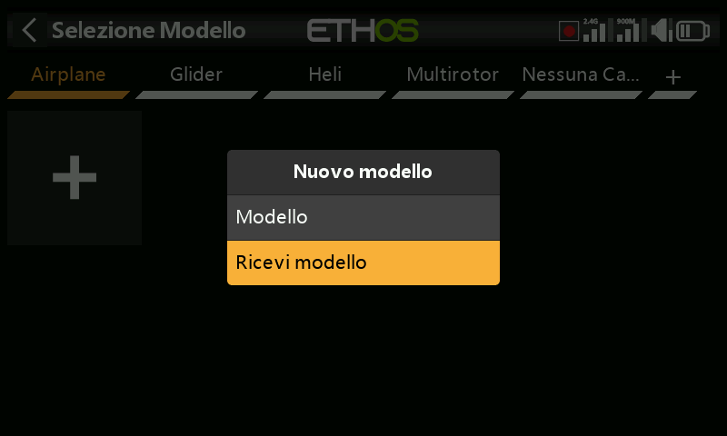

Seleziona la categoria di destinazione, tocca **+**, quindi **Receive model** —
la radio si mette in attesa e mostra il proprio indirizzo Bluetooth affinché il
mittente possa individuarla. Sulla radio trasmittente, tocca il modello e scegli
**Send model**; la radio ricevente chiede conferma del nome del file in arrivo
prima di accettarlo.

## Selezione di un modello

Tocca **Model select** per visualizzare l'elenco dei modelli.

!!! note "Conversione dei modelli dopo un aggiornamento di Ethos"
    Ethos converte ogni modello singolarmente la prima volta che viene
    *selezionato* dopo un aggiornamento di versione, e non tutti insieme al
    momento dell'aggiornamento — non si nota alcun ritardo ed è sicuro farlo in
    qualsiasi momento successivo, anche con una release di Ethos ancora più
    recente. La data di **Last Modification** in fondo alla schermata di
    selezione viene aggiornata quando avviene una conversione (o quando si
    modifica il modello — altrimenti resta invariata).

**Selezione rapida** — un tocco prolungato o una pressione lunga di `ENT`
sull'icona di un modello attiva immediatamente quel modello.

**Menu di gestione del modello** — tocca un modello per evidenziarlo, toccalo
nuovamente per aprire il menu:

- **Set current model**
- **Clone** — duplica il modello. Un clone riceve automaticamente un nuovo
  numero di ricevitore; se invece gli si riassegna il numero di ricevitore
  dell'originale, funziona senza dover rifare il binding.
- **Change folder**
- **Send**/**Receive** — verso o da un'altra radio, come sopra.
- **Delete** — disponibile solo per un modello che non sia quello corrente.
