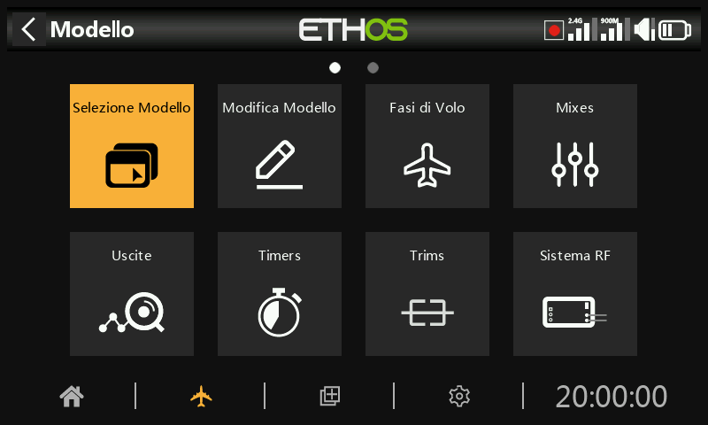
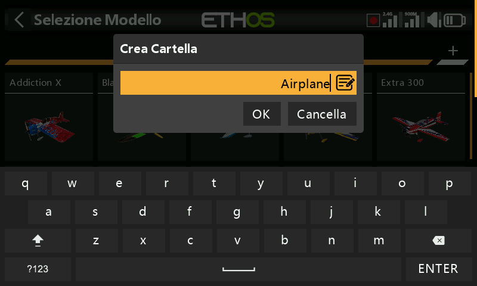
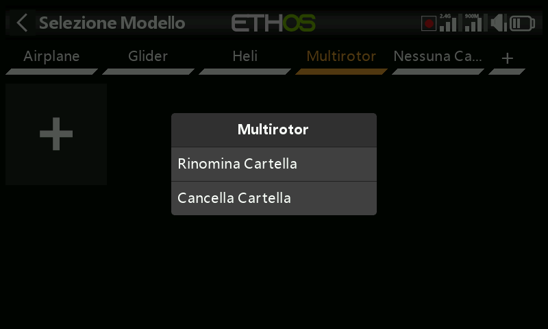
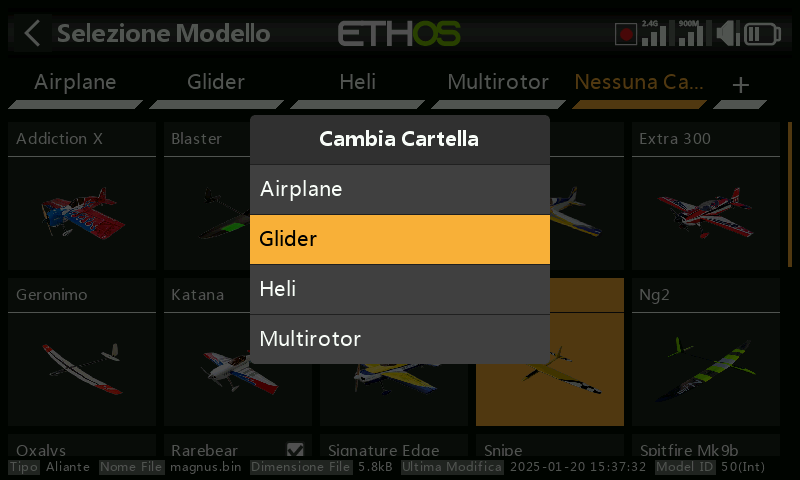
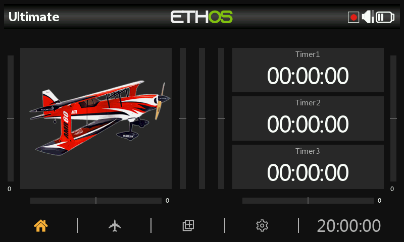
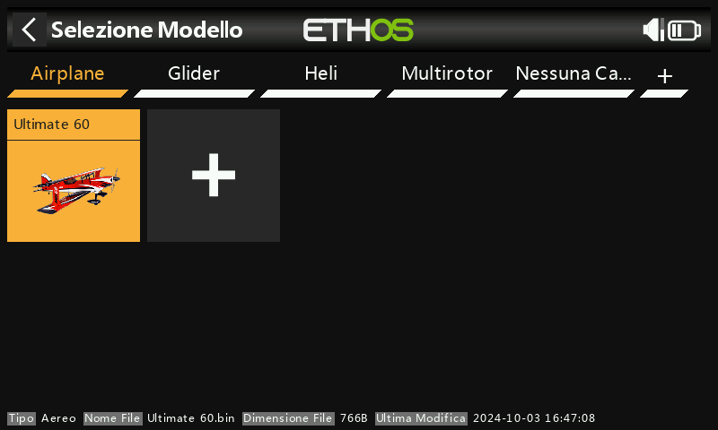
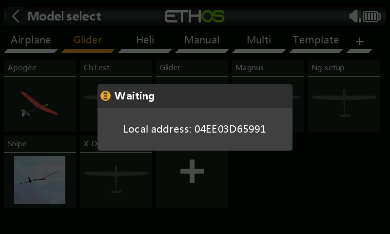
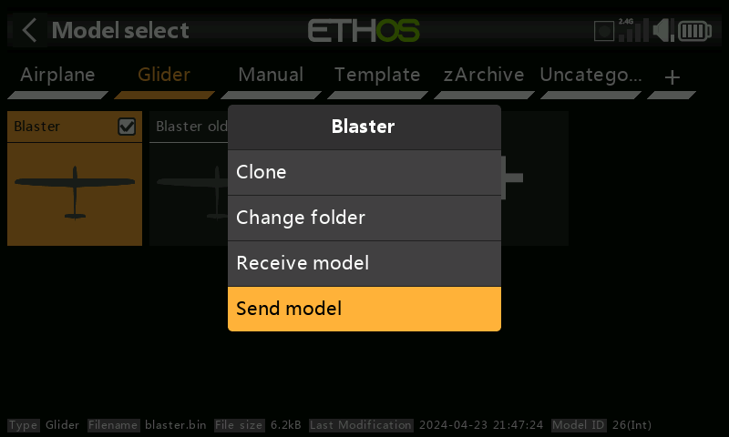
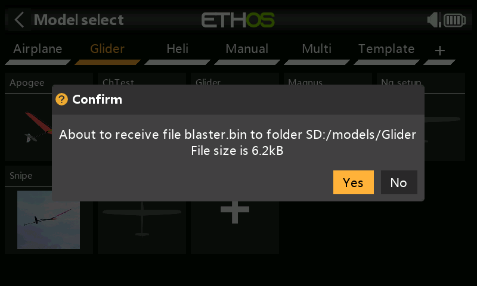

# **Seleziona il modello**

L'opzione di selezione del modello è accessibile selezionando "Seleziona modello" dal menu Modello. Serve per selezionare il modello corrente, aggiungere un nuovo modello, clonarlo o eliminarlo.

## Gestione delle cartelle dei modelli

Ethos ti permette di creare le tue cartelle modello per classificare e raggruppare i tuoi modelli. I nomi tipici delle cartelle dei modelli possono essere Aereo, Aliante, Heli, Quad, Uccello da guerra, Barca, Auto, Modello, Archivio ecc.

Finché non avrai creato e organizzato le tue cartelle, Ethos creerà automaticamente la cartella "Uncategorized". Questo accade quando aggiorni Ethos alla versione 1.1.0 alpha 17 o successiva, oppure quando copi un modello dalla rete o da un amico nella cartella \\Models della scheda SD o eMMC.  Ethos eliminerà automaticamente la cartella "Uncategorized" quando non sarà più necessaria.

Per creare la tua prima cartella, tocca il "+" a destra dell'etichetta "Uncategorized". Inserisci il nome nella finestra di dialogo "Crea cartella" e tocca OK. I nomi delle cartelle possono essere composti da un massimo di 15 caratteri. Ripeti l'operazione per le altre categorie. Nota che queste cartelle appaiono come sottocartelle sotto la cartella \\Models sulla scheda SD o eMMC.

Le cartelle delle categorie dei modelli sono ordinate in ordine alfabetico, ma la cartella "Uncategorized" apparirà sempre per ultima nell'elenco.

Toccando il nome di una cartella si aprirà una finestra di dialogo che permetterà di rinominare o eliminare la cartella. Se nella cartella che si sta cancellando erano presenti dei modelli, Ethos li collocherà automaticamente nella cartella "Uncategorized".

Spostare i modelli in un'altra cartella

Per spostare un modello in un'altra cartella, tocca l'icona del modello e seleziona "Cambia cartella" dalla finestra di dialogo.

Tocca la cartella in cui spostarla.

## Aggiunta di un nuovo modello

Per creare un nuovo modello, seleziona la categoria in cui desideri creare il modello, quindi tocca l'icona \[+\] per creare un nuovo modello o per ricevere un modello da un'altra radio Ethos via Bluetooth.

Tocca "Crea modello" per avviare la procedura guidata per la creazione di un nuovo modello. (Potrebbe essere necessario creare prima le categorie del modello, vedi sopra).

Scegli il tipo di modello che vuoi creare e segui le istruzioni.

Ci sono maghi per:

- Aereo
- Aliante
- Elicottero
- Multirotore
- Altro

Le procedure guidate ti assistono nella configurazione di base per il tipo di modello indicato. Nota che i nomi dei modelli possono essere composti da un massimo di 15 caratteri.

Le procedure guidate includono la possibilità di impostare ulteriori mix preimpostati per i ricevitori stabilizzati FrSky, come il guadagno e la modalità di stabilizzazione.

Ricevitori stabilizzati

I ricevitori stabilizzati FrSky richiedono un ordine di canali specifico, ovvero AETR. Pertanto, l'opzione "Ordine dei canali" nel menu Sticks deve essere lasciata all'impostazione predefinita AETR e l'opzione "Primi quattro canali fissi" deve essere attivata, per garantire che l'ordine dei canali creato dalla procedura guidata sia adatto al ricevitore.

Per un modello di tipo Aereo, la pagina successiva è Motore, che consente di selezionare il numero desiderato di canali motore (se presenti).

Per un modello di tipo aereo, si seleziona quindi il numero di canali per alettoni e flap.

A partire dalla versione 26.1.x di Ethos, le nuove procedure guidate assegnano i canali partendo da sinistra e alternando dall'esterno verso l'interno, in linea con la documentazione del ricevitore FrSky.  
  
Pertanto, per un modello semplice con 2 alettoni, 1 elevatore, 1 timone e 1 motore, l'ordine dei canali sarà il seguente (supponendo che l'impostazione predefinita “Ordine dei canali” sia AETR e che l'opzione “Primi quattro canali fissi” sia attiva):  
  
CH1 Alettone sinistro  
CH2 Elevatori   
CH3 Acceleratore   
CH4 Timoni   
CH5 Alettone destro

Aggiornamento modelli a Ethos 26.1.x

Durante l'aggiornamento a Ethos 26.1, i modelli esistenti possono essere convertiti per adattarsi al nuovo schema di conteggio da sinistra.  
  
Ci sono 3 scenari:  
  
a) I modelli esistenti con l'ordine dei canali predefinito 1.6.x che conta da destra vedranno i loro mix riorganizzati per adattarsi al nuovo schema di conteggio da sinistra. Tuttavia, l'assegnazione dei canali di uscita rimane la stessa, quindi non sono necessarie modifiche al cablaggio del modello. Solo i mix saranno riorganizzati in una nuova sequenza, ma le assegnazioni originali dei canali di uscita saranno mantenute affinché il modello continui a funzionare correttamente. Ad esempio l’ordine dei mix sarà:  
  
da   
CH1 Alettone destro   
CH2 Elevatori   
CH3 Acceleratore   
CH4 Timoni   
CH5 Alettone sinistro   
a   
CH5 Alettone sinistro   
CH2 Elevatori   
CH3 Acceleratore   
CH4 Timoni   
CH1 Alettone destro  
  
b) Nei modelli esistenti in cui i canali sono stati invertiti per contare da sinistra, le configurazioni saranno modificate per garantire che il differenziale degli alettoni continui a funzionare correttamente, ma l'assegnazione dei canali rimarrà la stessa di prima.  
  
c) I modelli esistenti che hanno avuto i loro canali scambiati invertendo il mix alettone e rinominando i canali di uscita funzioneranno correttamente dopo l'aggiornamento, ma subiranno un conflitto nella denominazione dei canali. Per risolvere questo problema, è necessario annullare le modifiche di inversione del mix apportate in precedenza:  
  
i) Invertire nuovamente il mix alettone con valori positivi per il peso e il differenziale.  
ii) Scambiare i canali di uscita del mix Aileron utilizzando la funzione “Swap” nel menu Canali.  
iii) Rinominare anche i due canali con le loro corrette funzioni sinistra e destra.

iv) **Attenzione!** Dopo aver effetuato i cambiamenti, confermate  che i mix e i canali di uscita funzionino nell’ordine corretto con l’eventuale elica/eliche rimosse.  
  
Per una revisione più dettagliata dei tre scenari di conversione, fare riferimento all'[Appendice A - Conversione dei modelli Ethos dalla versione 1.6.x alla versione 26.1.x.](../how-to/converting-1.6-models.md)

Per un modello di tipo aereo, la configurazione della coda viene scelta tra la tradizionale coda a croce, la coda a V o nessuna coda (ad esempio su un delta o un'ala volante).

Ali Delta

L'impostazione degli elevoni può essere ottenuta creando un nuovo modello di aeroplano con 2 alettoni e nessuna superficie di coda; in questo modo la miscelazione degli elevoni verrà creata automaticamente. le escursioni di miscelazione predefiniti sono del 50% per ottenere un totale del 100% se si applicano contemporaneamente alettoni ed elevatore.

Per un modello ad ala a delta con superfici sia di alettoni che di elevatore, lascia che la procedura guidata si completi come se il modello avesse una coda. Configurerà i canali degli alettoni e dell'elevatore necessari, con o senza timone, come richiesto.

In alternativa, quando si utilizza un ricevitore stabilizzato, la miscelazione delta può essere eseguita dal ricevitore. Per maggiori dettagli, consulta il manuale del ricevitore stabilizzato.

Per un modello di tipo aereo, avendo scelto ad esempio una coda tradizionale, il numero di canali dell'elevatore e del timone può essere configurato

Dopo aver impostato le opzioni dei canali, il passaggio mostrato sopra ti permette di riassegnare le funzioni del modello a canali diversi. La procedura guidata rispetta l'"ordine dei canali" configurato in Sticks, ma questa schermata ti permette di riassegnare i canali, tranne quando configuri un ricevitore stabilizzato FrSky che richiede che i canali stabilizzati siano in un ordine specifico. Per maggiori dettagli, consulta le istruzioni del ricevitore.

Nell’ultimo step si potrà definire il nome del modello e collegare un immagine modello. NB: il nome modello può contenere fino a 15 caratteri.

Il nuovo modello è stato creato.

Il modello creato apparirà nella cartella della categoria di modelli definita dall'utente che era attiva all'avvio della procedura guidata e sarà ordinato in ordine alfabetico all'interno di ciascun gruppo.

Per un [esempio](https://www.deepl.com/en/translator?utm_term=&utm_campaign=IT%7CSearch%7CC%7CDSA%7CEnglish&utm_source=google&utm_medium=paid&hsa_acc=1083354268&hsa_cam=20627207960&hsa_grp=157168539729&hsa_ad=676252350153&hsa_src=g&hsa_tgt=dsa-437115340933&hsa_kw=&hsa_mt=&hsa_net=adwords&hsa_ver=3&gad_source=1&gclid=CjwKCAiAtYy9BhBcEiwANWQQL3EXIE2Cf7NSZZ0OYMKRgJCFeuGlPViCbNUpEZbVFRHTE1YdWYCrcBoCvrYQAvD_BwE#Basic%20Fixed%20Wing%20Airplane%20example) funzionale, consultare anche l'[esempio](https://www.deepl.com/en/translator?utm_term=&utm_campaign=IT%7CSearch%7CC%7CDSA%7CEnglish&utm_source=google&utm_medium=paid&hsa_acc=1083354268&hsa_cam=20627207960&hsa_grp=157168539729&hsa_ad=676252350153&hsa_src=g&hsa_tgt=dsa-437115340933&hsa_kw=&hsa_mt=&hsa_net=adwords&hsa_ver=3&gad_source=1&gclid=CjwKCAiAtYy9BhBcEiwANWQQL3EXIE2Cf7NSZZ0OYMKRgJCFeuGlPViCbNUpEZbVFRHTE1YdWYCrcBoCvrYQAvD_BwE#Basic%20Fixed%20Wing%20Airplane%20example) dell'[aereo ad ala fissa di base](https://www.deepl.com/en/translator?utm_term=&utm_campaign=IT%7CSearch%7CC%7CDSA%7CEnglish&utm_source=google&utm_medium=paid&hsa_acc=1083354268&hsa_cam=20627207960&hsa_grp=157168539729&hsa_ad=676252350153&hsa_src=g&hsa_tgt=dsa-437115340933&hsa_kw=&hsa_mt=&hsa_net=adwords&hsa_ver=3&gad_source=1&gclid=CjwKCAiAtYy9BhBcEiwANWQQL3EXIE2Cf7NSZZ0OYMKRgJCFeuGlPViCbNUpEZbVFRHTE1YdWYCrcBoCvrYQAvD_BwE#Basic%20Fixed%20Wing%20Airplane%20example) nella sezione Tutorial di programmazione.

## Denominazione dei canali di uscita del wizard

Le nuove procedure guidate per la creazione dei modelli utilizzano le seguenti regole di denominazione dei canali:  
  
            ▪ Quando il mix ha una sola uscita, non viene assegnata alcuna numerazione né alcun 					suffisso al nome.  
            ▪ Quando il mix esegue operazioni diverse sulle uscite, i canali di uscita devono avere 					un nome esplicito (ad esempio “sinistra” / “destra” per gli alettoni).  
            ▪ Quando il mix esegue esattamente gli stessi calcoli su tutte le uscite, il nome avrà 					semplicemente un numero come suffisso.

## Seleziona un modello

Tocca “Selezione modello” per visualizzare l'elenco dei tuoi modelli.

Si prega di notare che dopo un aggiornamento della versione di Ethos, ETHOS converte i modelli singolarmente quando vengono selezionati nella schermata di selezione dei modelli. Non è necessario selezionare ogni modello dopo un aggiornamento perché la conversione può avvenire in un secondo momento quando vengono selezionati, anche con una versione successiva di Ethos. Non vi è alcun ritardo evidente nel processo di conversione quando viene selezionato un modello. Quando avviene la conversione, la data dell'ultima modifica nella parte inferiore della schermata di selezione del modello cambierà con la data corrente. Se non è necessaria alcuna conversione, la data cambia solo se si apporta una modifica al modello.

Selezione Rapida

Toccando a lungo o premendo a lungo il tasto Invio su un'icona del modello, si passerà immediatamente a quel modello. Fare riferimento anche alla sezione “Imposta modello corrente” riportata di seguito.

## Menu gestione Modello

Tocca un modello per evidenziarlo, quindi toccalo nuovamente per visualizzare il menu di gestione dei modelli.

Imposta modello attuale

Tocca “Imposta modello corrente” per rendere corrente il modello evidenziato.

In alternativa, utilizza il metodo “Selezione rapida” descritto sopra.

Clona un modello

Tocca “Clona” per creare una copia clonata del modello evidenziato.

Si aprirà una finestra di dialogo che consente di personalizzare il clone.

Per impostazione predefinita, il sistema RF non viene clonato, il che significa che il modulo RF sarà disattivato nel clone, ma con un numero di modello diverso. Se si seleziona l'opzione “Sistema RF”, la configurazione RF, compreso il numero di modello, verrà clonata.

I mix di modelli, i timer e le curve non verranno clonati se deselezionati.  
Toccare “OK” per procedere.

Al termine, verrà visualizzata una finestra di dialogo di conferma “Modello clonato con successo!”..

Cambia Cartella

Per spostare un modello in un'altra cartella, tocca l'icona del modello, quindi seleziona “Cambia cartella” dalla finestra di dialogo.

Tocca la cartella per spostarla in.

Ricevi modello

Toccare “Ricevi modello” per avviare il processo di ricezione di un modello da un'altra radio Ethos tramite Bluetooth. Si prega di notare che l'operazione “Ricevi modello” deve essere avviata prima dell'operazione “Invia modello” nella radio mittente.

Finché non viene trovata una connessione Bluetooth, viene visualizzata la finestra di dialogo “In attesa di connessione”.

Una volta stabilita la connessione, viene visualizzata una finestra di dialogo “In attesa di ricezione” che richiede la conferma per procedere.

Il trasferimento dei file ha inizio e viene visualizzata una barra di avanzamento, seguita da un messaggio di completamento al termine dell'operazione.

Invia modello

Toccare “Invia modello” per avviare il trasferimento di un modello a un'altra radio Ethos tramite Bluetooth. Si prega di notare che l'opzione “Ricevi modello” deve essere avviata prima dell'opzione “Invia modello” nella radio mittente.

Finché non viene trovata una connessione Bluetooth, viene visualizzata la finestra di dialogo “In attesa di dispositivi”.

Una volta individuati i dispositivi, viene visualizzata una finestra di dialogo per la selezione del dispositivo. Selezionare il dispositivo a cui inviare il modello.

Il trasferimento dei file ha inizio e viene visualizzata una barra di avanzamento.

Al termine dell'operazione viene visualizzato un messaggio di conferma.

Cancella

Tocca “Elimina” per eliminare un modello. Questa opzione non è disponibile sul modello attivo.

## Ricevere un modello da un'altra radio Ethos

Per ricevere un modello, seleziona la categoria in cui desideri creare il modello, quindi tocca l'icona \[+\].

Tocca "Ricevi modello" per avviare il processo di ricezione di un modello da un'altra radio Ethos via Bluetooth.

La radio entrerà in modalità di attesa e visualizzerà anche il suo indirizzo Bluetooth locale per consentire l'identificazione dell'indirizzo corretto sulla radio mittente.

Nella radio di invio, tocca l'icona del modello e seleziona "Invia modello" per avviare il trasferimento.

La radio ricevente annuncerà il file del modello che sta per essere ricevuto per conferma. Tocca Sì per ricevere il modello.

## Selezione di un modello

Tocca "Seleziona modello" per visualizzare l'elenco dei tuoi modelli.

Tieni presente che dopo un aggiornamento della versione di Ethos, ETHOS converte i modelli singolarmente quando vengono selezionati nella schermata di selezione dei modelli. Non è necessario selezionare ogni modello dopo un aggiornamento perché la conversione può avvenire in un secondo momento quando vengono selezionati, anche con una versione successiva di Ethos. Il processo di conversione non subisce alcun ritardo quando viene selezionato un modello. Quando avviene la conversione, la data dell'ultima modifica in fondo alla schermata di selezione del modello cambia nella data attuale. Se non è necessaria una conversione, la data cambia solo se si effettua una modifica del modello.

Selezione rapida

Toccando a lungo o Invio a lungo sull'icona di un modello si passa immediatamente a quel modello.

Menu di gestione del modello

Tocca un modello per evidenziarlo, poi toccalo di nuovo per visualizzare il menu di gestione del modello.

Opzioni nel menu di gestione del modello:

- Tocca "Imposta modello corrente" per rendere il modello evidenziato il modello corrente.
- Puoi clonare il modello, che verrà duplicato. Tieni presente che quando cloni un modello, Ethos assegna al clone un nuovo numero di ricevitore. Se gli dai il vecchio numero di ricevitore funzionerà, non c'è bisogno di rifare la connessione.
- Cambia la cartella del modello.
- Puoi inviare o ricevere il modello a o da un'altra radio.
- In alternativa, puoi eliminare il modello. Nota che l'opzione Elimina appare solo se il modello selezionato non è quello corrente.
