# Canali

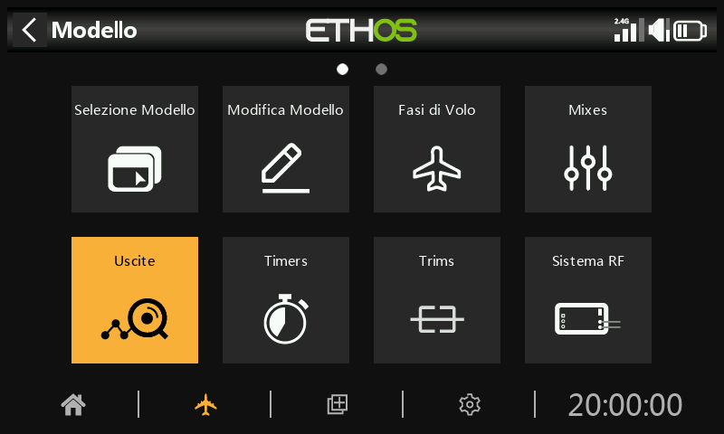

La sezione Uscite è l'interfaccia tra la "logica" di configurazione e il mondo reale con servi, collegamenti e superfici di controllo, nonché attuatori e trasduttori. Nelle Mix abbiamo impostato le azioni che vogliamo far compiere ai nostri diversi controlli. Questa sezione permette di adattare queste uscite logiche pure alle caratteristiche meccaniche del modello. È qui che configuriamo le escursioni minime e massime, l'inversione del servo o del canale e regoliamo il punto centrale del servo o del canale utilizzando la regolazione del centro PPM, oppure aggiungiamo un offset utilizzando il subtrim. Possiamo anche definire una curva per correggere eventuali problemi di risposta nel mondo reale. Esiste anche una funzione di bilanciamento canali. I vari canali sono uscite, ad esempio CH1 corrisponde al connettore del servo numero 1 del ricevitore (con le impostazioni di protocollo predefinite).

Sebbene la radio sia configurata utilizzando le percentuali come ingresso, i servi e i dispositivi di uscita sono controllati da un segnale PWM (Pulse Width Modulation) in μs (microsecondi). La relazione tra le unità è la seguente:

-150%	=	732 μs

-100%	=	988 μs

0%	=	1500 μs

100%	=	2012 μs

150%	=	2268 μs

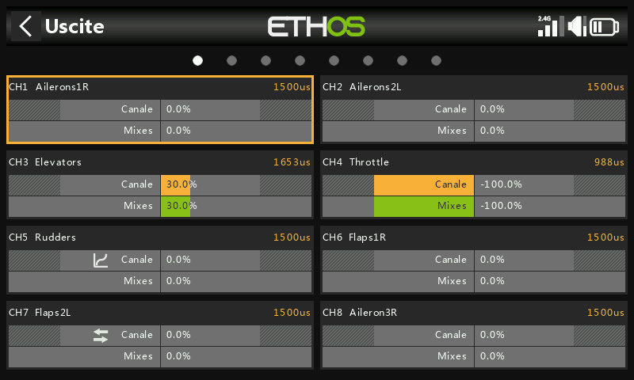

La schermata Uscite mostra due grafici a barre per ogni canale. La barra inferiore (verde) mostra il valore dei mix per il canale, mentre quella superiore (arancione) mostra il valore effettivo (in termini sia di % che di µS) dell'uscita dopo l'elaborazione delle uscite, ovvero ciò che viene inviato al ricevitore. Nell'esempio precedente puoi vedere che sia i mix che i valori di uscita del canale CH4 Throttle sono a -100%.

Le impostazioni minime e massime del Canale sono indicate dalle sezioni in grigio nella barra superiore (arancione). Per la loro regolazione, consulta la sezione seguente.

I canali che non vengono trasmessi al modulo RF sono indicati con uno sfondo più scuro.  Nell'esempio precedente, tutti gli otto canali vengono trasmessi, quindi hanno uno sfondo grigio più chiaro.

Le icone        appaiono sul display di un canale se sono state modificate le impostazioni predefinite per la [Direzione ](outputs.md)di uscita, la [Curva ](outputs.md)di uscita, il [Lento su/giù ](outputs.md)o se è stato configurato [il Bilanciamento dei canali](outputs.md). Per maggiori dettagli, consulta le rispettive impostazioni qui di seguito.

Nota: per accedere rapidamente a questa schermata di monitoraggio, premendo a lungo il tasto Invio dalle schermate "Mix" e "Fasi di volo" si passa alle Uscite.

## Configurazione delle uscite

Tocca il canale di uscita da modificare o rivedere.

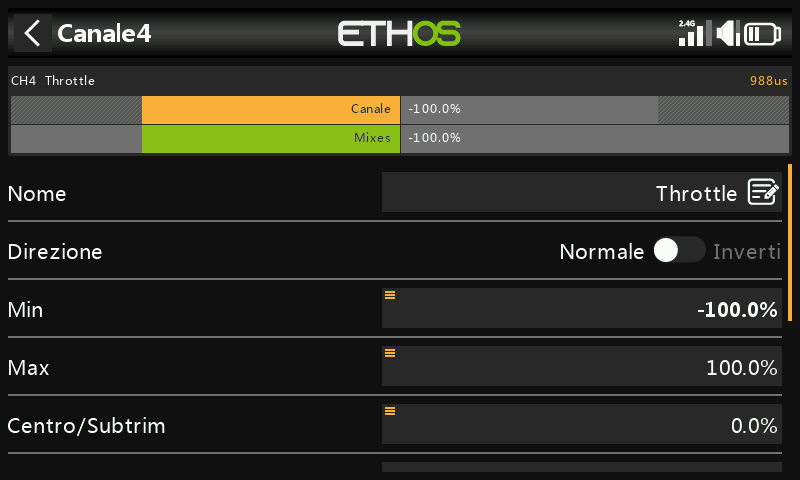

Anteprima del canale

Nella parte superiore della schermata di impostazione delle uscite viene visualizzata un'anteprima del canale. Il valore del mix è indicato in verde, mentre il valore dell'uscita del canale è indicato in arancione (tema predefinito). I settaggi dei punti min e max del canale sono indicati dalla sezione grigia nella barra superiore gialla(arancione).

Nome

Il nome può essere modificato.

Direzione

Cambia la direzione dell'uscita del canale, in genere per invertire la direzione del servo.

	Quando è abilitata, nella visualizzazione del grafico del canale viene visualizzata un'icona a doppia freccia; fai riferimento a CH7 Flaps2L nella schermata delle uscite qui sopra.

Tieni presente che questo non influisce sui mix che pilotano l'uscita e non cambia i limiti di min/max (vedi sotto).

Min/Max

Le impostazioni minime e massime del Canale sono limiti "rigidi", cioè non potranno mai essere superati. Devono essere impostati in modo da evitare un vincolo meccanico. Si noti che servono come impostazioni di guadagno o "punto finale", quindi la riduzione di questi limiti ridurrà la gittata piuttosto che indurre il clipping. Si noti che i limiti sono predefiniti a +/- 100,0%, ma possono essere aumentati fino a +/- 150,0%.

Le impostazioni minime e massime del Canale sono indicate dalle sezioni in grigio nella barra superiore (arancione).

Attenzione:

Quando si utilizza un sistema di ridondanza con SBUS, non è possibile effettuare movimenti del servo superiori a +/- 125%.

Nota: i parametri Min/Max hanno intervalli rispettivamente di (-150% a 0%) e (0% a +150%). Quando si utilizzano i VAR come fonte per regolare i parametri Min/Max, a meno che il Var non abbia un intervallo identico, sarà necessario impostare l'intervallo del Var come ignorato per evitare valori inaspettati dovuti alla conversione dell'intervallo. Per maggiori dettagli su questa opzione, consulta la sezione [Opzioni Var](../getting-started/user-interface-and-navigation.md).

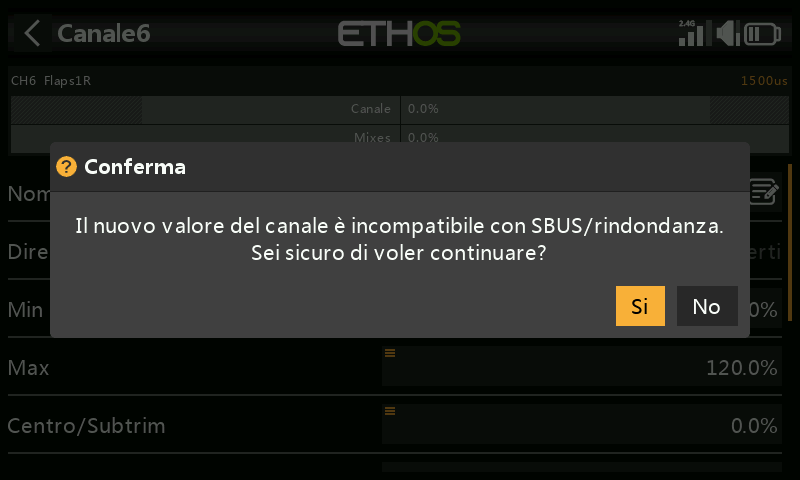

Se si utilizza più del 125% sul ricevitore principale che pilota le uscite PWM e questo ricevitore entra in failsafe, le posizioni del servo ricevute da un ricevitore ridondante via SBUS sono limitate al 125%.

In particolare, se un'uscita del ricevitore principale supera il 125%, al momento del passaggio al ricevitore ridondante l'uscita passerà al 125%.

Aiuto per la configurazione

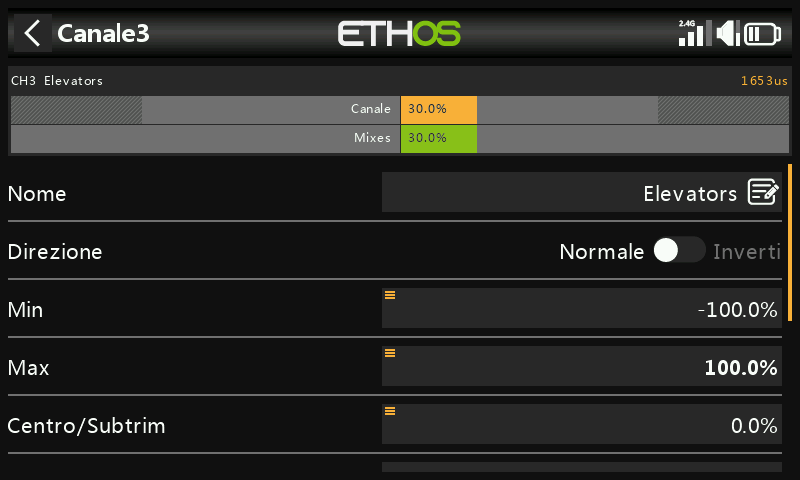

Quando si regolano i limiti di uscita min/max, l'estremità da regolare è evidenziata in grassetto.

Ad esempio, se vuoi impostare il punto finale massimo per il canale dell'elevatore, quando sposti leggermente in avanti lo stick dell'elevatore, il valore massimo viene mostrato in grassetto per indicare che è il punto finale da regolare. Se sposti lo stick indietro, il valore minimo sarà in grassetto.

Centro/Subtrim

Si usa per introdurre un offset sull'uscita, in genere per centrare un braccio di un servo. Nota che gli endpoint non vengono influenzati.

Attenzione:

Non essere tentato di usare il Subtrim per aggiungere grandi offset: si creerà un grande differenziale nella risposta del servo. Il modo corretto è aggiungere un mix di offset.

Centro PWM

Si tratta di un'operazione simile al subtrim, con la differenza che una regolazione effettuata qui sposterà l'intera banda di movimento del servo (compresi i limiti rigidi). Questa regolazione non sarà visibile sul monitor del canale perché viene effettivamente effettuata nel servo. Il vantaggio di utilizzare "PWM center" per centrare meccanicamente la superficie di controllo è che in questo modo si separa la funzione di centratura da quella di trimming.

Curva

Permette di selezionare una curva Expo o una curva personalizzata per condizionare l'uscita. Il popup permette di selezionare una curva esistente o di aggiungerne una nuova.  Dopo aver configurato la curva, viene aggiunto il pulsante Modifica per poterla modificare facilmente.

	Quando è abilitata, l'icona di una curva viene visualizzata nel grafico del canale; fai riferimento a CH5 Rudders nella schermata delle uscite qui sopra.

Rallenta su/giù

La risposta dell'uscita può essere rallentata rispetto alla variazione dell'ingresso. Slow può essere utilizzato, ad esempio, per rallentare i ritratti che vengono azionati da un normale servo proporzionale. Il valore è il tempo in secondi che l'uscita impiega per passare da 0 a +100%.

 Quando è configurata, l'icona dell'orologio viene visualizzata nel grafico del canale.

Ritardo

Tieni presente che la funzione di ritardo è disponibile tra gli interruttori logici.

Scambio di canali

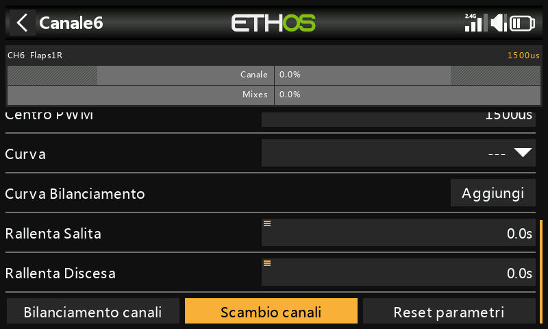

Questa funzione permette di scambiare due canali di uscita.

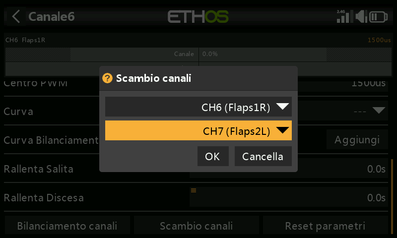

La finestra di dialogo di scambio si apre con il primo canale già compilato. Seleziona il canale da scambiare e clicca su OK. Nota che lo scambio avviene immediatamente.  Tutti i mix e così via verranno regolati di conseguenza.

Ripristina le impostazioni

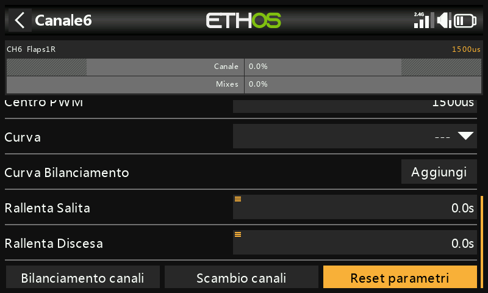

Il reset delle impostazioni cancella tutti i parametri del canale di uscita se il canale non è più necessario. Una finestra di conferma eviterà un reset accidentale.

In questo modo si eviterà che le impostazioni non siano quelle predefinite se il canale viene riutilizzato per qualcos'altro.

Bilanciamento Canali

Questa funzione ti permette di bilanciare coppie selezionate o un gruppo di massimo 4 canali per garantire che si muovano all'unisono. Ad esempio, uno sbilanciamento dei flap può causare un rollio indesiderato, mentre uno sbilanciamento delle manette sui modelli multimotore può causare un'imbardata indesiderata.

Panoramica

Questa funzione crea automaticamente una curva di bilanciamento differenziale per ogni canale selezionato. È possibile scegliere il numero di punti di bilanciamento. Confrontando le posizioni fisiche delle superfici di controllo (come i flap) in ogni punto delle curve, è possibile regolarle facilmente in modo che siano uguali. Il risultato finale è un perfetto tracciamento delle superfici.

Prerequisiti

Prima di bilanciare i canali, è necessario seguire la procedura consigliata:

- Imposta le direzioni del servo per una corretta corsa delle superfici.
- Con le Mixer in posizione neutra, usa facoltativamente il PWM Center per impostare le squadrette dei servi ad angolo retto.
- Configura i limiti Min/Max e il Subtrim.
- Configura qualsiasi altra curva.
- Configura Slow.
- Procedi con i canali di bilanciamento per bilanciare ed equalizzare le superfici di controllo in più punti della corsa.

Come si usa

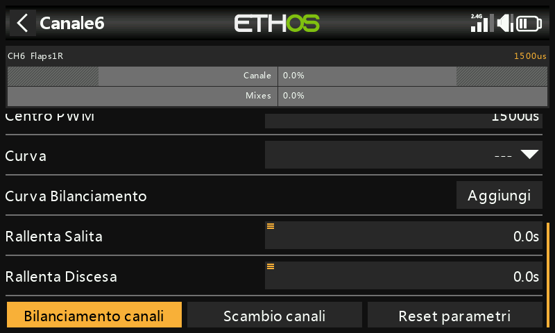

Apri la pagina Modifica canale per il canale più a sinistra che desideri bilanciare. In questo esempio abbiamo scelto il canale 6 “Flap1 L”. Scorri verso il basso e tocca “Bilancia canali” per iniziare.

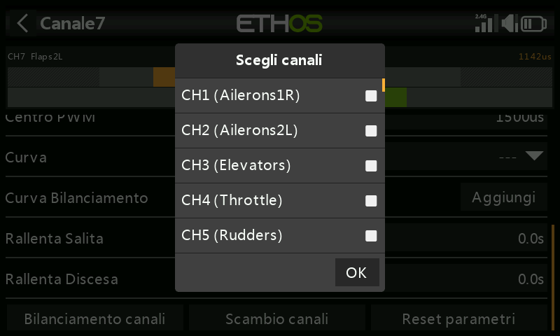

Quando viene attivata, vengono scelti i canali da bilanciare.

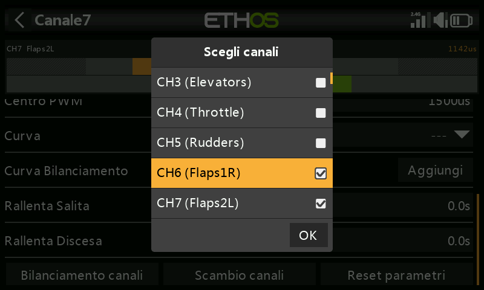

Seleziona i canali nell'ordine in cui desideri visualizzarli. Nel nostro esempio CH6 (Flap1 L) era già selezionato perché abbiamo iniziato su questo canale.  
Sulle radio senza touchscreen, scorrere fino al canale o ai canali desiderati e premere ENT per selezionarli. Infine, premere il tasto Page per evidenziare il pulsante OK, quindi premere ENT per confermare le selezioni.

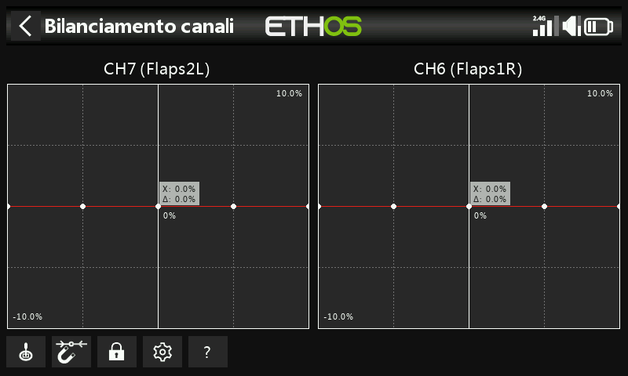

I canali verranno visualizzati nell'ordine di selezione. In questo esempio, è stato selezionato prima il CH7 Flap Left e poi il CH6 per il Flap Right. Le uscite del mix sono visualizzate lungo gli assi X, mentre i valori differenziali di regolazione del bilanciamento sono visualizzati sugli assi Y.

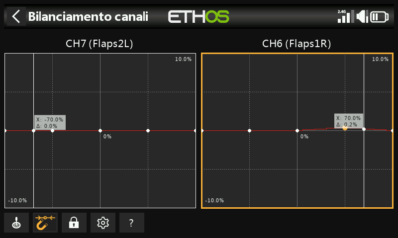

Tocca il grafico di un canale (o scorrilo e premi ENTER) per modificare la curva di bilanciamento. Il tasto PAGE permette di passare da un canale all'altro durante la modifica.

- Pulsanti del menu

 Possono essere utilizzate le sorgenti configurate nei mix dei canali o, opzionalmente, qualsiasi altro ingresso analogico comodo. Se selezioni l'opzione "Ingresso analogico automatico", il primo stick, cursore o potenziometro che sposti sarà utilizzato come sorgente per X, non solo nel grafico, ma anche nel modello.

Se abilitato, il punto più vicino alla curva sull'asse X verrà selezionato automaticamente per la regolazione con l'encoder rotativo, come nell'esempio precedente.

L'ingresso deve essere regolato per allineare il valore X con un punto della curva prima di effettuare la regolazione.

 Toccando l'icona o premendo il tasto ENTER mentre sei in modalità di modifica del grafico, la modalità di blocco viene attivata o disattivata. Quando è attivata, tutti gli input sono bloccati in modo da poter rilasciare l'input dello stick, consentendoti di osservare le superfici di controllo mentre regoli la curva.

 Apri la finestra di configurazione per i canali scelti. È possibile modificare il numero di punti di tutte le curve, o solo di alcune, e scegliere se smussarle o meno.

**?** Questo pulsante richiama il file di aiuto. Può essere richiamato anche con il tasto MDL.

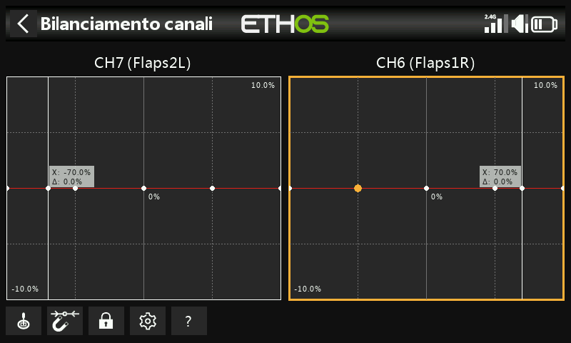

Nell'esempio precedente, l'opzione Magnete è stata deselezionata. Il punto della curva da regolare è evidenziato e può essere spostato con i tasti "SYS" e "DISP".

Anche in questo caso, l'ingresso deve essere regolato per allineare il cursore (valore X) con un punto della curva prima di effettuare la regolazione.

Opzione multicanale

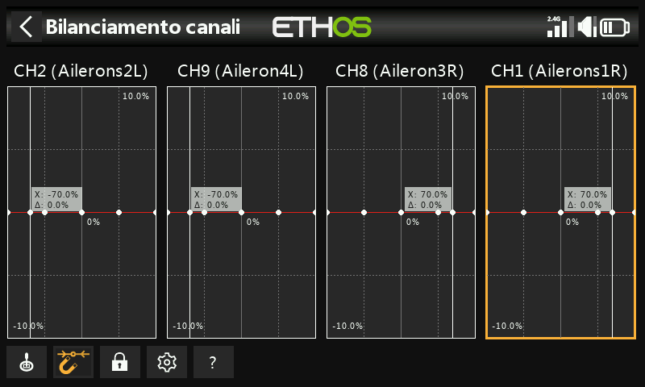

È possibile bilanciare fino a 4 canali contemporaneamente.

Anche in questo caso, i canali devono essere selezionati nell'ordine in cui si desidera che vengano visualizzati, normalmente dalle superfici da sinistra a destra. L’esempio di cui sopra mostra un assegnazione canali da una ricevente TD SR12.

Rivedere, modificare o cancellare la curva di bilanciamento

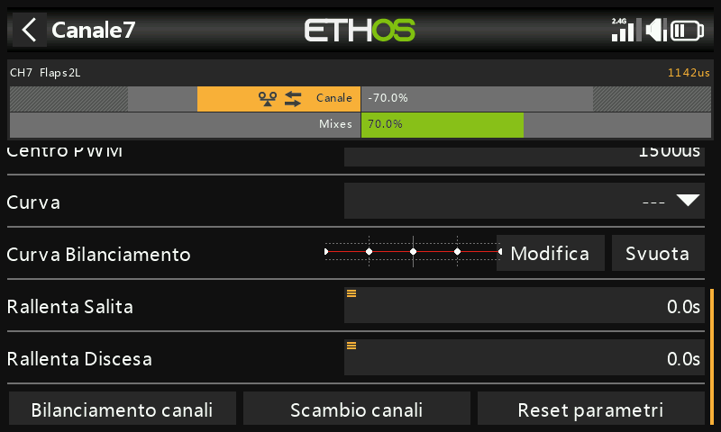

Una volta che un canale è stato bilanciato, la sua curva di bilanciamento può essere rivista, modificata o cancellata dalla pagina di configurazione del canale.

	Nota che sul grafico del canale viene visualizzata un'icona di bilanciamento (barra arancione). Nell'esempio precedente viene visualizzata anche l'icona della direzione, che indica che l'uscita è stata invertita, come si può vedere anche dal grafico che mostra che la direzione dell'uscita è opposta a quella del mixer.
