# Sistema RF

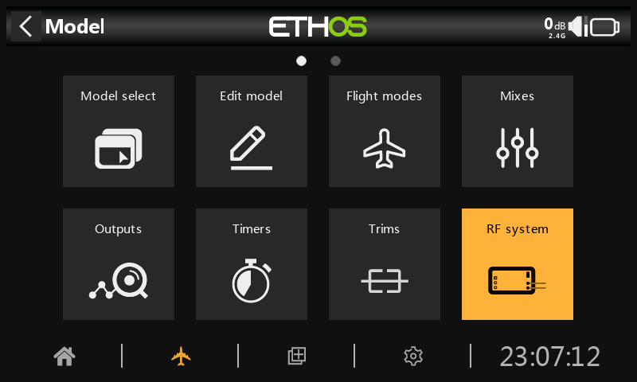

Questa sezione serve a configurare i moduli RF interni e/o esterni, compreso l'ID di registrazione del proprietario.

## Disabilitare l'uscita RF

I moduli RF interni ed esterni possono essere disattivati tenendo premuto il tasto Page durante l'accensione del sistema. Riceverai un avviso che indica che l'HF è permanentemente spento. Tuttavia, lo stato dei moduli RF rimane attivo. Se riavvii il trasmettitore, viene ripristinato lo stato normale.

## ID di registrazione del proprietario

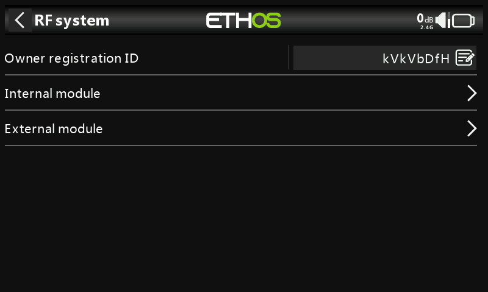

L'"ID di registrazione del proprietario" è un ID di 8 caratteri che contiene un codice univoco casuale, che può essere modificato se lo si desidera. Questo ID diventa l'"ID di registrazione" quando si registra un ricevitore (vedi sotto). Inserisci lo stesso codice nel campo "ID di registrazione del proprietario" degli altri trasmettitori con cui vuoi utilizzare la funzione Smart Share. Questa operazione deve essere eseguita prima di creare il modello su cui si vuole utilizzare la funzione.

Nota sulla compatibilità con OpenTX e EdgeTX

L'"ID di registrazione del proprietario" è compatibile con EdgeTX ma solo in parte con OpenTX. Deve essere composto da otto caratteri; può contenere un mix di lettere maiuscole, minuscole e numeri, ma non caratteri speciali.

## Modulo interno TD-ISRM (X18 e X20/S/HD)

Per il modulo RF TD ISRM Pro consulta la sezione [Modulo interno TD-ISRM Pro](rf-system.md).

Panoramica

Il modulo RF interno delle radio X18 e X20/S/HD è di nuova concezione e fornisce percorsi RF in tandem a 2,4GHz e 900MHz. Può funzionare in 3 modalità: ACCESS, ACCST D16 o TD MODE.

**Attenzione**! In questo manuale e nei menu della radio "900M" è un termine generico che indica la banda VHF utilizzata. Le frequenze operative effettive sono 915Mhz per la FCC o 868Mhz per la LBT, a seconda del paese in cui l'utente opera.

Stato

Il modulo RF interno può essere acceso o spento.

Tipo

Modalità di trasmissione del modulo RF interno. I modelli X20/X20S operano sulla banda 2.4GHz e/o 900MHz. Le modalità ACCESS e TD (Tandem) possono funzionare contemporaneamente (o singolarmente) sulla banda 2.4GHz e/o 900MHz, mentre l'ACCST D16 funziona solo sulla banda 2.4GHz. La modalità deve corrispondere al tipo supportato dal ricevitore, altrimenti il modello non si aggancia! Dopo il cambio di modalità, controlla attentamente il funzionamento del modello (soprattutto il Failsafe!) e verifica che tutti i canali del ricevitore funzionino come previsto.

Modalita ACCESS

In modalità ACCESS i percorsi RF 2.4G e 900M lavorano in tandem con un unico set di controlli ACCESS. Possono esserci tre ricevitori 2.4G registrati e vincolati o tre ricevitori 900M registrati e vincolati o una combinazione di 2.4G e 900M per un totale di tre ricevitori.

In modalità ACCESS con una combinazione di ricevitori 2.4G e 900M, la telemetria dei collegamenti RF 2.4G e 900M è attiva contemporaneamente. I sensori sono identificati nella telemetria come 2.4G o 900M. Si noti che la banda 2.4G supporta 24 canali, mentre la banda 900M supporta 16 canali.

Esiste una nuova funzione di fonte di ricezione telemetrica di ETHOS chiamata RX. RX fornisce il numero del ricevitore attivo che invia la telemetria. RX è disponibile in telemetria come qualsiasi altro sensore per la visualizzazione in tempo reale, gli interruttori logici, le funzioni speciali e la registrazione dei dati.

Per i dettagli sulla configurazione, consulta la sezione ACCESS qui sotto.

Modalità ACCST D16

Nell'ACCST D16 il modulo RF diventa un unico percorso RF 2.4G.

Consulta la sezione [ACCST D16 ](rf-system.md)qui di seguito.

Modalità TD

In modalità TD il modulo RF è in modalità long range a bassa latenza e utilizza i collegamenti RF 2.4G e 900M in Tandem per lavorare con i nuovi ricevitori Tandem. Tandem supporta 24 canali su entrambe le bande.

Consulta la sezione [Modalità TD ](rf-system.md)di seguito.

Opzioni del firmware Flex

Quando si tratta di scegliere la versione del firmware, la maggior parte degli utenti utilizza semplicemente una delle due:

(a) la versione LBT (Listen Before Talk) se nell'UE, che comunica a 868Mhz in modalità 900M, oppure

(b) la versione FCC nel resto del mondo, che comunica a 915Mhz in modalità 900M.

Tuttavia, la versione Flex offre la possibilità di passare da una all'altra quando si utilizzano le modalità ACCESS, ACCST D16 o TD.

Le schermate di configurazione cambiano come mostrato sopra.  Alla voce Tipo sono presenti due colonne. La prima serve a selezionare il protocollo FrSky (ACCESS, ACCST D16 o modalità TD).

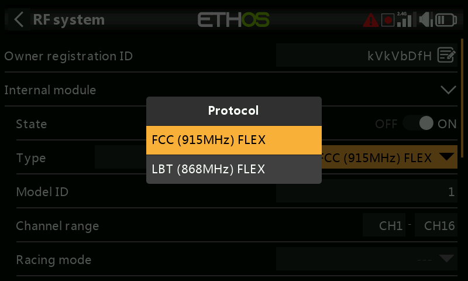

La seconda colonna serve per selezionare FLEX915M o FLEX 868M.

Quando selezioni FLEX915M, la banda 2.4G passa alla modulazione FCC. Quando selezioni FLEX868M, la banda 2.4G passa alla modulazione europea LBT.

Le antenne devono essere cambiate per adattarsi alla frequenza selezionata.

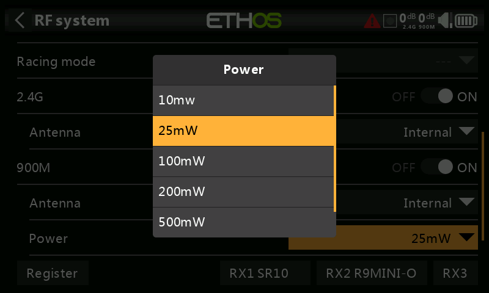

Entrambe le versioni consentono di configurare diversi livelli di potenza.

**Nota per gli utenti dell'UE**: L'uso di 200mW e 500 mW è consentito nella banda degli 868 MHz. Con l'ultimo aggiornamento TD e l'aggiornamento RF, questi livelli di potenza funzionano anche con la telemetria. Per la conformità, se selezioni 25mW i dati di telemetria saranno inviati tramite 868MHz, mentre con 200mW o 500 mW i dati di telemetria saranno inviati tramite 2.4G.

Note:

a) con ACCESS puoi avere un mix di fino a tre ricevitori 900M o 2.4G

b) l'opzione ACCST D16 è solo 2.4G

c) con la modalità TD puoi avere tre ricevitori TD

Tipo: ACCESS

ACCESS cambia il modo in cui i ricevitori sono legati e collegati al trasmettitore. Il processo è suddiviso in due Fasi. La prima fase consiste nel registrare il ricevitore alla radio o alle radio con cui deve essere utilizzato. La registrazione deve essere eseguita una sola volta per ogni coppia ricevitore/trasmettitore. Una volta registrato, un ricevitore può essere collegato e rilegato in modalità wireless con qualsiasi radio con cui è registrato, senza utilizzare il pulsante di collegamento sul ricevitore.

Dopo aver selezionato la modalità ACCESS, è necessario impostare i seguenti parametri:

Modello ID

Quando crei un nuovo modello, l'ID modello viene assegnato automaticamente. L'ID modello deve essere un numero univoco perché la funzione Smart Match assicura che solo l'ID modello corretto venga associato. Questo numero viene inviato al ricevitore durante il binding, in modo che risponda solo al numero a cui è stato associato. L'abbinamento del ricevitore è ancora importante come lo era prima di ACCESS.

L'ID del modello può essere modificato manualmente da 00 a 63, mentre l'ID predefinito è 1.

Nota anche che l'ID del modello viene modificato quando il modello viene clonato.

Gamma di canali:

Dato che ACCESS supporta fino a 24 canali, normalmente si sceglie Ch1-8, Ch1-16 o Ch1-24 per il numero di canali da trasmettere. Nota che Ch1-16 è il valore predefinito. I canali ricevuti da un ricevitore sono configurati nelle opzioni del ricevitore per ciascun ricevitore.

La scelta della gamma di canali del trasmettitore influisce anche sulla frequenza di aggiornamento trasmessa. Otto canali vengono trasmessi ogni 7 ms. Se si utilizzano più di 8 canali, le frequenze di aggiornamento dei canali sono le seguenti:

| Gamma di canali | escursione/rate di aggiornamento | Note |
| --- | --- | --- |
| 1-24 | 21ms | Ch1-8, poi Ch9-16, poi Ch17-24 inviati a rotazione |
| 1-16 | 14ms | Ch1-8, Ch9-16, inviati alternativamente |
| 1-8 | 7ms  | Ch1-8 |
| Modalità Racemode | 4ms | Solo servi digitali |

Modalità corsa

La modalità Racing offre una latenza molto bassa, pari a 4 ms, con ricevitori come l'RS. Il modulo RF e il ricevitore RS devono essere in versione 2.1.7 o successiva.

Se l'intervallo di canali è impostato su Ch1-8, è possibile selezionare una sorgente (ad esempio un interruttore) che abilita la modalità gara. Una volta che il ricevitore RS è stato collegato (vedi sotto) e la modalità gara è stata abilitata, il ricevitore RS deve essere alimentato nuovamente affinché la modalità gara abbia effetto.

2.4G

Abilita o disabilita il modulo RF 2.4G.

**Antenna**: seleziona Antenna interna o esterna (sul connettore ANT1). Sebbene lo stadio RF abbia una protezione integrata, è buona norma assicurarsi che sia stata montata un'antenna esterna prima di selezionare l'antenna esterna. Tieni presente che la selezione dell'antenna avviene per modello, quindi ogni volta che si cambia modello ETHOS imposta la modalità di antenna per il modello in questione.

900M

Abilita o disabilita il modulo RF 900M.

**Antenna**:

Seleziona l'antenna interna o esterna (sul connettore ANT2). Sebbene lo stadio RF abbia una protezione integrata, è buona norma assicurarsi che sia stata montata un'antenna esterna prima di selezionare l'antenna esterna. Tieni presente che la selezione dell'antenna avviene per modello, quindi ogni volta che si cambia modello ETHOS imposta la modalità di antenna per il modello in questione.

**Potenza**:

FCC: Seleziona la potenza RF desiderata tra 10, 25, 100, 200, 500mW, 1000mW.

LBT: seleziona la potenza RF desiderata tra 25mW (telemetria via 868MHz), 200mW o 500mW (telemetria via 2.4GHz).

In modalità ACCESS i percorsi RF 2,4g e 900m lavorano in tandem con un unico set di controlli ACCESS. Ci possono essere tre ricevitori 2.4G registrati e vincolati o tre ricevitori 900M registrati e vincolati o una combinazione di 2.4G e 900M per un totale di tre ricevitori.

Fase uno: registrazione

Registro

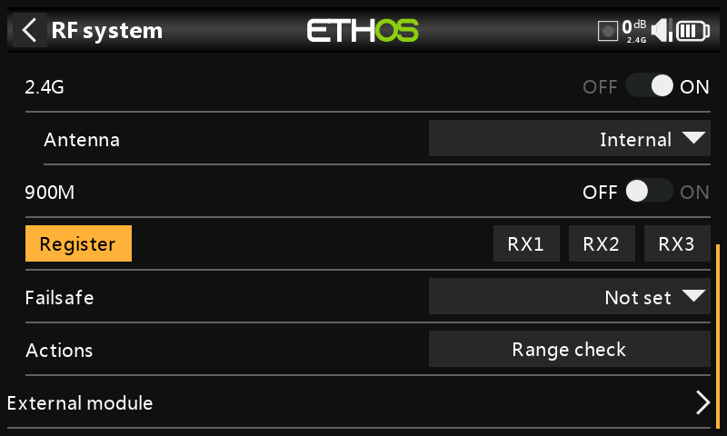

1. Se il tuo ricevitore non è ancora stato registrato, avvia il processo di registrazione selezionando \[Registra\]. In caso contrario, passa alla sezione Bind.

Verrà visualizzata una casella di messaggio con scritto "In attesa del destinatario..." e un avviso vocale ripetuto "Registra".

2. Tenendo premuto il pulsante di collegamento del ricevitore, accendilo e attendi che i LED rosso e verde si attivino.

Il messaggio "In attesa del ricevitore..." cambia in "Ricevitore connesso" e il campo Nome Rx viene compilato automaticamente.

3. In questa fase è possibile impostare l'ID Reg. e l'UID:

- ID di registrazione: l'ID di registrazione è a livello del proprietario o del trasmettitore. Deve essere un codice unico per la tua radio e per gli altri trasmettitori da utilizzare con Smart Share. Il valore predefinito è quello dell'impostazione "ID di registrazione del proprietario" descritta all'inizio di questa sezione, ma può essere modificato qui. Se due radio hanno lo stesso ID di registrazione, puoi spostare i ricevitori (con lo stesso numero di ricevitore per un determinato modello) da una radio all'altra semplicemente utilizzando il processo di collegamento all'accensione.

- Nome RX: viene compilato automaticamente, ma il nome può essere modificato se lo si desidera. Questo può essere utile se stai utilizzando più di un ricevitore e devi ricordare, ad esempio, che RX4R1 è per i canali 1-8 o RX4R2 è per i canali 9-16 o RX4R3 è per i canali 17-24 quando fai un nuovo collegamento. Qui è possibile inserire un nome per il ricevitore.

- L'UID viene utilizzato per distinguere tra più ricevitori utilizzati contemporaneamente in un unico modello. Può essere lasciato al valore predefinito di 0 per un singolo ricevitore. Quando si utilizza più di un ricevitore nello stesso modello, l'UID deve essere modificato: di solito è 0 per i Ch1-8, 1 per i Ch9-16 e 2 per i Ch17-24. Tieni presente che questo UID non può essere letto dal ricevitore, quindi è bene etichettare il ricevitore.

4. Premi \[Registra\] per completare l'operazione. Viene visualizzata una finestra di dialogo con scritto "Registrazione ok". Premi \[OK\] per continuare.

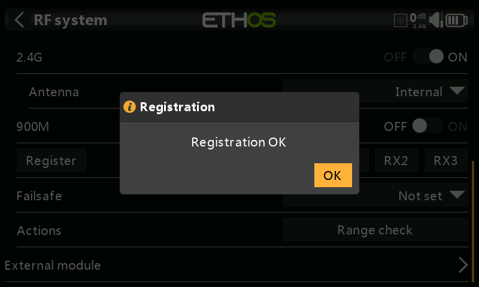

5. Spegni il ricevitore. A questo punto il ricevitore è registrato, ma deve ancora essere collegato al trasmettitore da utilizzare. Ora è pronto per il binding.

Fase due - Opzioni di Binding - Collegamento e moduli

Bind /collegamento

Il binding del ricevitore consente a un ricevitore registrato di essere collegato a uno dei trasmettitori con cui è stato registrato nella fase 1, e risponderà a quel trasmettitore fino a quando non sarà nuovamente collegato a un altro trasmettitore. Assicurati di eseguire un Controllo portata (Range Check) prima di far volare il modello.

Avvertenza: molto importante

Non eseguire l'operazione di Binding - Collegamento con un motore elettrico collegato o un motore a combustione interna acceso.

1. Spegni il ricevitore.

2. Conferma di essere in modalità ACCESS.

3. Ricevitore 1 \[Bind\]: Avvia il processo di binding selezionando \[RX1\], quindi seleziona Bind dall'elenco a discesa.

Un avviso vocale annuncerà "Bind" ogni pochi secondi per confermare che sei in modalità bind. Un popup visualizzerà "In attesa del ricevitore....".

4. Accendi il ricevitore senza toccare il pulsante di collegamento F/S. Verrà visualizzato un messaggio "Seleziona dispositivo" e il nome del ricevitore che hai appena acceso.

5. Scorri fino al nome del ricevitore e selezionalo.

Verrà visualizzato un messaggio che indica che il collegamento è avvenuto con successo. Clicca su OK.

Il ricevitore selezionato mostrerà ora il nome RX1 accanto ad esso.

6. Spegni il trasmettitore e il ricevitore.

7. Accendi il trasmettitore e poi il ricevitore. Se il LED verde del ricevitore è acceso e il LED rosso è spento, il ricevitore è collegato al trasmettitore. Il collegamento del modulo ricevitore/trasmettitore non dovrà essere ripetuto, a meno che uno dei due non venga sostituito.

Il ricevitore è ora pronto per essere utilizzato. Il ricevitore sarà controllato (senza essere influenzato da altri trasmettitori) solo dal trasmettitore a cui è legato.

Ripeti l'operazione per il Ricevitore 2 e 3, se applicabile.

Consulta anche la sezione Telemetria per una discussione sull'[RSSI](telemetry.md).

Opzioni del ricevitore

Con il ricevitore acceso, tocca il pulsante RX1, 2 o 3 per visualizzare le opzioni del ricevitore e altre operazioni:

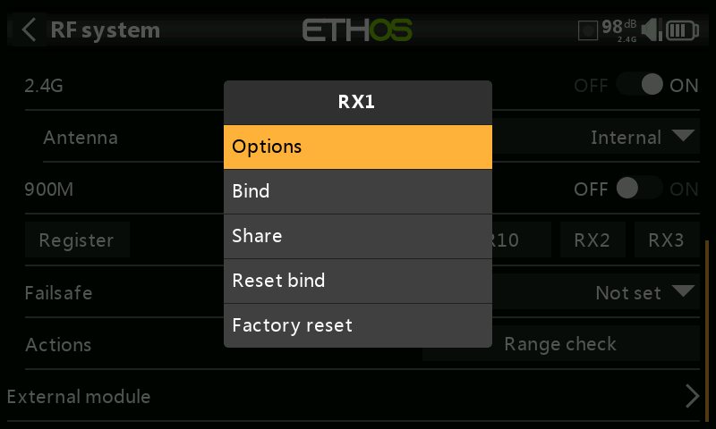

Tocca Opzioni:

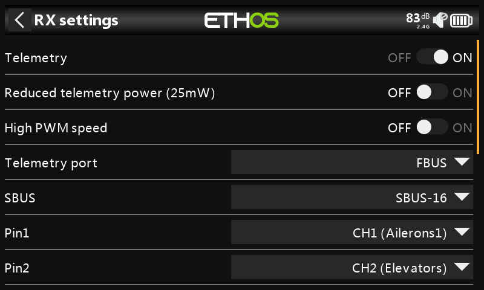

- Opzioni

*Telemetria*: La telemetria può essere disabilitata per questo ricevitore.

*Potenza telemetria ridotta 25mW*: casella di controllo per limitare la potenza della telemetria a 25mW (normalmente 100mW), eventualmente necessaria se, ad esempio, i servi subiscono interferenze a causa delle radiofrequenze inviate vicino a loro.

*Alta velocità PWM*: la velocità di aggiornamento del servo è completamente determinata dal ricevitore.  Questa casella di controllo abilita una velocità di aggiornamento PWM di 7 ms (contro i 18 ms standard). Assicurati che i tuoi servi siano in grado di gestire questa velocità di aggiornamento.

maggiori dettagli sulla frequenza di aggiornamento impostata sul trasmettitore, consulta la [sezione Gamma di canali (ACCESS)](rf-system.md).

*Porta di telemetria*: Consente di selezionare la SmartPort del ricevitore per utilizzare il protocollo S.Port, F.Port o FBUS (F.Port2). Il protocollo F.Port è stato sviluppato con il team Betaflight per integrare i segnali SBUS e S.Port separati. FBUS (F.Port2) consente inoltre a un dispositivo Host di comunicare con diversi dispositivi Slave sulla stessa linea. Per maggiori informazioni sul protocollo delle porte, consulta la spiegazione del protocollo sul sito ufficiale di FrSky.

*SBUS**:* consente di selezionare la modalità SBUS-16 canali o SBUS-24 canali. Tieni presente che tutti i dispositivi SBUS collegati devono supportare la modalità SBUS-24 per poter attivare il nuovo protocollo. SBUS-24 è uno sviluppo di FrSky del protocollo SBUS-16 di Futaba.

*Mappatura dei canali*: La finestra di dialogo Opzioni del ricevitore offre anche la possibilità di riattribuire i canali ai pin del ricevitore.

- Condividi

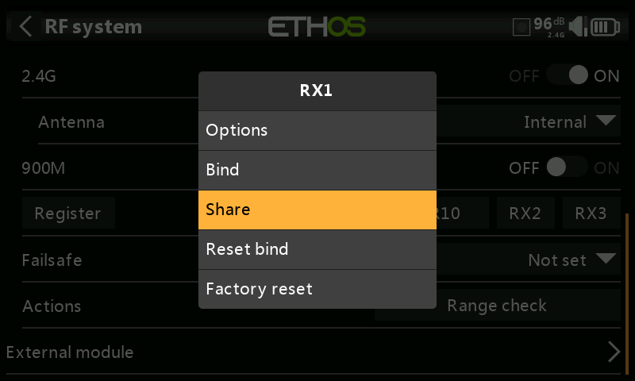

La funzione Condividi permette di spostare il ricevitore su un'altra radio ACCESS con un diverso "ID di registrazione del proprietario". Quando si tocca l'opzione Condividi, il LED verde del ricevitore si spegne.

Sulla radio di destinazione B, vai alla sezione Sistema RF e Ricevitore(n) e seleziona Collega. Nota che il processo di condivisione salta la fase di registrazione sulla radio B, perché l'"ID di registrazione del proprietario" viene trasferito dalla radio A. Viene visualizzato il nome del ricevitore della radio sorgente. Seleziona il nome, il ricevitore si legherà e il suo LED diventerà verde.

Verrà visualizzato il messaggio "Bind successful".

Tocca OK. La radio B ora controlla il ricevitore. Il ricevitore rimarrà legato a questa radio finché non deciderai di cambiarla.

Premi il pulsante EXIT sulla Radio A per interrompere il processo di condivisione.

Il ricevitore può essere riportato alla radio A effettuando un nuovo collegamento alla radio A.

Nota: non è necessario utilizzare la funzione "Condividi" se tutte le radio utilizzano lo stesso numero di "ID di registrazione del proprietario". Puoi semplicemente mettere la radio che vuoi usare in modalità bind, accendere il ricevitore, selezionare il ricevitore nella radio e questo si legherà a quella radio. Puoi passare a un'altra radio nello stesso modo. Quando si copiano i modelli, è meglio mantenere i numeri dei ricevitori uguali.

- Reset - Azzeramento del binding

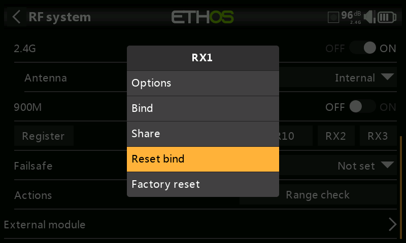

Se cambi idea sulla condivisione di un modello, seleziona "Ripristina il binding" per ripulire e ripristinare il binding. Spegni il ricevitore e sarà collegato al tuo trasmettitore.

- Reset di fabbrica

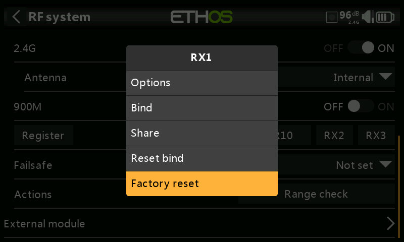

Tocca il pulsante Reset per ripristinare le impostazioni di fabbrica del ricevitore e cancellare l'UID. Il ricevitore non è registrato con X20. Nota bene che un ripristino di fabbrica cancellerà anche i dati della calibrazione 6-assi su riceventi stabilizzate

Opzioni del ricevitore (con Rx spento)

Con il ricevitore spento, tocca il pulsante RX1, 2 o 3 per visualizzare le opzioni del ricevitore.

Se tocchi Opzioni, la radio tenterà di connettersi e attenderà il ricevitore.

Se tocchi Bind, puoi ad esempio riBind /collegamento un modello che era stato legato a un altro trasmettitore.

Se tocchi Clear, verrà eseguito un Reset Bind.

Aggiunta di un ricevitore ridondante

Un secondo ricevitore può essere collegato a uno slot non utilizzato, ad esempio RX2 o RX3, per garantire la ridondanza in caso di problemi di ricezione. Un ricevitore 2.4G o 900M può essere il backup per la ridondanza. Il nostro esempio qui sotto mostra l'aggiunta di un ricevitore 900M.

1. Collega la porta SBUS Out del ricevitore ridondante alla porta SBUS IN del ricevitore principale.

2. Abilita il modulo RF interno del 900M.

2a. Configura l'antenna e le opzioni di potenza RF.

**Antenna**:

Seleziona l'antenna interna o esterna (sul connettore ANT2). Sebbene lo stadio RF abbia una protezione integrata, è buona norma assicurarsi che sia stata montata un'antenna esterna prima di selezionare l'antenna esterna. Tieni presente che la selezione dell'antenna avviene per modello, quindi ogni volta che si cambia modello ETHOS imposta la modalità di antenna per il modello in questione.

**Potenza**:

FCC: Seleziona la potenza RF desiderata tra 10, 25, 100, 200, 500mW, 1000mW.

LBT: seleziona la potenza RF desiderata tra 25mW (telemetria via 868MHz), 200mW o 500mW (telemetria via 2.4GHz).

3. Se il tuo ricevitore non è ancora stato registrato, avvia il processo di registrazione selezionando \[Registra\]. In caso contrario, passa alla sezione Legami.

4. Registra il nuovo ricevitore, ad esempio l'R9MINI-O di cui sopra.

5. Spegni i ricevitori.

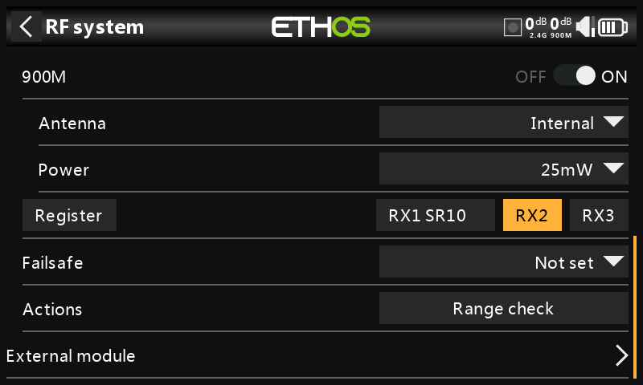

6. Tocca il pulsante RX2 o RX3.

Un avviso vocale annuncerà "Bind" ogni pochi secondi per confermare che sei in modalità bind. Un popup visualizzerà "Waiting for receiver....".

7. Accendi i ricevitori.

8. Seleziona il ricevitore ridondante R9.

9. Tocca OK. Assicurati che il LED verde del ricevitore ridondante sia acceso. Il ricevitore ridondante è ora collegato.

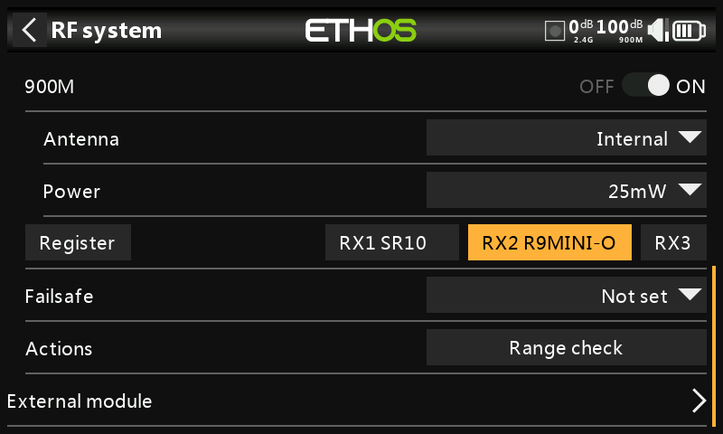

10. Il ricevitore ridondante sarà ora elencato.

Nota: sebbene sia possibile associare allo stesso UID sia il ricevitore principale che quello ridondante accendendoli singolarmente, non avrai accesso alle Opzioni Rx quando entrambi sono accesi.

Failsafe

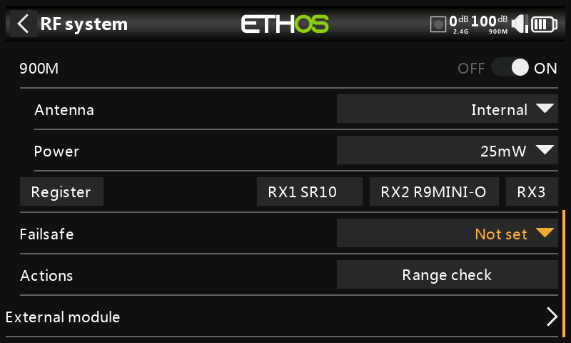

La modalità Failsafe determina cosa succede al ricevitore quando il segnale del trasmettitore viene perso.

I dati di failsafe vengono inviati dal trasmettitore ogni 10 secondi circa. Si noti che per i ricevitori TD, TW, AP e AP Plus i dati di failsafe sono ora salvati sul ricevitore, il che significa che le impostazioni di failsafe sono immediatamente disponibili se il ricevitore si riavvia per qualsiasi motivo. Si noti che la funzione Failsafe deve essere reimpostata e controllata dopo aver aggiornato i ricevitori con questa funzione.

Tocca la casella a discesa per visualizzare le opzioni di sicurezza:

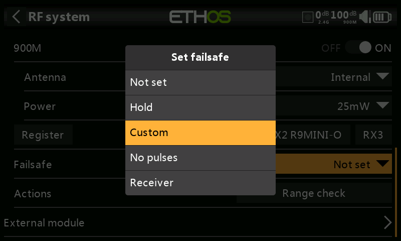

- Tieni

Hold manterrà le ultime posizioni ricevute.

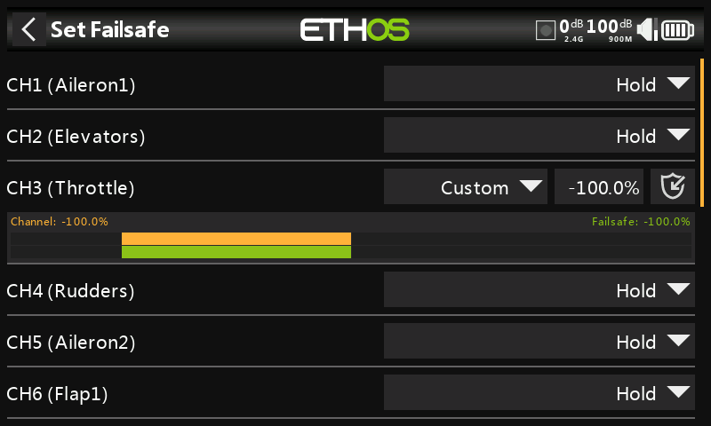

- Ad Hoc - Personalizzato

Custom permette di spostare i servi in posizioni personalizzate e predefinite. La posizione per ogni canale può essere definita separatamente. Ogni canale ha le opzioni Non impostato, Mantieni, Personalizzato o Nessun impulso. Se si seleziona Personalizzato, viene visualizzato il valore del canale. Se si tocca l'icona di impostazione con una freccia, viene utilizzato il valore corrente del canale. In alternativa, è possibile inserire un valore fisso per quel canale toccando il valore.

- Nessun impulso

No Pulses disattiva gli impulsi (da utilizzare con i controllori di volo dotati di GPS di ritorno a casa in caso di perdita del segnale).

- Ricevitore

Scegliendo "Ricevitore" sui ricevitori della serie X o successivi è possibile impostare il failsafe nel ricevitore.

***Attenzione***:  Assicurati di testare con attenzione le impostazioni Failsafe scelte, in particolare i canali che controllano il giroscopio sui ricevitori stabilizzati.

Controllo portata (Range Check)

Un Controllo portata (Range Check) deve essere effettuato sul campo quando il modello è pronto per volare.

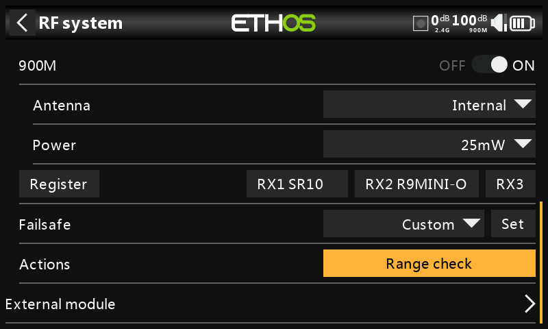

Il controllo dell'intervallo si attiva selezionando "Controllo dell'intervallo".

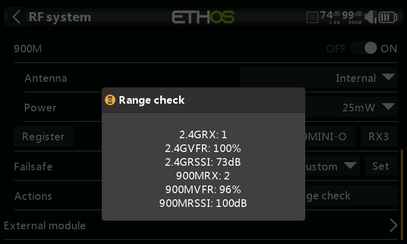

Un avviso vocale annuncerà "Range Check" ogni pochi secondi per confermare che sei in modalità range check. Un popup visualizzerà il numero del ricevitore e i valori VFR% e RSSI per valutare la qualità della ricezione. Quando il Range Check è attivo, riduce la potenza del trasmettitore, che a sua volta riduce il raggio d'azione per i test di portata. In condizioni ideali, con la radio e il ricevitore a 1 metro dal suolo, dovresti ricevere un allarme critico solo a circa 30 metri di distanza.

Attualmente ACCESS in modalità di Controllo portata (Range Check) fornisce i dati di Controllo portata (Range Check) per un ricevitore alla volta sul link 2.4G e per un ricevitore alla volta sul link 900M. Se hai tre ricevitori 2.4G registrati e vincolati come Ricevitore 1, 2 e 3, uno dei ricevitori sarà il ricevitore di telemetria attivo e il suo numero verrà visualizzato dal sensore RX come 0, 1 o 2. Questo sarà il ricevitore che sta inviando i dati RSSI e VFR. Sarà il ricevitore che invia i dati RSSI e VFR. Se spegni quel ricevitore, il successivo diventerà il ricevitore di telemetria attivo con una priorità di 0, 1 e poi 2. Ciascuno dei tre ricevitori può essere controllato spegnendo gli altri.

Sensore RX 0 = Ricevitore 1

Sensore RX 1 = Ricevitore 2

Sensore RX 2 = Ricevitore 3

Consulta anche la sezione Telemetria per una discussione sui valori [VFR e RSSI](telemetry.md).

Tipo: ACCST D16

La modalità ACCST D16 è per la trasmissione full duplex bidirezionale ACCST a 16 canali, nota anche come modalità "X". Da utilizzare con i ricevitori della serie "X".

Modello ID

Quando crei un nuovo modello, l'ID modello viene assegnato automaticamente. L'ID modello deve essere un numero univoco perché la funzione Model Match assicura che solo l'ID modello corretto venga associato. Questo numero viene inviato al ricevitore durante il binding, in modo che risponda solo al numero a cui è stato associato. L'ID modello può essere modificato manualmente.

Gamma dei canali

Scelta di quali canali interni della radio vengono effettivamente trasmessi via etere. In modalità D16 puoi scegliere tra 8 canali con dati inviati ogni 9ms e 16 canali con dati inviati ogni 18ms.

Tieni presente che la velocità di aggiornamento del servo è completamente determinata dal ricevitore. Per ACCST, consulta il manuale del ricevitore per i dettagli sulla selezione della modalità HS (High PWM Speed) da 9ms. Assicurati che i tuoi servi siano in grado di gestire questa frequenza di aggiornamento.

2.4G

L'ACCST D16 funziona su 2.4G, quindi la sezione RF 2.4G è attiva per impostazione predefinita.

- Antenna

Seleziona l'antenna interna o esterna (sul connettore ANT1). Sebbene lo stadio RF abbia una protezione integrata, è buona norma assicurarsi che sia stata montata un'antenna esterna prima di selezionare l'antenna esterna. Tieni presente che la selezione dell'antenna avviene per modello, quindi ogni volta che si cambia modello ETHOS imposta la modalità di antenna per il modello in questione.

Bind /collegamento

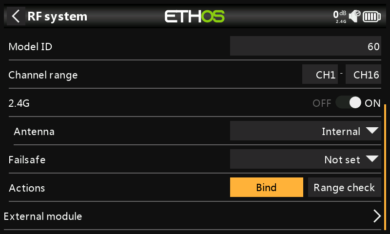

1. Inizia il processo di binding selezionando \[Bind\]. Un avviso vocale annuncerà "Bind" ogni pochi secondi per confermare che sei in modalità Bind. In modalità D16, durante il binding si apre un menu a comparsa che consente di selezionare la modalità di funzionamento del ricevitore. Le opzioni si riferiscono alle uscite PWM e si applicano ai ricevitori che supportano la scelta tra queste 4 opzioni tramite i ponticelli. Assicurati che il firmware del ricevitore e del modulo RF supportino questa opzione. In caso contrario, è necessario eseguire un normale collegamento con il pulsante F/S (consulta il manuale del ricevitore).

Sono disponibili 4 modalità con combinazioni di Telemetria on/off e canale 1-8 o 9-16. Questo è utile quando si utilizzano due ricevitori per la ridondanza o per collegare più di 8 servi utilizzando due ricevitori.

2. Accendi il ricevitore, mettendolo in modalità bind secondo le istruzioni del ricevitore. (In genere si fa tenendo premuto il pulsante Failsafe sul ricevitore durante l'accensione).

3. I LED rosso e verde si accendono. Il LED verde si spegnerà e il LED rosso lampeggerà al termine del processo di Binding - Collegamento.

4. Tocca OK sul trasmettitore per terminare il processo di collegamento e riaccendi il ricevitore.

5. Se il LED verde del ricevitore è acceso e il LED rosso è spento, il ricevitore è collegato al trasmettitore. Il collegamento del modulo ricevitore/trasmettitore non dovrà essere ripetuto, a meno che uno dei due non venga sostituito. Il ricevitore sarà controllato (senza essere influenzato da altri trasmettitori) solo dal trasmettitore a cui è collegato.

Avvertenze - Molto importanti

Non eseguire l'operazione di Binding - Collegamento con un motore elettrico collegato o un motore a combustione interna acceso.

Failsafe

La modalità Failsafe determina cosa succede al ricevitore quando il segnale del trasmettitore viene perso.

I dati del Failsafe vengono inviati dal trasmettitore ogni 10 secondi circa.

Tocca la casella a discesa per visualizzare le opzioni di sicurezza:

- Tieni

Hold manterrà le ultime posizioni ricevute.

- Ad Hoc - Personalizzato

Custom permette di spostare i servi in posizioni personalizzate e predefinite. La posizione per ogni canale può essere definita separatamente. Ogni canale ha le opzioni Non impostato, Mantieni, Personalizzato o Nessun impulso. Se si seleziona Personalizzato, viene visualizzato il valore del canale. Se si tocca l'icona di impostazione con una freccia, viene utilizzato il valore corrente del canale. In alternativa, è possibile inserire un valore fisso per quel canale toccando il valore.

- Nessun impulso

No Pulses disattiva gli impulsi (da utilizzare con i controllori di volo dotati di GPS di ritorno a casa in caso di perdita del segnale).

- Ricevitore

Scegliendo "Ricevitore" sui ricevitori della serie X o successivi è possibile impostare il failsafe nel ricevitore.

***Attenzione***:  Assicurati di testare con attenzione le impostazioni Failsafe scelte, in particolare i canali che controllano il giroscopio sui ricevitori stabilizzati.

Controllo portata (Range Check)

Un Controllo portata (Range Check) deve essere effettuato sul campo quando il modello è pronto per volare.

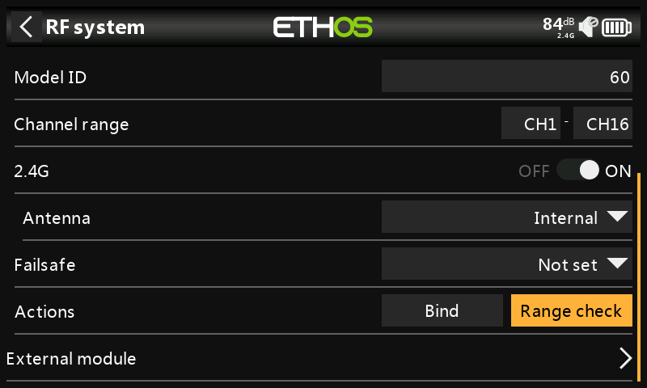

Il controllo dell'intervallo si attiva selezionando "Controllo dell'intervallo".

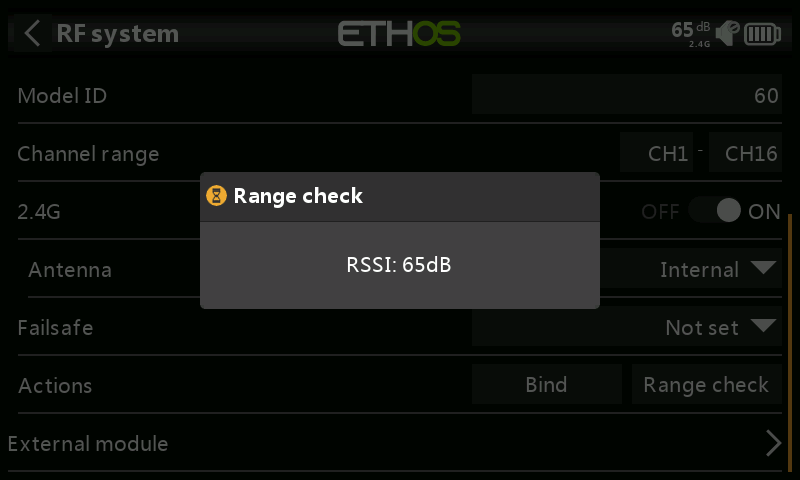

Un avviso vocale annuncerà "Controllo portata (Range Check)" ogni pochi secondi per confermare che sei in modalità di Controllo portata (Range Check). Un popup visualizzerà il numero del ricevitore e i valori VFR% e RSSI per valutare la qualità della ricezione. Quando il Controllo portata (Range Check) è attivo, riduce la potenza del trasmettitore e di conseguenza il raggio d'azione per il test del raggio d'azione. In condizioni ideali, con la radio e il ricevitore a 1 metro dal suolo, dovresti ricevere un allarme critico solo a circa 30 metri di distanza.

Consulta la sezione Telemetria per una discussione sui valori [VFR e RSSI](telemetry.md).

Tipo: Modalità TD

In modalità TD i ricevitori operano contemporaneamente su due bande. Durante la trasmissione del segnale e della telemetria viene effettuato un confronto costante della qualità del pacchetto dati tra le due bande, per cui il pacchetto dati migliore di una delle due bande verrà applicato in ogni momento per assicurarsi che la trasmissione sia sempre la migliore.

ACCESS e TD MODE cambiano il modo in cui i ricevitori sono legati e collegati al trasmettitore. Il processo è suddiviso in due Fasi. La prima fase consiste nel registrare il ricevitore alla radio o alle radio con cui deve essere utilizzato. La registrazione deve essere eseguita una sola volta per ogni coppia ricevitore/trasmettitore. Una volta registrato, un ricevitore può essere collegato e rilegato in modalità wireless con qualsiasi radio con cui è registrato, senza utilizzare il pulsante di collegamento sul ricevitore.

Dopo aver selezionato la modalità TD, è necessario impostare i seguenti parametri:

Modello ID

Quando crei un nuovo modello, l'ID modello viene assegnato automaticamente. L'ID modello deve essere un numero univoco perché la funzione Smart Match assicura che solo l'ID modello corretto venga associato. Questo numero viene inviato al ricevitore durante il binding, in modo che risponda solo al numero a cui è stato associato. L'abbinamento del ricevitore è ancora importante come lo era prima di ACCESS.

L'ID del modello può essere modificato manualmente. Nota anche che l'ID modello viene modificato quando il modello viene clonato.

Gamma di canali:

Dato che Tandem supporta 24 canali, di solito si sceglie Ch1-8, Ch1-16, Ch1-24, Ch9-16 o Ch17-24 per il ricevitore che si sta configurando. Nota che il Ch1-16 è quello predefinito.

Modalità corsa

La modalità Racing offre una latenza molto bassa di 4ms con ricevitori come TD MX.

Se l'intervallo di canali è impostato su Ch1-8, è possibile selezionare una sorgente (ad esempio un interruttore) che abiliti la modalità Corsa. Una volta che il ricevitore è stato collegato (vedi sotto) e la modalità Gara è stata abilitata, il ricevitore deve essere riacceso perché la modalità Gara abbia effetto.

2.4G

Il modulo RF 2.4G è già abilitato.

**Antenna**: seleziona Antenna interna o esterna (sul connettore ANT1). Sebbene lo stadio RF abbia una protezione integrata, è buona norma assicurarsi che sia stata montata un'antenna esterna prima di selezionare l'antenna esterna. Tieni presente che la selezione dell'antenna avviene per modello, quindi ogni volta che si cambia modello ETHOS imposta la modalità di antenna per il modello in questione.

900M

Il modulo RF 900M è già abilitato.

**Antenna**:

Seleziona l'antenna interna o esterna (sul connettore ANT2). Sebbene lo stadio RF abbia una protezione integrata, è buona norma assicurarsi che sia stata montata un'antenna esterna prima di selezionare l'antenna esterna. Tieni presente che la selezione dell'antenna avviene per modello, quindi ogni volta che si cambia modello ETHOS imposta la modalità di antenna per il modello in questione.

Potenza

FCC: Seleziona la potenza RF desiderata tra 10, 25, 100, 200, 500mW, 1000mW.

LBT: seleziona la potenza RF desiderata tra 25mW (telemetria via 868MHz), 200mW o 500mW (telemetria via 2.4GHz).

In modalità TD MODE i percorsi RF 2,4g e 900m lavorano in tandem con un unico set di controlli di ACCESS. Possono essere registrati tre ricevitori Tandem.

Fase uno: registrazione

Registrati:

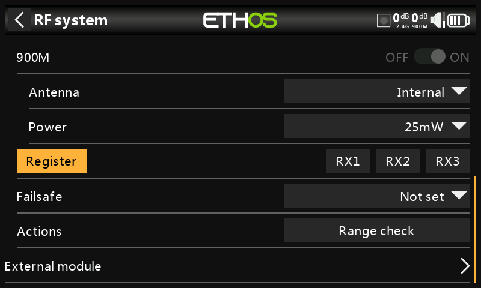

1. Se il tuo ricevitore non è ancora stato registrato, avvia il processo di registrazione selezionando \[Registra\]. In caso contrario, passa alla sezione Bind.

Verrà visualizzata una casella di messaggio con scritto "In attesa del destinatario..." e un avviso vocale ripetuto "Registra".

2. Tenendo premuto il tasto bind, accendi il ricevitore e attendi che i LED rosso e verde si attivino.

Il messaggio "In attesa del ricevitore..." cambia in "Ricevitore connesso" e il campo Nome Rx viene compilato automaticamente.

3. In questa fase è possibile impostare l'ID di registrazione e l'UID:

- ID di registrazione: l'ID di registrazione è a livello del proprietario o del trasmettitore. Deve essere un codice unico per i tuoi X20/X20S e trasmettitori da utilizzare con Smart Share. Il valore predefinito è quello dell'impostazione "ID di registrazione del proprietario" descritta all'inizio di questa sezione, ma può essere modificato qui. Se due radio hanno lo stesso ID, puoi spostare i ricevitori (con lo stesso numero di ricevitore per un determinato modello) da una all'altra semplicemente utilizzando il processo di collegamento all'accensione.

- Nome RX: viene compilato automaticamente, ma il nome può essere cambiato se lo si desidera. Questo può essere utile se utilizzi più di un ricevitore e devi ricordare quale è legato a quali canali.

- L'UID viene utilizzato per distinguere tra più ricevitori utilizzati contemporaneamente in un unico modello. Può essere lasciato al valore predefinito di 0 per un singolo ricevitore. Quando si vuole utilizzare più di un ricevitore nello stesso modello, l'UID deve essere modificato. Tieni presente che questo UID non può essere letto dal ricevitore, quindi è bene etichettare il ricevitore.

4. Premi \[Registra\] per completare l'operazione. Viene visualizzata una finestra di dialogo con scritto "Registrazione OK". Premi \[OK\] per continuare.

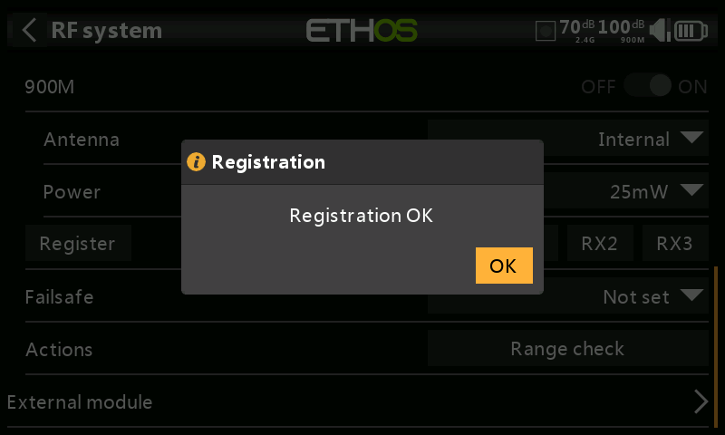

5. Spegni il ricevitore. A questo punto il ricevitore è registrato, ma deve ancora essere collegato al trasmettitore da utilizzare. Ora è pronto per il binding.

Fase due - Opzioni di Binding - Collegamento e moduli

Bind /collegamento

Il binding del ricevitore consente a un ricevitore registrato di essere collegato a uno dei trasmettitori con cui è stato registrato nella fase 1, e risponderà a quel trasmettitore fino a quando non sarà nuovamente collegato a un altro trasmettitore. Assicurati di eseguire un Controllo portata (Range Check) prima di far volare il modello.

Avvertenza: molto importante

Non eseguire l'operazione di Binding - Collegamento con un motore elettrico collegato o un motore a combustione interna acceso.

1. Spegni il ricevitore.

2. Conferma di essere in modalità TD.

3. Ricevitore 1 \[Bind\]:

Inizia il processo di Binding - Collegamento selezionando RX1.

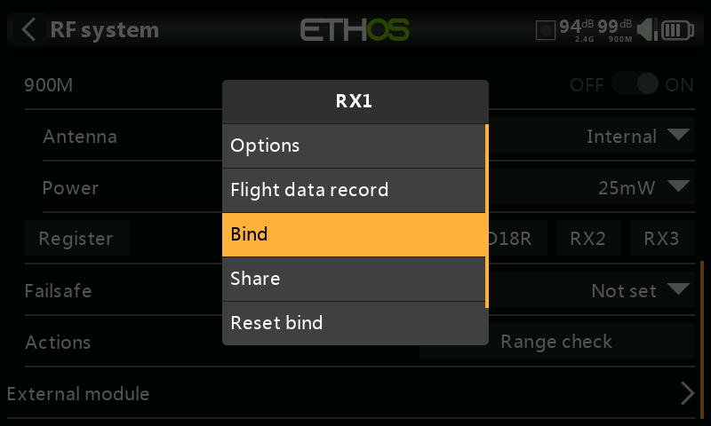

Poi seleziona Bind dall'elenco a discesa

4. Un avviso vocale annuncerà "Bind" ogni pochi secondi per confermare che sei in modalità bind. Un popup visualizzerà "In attesa del ricevitore...".

5. Accendi il ricevitore senza toccare il pulsante di collegamento F/S.

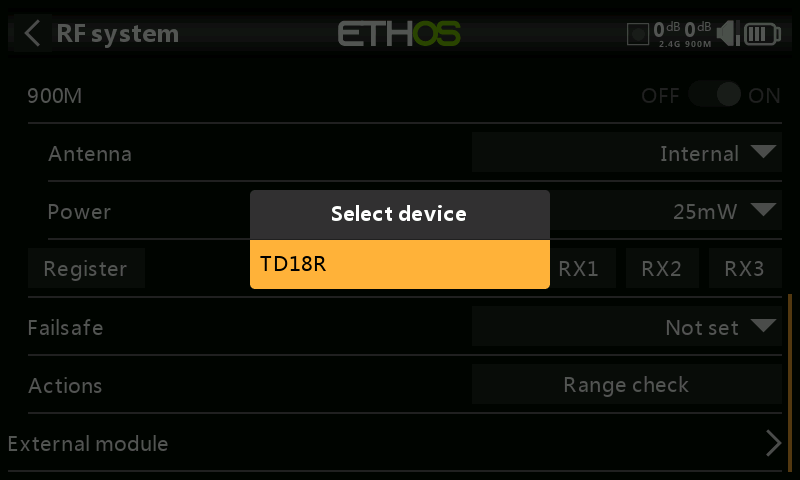

6. Verrà visualizzato un messaggio "Seleziona dispositivo" e il nome del ricevitore che hai appena acceso. Scorri fino al nome del ricevitore e selezionalo.

Verrà visualizzato un messaggio che indica che il collegamento è avvenuto con successo.

7. Spegni il trasmettitore e il ricevitore.

8. Accendi il trasmettitore e poi il ricevitore. Se il LED verde del ricevitore è acceso e il LED rosso è spento, il ricevitore è collegato al trasmettitore. Il collegamento del modulo ricevitore/trasmettitore non dovrà essere ripetuto, a meno che uno dei due non venga sostituito.

Il ricevitore sarà controllato (senza essere influenzato da altri trasmettitori) solo dal trasmettitore a cui è legato.

Il ricevitore selezionato mostrerà ora il nome RX1 accanto ad esso.

Nota che entrambe le bande 2.4G e 900M si legano in un'unica operazione. Il ricevitore è ora pronto per essere utilizzato.

Ripeti l'operazione per il Ricevitore 2 e 3, se applicabile.

Consulta anche la sezione Telemetria per una discussione sull'[RSSI](telemetry.md).

Opzioni del ricevitore

Tocca RX1, RX2 o RX3 per visualizzare le Opzioni del ricevitore:

Tocca Opzioni:

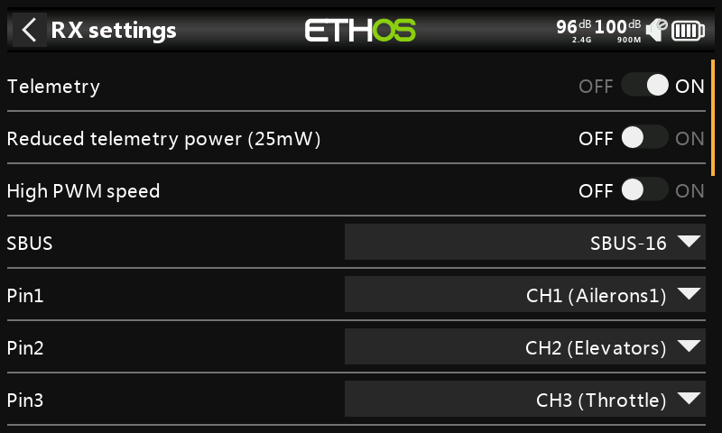

- Opzioni

*Telemetria*: La telemetria può essere disabilitata per questo ricevitore.

*Potenza telemetria ridotta 25mW*: casella di controllo per limitare la potenza della telemetria a 25mW (normalmente 100mW), eventualmente necessaria se, ad esempio, i servi subiscono interferenze a causa delle radiofrequenze inviate vicino a loro.

*Alta velocità PWM*: Seleziona la casella di controllo per abilitare una velocità di aggiornamento PWM di 7 ms (rispetto ai 20 ms standard). Assicurati che i tuoi servi siano in grado di gestire questa velocità di aggiornamento.

*SBUS**:* consente di selezionare la modalità SBUS-16 canali o SBUS-24 canali. Ricorda che tutti i dispositivi SBUS collegati devono supportare la modalità SBUS-24 per poter attivare il nuovo protocollo. SBUS-24 è uno sviluppo di FrSky del protocollo SBUS-16 di Futaba.

*Pin1 a Pin(nn)*: La finestra di dialogo Opzioni ricevitore offre anche la possibilità di riattribuire i canali ai pin del ricevitore. Inoltre, ogni porta di uscita può essere riassegnata ai protocolli Smart Port, SBUS Out o FBUS (precedentemente noto come F.Port2). Inoltre, la porta di uscita 1 può essere riassegnata come porta SBUS In.

Il protocollo F.Port è stato sviluppato con il team Betaflight per integrare i segnali SBUS e S.Port separati. FBUS (F.Port2) consente inoltre a un dispositivo Host di comunicare con più dispositivi Slave sulla stessa linea. Per maggiori informazioni sul protocollo delle porte, consulta la spiegazione del protocollo sul sito ufficiale di FrSky.

- Registrazione dei dati di volo (scatola nera del ricevitore)

Fornisce un registro dello stato di salute del ricevitore.

Reset dell'accensione, reset del pin di uscita e risultati del wakeup, del watchdog timer, del rilevamento del blocco e del rilevamento del brown out dell'alimentazione.

Valori minimi e massimi delle tensioni del Ricevitore 1 e 2 (se presenti) dall'accensione.

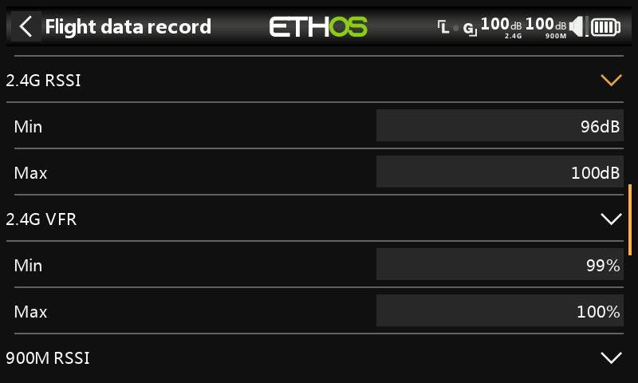

Valori minimi e massimi dei livelli RSSI 2.4G e VFR (Valid Frame Rate) dall'accensione.

Valori minimi e massimi dei livelli RSSI e VFR (Valid Frame Rate) di 900M dall'accensione.

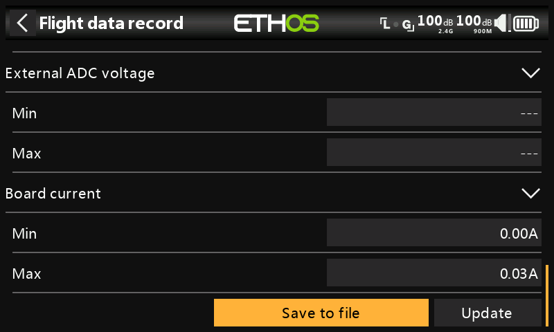

Valori minimi e massimi della porta di ingresso analogica AIN e corrente della scheda di ricezione dall'accensione.

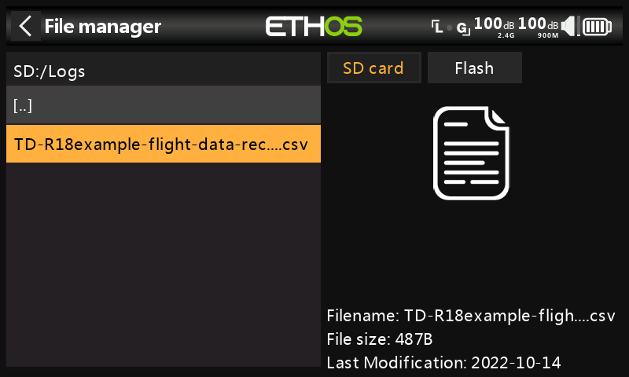

Tocca "Salva su file" per salvare i dati in un file .csv nella cartella Logs. Il file può essere letto da un editor di testo o più comodamente da LibreOffice.

Tocca il pulsante Aggiorna per aggiornare i dati del Flight Data Record.

- Condividi

La funzione Condividi consente di spostare il ricevitore su un'altra radio Tandem con un diverso "ID di registrazione del proprietario". Quando si tocca l'opzione Condividi, il LED verde del ricevitore si spegne.

Sulla radio di destinazione B, vai alla sezione Sistema RF e Ricevitore(n) e seleziona Collega. Nota che il processo di condivisione salta la fase di registrazione sulla radio B, perché l'"ID di registrazione del proprietario" viene trasferito dalla radio A. Viene visualizzato il nome del ricevitore della radio sorgente. Seleziona il nome, il ricevitore si legherà e il suo LED diventerà verde.

Verrà visualizzato il messaggio "Bind successful".

Tocca OK. La radio B ora controlla il ricevitore. Il ricevitore rimarrà legato a questa radio finché non deciderai di cambiarla.

Premi il pulsante EXIT sulla Radio A per interrompere il processo di condivisione.

Il ricevitore può essere riportato alla radio A effettuando un nuovo collegamento alla radio A.

Nota: non è necessario utilizzare la funzione "Condividi" se tutte le radio utilizzano lo stesso numero di "ID di registrazione del proprietario". Puoi semplicemente mettere la radio che vuoi usare in modalità bind, accendere il ricevitore, selezionare il ricevitore nella radio e questo si legherà a quella radio. Puoi passare a un'altra radio nello stesso modo. Quando si copiano i modelli, è meglio mantenere i numeri dei ricevitori uguali.

- Reset - Azzeramento del binding

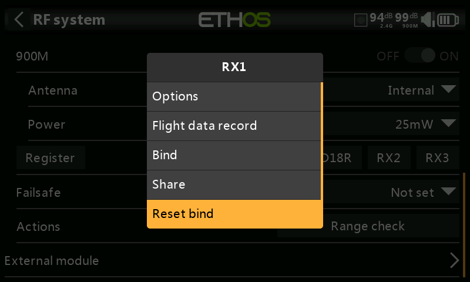

Se cambi idea sulla condivisione di un modello, seleziona "Ripristina il binding" per ripulire e ripristinare il binding. Spegni il ricevitore e sarà collegato al tuo trasmettitore.

- Reset di fabbrica

Tocca il pulsante Reset per ripristinare le impostazioni di fabbrica del ricevitore e cancellare l'UID. Il ricevitore viene deregistrato con X20.

Opzioni del ricevitore (con Rx spento)

Con il ricevitore spento, tocca il pulsante RX1, 2 o 3 per visualizzare le opzioni del ricevitore.

Se tocchi Opzioni, la radio tenterà di connettersi e attenderà il ricevitore.

Se tocchi Bind, puoi ad esempio riBind /collegamento un modello che era stato legato a un altro trasmettitore.

Se tocchi Clear, verrà eseguito un Reset Bind.

Failsafe

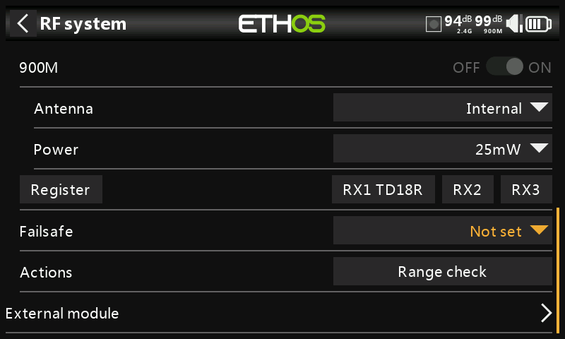

La modalità Failsafe determina cosa succede al ricevitore quando il segnale del trasmettitore viene perso.

I dati di failsafe vengono inviati dal trasmettitore ogni 10 secondi circa. Si noti che per i ricevitori TD, TW, AP e AP Plus i dati di failsafe sono ora salvati sul ricevitore, il che significa che le impostazioni di failsafe sono immediatamente disponibili se il ricevitore si riavvia per qualsiasi motivo. Si noti che la funzione Failsafe deve essere reimpostata e controllata dopo aver aggiornato i ricevitori con questa funzione.

Tocca la casella a discesa per visualizzare le opzioni di sicurezza:

Tieni

Hold manterrà le ultime posizioni ricevute.

Ad Hoc - Personalizzato

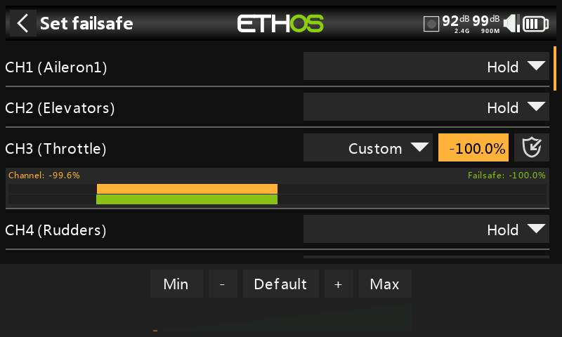

Custom permette di spostare i servi in posizioni personalizzate e predefinite. La posizione per ogni canale può essere definita separatamente. Ogni canale ha le opzioni Non impostato, Mantieni, Ad Hoc - Personalizzato o Nessun impulso. Se si seleziona Personalizzato, viene visualizzato il valore del canale. Se si tocca l'icona di impostazione con una freccia, viene utilizzato il valore corrente del canale. In alternativa, è possibile inserire un valore fisso per quel canale toccando il valore.

Nessun impulso

No Pulses disattiva gli impulsi (da utilizzare con i controllori di volo dotati di GPS di ritorno a casa in caso di perdita del segnale).

Ricevitore

Scegliendo "Ricevitore" sui ricevitori della serie X o successivi è possibile impostare il failsafe nel ricevitore.

***Attenzione***:  Assicurati di testare con attenzione le impostazioni Failsafe scelte, in particolare i canali che controllano il giroscopio sui ricevitori stabilizzati.

Controllo portata (Range Check)

Un Controllo portata (Range Check) deve essere effettuato sul campo quando il modello è pronto per volare.

Il controllo dell'intervallo si attiva selezionando "Controllo dell'intervallo".

Un avviso vocale annuncerà "Controllo portata (Range Check)" ogni pochi secondi per confermare che sei in modalità di Controllo portata (Range Check). Un popup visualizzerà il numero del ricevitore e i valori VFR% e RSSI per valutare la qualità della ricezione. Quando il Controllo portata (Range Check) è attivo, riduce la potenza del trasmettitore e di conseguenza il raggio d'azione per il test del raggio d'azione. In condizioni ideali, con la radio e il ricevitore a 1 metro dal suolo, dovresti ricevere un allarme critico solo a circa 30 metri di distanza.

Attualmente TD MODE in modalità di Controllo portata (Range Check) fornisce dati di Controllo portata (Range Check) per un ricevitore alla volta sul link 2.4G e per un ricevitore alla volta sul link 900M. Se hai tre ricevitori 2.4G registrati e vincolati come Ricevitore 1, 2 e 3, uno dei ricevitori sarà il ricevitore di telemetria attivo e il suo numero sarà visualizzato dal sensore RX come 0, 1 o 2. Questo sarà il ricevitore che sta inviando RSSI e VFR. Sarà il ricevitore che invia i dati RSSI e VFR. Se spegni quel ricevitore, il successivo diventerà il ricevitore di telemetria attivo con una priorità di 0, 1 e poi 2. Ciascuno dei tre ricevitori può essere controllato spegnendo gli altri.

Sensore RX 0 = Ricevitore 1

Sensore RX 1 = Ricevitore 2

Sensore RX 2 = Ricevitore 3

Consulta anche la sezione Telemetria per una discussione sui valori [VFR e RSSI](telemetry.md).

## Modulo interno TD-ISRM Pro (X20 Pro/R/RS)

Per il modulo TD ISRM RF consulta la sezione [Modulo interno TD-ISRM](rf-system.md).

Panoramica

La scheda TD-ISRM Pro RF offre una tripla ridondanza del percorso RF utilizzando 2,4G FSK, 2,4G LoRa e 900M (LoRa), il che rappresenta un nuovo traguardo per le prestazioni RF.

FSK

La FSK è un tipo di FM (modulazione di frequenza) in cui il segnale modulante assume valori discreti e sposta la frequenza di uscita su una serie di valori di frequenza discreti predeterminati. Se le informazioni sono costituite da due soli valori (binari), questi vengono talvolta indicati come frequenze di marcatura e di spazio.

LoRa

LoRa è una tecnica di modulazione wireless derivata dalla tecnologia Chirp Spread Spectrum (CSS). Codifica le informazioni sulle onde radio utilizzando impulsi chirp, simili al modo in cui comunicano delfini e pipistrelli! La trasmissione modulata LoRa è robusta contro i disturbi e può essere ricevuta a grandi distanze.

Ci sono tre sezioni RF schermate separate sulla scheda ISRM:

- La sezione RF del TWIN ha una capacità di 2,4G FSK e 2,4G LoRa. 
- La sezione 2.4G ACCESS RF supporta ACCESS e ACCST D16 ed è utilizzata anche per il Tandem. 
- La sezione RF dell'ACCESS 900M viene utilizzata anche per il Tandem, oltre a fornire ridondanza ad altri ricevitori.

Con tre sezioni RF, è possibile selezionare diverse modalità e configurazioni.

**Attenzione**! In questo manuale e nei menu della radio "900M" è un termine generico che indica la banda VHF utilizzata. Le frequenze operative effettive sono 915Mhz per la FCC o 868Mhz per la LBT, a seconda del paese in cui l'utente opera.

Modalità TD-ISRM Pro

- ACCESS/ACCESS D16

In modalità ACCESS i percorsi RF 2.4G e 900M lavorano in tandem con un unico set di controlli ACCESS. Possono esserci tre ricevitori 2.4G registrati e vincolati o tre ricevitori 900M registrati e vincolati o una combinazione di 2.4G e 900M per un totale di tre ricevitori.

In modalità ACCESS con una combinazione di ricevitori 2.4G e 900M, la telemetria dei collegamenti RF 2.4G e 900M è attiva contemporaneamente. I sensori sono identificati nella telemetria come 2.4G o 900M. Si noti che la banda 2.4G supporta 24 canali, mentre la banda 900M supporta 16 canali.

L'opzione ACCST offre l'ACCST D16 con un ricevitore 900M per la ridondanza.

Consulta la sezione ACCESS/ACCST D16 qui sotto.

- TD Tandem Dual Band 2.4G/900M

In modalità TD il modulo RF è in modalità long range a bassa latenza e utilizza i collegamenti RF 2.4G e 900M in Tandem per lavorare con un massimo di tre ricevitori Tandem. Tandem supporta 24 canali su entrambe le bande.

Questa modalità è simile alla modalità TD dell'X20. Per i dettagli sull'impostazione, consulta la sezione [Modalità TD](rf-system.md).

- TW 2.4G TWIN/900M.

In modalità TW c'è un collegamento RF 2.4G FSK e uno 2.4G LoRa da utilizzare con un massimo di tre ricevitori TWIN. È disponibile un ricevitore 900M per la ridondanza, tramite le porte SBUS IN/OUT. Questo migliora ulteriormente l'affidabilità del segnale RF, soprattutto in scenari che prevedono operazioni RC a lunga distanza.

Consulta la sezione [Modalità TW ](rf-system.md)qui di seguito.

- TD-Pro

Da utilizzare con i futuri ricevitori FrSky TD-Pro.

Esiste una funzione di fonte del ricevitore di telemetria di ETHOS chiamata RX. RX fornisce il numero del ricevitore attivo che invia la telemetria. RX è disponibile in telemetria come qualsiasi altro sensore per la visualizzazione in tempo reale e in Interruttori logici, Funzioni speciali e registrazione dei dati.

Per i dettagli sulla configurazione, consulta le sezioni seguenti.

ACCESS/ACCESS D16

In modalità ACCESS/ACCST D16 i percorsi RF 2.4G e 900M possono lavorare in tandem con un unico set di controlli.

ACCESS 2.4G con un ricevitore 900M opzionale per la ridondanza

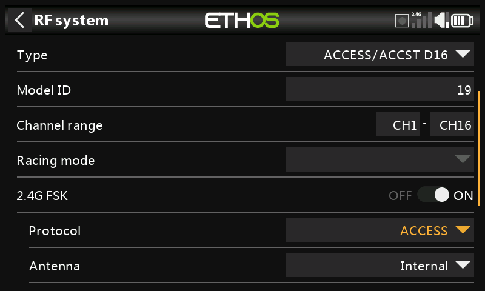

Questa modalità è simile alla modalità ACCESS dell'X20. È possibile collegare fino a un totale di tre ricevitori ACCESS o 900M. Per maggiori dettagli sulla configurazione, consulta la sezione [ACCESS dell'X20](rf-system.md).

ACCST D16 con un ricevitore 900M opzionale per la ridondanza

Questa modalità è supportata solo da X20 Pro. Un ricevitore ACCST D16 può essere utilizzato insieme a un ricevitore ridondante 900M.

- Modello ID

Quando crei un nuovo modello, l'ID modello viene assegnato automaticamente. L'ID modello deve essere un numero univoco perché la funzione Model Match assicura che solo l'ID modello corretto venga associato. Questo numero viene inviato al ricevitore durante il binding, in modo che risponda solo al numero a cui è stato associato. L'ID modello può essere modificato manualmente.

- Gamma dei canali

Scelta di quali canali interni della radio vengono effettivamente trasmessi via etere. In modalità D16 puoi scegliere tra 8 canali con dati inviati ogni 9ms e 16 canali con dati inviati ogni 18ms.

Tieni presente che la velocità di aggiornamento del servo è completamente determinata dal ricevitore. Per ACCST, consulta il manuale del ricevitore per i dettagli sulla selezione della modalità HS (High PWM Speed) da 9ms. Assicurati che i tuoi servi siano in grado di gestire questa frequenza di aggiornamento.

- Modalità Corsa

La modalità Corsa non è supportata per ACCST.

- 2.4G FSK

Abilita o disabilita il modulo RF 2.4G.

Seleziona ACCST D16.

Tieni presente che il modulo 900M è acceso.

1. Inizia il processo di binding selezionando \[Bind\]. Un avviso vocale annuncerà "Bind" ogni pochi secondi per confermare che sei in modalità bind.

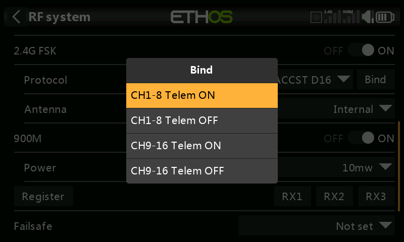

In modalità D16, durante il collegamento si apre un menu a comparsa che consente di selezionare la modalità di funzionamento del ricevitore. Ci sono 4 modalità con le combinazioni di Telemetria on/off e canale 1-8 o 9-16. Questo è utile quando si utilizzano due ricevitori per la ridondanza o per collegare più di 8 servi utilizzando due ricevitori.

2. Accendi il ricevitore, mettendolo in modalità bind secondo le istruzioni del ricevitore. (In genere si fa tenendo premuto il pulsante Failsafe sul ricevitore durante l'accensione).

3. I LED rosso e verde si accendono. Il LED verde si spegnerà e il LED rosso lampeggerà al termine del processo di Binding - Collegamento.

4. Tocca OK sul trasmettitore per terminare il processo di collegamento e riaccendi il ricevitore.

5. Se il LED verde del ricevitore è acceso e il LED rosso è spento, il ricevitore è collegato al trasmettitore. Il collegamento del modulo ricevitore/trasmettitore non dovrà essere ripetuto, a meno che uno dei due non venga sostituito. Il ricevitore sarà controllato (senza essere influenzato da altri trasmettitori) solo dal trasmettitore a cui è collegato.

Avvertenze - Molto importanti

Non eseguire l'operazione di Binding - Collegamento con un motore elettrico collegato o un motore a combustione interna acceso.

Seleziona l'antenna interna o esterna (sul connettore ANT2). Sebbene lo stadio RF abbia una protezione integrata, è buona norma assicurarsi che sia stata montata un'antenna esterna prima di selezionare l'antenna esterna. Tieni presente che la selezione dell'antenna avviene per modello, quindi ogni volta che si cambia modello ETHOS imposta la modalità di antenna per il modello in questione.

Seleziona la potenza RF desiderata tra 25 e 100mW.

- Aggiunta di un ricevitore 900M ridondante.
            - 900M

Collega la porta SBUS Out del ricevitore ridondante alla porta SBUS IN del ricevitore principale.

Assicurati che il modulo 900M RF sia abilitato.

FCC: Seleziona la potenza RF desiderata tra 10, 25, 100, 200, 500mW, 1000mW.

LBT: seleziona la potenza RF desiderata tra 25mW (telemetria via 868MHz), 200mW o 500mW (telemetria via 2.4GHz).

- Registro

Se il tuo ricevitore non è ancora stato registrato, avvia il processo di registrazione selezionando \[Registra\]. I passaggi sono gli stessi descritti nella sezione [ACCESS](rf-system.md).

Spegni i ricevitori.

- Bind /collegamento

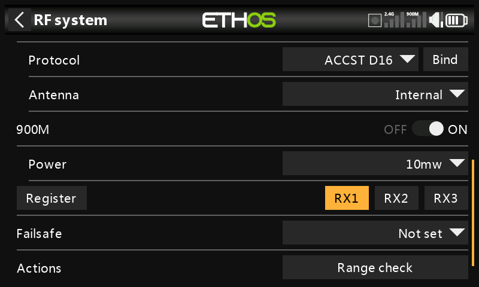

Tocca 'Bind' per avviare il binding del ricevitore 900M.

Un avviso vocale annuncerà "Bind" ogni pochi secondi per confermare che sei in modalità bind. Un popup visualizzerà "In attesa del ricevitore...".

Accendi i ricevitori.

Seleziona il ricevitore ridondante R9.

Tocca OK. Assicurati che il LED verde del ricevitore ridondante sia acceso. Il ricevitore ridondante è ora collegato.

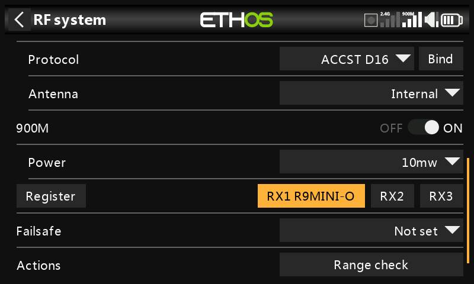

Il ricevitore ridondante sarà ora elencato.

- Opzioni del ricevitore

Le opzioni del ricevitore sono simili a quelle descritte nella sezione ACCESS.

- Reset di fabbrica

Tocca il pulsante Reset per ripristinare le impostazioni di fabbrica del ricevitore e cancellare l'UID. Il ricevitore è ora non registrato.

Failsafe

Le opzioni di sicurezza sono simili a quelle descritte nella sezione ACCESS.

Controllo portata (Range Check)

Le opzioni di controllo dell'intervallo sono simili a quelle descritte nella sezione ACCESS.

Solo ACCST D16

Con l'opzione 900M disattivata, è attiva solo la modalità ACCST D16.

- Modello ID

Quando crei un nuovo modello, l'ID modello viene assegnato automaticamente. L'ID modello deve essere un numero univoco perché la funzione Model Match assicura che solo l'ID modello corretto venga associato. Questo numero viene inviato al ricevitore durante il binding, in modo che risponda solo al numero a cui è stato associato. L'ID modello può essere modificato manualmente.

- Gamma dei canali

Scelta di quali canali interni della radio vengono effettivamente trasmessi via etere. In modalità D16 puoi scegliere tra 8 canali con dati inviati ogni 9ms e 16 canali con dati inviati ogni 18ms.

Tieni presente che la velocità di aggiornamento del servo è completamente determinata dal ricevitore. Per ACCST, consulta il manuale del ricevitore per i dettagli sulla selezione della modalità HS (High PWM Speed) da 9ms. Assicurati che i tuoi servi siano in grado di gestire questa frequenza di aggiornamento.

- Modalità Corsa

La modalità Corsa non è supportata per ACCST.

- 2.4G FSK

Abilita il modulo RF 2.4G.

Seleziona ACCST D16.

Seleziona l'antenna interna o esterna (sul connettore ANT2). Sebbene lo stadio RF abbia una protezione integrata, è buona norma assicurarsi che sia stata montata un'antenna esterna prima di selezionare l'antenna esterna. Tieni presente che la selezione dell'antenna avviene per modello, quindi ogni volta che si cambia modello ETHOS imposta la modalità di antenna per il modello in questione.

- 900M

Il modulo RF interno del 900M è spento.

- Failsafe

Le opzioni di sicurezza sono simili a quelle descritte nella sezione ACCESS.

- Azioni

1. Inizia il processo di binding selezionando \[Bind\]. Un avviso vocale annuncerà "Bind" ogni pochi secondi per confermare che sei in modalità bind.

In modalità D16, durante il collegamento si apre un menu a comparsa che consente di selezionare la modalità di funzionamento del ricevitore. Ci sono 4 modalità con le combinazioni di Telemetria on/off e canale 1-8 o 9-16. Questo è utile quando si utilizzano due ricevitori per la ridondanza o per collegare più di 8 servi utilizzando due ricevitori.

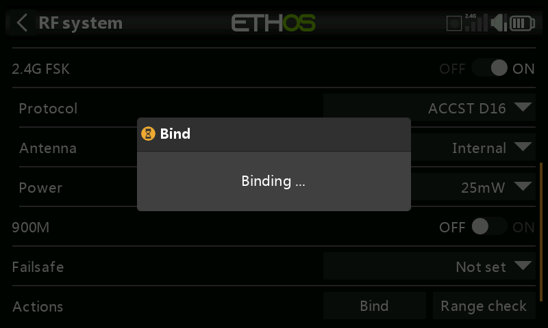

2. Accendi il ricevitore, mettendolo in modalità bind secondo le istruzioni del ricevitore. (In genere si fa tenendo premuto il pulsante Failsafe sul ricevitore durante l'accensione).

3. I LED rosso e verde si accendono. Il LED verde si spegnerà e il LED rosso lampeggerà al termine del processo di Binding - Collegamento.

4. Tocca OK sul trasmettitore per terminare il processo di collegamento e riaccendi il ricevitore.

5. Se il LED verde del ricevitore è acceso e il LED rosso è spento, il ricevitore è collegato al trasmettitore. Il collegamento del modulo ricevitore/trasmettitore non dovrà essere ripetuto, a meno che uno dei due non venga sostituito. Il ricevitore sarà controllato (senza essere influenzato da altri trasmettitori) solo dal trasmettitore a cui è collegato.

Avvertenze - Molto importanti

Non eseguire l'operazione di Binding - Collegamento con un motore elettrico collegato o un motore a combustione interna acceso.

Il controllo dell'intervallo si attiva selezionando "Controllo dell'intervallo".

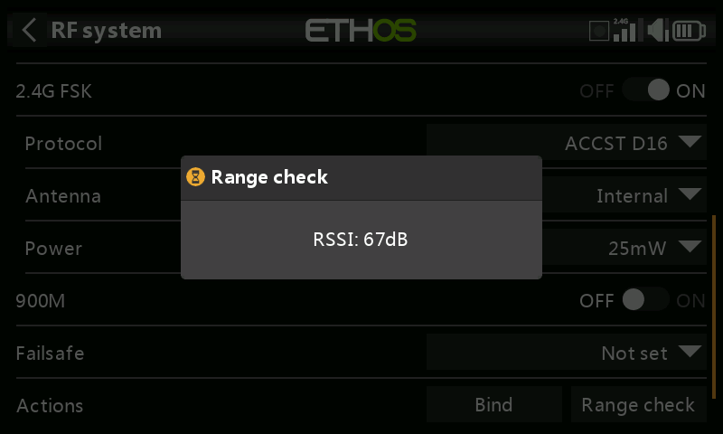

Un avviso vocale annuncerà "Controllo portata (Range Check)" ogni pochi secondi per confermare che sei in modalità di Controllo portata (Range Check). Un popup visualizzerà il numero del ricevitore e i valori VFR% e RSSI per valutare la qualità della ricezione. Quando il Controllo portata (Range Check) è attivo, riduce la potenza del trasmettitore e di conseguenza il raggio d'azione per il test del raggio d'azione. In condizioni ideali, con la radio e il ricevitore a 1 metro dal suolo, dovresti ricevere un allarme critico solo a circa 30 metri di distanza.

Consulta la sezione Telemetria per una discussione sui valori [VFR e RSSI](telemetry.md).

Modalità ***TW***

In modalità TW c'è un collegamento RF 2.4G FSK e uno 2.4G LoRa da utilizzare con un massimo di tre ricevitori TWIN più un ricevitore 900M opzionale per la ridondanza (tramite le porte SBUS IN/OUT).

Possono esserci tre ricevitori TW registrati e vincolati o tre ricevitori 900M registrati e vincolati o una combinazione di TW e 900M per un totale di tre ricevitori.

In modalità TW con una combinazione di ricevitori 2.4G FSK e 2.4G LoRa e 900M, la telemetria per i collegamenti RF 2.4G e 900M è attiva contemporaneamente. I sensori sono identificati nella telemetria come 2.4G o 900M. Si noti che la banda 2.4G supporta 24 canali, mentre la banda 900M supporta 16 canali.

Per i dettagli sulla configurazione, consulta le sezioni seguenti.

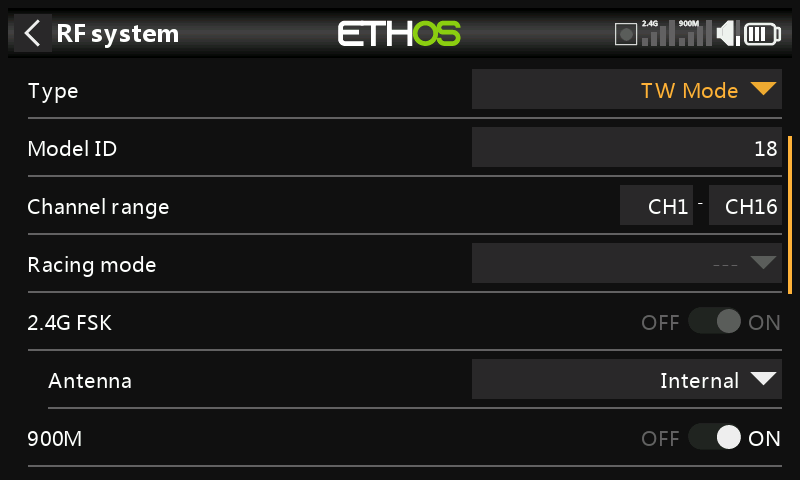

Tipo

Modalità di trasmissione del modulo RF interno. La modalità deve corrispondere al tipo supportato dal ricevitore o il modello non si collegherà! Dopo il cambio di modalità, controlla attentamente il funzionamento del modello (soprattutto il Failsafe!) e verifica che tutti i canali del ricevitore funzionino come previsto.

Tipo: ***Modalità TW***

Il modo in cui i ricevitori vengono legati e collegati al trasmettitore si divide in due Fasi. La prima fase consiste nel registrare il ricevitore alla radio o alle radio con cui deve essere utilizzato. La registrazione deve essere eseguita una sola volta per ogni coppia ricevitore/trasmettitore. Una volta registrato, un ricevitore può essere collegato e rilegato in modalità wireless con qualsiasi radio con cui è registrato, senza utilizzare il pulsante di collegamento sul ricevitore.

Dopo aver selezionato la modalità TW, è necessario impostare i seguenti parametri:

Modello ID

Quando crei un nuovo modello, l'ID modello viene assegnato automaticamente. L'ID modello deve essere un numero univoco perché la funzione Smart Match assicura che solo l'ID modello corretto venga associato. Questo numero viene inviato al ricevitore durante il binding, in modo che risponda solo al numero a cui è stato associato. L'abbinamento del ricevitore è sempre molto importante.

L'ID del modello può essere modificato manualmente da 00 a 63, mentre l'ID predefinito è 1.

Nota anche che l'ID del modello viene modificato quando il modello viene clonato.

Gamma di canali:

Dato che TW supporta fino a 24 canali, normalmente si sceglie Ch1-8, Ch1-16 o Ch1-24 per il numero di canali da trasmettere. Nota che Ch1-16 è il valore predefinito. I canali ricevuti da un ricevitore sono configurati nelle opzioni del ricevitore per ciascun ricevitore.

La scelta della gamma di canali del trasmettitore influisce anche sulla frequenza di aggiornamento trasmessa. Otto canali vengono trasmessi ogni 7 ms. Se si utilizzano più di 8 canali, le frequenze di aggiornamento dei canali sono le seguenti:

| Gamma di canali | Tasso di aggiornamento | Note |
| --- | --- | --- |
| 1-24 | 21ms | Ch1-8, poi Ch9-16, poi Ch17-24 inviati a rotazione |
| 1-16 | 14ms | Ch1-8, Ch9-16, inviati alternativamente |
| 1-8 | 7ms  | Ch1-8 |
| Modalità Racemode | 4ms | Solo servi digitali |

Modalità corsa

La modalità Racing offre una latenza molto bassa di 4ms con ricevitori come TW MX.

Se l'intervallo di canali è impostato su Ch1-8, è possibile selezionare una sorgente (ad esempio un interruttore) che abilita la modalità Corsa. Una volta che il ricevitore è stato collegato (vedi sotto) e la modalità Gara è stata abilitata, il ricevitore deve essere alimentato nuovamente affinché la modalità Gara abbia effetto.

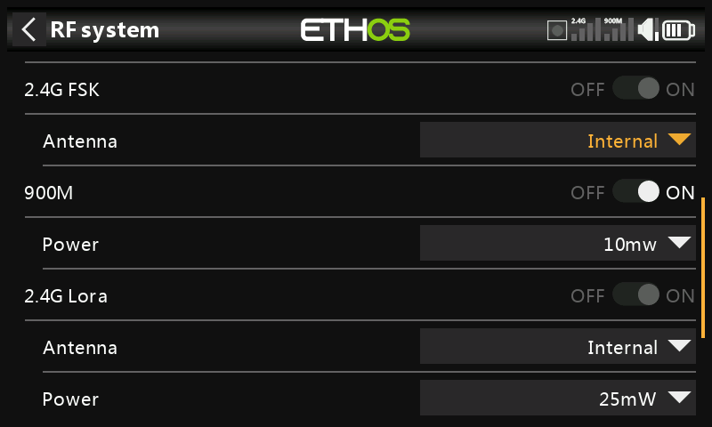

2.4G FSK

Abilita o disabilita la sezione 2.4G FSK del modulo RF interno.

- Antenna

Seleziona l'antenna interna o esterna (sul connettore ANT2). Sebbene lo stadio RF abbia una protezione integrata, è buona norma assicurarsi che sia stata montata un'antenna esterna prima di selezionare l'antenna esterna. Tieni presente che la selezione dell'antenna avviene per modello, quindi ogni volta che si cambia modello ETHOS imposta la modalità di antenna per il modello in questione.

900M

Abilita o disabilita la sezione 900M del modulo RF interno.

- Antenna

Il modulo 900M RF funziona solo con l'antenna interna.

**Potenza**:

FCC: Seleziona la potenza RF desiderata tra 10, 25, 100, 200, 500mW, 1000mW.

LBT: seleziona la potenza RF desiderata tra 25mW (telemetria via 868MHz), 200mW o 500mW (telemetria via 2.4GHz).

2.4G ***LoRa***

Abilita o disabilita la sezione 2.4G del modulo RF interno.

- Antenna

Seleziona l'antenna interna o esterna (sul connettore ANT1). Sebbene lo stadio RF abbia una protezione integrata, è buona norma assicurarsi che sia stata montata un'antenna esterna prima di selezionare l'antenna esterna. Tieni presente che la selezione dell'antenna avviene per modello, quindi ogni volta che si cambia modello ETHOS imposta la modalità di antenna per il modello in questione.

- Potenza

Seleziona la potenza RF desiderata tra 25 e 100mW.

In modalità TW i percorsi 2.4G FSK e 2.4G LoRa e 900m RF lavorano in tandem con un unico set di controlli. Possono esserci tre ricevitori TW registrati e vincolati o tre ricevitori 900M registrati e vincolati o una combinazione di TW e 900M per un totale di tre ricevitori.

Fase uno: registrazione

Registro

1. Se il tuo ricevitore non è ancora stato registrato, avvia il processo di registrazione selezionando \[Registra\]. In caso contrario, passa alla sezione Bind.

Verrà visualizzata una casella di messaggio con scritto "In attesa del destinatario..." e un avviso vocale ripetuto "Registra".

2. Tenendo premuto il tasto bind, accendi il ricevitore e attendi che i LED rosso e verde si attivino.

Il messaggio "In attesa del ricevitore..." cambia in "Ricevitore connesso" e il campo Nome Rx viene compilato automaticamente.

3. In questa fase è possibile impostare l'ID di registrazione e l'UID:

- ID di registrazione: L'ID di registrazione è a livello del proprietario o del trasmettitore. Deve essere un codice unico per la tua radio e per gli altri trasmettitori da utilizzare con Smart Share. Il valore predefinito è quello dell'impostazione "ID di registrazione del proprietario" descritta all'inizio di questa sezione, ma può essere modificato qui. Se due radio hanno lo stesso ID, puoi spostare i ricevitori (con lo stesso numero di ricevitore per un determinato modello) da una radio all'altra semplicemente utilizzando il processo di collegamento all'accensione.
- Nome RX: Compilato automaticamente, ma il nome può essere modificato se lo si desidera. Questo può essere utile se stai utilizzando più di un ricevitore e devi ricordare, ad esempio, che RX4R1 è per i canali 1-8 o RX4R2 è per i canali 9-16 o RX4R3 è per i canali 17-24 quando fai un nuovo collegamento. Qui è possibile inserire un nome per il ricevitore.
- L'UID viene utilizzato per distinguere tra più ricevitori utilizzati contemporaneamente in un unico modello. Può essere lasciato al valore predefinito di 0 per un singolo ricevitore. Quando si utilizza più di un ricevitore nello stesso modello, l'UID deve essere modificato: di solito è 0 per i Ch1-8, 1 per i Ch9-16 e 2 per i Ch17-24. Tieni presente che questo UID non può essere letto dal ricevitore, quindi è bene etichettare il ricevitore.

4. Premi \[Registra\] per completare l'operazione. Viene visualizzata una finestra di dialogo con scritto "Registrazione ok". Premi \[OK\] per continuare.

5. Spegni il ricevitore. A questo punto il ricevitore è registrato, ma deve ancora essere collegato al trasmettitore da utilizzare. Ora è pronto per il binding.

Fase due - Opzioni di Binding - Collegamento e moduli

Bind /collegamento

Il binding del ricevitore consente a un ricevitore registrato di essere collegato a uno dei trasmettitori con cui è stato registrato nella fase 1, e risponderà a quel trasmettitore fino a quando non sarà nuovamente collegato a un altro trasmettitore. Assicurati di eseguire un Controllo portata (Range Check) prima di far volare il modello.

Avvertenza: molto importante

Non eseguire l'operazione di Binding - Collegamento con un motore elettrico collegato o un motore a combustione interna acceso.

1. Spegni il ricevitore.

2. Conferma di essere in modalità TW.

3. Ricevitore 1 \[Bind\]: Avvia il processo di binding selezionando \[RX1\], quindi seleziona Bind dall'elenco a discesa. Un avviso vocale annuncerà "Bind" ogni pochi secondi per confermare che sei in modalità bind. Un popup visualizzerà "In attesa del ricevitore....".

4. Accendi il ricevitore senza toccare il pulsante di collegamento F/S. Verrà visualizzato un messaggio "Seleziona dispositivo" e il nome del ricevitore che hai appena acceso.

5. Scorri fino al nome del ricevitore e selezionalo.

Verrà visualizzato un messaggio che indica che il collegamento è avvenuto con successo.

6. Spegni il trasmettitore e il ricevitore.

7. Accendi il trasmettitore e poi il ricevitore. Se il LED blu del ricevitore è acceso e il LED rosso è spento, il ricevitore è collegato al trasmettitore. Il collegamento del modulo ricevitore/trasmettitore non dovrà essere ripetuto, a meno che uno dei due non venga sostituito.

Il ricevitore sarà controllato (senza essere influenzato da altri trasmettitori) solo dal trasmettitore a cui è legato.

Il ricevitore selezionato mostrerà ora il nome RX1 accanto ad esso:

Il ricevitore è ora pronto per essere utilizzato.

Ripeti l'operazione per il Ricevitore 2 e 3, se applicabile.

Consulta anche la sezione Telemetria per una discussione sull'[RSSI](telemetry.md).

Opzioni del ricevitore

Tocca il pulsante RX1, RX2 o RX3 per visualizzare le Opzioni del ricevitore:

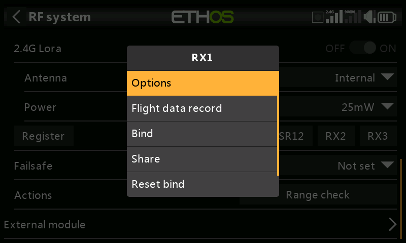

Tocca Opzioni:

- Opzioni

*Telemetria*: La telemetria può essere disabilitata per questo ricevitore

*Potenza telemetria ridotta 25mW*: casella di controllo per limitare la potenza della telemetria a 25mW (normalmente 100mW), eventualmente necessaria se, ad esempio, i servi subiscono interferenze a causa delle radiofrequenze inviate vicino a loro.

*Alta velocità PWM*: la velocità di aggiornamento del servo è completamente determinata dal ricevitore.  Questa casella di controllo abilita una velocità di aggiornamento PWM di 7 ms (contro i 18 ms standard). Assicurati che i tuoi servi siano in grado di gestire questa velocità di aggiornamento.

maggiori dettagli sulla frequenza di aggiornamento impostata sul trasmettitore, consulta la [sezione Gamma di canali (TW)](rf-system.md).

*SBUS**:* consente di selezionare la modalità SBUS-16 canali o SBUS-24 canali. Ricorda che tutti i dispositivi SBUS collegati devono supportare la modalità SBUS-24 per poter attivare il nuovo protocollo. SBUS-24 è uno sviluppo di FrSky del protocollo SBUS-16 di Futaba.

*Mappatura dei canali*: La finestra di dialogo Opzioni del ricevitore offre anche la possibilità di rimappare i canali radio sui pin del ricevitore.

*Opzioni Pin1-12*: Permette di rimappare i canali radio sui pin del ricevitore. Inoltre, ogni porta di uscita può essere riassegnata ai protocolli Smart Port, SBUS Out o FBUS (precedentemente noto come F.Port2).

Il protocollo F.Port è stato sviluppato con il team Betaflight per integrare i segnali SBUS e S.Port separati. FBUS (F.Port2) consente inoltre a un dispositivo Host di comunicare con più dispositivi Slave sulla stessa linea. Per maggiori informazioni sul protocollo delle porte, consulta la spiegazione del protocollo sul sito ufficiale di FrSky.

Il pin 1 può anche essere impostato come SBUS IN. Nell'esempio precedente, i canali sono stati ridotti di uno per fare spazio all'SBUS IN sulla porta 1 (il CH1 Aileron1 è sul pin 2).

- Registrazione dei dati di volo (scatola nera del ricevitore)

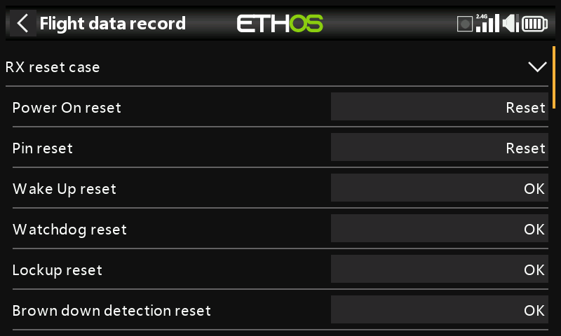

Fornisce un registro dello stato di salute del ricevitore, compreso il reset all'accensione, il reset dei pin di uscita e i risultati del wakeup, del watchdog timer, del rilevamento del blocco e del rilevamento del brown out dell'alimentazione.

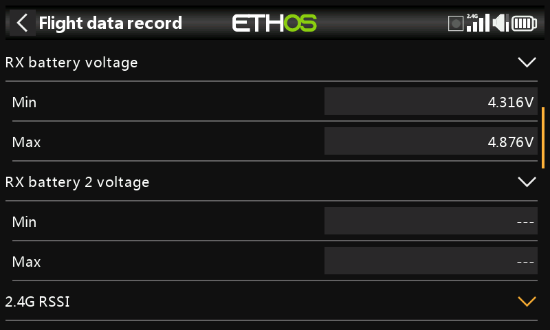

Valori minimi e massimi delle tensioni del Ricevitore 1 e 2 (se presenti) dall'accensione.

Valori minimi e massimi dei livelli RSSI 2.4G e VFR (Valid Frame Rate) dall'accensione.

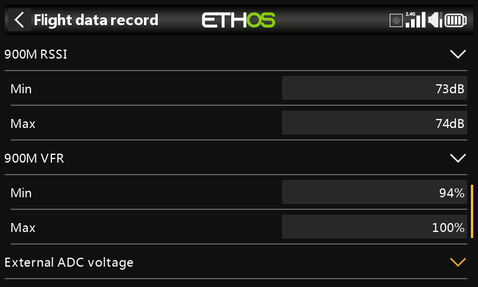

Valori minimi e massimi dei livelli RSSI e VFR (Valid Frame Rate) di 900M dall'accensione.

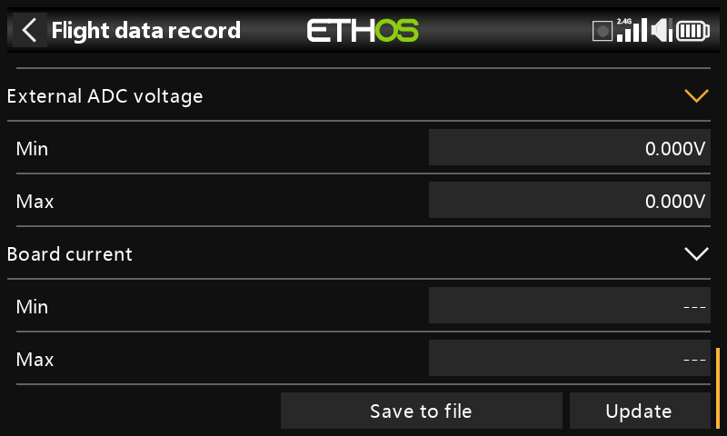

Valori minimi e massimi della porta di ingresso analogica AIN e corrente della scheda di ricezione dall'accensione.

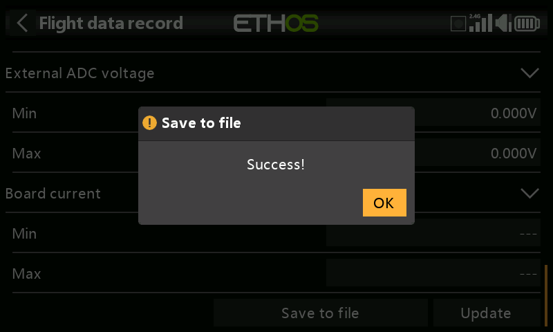

Tocca "Salva su file" per salvare i dati in un file .csv nella cartella Logs. Il file può essere letto da un editor di testo o più comodamente da LibreOffice.

Tocca il pulsante Aggiorna per aggiornare i dati del Flight Data Record.

- Condividi

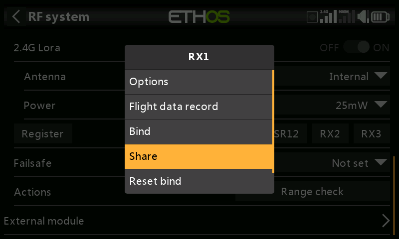

La funzione Condividi consente di spostare il ricevitore su un'altra radio in modalità TW con un diverso "ID di registrazione del proprietario". Quando si tocca l'opzione Condividi, il LED verde del ricevitore si spegne.

Sulla radio di destinazione B, vai alla modalità RF System TW e a Receiver(n) e seleziona Bind. Nota che il processo di condivisione salta la fase di registrazione sulla radio B, perché l'"ID di registrazione del proprietario" viene trasferito dalla radio A. Viene visualizzato il nome del ricevitore della radio sorgente. Seleziona il nome, il ricevitore si legherà e il suo LED diventerà verde.

Verrà visualizzato il messaggio "Bind successful".

Tocca OK. La radio B ora controlla il ricevitore. Il ricevitore rimarrà legato a questa radio finché non deciderai di cambiarla.

Premi il pulsante EXIT sulla Radio A per interrompere il processo di condivisione.

Il ricevitore può essere riportato alla radio A effettuando un nuovo collegamento alla radio A.

Nota: non è necessario utilizzare la funzione "Condividi" se tutte le radio utilizzano lo stesso numero di "ID di registrazione del proprietario". Puoi semplicemente mettere la radio che vuoi usare in modalità bind, accendere il ricevitore, selezionare il ricevitore nella radio e questo si legherà a quella radio. Puoi passare a un'altra radio nello stesso modo. Quando si copiano i modelli, è meglio mantenere i numeri dei ricevitori uguali.

- Reset - Azzeramento del binding

Se cambi idea sulla condivisione di un modello, seleziona "Ripristina il binding" per ripulire e ripristinare il binding. Spegni il ricevitore e sarà collegato al tuo trasmettitore.

- Reset di fabbrica

Tocca il pulsante Reset per ripristinare le impostazioni di fabbrica del ricevitore e cancellare l'UID. Il ricevitore non è registrato con X20.

Aggiunta di un ricevitore ridondante

Un secondo ricevitore può essere collegato a uno slot non utilizzato, ad esempio RX2 o RX3, per fornire una ridondanza in caso di problemi di ricezione. L'esempio seguente mostra l'aggiunta di un ricevitore 900M.

1. Collega la porta SBUS Out del ricevitore ridondante alla porta SBUS IN del ricevitore principale.

Tieni presente che potrebbe essere necessario riassegnare una porta del ricevitore alla funzione SBUS IN. Consulta la sezione [Mappatura dei canali](rf-system.md).

2. Abilita il modulo RF interno 900M. Nota che il modulo RF 900M funziona solo con l'antenna interna.

2a. Configura le opzioni di potenza RF.

**Potenza**:

FCC: Seleziona la potenza RF desiderata tra 10, 25, 100, 200, 500mW, 1000mW.

LBT: seleziona la potenza RF desiderata tra 25mW (telemetria via 868MHz), 200mW o 500mW (telemetria via 2.4GHz).

3. Se il tuo ricevitore non è ancora stato registrato, avvia il processo di registrazione selezionando \[Registra\]. In caso contrario, passa alla sezione Legami.

4. Registra il nuovo ricevitore, ad esempio l'R9MINI-O di cui sopra.

5. Spegni i ricevitori.

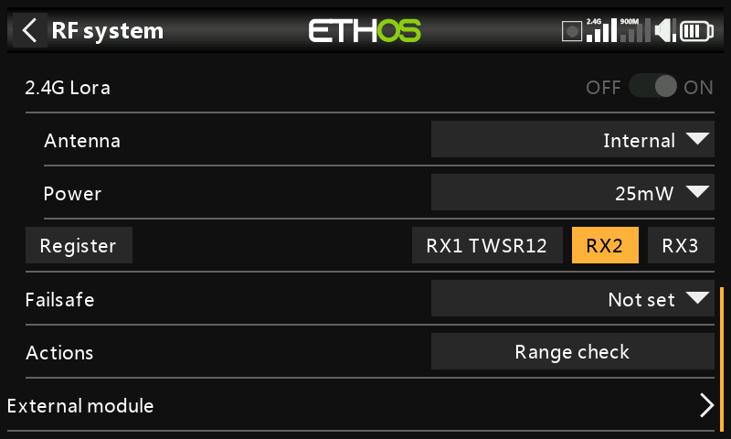

6. Tocca "Bind" sulla linea RX2 o RX3.

Un avviso vocale annuncerà "Bind" ogni pochi secondi per confermare che sei in modalità bind. Un popup visualizzerà "In attesa del ricevitore...".

7. Accendi i ricevitori.

8. Seleziona il ricevitore ridondante R9.

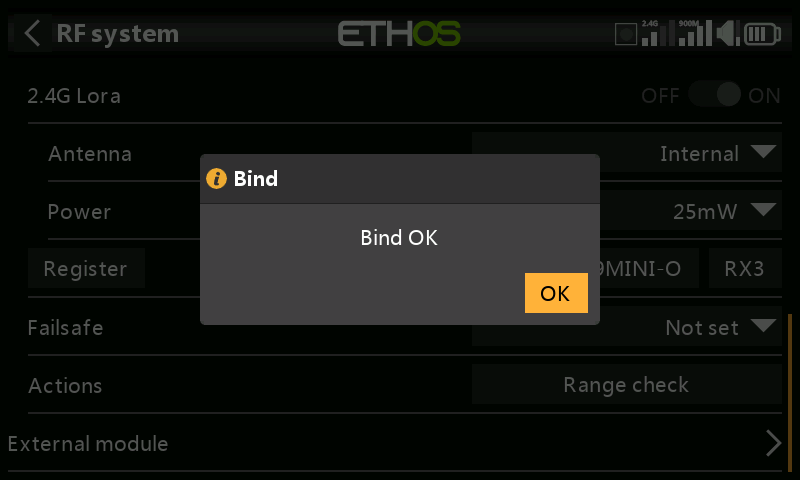

9. Tocca OK. Assicurati che il LED verde del ricevitore ridondante sia acceso. Il ricevitore ridondante è ora collegato.

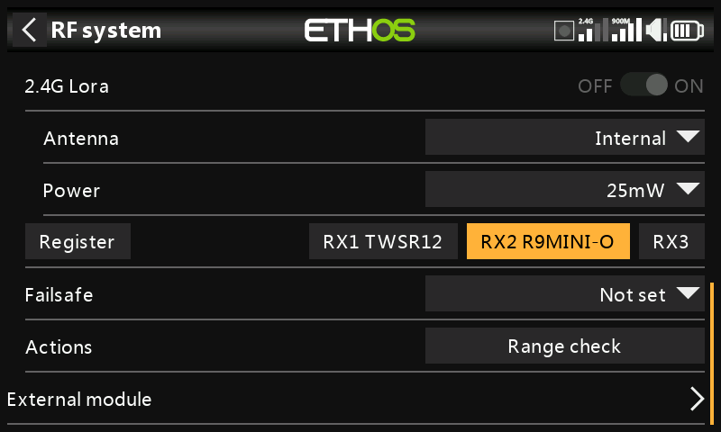

10. A questo punto verrà elencato il ricevitore ridondante, ad esempio l'R9MINI di cui sopra.

Nota: sebbene sia possibile associare allo stesso UID sia il ricevitore principale che quello ridondante accendendoli singolarmente, non avrai ACCESS alle Opzioni Rx quando entrambi sono accesi.

Failsafe

La modalità Failsafe determina cosa succede al ricevitore quando il segnale del trasmettitore viene perso.

I dati di failsafe vengono inviati dal trasmettitore ogni 10 secondi circa. Si noti che per i ricevitori TD, TW, AP e AP Plus i dati di failsafe sono ora salvati sul ricevitore, il che significa che le impostazioni di failsafe sono immediatamente disponibili se il ricevitore si riavvia per qualsiasi motivo.

Tocca la casella a discesa per visualizzare le opzioni di sicurezza:

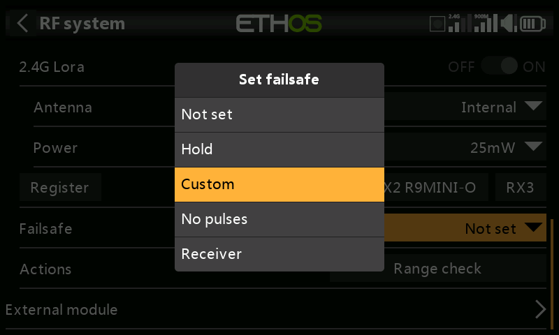

Tieni

Hold manterrà le ultime posizioni ricevute.

Personalizzato

Custom permette di spostare i servi in posizioni personalizzate e predefinite. La posizione per ogni canale può essere definita separatamente. Ogni canale ha le opzioni Non impostato, Mantieni, Ad Hoc - Personalizzato o Nessun impulso. Se si seleziona Personalizzato, viene visualizzato il valore del canale. Se si tocca l'icona di impostazione con una freccia, viene utilizzato il valore corrente del canale. In alternativa, è possibile inserire un valore fisso per quel canale toccando il valore.

Nessun impulso

No Pulses disattiva gli impulsi (da utilizzare con i controllori di volo dotati di GPS di ritorno a casa in caso di perdita del segnale).

Ricevitore

Scegliendo "Ricevitore" sui ricevitori della serie X o successivi è possibile impostare il failsafe nel ricevitore.

*Attenzione*: Assicurati di testare attentamente le impostazioni di Failsafe scelte.

Controllo portata (Range Check)

Un Controllo portata (Range Check) deve essere effettuato sul campo quando il modello è pronto per volare.

Il controllo dell'intervallo si attiva selezionando "Controllo dell'intervallo".

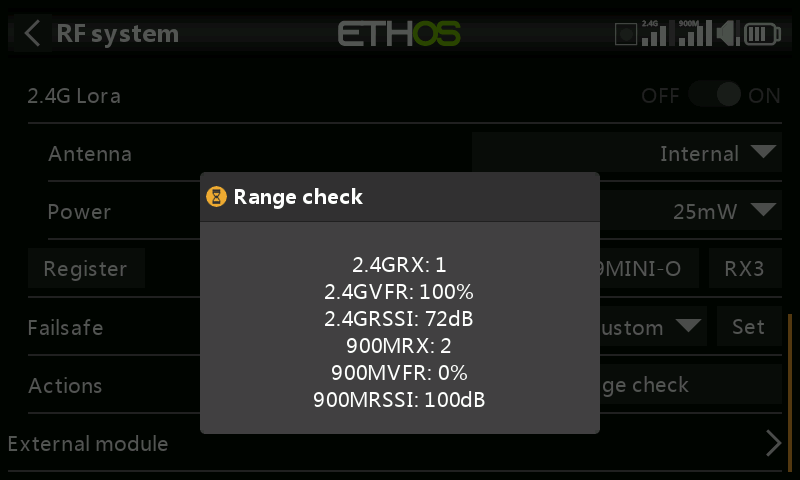

Un avviso vocale annuncerà "Range Check" ogni pochi secondi per confermare che sei in modalità range check. Un popup visualizzerà il numero del ricevitore e i valori VFR% e RSSI per valutare la qualità della ricezione. Quando il Controllo portata (Range Check) è attivo, riduce la potenza del trasmettitore e di conseguenza il raggio d'azione per il test del raggio d'azione. In condizioni ideali, con la radio e il ricevitore a 1 metro dal suolo, dovresti ricevere un allarme critico solo a circa 30 metri di distanza.

Attualmente TW in modalità di Controllo portata (Range Check) fornisce i dati di Controllo portata (Range Check) per un ricevitore alla volta sul link 2.4G e per un ricevitore alla volta sul link 900M. Se hai tre ricevitori 2.4G registrati e vincolati come Ricevitore 1, 2 e 3, uno dei ricevitori sarà il ricevitore di telemetria attivo e il suo numero sarà visualizzato dal sensore RX come 0, 1 o 2. Sarà il ricevitore che sta inviando i dati RSSI e VFR. Sarà il ricevitore che invia i dati RSSI e VFR. Se spegni quel ricevitore, il successivo diventerà il ricevitore di telemetria attivo con una priorità di 0, 1 e poi 2. Ciascuno dei tre ricevitori può essere controllato spegnendo gli altri.

Sensore RX 0 = Ricevitore 1

Sensore RX 1 = Ricevitore 2

Sensore RX 2 = Ricevitore 3

Consulta anche la sezione Telemetria per una discussione sui valori [VFR e RSSI](telemetry.md).

## Modulo RF esterno - FrSky

Attualmente sono supportati i seguenti moduli esterni FrSky: XJT Lite, R9M Lite, R9M Lite Access, R9M Lite Pro Access, TWIN Lite Pro e PPM e SBUS. Per i moduli di terze parti, consulta la sezione successiva.

I moduli esterni possono funzionare in modalità ACCESS, ACCST D16, TD MODE, ELRS o TWIN MODE. Per i dettagli sulla configurazione, consulta le sezioni seguenti.

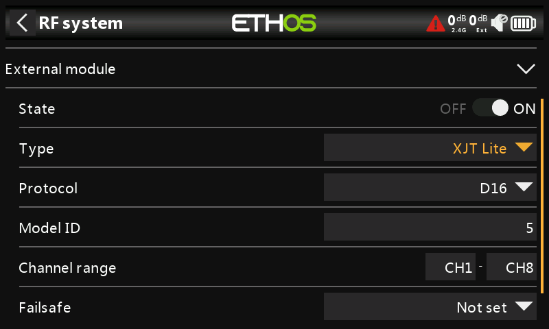

Stato

Il modulo esterno può essere acceso o spento.

Tipo

XJT Lite

Protocollo

L'XJT Lite può funzionare in modalità D16 (fino a 16 canali), D8 (fino a 8 canali) o LR12 (fino a 12 canali).

Tipo

R9M Lite

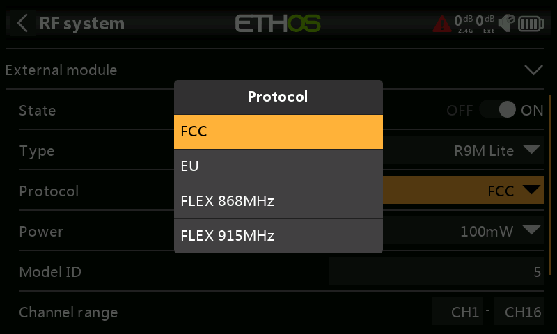

Protocollo

L'R9M Lite può funzionare nelle seguenti modalità:

| Modalità | Frequenza operativa RF | Potenza RF |
| --- | --- | --- |
| FCC | 915MHz | 100mW (con telemetria) |
| UE | 868MHz | 25mW (con telemetria) / 100mW (senza telemetria) |
| FLEX 868MHz | Regolabile | 100mW (con telemetria) |
| FLEX 915MHz | Regolabile | 100mW (con telemetria) |

Tipo

R9M Lite ACCESS

Protocollo

L'R9M Lite ACCESS funziona in modalità ACCESS.

Tipo

R9M Lite Pro ACCESS

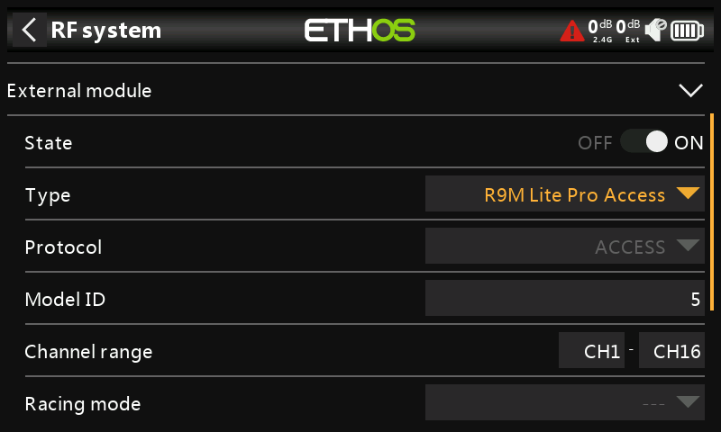

Protocollo

L'R9M Lite Pro ACCESS funziona in modalità ACCESS.

| Modalità | Frequenza operativa RF | Potenza RF |
| --- | --- | --- |
| FCC | 915MHz | 10mW / 100mW / 500mW / 100mW~1W (autoadattativo) |
| UE | 868MHz | Modalità telemetrica (25mW) / Modalità non telemetrica (200mW / 500mW) |

Tipo

TWIN Lite Pro

Twin Lite PRO è un potente modulo RF che consente alle radio ETHOS di collegarsi ai ricevitori della serie TW e di supportare le doppie frequenze 2.4G del protocollo TW contemporaneamente sullo stesso ricevitore. Il protocollo TW attivo-attivo è diverso dalle soluzioni generali di ridondanza attiva-standby (in cui un ricevitore assume il controllo del segnale solo quando l'altro è in modalità Failsafe), con il protocollo TW, le bande di frequenza 2.4G doppie sono attive sul modulo della serie TW e sul ricevitore allo stesso tempo.

Il modulo RF è dotato di due antenne esterne 2.4G montate in RF per fornire una copertura multidirezionale e più ampia per la trasmissione dei segnali rispetto a un design a singola antenna. Sfruttando queste caratteristiche, il sistema Twin è in grado di fornire una minore latenza e una maggiore affidabilità a una velocità di trasmissione dati più elevata.

Oltre alla modalità TW, questo modulo supporta anche le modalità ACCST D16, ACCESS e ELRS 2.4G. Ciò significa che gli utenti possono beneficiare di un'ampia gamma di opzioni di ricevitori compatibili da scegliere e a cui legarsi durante la costruzione del modello RC. Il modulo Twin Lite Pro offre opzioni di potenza RF fino a 500mW; grazie al guscio del modulo in metallo lavorato a CNC che favorisce la dissipazione del calore, questo sistema è in grado di garantire un controllo stabile a lungo raggio per decine di chilometri durante le lunghe ore di lavoro.

Stato

Il modulo esterno può essere acceso o spento.

Protocollo

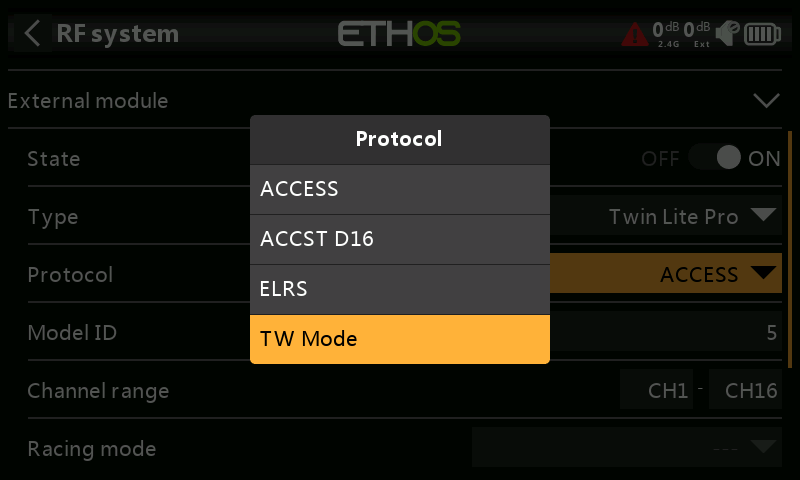

Modalità di trasmissione del modulo TWIN Lite Pro RF. Oltre alla modalità TW, questo modulo supporta anche le modalità ACCST D16, ACCESS e ELRS 2.4G.

La modalità deve corrispondere al tipo supportato dal ricevitore, altrimenti il modello non si collegherà! Dopo un cambio di modalità, controlla attentamente il funzionamento del modello (soprattutto il Failsafe!) e verifica che tutti i canali del ricevitore funzionino come previsto.

Protocollo: Modalità TW

In termini di connessione, la modalità TW è simile ad ACCESS per quanto riguarda il modo in cui i ricevitori vengono connessi al trasmettitore. Il processo è suddiviso in due Fasi. La prima fase consiste nel registrare il ricevitore alla radio o alle radio con cui deve essere utilizzato. La registrazione deve essere eseguita una sola volta per ogni coppia ricevitore/trasmettitore. Una volta registrato, un ricevitore può essere collegato e rilegato in modalità wireless con qualsiasi radio con cui è registrato, senza utilizzare il pulsante di collegamento sul ricevitore.

Dopo aver selezionato la modalità TW, è necessario impostare i seguenti parametri:

- Modello ID

Quando crei un nuovo modello, l'ID modello viene assegnato automaticamente. L'ID modello deve essere un numero univoco perché la funzione Smart Match assicura che solo l'ID modello corretto venga associato. Questo numero viene inviato al ricevitore durante il binding, in modo che risponda solo al numero a cui è stato associato. L'ID modello può essere modificato manualmente. Si noti anche che l'ID modello viene modificato quando il modello viene clonato.

- Gamma di canali:

Poiché la modalità TW supporta fino a 24 canali, di solito si sceglie Ch1-8, Ch1-16 o Ch1-24 per il numero di canali da trasmettere. Nota che Ch1-16 è il valore predefinito. I canali ricevuti da un ricevitore sono configurati nelle opzioni del ricevitore per ciascun ricevitore.

La scelta della gamma di canali del trasmettitore influisce anche sulla frequenza di aggiornamento trasmessa. Otto canali vengono trasmessi ogni 7 ms. Se si utilizzano più di 8 canali, le frequenze di aggiornamento dei canali sono le seguenti:

| Gamma di canali | Tasso di aggiornamento | Note |
| --- | --- | --- |
| 1-24 | 21ms | Ch1-8, poi Ch9-16, poi Ch17-24 inviati a rotazione |
| 1-16 | 14ms | Ch1-8, Ch9-16, inviati alternativamente |
| 1-8 | 7ms  | Ch1-8 |
| Modalità Racemode | 4ms | Solo servi digitali |

- Modalità corsa

La modalità Racing offre una latenza molto bassa di 4 ms con ricevitori come TW MX. Il modulo RF e il ricevitore RS devono essere in versione 2.1.7 o successiva.

Se l'intervallo dei canali è impostato su Ch1-8, è possibile selezionare una sorgente (ad esempio un interruttore) che abiliti la modalità Corsa. Una volta che il ricevitore RS è stato collegato (vedi sotto) e la modalità Corsa è stata abilitata, il ricevitore RS deve essere alimentato nuovamente affinché la modalità Corsa abbia effetto.

- Potenza

Seleziona la potenza RF desiderata tra 10, 25, 100, 200, 500mW.

- Fase uno: registrazione
            - 

1. Se il tuo ricevitore non è ancora stato registrato, avvia il processo di registrazione selezionando \[Registra\]. In caso contrario, passa alla sezione Legami.

Verrà visualizzata una casella di messaggio con scritto "Waiting...." e un avviso vocale ripetuto "Register".

2. Tenendo premuto il tasto bind, accendi il ricevitore e attendi che i LED rosso e verde si attivino.

Il messaggio "In attesa..." cambia in "Ricevitore connesso" e il campo Nome Rx viene compilato automaticamente.

3. In questa fase è possibile impostare l'ID di registrazione e l'UID:

- ID di registrazione: L'ID di registrazione è a livello del proprietario o del trasmettitore. Deve essere un codice unico per la tua radio e per gli altri trasmettitori da utilizzare con Smart Share. Il valore predefinito è quello dell'impostazione ID di registrazione del proprietario descritta all'inizio di questa sezione, ma può essere modificato qui. Se due radio hanno lo stesso ID, puoi spostare i ricevitori (con lo stesso numero di ricevitore per un determinato modello) da una all'altra semplicemente utilizzando la procedura di accensione.
- Nome RX: Compilato automaticamente, ma il nome può essere modificato se lo si desidera. Questo può essere utile se stai utilizzando più di un ricevitore e devi ricordare, ad esempio, che RX4R1 è per i canali 1-8 o RX4R2 è per i canali 9-16 o RX4R3 è per i canali 17-24 quando fai un nuovo collegamento. Qui è possibile inserire un nome per il ricevitore.
- L'UID viene utilizzato per distinguere tra più ricevitori utilizzati contemporaneamente in un unico modello. Può essere lasciato al valore predefinito di 0 per un singolo ricevitore. Quando si utilizza più di un ricevitore nello stesso modello, l'UID deve essere modificato: di solito è 0 per i Ch1-8, 1 per i Ch9-16 e 2 per i Ch17-24. Tieni presente che questo UID non può essere letto dal ricevitore, quindi è bene etichettare il ricevitore.

4. Premi \[Registra\] per completare l'operazione.

5. Viene visualizzata una finestra di dialogo con scritto "Registrazione ok". Premi \[OK\] per continuare.

6. Spegni il ricevitore. A questo punto il ricevitore è registrato, ma deve ancora essere collegato al trasmettitore per essere utilizzato.

- Fase due - Opzioni di Binding - Collegamento e moduli

Il binding del ricevitore consente a un ricevitore registrato di essere collegato a uno dei trasmettitori con cui è stato registrato nella fase 1, e risponderà a quel trasmettitore fino a quando non sarà nuovamente collegato a un altro trasmettitore. Assicurati di eseguire un Controllo portata (Range Check) prima di far volare il modello.

Numero del ricevitore: conferma il numero del ricevitore con cui il modello deve funzionare. L'abbinamento del ricevitore è ancora importante come lo era prima di ACCESS.  Il numero del ricevitore definisce il comportamento della funzione Smart Match. Questo numero viene inviato al ricevitore durante l'abbinamento, che risponderà solo al numero a cui è stato abbinato. L'ID del modello può essere modificato manualmente.

- Bind /collegamento

Avvertenza: molto importante

Non eseguire l'operazione di Binding - Collegamento con un motore elettrico collegato o un motore a combustione interna acceso.

1. Spegni il ricevitore.

2. Conferma di essere in modalità ACCESS.

3. Ricevitore 1 \[Bind\]: Avvia il processo di binding selezionando \[RX1\], quindi seleziona Bind dall'elenco a discesa. Un avviso vocale annuncerà "Bind" ogni pochi secondi per confermare che sei in modalità bind. Un popup visualizzerà "In attesa del ricevitore....".

4. Accendi il ricevitore senza toccare il pulsante di collegamento F/S. Verrà visualizzato un messaggio "Seleziona dispositivo" e il nome del ricevitore che hai appena acceso.

5. Scorri fino al nome del ricevitore e selezionalo. Verrà visualizzato un messaggio che indica che il collegamento è avvenuto con successo.

6. Spegni il trasmettitore e il ricevitore.

7. Accendi il trasmettitore e poi il ricevitore. Se il LED verde del ricevitore è acceso e il LED rosso è spento, il ricevitore è collegato al trasmettitore. Il collegamento del modulo ricevitore/trasmettitore non dovrà essere ripetuto, a meno che uno dei due non venga sostituito.

Il ricevitore sarà controllato (senza essere influenzato da altri trasmettitori) solo dal trasmettitore a cui è legato.

Il ricevitore selezionato mostrerà ora per RX1 il nome accanto ad esso: TDMX

Il ricevitore è ora pronto per essere utilizzato.

Ripeti l'operazione per il Ricevitore 2 e 3, se applicabile.

Consulta anche la sezione Telemetria per una discussione sull'[RSSI](telemetry.md).

- Opzioni del ricevitore

Tocca il pulsante RX1, RX2 o RX3 per visualizzare le Opzioni del ricevitore:

Tocca Opzioni:

*Telemetria 25mW*: casella di controllo per limitare la potenza della telemetria a 25mW (normalmente 100mW), eventualmente necessaria se, ad esempio, i servi subiscono interferenze a causa delle radiofrequenze inviate vicino a loro.

*Alta velocità PWM*: la velocità di aggiornamento del servo è completamente determinata dal ricevitore.  Questa casella di controllo abilita una velocità di aggiornamento PWM di 7 ms (contro i 18 ms standard). Assicurati che i tuoi servi siano in grado di gestire questa velocità di aggiornamento.

maggiori dettagli sulla frequenza di aggiornamento impostata sul trasmettitore, consulta la [sezione Gamma di canali (ACCESS)](rf-system.md).

*Porta*: Consente di selezionare la SmartPort del ricevitore in modo da utilizzare il protocollo S.Port, F.Port o FBUS (F.Port2). Il protocollo F.Port è stato sviluppato con il team Betaflight per integrare i segnali SBUS e S.Port separati. FBUS (F.Port2) consente inoltre a un dispositivo Host di comunicare con diversi dispositivi Slave sulla stessa linea. Per maggiori informazioni sul protocollo delle porte, consulta la spiegazione del protocollo sul sito ufficiale di FrSky.

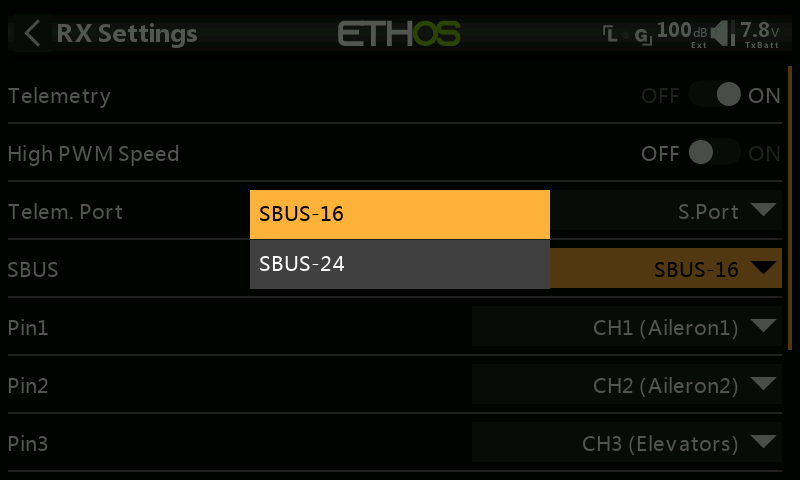

*SBUS**:* permette di selezionare la modalità SBUS-16 canali o SBUS-24 canali. Tieni presente che tutti i dispositivi SBUS collegati devono supportare la modalità SBUS-24 per poter attivare il nuovo protocollo. SBUS-24 è uno sviluppo di FrSky del protocollo SBUS-16 di Futaba.

*Mappatura dei canali*: La finestra di dialogo Opzioni del ricevitore offre anche la possibilità di riattribuire i canali ai pin del ricevitore.

Registro dello stato di salute del ricevitore, compreso il reset all'accensione, il reset dei pin di uscita e i risultati di wakeup, watchdog timer, rilevamento del blocco e rilevamento del brown out dell'alimentazione.

La funzione Condividi permette di spostare il ricevitore su un'altra radio ACCESS con un diverso "ID di registrazione del proprietario". Quando si tocca l'opzione Condividi, il LED verde del ricevitore si spegne.

Sulla radio di destinazione B, vai alla sezione Sistema RF e Ricevitore(n) e seleziona Collega. Nota che il processo di condivisione salta la fase di registrazione sulla radio B, perché l'"ID di registrazione del proprietario" viene trasferito dalla radio A. Viene visualizzato il nome del ricevitore della radio sorgente. Seleziona il nome, il ricevitore si legherà e il suo LED diventerà verde.

Verrà visualizzato il messaggio "Bind successful".

Tocca OK. La radio B ora controlla il ricevitore. Il ricevitore rimarrà legato a questa radio finché non deciderai di cambiarla.

Premi il pulsante EXIT sulla Radio A per interrompere il processo di condivisione.

Il ricevitore può essere riportato alla radio A effettuando un nuovo collegamento alla radio A.

Nota: non è necessario utilizzare la funzione "Condividi" se tutte le radio utilizzano lo stesso numero di "ID di registrazione del proprietario". Puoi semplicemente mettere la radio che vuoi usare in modalità bind, accendere il ricevitore, selezionare il ricevitore nella radio e questo si legherà a quella radio. Puoi passare a un'altra radio nello stesso modo. Quando si copiano i modelli, è meglio mantenere i numeri dei ricevitori uguali.

Se cambi idea sulla condivisione di un modello, seleziona "Ripristina il binding" per ripulire e ripristinare il binding. Spegni il ricevitore e sarà collegato al tuo trasmettitore.

Tocca il pulsante Reset per ripristinare le impostazioni di fabbrica del ricevitore e cancellare l'UID. Il ricevitore non è registrato con X20.

Failsafe

La modalità Failsafe determina cosa succede al ricevitore quando il segnale del trasmettitore viene perso.

Tocca la casella a discesa per visualizzare le opzioni di sicurezza:

- Mantieni

Hold manterrà le ultime posizioni ricevute.

- Personalizzato

Custom permette di spostare i servi in posizioni personalizzate e predefinite. La posizione per ogni canale può essere definita separatamente. Ogni canale ha le opzioni Non impostato, Mantieni, Personalizzato o Nessun impulso. Se si seleziona Personalizzato, viene visualizzato il valore del canale. Se si tocca l'icona di impostazione con una freccia, viene utilizzato il valore corrente del canale. In alternativa, è possibile inserire un valore fisso per quel canale toccando il valore.

- Nessun impulso

No Pulses disattiva gli impulsi (da utilizzare con i controllori di volo dotati di GPS di ritorno a casa in caso di perdita del segnale).

- Ricevitore

Scegliendo "Ricevitore" sui ricevitori della serie X o successivi è possibile impostare il failsafe nel ricevitore.

***Attenzione***: Assicurati di testare attentamente le impostazioni di Failsafe scelte.

- Controllo portata (Range Check)

Un Controllo portata (Range Check) deve essere effettuato sul campo quando il modello è pronto per volare.

Il Controllo portata (Range Check) si attiva selezionando "Controllo portata (Range Check)". Un avviso vocale annuncerà "Range Check" ogni pochi secondi per confermare che sei in modalità range check. Un popup visualizzerà il numero del ricevitore e i valori VFR% e RSSI per valutare la qualità della ricezione. Quando il Range Check è attivo, riduce la potenza del trasmettitore, che a sua volta riduce il raggio d'azione per i test di portata. In condizioni ideali, con la radio e il ricevitore a 1 metro dal suolo, dovresti ricevere un allarme critico solo a circa 30 metri di distanza.

Attualmente la Modalità TW in modalità di Controllo portata (Range Check) fornisce i dati di Controllo portata (Range Check) per un ricevitore alla volta, mostrando entrambi i collegamenti 2.4G. Se hai tre ricevitori registrati e vincolati come Ricevitore 1, 2 e 3, uno dei ricevitori sarà quello attivo per la telemetria e il suo numero sarà visualizzato dal sensore RX come 0, 1 o 2. Sarà il ricevitore che sta inviando i dati RSSI e VFR. Sarà il ricevitore che invia i dati RSSI e VFR. Se spegni quel ricevitore, il successivo diventerà il ricevitore di telemetria attivo con una priorità di 0, 1 e poi 2. Ciascuno dei tre ricevitori può essere controllato spegnendo gli altri.

Sensore RX 0 = Ricevitore 1

Sensore RX 1 = Ricevitore 2

Sensore RX 2 = Ricevitore 3

Consulta anche la sezione Telemetria per una discussione sui valori [VFR e RSSI](telemetry.md).

Tipo: ELRS

Il protocollo ELRS supporta il progetto open-source ExpressLRS. ExpressLRS 2.4G mira a ottenere prestazioni complete in termini di velocità, latenza e portata.

Se utilizzi un modulo ELRS vero e proprio (piuttosto che il modulo TWIN Lite Pro RF in modalità ELRS), devi installare lo script ELRS Lua in scripts/elrs, prima di ottenere l'opzione ELRS come modulo.

- Gamma di canali

Sono supportati dodici canali. Per maggiori dettagli sulle opzioni di configurazione, consulta la sezione Modalità di commutazione.

- Imposta - Config

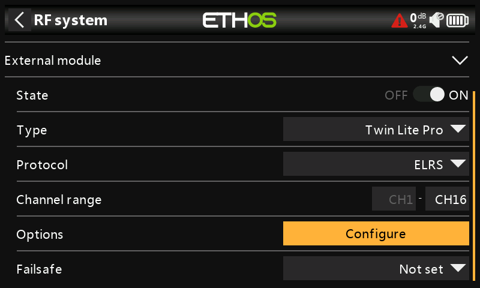

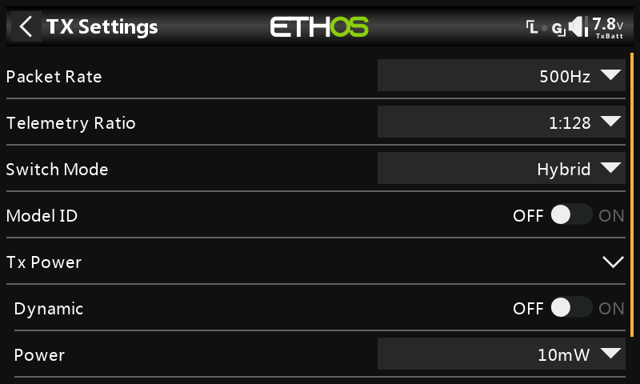

La velocità dei pacchetti consente di raggiungere un compromesso tra portata e latenza. Una frequenza di pacchetti più elevata comporta una latenza inferiore, ma a costo di ridurre la portata.

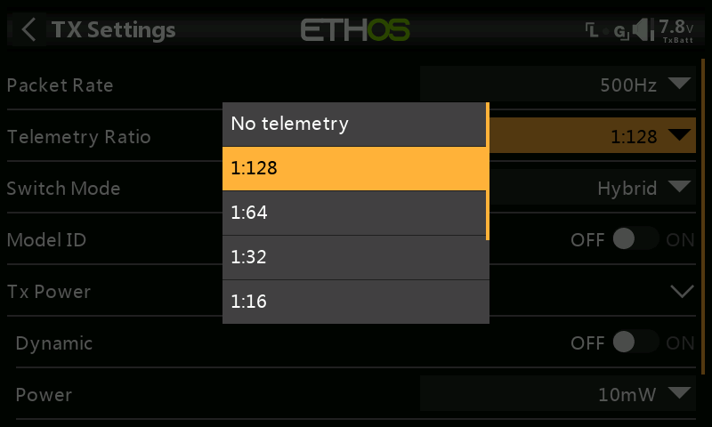

Il rapporto di telemetria determina la frequenza di invio dei dati di telemetria. Ad esempio, 1:64 significa che i dati di telemetria vengono inviati ogni 64 fotogrammi. Le opzioni sono: 1:128, 1:64, 1:32, 1:16, 1:8, 1:4 e 1:1.

L'impostazione della modalità di commutazione controlla il modo in cui i canali AUX1-AUX8 (canale da 5 a 12) vengono inviati al ricevitore. I primi 4 canali principali sono sempre a 10 bit. Le opzioni sono Hybrid e Wide.

Con la modalità ibrida, la maggior parte dei canali sarà a 2 o 3 posizioni, questo per ridurre la latenza.

L'opzione "Wide" rende i canali a 64 o 128 bit, una risoluzione sufficiente per la maggior parte delle cose.

Nota che AUX1 (canale 5) è destinato all'armamento, quindi è sempre a 2 posizioni. Posizione bassa (1000) per disarmare e posizione alta (2000) per armare.

Se abilitata, la funzione Model Match assicura che sia stato selezionato il modello corretto.

Attivando l'opzione Dynamic Power, il sistema regola automaticamente la potenza di uscita in base al VFR e all'RSSI, risparmiando così la durata della batteria. Tuttavia, per farlo è necessario che la telemetria sia abilitata.

Le impostazioni di potenza disponibili sono 10mW, 25mW, 50mW, 100mW, 250mW, 500mW o 1000mW.

- Telemetria ELRS

Le due schermate qui sopra mostrano i sensori tipici ricevuti da un ricevitore ELRS.

Tipo

PPM

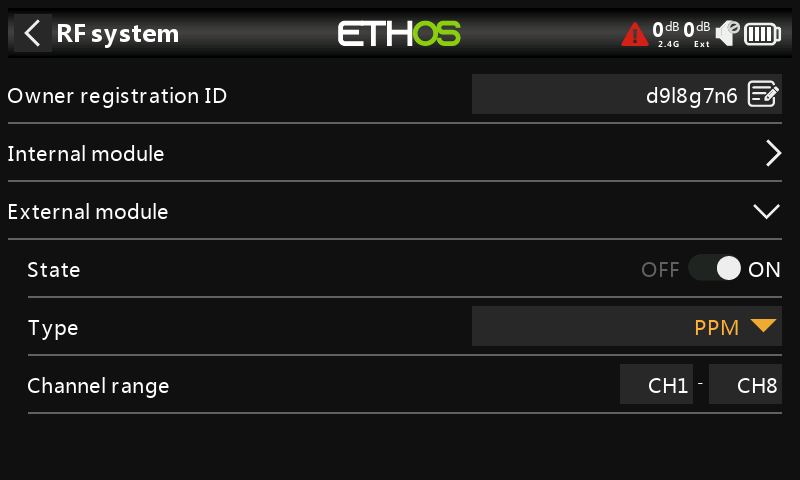

Il modulo RF esterno può funzionare in modalità PPM. Please refer to the [External module](trainer.md) section in Model / Trainer for details on configuring a slave trainer using PPM Out on the PXX OUT pin in the external module bay.

Gamma di canali

By default channels 1 to 8 are transmitted.

Tipo

SBUS

Il modulo RF esterno può funzionare in modalità SBUS. Per ulteriori dettagli sulla configurazione di un trainer slave tramite l'uscita SBUS sul pin PXX OUT nell'alloggiamento del modulo esterno, consultare la sezione dedicata al modulo esterno in “Modello / Trainer.

Range Canali

SBUS trasmette 16 canali come default

Tipo

Trainer master (PPM)

Il modulo RF esterno può essere configurato per funzionare come “Trainer master” in modalità PPM.

Configurazione Allievo Maestro

Si prega di fare riferimento alla sezione Configurazione [Trainer master](trainer.md) per maggiori dettagli sulla configurazione del modo allievo maestro.

Connesioni Moduli Esterni

Per l'opzione SBUS (Trainer master), fare riferimento ai dettagli di connessione del modulo esterno riportati di seguito.

Analogamente, l'opzione Trainer master PPM fornisce un ingresso PPM sul pin PXX IN nell'alloggiamento del modulo esterno, da utilizzare con un ricevitore legacy dotato di uscita CPPM in modo simile all'opzione SBUS riportata di seguito.

Tipo

Allievo Maestro (SBUS)

Il Modulo esterno di trsmissione può essere configurato per operare come allievo maestro in modo SBUS.

Configurazione Allievo Maestro

Si prega di far riferimento alla sezione configurazione [Trainer master ](trainer.md) per dettagli su come configurare il modo allievo maestro.

Connessioni Modulo Esterno

Questa opzione fornisce un ingresso SBUS sul pin PXX IN nell'alloggiamento del modulo esterno. Ciò consente l'installazione di un ricevitore FrSky con uscita SBUS (ad esempio Archer RS o simili) nell'alloggiamento del modulo per fungere da ricevitore di un collegamento wireless trainer per collegare QUALSIASI radio FrSky a X20 come buddy box.

La radio slave o dello studente viene quindi collegata a questo ricevitore e trasmette normalmente. Mentre la funzione master trainer è attiva, i canali ricevuti possono controllare il modello.

##### Diagramma Pinout del modulo esterno

## Moduli RF esterni - Terze parti

Tipo

Attualmente sono supportati i moduli RF esterni Ghost, Multimodule, Express LRS e Crossfire. In futuro saranno supportati altri moduli di terze parti.

Il supporto di moduli di terze parti deve essere installato dall'utente e si ottiene installando uno script Lua che aggiunge il supporto del modulo a ETHOS. Questo meccanismo sarà sempre necessario per utilizzare moduli di terze parti e gli script Lua installati dall'utente. La selezione dei moduli di terze parti appare nella schermata RF solo dopo l'installazione dello script Lua.

Per ulteriori informazioni, consulta il post sui [moduli esterni di terze parti ](https://www.rcgroups.com/forums/showpost.php?p=49550649&postcount=18844)nella discussione su X20 ed Ethos su rcgroups e la sezione [script per i moduli esterni ](../system-setup/file-manager.md)per i dettagli sulla posizione in cui memorizzare gli script Lua per l'installazione dei moduli di terze parti supportati.

Multimodulo

Ethos supporta il flashing del Multimodulo IRX4 Lite.

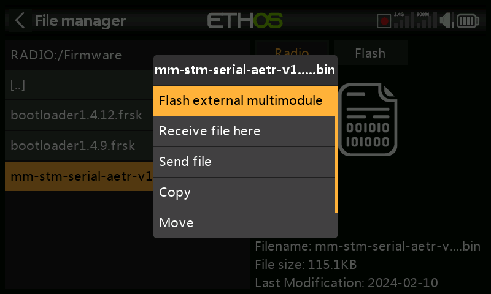

Copia il file del firmware del multimodulo nella cartella Firmware della radio, poi usa File Manager per cercare il file. Tocca il nome del file evidenziato e seleziona "Flash multimodulo esterno". Il flash inizierà con un grafico a barre che mostrerà il progresso.
