# Funzioni speciali

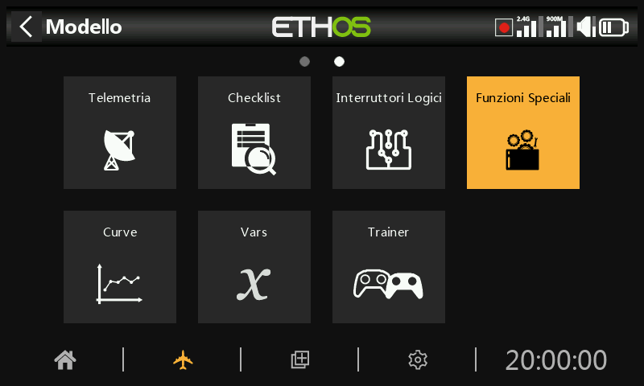

Le funzioni speciali possono essere configurate per riprodurre valori, suoni, ecc. Sono supportate fino a 100 funzioni speciali.

Non ci sono funzioni speciali predefinite. Tocca il pulsante "+" per aggiungere una funzione speciale.

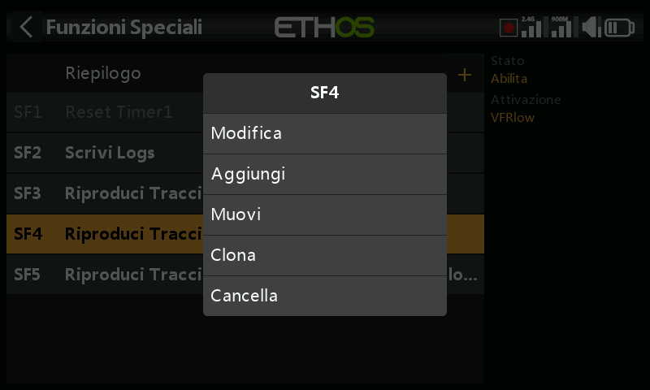

Una volta definite le funzioni speciali, toccandone una si aprirà il menu a comparsa di cui sopra, che ti permetterà di modificare, aggiungere, spostare, copiare/incollare, clonare o eliminare quella funzione speciale.

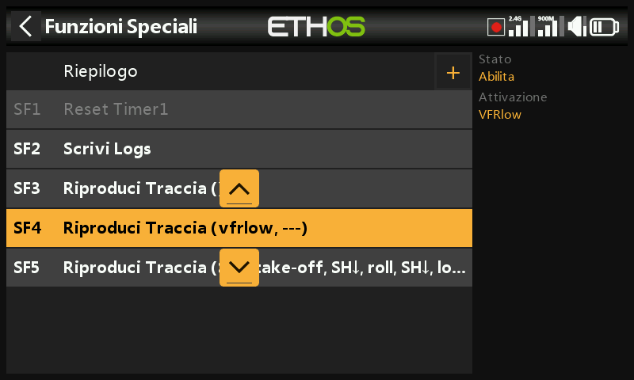

Selezionando "Sposta" appariranno dei tasti freccia che permetteranno di spostare la funzione speciale verso l'alto o verso il basso.

## Funzioni speciali (FS)

Attualmente sono supportate le seguenti funzioni speciali:

- Reset - Azzeramento
- Screenshot
- Imposta il failsafe
- Riproduci l'audio
- Aptico
- Scrivi i log                                                                                                    
- Riproduci testo (solo X20 Pro)
- Vai alla pagina
- Blocca il touchscreen
- Modello di carico
- Esegui vario

FS Parametri Comuni

Questi parametri sono comuni in tutte funzioni Speciali:

Stato

Abilita o disabilita questa funzione speciale.

Condizione Attiva

La funzione speciale può essere impostata su “Sempre attiva” oppure attivata in base alle posizioni degli interruttori, agli interruttori di funzione, alle modalità di volo, agli interruttori logici, alle posizioni di trim o alle modalità di volo.  
  
Per selezionare l'inverso, ad esempio, dell'interruttore SG-su, premere a lungo il tasto Invio sul nome dell'interruttore e selezionare la casella di controllo “Negativo” nella finestra a comparsa: il valore dell'interruttore cambierà in !SG-su. Ciò significa che la funzione speciale sarà attiva quando l'interruttore SG non si trova nella posizione “su”.

Globale

Quando si seleziona “Globale”, la funzione speciale viene aggiunta a tutti i modelli esistenti e a qualsiasi nuovo modello creato in futuro. Se un modello esistente dispone già della funzione, la funzione globale viene aggiunta come nuova funzione. Disattivando la funzione globale su un modello qualsiasi, la funzione viene rimossa da tutti i modelli tranne che dal modello attualmente selezionato.   
  
Le funzioni speciali globali sono memorizzate nel file radio.bin, mentre quelle locali sono memorizzate nel file del modello. Pertanto, sopravvivono alla cancellazione del modello e non hanno un “originale”.

Azione: RESET - Reset - Azzeramento

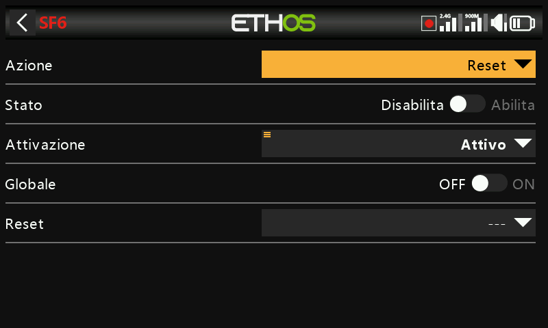

Si prega inoltre di fare riferimento alla sezione “Parametri comuni FS” riportata sopra.

Stato

Abilita o disabilita questa funzione speciale.

Condizione attiva

La funzione speciale può essere "sempre attiva" o attivata da posizioni di interruttori, interruttori di funzione, Fase di volo, interruttori logici, posizioni di trim o Fase di volo.

Per selezionare l'inverso dell'interruttore SG-up, ad esempio, se premi a lungo Invio sul nome dell'interruttore e selezioni la casella Negativo nel popup, il valore dell'interruttore cambierà in !SG-up. Ciò significa che la funzione speciale sarà attiva quando l'interruttore SG non è in posizione di salita.

Globale

Selezionando Globale, la funzione speciale viene aggiunta a tutti i modelli esistenti e a qualsiasi nuovo modello creato in futuro. Se un modello esistente ha già la funzione, la funzione globale viene aggiunta come nuova funzione. Disattivando la funzione globale su qualsiasi modello, la funzione viene rimossa da tutti i modelli tranne quello correntemente selezionato.

Le funzioni speciali globali sono memorizzate nel file radio.bin, mentre quelle locali sono memorizzate nel file del modello.

Reset - Azzeramento

Le seguenti categorie possono essere azzerate:

-	Dati di volo: azzera sia la telemetria che i timer

-	Tutti i timer: azzera tutti gli 8 timer

-	Tutta la telemetria: azzera tutti i valori della telemetria.

-   Timer: I timer individuali possono essere resettati

Si prega di notare che le opzioni “Reset: Dati di volo”, “Reset: Telemetria completa” e “Reset: Sensore di telemetria” cancellano anche eventuali avvisi contrassegnati da un puntino rosso relativi alla “perdita del sensore” o a un “conflitto tra sensori”. Si prega di fare riferimento alla sezione [Avvisi di perdita/conflitto del sensore](telemetry.md).

Azione: Screenshot

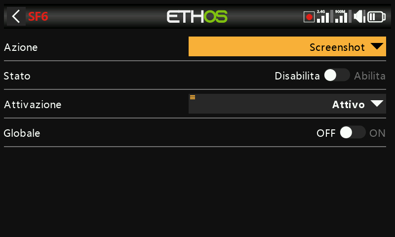

Salverò uno screenshot nella posizione:

Scheda SD (lettera di unità)/screenshot/ oppure

RADIO (lettera di unità)/screenshot/

Si prega inoltre di fare riferimento alla sezione “Parametri comuni FS” riportata sopra.

Stato

Abilita o disabilita questa funzione speciale.

Condizione attiva

La funzione speciale può essere "sempre attiva" o attivata da posizioni di interruttori, interruttori di funzione, Fase di volo, interruttori logici, posizioni di trim o Fase di volo.

Per selezionare l'inverso dell'interruttore SG-up, ad esempio, se premi a lungo Invio sul nome dell'interruttore e selezioni la casella Negativo nel popup, il valore dell'interruttore cambierà in !SG-up. Ciò significa che la funzione speciale sarà attiva quando l'interruttore SG non è in posizione di salita.

Globale

Selezionando Globale, la funzione speciale viene aggiunta a tutti i modelli esistenti e a qualsiasi nuovo modello creato in futuro. Se un modello esistente ha già la funzione, la funzione globale viene aggiunta come nuova funzione. Disattivando la funzione globale su qualsiasi modello, la funzione viene rimossa da tutti i modelli tranne quello correntemente selezionato.

Azione: Imposta il failsafe

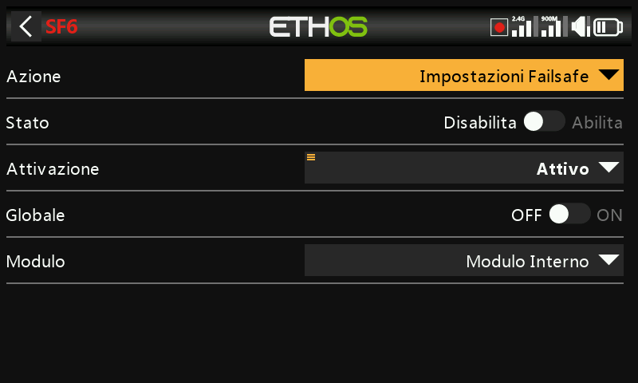

Si prega inoltre di fare riferimento alla sezione “Parametri comuni FS” riportata sopra.

Stato

Abilita o disabilita questa funzione speciale.

Condizione attiva

La funzione "Set failsafe" può essere attivata da posizioni di interruttori, interruttori di funzione, interruttori logici, posizioni di trim ecc.

Globale

Selezionando Globale, la funzione speciale viene aggiunta a tutti i modelli esistenti e a qualsiasi nuovo modello creato in futuro. Se un modello esistente ha già la funzione, la funzione globale viene aggiunta come nuova funzione. Disattivando la funzione globale su qualsiasi modello, la funzione viene rimossa da tutti i modelli tranne quello correntemente selezionato.

Modulo

Seleziona se impostare il failsafe tramite il modulo RF interno o esterno.

Azione: Riproduci l'***audio***

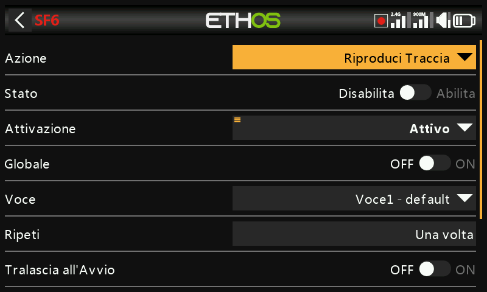

Si prega inoltre di fare riferimento alla sezione “Parametri comuni FS” riportata sopra.

Stato

Abilita o disabilita questa funzione speciale.

Condizione attiva

La funzione speciale può essere "sempre attiva" o attivata da posizioni di interruttori, interruttori di funzione, interruttori logici, posizioni di trim o Fase di volo.

Globale

Selezionando Globale, la funzione speciale viene aggiunta a tutti i modelli esistenti e a qualsiasi nuovo modello creato in futuro. Se un modello esistente ha già la funzione, la funzione globale viene aggiunta come nuova funzione. Disattivando la funzione globale su qualsiasi modello, la funzione viene rimossa da tutti i modelli tranne quello correntemente selezionato.

Voce

In Ethos è possibile configurare fino a 3 voci. Seleziona la voce da utilizzare per questa "Riproduzione audio".

Per maggiori dettagli sulla configurazione delle voci personalizzate e di sistema, consulta la sezione [Scelta delle voci ](#Audio_(Voices))in Generale.

Priorità

La funzione priorità di riproduci audio assicura che tutti gli ‘avvisi di sistema’ siano riprodotti immediatamente.

Le voci di riproduci audio hanno una priorità di 1 (default). Conseguentemente tutti gli avvisi di sistema che hanno priorità 0 fermeranno qualunque altra attività avente priorità inferiore (es: un numero più alto)

Ripetere

L'audio può essere riprodotto una sola volta o ripetuto alla frequenza inserita qui, fino a 10 minuti.

Salta all'avvio

Se abilitato, il testo vocale non verrà riprodotto all'avvio.

Reset

Quando abilitato, se una sequenza è (o raggiunge) un “tempo di attesa” o un “condizione di attesa”, la sequenza sarà resettata. Se la condizione “Attiva” è ancora “vera”, allora la sequenza verra di nuovo riprodotta.

Sequenza

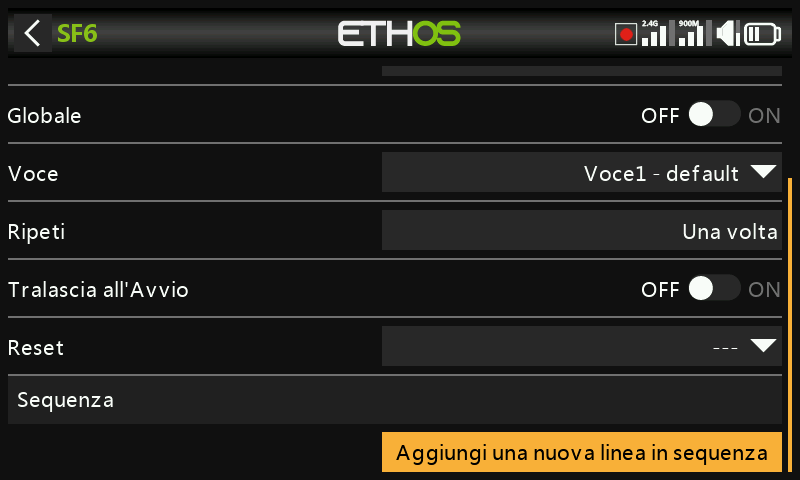

Si prega inoltre di fare riferimento alla sezione “Parametri comuni FS” riportata sopra.

È possibile configurare una sequenza di massimo 100 comandi "Riproduci file" e/o 					"Riproduci valore" che verranno riprodotti in sequenza.

Le azioni disponibili sono:

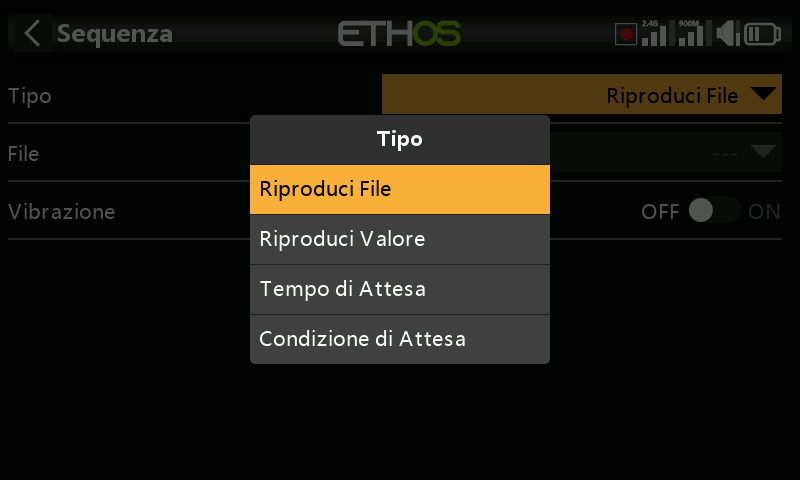

- Riproduci il file

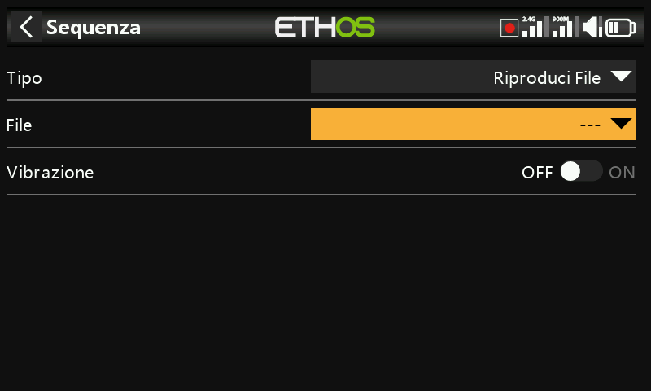

Si prega inoltre di fare riferimento alla sezione “Parametri comuni FS” riportata sopra.

Riproduci file riproduce il file audio selezionato.

Per maggiori dettagli sulla posizione dei file, consulta la sezione "File audio utente" in [Scelta delle voci](../system-setup/general.md).

- Riproduci Valore

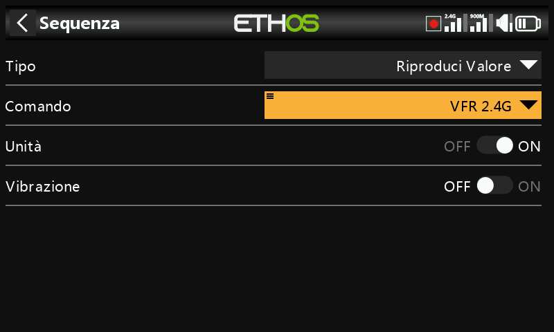

Si prega inoltre di fare riferimento alla sezione “Parametri comuni FS” riportata sopra.

Riproduci valore riproduce il valore della sorgente selezionata. La sorgente può essere una delle seguenti:

- Analogici, cioè Stick, Potenziometro o cursori
    - Interruttori
    - Interruttori logici
    - Trim
    - Canali
    - Gyro
    - Orologio di sistema (ora)
    - Trainer
    - Timer
    - Telemetria

- Durata dell'attesa

La durata dell'attesa inserisce un ritardo per il tempo richiesto, fino a 10 minuti.

- Condizione di attesa

La condizione di attesa si metterà in pausa finché la condizione di attesa non sarà soddisfatta.

Esempi

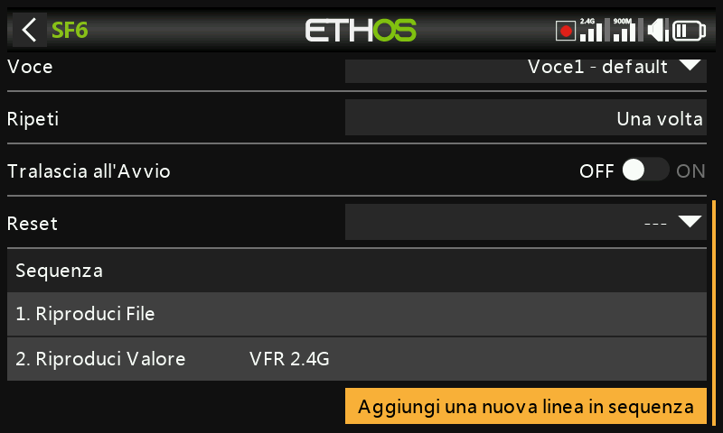

Nell'esempio precedente, la condizione attiva è l'interruttore logico VFRlow. Quando diventa attivo, "Riproduci file" viene utilizzato per riprodurre un file sonoro di avviso di VFR basso chiamato "vfrlow.wav", seguito da "Riproduci valore" che riproduce il valore minimo di VFR registrato (dalla telemetria).

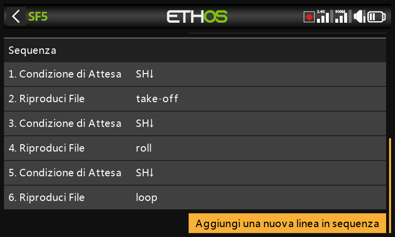

Questo esempio mostra l'uso della "condizione di attesa" per mettere in pausa la sequenza fino a quando l'interruttore SH non viene spostato in posizione di riposo.

Gestione delle sequenze

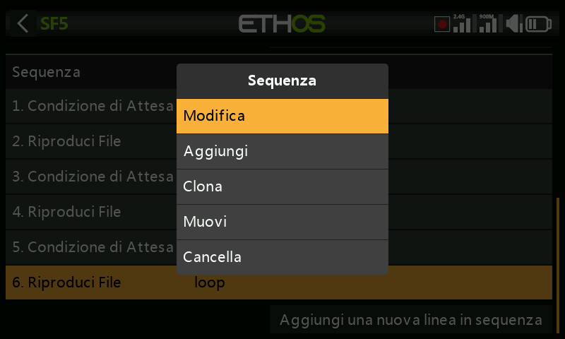

Toccando una riga della sequenza si aprirà una finestra di dialogo che ti permetterà di modificarla, di aggiungerne una nuova, di spostarla in alto o in basso o di cancellarla.

Azione: Aptico

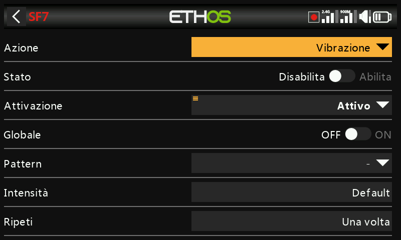

Si prega inoltre di fare riferimento alla sezione “Parametri comuni FS” riportata sopra.

Questa funzione speciale assegna una vibrazione aptica

Stato

Abilita o disabilita questa funzione speciale.

Condizione attiva

La funzione speciale può essere "sempre attiva" o attivata da posizioni di interruttori, interruttori di funzione, interruttori logici, posizioni di trim o Fase di volo.

Globale

Selezionando Globale, la funzione speciale viene aggiunta a tutti i modelli esistenti e a qualsiasi nuovo modello creato in futuro. Se un modello esistente ha già la funzione, la funzione globale viene aggiunta come nuova funzione. Disattivando la funzione globale su qualsiasi modello, la funzione viene rimossa da tutti i modelli tranne quello correntemente selezionato.

Modello

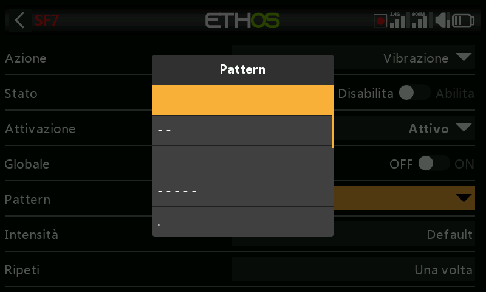

Imposta il modello dell'aptico. Le opzioni sono singola, doppia, tripla, quintupla e molto breve.

Forza

Seleziona la forza della vibrazione aptica, tra 1 e 10. L'impostazione predefinita è 5.

Ripetere

L'aptico può essere eseguito una sola volta o ripetuto con la frequenza inserita qui.

Seleziona (X20 Pro AW)

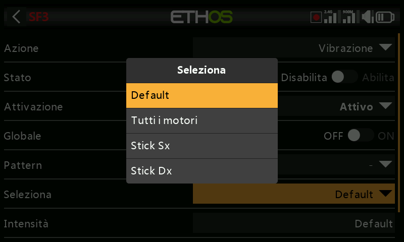

L'X20 Pro AW e X20RS dispongono di opzioni motore con feedback aptico per i joystick. Si noti che X20 Pro e X20R possono essere aggiornati montando i joystick aptici MC20R. Fare riferimento a “[Abilitazione aggiornamenti joystick aptici](https://www.deepl.com/en/translator?utm_term=&utm_campaign=IT%7CSearch%7CC%7CDSA%7CEnglish&utm_source=google&utm_medium=paid&hsa_acc=1083354268&hsa_cam=20627207960&hsa_grp=157168539729&hsa_ad=676252350153&hsa_src=g&hsa_tgt=dsa-437115340933&hsa_kw=&hsa_mt=&hsa_net=adwords&hsa_ver=3&gad_source=1&gclid=CjwKCAiAtYy9BhBcEiwANWQQL3EXIE2Cf7NSZZ0OYMKRgJCFeuGlPViCbNUpEZbVFRHTE1YdWYCrcBoCvrYQAvD_BwE#Enabling%20haptic%20gimbal%20upgrades)” per abilitare l'opzione.

- Predefinito (aptico interno)
- Tutti i motori
- Stick sinistro aptico
- Stick destro aptico

Azione: Scrivi i registri

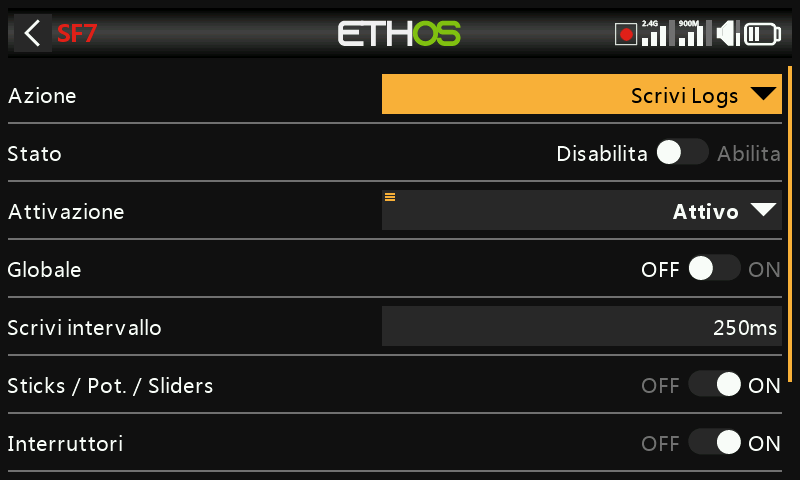

Si prega inoltre di fare riferimento alla sezione “Parametri comuni FS” riportata sopra.

I file di log vengono memorizzati in formato '.csv' nella cartella 'Logs' della scheda SD o eMMC. L'ora e la data dell'RTC vengono registrate insieme ai dati e sono importanti per dare un senso ai dati, separandoli in sessioni.

Stato

Abilita o disabilita questa funzione speciale.

Condizione attiva

La funzione speciale può essere "sempre attiva" o attivata da posizioni di interruttori, interruttori di funzione, interruttori logici, posizioni di trim o Fase di volo.

Globale

Selezionando Globale, la funzione speciale viene aggiunta a tutti i modelli esistenti e a qualsiasi nuovo modello creato in futuro. Se un modello esistente ha già la funzione, la funzione globale viene aggiunta come nuova funzione. Disattivando la funzione globale su qualsiasi modello, la funzione viene rimossa da tutti i modelli tranne quello correntemente selezionato.

Intervallo di scrittura

L'intervallo di scrittura dei registri è regolabile dall'utente tra 100 e 500ms.

Stick/Potenziometro/slider

Abilita la registrazione di Sticks/Pots/Sliders.

Interruttori

Abilita la registrazione degli Switch.

Interruttori logici

Abilita la registrazione degli interruttori logici.

Canali

Abilita la registrazione dei canali inviati al modulo RF.

Visualizzatore di log

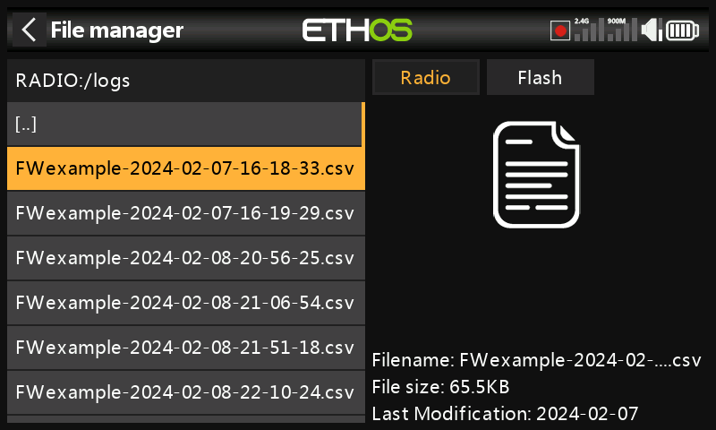

Si prega inoltre di fare riferimento alla sezione “Parametri comuni FS” riportata sopra.

Per visualizzare i file di log, naviga nella cartella /Logs su eMMC o sulla scheda SD con File Explorer, quindi tocca il file di log desiderato e seleziona apri.

1. Il file di registro verrà letto in memoria, ma può essere annullato durante la lettura.

2. Seleziona i canali da visualizzare sul lato destro. In questo esempio sono stati selezionati i canali Throttle ed Elevator. L'RSSI è selezionato per impostazione predefinita.

Il pulsante \[DISP\] sposta l'attenzione sul primo pulsante della colonna di destra.

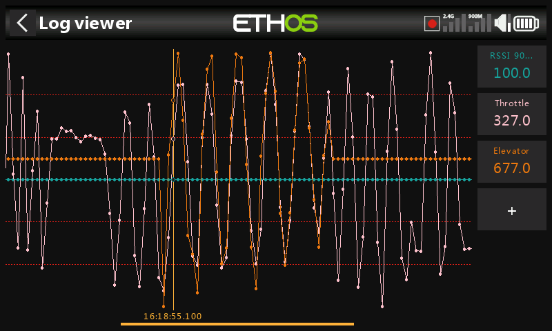

3. La visualizzazione può essere spostata con l’encoder rotativo o passando il dito a sinistra o a destra. La schermata precedente è stata spostata a sinistra rispetto a quella precedente.

4. Il display può essere ingrandito o ridotto ruotando la rotella di scorrimento mentre si tiene premuto il tasto pagina.

Azione: Riproduci testo (solo X20 Pro)

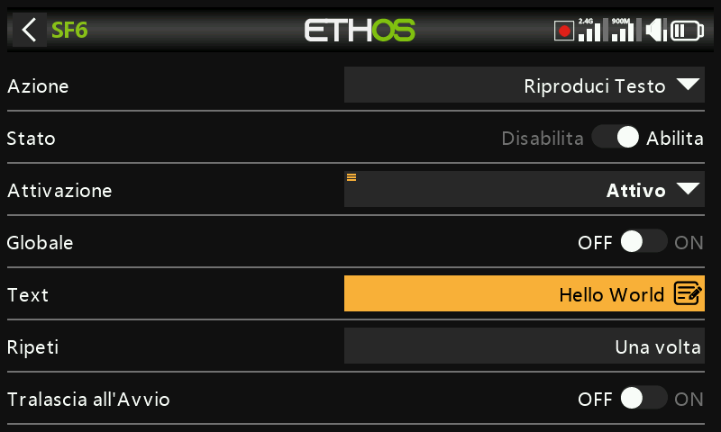

Questa funzione speciale utilizza un processore hardware TTS (Text-To-Speech) interno per generare testo parlato dalla stringa di testo specificata dall'utente, invece di riprodurre file .wav precedentemente preparati.

Stato

Abilita o disabilita questa funzione speciale.

Condizione attiva

La funzione speciale può essere sempre attiva o attivata da posizioni di interruttori, interruttori di funzione, interruttori logici, posizioni di trim o Fase di volo.

Globale

Selezionando Globale, la funzione speciale viene aggiunta a tutti i modelli esistenti e a qualsiasi nuovo modello creato in futuro. Se un modello esistente ha già la funzione, la funzione Globale viene aggiunta come nuova funzione. Disattivando la funzione Globale su qualsiasi modello, la funzione viene rimossa da tutti i modelli tranne quello correntemente selezionato.

Testo

La stringa di testo specificata dall'utente da convertire in voce e riprodurre. Usando le lettere MAIUSCOLE la parola verrà riprodotta facendo lo “spelling” , per esempio OFF verrà riprodotto come O-F-F. Usando il minuscolo si al modulo TTS che venga riprodotta la parola intera es: off

Ripetere

Il testo vocale può essere riprodotto una sola volta o ripetuto alla frequenza inserita in questo campo.

Salta all'avvio

Se abilitato, il testo vocale non verrà riprodotto all'avvio.

Azione: Vai alla schermata

Si prega inoltre di fare riferimento alla sezione “Parametri comuni FS” riportata sopra.

Questa funzione speciale fa passare il display alla schermata selezionata.

Stato

Abilita o disabilita questa funzione speciale.

Condizione attiva

La funzione speciale può essere sempre attiva o attivata da posizioni di interruttori, interruttori di funzione, interruttori logici, posizioni di trim o Fase di volo.

Globale

Selezionando Globale, la funzione speciale viene aggiunta a tutti i modelli esistenti e a qualsiasi nuovo modello creato in futuro. Se un modello esistente ha già la funzione, la funzione Globale viene aggiunta come nuova funzione. Disattivando la funzione Globale su qualsiasi modello, la funzione viene rimossa da tutti i modelli tranne quello correntemente selezionato.

Schermo

Seleziona la schermata radio da visualizzare.

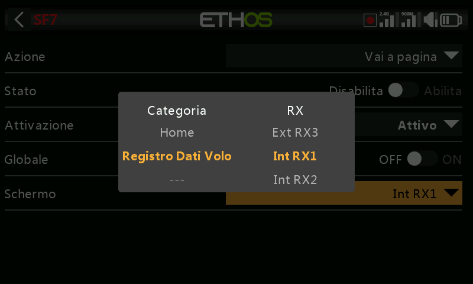

La schermata di destinazione può essere qualsiasi pagina Modello, Sistema o Configurazione, oppure la pagina Home o il “Registro dati di volo” per il ricevitore selezionato.

Azione: Blocca il touchscreen

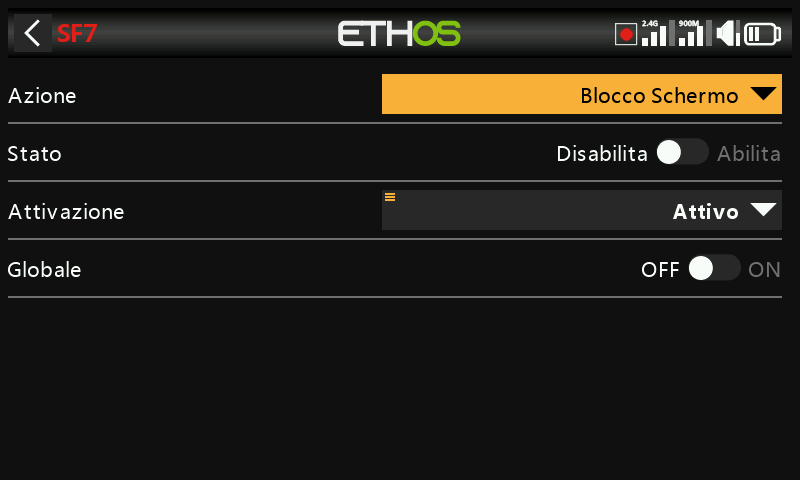

Si prega inoltre di fare riferimento alla sezione “Parametri comuni FS” riportata sopra.

Questa funzione speciale blocca il touchscreen per evitare che venga utilizzato inavvertitamente.

Ricorda che la funzione "blocca touchscreen" è disponibile anche premendo contemporaneamente \[ENTER\] e \[PAGE\] per 1 secondo dalla schermata principale.

Stato

Abilita o disabilita questa funzione speciale.

Condizione attiva

La funzione speciale può essere sempre attiva o attivata da posizioni di interruttori, interruttori di funzione, interruttori logici, posizioni di trim o Fase di volo.

Globale

Selezionando Globale, la funzione speciale viene aggiunta a tutti i modelli esistenti e a qualsiasi nuovo modello creato in futuro. Se un modello esistente ha già la funzione, la funzione Globale viene aggiunta come nuova funzione. Disattivando la funzione Globale su qualsiasi modello, la funzione viene rimossa da tutti i modelli tranne quello correntemente selezionato.

Azione: Carica il modello

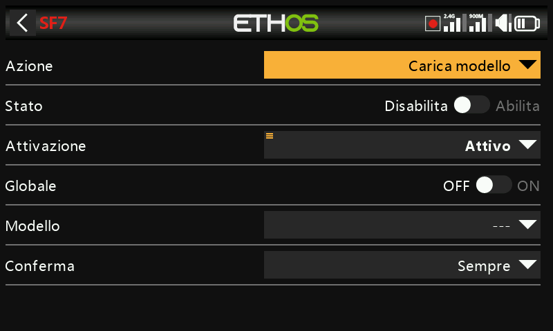

Si prega inoltre di fare riferimento alla sezione “Parametri comuni FS” riportata sopra.

Questa funzione speciale carica un modello specifico quando la "Condizione attiva" è soddisfatta.

Stato

Abilita o disabilita questa funzione speciale.

Condizione attiva

La funzione speciale può essere sempre attiva o attivata da posizioni di interruttori, interruttori di funzione, interruttori logici, posizioni di trim o Fase di volo.

Globale

Selezionando Globale, la funzione speciale viene aggiunta a tutti i modelli esistenti e a qualsiasi nuovo modello creato in futuro. Se un modello esistente ha già la funzione, la funzione Globale viene aggiunta come nuova funzione. Disattivando la funzione Globale su qualsiasi modello, la funzione viene rimossa da tutti i modelli tranne quello correntemente selezionato.

Modello

Seleziona il modello desiderato da caricare.

Conferma

Seleziona se è richiesta la conferma del carico del modello.

Azione: Esegui vario

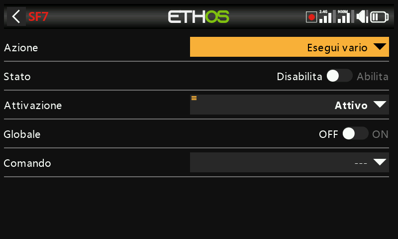

Si prega inoltre di fare riferimento alla sezione “Parametri comuni FS” riportata sopra.

Permette di selezionare una sorgente per il vario.

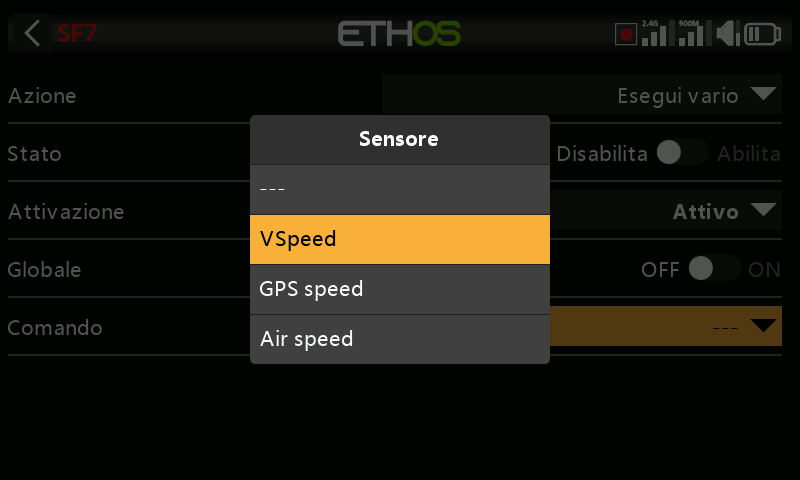

Di solito l'impostazione predefinita è il sensore VSpeed di FrSky varios, ma è possibile utilizzare qualsiasi sensore con unità di misura m/s.

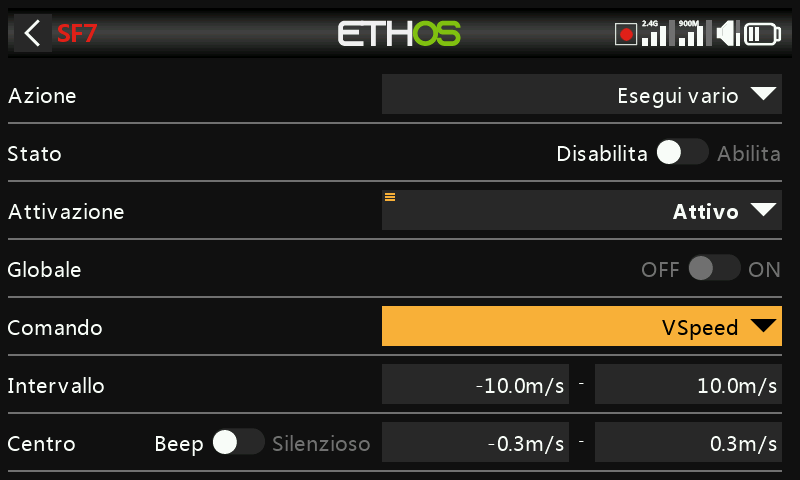

Una volta selezionata la sorgente, appaiono i parametri Intervallo e Centro.

Gamma

Il tasso di salita o discesa predefinito è di +/- 10m/s, ma può essere aumentato fino a +/- 100m/s.

Quando la velocità di salita è superiore al valore centrale indicato sotto, il tono dei segnali acustici di Vario aumenta in modo lineare fino a raggiungere il valore massimo dell'intervallo. Il tono del segnale acustico alla massima velocità di salita può essere configurato nella sezione [Vario ](../system-setup/general.md)delle impostazioni audio.

Il tono è continuo quando il tasso di salita sta diminuendo. L'altezza del tono diminuisce linearmente fino a raggiungere il valore minimo dell'intervallo.

Centro

L'intervallo predefinito che definisce un tasso di salita pari a zero è di +/- 0,3 m/s, ma può essere aumentato fino a +/- 2 m/s.

Il tono dei segnali acustici di Vario è costante quando la velocità di salita è compresa tra questi valori centrali. Il tono del segnale acustico quando il rateo di salita è zero può essere configurato nella sezione [Vario ](../system-setup/general.md)delle impostazioni audio.

Questi segnali acustici possono essere tacitati passando da "Bip" a "Silenzioso".
