# Telemetria

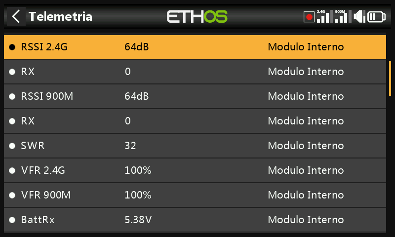

La telemetria riporta le informazioni dal modello al pilota — qualità del
collegamento (RSSI, VFR), tensioni e correnti e qualsiasi altro dato
inviato da un sensore collegato (posizione GPS, altitudine e così via).
Sono supportati fino a 100 sensori per modello; la scoperta e la
configurazione avvengono qui, ma la telemetria viene effettivamente
*visualizzata* tramite i [widget delle schermate di
visualizzazione](../displays/index.md), configurati separatamente in
Configura schermate.

## Come funziona la telemetria FrSky {: #how-frsky-telemetry-works }

La serie di sensori FrSky ha un design senza hub: la **Smart Port
(S.Port)** è un bus fisico a tre fili (Gnd, V+ e Signal), collegabile in
cascata in qualsiasi sequenza alla connessione S.Port dei ricevitori delle
serie X e S e successive, e comunica in half duplex a 57.600 bps (F.Port e
FBUS sono più veloci).

- **ID fisico** — il bus supporta fino a 28 nodi (ricevitore compreso),
  ciascuno dei quali deve avere un ID fisico univoco (da 00 a 1B hex). I
  dispositivi FrSky escono di fabbrica con valori predefiniti sensati (ad
  esempio Vario = 00, FLVSS = 01, Current = 02, GPS = 03) — se colleghi
  due dispositivi uguali, l'ID fisico del secondo deve essere modificato
  tramite [Configurazione dispositivo](../system-setup/devices.md).
- **ID applicazione** — indipendente e non correlato all'ID fisico: un
  singolo sensore può inviare più valori, ognuno con il proprio ID
  applicazione. Un Vario ha un solo ID fisico ma due ID applicazione
  (Altitudine, Velocità verticale); un FLVSS ha un ID fisico e un ID
  applicazione (Tensione). Per monitorare due pacchi 6S con due sensori
  FLVSS occorre cambiare **entrambi** gli ID sul secondo — l'ID fisico per
  garantire una comunicazione esclusiva sul bus, l'ID applicazione per
  consentire al ricevitore di distinguere i dati provenienti dalle Lipo 1
  e 2 (ad esempio `0300` → `0301`). Normalmente si modifica la quarta
  cifra esadecimale, da 0 a F.

  !!! note
      Per applicazioni speciali è possibile avere sensori con lo stesso ID
      applicazione e diversi ID fisici quando l'[avviso di conflitto tra
      sensori](../system-setup/alerts.md) è disabilitato — si tratta di
      una configurazione per usi particolari, non del caso predefinito.

Ogni valore ricevuto tramite la telemetria viene trattato come un sensore
separato, con le sue proprietà: il valore, l'ID fisico e l'ID applicazione,
un nome modificabile, l'unità di misura, la precisione decimale, l'opzione
di registrazione su scheda SD e i propri valori minimo e massimo. I sensori
FrSky, una volta impostati, vengono rilevati automaticamente a ogni
accensione, ma la prima volta devono essere scoperti **manualmente**. Una
volta scoperto, un sensore può essere riprodotto negli annunci vocali,
utilizzato nei [sensori calcolati](#calculated-sensors), negli
[interruttori logici](logical-switches.md), nelle [Vars](variables.md) o
nei [mix](mixes.md), visualizzato in una schermata di telemetria
personalizzata oppure letto direttamente da questa pagina di
configurazione, senza dover creare alcuna schermata.

Il protocollo **FBUS** (precedentemente F.Port 2.0) fa un ulteriore passo
avanti, integrando SBUS per il controllo e S.Port per la telemetria in
un'unica linea a 460.800 bps (contro i 115.200 di F.Port e i 57.600 di
S.Port — le tre velocità sono incompatibili tra loro) e consentendo a un
dispositivo Host di comunicare su una sola linea con diversi accessori
Slave, tutti configurabili in modalità wireless dalla radio.

### Telemetria multi ricevitore (ACCESS Trio)

Con un massimo di tre ricevitori registrati in [Sistema
RF](rf-system.md#registering-and-binding-a-receiver-access), ogni
ricevitore vincolato può essere configurato individualmente (mappatura dei
pin delle porte, ecc.) tramite RX1, RX2 e RX3. Normalmente ACCESS ha un
percorso di telemetria in entrata per ogni link RF — i sistemi Tandem/TD
fanno eccezione, con 2,4 GHz e 900 MHz come due percorsi su un unico
modulo. Il ricevitore della sorgente telemetrica può cambiare durante il
volo a seconda delle condizioni RF; il sensore **RX** visualizza in tempo
reale quale ricevitore sta inviando la telemetria (e ne registra i dati).

L'applicazione più comune: collegare in cascata la catena di sensori
S.Port a tutti e tre i ricevitori, che dovrebbero condividere
un'alimentazione comune, quindi registrare e vincolare ogni ricevitore e
scoprire i sensori come di consueto — la fonte di telemetria cambia
automaticamente a seconda dell'RX attivo, e i dati dei sensori S.Port
*esterni* proseguono in modo trasparente. (I sensori interni del
ricevitore — RSSI, VFR, RxBatt, ADC2 e lo stesso RX — non vengono
collegati in questo modo: vengono sempre inviati per il ricevitore che è
attualmente la sorgente. La telemetria simultanea da tutti e tre i
ricevitori è prevista ma non ancora disponibile.)

## Sensori di qualità del collegamento

- **RSSI** (Indicatore di potenza del segnale del ricevitore) — indica
  quanto è forte il segnale del modello ricevuto. Allarmi predefiniti:
  **ACCESS**/**TD**/**TW** 35 ("RSSI basso") / 32 ("RSSI critico"), con
  perdita di controllo intorno a 28; **ACCST** 45 / 42, con perdita di
  controllo intorno a 38. La perdita completa della telemetria viene
  annunciata come "Telemetria persa" — a quel punto **NON suonerà alcun
  altro allarme**, perché il collegamento telemetrico è venuto meno e la
  radio non ha più nulla da valutare; è consigliabile tornare indietro
  immediatamente per indagare sul problema. (Quando radio e ricevitore
  sono troppo vicini, meno di 1 m, il ricevitore può essere disturbato e
  causare allarmi spuri, con il fastidioso ciclo "Telemetria persa" -
  "Telemetria recuperata": non si tratta di un guasto reale.) L'RSSI si
  avvicina bene alla portata effettiva del collegamento, ma il VFR è
  l'indicatore più affidabile della qualità del collegamento.

  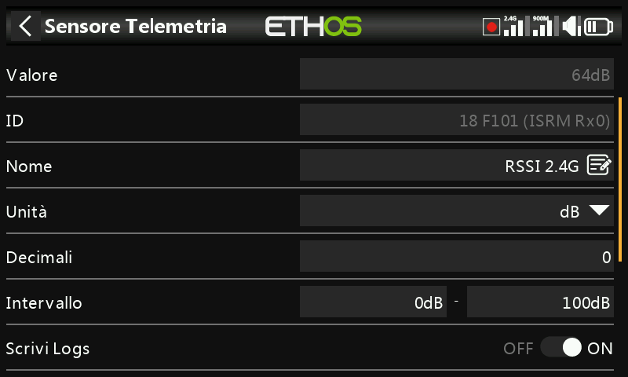

  I ricevitori TD riportano un RSSI per ogni banda in uso (2.4G, 900M); i
  ricevitori TW ne riportano uno per ogni banda (2.4FSK, 2.4LoRa, 900M) —
  attiva **Allarme RSSI individuale per banda** per ricevere avvisi vocali
  separati per ciascuna banda anziché un unico avviso combinato:

  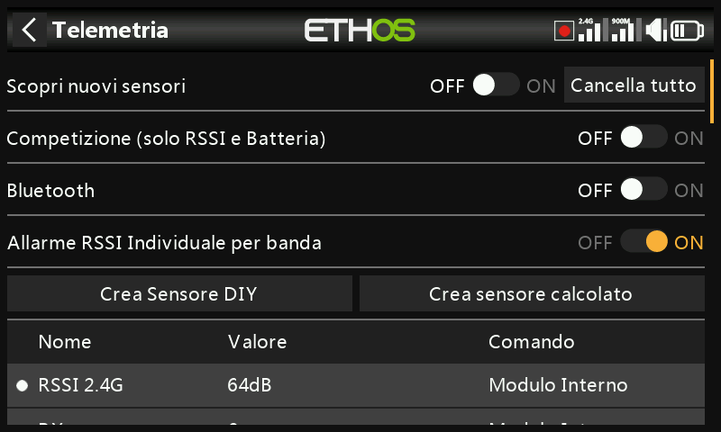

- **VFR** (Valid Frame Rate) — il numero di fotogrammi validi ricevuti
  nell'ultimo blocco di 100 fotogrammi; a partire da ACCESS 2.1 i
  fotogrammi persi sono stati eliminati dal calcolo dell'RSSI e aggiunti
  come nuovo sensore VFR. L'impostazione predefinita di **Avviso valore
  basso** è 50%.

  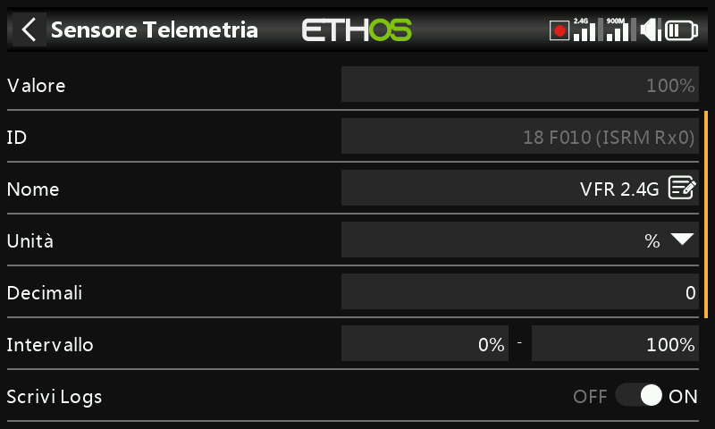

  I ricevitori TD/TW hanno due flussi VFR (uno per banda); **Rx VFR** (sui
  ricevitori TD, TW, AP e AP Plus) conta invece tutti i fotogrammi validi
  indipendentemente dalla banda da cui provengono — se intendi monitorare
  un solo VFR, è quello giusto.

- **RxBatt** — la tensione della batteria del ricevitore.
- **ADC2** — un secondo ingresso analogico di tensione, sui ricevitori che
  lo supportano.
- **SWR** — il valore SWR quando si usa un'antenna esterna.
- Sensori di assetto e movimento, dove supportati: **R.Angle**,
  **P.Angle**, **AccX/Y/Z**.

Per ogni sensore numerico vengono definiti automaticamente anche i valori
minimo e massimo (`<nome>-` e `<nome>+`), anche se non vengono visualizzati
nell'elenco principale dei sensori.

## Scoprire i sensori {: #discovering-sensors }

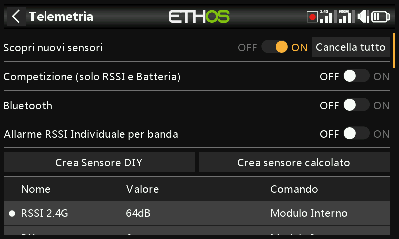

Una volta che tutto è vincolato e alimentato, attiva **Scopri nuovi
sensori** — un punto lampeggiante (o un valore in rosso, se non vengono
ancora ricevuti dati) contrassegna ogni sensore man mano che viene
trovato, e la schermata si popola automaticamente. L'operazione deve
essere effettuata **per ogni modello** e ogni volta che viene aggiunto un
nuovo sensore.

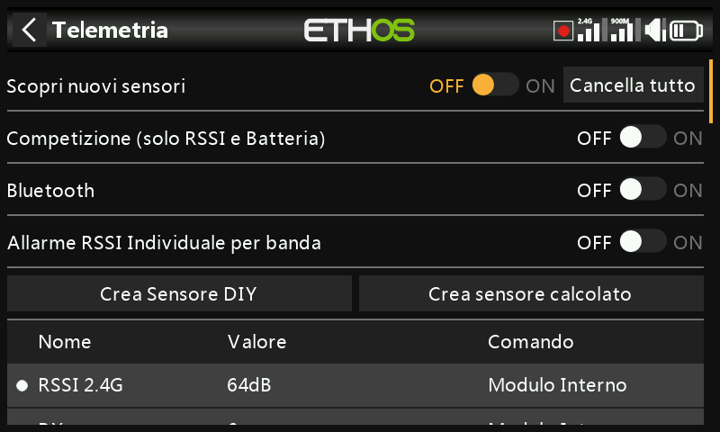

- Riporta l'interruttore su **Off** una volta terminata la scoperta.
- **Cancella tutto** cancella tutti i sensori e ti permette di
  ricominciare.

  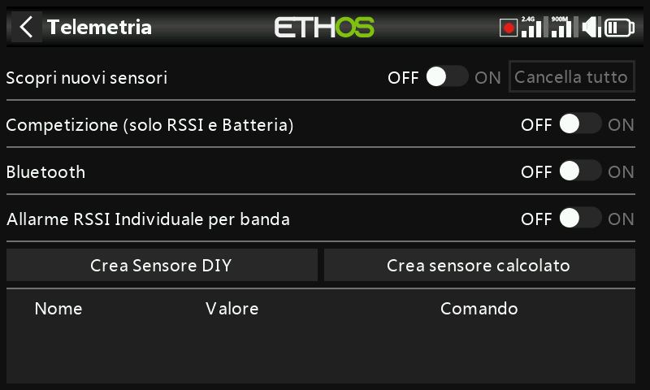

- La modalità **Competizione (solo RSSI e batteria)** riduce la telemetria
  ai soli RSSI e RxBatt — per le gare locali che consentono unicamente i
  sensori di stato del collegamento. Per riscoprire i sensori dopo averla
  disattivata, la radio deve essere spenta e riaccesa.

  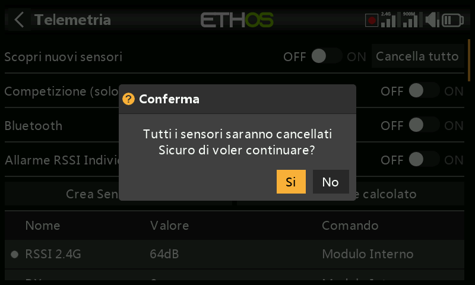

- In modalità telemetria **Bluetooth** la radio può funzionare con
  l'applicazione FrSky FreeLink per visualizzare i dati di telemetria sul
  cellulare; l'app può essere utilizzata anche per configurare i
  dispositivi FrSky, come i ricevitori stabilizzati.

  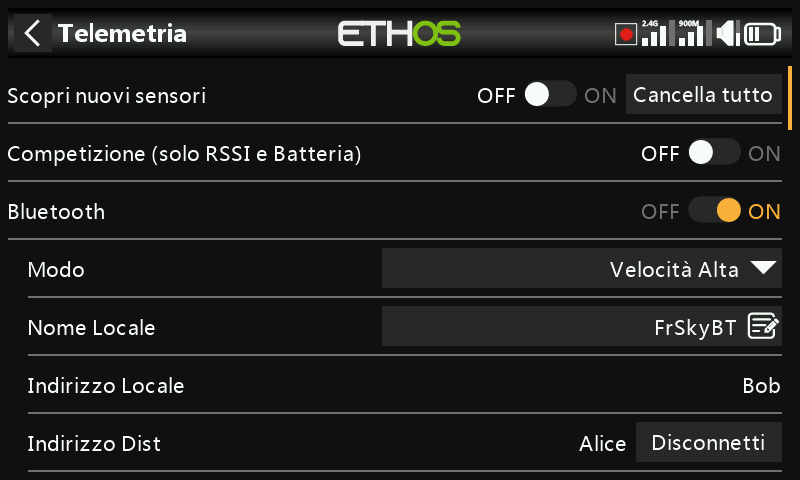

## Modifica di un sensore {: #editing-a-sensor }

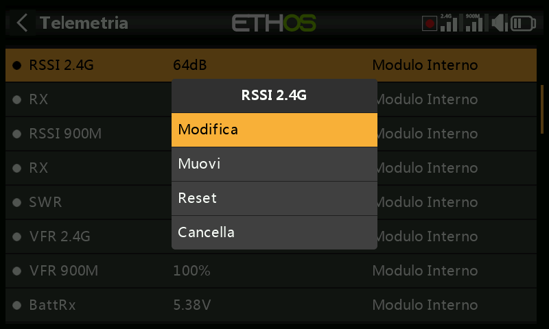

Tocca un sensore per **Modifica**, **Muovi**, **Reset** o **Cancella**.
Campi comuni: **Valore** (sola lettura), **ID** (ID fisico e ID
applicazione, oltre all'ID del ricevitore mittente), **Nome**, **Unità**,
**Decimali**, **Intervallo** (limiti di scala fissi — utili soprattutto
quando il sensore viene usato come sorgente per un canale), **Scrivi
logs**, **Reset** (una sorgente che azzera il sensore) e **Avviso sensore
perso** (disattivabile del tutto, oppure da 1 a 30 secondi, predefinito 10
secondi, per filtrare le perdite di breve durata — è necessario
comprenderne i rischi; il messaggio audio "sensore perso" viene riprodotto
una sola volta quando vengono persi più sensori contemporaneamente; sui
sensori interni al ricevitore è disattivato per impostazione predefinita,
perché è improbabile che vengano persi).

Alcuni sensori aggiungono campi propri:

- **ADC2** — **Rapporto** e **Offset**, per correggere la scala.

  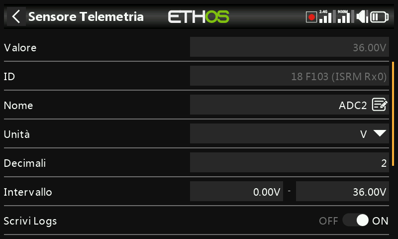

- **RSSI** — le soglie **Valore critico** e **Avviso valore basso**.
- **VFR** — **Avviso valore basso** (predefinito 50%).
- **VSpeed** (velocità verticale misurata dal vario) — **Intervallo** fino
  a ±100 m/s (predefinito ±10 m/s). Le impostazioni audio del vario si
  trovano ora nella [funzione speciale "Riproduci
  vario"](special-functions.md), non qui.

  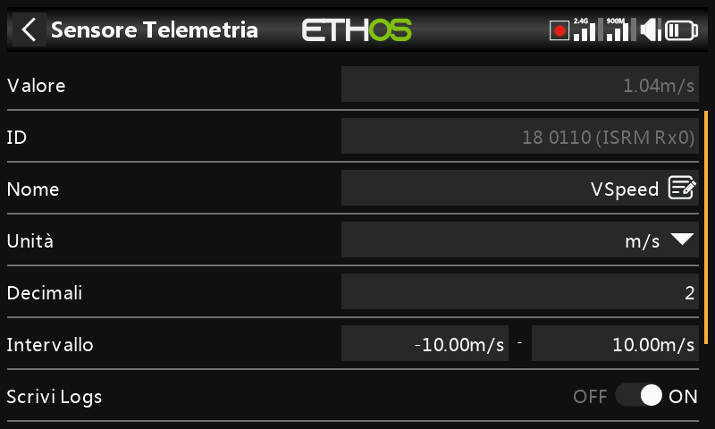

## Sensori fai da te / di terze parti

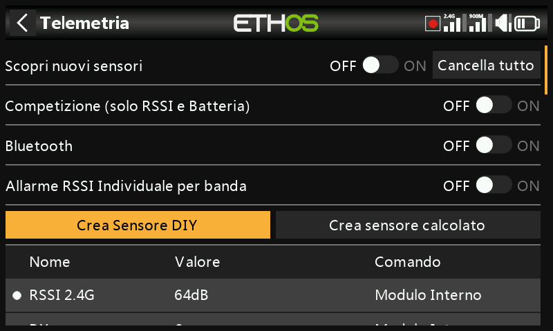

**Crea Sensore DIY** permette di aggiungere manualmente un sensore fai da
te o di terze parti: **Rilevamento automatico** (popola automaticamente ID
fisico, ID applicazione e Modulo, se possibile), oppure imposta i campi a
mano, con in più **Precisione del protocollo / unità** (la precisione in
entrata, da 0 a 3 decimali, e la relativa unità) e **Precisione del
display / unità** (indipendente da quella del protocollo), oltre agli
stessi campi **Intervallo**/**Rapporto**/**Offset**/**Scrivi
logs**/**Reset**/**Avviso sensore perso** di qualsiasi altro sensore.

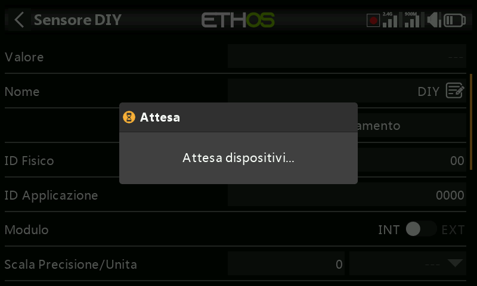

## Sensori calcolati {: #calculated-sensors }

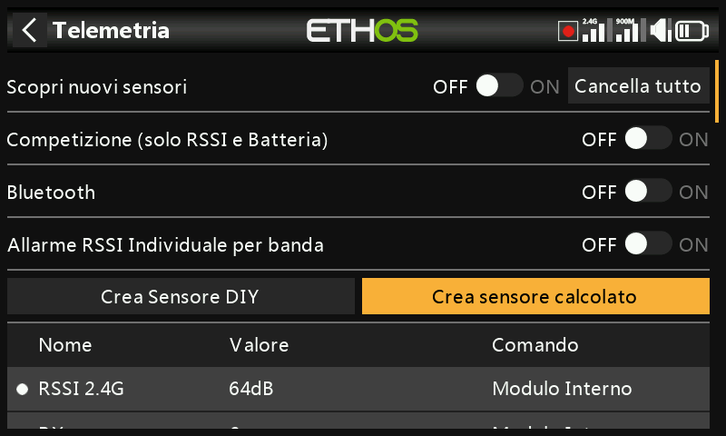

Permettono di derivare un nuovo sensore da uno o più sensori esistenti:

- **Consumo** — l'energia consumata, calcolata a partire da un sensore di
  corrente (ad esempio la serie FAS). Unità mAh o Ah, intervallo fino a
  1000 Ah.

  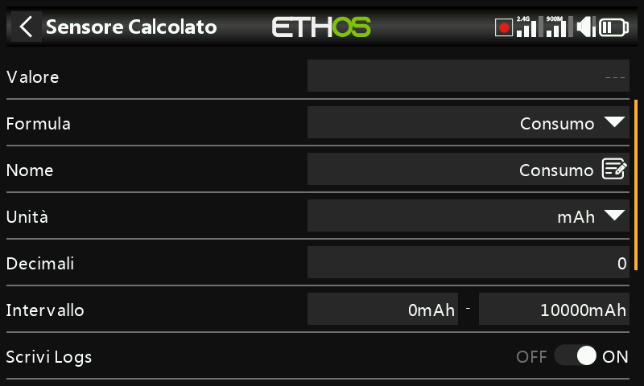

- **Distanza** — da una fonte GPS (più una fonte di altitudine, per la
  distanza 3D). Unità cm, m, km o piedi, fino a 20 km.

  

- **Viaggio** — la distanza accumulata tra coordinate GPS successive.
  Stesse unità, fino a 1000 km.

  

- **Multi Lipo** — collega in cascata due o più sensori di tensione lipo
  per monitorare pacchi superiori a 6S (fino a 67,2 V / 8S). Seleziona i
  sensori nell'ordine corretto, da cella bassa a cella alta; per evitare
  conflitti con la porta S.Port, ogni sensore lipo aggiuntivo deve essere
  modificato sia nell'ID fisico sia in quello dell'applicazione tramite
  [Configurazione dispositivo](../system-setup/devices.md) (lo strumento
  di configurazione della tensione lipo è d'aiuto), scoperto uno alla
  volta e rinominato in modo da poterli distinguere.

  

- **Percentuale** — converte i valori di un sensore in una percentuale da
  0% a 100%, con l'opzione **Invertire** (ad esempio per mostrare la
  percentuale *rimanente* anziché quella consumata).

  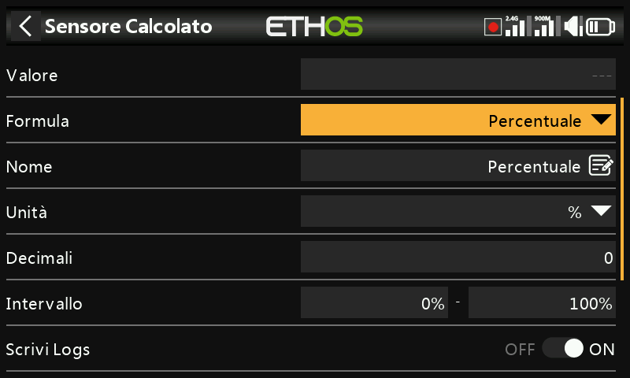

- **Potenza** — il wattaggio calcolato da una coppia di sorgenti
  **Corrente** e **Tensione**, fino a 1.000.000 W.

  

- **Personalizzato** (Ad hoc) — una formula libera concatenata a partire
  da una o più fonti.

Ogni sensore calcolato dispone inoltre dell'opzione **Persistente** (il
valore viene memorizzato quando la radio viene spenta o il modello viene
cambiato, e ricaricato la volta successiva che il modello viene
utilizzato) e di un pulsante **Azzera** direttamente nella schermata di
modifica.

### Sensori personalizzati

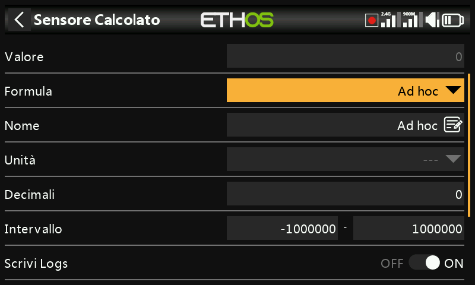

Si parte da una fonte, poi con **Aggiungi** si concatenano altre linee di
calcolo: **Addiziona(+)**, **Sottrai(-)**, **Moltiplica(×)**,
**Dividi(/)**, **Min**, **Max**, **Sqrt** (radice quadrata). Le unità di
misura sono selezionabili da un lungo elenco che comprende tensione,
corrente, capacità, potenza, distanza, velocità, tempo, temperatura,
percentuale, angoli, pressione e altro ancora; l'intervallo può essere
compreso tra −1.000.000 e 1.000.000, con 0–4 decimali.

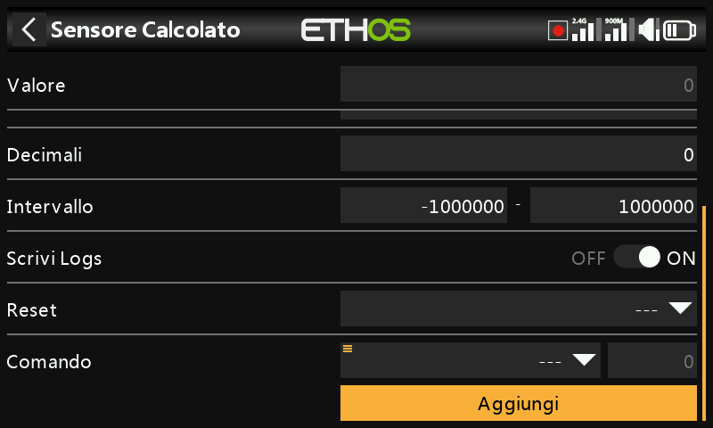

!!! example "Potenza di picco"
    Moltiplica un sensore di tensione (`VFAS`) per un sensore di corrente
    (`Current`), quindi aggiungi una funzione **Max** che fa riferimento
    al valore corrente del sensore stesso (`MaxPower`) per calcolare il
    valore massimo raggiunto — 288 W in questo esempio:

    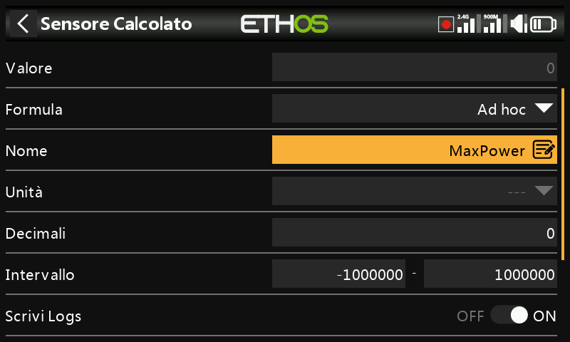

!!! example "Aritmetica con una costante"
    Fonte impostata su `RSSI 2.4G` (lettura 64 dB), poi un'azione
    **Sottrai(-)**: premi a lungo sul parametro Sorgente di quella riga e
    seleziona **Converti in valore**, trasformandola in una costante
    modificabile (20) anziché in una sorgente dal vivo — il risultato è un
    valore stabile di 44 dB (64 − 20):

    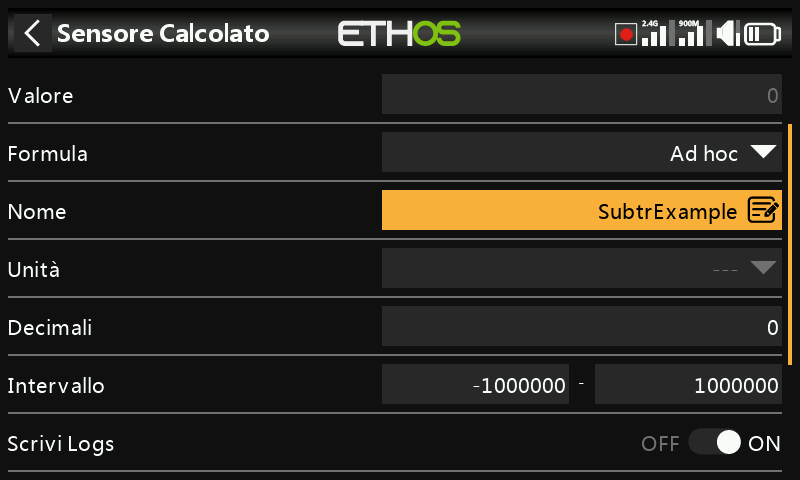
    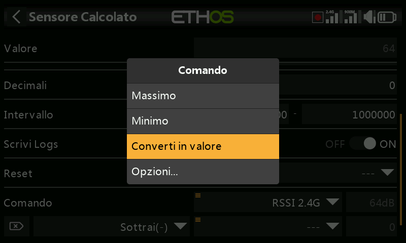

!!! note "Il valore interno di una sorgente"
    Ogni [sorgente](../getting-started/user-interface-and-navigation.md#choosing-a-source)
    ha un intervallo interno di ±1024 corrispondente all'intervallo
    visualizzato di ±100% — lo si può vedere direttamente puntando un
    sensore calcolato personalizzato, ad esempio, sul Gas: con il Gas al
    100% il valore interno è **+1024**, con il Gas a −100% è **−1024**.

    
    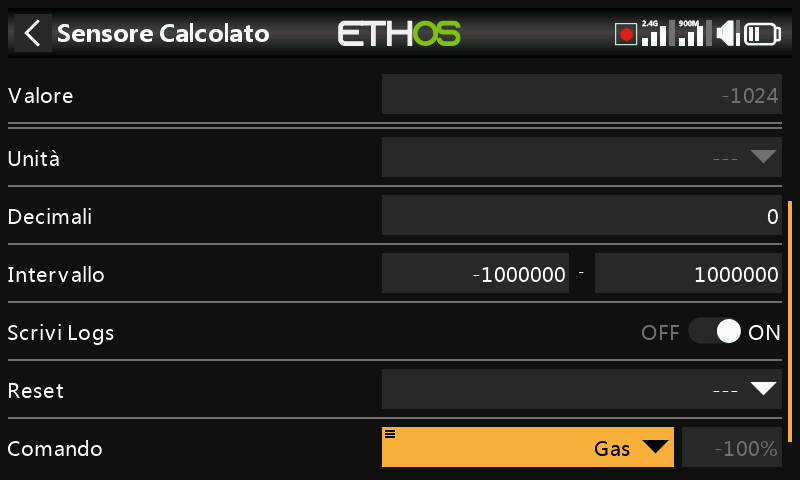
