# Telemetria

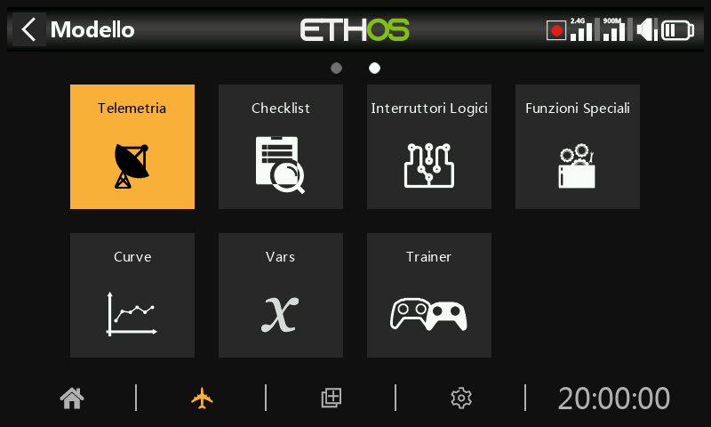

FrSky offre un sistema di telemetria molto completo. La potenza della telemetria ha portato l'hobby dell'RC a un livello completamente nuovo, consentendo una maggiore sofisticazione e un'esperienza di modellazione molto più ricca.

## Telemetria della Smart Port (S.Port)

La serie di sensori FrSky ha un design senza hub. La Smart Port (S.Port) utilizza un bus fisico a tre fili composto da Gnd, V+ e Signal. I dispositivi di telemetria S.Port possono essere collegati in qualsiasi sequenza e inseriti nella connessione S.Port dei ricevitori compatibili delle serie X e S e successive. Il ricevitore può comunicare in half duplex a una velocità di 57600bps (F.Port e FBUS sono più veloci) con molti dispositivi compatibili attraverso questa connessione, con una configurazione manuale minima o nulla.

ID fisico

Smart Port supporta fino a 28 nodi, compreso il ricevitore host. Ogni nodo deve avere un ID fisico univoco per garantire che non si verifichino conflitti nella comunicazione. Gli ID fisici possono essere compresi tra 00 hex e 1B hex (tra 00 e 27 decimali).

| Dicembre. | Esagonale | ID fisico predefinito |  | Dicembre. | Esagonale | ID fisico predefinito |
| --- | --- | --- | --- | --- | --- | --- |
| 00 | 00 | Vario |  | 14 | 0E |  |
| 01 | 01 | FLVSS |  | 15 | 0F |  |
| 02 | 02 | Current |  | 16 | 10 | SD1 |
| 03 | 03 | GPS |  | 17 | 11 |  |
| 04 | 04 | RPM |  | 18 | 12 | VS600 |
| 05 | 05 | SP2UART (Host) |  | 19 | 13 |  |
| 06 | 06 | SP2UART (remoto) |  | 20 | 14 |  |
| 07 | 07 | FAS-xxx |  | 21 | 15 |  |
| 08 | 08 | TBD(SBEC) |  | 22 | 16 | Suite del gas |
| 09 | 09 | AirSpeed |  | 23 | 17 | FSD |
| 10 | 0A | ESC |  | 24 | 18 | Gateway |
| 11 | 0B |  |  | 25 | 19 | Bus di ridondanza |
| 12 | 0C | Servo XACT |  | 26 | 1A | SxR |
| 13 | 0D |  |  | 27 | 1B | Bus Master |

La tabella precedente elenca gli ID fisici predefiniti dei dispositivi FrSky S.Port. Tieni presente che se hai più di uno di questi dispositivi, l'ID fisico dei dispositivi duplicati deve essere modificato per garantire che ogni dispositivo della catena S.Port abbia un ID fisico unico.

ID applicazione

Ogni sensore può avere più ID applicazione, uno per ogni valore del sensore che viene inviato. L'ID fisico e l'ID applicazione sono indipendenti e non correlati. Ad esempio, il sensore Variometro ha un solo ID fisico (predefinito 00), ma due ID applicazione: uno per l'altitudine (0100) e l'altro per la velocità verticale (0110).

Un altro esempio è il sensore di tensione FLVSS Lipo, che ha un ID fisico (predefinito 01) e un ID applicazione per la tensione (0300). Se vuoi utilizzare due sensori FLVSS per monitorare due pacchi Lipo 6S, dovrai utilizzare la Configurazione dispositivo per cambiare l'ID fisico del secondo FLVSS in uno slot vuoto (ad esempio 0F hex) e anche per cambiare l'ID applicazione da 0300 a 0301. Poiché l'ID fisico e l'ID applicazione sono indipendenti e non correlati, devono essere cambiati entrambi. L'ID fisico deve essere modificato per garantire una comunicazione esclusiva con il ricevitore host, mentre l'ID applicazione deve essere modificato per consentire al ricevitore di distinguere i dati provenienti dalle Lipo 1 e 2.

Nota: per applicazioni speciali è possibile avere sensori con lo stesso ID applicazione e diversi ID fisici quando l'avviso di conflitto dei sensori è disabilitato. Consulta la sezione [Avviso di conflitto tra sensori ](#Sensor_conflict_warning)per sapere come disattivare l'avviso.

| Dispositivo | ID applicazione (esadecimale) | Parametro |
| --- | --- | --- |
| Vario | 010x | Altitudine |
|  | 011x | Velocità verticale |
| Sensore di tensione lipo FLVSS | 030x | Tensione Lipo |
| Sensore di corrente FAS100S | 020x | current |
|  | 021x | VFAS |
|  | 040x | Temperatura 1 |
|  | 041x | Temperatura 2 |
| Servo Xact | 680x | Corrente, tensione, temperatura |

Qui sopra sono riportati alcuni esempi di ID applicazione. Si noti che il parametro ID applicazione in Configurazione dispositivo presenta un elenco a discesa di 4 cifre tra cui scegliere; la quarta cifra predefinita è 0, ma può essere modificata in un intervallo da 0 a F esadecimale (0,1,2,3,4,5,6,7,8,9,A,B,C,D,E,F) per garantire che tutti gli ID applicazione siano unici.

Tieni inoltre presente che:

- Un dispositivo può avere più di una gamma di ID applicazione, vedi ad esempio il Sensore di corrente di cui sopra.
- Se due ricevitori ridondanti hanno le loro porte telemetriche S.Port collegate, i pacchetti di un particolare sensore ricevuti da uno dei due ricevitori saranno uniti anche se il ricevitore ridondante si trova su una banda o un modulo diverso.

Caratteristiche principali di S.Port:

Ogni valore ricevuto tramite la telemetria viene trattato come un sensore separato, che ha le sue proprietà, come ad esempio

- il valore del sensore
- il numero di ID fisico della porta S.Port e l'ID dati (anche detto ID applicazione)
- il nome del sensore (modificabile)
- l'unità di misura
- la precisione decimale

- opzione per accedere alla scheda SD o eMMC

Il sensore tiene anche traccia del suo valore minimo e massimo.

Come già accennato, è possibile collegare più sensori dello stesso tipo, ma l'ID fisico deve essere modificato in "Configurazione dispositivo" (o utilizzando l'app FrSky Airlink o il servo changer SCC) per garantire che ogni sensore nella catena S.Port abbia un ID fisico unico. Alcuni esempi sono un sensore per ogni cella di una Lipo 2 x 6S o il monitoraggio delle correnti dei singoli motori in un modello multimotore.

Lo stesso sensore può essere duplicato, ad esempio con unità di misura diverse o per essere utilizzato in calcoli come l'altitudine assoluta, l'altitudine rispetto al punto di partenza, la distanza, ecc.

Ogni sensore può essere azzerato individualmente con una funzione speciale, quindi ad esempio puoi azzerare l'offset dell'altitudine al punto di partenza senza perdere tutti gli altri valori min/max.

I sensori FrSky, una volta impostati, vengono rilevati automaticamente ogni volta che il sistema viene acceso. Tuttavia, quando vengono installati inizialmente, devono essere "scoperti" manualmente affinché il sistema li riconosca.

I sensori di telemetria possono essere

- riprodotto negli annunci vocali
- utilizzato negli switch logici
- utilizzato in Ingressi per azioni proporzionali
- visualizzati nelle schermate di telemetria personalizzate
- direttamente nella pagina di configurazione della telemetria, senza dover configurare una schermata di telemetria personalizzata.

I display vengono aggiornati man mano che vengono ricevuti i dati e viene rilevata la perdita di comunicazione del sensore.

## Controllo e telemetria FBUS

Il protocollo FBUS (precedentemente F.Port 2.0) è il protocollo aggiornato che integra SBUS per il controllo e S.Port per la telemetria in un'unica linea. Questo nuovo protocollo consente a un dispositivo Host di comunicare su una linea con diversi accessori Slave. Ad esempio, i servi FBUS sono controllati su una connessione a margherita e inviano la telemetria dei loro servi al ricevitore sulla stessa connessione. Tutti i dispositivi FBUS collegati a un ricevitore (Host) possono essere configurati in modalità wireless dalla radio con questo protocollo.

Il baud rate di FBUS è di 460.800 bps, mentre F.Port è di 115.200 e S.Port di 57.600 bps. Questo fatto rende i tre protocolli incompatibili tra loro.

## Telemetria funzioni in ACCESS

La telemetria a ricevitore singolo con ACCESS funziona come prima con ACCST.

Telemetria multi ricevitore

ACCESS Trio Control offre la possibilità di avere tre ricevitori per ogni percorso RF registrati e vincolati nei trasmettitori ACCESS. I tre ricevitori sono vincolati nella schermata RF del trasmettitore nelle posizioni RX1, RX2 e RX3 che consentono di accedere ai ricevitori individualmente per mappare i pin delle porte e apportare altre modifiche all'RX.

Normalmente ACCESS ha un percorso di telemetria in entrata per ogni link RF o un link per ogni modulo RF. I sistemi Tandem fanno eccezione con un modulo RF che ha una sezione da 2,4 e 900 m per due percorsi RF. Il ricevitore della sorgente telemetrica può cambiare durante il volo a seconda delle condizioni RF. ETHOS ha un sensore RX che visualizza la sorgente telemetrica in tempo reale e registra i dati del sensore RX.

L'applicazione più comune che utilizza la S.Port consiste nel collegare in cascata la catena di sensori S.Port a tutti e tre i ricevitori, che dovrebbero condividere un'alimentazione comune.

- Registra e collega i ricevitori (vedi Impostazione del modello).
- Collega le Smart Port del sensore e del ricevitore in modo concatenato.
- Scopri i nuovi sensori (fai riferimento a Impostazione [della telemetria](telemetry.md)) e verifica attentamente che la commutazione della s.port funzioni correttamente.

La fonte di telemetria cambia automaticamente a seconda dell'RX attivo. Il sensore interno dell'RX visualizza l'ID dell'RX attivo che sta inviando la telemetria, cioè RX1, RX2 o RX3.

Quando la sorgente telemetrica del ricevitore cambia, il collegamento delle S.Port del ricevitore continuerà automaticamente la telemetria dai sensori esterni collegati alle S.Port. Tuttavia, si noti che non collega i sensori interni del ricevitore. I dati dei sensori RSSI, VFR, RxBatt, ADC2 e RX(n) vengono inviati per il ricevitore sorgente, quindi cambiano a seconda della sorgente.

La telemetria simultanea da tre ricevitori arriverà in seguito. Si attendono ulteriori sviluppi in questo settore.

Tipi di sensori:

1. Sensori interni

Le radio e i ricevitori FrSky hanno funzioni di telemetria integrate per monitorare la potenza del segnale ricevuto dal modello.

- RSSI

Indicatore di potenza del segnale del ricevitore (RSSI): Un valore trasmesso dal ricevitore del tuo modello al trasmettitore che indica la forza del segnale ricevuto dal modello. È possibile impostare degli avvisi che ti avvisano quando il valore scende al di sotto di un valore minimo, indicandoti che stai rischiando di volare fuori portata. I fattori che influenzano la qualità del segnale sono: interferenze esterne, distanza eccessiva, antenne mal orientate o danneggiate, ecc.

Gli allarmi predefiniti per le modalità ACCESS, TD e TW sono 35 per "RSSI basso" e 32 per "RSSI critico". La perdita di controllo avverrà quando l'RSSI scenderà a 28 circa.

Quando si utilizzano i protocolli TD o TW, è possibile ricevere avvisi vocali di RSSI individuale per banda.

Se questa opzione è disattivata, riceverai un solo avviso di RSSI basso o critico per modulo RF interno o esterno. La logica di ETHOS controlla che entrambi gli RSSI siano inferiori alla soglia impostata prima di emettere il messaggio di avviso. Inoltre, emette un avviso quando non viene rilevato alcun sensore RSSI.

Con questa opzione attiva, per un ricevitore TD riceverai avvisi RSSI per ogni banda in uso, cioè 2.4G e 900M. Per un ricevitore TW riceverai avvisi RSSI per ogni banda in uso, cioè 2.4FSK e 2.4LoRa e 900M.

Gli allarmi predefiniti per ACCESS sono 35 per "RSSI basso" e 32 per "RSSI critico". La perdita di controllo avverrà quando l'RSSI scenderà a circa 28.

Gli allarmi predefiniti per ACCST sono 45 e 42 rispettivamente. La perdita di controllo si verifica quando l'RSSI scende a circa 38 per ACCST.

L'avviso di perdita completa della telemetria viene annunciato come "Telemetria persa". Tieni presente che gli altri allarmi NON suoneranno perché il collegamento telemetrico è venuto meno e la radio non può più avvisarti di un RSSI o di qualsiasi altra condizione di allarme. In questa situazione è consigliabile tornare indietro per indagare sul problema.

Si noti che quando la radio e il ricevitore sono troppo vicini (meno di 1 m) il ricevitore potrebbe essere disturbato e causare allarmi spuri, con il risultato di un fastidioso ciclo di allarme "Telemetria persa" - "Telemetria recuperata".

L'RSSI è meno utile del VFR per determinare lo stato del collegamento di controllo, ma si avvicina bene alla portata effettiva del collegamento.

- VFR

Prima di ACCESS V2.1, l'RSSI si basava su una combinazione di potenza del segnale ricevuto e tasso di frame persi. I fotogrammi persi sono stati eliminati dal calcolo dell'RSSI e aggiunti come nuovo sensore VFR (Valid Frame Rate) per fornire una misura della qualità del collegamento.

VFR è il numero di fotogrammi validi ricevuti nell'ultimo blocco di 100 fotogrammi ricevuti.

È possibile impostare un avviso che ti avverta quando il VFR scende sotto un valore minimo, indicando che la qualità del collegamento sta diventando pericolosamente bassa. L'impostazione predefinita di "Avviso valore basso" è 50.

I ricevitori come i ricevitori TD (2,4 FSK e 900m) e TW (2,4 FSK e 2,4 LoRa) hanno ciascuno due flussi di telemetria RSSI e due VFR e gli avvisi. Attualmente la logica di ETHOS controlla che entrambi i VFR siano inferiori alla soglia impostata prima di riprodurre il messaggio di avviso.

Nota che i ricevitori TD, TW, AP e AP Plus hanno un nuovo valore di telemetria "Rx VFR". A seconda del tipo di ricevitore, vedrai un VFR per FSK, un VFR per Lora, un VFR per 900M e il nuovo RX VFR.

L'Rx VFR prende i dati da FSK, Lora o 900M a seconda della banda da cui vengono ricevuti i fotogrammi. Conta tutti i fotogrammi validi indipendentemente dalla banda da cui provengono. Se intendi monitorare solo un VFR, allora "Rx VFR" è quello giusto.

- RxBatt

Un altro sensore interno standard è la tensione della batteria del ricevitore.

- ADC2

Alcuni ricevitori supportano un secondo ingresso analogico di tensione, disponibile in telemetria come sensore ADC2.

2. Sensori "esterni

L'attuale sistema di telemetria FrSky utilizza i sensori FrSky Smart Port. I ricevitori abilitati alla telemetria delle serie X e S e successive dispongono dell'interfaccia Smart Port. Più sensori Smart Port possono essere collegati in cascata, rendendo il sistema facile da implementare. La maggior parte dei ricevitori dispone anche di una o di entrambe le porte di ingresso analogiche A1/A2, utili per monitorare le tensioni della batteria, ecc.

## Configurazione Telemetria

Panoramica

Ci sono due schede in Telemetria.

Scheda Sensori

La scheda “Sensori” serve per individuare nuovi sensori, aggiungere sensori fai-da-te e sensori calcolati, nonché per modificare i sensori. Sono supportati fino a 100 sensori.  
  
È possibile aggiungere sensori calcolati, tra cui Consumo, Distanza e Percorso, Multi Lipo, Percentuale, Potenza e Personalizzato.  
  
Le opzioni di modifica dei sensori includono la registrazione dei dati e la configurazione delle soglie. Una volta individuati, i sensori dispongono di una descrizione individuale per 2,4G o 900M, in modo che i valori dei sensori possano essere utilizzati in tutto il sistema.

Scheda Settaggi

La scheda “Impostazioni” serve per attivare la modalità “Solo competizione”, per abilitare il Bluetooth per l'invio dei dati telemetrici e per attivare l'avviso “RSSI individuale per banda” per i ricevitori TD e TW. Si prega di fare riferimento alla sezione “Scheda Impostazioni” qui sotto.

Scheda Opzioni Sensori

Tocca il pulsante «+» a destra della scheda «Sensori» per aprire la finestra di dialogo delle opzioni.

Scopri nuovi sensori:

Una volta che i sensori sono stati collegati e che la radio e il ricevitore sono stati collegati e alimentati, attiva "Scopri nuovi sensori" per scoprire i nuovi sensori disponibili.

Durante la scoperta, la schermata verrà popolata automaticamente con tutti i sensori trovati. Una volta scoperti tutti i sensori, si deve terminare il processo. Si faccia riferimento all’opzione ‘Stop Scoperta’

Un punto lampeggiante nella colonna di sinistra indica che i dati del sensore sono in fase di ricezione, mentre il valore viene visualizzato in rosso se non vengono ricevuti dati. Sono supportati fino a 100 sensori.

La schermata di esempio qui sopra mostra i sensori "interni" ed esterni di un ricevitore SR10 Pro, che sono:

RSSI 2.4G (indicatore di potenza del segnale del ricevitore)

RX 0: Esiste una nuova funzione di fonte di ricezione telemetrica di ETHOS chiamata RX. RX fornisce il numero del ricevitore attivo che invia la telemetria. RX è disponibile in telemetria come qualsiasi altro sensore per la visualizzazione in tempo reale, gli interruttori logici, le funzioni speciali e la registrazione dei dati.

RSSI 900M (Indicatore di potenza del segnale del ricevitore)

RX 0: Vedi sopra

RxBatt, la misurazione della tensione della batteria del ricevitore 2.4G

SWR, valore SWR usando una antenna esterna

VFR 2.4G, il frame rate valido in percentuale della ricevente 2.4G

VFR 900M, il frame rate valido in percentuale della ricevente 900M

RxBatt, la misurazione della tensione della batteria del ricevitore

Altri sensori possono includere:

ADC2, l'ingresso di tensione analogica del ricevitore

R.Angle, l'angolo di rollio del ricevitore

P.Angle, l'angolo di beccheggio del ricevitore

AccY, l'accelerazione sull'asse Y del ricevitore

AccZ, l'accelerazione sull'asse Z del ricevitore

AccX, l'accelerazione sull'asse X del ricevitore

Nota che per ogni parametro vengono definiti anche i valori minimi e massimi, anche se non vengono visualizzati nell'elenco dei sensori. Ad esempio, quando si definisce l'Altitudine, diventano disponibili anche Altitudine- e Altitudine+ per l'altitudine minima e massima.

La scoperta dei sensori deve essere effettuata per ogni modello e ogni volta che viene aggiunto un nuovo sensore.

Sensore perso / Avviso conflitto

Quando un sensore viene perso, accanto al sensore appare un punto rosso invece del normale punto bianco lampeggiante che indica che la telemetria per il sensore viene ricevuta.

Quando si verifica un conflitto tra sensori, accanto al sensore o ai sensori appare anche un punto rosso. Un conflitto tra sensori si verifica quando il suo ID fisico o il suo ID applicazione non è univoco. Per ulteriori dettagli, fare riferimento alle sezioni precedenti.

Gli avvisi con il punto rosso vengono cancellati solo in seguito a un reset del sensore o della telemetria. (Si noti che anche un reset di volo ripristina la telemetria.)

Interrompi Ricerca

Una volta individuati tutti i sensori, tocca il pulsante «+» nella scheda Sensori, quindi tocca «Interrompi ricerca» per terminare il processo di individuazione.

Cancella tutto

Tocca la scheda “Sensori” per visualizzare l'opzione “Elimina tutto”. Questa opzione eliminerà tutti i sensori, permettendoti di ricominciare da capo.

Tutti i sensori sono stati eliminati. Tocca il pulsante «+» a destra della scheda «Sensori» per aprire la finestra di dialogo delle opzioni, quindi seleziona «Rileva nuovi sensori» per ricominciare (vedi sopra)

Modifica e configurazione dei sensori

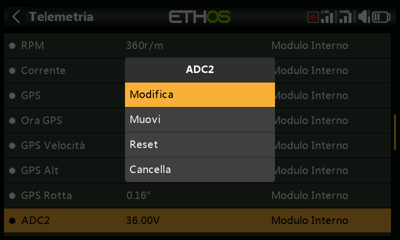

Tocca un sensore, quindi seleziona "Modifica" dalla finestra di dialogo a comparsa per modificare le impostazioni del sensore. In alternativa, seleziona "Sposta" per riordinare i sensori, "Resetta" per resettare il sensore o "Elimina" per rimuoverlo.

- Valore

Visualizza la lettura attuale del sensore, cosi come la frequenza di aggiornamento.

- ID

L'ID è l'ID fisico del sensore e l'ID dell'applicazione. Viene mostrato anche l'ID del ricevitore mittente.

- Nome

Il nome del sensore, che può essere modificato (ingresso analogico ADC2 in questo esempio).

- Unità

L'unità di misura (Volt in questo esempio).

- Decimali

La precisione decimale.

- Gamma

I limiti basso e alto di un intervallo possono essere impostati come un valore fisso per la scalatura. Questo si usa soprattutto quando si utilizza un valore di telemetria come sorgente per un canale. In questo modo è possibile impostare l'intervallo sulla scala desiderata. (Nei ricevitori FrSky più recenti, l'ingresso analogico ha un range di 0-36V).

- Scrivi i log

Se abilitato, i dati del sensore saranno registrati sulla scheda SD o eMMC.

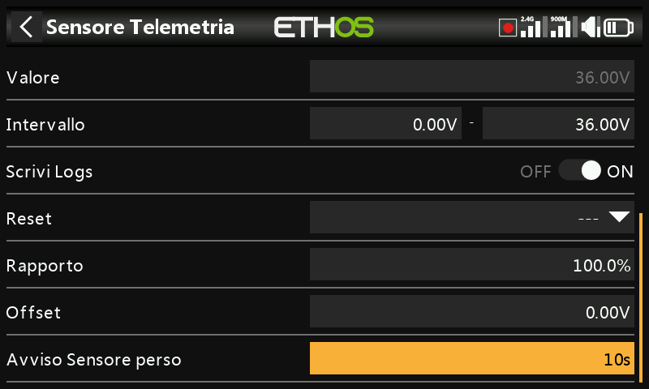

- Ritardo nell'avviso di perdita del sensore

Se impostato su "Avviso disabilitato", sopprime l'avviso di perdita del sensore. In alternativa, è possibile impostare un ritardo da 1 a 30 secondi, con un valore predefinito di 10 secondi. In questo modo è possibile filtrare le perdite di breve durata, ma è necessario comprenderne i rischi.

Il messaggio audio "sensore perso" viene riprodotto solo una volta quando vengono persi più sensori contemporaneamente.

Sul ricevitore questo avviso è disattivato per impostazione predefinita perché è improbabile che venga perso perché è interno.

- Reset - Azzeramento

È possibile configurare una sorgente per resettare il sensore. Gli avvisi con il punto rosso vengono cancellati solo in seguito a un reset del sensore o della telemetria. (Si noti che anche un reset di volo ripristina la telemetria.)

Avvertenze specifiche del sensore

Il menu di modifica può variare a seconda dei sensori, ad esempio:

- ADC2

Fai riferimento alla schermata di esempio qui sopra.

Il rapporto può essere regolato per correggere la scala dell'ingresso del sensore.

Allo stesso modo, è possibile introdurre un offset.

- RSSI

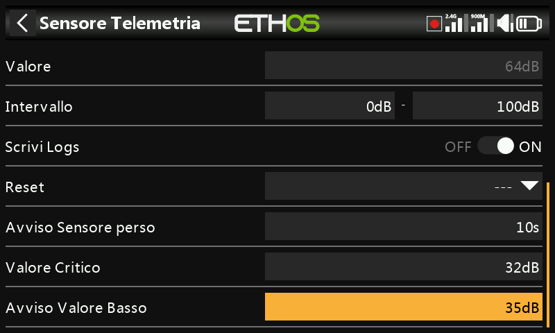

Alcuni sensori come l'RSSI hanno degli avvisi integrati. L'RSSI ha due avvisi, il primo è l'impostazione della soglia del valore critico.

Il secondo avviso è l'impostazione della soglia del valore basso dell'RSSI.

Per una discussione sugli [avvisi RSSI](telemetry.md), consulta la sezione Telemetria dell'ACCESS.

- VFR

VFR è il frame rate valido per il ricevitore.

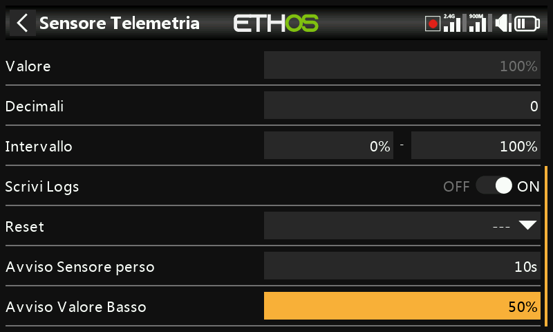

Il sensore VFR ha un'impostazione di soglia per i valori bassi. L'allarme predefinito è al 50%. I valori inferiori a questo valore indicano che la qualità del collegamento si è deteriorata a un livello preoccupante.

- VSpeed

Vspeed è la velocità verticale del modello misurata da un sensore vario.

Visualizza la lettura attuale del sensore, cosi come la frequenza di aggiornamento.

L'ID è l'ID fisico del sensore e l'ID dell'applicazione. Viene mostrato anche l'ID del ricevitore mittente.

Il nome del sensore, che può essere modificato (VSpeed in questo esempio).

L'unità di misura (m/s in questo esempio).

La precisione decimale.

L'intervallo predefinito è di +/- 10 m/s, ma può essere aumentato fino a +/- 100m/s.

Se abilitato, i dati del sensore saranno registrati sulla scheda SD o eMMC.

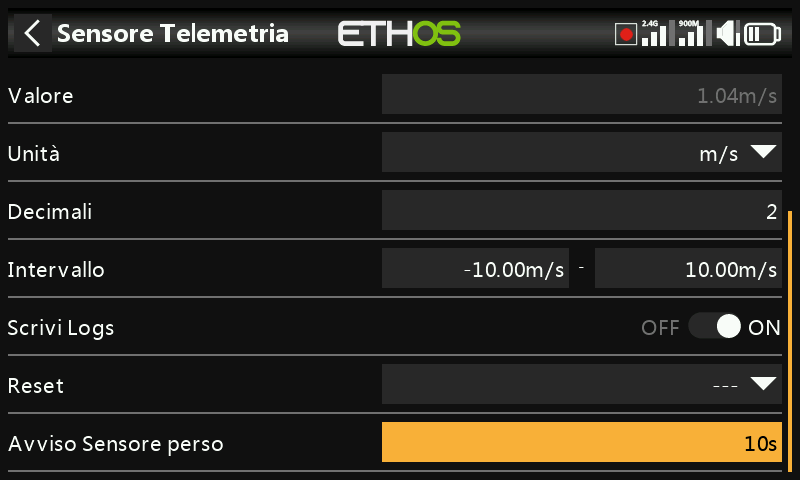

Se impostato su "Avviso disabilitato", sopprime l'avviso di perdita del sensore. In alternativa, è possibile impostare un ritardo da 1 a 10 secondi, con un valore predefinito di 5s. In questo modo è possibile filtrare le perdite di breve durata, ma è necessario comprenderne i rischi.

Sul ricevitore questo avviso è disattivato per impostazione predefinita perché è improbabile che venga perso perché è interno.

È possibile configurare una sorgente per resettare il sensore. Gli avvisi con il punto rosso vengono cancellati solo in seguito a un reset del sensore o della telemetria. (Si noti che anche un reset di volo ripristina la telemetria.)

Nota: le impostazioni relative al vario si trovano ora nella funzione speciale "[Riproduci vario](special-functions.md)".

Crea un sensore fai da te

Questa opzione ti permette di aggiungere un sensore fai da te o di terze parti.

-  
            - 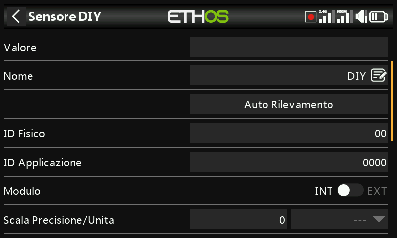
            - 
              Valore

Valore del sensore ricevuto, cosi come la frequenza di aggiornamento.

- Nome

Il nome del sensore, che può essere modificato.

- Rilevamento automatico

L'opzione "Rilevamento automatico" cercherà di scoprire il tuo sensore fai-da-te. Se è già stato rilevato, allora "Rilevamento automatico" non lo troverà. Se altri sensori non sono stati rilevati, verranno mostrati nell'elenco.

- ID fisico

ID fisico a due caratteri del sensore. Questo sarà popolato dal Rilevamento automatico se selezionato.

- ID applicazione

Quattro caratteri dell'ID applicazione del sensore. Questo sarà popolato da "Rilevamento automatico" se selezionato.

- Modulo

Permette di selezionare il modulo RF interno o esterno. Se è stato selezionato, il modulo sarà popolato da "Rilevamento automatico".

- Banda

Consente di selezionare 2.4G o 900M. Se è stato selezionato, questo verrà popolato da "Rilevamento automatico".

- RX

Consente di selezionare RX1, RX2 o RX3. Questo verrà popolato da "Rilevamento automatico" se selezionato.

- Precisione del protocollo / unità

Permette di impostare la precisione del protocollo in entrata, da 0 a 3 decimali. Permette inoltre di selezionare le unità di misura.

- Precisione del display / unità

Permette di impostare la precisione da visualizzare, da 0 a 3 decimali. Permette inoltre di selezionare le unità di misura del display.

- Gamma

I limiti basso e alto di un intervallo possono essere impostati come un valore fisso per la scalatura. Questo si usa soprattutto quando si utilizza un valore di telemetria come sorgente per un canale. In questo modo l'intervallo può essere impostato sulla scala desiderata.

- Rapporto

Il rapporto predefinito del 100% può essere modificato per correggere le letture ricevute.

- Offset

L'offset predefinito di 0 può essere modificato per correggere le letture ricevute.

- Scrivi i log

Se abilitato, i dati del sensore saranno registrati sulla scheda SD o eMMC. I registri sono abilitati per impostazione predefinita.

- Ritardo nell'avviso di perdita del sensore

Se impostato su "Non impostato" sopprime l'avviso di perdita del sensore. In alternativa, è possibile impostare un ritardo da 1 a 10 secondi, con un valore predefinito di 5s. In questo modo è possibile filtrare le perdite di breve durata, ma è necessario comprenderne i rischi.

- Reset - Azzeramento

È possibile configurare una sorgente per resettare il sensore. Gli avvisi con il punto rosso vengono cancellati solo in seguito a un reset del sensore o della telemetria. (Si noti che anche un reset di volo ripristina la telemetria.)

Crea sensore calcolato

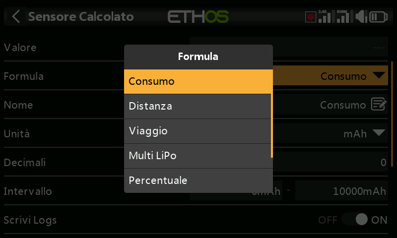

È possibile aggiungere sensori calcolati, tra cui Consumo, Distanza, Viaggio, Multi Lipo, Percentuale, Potenza e Personalizzato.

- Sensore di consumo

Il sensore di consumo calcolato permette di calcolare l'energia consumata dal tuo motore a partire da un sensore di corrente come la serie FAS.

Visualizza il valore attuale del sensore selezionato (vedi Fonte sotto), cosi come la frequenza di aggiornamento.

Seleziona la formula del consumo.

Il nome del sensore, che può essere modificato.

La misura può essere espressa in mAh o Ah.

Il display può avere da 0 a 4 decimali.

L'intervallo può andare da 0 fino a un massimo di 1000Ah.

I registri verranno scritti sulla scheda SD o eMMC nella cartella Logs se abilitata.

È possibile configurare una sorgente per resettare il sensore.

Dopo aver scoperto i sensori, seleziona il tuo sensore attuale.

Persistente permette di memorizzare il valore del sensore quando la radio viene spenta o il modello viene cambiato, e verrà ricaricato la volta successiva che il modello verrà utilizzato.

Il pulsante Azzera consente di azzerare il sensore nella schermata di modifica.

- Sensore di distanza

Il sensore Distanza calcolata permette di calcolare la distanza percorsa da un sensore GPS.

Visualizza il valore attuale del sensore selezionato (vedi Fonte sotto), cosi come la frequenza di aggiornamento.

Seleziona la formula Distanza.

Il nome del sensore, che può essere modificato.

La misura può essere espressa in cm, m, km o piedi.

Il display può avere da 0 a 4 decimali.

La portata può andare da 0 a un massimo di 1000 km.

I registri verranno scritti sulla scheda SD o eMMC nella cartella Logs se abilitata.

È possibile configurare una sorgente per resettare il sensore.

Dopo aver scoperto i sensori, seleziona il tuo sensore GPS.

Dopo aver scoperto i sensori, seleziona il tuo sensore di altitudine.

Persistente permette di memorizzare il valore del sensore quando la radio viene spenta o il modello viene cambiato, e verrà ricaricato la volta successiva che il modello verrà utilizzato.

Il pulsante Azzera consente di azzerare il sensore nella schermata di modifica.

- Sensore di “Viaggio” - “Escursione”

Il sensore di calcolo del viaggio consente di calcolare la distanza accumulata tra le coordinate GPS da un sensore GPS.

Visualizza il valore attuale del sensore selezionato (vedi Fonte sotto).

Seleziona la formula Viaggio.

Il nome del sensore, che può essere modificato.

La misura può essere espressa in cm, m, km o piedi.

Il display può avere da 0 a 4 decimali.

Il raggio d'azione può andare da 0 fino a un massimo di 1000 km.

I registri verranno scritti sulla scheda SD o eMMC nella cartella Logs se abilitata.

È possibile configurare una sorgente per resettare il sensore.

Dopo aver scoperto i sensori, seleziona il tuo sensore GPS.

Persistente permette di memorizzare il valore del sensore quando la radio viene spenta o il modello viene cambiato, e verrà ricaricato la volta successiva che il modello verrà utilizzato.

Il pulsante Azzera consente di azzerare il sensore nella schermata di modifica.

- Sensore Multi Lipo

Il sensore calcolato Multi Lipo permette di collegare in cascata due sensori lipo per monitorare lipo superiori a 6S.

Visualizza il valore attuale del sensore selezionato (vedi Fonte sotto).

Seleziona la formula Multi Lipo.

Il nome del sensore, che può essere modificato.

La misura può essere espressa in Volt o mV.

Il display può avere da 0 a 4 decimali.

L'intervallo può andare da 0 fino a un massimo di 67,2V (per 8S).

I registri verranno scritti sulla scheda SD o eMMC nella cartella Logs se abilitata.

È possibile configurare una sorgente per resettare il sensore.

Il numero di sensori lipo da configurare.

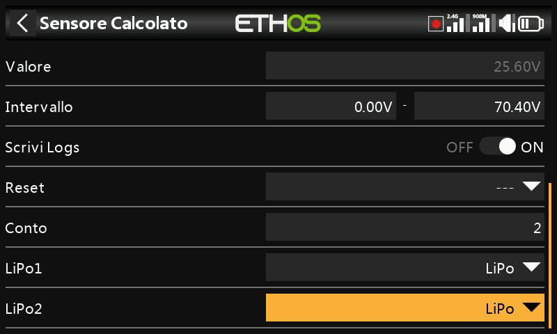

Seleziona i sensori lipo nell'ordine corretto, da cella bassa a cella alta.

Per evitare conflitti con la porta S.Port, i sensori lipo aggiuntivi devono essere modificati sia nell'ID fisico che in quello dell'applicazione utilizzando lo strumento di configurazione della tensione lipo nel menu Configurazione dispositivo. È inoltre consigliabile scoprirli uno alla volta e cambiare il nome del sensore in modo da poterli distinguere.

- Sensore percentuale

Il sensore Percentuale calcolata permette di convertire i valori del sensore in una percentuale.

Visualizza il valore attuale del sensore selezionato (vedi Fonte sotto).

Seleziona la formula Percentuale.

Il nome del sensore, che può essere modificato.

Le unità sono fissate in "%".

Il display può avere da 0 a 4 decimali.

L'intervallo può andare dallo 0% al 100%.

I registri verranno scritti sulla scheda SD o eMMC nella cartella Logs se abilitata.

È possibile configurare una sorgente per resettare il sensore.

Dopo aver scoperto i sensori, seleziona il sensore da convertire in percentuale.

Invertire

Permette di invertire la sorgente, per mostrare ad esempio la percentuale rimanente.

- Sensore di potenza

Il sensore di potenza calcolata permette di calcolare la potenza da una fonte di tensione e di corrente.

Visualizza il calcolo del wattaggio attuale dei sensori selezionati (vedi Corrente e Tensione qui sotto).

Seleziona la formula Power.

Il nome del sensore, che può essere modificato.

Le unità di misura possono essere mW o 'W'.

Il display può avere da 0 a 4 decimali.

L'intervallo può andare da 0 a 1000000W.

I registri verranno scritti sulla scheda SD o eMMC nella cartella Logs se abilitata.

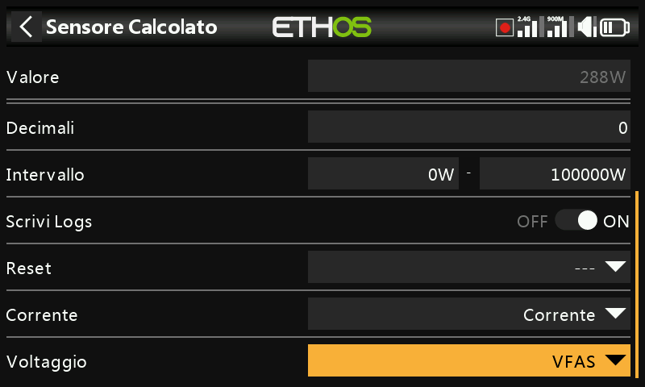

Permette di resettare il sensore.

Dopo aver scoperto i sensori, seleziona il sensore da utilizzare per la corrente.

Dopo aver scoperto i sensori, seleziona il sensore da utilizzare per la tensione.

- Sensore ***Ad Hoc - Personalizzato***

Il sensore calcolato personalizzato permette di calcolare un sensore definito dall'utente da più fonti.

Visualizza il valore calcolato corrente del sensore personalizzato.

Seleziona la formula personalizzata.

Il nome del sensore, che può essere modificato.

Le unità di misura sono selezionabili tra 'mV', 'V', 'mA', 'A', 'mAh', 'Ah, 'mW', 'W', 'cm', 'm', 'km' 'ft', 'cm/s', 'm/s', m/min', 'ft/s', 'ft/min', 'km/h', 'mph', 'knots', '° C', °F", "%", "us", "ms", "s", "m", "h", "dB", "dBm", "Hz", "MHz", "g", "°", "rad", "ml", "ml/m", "ml/p", "r/m", "Pa", "kPa", "MPa", "bar" e "PSI".

Il display può avere da 0 a 4 decimali.

L'intervallo può essere compreso tra -1000000 e 1000000.

I registri verranno scritti sulla scheda SD o eMMC nella cartella Logs se abilitata.

Permette di resettare il sensore.

Dopo aver individuato i sensori, seleziona il primo sensore da utilizzare per il calcolo. Clicca su "Aggiungi" per aggiungere altre linee di calcolo se necessario.

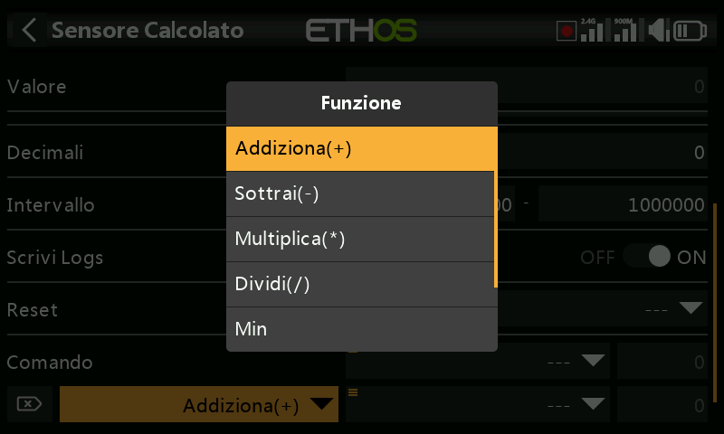

Sono disponibili i seguenti operatori matematici:

- Aggiungi(+)
- Meno(-)
- Moltiplica(x)
- Dividere (/)
- Min
- Max
- Sqrt (radice quadrata)

Il Sensore ad Hoc è stato chiamato MaxPower

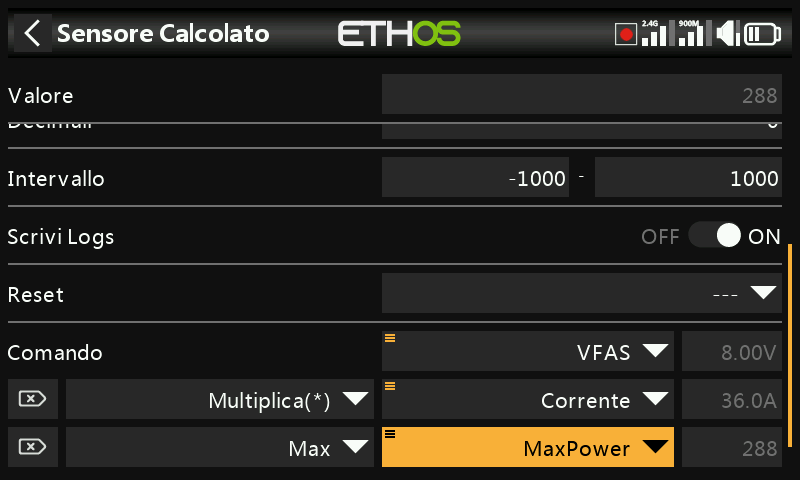

Nel semplice esempio precedente, un sensore di tensione VFAS e un sensore di corrente attuale sono stati moltiplicati per calcolare la potenza. Poi è stata aggiunta una funzione Max che fa riferimento al valore di corrente del nostro sensore personalizzato 'MaxPower' per calcolare il valore massimo. Il campo Valore mostra 61,3W, che è il massimo raggiunto durante il test.

Il sensore ad-hoc è stato chiamato SubtrExample.

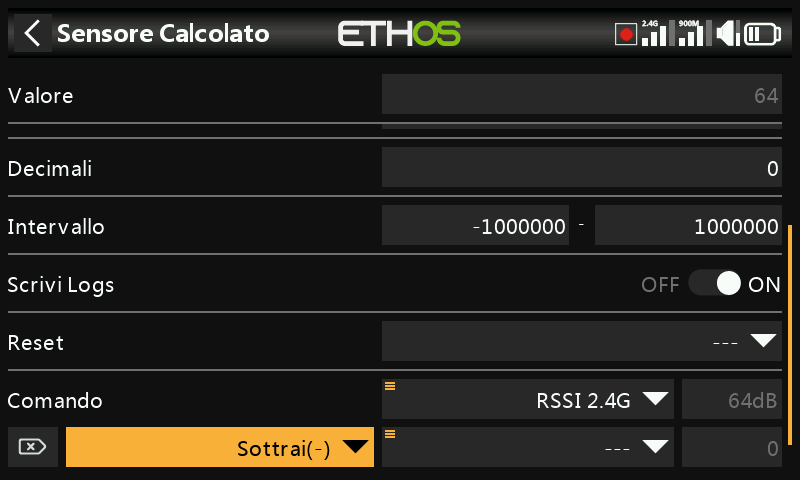

In questo esempio iniziamo con la sorgente RSSI 2.4G e poi aggiungiamo una funzione di sottrazione.

Premi a lungo sul parametro Sorgente nella riga Sottrai(-), quindi seleziona "Converti in valore".

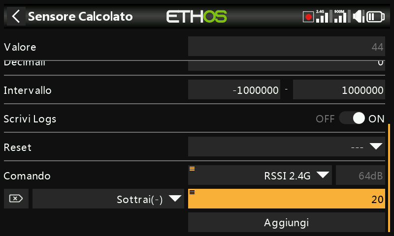

Ora puoi modificare il valore (che ora è una costante) da utilizzare nella funzione Sottrai.

Questo esempio serve semplicemente a mostrare il valore di calcolo interno di una sorgente. Utilizzeremo un sensore calcolato personalizzato con la sorgente impostata su Gas - Throttle. Con il Gas - Throttle al 100%, possiamo vedere che il valore interno è +1024.

Con il Gas - Throttle a -100%, possiamo vedere che il valore interno è a -1024. Quindi il valore interno di una sorgente è compreso tra +/-1024 quando la sorgente è +/-100%.

Scheda Settaggi

La scheda “Impostazioni” serve per attivare la modalità “Solo competizione”, per abilitare il Bluetooth per l'invio dei dati telemetrici e per attivare l'avviso RSSI individuale per banda sui ricevitori TD e TW.

Competizione (solo RSSI e batteria)

Ethos ha una modalità di gara che ti permette di disabilitare la telemetria per alcune gare locali che consentono di installare sensori di telemetria anche se sono disabilitati. Questi sensori consentono di visualizzare i dati relativi allo stato del collegamento, come RSSI e batteria Rx.

Attivando questa modalità si cancellano tutti i sensori tranne RSSI e RxBatt. La radio deve essere spenta prima che i sensori possano essere riscoperti con questa impostazione in posizione off.

Inoltro Telemetria (Telemetry Forwarding)

I dati di telemetria possono essere trasmessi tramite Bluetooth o con il protocollo FBUS tramite il connettore S.Port.

Bluetooth

In modalità telemetria Bluetooth la radio può funzionare con l'applicazione FrSky FreeLink per visualizzare i dati di telemetria sul tuo cellulare. L'app Freelink può essere utilizzata anche per configurare i dispositivi FrSky come i ricevitori stabilizzati.

FBUS via S.Port connector

I dati di telemetria possono anche essere trasmessi in formato FBUS tramite il 						connettore S.Port situato sulla parte superiore della radio.

Allarme RSSI individuale per banda

Quando si utilizzano i protocolli TD o TW, è possibile ricevere avvisi vocali di RSSI individuale per banda. Consulta la sezione [RSSI ](#Individual_RSSI_alert_per_band)qui sopra.
