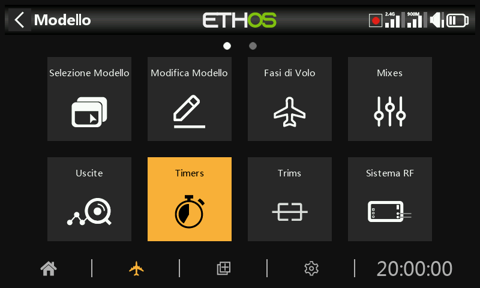
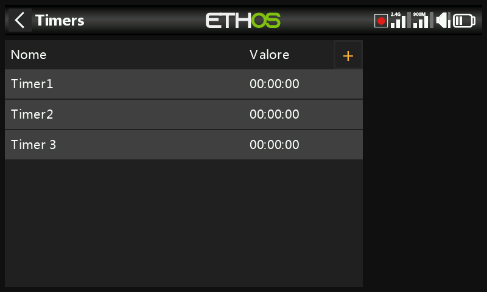
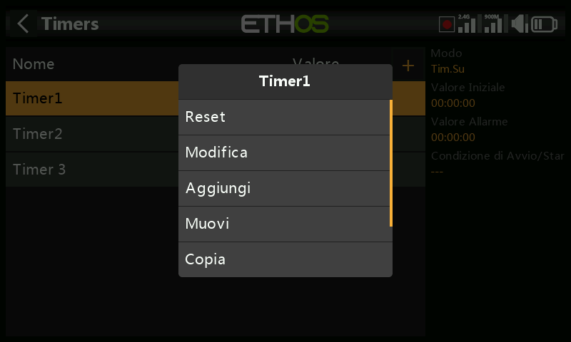
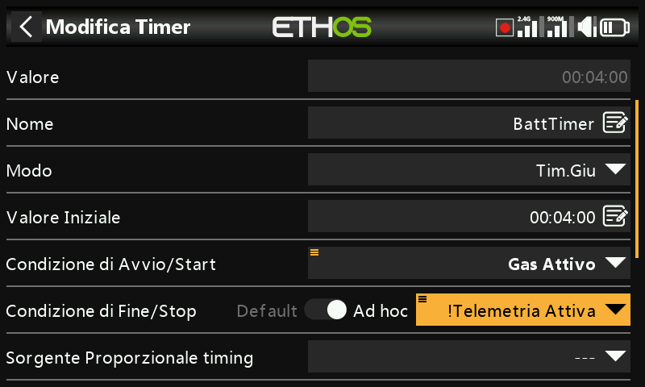
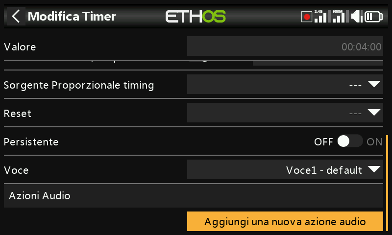
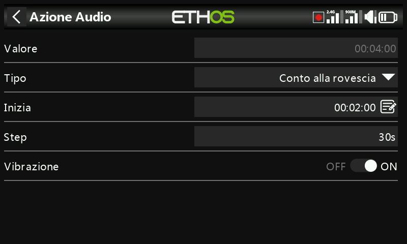
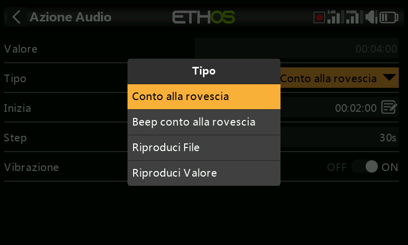
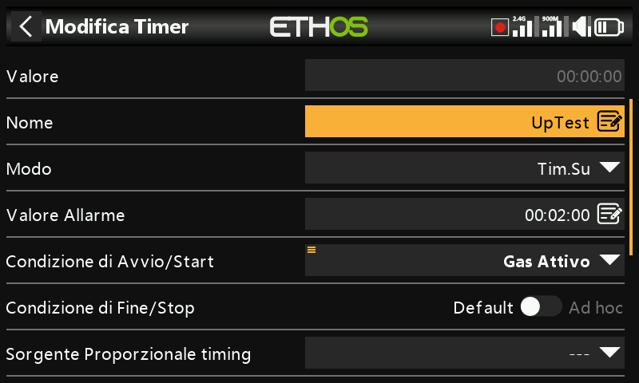
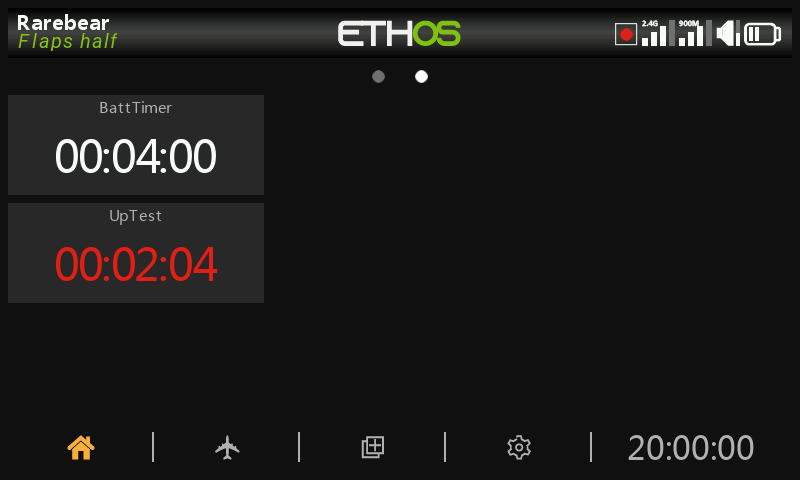
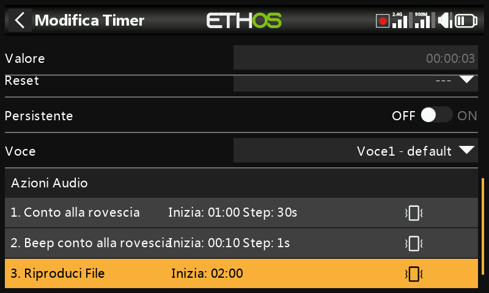

# Timer

Ci sono 8 timer completamente programmabili che possono contare sia verso l'alto che verso il basso.

Nella schermata principale dei timer (vedi sopra) è possibile aggiungere nuovi timer toccando il simbolo “+” accanto alle intestazioni delle colonne.

Toccando una riga del timer si apre un popup con le opzioni per resettare o modificare il timer, aggiungere un nuovo timer, spostare o copiare/incollare il timer.

## Timer per il conto alla rovescia

Valore

Mostra il valore attuale del timer.

Nome

Permette di dare un nome al timer.

Modalità

Il timer può contare su o **giù**.

Valore iniziale

Se il timer è stato impostato per il conteggio alla rovescia, il valore iniziale è il valore a partire dal quale il timer conta alla rovescia fino a zero.

Condizione iniziale

La condizione di avvio avvia il timer. Se la condizione di stop sottostante è impostata come predefinita, allora il timer si avvia e si ferma solo con la condizione di avvio. Se la condizione di stop sottostante non è "predefinita", allora il timer si avvia quando la condizione di avvio diventa vera e poi continua a scorrere.

Condizione di stop

Se la condizione di arresto è "predefinita", il timer è controllato solo dalla condizione di avvio.

Se non è "predefinito", una volta che il timer è in funzione, la condizione di stop controlla il timer. Il timer smette di funzionare quando la condizione di stop è vera, ma continua a funzionare quando la condizione di stop è falsa.

Nell'esempio precedente, il timer viene avviato quando ThrottleActive diventa True e si ferma quando la telemetria non è più attiva.

Sorgente di temporizzazione proporzionale

Se è impostato su '---' il timer conta in tempo reale. Se è stata selezionata una fonte di temporizzazione proporzionale, la velocità del timer è controllata da questa fonte, ad esempio lo stick del Gas - Throttle o il canale del Gas - Throttle. Quando il valore del Gas - Throttle è -100%, il timer si ferma. Quando il valore del Gas - Throttle è +100%, il timer conta in tempo reale. Con valori intermedi del Gas - Throttle, il timer conta in modo proporzionale.

Reset - Azzeramento

Il timer può essere resettato da posizioni di interruttori, interruttori di funzione, interruttori logici o posizioni di interruttori di trim. Si noti che il timer viene mantenuto in reset finché la condizione di reset è valida.

Persistente

L'opzione Persistente su On consente di memorizzare il valore del timer quando la radio viene spenta o il modello viene cambiato. Il valore verrà ricaricato al successivo utilizzo del modello.

Voce

Seleziona la voce da utilizzare per gli annunci vocali. Per maggiori dettagli, consulta la sezione [Scelta delle voci](../system-setup/general.md).

Azioni audio

Le azioni audio sono molto potenti e flessibili e consentono di configurare gli avvisi temporizzati esattamente in base alle esigenze dell'utente.

Clicca su "Aggiungi una nuova azione audio".

Seleziona il tipo di azione audio richiesta, ad esempio "Conto alla rovescia" nell'esempio precedente.

Iniziare

Il valore iniziale è il valore da cui parte l'azione di conto alla rovescia.

Passo

Il valore del passo stabilisce gli intervalli in cui il valore del timer verrà annunciato. Il valore del passo può arrivare fino a 10 minuti (600 secondi).

Aptico

Se abilitato, il feedback aptico accompagnerà gli annunci.

I tipi di azione audio includono "Conta secondi" (con voce), "Conto alla rovescia con bip" (con bip al posto della voce), "Riproduci file" e "Riproduci valore".

In questo esempio sono state configurate tre azioni audio:

- Innanzitutto, ogni 30 secondi verrà emesso un avviso di conto alla rovescia a partire dai 2 minuti rimanenti. L'avviso sarà vocale ed è stato attivato anche un feedback aptico.
- In secondo luogo un avviso di conto alla rovescia a partire dai 10 secondi rimanenti, dopodiché verrà emesso un segnale acustico ogni secondo. È stato attivato anche il feedback aptico.
- Infine, un file audio personalizzato "timup" verrà riprodotto quando il timer scade (cioè raggiunge lo zero), accompagnato da un feedback aptico.

Ulteriori azioni audio possono essere aggiunte toccando il pulsante "Aggiungi". Tieni presente che l'elenco deve essere in ordine di priorità, con la priorità più alta alla fine dell'elenco.

## Timer per il conto alla rovescia crescente

Valore

Mostra il valore attuale del timer.

Nome

Permette di dare un nome al timer.

Modalità

Il timer può contare **su** o giù.

Valore dell***'allarme***

Se il timer è stato impostato per il conto alla rovescia, il parametro del valore dell'allarme imposta il valore al quale il timer scade. Il timer continua a contare, ma il valore diventa rosso nei widget del timer.

Condizione iniziale

La condizione di avvio avvia il timer. Se la condizione di stop sottostante è impostata come predefinita, allora il timer si avvia e si ferma solo con la condizione di avvio. Se la condizione di stop sottostante non è "predefinita", allora il timer si avvia quando la condizione di avvio diventa vera e poi continua a scorrere.

Condizione di stop

Se la condizione di arresto è "predefinita", il timer è controllato solo dalla condizione di avvio.

Se non è "predefinito", una volta che il timer è in funzione, la condizione di stop controlla il timer. Il timer smette di funzionare quando la condizione di stop è vera, ma continua a funzionare quando la condizione di stop è falsa.

Sorgente di temporizzazione proporzionale

Se è impostato su '---' il timer conta in tempo reale. Se è stata selezionata una fonte di temporizzazione proporzionale, la velocità del timer è controllata da questa fonte, ad esempio lo stick del Gas - Throttle o il canale del Gas - Throttle. Quando il valore del Gas - Throttle è -100%, il timer si ferma. Quando il valore del Gas - Throttle è +100%, il timer conta in tempo reale. Con valori intermedi del Gas - Throttle, il timer conta in modo proporzionale.

Reset - Azzeramento

Il timer può essere resettato da posizioni di interruttori, interruttori di funzione, interruttori logici o posizioni di interruttori di trim. Si noti che il timer viene mantenuto in reset finché la condizione di reset è valida.

Persistente

L'opzione Persistente su On consente di memorizzare il valore del timer quando la radio viene spenta o il modello viene cambiato. Il valore verrà ricaricato al successivo utilizzo del modello.

Voce

Seleziona la voce da utilizzare per gli annunci vocali. Per maggiori dettagli, consulta la sezione [Scelta delle voci](../system-setup/general.md).

Azioni audio

Le azioni audio sono molto potenti e flessibili e consentono di configurare gli avvisi temporizzati esattamente in base alle esigenze dell'utente.

In questo esempio sono state configurate tre azioni audio:

- In primo luogo, ogni 30 secondi verrà emesso un conto alla rovescia verso il valore dell'allarme a partire dai 2 minuti rimanenti. L'allarme sarà vocale ed è stato abilitato anche il feedback aptico.
- In secondo luogo un conto alla rovescia che parte dai 10 secondi rimanenti, dopodiché verrà emesso un segnale acustico ogni secondo. È stato attivato anche il feedback aptico.
- Infine, un file audio personalizzato "timsup" verrà riprodotto quando il timer scadrà raggiungendo il valore di allarme, accompagnato da un feedback aptico.

Ulteriori azioni audio possono essere aggiunte toccando il pulsante "Aggiungi". Tieni presente che l'elenco deve essere in ordine di priorità, con la priorità più alta alla fine dell'elenco.
