# Trainer

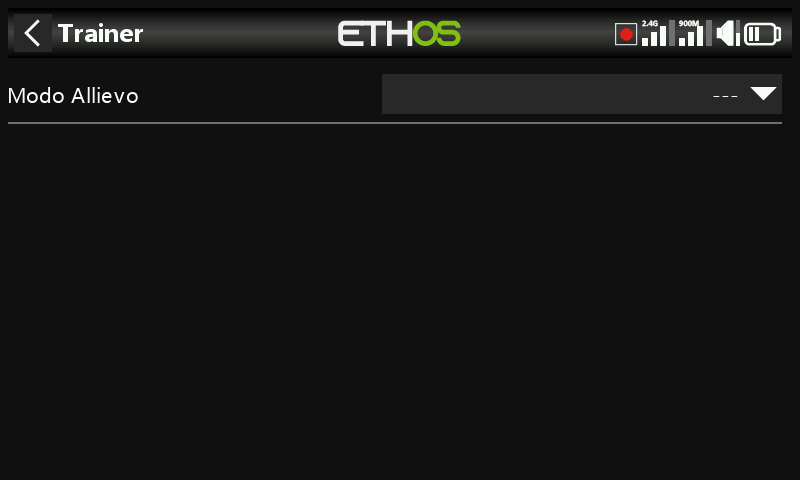

Disattivato per impostazione predefinita. Imposta la radio come **Master**
(la radio dell'istruttore, che riceve fino a 16 comandi dall'allievo) o
**Slave** (la radio dell'allievo, che invia un numero configurabile di
canali all'istruttore).

## Modalità Master

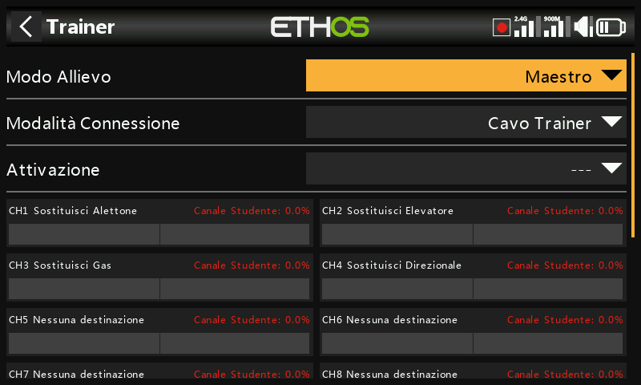

### Modalità di collegamento

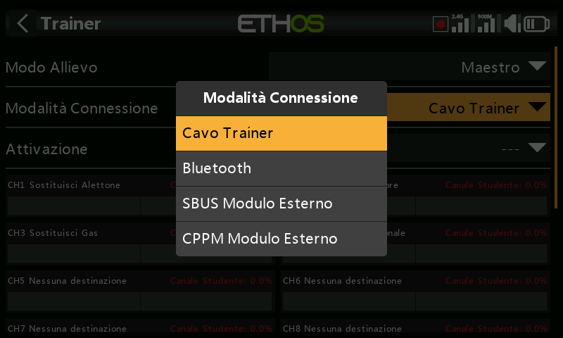

- **Cavo trainer** — un cavo audio mono da 3,5 mm tra le due radio.
- **Bluetooth** —

  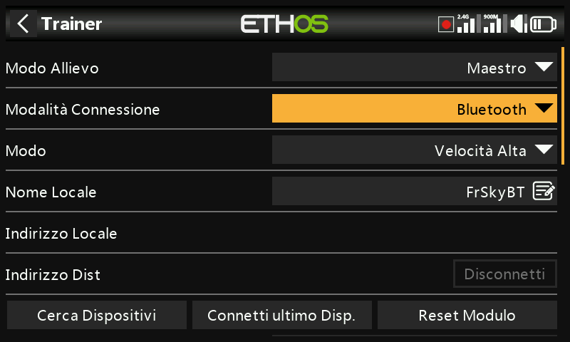

  - **Modalità** — normale o alta velocità; utilizza l'alta velocità per
    una latenza inferiore, se entrambe le radio la supportano.

    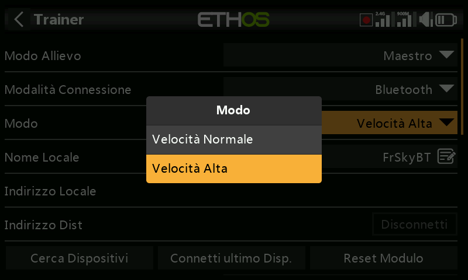

  - **Nome locale** — il nome BT mostrato agli altri dispositivi
    (predefinito `FrSkyBT`, modificabile).
  - **Indirizzo locale** — l'indirizzo Bluetooth di questa radio.
  - **Indirizzo remoto** — l'indirizzo della radio accoppiata, una volta
    stabilito il collegamento.
  - **Cerca dispositivi** (solo in modalità Master) — esegue la scansione
    dei dispositivi nelle vicinanze:

    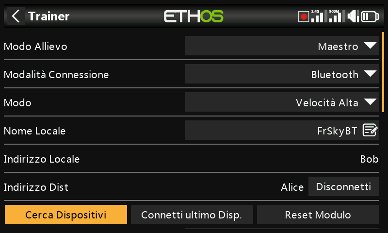
    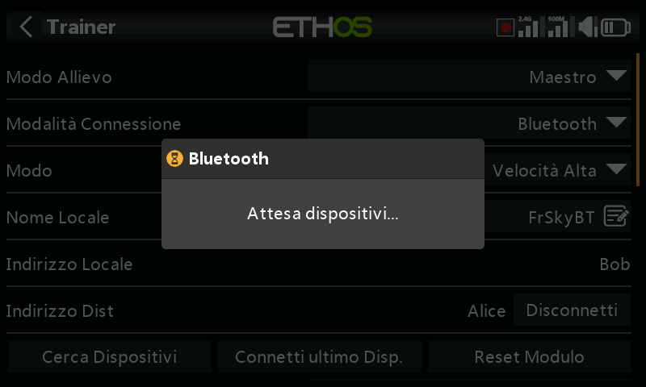
    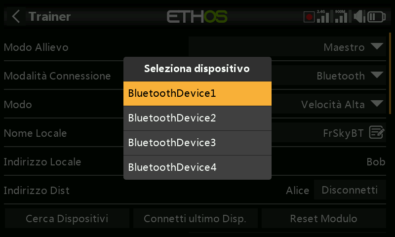
    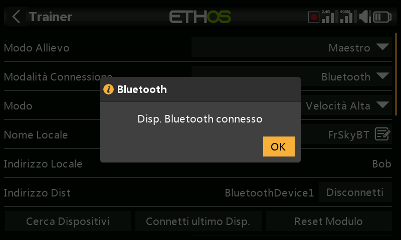

  - **Connetti ultimo dispositivo** / **Reset modulo** — riconnette
    all'accoppiamento precedente, oppure cancella completamente la
    configurazione del modulo Bluetooth.

- **Modulo esterno SBUS** — un ingresso SBUS sul pin PXX-IN del vano del
  modulo esterno, per installare un ricevitore FrSky con uscita SBUS (ad
  es. Archer RS) come estremità ricevente di un collegamento wireless,
  consentendo a **qualsiasi** radio FrSky di fungere da lato allievo
  (buddy box), collegata a tale ricevitore.
- **Modulo esterno CPPM** — stessa idea tramite un ingresso CPPM, per un
  ricevitore datato con uscita CPPM.

### Condizione di attivazione

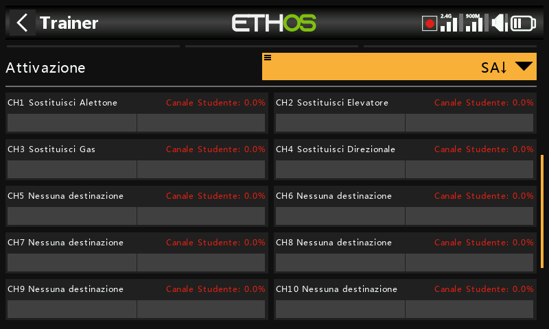

Un interruttore/pulsante, interruttore funzione, interruttore logico,
posizione di trim o fase di volo che, quando attivo, cede il controllo
all'allievo.

### Canali trainer

È possibile trasferire fino a 16 canali dall'allievo al master mentre la
condizione di attivazione è vera. Tocca un canale per configurarlo
singolarmente:

- **Condizione di attivazione** — un'esclusione specifica per canale, ad
  esempio per disabilitare solo il comando di profondità dell'allievo
  durante una parte della sessione.
- **Modalità** — **OFF** (disabilitato per l'uso trainer), **Add** (i
  segnali del master e dell'allievo si sommano, così entrambi possono
  agire contemporaneamente sul comando) oppure **Replace** (la modalità
  normale: l'allievo ha il pieno controllo di questo canale mentre è
  attivo).
- **Percentuale** — scala il comando dell'allievo, normalmente 100%.
- **Destinazione** — a quale funzione viene assegnato il canale
  dell'allievo.

Consulta [Guida pratica: ripresa istantanea del
controllo](../how-to/instant-takeback.md) per un esempio pratico in cui
l'istruttore riprende immediatamente il controllo tramite un interruttore,
e [Ignora ingresso
trainer](../getting-started/user-interface-and-navigation.md#choosing-a-source)
per escludere il movimento degli stick dell'allievo da un interruttore
logico che monitora gli stick dell'istruttore.

## Modalità Slave

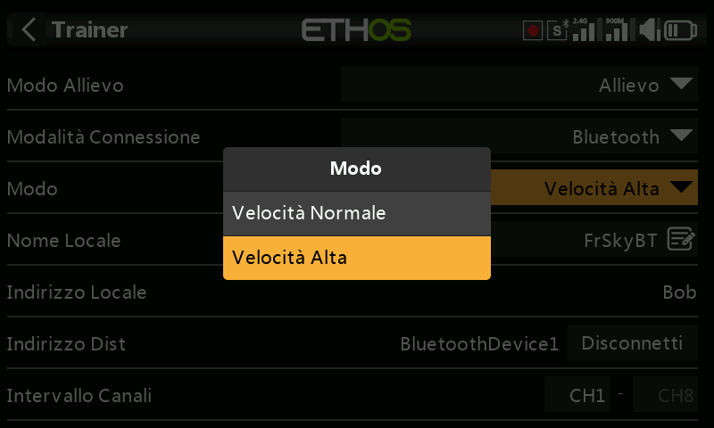

- **Modalità di collegamento** — la stessa scelta tra cavo trainer,
  Bluetooth o modulo esterno SBUS/CPPM disponibile in modalità Master
  (con gli stessi campi Bluetooth **Modalità**/**Nome
  locale**/**Indirizzo locale**/**Indirizzo remoto**).

  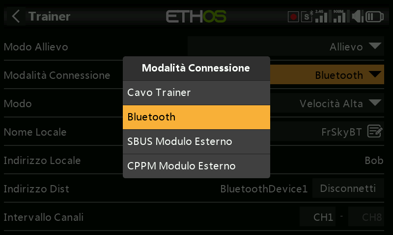

- **Intervallo canali** — quale intervallo di canali di questa radio viene
  inviato al master.

  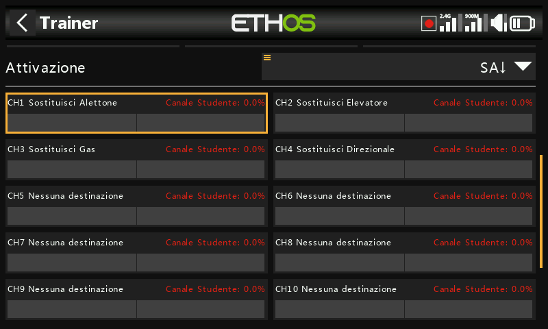
  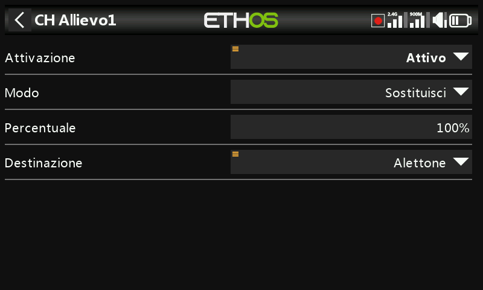
