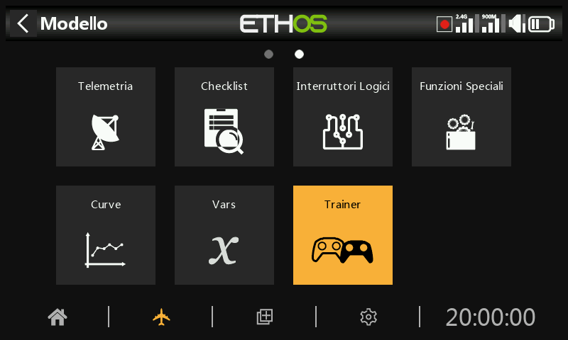
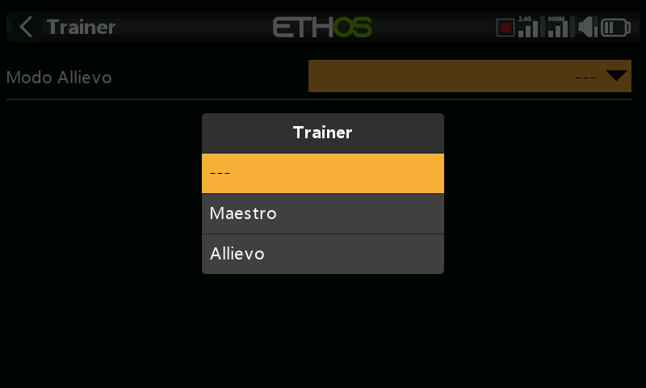

# Trainer

La funzione Trainer può essere configurata come master o slave. In modalità master, quando la “condizione attiva” è attiva, è possibile trasferire fino a 16 comandi dalla radio slave (o dello studente) alla radio master (o del tutor). In modalità slave, un numero configurabile di canali viene trasferito al master.  
  
Esistono 5 metodi per configurare i collegamenti trainer, che possono essere utilizzati contemporaneamente in qualsiasi direzione tramite:  
            ▪ Cavo trainer  
            ▪ Bluetooth  
            ▪ SBUS sul connettore del modulo esterno   
            ▪ PPM sul connettore del modulo esterno (questo non può essere utilizzato contemporaneamente all'SBUS sul modulo esterno)  
            ▪ SBUS sul connettore S.Port della radio  
  
Quanto sopra può essere utilizzato anche per altre applicazioni, come un modulo di tracciamento della testa che invia segnali che la radio utilizza per controllare la visuale di una telecamera FPV.

Non ci sono collegamenti predefiniti ai trainer. Tocca il pulsante «+» per aggiungere un nuovo collegamento a un trainer.

Scegli il metodo di connessione tra le 4 opzioni proposte.

## Cavo Trainer

Tocca l'opzione “Cavo trainer” per configurare una connessione trainer tramite un cavo fisico, che dovrebbe essere un cavo audio mono da 3,5 mm.

Stato

È possibile disattivare la funzione del cavo di collegamento. Ciò consente all'utente di attivare una sola scheda di collegamento alla volta, mantenendo le diverse configurazioni.

Modo Trainer

Allievo

Il modo di default è la modalita allievo.

Range Canali

Vengono trasmessi otto canali, con il numero iniziale configurabile.

Maestro

Il modo Trainer via cavo può essere cambiato in Maestro per configurare la radio per l’istruttore.

Configurazione Trainer maestro

Per ulteriori dettagli sulla configurazione della modalità master del Trainer, in particolare sulla “condizione attiva” e sui canali slave, consultare la sezione dedicata alla configurazione del Trainer master riportata di seguito.

Opzioni cavo Trainer

Toccando la scheda “Cavo trainer” si aprono le opzioni della scheda.  
  
Se è stato configurato un master del cavo di addestramento, diventano disponibili le opzioni “Copia” e “Incolla”. Ciò consente di copiare e incollare le impostazioni del master tra i diversi metodi di addestramento.  
  
Infine, è disponibile un'opzione “Elimina” per eliminare la scheda di configurazione del cavo di addestramento.

## Bluetooth

Seleziona l’opzione ‘Bluetooth’ per configurare un link trainer con l’interfaccia Bluetooth.

Stato

La funzione trainer Bluetooth può essere disabilitata. Questo permette all’utente di abilitare una modalità allievo/maestro alla volta, mantendo comunque I parametri di configurazione.

Modo Trainer

Allievo

Il modo standard per il trainer Bluetooth è allievo.

Nome Locale

Questo è il nome locale Bluetooth che verrà mostrato nel device con cui ci si collegherà

Dispositivo

Dettagli della connesione Bluetooth.

Range canali

Otto canali vengono trasmessi per default, questo comunque è configurabile.

Maestro

Il modo trainer Bluetooth può essere cambiato in Maestro in modo da configurare la radio per l’istruttore.

Nome Locale

##### Indirizzo Locale

Questo è l’indirizzo locale Bluetooth della radio.

Questo è il nome BT locale che sarà visualizzato nel dispositivo connesso. Il nome standard è quello del modello della Radio, ma può essere cambiato qui.

Dispositivo

##### Ricerca

Seleziona Cerca dispositivi per mettere la radio in modalità ricerca BT.

I dispositivi trovati sono elencati in dialogo popup con la richiesta di selezionare un dispositivo. Seleziona l’indirizzo BT che coincide con la radio da usare come allievo.

Il dispositivo BT selezionato è connesso.

Una volta individuato e associato un dispositivo Bluetooth, l'indirizzo Bluetooth del dispositivo remoto viene visualizzato nella riga “Dispositivo”.

##### Disconnetti

Tocca il dispositivo per visualizzare l'opzione “Disconnetti”.

Configurazione Allievo Maestro

Attivazione

Il controllo del modello può essere trasferito alla radio dello studente tramite un interruttore o un pulsante, un selettore di funzione, un selettore logico, una posizione di trim o una Fase di volo.

Condizione di Attivazione

Il comando del modello può essere trasferito alla radio dello studente tramite un interruttore o un pulsante, un selettore di funzione, un selettore logico, una posizione di trim o una Fase di volo.

Canali Trainer

Quando la “condizione attiva” impostata in precedenza è attiva, è possibile trasferire fino a 16 comandi dalla radio dello studente alla radio principale.

seleziona ogni canale per configurarlo individualmente.

##### Attivazione

Ogni singolo canale slave può essere controllato anche dalla sorgente selezionata. Ad esempio, è possibile disattivare l'ingresso dell'ascensore dello studente durante una sessione.

##### Modo

##### OFF

Disabilita il canale dall’uso Trainer.

##### Aggiungi

Seleziona la modalità additiva, in cui i segnali del master e dello slave vengono sommati, in modo che sia il docente che lo studente possano intervenire sulla funzione.

##### Sostituisci

Sostituisce il comando della radio principale con quello dello studente, in modo che quest'ultimo abbia il pieno controllo mentre la “condizione attiva” è attiva. Questa è la modalità di utilizzo normale.

##### Percentuale

Di norma è impostato al 100%, ma può essere utilizzato per regolare l'ingresso dello Slave.

##### Destinazione

Assegna il canale della radio secondaria alla funzione corrispondente.

Opzione ignora l’input del trainer

Negli interruttori logici, è possibile impostare questa opzione per ignorare i segnali provenienti dall'ingresso del istruttore. Un'applicazione tipica è quella in cui un interruttore logico è configurato per rilevare il movimento dello stick dell'istruttore principale (ad esempio, lo stick dell'elevatore) e consentire un intervento immediato in caso di problemi. Questa opzione è necessaria per impedire che gli input degli stick dell'allievo attivino l'interruttore logico.

Opzioni trainer Bluetooth

Toccando la scheda “Bluetooth” si visualizzano le opzioni della scheda Bluetooth.  
  
Se è stato configurato un master Bluetooth, diventano disponibili le opzioni “Copia” e “Incolla”. Ciò consente di copiare e incollare le impostazioni del master trainer tra i diversi metodi di Allievo-Maestro.

Infine, è disponibile un'opzione che consente di eliminare la scheda delle impostazioni Bluetooth.

## Modulo Esterno

Selezionare l'opzione “Modulo esterno” per configurare un collegamento al trainer utilizzando un modulo esterno.

Stato

È possibile disattivare la funzione di simulatore del modulo esterno. Ciò consente all'utente di attivare una sola scheda del simulatore alla volta, mantenendo le diverse configurazioni.

Modo Trainer

Allievo

La modalità predefinita per un modulo esterno è “allievo”.

Protocollo

Sono disponibili 2 opzioni di protocollo per un collegamento tra trainer e slave tramite l'interfaccia del modulo esterno sul retro della radio:

##### SBUS

Per ulteriori dettagli sulla configurazione dell'interfaccia del modulo esterno per il collegamento a un trainer SBUS, consultare la sezione SBUS nel modello /RF.

##### PPM\`

Per ulteriori dettagli sulla configurazione dell'interfaccia del modulo esterno per il collegamento di un trainer PPM, consultare la sezione PPM nel modello /RF.

Range Canali

Con SBUS vengono trasmessi 16 canali. Con PPM vengono trasmessi otto canali, ma il numero del canale iniziale è configurabile.

Maestro

Protocollo

Sono disponibili 2 opzioni di protocollo per il collegamento di un master trainer tramite l'interfaccia del modulo esterno sul retro della radio:

##### Trainer maestro (SBUS)

Per ulteriori dettagli sulla configurazione dell'interfaccia del modulo esterno per il collegamento di un trainer SBUS, consultare la sezione “Trainer master (SBUS)” in Modello/RF.

##### Trainer maestrp (PPM)

Per ulteriori dettagli sulla configurazione dell'interfaccia del modulo esterno per il collegamento di un trainer PPM, consultare la sezione “Trainer master (PPM)” in Modello/RF.

Configurazione Trainer maestro

Per ulteriori dettagli sulla configurazione della modalità master del Trainer, in particolare sulla “condizione attiva” e sui canali slave, consultare la sezione dedicata alla configurazione del Trainer master riportata di seguito.

Opzioni Cavo Trainer

Toccando la scheda “Connettore S.Port” si aprono le opzioni della scheda.  
  
Se è stato configurato un trainer master, diventano disponibili le opzioni “Copia” e “Incolla”. Ciò consente di copiare e incollare le impostazioni del trainer master tra i vari metodi di allenamento.  
  
Infine, è disponibile un'opzione “Elimina” per eliminare la scheda di configurazione modulo esterno.

## Connettore S.Port

Seleziona l'opzione “Connettore S.Port” per configurare un collegamento trainer utilizzando il connettore S.Port situato nella parte superiore della radio.

Stato

È possibile disattivare la funzione di simulatore del connettore S.Port. Ciò consente all'utente di attivare una sola scheda del simulatore alla volta, mantenendo le diverse configurazioni.

Modo Trainer

Allievo

La modalità predefinita per il connettore S.Port è Allievo.

Range Canali

Per impostazione predefinita vengono trasmessi i primi otto canali, ma questa impostazione è configurabile.

Maestro

È possibile impostare la modalità “Trainer” del connettore S.Port su “Master” per configurare la radio per il tutor.

Configurazione Trainer maestro

Per ulteriori dettagli sulla configurazione della modalità master del Trainer, in particolare sulla “condizione attiva” e sui canali slave, consultare la sezione dedicata alla configurazione del Trainer master riportata di seguito.

Opzioni cavo Trainer

Toccando la scheda “Connettore S.Port” si aprono le opzioni della scheda.  
  
Se è stato configurato un trainer master, diventano disponibili le opzioni “Copia” e “Incolla”. Ciò consente di copiare e incollare le impostazioni del trainer master tra i vari metodi di allenamento.  
  
Infine, è disponibile un'opzione “Elimina” per eliminare la scheda di configurazione s.port.
