# Trim

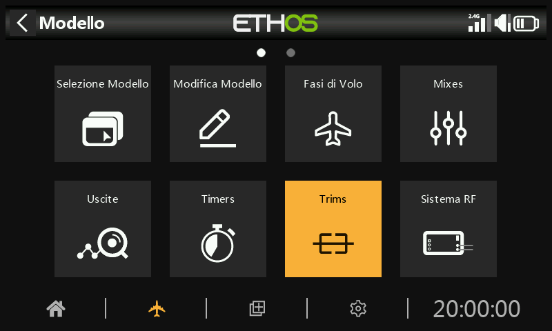

La sezione Trims ti permette di configurare l'intervallo di trim e la dimensione del passo di trim, oppure di configurare un comportamento di trim personalizzato per ciascuno dei 4 stick di controllo. È inoltre possibile configurare i trim incrociati e i trim istantanei.

L'X20 Pro/R/RS e l'X18 hanno due interruttori di trim aggiuntivi T5 e T6, molto utili per le regolazioni in volo.

È possibile configurare ulteriori trim a seconda delle esigenze.

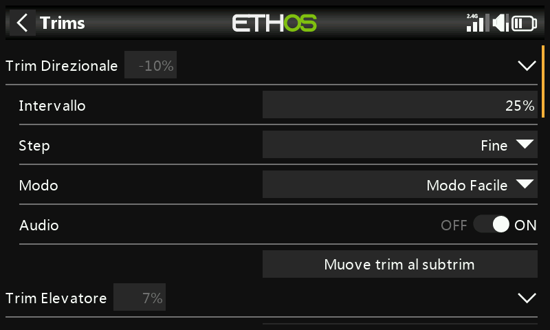

Esiste una serie di impostazioni di trim per ogni stick.

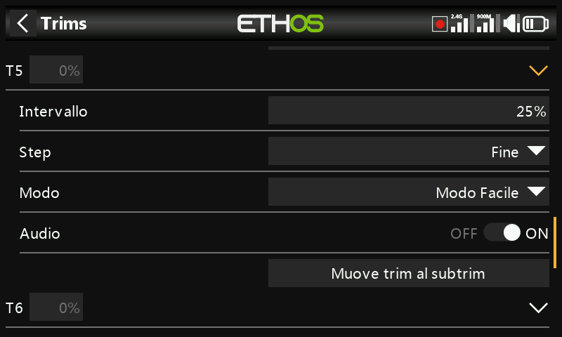

L'X20 Pro e l'x18 hanno due ulteriori versioni T5 e T6.

## Impostazioni del trim

Gamma

L'intervallo di trim predefinito è +/- 25%. La gamma può essere modificata fino a coprire l'intera gamma di stick del 100%. È necessario prestare attenzione a questa opzione, perché se si tengono premuti i trim per troppo tempo si rischia di aggiungere così tanto trim da rendere il modello non volabile.

Nota che sul display principale l'intervallo di trim predefinito viene visualizzato da -100 a 100. Un intervallo di trim del 100% mostrerà da -400 a 400 (cioè 4 volte l'intervallo di trim normale).

Passo

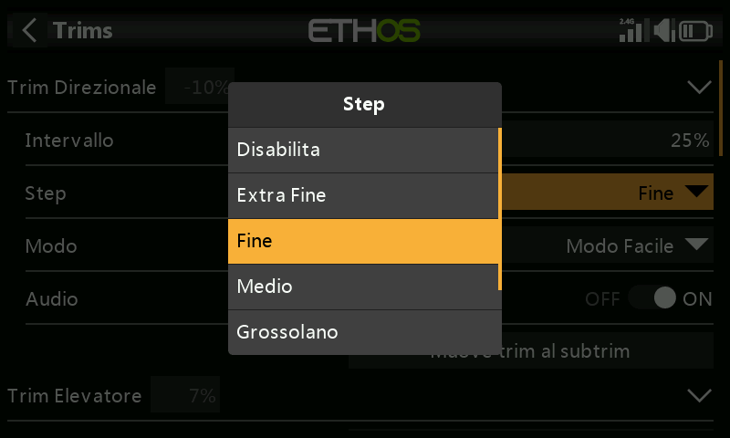

Il parametro della fase di trim consente di disabilitare i trim o di configurare la granularità dei passi del trim, da "Extra fine" a Fine, Medio, Grosso, Esponenziale o Ad Hoc - Personalizzato. L'impostazione Esponenziale prevede passi fini vicino al centro e passi grossolani più lontani. L'impostazione Personalizzata permette di specificare il passo del trim come percentuale.

Con un intervallo predefinito del 25%, i passi del trim per click sono:

Extra fine	0,5us

Fine	1us

Media	2us

Grosso	4us

Esponenziale	Da 0,3us a 16us

Per i trim personalizzati e un intervallo predefinito del 25%, i passi di trim per click sono:

Dimensione del passo 1%	1us

Dimensione del passo 100%	128us per passo

Per i trim personalizzati e un intervallo del 100%, i passi di trim per click sono:

Dimensione del passo 1%	5us

Dimensione del passo 100%	512us per passo

Modalità

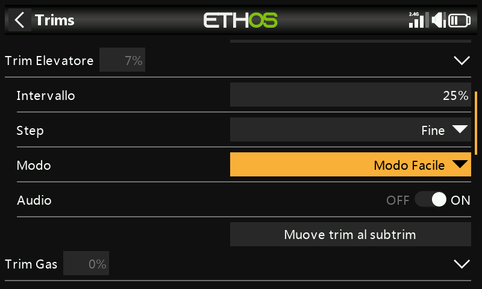

Per impostazione predefinita i trim sono sempre attivi, ma le opzioni di comportamento dei trim possono essere configurate per modificare il comportamento dei trim in base a varie condizioni.

Nota: i trim vengono riportati a 0 quando si cambia modalità.

Esistono quattro modalità di comportamento dell'assetto:

SPENTO

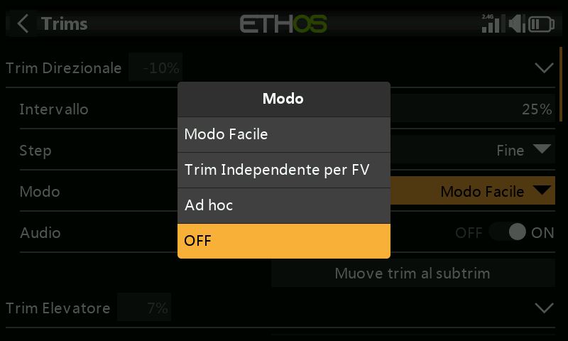

Se la modalità trim è impostata su OFF, il trim è disabilitato.

Ad esempio, nei modelli elettrici il trim del Gas - Throttle non è necessario e può essere disattivato impostando la modalità su OFF. Il trim può quindi essere riutilizzato per regolare una Var; fai riferimento alla sezione "[Trimmeraggio riutilizzato" ](#Repurposed_trim)nella sezione Vars.

Modalità facile

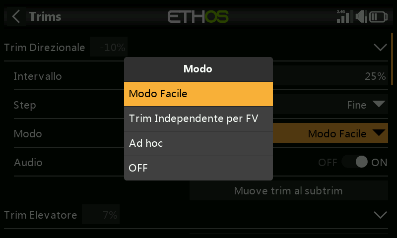

In modalità Easy c'è un solo valore di trim per ogni controllo, quindi il valore di trim è condiviso in tutte le Fasi di volo. Questo è solitamente appropriato per i trim degli alettoni e del timone, dato che questi trim non variano tra le varie Fasi di volo.

Indipendente per Fase di volo

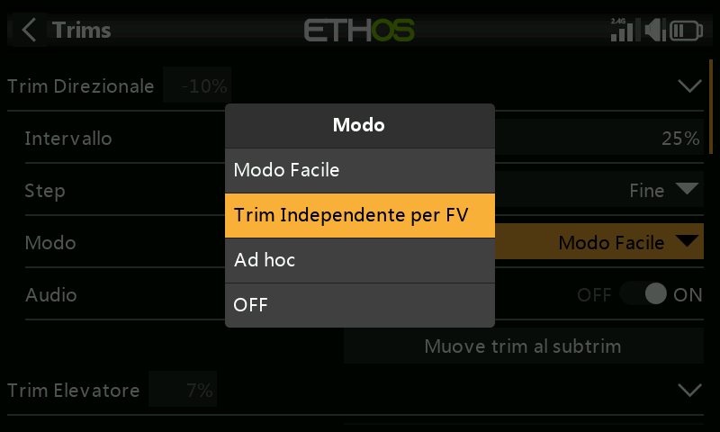

Con l'opzione "Assetto indipendente per Fase di volo", l'assetto influisce solo sulla Fase di volo attiva. Questa opzione viene normalmente utilizzata per il trim dell'elevatore, poiché il trim dell'elevatore richiesto varia in genere per ogni Fase di volo, ad esempio a causa delle differenze di curvatura dell'ala. In effetti, questo è spesso il motivo principale per cui si implementano le Fasi di volo!

Ad Hoc - Personalizzato

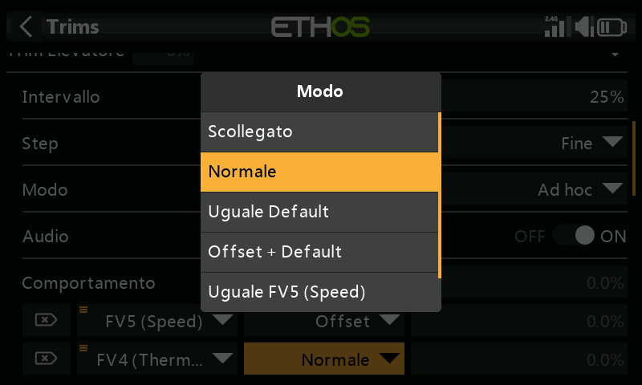

Nella modalità Personalizzata, il comportamento dell'assetto può essere personalizzato

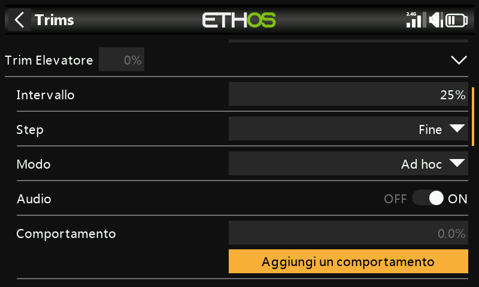

Una volta selezionata la modalità personalizzata, appare una nuova finestra di dialogo "Comportamento". Clicca su "Aggiungi un nuovo comportamento".

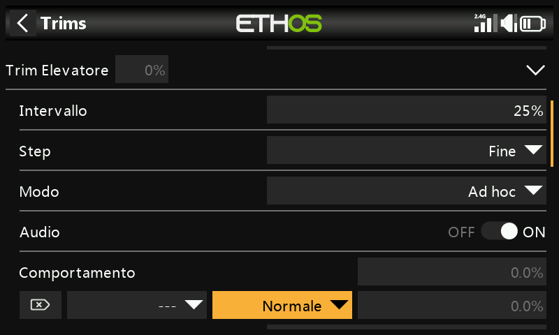

Verrà aggiunta una nuova linea di comportamento.

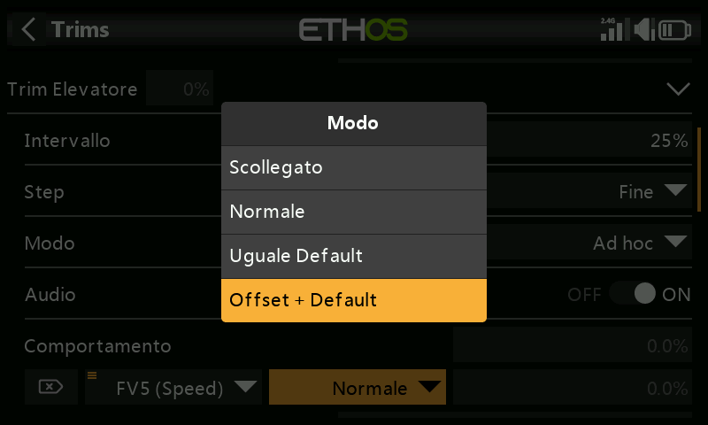

Le opzioni di comportamento iniziali sono:

- Scollegato
- Predefinito
- Valore predefinito uguale 
- Offset + default

Ciascuna delle opzioni è descritta di seguito.

- Disabilita i trim

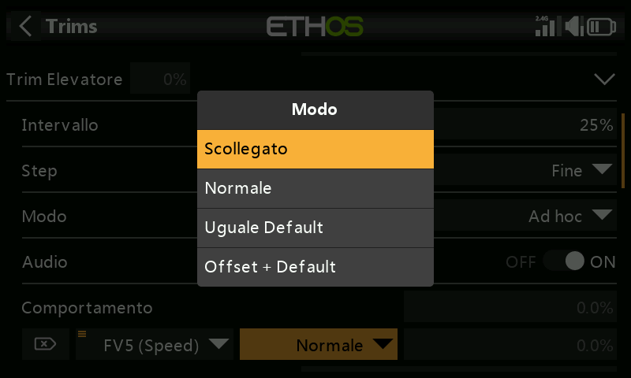

I trim possono essere disabilitati in modo selettivo configurando l'opzione "Scollegato".

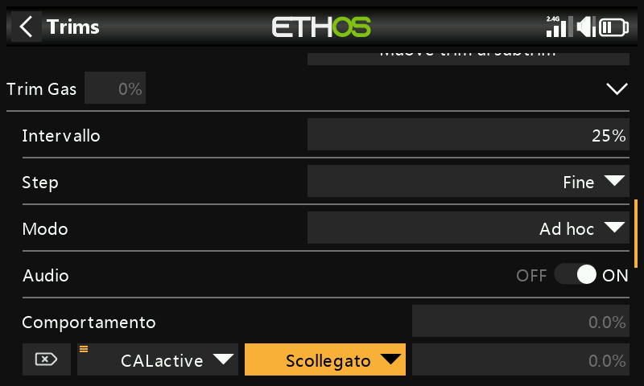

I trim possono essere disattivati selettivamente passando da "Sempre attivo" alla condizione desiderata. Per disabilitare completamente un trim, imposta la Modalità trim su OFF come spiegato sopra.

- Uguale (a un altro assetto)

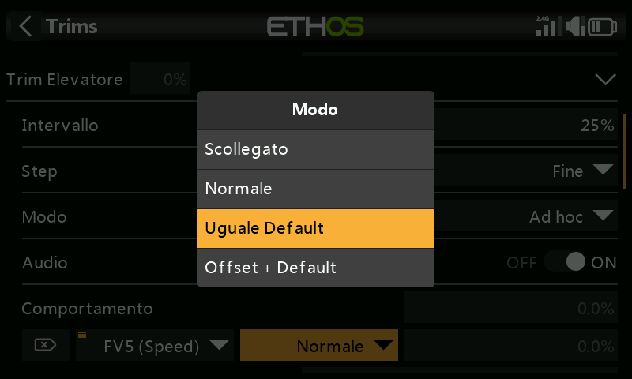

L'assetto di una condizione specifica può essere configurato per essere uguale all'assetto di un'altra condizione.

- Offset + (un altro assetto)

L'assetto di una specifica condizione può essere configurato per essere aggiunto all'assetto di un'altra condizione.

Su molti modelli si vuole avere un trim dell'elevatore di base per quando si vola in modalità predefinita, e poi avere impostazioni di trim dell'elevatore dipendenti per altre Fasi di volo.

Ad esempio, negli alianti la Fase di volo predefinita è quella chiamata Crociera, in cui l'elevatore viene regolato per primo per ottenere un volo livellato.

Poi vuoi che i trim dell'elevatore dipendano da altre Fasi di volo come Velocità e Termica. Aggiungeremo un nuovo comportamento per le modalità Velocità e Termica.

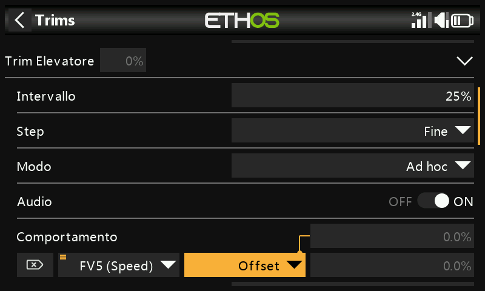

Configuriamo il primo comportamento come "Offset + Default" con la condizione "FM5(Velocità)". Quando viene selezionata la modalità FM5(Speed), qualsiasi regolazione dell'assetto verrà salvata come un offset rispetto al valore dell'assetto della modalità base in FM0(Cruise). Pertanto l'assetto in FM5(Speed) sarà separato ma dipenderà anche dall'assetto di base.

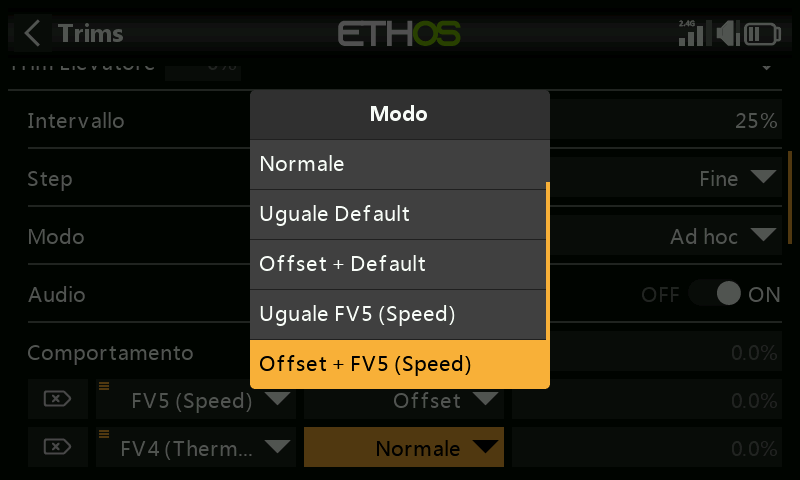

Nota che quando configuriamo il secondo comportamento, nella finestra di dialogo a discesa compaiono le opzioni "FM5(Velocità) uguale" e "Offset + FM5(Termica)". Queste sono dovute al primo comportamento che abbiamo configurato sopra.

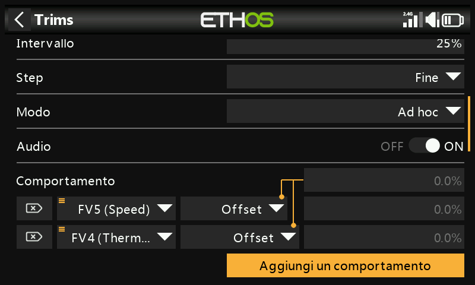

Analogamente al primo, configuriamo il secondo comportamento come "Offset + Default" con la condizione "FM4(Thermal)". Quando viene selezionata la modalità FM4(Thermal), qualsiasi regolazione dell'assetto verrà salvata come un offset rispetto al valore dell'assetto della modalità base in FM0(Cruise). Pertanto, l'assetto in FM4(Thermal) sarà separato ma dipenderà anche dall'assetto di base.

Se poi l'assetto di crociera di base deve essere modificato perché hai alterato il C di G dell'aliante, anche le impostazioni di assetto dipendenti per la velocità e la termica saranno modificate della stessa entità.

Audio

Per ogni Trim l'audio può essere disattivato se gli annunci standard non sono desiderati, ad esempio se la Trim è stata riallestita.

Muove trim al subtrim

Dopo aver regolato il modello per il volo livellato, questa funzione può essere utilizzata per spostare il valore di trim richiesto (ad esempio dell'elevatore) nell'impostazione Subtrim nei canali e reimpostare il trim nella schermata principale sulla posizione zero. In questo modo è facile verificare che i trim di volo non si siano spostati.

L'opzione “Sposta trim su sottotrim” per il trim dell'elevatore avrà “Trim elevatore” selezionato di default. È possibile aggiungere altri trim oppure utilizzare l'opzione principale “Sposta trim su sottotrim” sottostante, che seleziona tutti i trim di default.

## Trim aggiuntivi

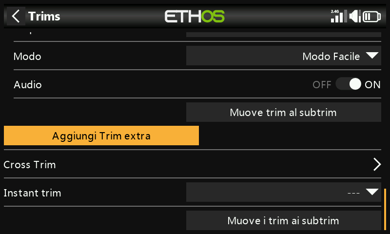

È possibile creare ulteriori Trim toccando il pulsante "Aggiungi una Trim extra".

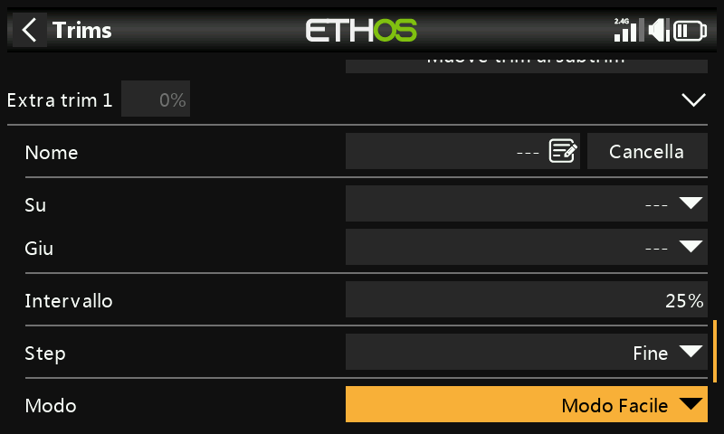

Nome

Il nuovo assetto può essere chiamato così.

Su

Seleziona la sorgente da utilizzare per aumentare il valore del trim.

In basso

Seleziona la sorgente da utilizzare per diminuire il valore del trim.

Gamma

Consulta la descrizione della gamma di trim standard qui sopra.

Passo

Fai riferimento alla descrizione dei passaggi per i trim standard riportata sopra.

Modalità

Fai riferimento alla descrizione per la configurazione del comportamento dei trim standard di cui sopra.

Audio

Per ogni Trim, l'audio può essere disattivato se non si desiderano gli annunci della Trim standard, ad esempio se la Trim è stata riallestita.

## Cross-trim

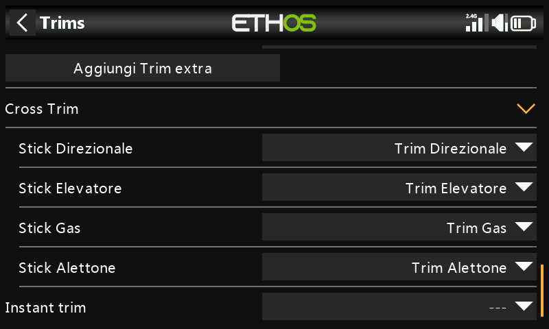

I trim incrociati possono essere impostati per ogni stick di trim, in modo da poter scegliere quale interruttore di trim utilizzare per ogni stick. (I trim T5 e T6 sono disponibili solo su X20 Pro e X18).

## Trim istantaneo

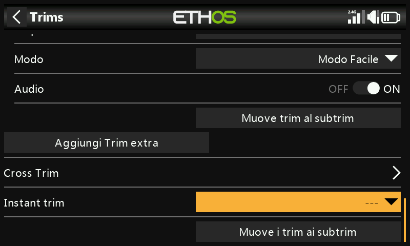

Quando questa funzione diventa attiva, aggiunge le posizioni correnti degli stick ai rispettivi valori di trim per i trim di default (anche i cross trim). È meglio assegnare questa funzione a un interruttore che puoi raggiungere senza lasciare gli stick e che viene utilizzato per impostare istantaneamente i trim mentre voli in linea d'aria. In questo modo si evita di dover premere freneticamente gli interruttori dei trim molte volte se i trim sono molto lontani. Questa impostazione deve essere disattivata dopo il volo di trimming, per evitare di alterare di nuovo i trim per sbaglio.

## Muove i trim ai SubTrim

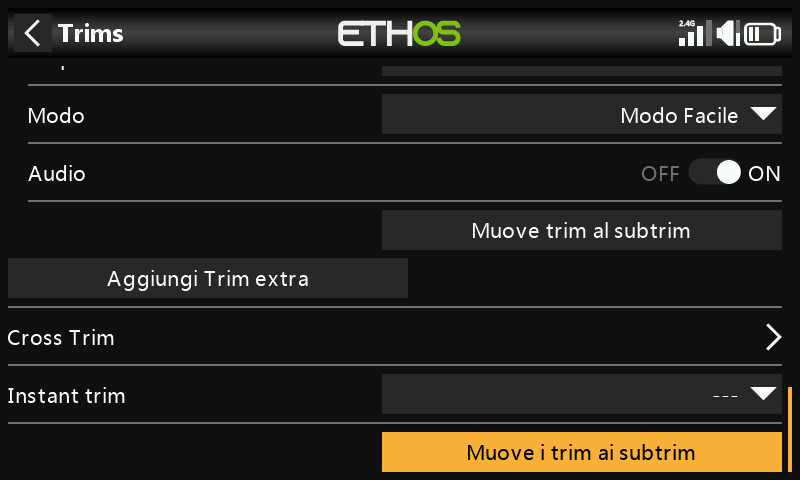

Dopo aver regolato il modello per il volo livellato, questa funzione può essere utilizzata per spostare il valore di trim richiesto (ad esempio dell'elevatore) nell'impostazione Subtrim in Outputs e reimpostare il trim nella schermata principale sulla posizione zero. In questo modo è facile verificare che i trim di volo non si siano spostati.

Controllare i trim da spostare nei sottotrim. È possibile deselezionare il trim dell'acceleratore..

Quando si utilizzano le Fasi di volo, potrebbe essere necessario considerare più di un valore di trim per ciascun canale. Il parametro Subtrim in Outputs è un'impostazione globale che si applica a tutte le Fasi di volo, mentre i valori di trim possono variare a seconda della Fase di volo. Di conseguenza, lo spostamento del trim in una Fase di volo nel Subtrim globale potrebbe richiedere la regolazione dei trim delle altre Fasi di volo. Pertanto la funzione prenderà il trim della Fase di volo attualmente selezionata, trasferirà il suo contenuto al subtrim, resetterà il trim e regolerà tutti gli altri trim interessati delle Fasi di volo. Alla fine della giornata le posizioni delle superfici di controllo in ogni Fase di volo dovrebbero essere le stesse di prima dell'operazione “Trims ai subtrims”.

Valori di trim o subtrim elevati possono avere un effetto negativo a causa delle conseguenti corse molto asimmetriche. Sarebbe più saggio correggere il problema meccanicamente. Occorre fare ogni sforzo per avere 90 gradi ai leveraggi quando le superfici sono in posizione neutra, ad eccezione dei flap dove si sacrifica la corsa in direzione verso l'alto per massimizzare la corsa in direzione verso il basso. Dopo aver avvicinato il più possibile i collegamenti a 90 gradi, si dovrebbe usare il PWM Center per portarli esattamente a 90 gradi.

Non c'è problema a ripetere i trim ai subtrim, ma si dovrebbe essere coerenti e farlo sempre nella stessa Fase di volo, cioè la Fase di volo “base”. Ad esempio, su un aliante la Fase di volo Cruise è solitamente la modalità base e quella da regolare per prima.
