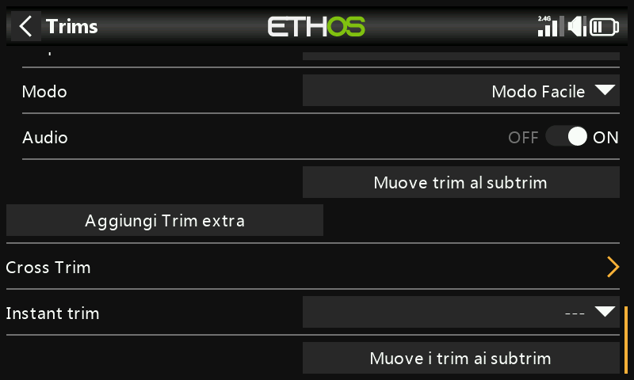

# Trim

Consente di configurare per ogni stick l'escursione del trim, l'ampiezza
del passo e il comportamento, oltre al cross trim e al trim istantaneo.
Le radio **X20 Pro/R/RS** e **X18** dispongono di due interruttori di trim
aggiuntivi, **T5**/**T6**, utili per regolazioni in volo oltre ai quattro
stick principali:

Ogni stick dispone di un proprio set indipendente di impostazioni di trim.

## Impostazioni dei trim {: #trim-settings }

- **Range** — di default ±25%, regolabile fino all'escursione completa
  dello stick, ±100%. Sulla schermata principale, un trim con escursione
  predefinita indica valori da −100 a 100; un trim a escursione completa
  (100%) indica valori da −400 a 400 (4× l'escursione normale).

  !!! warning
      Ampliando l'escursione, tenere premuta troppo a lungo una levetta di
      trim può introdurre un trim tale da rendere il modello impilotabile.

- **Step** — granularità dell'interruttore di trim: **Extra fine**,
  **Fine**, **Medium**, **Coarse**, **Exponential** (fine in prossimità
  del centro, grossolano allontanandosi) oppure **Custom** (una
  percentuale specifica per ogni clic).

  

  | Step | µs per clic (range 25%) |
  |---|---|
  | Extra fine | 0.5 |
  | Fine | 1 |
  | Medium | 2 |
  | Coarse | 4 |
  | Exponential | 0.3–16 |

  Custom, con range al 25%: passo 1% = 1µs/clic, passo 100% = 128µs/clic.
  Con range al 100%: passo 1% = 5µs/clic, passo 100% = 512µs/clic.

## Mode

Per impostazione predefinita un trim è sempre attivo, ma **Mode** ne
modifica il comportamento. Il cambio di modalità azzera il trim.

- **OFF** — disabilita completamente il trim.

  

  Utile, ad esempio, su un modello elettrico che non necessita del trim
  del gas: il comando di trim così liberato può essere
  [riutilizzato per regolare una Var](variables.md).

- **Easy** — un unico valore di trim condiviso tra tutte le fasi di volo.
  È la scelta abituale per alettoni e timone, poiché raramente devono
  variare in funzione della fase di volo.

  

- **Independent per flight mode** — il trim agisce solo sulla fase di volo
  attiva. È la scelta abituale per il trim di profondità, poiché tale trim
  deve comunemente differire in base alla fase di volo (ad es. variazioni
  di curvatura alare): anzi, spesso questo è il motivo principale per cui
  si configurano le fasi di volo.

  

- **Custom** — comportamento completamente personalizzato, costruito
  tramite i **behaviors** (comportamenti) che si aggiungono manualmente.

### Comportamenti di trim personalizzati

Ogni riga di comportamento presenta una condizione e una delle seguenti
opzioni:

- **Unplugged** — disabilita il trim in modo selettivo in presenza di
  questa condizione (anziché disattivarlo del tutto con Mode = OFF).

  
  

- **Normal** (predefinito) — comportamento di trim ordinario.
- **Equal (to another trim)** — questo trim replica esattamente il valore
  di trim di un'altra condizione.

  

- **Offset + (another trim)** — questo trim viene sommato al valore di
  trim di un'altra condizione.

  

**Esempio pratico** — un aliante con un trim di profondità base **Cruise**
e trim dipendenti per **Speed** e **Thermal**:

1. Trimmare per il volo livellato nella fase di volo predefinita (Cruise).
2. Aggiungere un comportamento: **Offset + Default**, condizione `FM5(Speed)`.
   Ora qualsiasi regolazione di trim effettuata in modalità Speed viene
   salvata come offset rispetto al valore base Cruise: separato, ma comunque
   dipendente da esso.

   

3. Aggiungere allo stesso modo un secondo comportamento: **Offset + Default**,
   condizione `FM4(Thermal)`. (Una volta creato il primo comportamento, la
   finestra propone anche le opzioni `Equal FM5(Speed)` e
   `Offset + FM5(Thermal)`, poiché ora può fare riferimento anche a quel
   comportamento.)

   

Con questa configurazione, modificando in seguito il trim base Cruise (ad
esempio dopo una variazione del baricentro) i trim di Speed e Thermal si
spostano automaticamente della stessa quantità, poiché sono offset rispetto
ad esso e non valori indipendenti.

- **Audio** — consente di disattivare l'annuncio standard del trim per un
  trim riutilizzato ad altro scopo, qualora non abbia più senso ascoltarlo.

## Trim aggiuntivi

**Add an extra trim** crea un trim oltre ai quattro stick standard (e a
T5/T6): **Name**, sorgenti **Up**/**Down** che lo comandano, oltre alle
stesse opzioni **Range**, **Step**, **Mode** e **Audio** viste sopra.

## Cross trim

Designa quale interruttore di trim regola effettivamente ciascuno stick,
ossia consente di comandare il trim di uno stick con un comando fisico di
trim diverso da quello abituale. (T5/T6 sono disponibili solo su X20 Pro e
X18.)

## Trim istantaneo {: #instant-trim }

Quando è attivo, somma le posizioni correnti degli stick ai corrispondenti
trim predefiniti (e cross). È preferibile assegnarlo a un interruttore
raggiungibile senza lasciare gli stick: attivandolo in volo rettilineo e
livellato si impostano i trim istantaneamente, invece di premere
ripetutamente una levetta di trim quando i trim sono molto fuori
regolazione. Disabilitarlo nuovamente al termine del volo di trimmaggio,
per evitare di alterare accidentalmente i trim in seguito.

!!! note
    Il trim istantaneo è attivo solo mentre è visualizzata una delle viste
    principali.

## Sposta i trim nei subtrim

Dopo aver trimmato per il volo livellato, questa funzione sposta il valore
di trim di un canale (ad es. profondità) nella relativa impostazione
[Subtrim](outputs.md) e riporta a zero il trim visualizzato a schermo: un
modo pulito per verificare che i trim di volo non siano variati nel
frattempo.

Quando sono coinvolte le fasi di volo, un canale può avere più di un valore
di trim rilevante, mentre il Subtrim nelle Uscite è un'unica impostazione
globale valida per tutte le fasi di volo. La funzione ne tiene conto:
preleva il trim della fase di volo **attualmente selezionata**, lo sposta
nel Subtrim, azzera quel trim e regola di conseguenza i trim di *tutte le
altre* fasi di volo sullo stesso canale — in modo che la posizione effettiva
della superficie resti complessivamente invariata in ogni fase di volo.

!!! tip
    Eseguire sempre questa operazione dalla stessa fase di volo "base" (ad
    es. Cruise su un aliante) per garantire coerenza: rispettando questa
    regola può essere ripetuta in sicurezza.

Valori elevati di trim o subtrim generano escursioni molto asimmetriche: è
preferibile risolvere la causa all'origine per via meccanica. Puntare ad
avere i rinvii a 90° con le superfici in posizione neutra (fanno eccezione i
flap, dove si sacrifica parte della corsa verso l'alto a favore di una
maggiore corsa verso il basso), quindi usare **PWM center** per la
regolazione fine fino a ottenere esattamente 90° una volta che il rinvio è
prossimo alla posizione corretta.
