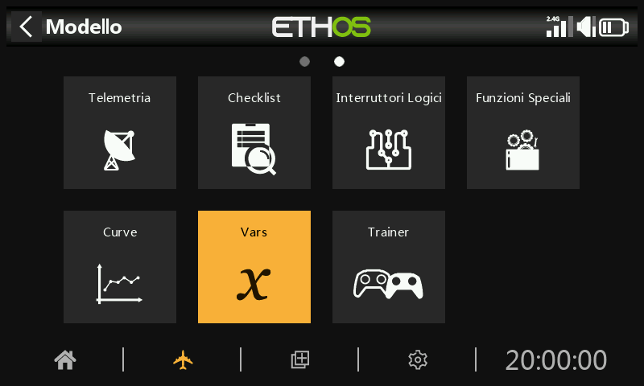

# Variabili (Vars)

Le variabili (Vars) possono essere utilizzate per nominare e memorizzare i parametri di impostazione di un modello in modo da potervi fare riferimento in altri punti della programmazione radio, compresi i mix. Le Vars possono essere considerate come dei contenitori di informazioni.

Sono stati separati in una sezione a sé stante, il che consente una separazione netta tra i dati di configurazione di un modello e la logica di programmazione. Questo significa che puoi centralizzare tutte le impostazioni di configurazione in un unico posto con nomi significativi, dove possono essere trovate e modificate facilmente, senza dover saltare tra decine di mix o altre voci di configurazione e scorrere fino al parametro pertinente.

Le Var possono contenere valori fissi (cioè costanti) oppure possono essere regolabili con limiti definibili dall'utente per evitare che valori errati possano causare un crash. Ogni Var può contenere più valori a seconda delle condizioni attive (come le Fase di volo) configurate. È possibile configurare delle azioni per alterare il loro valore, come ad esempio utilizzare un trim riattualizzato come regolatore in volo, oppure utilizzare azioni di addizione/sottrazione/moltiplicazione/divisione pilotate dagli input. Le vars sono persistenti tra le sessioni.

Le vars sono estremamente utili anche quando è auspicabile avere un valore di regolazione da utilizzare in più punti. Ad esempio, un aliante può avere alettoni divisi su ogni ala, in modo da utilizzare quelli interni come flap durante l'atterraggio. Tuttavia, durante il volo normale tutte e quattro le superfici agiscono come alettoni e quindi dovrebbero condividere un'impostazione comune del differenziale per contrastare l'imbardata avversa durante la virata, cosa che può essere ottenuta utilizzando un Var.

Le vars possono essere sostituiti al normale valore numerico in tutti i parametri con la funzione "Opzioni", identificata dall'icona del menu (simbolo dell'hamburger). Consulta la sezione dedicata alla [funzione Opzioni](../getting-started/user-interface-and-navigation.md).

Sono disponibili 64 vars.

Tocca il pulsante "+" per aggiungere un nuovo Var.

Toccando un elenco di Var si apre una finestra di dialogo che ti permette di modificare, spostare, clonare o eliminare la Var evidenziata.

## Aggiunta di vars

Valore

Visualizza il valore attuale della Var.

Nome

Permette di dare un nome al Var.

Commento

È possibile aggiungere un commento che ne spieghi l'uso o la funzione, per facilitare la comprensione.

Gamma

I limiti basso e alto di un intervallo possono essere impostati con un decimale entro il +/- 500% per mantenere il valore del Var entro limiti definiti.

Valori

Valori fissi

Le vars possono contenere un singolo valore fisso (cioè una costante) con un decimale, come nell'esempio precedente.

Valori multipli o variabili

Seleziona "Aggiungi nuovo valore" per aggiungere un nuovo valore a un Var.

Ogni Var può contenere più valori a seconda delle condizioni attive (come le Fasi di volo) configurate. Nell'esempio precedente, mentre è attiva la Fase di volo Thermal FM4, la Var12 ha un valore del 9%. Quando è attiva la Fase di volo Speed FM5, la Var12 avrà un valore di -3%.

Si noti che è stato impostato un intervallo tra -10% e +15% per evitare valori superiori a quelli desiderati.

I vars sono persistenti tra le sessioni.

Azioni

Possono essere aggiunte azioni di tipo var, ad esempio per riutilizzare i ritagli o per eseguire calcoli.

Riassegnazione Trim (recupero)

Una dei trim può essere riutilizzata per regolare il valore di un Var.

Nell'esempio precedente, è stata definita un'azione per riutilizzare il trim del Gas - Throttle per la compensazione della curvatura solo durante la Fase di volo Atterraggio FM3. È stato impostato un intervallo tra 0 e 25% per mantenere il Var tra limiti ragionevoli. È possibile definire un valore di passo di trim con un decimale, ad esempio 1,0% nell'esempio precedente.

i trim riutilizzate sono riutilizzate solo per quella specifica condizione attiva. In tutti gli altri momenti funzionano secondo le loro normali funzioni.

Azioni aritmetiche

Le azioni possono anche essere impostate su:

- Assegna un valore specifico alla Var
- Aggiungi(+) alla Var
- Sottrai(-) dalla Var
- Moltiplica(\*) la Var per il parametro
- Dividi(/) il Var per il parametro
- Applica una percentuale al Var
- Min
- Max

Le azioni sono guidate dagli input.

Nell'esempio precedente, l'interruttore di funzione FS3(edge) assegnerà un valore di 40% alla Var, mentre FS1(edge) aumenterà il suo valore di 2 a ogni pressione del pulsante fino a raggiungere il massimo dell'intervallo e FS2(edge) diminuirà il suo valore di 2 fino a raggiungere il minimo dell'intervallo. Tieni presente che l'opzione Edge deve essere selezionata (premendo a lungo il tasto FS) in modo che l'azione venga eseguita solo quando l'interruttore di funzione cambia stato.

## Rimuovi VARS

La rimozione di un VAR convertirà contemporaneamente tutti i suoi utilizzi nel valore VAR.
