# Variabili

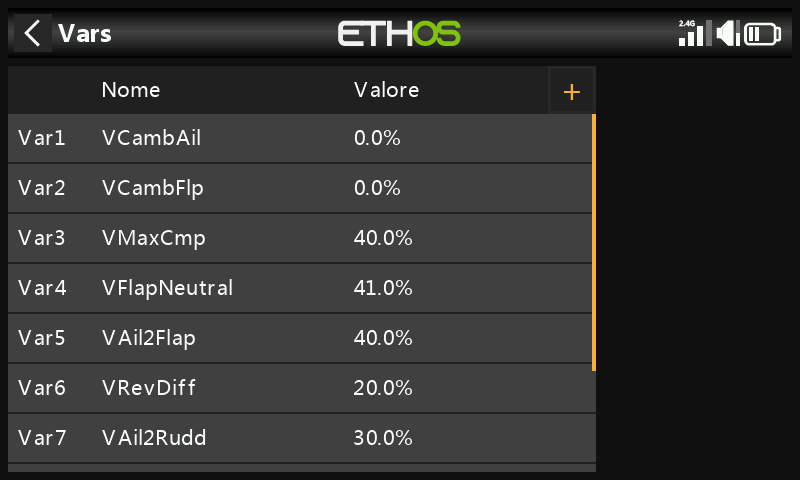

Le variabili ("Vars") sono contenitori con nome per i valori delle
impostazioni proprie di un modello, richiamabili in qualunque altro punto
della programmazione — [mix](mixes.md) inclusi. Tenerle in una sezione
dedicata separa i *dati di configurazione* di un modello dalla sua
*logica di programmazione*: invece di passare in rassegna decine di mix
per trovare e modificare un valore, tutto risiede in un unico punto con
un nome significativo. Sono disponibili 64 Vars; nessuna esiste per
impostazione predefinita. Aggiungine una con **+**; tocca una Var
esistente per **Modifica**/**Sposta**/**Copia**/**Clona**/**Elimina**.

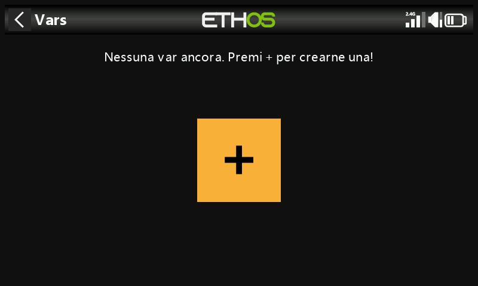

Una Var può contenere una costante fissa, oppure essere regolabile entro
limiti definiti dall'utente (per evitare che valori errati provochino un
incidente), e può assumere un valore *diverso* per ciascuna condizione
attiva (ad esempio per fase di volo). I valori sono persistenti tra una
sessione e l'altra. Una Var sostituisce qualsiasi valore numerico
ordinario ovunque sia disponibile la [funzione
Opzioni](../getting-started/user-interface-and-navigation.md#the-options-feature)
(i campi con l'icona a hamburger).

!!! example
    Un aliante con alettoni divisi (le sezioni interne fungono anche da
    flap di atterraggio) richiede un'unica impostazione condivisa di
    differenziale alettoni da usare ovunque tutte e quattro le superfici
    agiscano come alettoni — una Var che contiene quell'unico valore,
    richiamata da ogni mix pertinente, lo mantiene coerente e fa sì che
    debba essere regolato in un solo punto.

## Aggiungere una Var

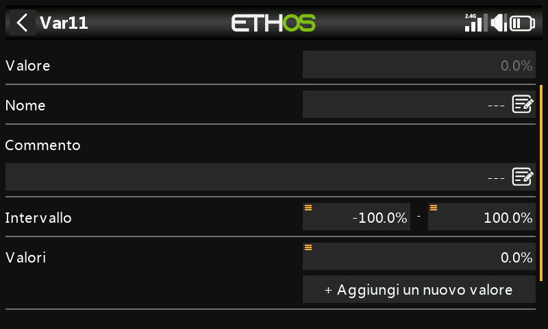

- **Valore** — valore corrente (visualizzazione in sola lettura).
- **Nome** — modificabile.
- **Commento** — testo libero che ne spiega lo scopo.
- **Intervallo** — limiti inferiore/superiore (un decimale, entro ±500%)
  che il valore della Var non può mai superare.

### Valori

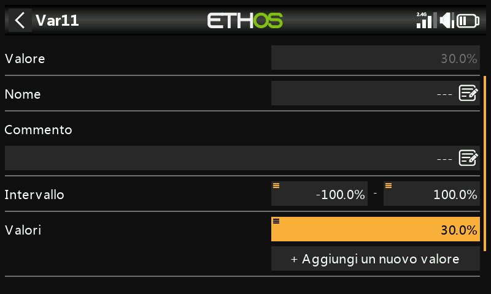

- **Fisso** — una singola costante, con un decimale.
- **Multiplo/variabile** — **Aggiungi nuovo valore** associa un valore a
  ciascuna condizione attiva. Ad esempio `Var12` vale 9% mentre è attiva
  la fase di volo Thermal (FM4), e −3% mentre è attiva Speed (FM5), con
  l'intervallo limitato a −10%…+15% affinché nessuno dei due possa
  eccedere valori sensati:

  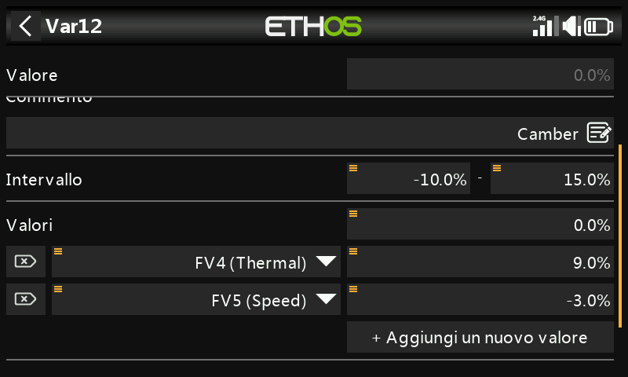
  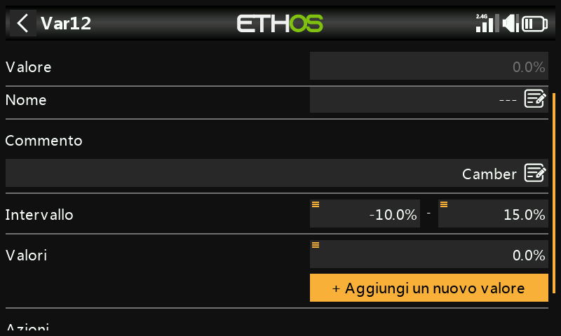

### Azioni

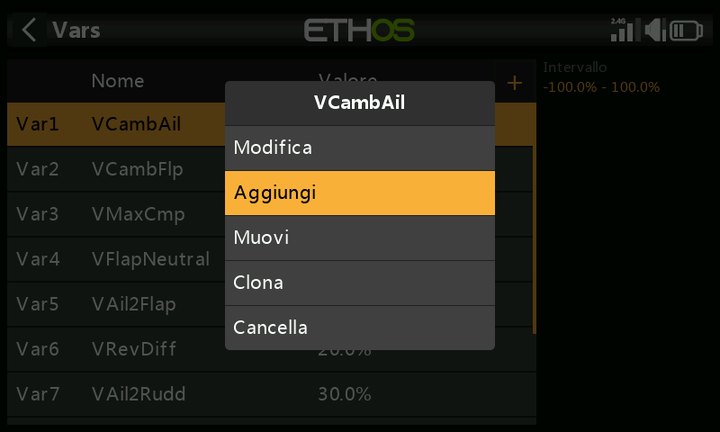
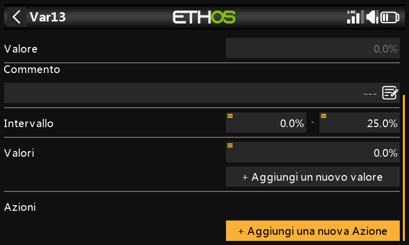

Le azioni modificano nel tempo il valore di una Var, pilotate da un
ingresso.

**Trim riassegnato** — affida uno dei trim fisici alla regolazione di
questa Var anziché alla sua funzione normale, in genere vincolato a una
sola condizione attiva:

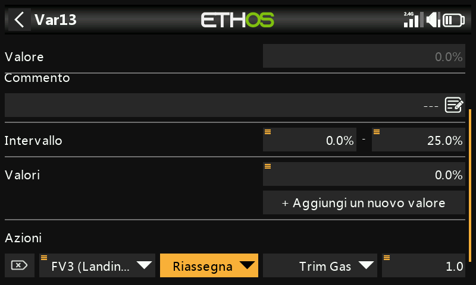
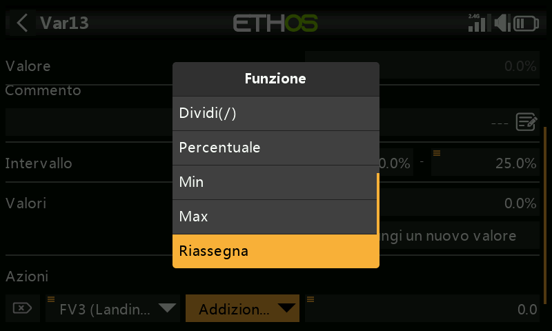

!!! example
    Riassegna il trim del gas alla regolazione di una Var di
    compensazione del camber, ma solo mentre è attiva la fase di volo
    Landing (FM3), con intervallo 0–25% e un passo dell'1,0% per scatto.
    Al di fuori di quella condizione attiva, il trim torna
    automaticamente alla sua funzione ordinaria.

**Azioni aritmetiche** — pilotate da qualsiasi ingresso:

- **Assegna** — imposta la Var a un valore specifico.
- **Somma** / **Sottrai** / **Moltiplica** / **Dividi** — operazioni
  aritmetiche sul valore corrente.
- **Percentuale** — applica una percentuale dell'ingresso pilotante.
- **Min** / **Max** — limita la Var rispetto all'ingresso pilotante.

  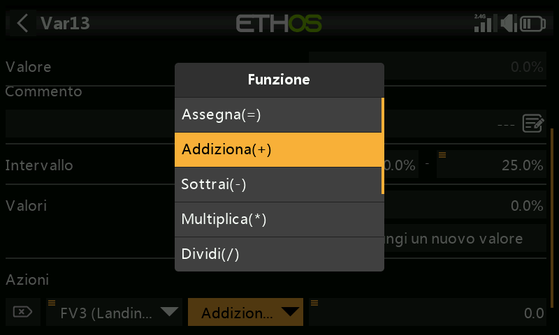

!!! example
    `FS3(edge)` assegna direttamente 40% a una Var; `FS1(edge)` somma 2 a
    ogni pressione (limitato al massimo dell'intervallo); `FS2(edge)`
    sottrae 2 a ogni pressione (limitato al minimo dell'intervallo).
    L'opzione **Edge** (pressione prolungata sull'interruttore funzione)
    è importante in questo caso — senza di essa, l'azione verrebbe
    rieseguita continuamente per tutto il tempo in cui l'interruttore
    resta premuto, anziché una volta per ogni pressione.

  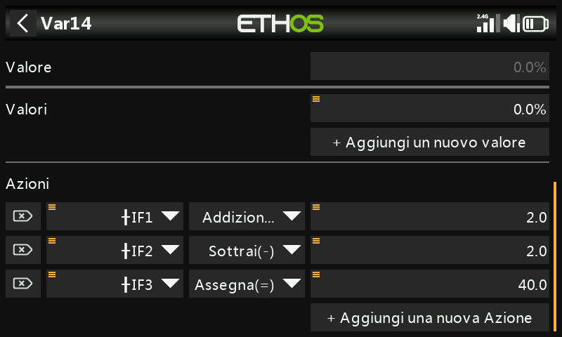
