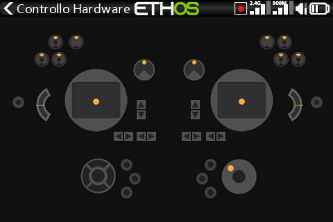

# X18S

Differenze rispetto alla radio di riferimento X20S su cui è basato questo manuale:

- **Memoria** — una eMMC interna da 8GB di serie (a cui è possibile affiancare una SD card esterna), come sulle X20 Pro/R/RS — vedi [Impostazioni di sistema →
  Generale → Posizione di
  memorizzazione](../system-setup/general.md#storage-location-x18-and-x20-prorrs)
  e [Gestione file](../system-setup/file-manager.md).
- **Trim aggiuntivi** — come sulle X20 Pro/R/RS, aggiunge gli interruttori di trim **T5** e
  **T6** oltre ai quattro standard — vedi
  [Trim](../model-setup/trims.md#trim-settings).
- La **[verifica hardware](../system-setup/hardware.md#hardware-check)** e
  l'[ispettore dei valori ADC](../system-setup/hardware.md#adc-value-inspector)
  includono di conseguenza i trim T5/T6 nei rispettivi controlli.
