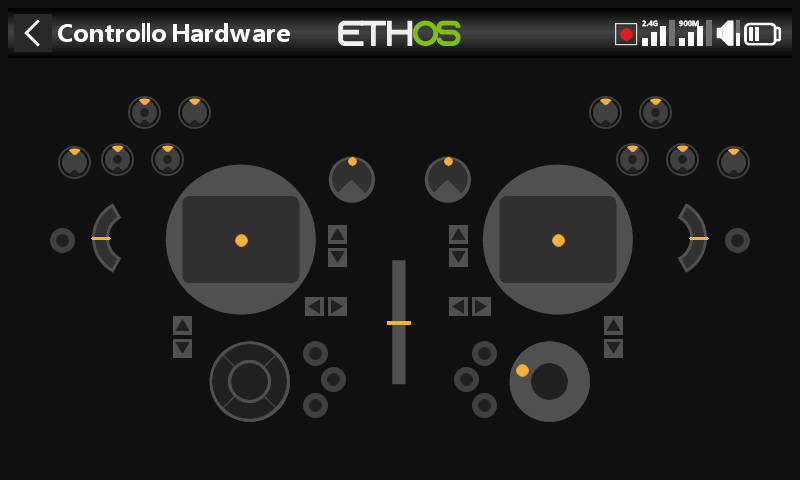

# X20 Pro / X20 Pro AW

Differenze rispetto alla configurazione di riferimento X20S su cui è basato questo manuale —
si applicano alla **X20 Pro** e, in gran parte, anche alla **X20 Pro AW**
e alla famiglia **X20R/RS**.

- **Memoria** — eMMC interna da 8GB di serie, SD card opzionale — vedere
  [Generale → Posizione di
  archiviazione](../system-setup/general.md#storage-location-x18-and-x20-prorrs).
- **Trim aggiuntivi** — aggiunge gli interruttori di trim **T5** e **T6** — vedere
  [Trim](../model-setup/trims.md#trim-settings).
- **Interruttori aggiuntivi** — due pulsanti a ritenuta, **K** e **L**,
  sulle spalle posteriori, più le posizioni di interruttore **M**/**N** se cablate
  (tipicamente interruttori all'estremità degli stick) — vedere [Hardware →
  Interruttori](../system-setup/hardware.md#switches-settings).
- **Potenziometri aggiuntivi** — **Ext1**/**Ext2**, tipicamente utilizzati con gimbal a 3 assi
  — vedere [Hardware → Pot/Slider](../system-setup/hardware.md#potssliders-settings).
  Ciò modifica l'indice dell'[ispettore dei valori ADC](../system-setup/hardware.md#adc-value-inspector):
  Ext1/Ext2 si collocano tra Pot2 e gli slider.
- **Feedback aptico** — la **X20 Pro AW** e la **X20RS** sono fornite con gimbal MC20R
  dotati di motori aptici (stick-shaker) integrati; una **X20 Pro** o
  una **X20R** possono ottenere la stessa funzione tramite l'aggiornamento retrofit con gimbal MC20R,
  abilitabile in [Hardware → Abilitazione degli aggiornamenti a gimbal
  aptici](../system-setup/hardware.md#radio-specific-hardware-options).
  Una volta abilitata, [Seleziona motori
  aptici](../model-setup/special-functions.md#actions) offre le opzioni Predefinito,
  Tutti i motori, Stick sinistro o Stick destro.
- **Encoder rotativo** — la X20 Pro AW e le X20R/RS utilizzano un encoder più sensibile;
  l'opzione **mezzi passi** in [Hardware → Opzione
  encoder](../system-setup/hardware.md#radio-specific-hardware-options)
  ne attenua la sensibilità.
- **Modulo RF interno** — le X20 Pro/R/RS utilizzano il modulo **TD-ISRM Pro**
  (compatibile LoRa, con modalità tandem dual-band e TD-Pro oltre a
  ACCESS/ACCST D16), anziché il modulo TD-ISRM presente nelle
  X18/X20/X20S/X20HD — vedere [Sistema RF](../model-setup/rf-system.md).
