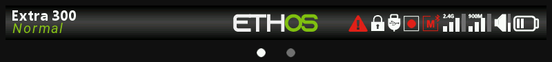

# Barre degli strumenti

Due barre permanenti incorniciano ogni schermata di Ethos, sia la schermata principale sia i menu.

## Barra superiore

Mostra, da sinistra a destra: il nome e l'icona del modello corrente, lo stato del collegamento RF, l'RSSI,
la batteria/tensione della radio e del ricevitore e l'ora — configurabili in
[Configurazione del sistema — Generale](../system-setup/general.md).

## Barra inferiore

Una visualizzazione in tempo reale dei canali di uscita in formato grafico a barre — le stesse informazioni fornite dal
[widget Canali](../displays/index.md#widget-types), sempre disponibile
indipendentemente dalla schermata attiva.
