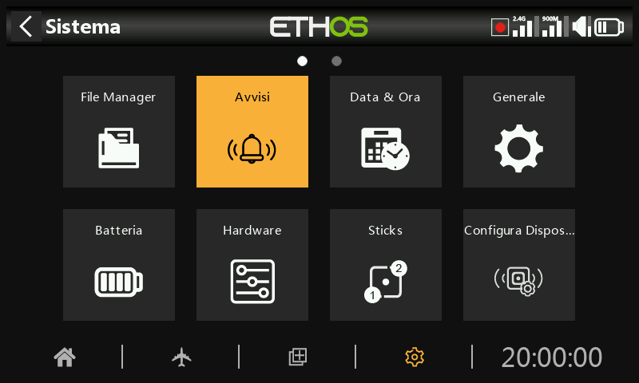

# Avvisi

Gli avvisi di sistema sono:

## Modalità silenziosa

All'avvio verrà emesso un avviso di "modalità silenziosa" quando il controllo "modalità silenziosa" è attivo e la "modalità audio" è stata impostata su Silenzioso in Sistema / Generale / [Modalità audio.](general.md)

## Tensione principale

L'avviso vocale "La batteria della radio è scarica" viene emesso quando il controllo "Tensione principale" è attivo e la batteria della radio principale è al di sotto della soglia impostata nel parametro "Bassa tensione" in Sistema / Batteria.

## ***Tensione*** RTC

L'avviso vocale "La batteria RTC è scarica" viene emesso quando il controllo "Tensione RTC" è attivo e la batteria RTC è inferiore a 2,5 V, la soglia predefinita della batteria RTC. L'avviso può essere spento fino alla sostituzione della batteria RTC, ma non deve essere lasciato spento a tempo indeterminato. L'ora reale viene utilizzata per la registrazione dei dati e un'ora non valida causerà difficoltà nella lettura dei registri, soprattutto nel distinguere le sessioni di volo.

## Avviso di conflitto tra sensori

Il rilevamento dei conflitti tra sensori può essere disabilitato. Questo dovrebbe essere necessario solo se hai dei sensori che non soddisfano le specifiche S.Port.

## Inattività

Un avviso vocale di "Inattività prolungata" verrà emesso quando la radio non viene utilizzata per un periodo superiore al tempo di "Inattività" e anche un avviso aptico nel caso in cui il volume della radio venga abbassato. Il valore predefinito è di 10 minuti.
