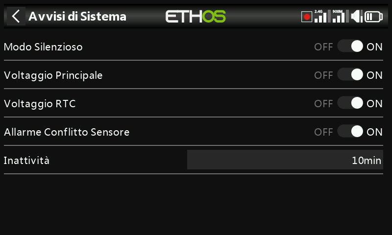

# Avvisi

Quattro avvisi validi per l'intera radio, ciascuno attivabile in modo indipendente — distinti dalle [funzioni speciali](../model-setup/special-functions.md) e dagli [interruttori logici](../model-setup/logical-switches.md) specifici di ogni modello che si configurano manualmente.

- **Modalità silenziosa** — un avviso vocale all'avvio quando questo controllo è attivo e [Generale → Modalità audio](general.md) è impostata su Silenzioso, per ricordare che la radio è muta.
- **Tensione principale** — "Batteria radio scarica" quando la tensione della batteria principale della radio scende al di sotto della soglia di **Bassa tensione** impostata in [Batteria](battery.md).
- **Tensione RTC** — "Batteria RTC scarica" quando la batteria a bottone dell'RTC scende al di sotto di 2,5 V (la soglia predefinita). La registrazione dei dati dipende dall'orologio in tempo reale (RTC); un orario non valido rende difficile la lettura dei log, in particolare la distinzione tra le diverse sessioni di volo. Questo avviso può essere silenziato temporaneamente in attesa di sostituire la batteria, ma non dovrebbe restare disattivato a tempo indeterminato.
- **Avviso conflitto sensori** — rileva ID di sensori di telemetria in conflitto. Conviene disattivarlo solo se si utilizzano sensori non conformi alla specifica S.Port.
- **Inattività** — un avviso vocale "Inattività prolungata" (accompagnato da una vibrazione, nel caso in cui il volume sia basso) dopo che la radio è rimasta inutilizzata per un tempo superiore a quello impostato — 10 minuti per impostazione predefinita.
