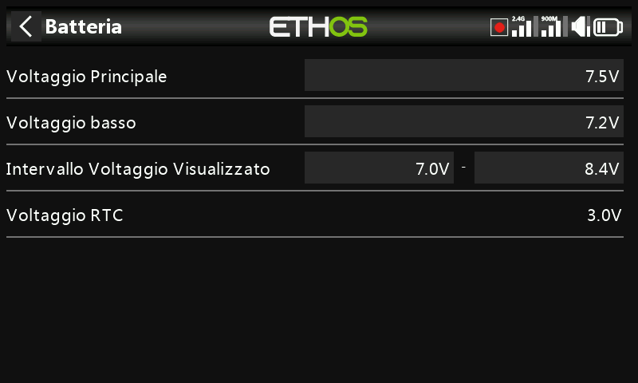

# Batteria

Serve per calibrare la lettura della batteria interna della radio e impostare
le soglie di allarme — funzione distinta dalle impostazioni del pacco batteria
del modello (vedi [Guida pratica: avviso di tensione batteria bassa](../how-to/low-battery-warning.md)).

- **Tensione principale** — visualizza la tensione attuale della batteria, ma
  è anche la regolazione della calibrazione: puoi inserire la tensione
  effettiva della batteria misurata con un multimetro. Il valore predefinito è
  8,4V per una batteria al litio a 2 celle carica.
- **Bassa tensione** — è la tensione di soglia dell'allarme, con valore
  predefinito 7,2V (un valore di 7,4V offre un ulteriore margine di
  sicurezza). Quando l'opzione [Tensione principale](alerts.md) è attivata,
  se la tensione scende al di sotto di questa soglia verrà visualizzata una
  finestra di dialogo di avviso e ogni minuto verrà emesso un messaggio vocale
  "Batteria radio scarica", anche se la finestra di avviso è aperta.

  !!! warning
      Quando viene dato questo allarme, è prudente atterrare e ricaricare la
      batteria della radio! L'avviso viene ripetuto ogni minuto in ogni caso.
      Quando la tensione scende a 6,0V, la radio si spegne comunque per
      proteggere le celle agli ioni di litio (2 x 3,0V).

- **Intervallo di tensione del display** — i valori min/max della
  visualizzazione grafica della batteria in alto a destra dello schermo: il
  valore MIN corrisponde al punto in cui si spegne la prima barra, MAX è il
  valore in cui si accende la quarta. I limiti predefiniti per la batteria
  agli ioni di litio integrata sono 6,4–8,4V; molti piloti aumentano la
  tensione di rilevamento inferiore per far scattare prima l'avviso di bassa
  tensione ed evitare di scaricare eccessivamente la batteria. Se la batteria
  viene sostituita con una di tipo diverso, i limiti devono essere impostati
  in modo appropriato.
- **Tensione RTC** — la tensione della batteria a bottone dell'orologio in
  tempo reale (Real Time Clock). È di 3,0V per una batteria nuova; se la
  tensione è inferiore a 2,7V sostituisci la batteria per garantire il
  corretto funzionamento dell'orologio, e al di sotto di 2,5V verrà emesso
  l'[avviso di tensione RTC](alerts.md).
