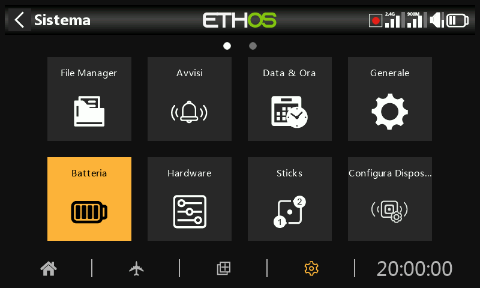

# Batteria

La sezione Batteria serve per calibrare le batterie della radio e impostare le soglie di allarme.

## Tensione principale

Tensione principale" visualizza la tensione attuale della batteria, ma è anche la regolazione della calibrazione della tensione della batteria. Puoi inserire la tensione effettiva della batteria misurata con un multimetro. Il valore predefinito è 8,4V per una batteria al litio a 2 celle carica.

## Bassa tensione

È la tensione di soglia dell'allarme. Il valore predefinito è 7,2V. Un valore di 7,4V offre un ulteriore margine di sicurezza.

L'avviso vocale "La batteria della radio è bassa" viene emesso quando il controllo "Tensione principale" è attivo in Sistema / Avvisi / [Tensione principale ](alerts.md)e la batteria della radio principale è al di sotto della soglia impostata qui.

Attenzione!

Quando viene dato questo allarme, è prudente atterrare e ricaricare la batteria della radio!

Tieni presente che quando la tensione della batteria della radio scende a 6,0V, la radio si spegne comunque per proteggere la batteria agli ioni di litio (2 x 3,0V)!

## Intervallo di tensione del display

Queste impostazioni definiscono il range della visualizzazione grafica della batteria in alto a destra dello schermo. I limiti predefiniti per la batteria agli ioni di litio integrata sono 6,4 e 8,4V. Molti piloti aumentano la tensione di rilevamento inferiore per far scattare prima l'avviso di bassa tensione TX ed evitare di scaricare eccessivamente la batteria TX.

Il valore MIN corrisponde al punto in cui si spegne la prima barra e MAX è il valore in cui si accende la quarta barra quando si utilizza la rappresentazione grafica della tensione della batteria.

Se la batteria viene sostituita con una di tipo diverso, i limiti devono essere impostati in modo appropriato.

## Tensione RTC

Mostra la tensione della batteria RTC (Real Time Clock) della radio. La tensione è di 3,0v per una batteria nuova. Se il voltaggio è inferiore a 2,7v, sostituisci la batteria all'interno della radio per garantire il corretto funzionamento dell'orologio. Se la tensione scende al di sotto di 2,5 V, verrà emesso un avviso; consulta Avvisi / [Tensione RTC](alerts.md).
